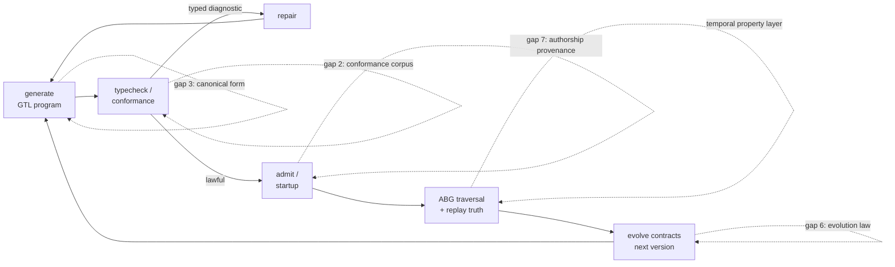
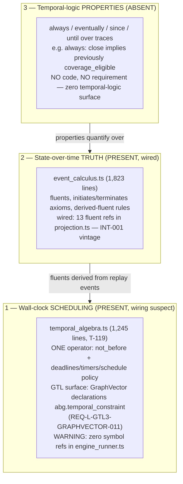
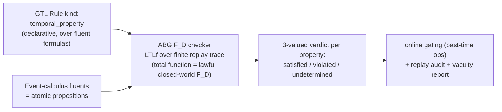

# Strategy: What GTL Still Needs As An LLM-First Contract Language

**Status**: strategy commentary, not ratified specification
**Date**: 2026-07-05
**Author**: Claude
**Project**: Abiogenesis
**Scope**: GTL language-layer gaps for the LLM-first mission; formalism alternatives; temporal operators vs event calculus vs temporal-logic properties
**Method**: every "exists / absent" claim below was verified against the working tree at 4.2.0-rc.6 (file:line cited). Gap reasoning descends from this week's audit evidence, not from theory.

---

## 1. Frame: the object language is sufficient; the meta-language is the gap

Every time this arc stress-tested GTL's ontology — RLM subsumption, disambiguation
graphs, node types, instruction assembly — the verdict was the same: existing
carriers already express it. The recurring defect was never "the language cannot
say it." It was legality living in an implementation, a prompt, or a caller's
assertion instead of in compiler-visible law.

An LLM-first contract language is judged on the **probabilistic authoring
loop**, not on ontology:



The seven gaps plus the temporal layer all sit **on the loop**, not in the
ontology. Two supporting gaps (4: examples, 5: declared latitude) govern what
the generate step is allowed to invent.

INTENT.md's own definition of the anti-drift mechanism: "the more … truth is
expressed as compiler-visible law, the less an LLM … can replace substrate
doctrine with context memory, prompt convention, or local controller code."
Every recommendation below moves one loop surface into compiler-visible law.

---

## 2. Gap 1 — Typed diagnostic + repair algebra

**Verified today**: `GtlProgramConformanceIssue`
(`gtl_program_conformance.ts:107-115`) exists — but its `ruleRef` is an
**open string field** (no ratified ID vocabulary; zero literal `issueKind`
values in the module) and its `severity` is the single fixed value
`"error"`. A repair-routing surface **already exists**:
`GtlProgramRepairSurfaceDisposition` with `repairGraphFunctionRef` /
`repairGraphVectorRef` and dispositions like `current_edge_repair`
(`:656-686`). Typed gap kinds exist in instruction assembly
(`dependency_sufficiency_gap`, `typed_prerequisite_gap`,
`unresolved_requirement_node`, `missing_dependency_edge`); constitutional
re-entry is already typed by `change_class`. **Absent**: ratified stable
diagnostic IDs (an open `ruleRef` string is caller-shaped truth, not
constitutional vocabulary), a severity taxonomy, and per-diagnostic
**admissible repair sets** (the repair surface routes *where* to repair, not
*which lawful edits* discharge the diagnostic).

**Reasoning.** For an LLM the diagnostic *is* the next prompt — the
check→repair loop is its REPL. A diagnostic that names the violated clause,
the offending ref, the expected contract, and the lawful repair moves converts
repair from re-invention into selection. Stable IDs also make diagnostics
censusable — the same discipline the audits keep needing. This is promotion,
not invention: the pattern already exists in instruction-assembly internals;
it needs to become *the* general compiler-output law.

> **What**: ratify diagnostics as carriers: `{diagnosticId, violatedClauseRef,
> offendingRef, expectedContract, admissibleRepairs[]}`.
> **So what**: the authoring loop's inner cycle becomes lawful and mechanical;
> repair stops being invention; diagnostics become countable proof surface.
> **Next**: one `requirement_reprice` on the conformance family ratifying the
> diagnostic carrier + ID stability; ratify the open `ruleRef` strings into a
> stable ID vocabulary; extend the existing repair-surface disposition with
> admissible-repair sets on the top ten diagnostics first.

---

## 3. Gap 2 — Conformance corpus (implementation-independent semantics)

**Verified today**: no ratified **GTL language conformance corpus** exists —
no artifact pairing programs with expected diagnostics/denotations (no
`*corpus*` / `*conformance-suite*` filenames in test_env or specification).
The only semantics oracle is the TS tenant: `typecheckGtlProgram(...)` plus
1037 semantic tests that test *this implementation*, not *the language*.
Naming caution: the workspace already uses "corpus" in two other senses —
the requirements corpus (INTENT.md constitutional-consistency clause) and
qualification/test evidence — so the artifact must be named the *language
conformance corpus* explicitly, not "the corpus," or a successor ticket
mints a third truth surface under an overloaded word.

**Reasoning.** GTL claims engine-agnosticism (INT-001 names Codex/Java/Temporal
builds; INT-003 stripped worker assumptions). Until a ratified corpus of
lawful programs, unlawful programs, and expected diagnostics/denotations
exists, "GTL" operationally means "whatever the TS tenant accepts" — an
implementation-defined language, the classic trap. The wiring audit showed
exactly this failure shape: law-vs-code gaps stayed invisible because the
implementation was its own oracle. Doubly LLM-first: lawful/unlawful pairs
are how a probabilistic constructor actually grounds a language — the corpus
IS the few-shot spec.

> **What**: a ratified, versioned corpus: N lawful programs + M unlawful
> programs + expected diagnostic IDs + expected traversal denotations.
> **So what**: the language stops being implementation-defined; any second
> tenant (or a model-checked reference) must pass it; constructors get a
> grounding set that no prose clause can match.
> **Next**: seed it mechanically — harvest the existing semantic-suite
> fixtures into corpus form (they already encode hundreds of lawful/unlawful
> pairs), ratify the corpus format, then grow per REQ family.

---

## 4. Gap 3 — Canonical authored form (declarations are data)

**Verified today**: canonical *key-spelling* law exists (ATTRS/GRAPHFUNCTION/
GRAPHVECTOR reqs; e.g. GRAPHVECTOR-011: "alternate temporal key spellings
shall not be admitted"); serialization **machinery genuinely exists** —
internal identity canonicalization (`canonicalSerializedJsonValue`,
`gtl/m01/contracts/constructors.ts:215`) and public carrier/module
serializers (`serializeModule(...)`,
`gtl/m02/serialization/carriers.ts:82`, plus `gtl/m01/serialization/`);
digests exist on most carriers. The gap is therefore **not machinery — it is
ratified law**: internal identity-canonicalization (for digests) and a
ratified *public authored-program format* are different capabilities, and
only the first exists.
**Absent**: a ratified canonical *program* serialization, and a law that
declarations are **data, not programs** — today GTL programs are authored as
host-language builder calls, and odd_glc's frozen-data `.mjs` declarations
are the right instinct standing on convention, not law.

**Reasoning.** What the LLM writes is the attack surface. Host-language
authoring reintroduces every degree of freedom the language exists to remove:
loops, string-building, conditionals in the builder are hidden execution law
through the back door — the prompt-shell arc in miniature. One canonical,
deterministic textual form with stable ordering and content digests gives you
promptable programs, deterministic diffs of generated code, and
digest-as-identity at admission.

> **What**: ratify one canonical serialization (stable ordering,
> content-addressable digest) + a computed-declarations-are-drift clause.
> **So what**: closes the host-language backdoor; generated programs become
> reviewable/diffable/admittable as data.
> **Next**: small GTL `requirement_reprice`; conformance check "declaration
> file is pure data" (no imports beyond the declaration schema, no call
> expressions); odd_glc's existing frozen declarations become the first
> conformant instances.

---

## 5. Gap 4 — Specification by example (contracts carry golden instances)

**Verified today**: contracts carry evidence-shape **refs**
(`expectedEvidenceShapeRefs`, `positiveEvidenceShapeRefs`,
`negativeEvidenceShapeRefs`) — but no example carriers exist anywhere in
`code/src/gtl` (zero hits for golden/example/counterexample fields).

**Reasoning.** An edge contract tells the worker *shape*, never *meaning* —
"adequate design" is semantically anchored nowhere the language governs.
Ratified golden positives/negatives as admitted contract data feed three
mechanisms that already exist but are starved: (a) evaluator calibration —
the still-open M3 defect ("strength admitted" = presence of caller refs)
needs something F_D-checkable, and calibration sets are exactly that;
(b) non-tautology differentials — mutation material must be answer-shaped,
and golden negatives are the lawful source; (c) instruction assembly's
few-shot rendering. It is the WHAT-side twin of the instruction algebra, and
the only path to a *guaranteed* depth bar (conformal calibration needs
calibration sets — see §9).

> **What**: contracts may declare ratified example/counterexample instances
> as admitted data with digests. NOTE the existing partial carriers: ABG
> already has `positiveEvidenceShapeRefs`/`negativeEvidenceShapeRefs` (shape
> refs) and `adversarialCounterexampleRefs` (counterexample refs) in the
> carry-through/instruction-assembly families — refs to shapes and events,
> not ratified instance data.
> **So what**: semantic meaning enters the language; strength admission and
> non-tautology gain checkable material; F_P evaluators become calibratable.
> **Next**: **promote and bridge the existing ABG proof-shape and
> counterexample ref families into GTL contract/example law** — extending
> them to bind ratified instances — rather than minting a parallel
> `goldenInstances` surface under a new name; pilot on one
> requirement-bearing edge in the hello-world route; wire M3's strength
> resolution to require calibration-set provenance.

---

## 6. Gap 5 — Declared underdetermination (lawful latitude markers)

**Verified today**: absent (zero hits for underdetermination/latitude
markers). The only latitude mechanisms are the F_P regime itself and F_H by
absentia.

**Reasoning.** The #1 LLM failure is filling silence with invention. The
language cannot currently distinguish "incomplete by accident" (defect) from
"open by design" (latitude granted). A typed marker — free variable, granted
latitude scope, owning decision route (F_P may choose / F_H must decide) —
tells the constructor exactly where invention is lawful, and makes everything
else fail-closed. This ratifies the session's expand/constrain asymmetry into
syntax: the worker expands only where the substrate has *declared* the
opening. It also upgrades the diagnostic story: a conformance pass can then
flag *undeclared* holes as defects instead of guessing intent.

> **What**: an `underdetermined` declaration marker with scope + owner route.
> **So what**: invention becomes lawful-by-declaration only; accidental
> incompleteness becomes mechanically detectable; prompts can say "you have
> latitude HERE" with law behind it.
> **Next**: one small GTL clause + conformance check; instruction assembly
> renders declared latitude into the manifest (permission, not prescription).

---

## 7. Gap 6 — Contract evolution law

**Verified today**: no supersession/deprecation vocabulary in GTL m02
contracts (zero hits); `T-178` (event-sourced registry entry
retirement/supersession) sits in **backlog**; runtime correction law exists
(correction shadows stale truth) but *contract-level* versioning semantics do
not. Installed-context staleness is handled at install granularity only
(T-186/T-187 markers — and note the context went rc.4→rc.5→rc.6 within days).

**Reasoning.** Stale context is the LLM's normal operating condition. The
language needs versioning/supersession semantics — widening/narrowing/breaking
compatibility classes and typed clause-level diffs — so staleness is
*detectable as a typed diagnostic* rather than silently divergent. T-187's
stale-installed-context rejection is the correct pattern; it needs
generalizing from the install boundary to every contract ref.

> **What**: contract version identity + compatibility classes + typed diff +
> supersession events (T-178 as the seed). Reconcile with the existing GTL
> requirement **relation-kind family**
> (`GTL_REQUIREMENT_RELATION_KIND_VALUES`,
> `gtl/m01/contracts/requirements_algebra.ts:6` — refinement/dependency/
> conflict/…): no supersession kind exists there today (verified: zero
> hits), but that family is where a supersession/replacement relation
> belongs — extend it rather than minting a second relation vocabulary.
> **So what**: agents holding stale contracts get typed
> `stale_contract_ref` diagnostics instead of silent divergence; evolution
> becomes lawful re-entry instead of drift.
> **Next**: promote T-178 from backlog with scope widened from registry
> entries to contract refs generally; ratify the compatibility-class
> vocabulary first (cheap), defer the diff tooling.

---

## 8. Gap 7 — Constructor provenance + authoring authority

**Verified today**: absent at the declaration level (zero hits for
authorship fields in `code/src/gtl`). Runtime provenance exists
(worker/role/authority on runs); declarations carry none.

**Reasoning.** Multi-agent authoring is the actual usage mode. Declarations
carrying *who authored under what authority* (worker id, manifest ref, role)
enable (a) declaration-time authority law — which role may author which
declaration kind; and (b) structural **self-dealing detection**: a program
authored by the same worker that later judges it is the tautology class this
session caught three times, findable from provenance joins alone.

> **What**: authorship/authority fields on declarations, checked at admission.
> **So what**: the write-permission model of the language exists; self-dealing
> becomes a query, not a review catch.
> **Next**: add fields to the declaration carrier + one admission check; a
> replay query joining declaration authorship to evaluation-worker identity.

---

## 9. The temporal layer — three temporalities, two present

**Verified today**:



Layer 1 is temporal *scheduling* (when traversal may proceed): exactly one
operator, `not_before`, attached at graph vectors. Layer 2 is Event Calculus —
the runtime-truth formalism, present since INT-001 and genuinely wired. Layer
3 — temporal-**logic** properties over traces — does not exist, and it is the
layer that matters for the audit failure classes: every standing gate from
this week's audits is a temporal property (`always(fp_dispatch implies
previously manifest_projected)`, `always(close implies previously
coverage_eligible)`).

**Why the position is strong anyway**: Event Calculus fluents are exactly the
atomic-proposition layer a property language needs. The missing layer is
small and needs **no new ontology**:



**Five decisions to pin** (each traces to a session failure class):
1. **Finite-trace semantics (LTLf), three-valued verdicts** — liveness on a
   finite prefix is *undetermined*, never satisfied-by-default; an
   `eventually` that passes silently on an unfinished trace is masquerade.
2. **Prefer past-time operators** — every real gate is past-shaped, and
   past-time LTL is stepwise-decidable, enabling *online* blocking rather
   than post-hoc audit.
3. **Vacuity detection** — `always(dispatch implies previously manifest)` is
   vacuously true on a trace with zero dispatches; require witness counts.
   Vacuity is non-tautology's temporal cousin.
4. **One truth surface, twice** — eventually-obligations and residual
   pressure are the same fact: the property layer must *read*
   residual/continuation truth, not re-derive it; and properties range over
   the event trace, not node state (else they contradict node markov
   conditions).
5. **Runtime verification ≠ model checking** — replay checking proves
   *observed* runs; it cannot prove the runner *can't* do otherwise. The
   census/all-paths obligations remain; this layer mechanizes per-run
   enforcement, which is most of the value at a fraction of the cost.

**Precondition finding (scoped precisely)**: temporal *events* are admitted
and projected — `projection.ts` handles `timer_intent_admitted` /
`deadline_breach` / `scheduled_continuation` event kinds (`:754` area, 3
kinds), and event calculus carries temporal fluents
(`temporal_timer_pending`, `event_calculus.ts:40`). What is **not consulted**
is the temporal-*algebra* eligibility surface: `TemporalConstraint`/
`TimerIntent`/`DeadlineBreach`/`ScheduledContinuation` symbols have zero
references in `engine_runner.ts` dispatch/eligibility (and the algebra's own
projection-row types have no populating consumer found). So the precise
census question is: does `not_before`/deadline truth actually gate runner
eligibility and dispatch, or is it admitted-and-projected but never
enforced? Answer that before extending temporal law — enforcement-after-
admission is the exact audit class.

**Enforcement-consequence split** (add to the pinned decisions): safety /
past-time properties may **block online**; finite-trace liveness properties
whose verdict is *undetermined* must route to **audit/release pressure
(residual)**, never to runtime blockage — otherwise `eventually` becomes a
premature-blocking surface, the inverse failure of the masquerade it
prevents.

> **What**: an LTLf property layer as a GTL `Rule` kind over event-calculus
> fluents, checked F_D over replay, with online past-time gating.
> **So what**: the standing audit gates become declared constitutional law
> the runtime enforces per-run — the constitution starts enforcing itself;
> and hosting properties in GTL (not an external TLA+ model) avoids
> model-vs-code drift entirely.
> **Next**: (0) wiring census on temporal_algebra/T-119; (1) ratify the Rule
> kind + LTLf finite-trace semantics + vacuity law; (2) implement the F_D
> checker over replay; (3) declare the five standing audit gates as the first
> property set.

---

## 10. Formalism alternatives (why algebra stays the spine)

Judged by which **audited failure class** each formalism kills structurally —
because today those classes are caught by review and census, i.e. a reviewer
is acting as the model checker:

| Failure class (audit-verified) | Formalism that kills it structurally | Adopt as |
| --- | --- | --- |
| declared_not_wired, proven_one_arm | Model checking (TLA+/Alloy, all-paths) | External gate on the dispatch/closure skeleton — or partially subsumed by the temporal property layer for per-run enforcement |
| caller_asserted | Refinement types / smart constructors (a value constructible only from evidence) | Incremental hardening of construct-functions (already halfway there) |
| protocol bypass (dispatch sans manifest) | Session types / assume-guarantee contract metatheory (Benveniste-style) | Metatheory under INTERFACE-001..006 — composition/refinement theorems for free |
| two_truth | Initial-algebra semantics (one initial model) | Concept adoption; tooling tradition moribund |
| presence_not_differential (F_P side) | Conformal prediction / calibrated statistical guarantees | The only formalism that touches semantic verdicts; requires Gap 4's calibration sets |
| frontier concurrency defects | Colored Petri nets (obligation tokens; boundedness/liveness) | Narrow attachment for the saga-frontier layer only |

Category theory proper is vocabulary worth stealing (the algebra already *is*
applied category theory — compose/fan_out/fan_in/gate are monoidal, the
traversal monad is named as such); a foundation switch buys little. Dependent
type theory is hostile to LLM repair loops and cannot touch F_P semantics.
**Conclusion: keep algebra as the spine — it is the only foundation LLMs
author fluently today — and attach; never migrate.**

---

## 11. The ranking

Two orderings as requested: **bang-for-buck** (value per unit cost, immediate
compounding) vs **foundational** (deepest improvement to the language's
long-term position, cost ignored).

| Recommendation | BfB rank | Foundational rank | Bang-for-buck reason | Foundational reason |
| --- | --- | --- | --- | --- |
| Gap 1 — diagnostic + repair algebra | **1** | 5 | Mostly exists (issue carrier + repair-surface disposition + typed gaps + change_class routing); the gap is ratification — stable IDs over the open `ruleRef` string + admissible-repair sets — and every future ticket's inner loop benefits immediately | Foundational for the loop, but incremental over what's already built |
| Temporal property layer (LTLf over fluents) | **2** | **2** | Fluents already wired = the hard half is done; first property set = the five standing audit gates, mechanizing this week's most expensive manual work | The constitution starts enforcing itself per-run; law and enforcement share one truth surface |
| Gap 3 — canonical authored form | **3** | 6 | Small reprice (spelling law + digest utilities exist); closes the host-language backdoor that produced the prompt-shell class | Important hygiene, but shapes the input surface rather than the language's meaning |
| Gap 5 — declared underdetermination | **4** | 7 | One clause + one conformance check; directly attacks the #1 LLM failure (filling silence with invention) | Narrow-but-real semantic addition; ratifies an asymmetry already proven in review |
| Gap 4 — specification by example | **5** | **3** | Moderate cost (carrier extension + pilot), but unblocks the M3/depth-guarantee line and feeds non-tautology material — three starving mechanisms, one surface | Semantic *meaning* enters the language for the first time; prerequisite for any calibrated F_P guarantee |
| Gap 7 — authorship provenance | **6** | 8 | Cheap fields + one admission check; self-dealing becomes a query | Useful governance metadata; least language-deep of the set |
| Gap 6 — evolution law | **7** | 4 | Moderate cost; T-178 seed exists; pays off as churn grows (rc.4→rc.6 in days already) | A contract language without evolution semantics cannot live long; every mature language grows this or dies by fork |
| Gap 2 — conformance corpus | **8** | **1** | Expensive to curate and maintain; payoff arrives with the second implementation or reference semantics | The single deepest move: the language stops being implementation-defined — everything else assumes an oracle; this *creates* one |

**Sequencing recommendation.** Run the bang-for-buck order but steal the
foundation early where it's free: Gap 1 and Gap 3 first (cheap, compounding);
the temporal property layer next (after the T-119 wiring census) because it
converts the audit regime from manual to constitutional; seed Gap 2's corpus
*mechanically* from the existing semantic fixtures while doing Gap 1 (the
diagnostics work touches the same files — harvesting lawful/unlawful pairs is
nearly free at that moment even though full corpus curation is the last
ticket); Gap 4 before any depth-guarantee claim in the T-188 line; Gaps
5/7/6 as small riders on whichever REQ families are already open.

---

## 12. One-line rule

```text
GTL's ontology is done; its meta-language is not. Move the authoring loop's
truth — errors, meaning, form, examples, latitude, evolution, authorship,
and time — into compiler-visible law, cheapest-first, and let the corpus be
the horizon.
```

---

## 13. Self-review record (2026-07-05)

This post was self-reviewed against the working tree after publication; four
evidence defects were found and corrected in place:

1. §2 originally cited "~168 distinct string literals" as the issue
   vocabulary — a junk metric (all string literals in the module, not issue
   IDs). Corrected: the issue carrier's `ruleRef` is an **open string** with
   no ratified ID vocabulary, which makes Gap 1 larger than originally
   claimed, on honest evidence.
2. §2 originally claimed repair affordances **absent** — an under-claim: a
   repair-routing surface (`GtlProgramRepairSurfaceDisposition`,
   `current_edge_repair`) already exists at `:656-686`. The gap narrows to
   admissible-repair *sets*, not repair routing.
3. §4 originally cited `constructors.ts:14` as a line reference — it was a
   `grep -c` match **count** misread as a line number. Corrected to the
   count with content characterized.
4. §9's temporal-algebra unwiring claim was strengthened from
   "zero refs in engine_runner" to zero refs across all five runner and
   projection modules checked.

The corrections move evidence, not conclusions: the thesis and rankings
survive, with Gap 1's case slightly strengthened. Defect classes committed
and caught: uninspected-grep-hit-cited-as-fact (×2), presence-metric
presented as vocabulary, and one under-claim — the same taxonomy this
workspace's audits apply to everyone else.

**Second-round record (two external reviews adjudicated, 2026-07-05):**
Accepted and applied — Gap 4 Next reworded to *promote/bridge* the existing
ABG proof-shape + counterexample ref families instead of minting
`goldenInstances` (reviewer 1, valid); Gap 2 renamed to *language conformance
corpus* with the overloaded-word caution (reviewer 1, valid); Gap 3 upgraded
with `serializeModule(...)` and the machinery-vs-ratified-law distinction
(reviewer 2, valid — and reviewer 1's internal-vs-public split); §9
precondition narrowed to "eligibility/dispatch not consulted" since temporal
events ARE admitted/projected (reviewer 2, valid — my symbol-grep missed
string event-kind handling); enforcement-consequence split added (reviewer 1,
valid). Stale or refuted: reviewer 1's and 2's `constructors.ts:14` findings
addressed a pre-self-review revision (already corrected in this record's
item 3); reviewer 2's claim that a supersession relation kind exists at
`requirements_algebra.ts:6` is **refuted** (zero `supersed*` hits — the
relation-kind family exists, a supersession kind does not; Gap 6 now says
extend that family). Reviewers applied this workspace's own
promote-don't-re-mint discipline back at this post — correctly.

**Third-round correction (2026-07-05, T-191 execution):** `supersession`
IS present in `GTL_REQUIREMENT_RELATION_KIND_VALUES` in the current tree
(the earlier refutation was verified against an older tree state or a
prefix-grep miss). Gap 6's relation-kind extension is therefore realized
by recognition; REQ-L-GTL3-LAWS-026 ratifies it.
