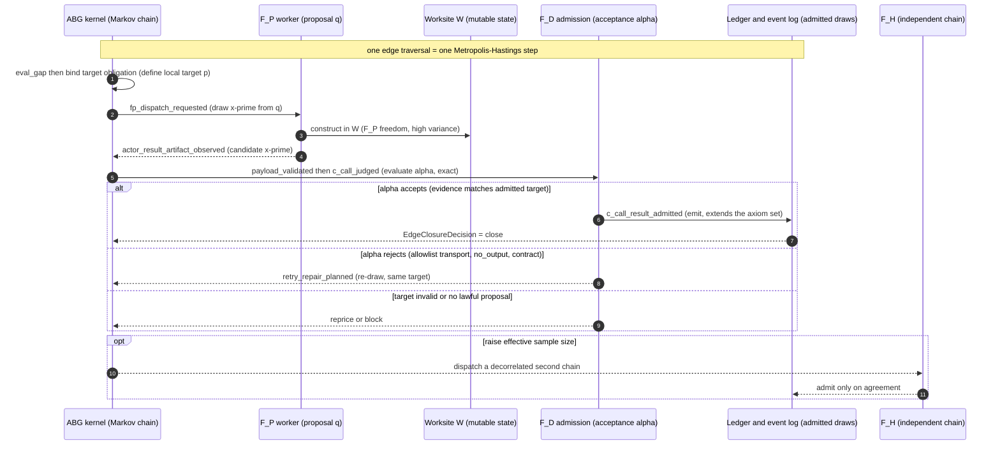
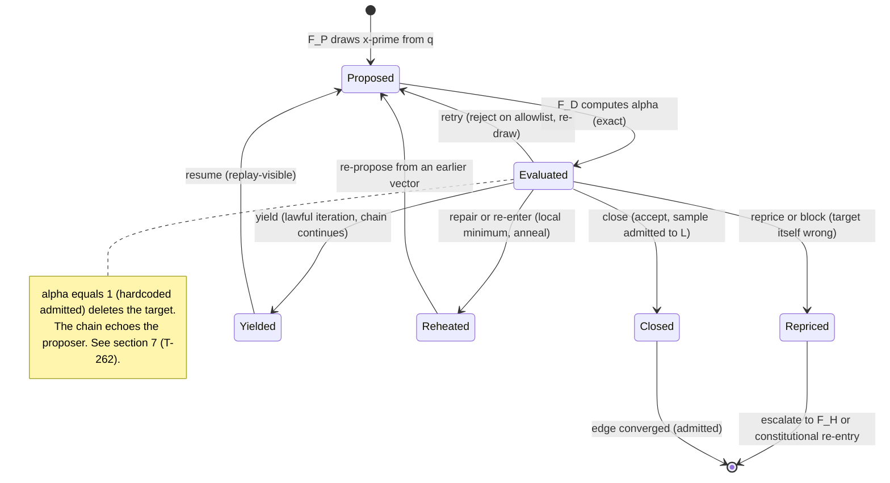
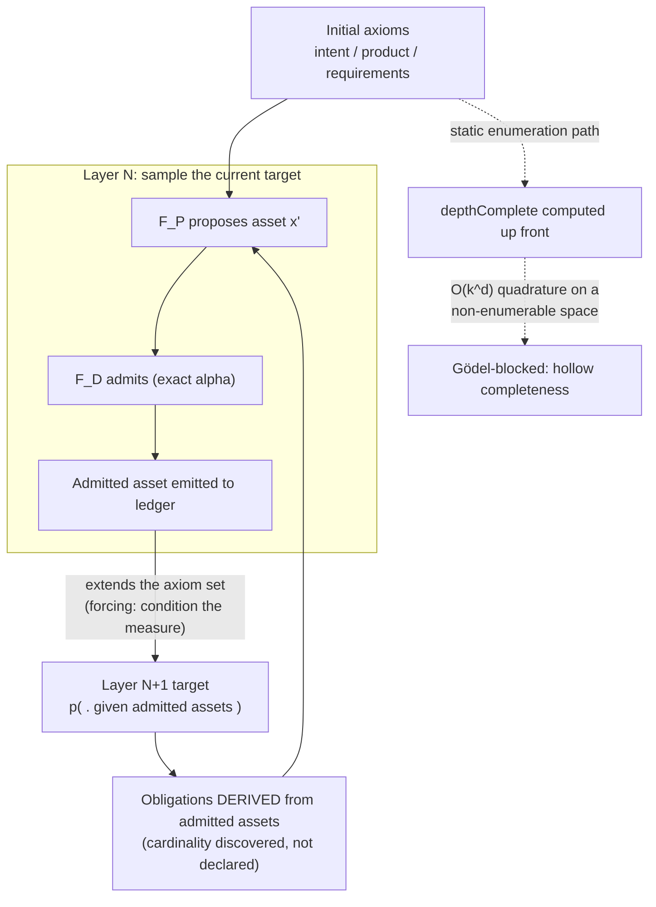
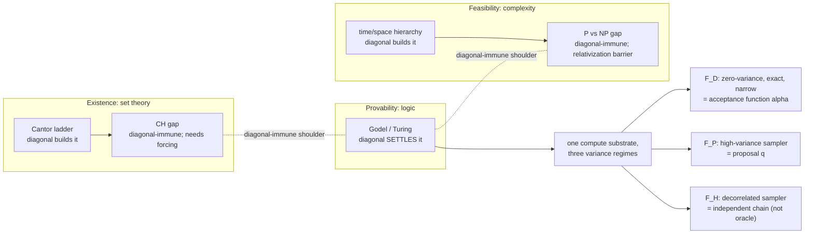

# STRATEGY: ABG Construction Sequencing as Monte-Carlo Estimation Over a Non-Enumerable Proof Surface

**Author**: claude
**Date**: 2026-07-14T02:51:10Z
**Addresses**: the `F_D`/`F_P`/`F_H` regime split (CLAUDE.md §4–5); the `ODD_METHOD.md` §11.5D constructive evaluation loop; the Gödel topology-discovery law (T-032, 2026-07-08); T-262 parent-rebind (`typed_recurse_runtime.ts`, on `codex/t266-stage`); companion to `20260714T010000Z_REVIEW_holistic_ds1_ds3_span_audit.md`
**Status**: Draft
**Frame**: This post is a **lens over current reality** (a model of the existing construction loop) plus a **target-direction recommendation** (an acceptance/independence discipline). It is commentary, not ratified law. It renames existing machinery in estimator vocabulary; it proposes no new runtime.

## Summary

ABG's governed-construction loop is Markov-Chain Monte Carlo over an obligation
space that is too large to enumerate. `F_P` is the **proposal distribution**,
`F_D` is the **acceptance function**, `F_H` is a **second decorrelated chain**
(not an oracle). The Gödel topology-discovery law is the statement that the
space is non-enumerable, which is precisely the condition under which sampling
is not a convenience but the only estimator whose convergence survives. Two
standing project laws turn out to be MCMC-correctness conditions, and T-262 is
a worked example of what happens when the acceptance function is deleted.

## Analysis

### 1. Sampling is forced, not chosen

The quantity a construction wants is an expectation over a space `X` of possible
constructions/obligations: `I = E_{x~p}[f(x)]`, where `f` is "does this satisfy
the admitted contract" and `p` is the true measure of where the load-bearing
obligations lie. Deterministic enumeration — lay a grid over `X` and walk it —
costs `O(k^d)` in `d` dimensions. `X` here is astronomically high-dimensional
(every construction path, every proof obligation), so enumeration never
finishes. **This is the topology-discovery law in estimator terms**: static
enumeration of obligations up front (`depthComplete` computed at startup) is
deterministic quadrature on a non-enumerable space. It is the T-031
`depthComplete`-hollow defect class, and it is Gödel-blocked — an attempt to
prove completeness from inside the initial axioms.

The Monte-Carlo estimator `Î_N = (1/N)·Σ f(x_i)` converges to `I` with error
`σ/√N`, and — the load-bearing fact — **the `√N` rate is independent of `d`**.
That dimension-freeness is the entire reason governed construction over a vast
obligation space is tractable at all. "Discover the topology by computation,
don't enumerate it" is "use the one estimator that does not pay for dimension."

### 2. The atomic step: one edge traversal is one Metropolis–Hastings step

You cannot draw i.i.d. from the true target `p` (that needs the partition
function `Z` — the full obligation set, which is the thing you can't enumerate).
Metropolis–Hastings routes around `Z`: propose `x' ~ q(·|x)`, accept with
probability `α = min(1, [p(x')q(x|x')] / [p(x)q(x'|x)])`. `Z` cancels in the
ratio; you only ever evaluate `p` **locally**, on the proposed point. That local
evaluation is `F_D`. The proposal is `F_P`.

The whole per-edge event trace — `fp_dispatch_requested → actor_invocation →
payload_observed → payload_validated → c_call_judged → vector_evaluated` — is one
propose-then-accept cycle. `F_P` freedom (high variance, broad exploration) is
lawful and desirable **inside** the proposal; it becomes truth only after `F_D`
accepts and the sample is emitted to the ledger.

### 3. The transition kernel: the disposition sum-type

`EdgeClosureDecision` is a sum type — `{close, yield, retry, repair, re-enter,
reprice, block}`. Read as an MCMC transition kernel, each disposition is a
distinct Markov move, and the distinctions the method insists on (yield is not
retry; retry is not block) are the distinctions a correct sampler must make.

- **retry** is drawing again from the same target — bounded by the failure
  allowlist `{transport_failure, no_output, contract_failure}` (CLAUDE.md rule
  16), i.e. only proposal-side noise triggers a re-draw; semantic rejection does
  not silently re-roll.
- **yield** is the chain continuing without a failure classification (lawful
  iteration). Flattening yield into retry/timeout is mixing two different
  Markov moves — a modelling error the method explicitly forbids.
- **repair / re-enter** is simulated-annealing reheat: a construction that
  passes local checks but carries a residual defect is a local minimum; you
  inject energy and re-explore from an earlier vector. Foldback is the reheat.
- **reprice / block** is the recognition that the target `p` itself is wrong or
  admits no lawful proposal — escalate, don't sample harder.

### 4. The layered sequence: adaptive MCMC by target conditioning

Earned depth — obligations derived from admitted intermediate assets, never
statically enumerated — is **sequential/adaptive** MCMC: each admitted asset
conditions the target for the next layer. Admitting an asset is a forcing move
(condition the measure); the next round samples the conditioned target.

"Deliver the map and the obligations follow" is "the posterior over
next-obligations is the target conditioned on the accepted witness." The dashed
path is the failure the whole discipline exists to avoid.

### 5. Two standing laws are MCMC-correctness conditions

- **`F_D` must never drift into `F_P` responsibility (the #1 boundary law).**
  In Metropolis–Hastings, if the acceptance ratio is biased, the chain's
  stationary distribution is not `p` — you converge, tightly, to the wrong
  target. So keeping `F_D` an exact envelope check (existence, schema, digest,
  identity, admission, target certification — CLAUDE.md §4) is exactly the
  condition that the sampler's fixed point is the true target. The boundary law
  is the stationarity-correctness condition, in governance vocabulary.
- **Negative proof / mixed-state rejection is a bias check.** Green tests are
  *low variance* — all draws agree. Low variance says nothing about bias; a
  biased chain agrees tightly around a lie. A negative proof asks whether `α`
  can reject **at all** — the one thing agreeing green draws cannot establish.
  This is why "green tests do not overrule a split architecture" and why the
  live-gate law requires driving the failure, not observing its absence.

### 6. Conceptual placement (why Gödel sits between CH and P vs NP)

All three are diagonalization phenomena. Gödel is the one the diagonal
**settles**; its two flanking gap-questions are the ones the diagonal cannot
reach. `F_D`/`F_P`/`F_H` are then not three kinds of thing but three variance
regimes of one compute substrate.

`F_H` is not an oracle outside computation; it is a second chain whose errors
decorrelate from `F_P`'s. Its value is multimodal coverage (a chain stuck in one
basin is rescued by an independent chain started elsewhere), and its scarce
resource is genuine independence — correlated chains fall into the same basins.

### 7. Worked example: T-262 as `α ≡ 1` (deleted target)

Design D9 (`M03_TYPED_RECURSE_RUNTIME_BEHAVIOR_DESIGN.md:277-291`, on
`codex/t266-stage`) mandates parent-rebind be a deterministic admission
projection that validates the exact foldback event, next carrier and payload,
policy, budget-source, lineage, and evidence, closing to `admitted` **or**
`blocked`. The runtime (`typed_recurse_runtime.ts:1417-1442`) does a single
null-check on `foldback` and then emits `decision: "admitted"` unconditionally.

In MCMC terms this sets the acceptance probability to `α ≡ 1`. A chain that
always accepts is not sampling a target — it echoes the proposer. The
adversarial audit (companion review) proved this by injecting
`targetInputPayloadRef: "payload://ATTACKER-INJECTED/..."` — a value unrelated to
the child output or evidence chain — and watching it flow through the hardcoded
gate into round 2, `status: "completed"`, no diagnostic. That is not a "missing
check"; it is the sampler's target distribution deleted. And it is a **bias**
failure, not a variance failure: the resolver's tests agree tightly (green,
low variance) around a fixed point that isn't the target — confident wrongness,
the same shape as hollow `depthComplete`. This is why the parent-rebind hole is
a live instance of the very law it sits under (§4): it declared completeness
from inside its axioms instead of computing admission from the admitted assets.

### 8. Corollary for review methodology (current reality)

A review is itself an estimator over the same proof surface, so the same math
binds it. The two independent audits of the DS-1..DS-3 span differed exactly as
their estimators differ:

- The 8-dimension workflow sweep was **stratified sampling** — partition the
  review space, cover each stratum. That is why it caught the field-discipline,
  migration-category, and release-criterion strata. But within the runtime
  stratum every dimension estimated `f` by **reasoning about type-shape**, which
  is a **biased estimator of `f`**. Correlated biased estimators agree with each
  other — low variance around the wrong value — so eight dimensions all cleared
  T-262. Adding more correlated dimensions would only have tightened the
  interval around "clean."
- The 4-agent deep audit was **importance sampling with exact evaluation** —
  concentrate on the high-density region and evaluate `f` by **running the
  exploit** (the unbiased `f`). The mode fell out on the first unbiased draw.

The operational lesson, in estimator form: on a fenced or self-referential seam
you cannot out-sample a bias — you can only replace the estimator. Changing `f`
from reasoned-shape to executed-behavior matters more than adding correlated
samplers. Relatedly, the "delegated-F_H" closures were one autocorrelated chain
(`N_eff ≈ 1`), not `N ≈ 12` independent draws; the measured ~2 misses are the
predicted variance of an `N_eff ≈ 1` estimator on a multimodal target, and one
decorrelated chain surfacing a mode is exactly the fix the math prescribes.

### Mapping (Monte-Carlo term → ABG term)

| Monte-Carlo / MCMC | ABG / method |
|---|---|
| target `p` (known up to `Z`) | the true obligation measure; `Z` = full obligation set (non-enumerable) |
| proposal `q`, draw `x' ~ q` | `F_P` worker dispatch; construction in `W` |
| acceptance `α` (exact) | `F_D` admission; `payload_validated`, `c_call_judged`, target certification |
| accept → emit sample | `c_call_result_admitted` → ledger/event (rule 15 convergence) |
| reject → re-draw | `retry` on the failure allowlist (rule 16) |
| transition kernel | `EdgeClosureDecision` sum type |
| simulated-annealing reheat | `repair` / `re-enter` / foldback |
| conditioning target on accepted sample (forcing) | earned depth; obligations derived from admitted assets |
| dimension-free `√N` convergence | why sampling beats enumeration on a non-enumerable surface |
| unbiased acceptance = correct stationary dist | `F_D`/`F_P` boundary law (#1) |
| bias check | negative proof; live-gate; mixed-state rejection |
| second decorrelated chain; `N_eff` | `F_H` / independent review; ensemble variance reduction |
| `α ≡ 1` | T-262 hardcoded `admitted` |

## Recommended Action

These are **proposed** directions (commentary, not ratified):

1. Treat `F_D` exactness as the sampler's stationarity condition: any change
   that puts semantic judgment in an admission/acceptance path is a bias
   injection and should be reviewed as one, regardless of green tests.
2. Require at least one **decorrelated** check — different estimator, ideally
   different method (execute the seam, don't reason about its shape) — before
   closing any ticket that realizes a runtime-atom or an admission boundary.
   Count independence, not agents: correlated chains share basins.
3. Read release-readiness as a confidence claim (`1 − ε`, `ε` bounded by `N_eff`
   and chain independence), never a completeness proof — and keep saying so in
   release notes.

If any of this is worth ratifying, it belongs in `DESIGN_MODULE_METHOD.md`
review criteria or an `ODD_METHOD.md` §11.5D note — not here. This post is the
argument, not the law.

## Boundary

Read-only commentary, authored on `main` alongside the companion audit.
Exact-cut code references (`typed_recurse_runtime.ts`, D9) are on
`codex/t266-stage`, where the DS-1..DS-3 realization lives; they are absent from
`main`. No files other than this post were touched.
