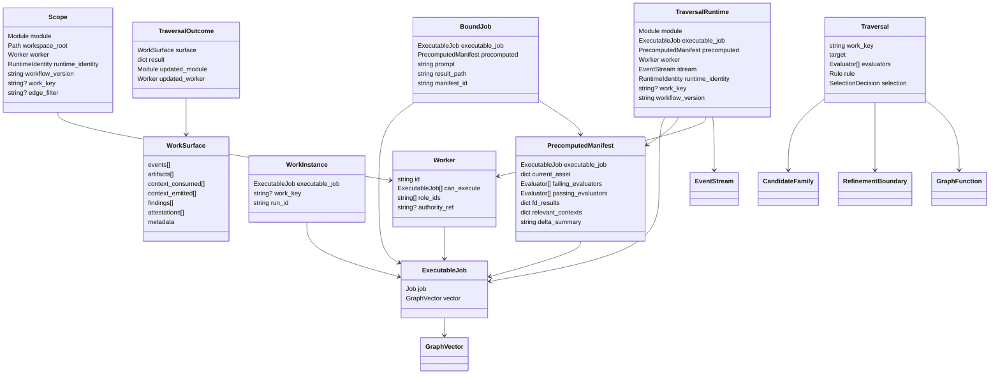
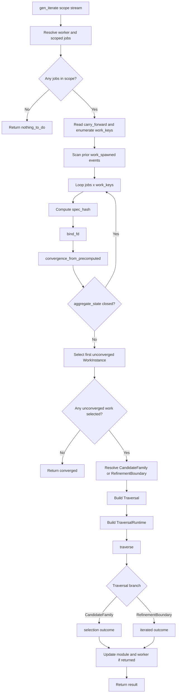
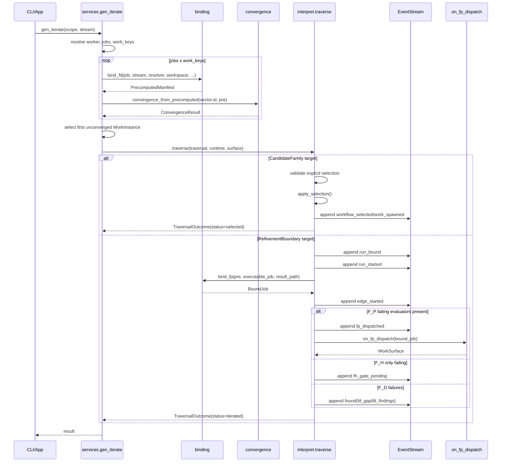

# SCHEMA: Iterator Decomposition Current Runtime

**Author**: codex
**Date**: 2026-03-31T21:59:09+11:00
**Addresses**: `genesis.services.gen_iterate()`, `genesis.interpret.traverse()`, current ABG iterator domain model and dispatch seams
**Status**: Draft

## Summary

This post decomposes the current ABG iterator as it exists in code today.

The main conclusion is that "iterate" is doing more than the narrow loop:

- bind inputs
- dispatch operator
- evaluate result

Current `gen_iterate()` is a larger service-level transport that also:

- resolves scope and worker binding
- enumerates work identities
- selects the first unconverged work instance
- resolves whether the vector traverses through a published refinement boundary or a candidate-family selection boundary
- then calls the traversal seam

Inside that larger service, the narrow execution loop does exist, but today it is shaped as:

- precompute evaluator state
- if necessary, dispatch `F_P` realization
- record run lifecycle and artifacts
- surface the remaining evaluator/gate state

So there are really two layers:

1. service-level iterator
2. narrow traversal realization loop

This distinction matters because a future operator-dispatch refactor should probably target the second layer without destabilizing the first.

This post describes current reality only.

## Analysis

### 1. Primary code boundaries

The current iterator spans four main files.

- `build_tenants/abiogenesis/python/code/genesis/services.py`
  - `gen_iterate()` is the service-level iterator entry point
  - owns scope resolution, job selection, work-key enumeration, and traversal construction
- `build_tenants/abiogenesis/python/code/genesis/interpret.py`
  - `Traversal`, `TraversalRuntime`, `traverse()`
  - owns the runtime traversal seam
  - splits into selection traversal vs ordinary iteration traversal
- `build_tenants/abiogenesis/python/code/genesis/binding.py`
  - owns `ExecutableJob`, `PrecomputedManifest`, `BoundJob`
  - owns `bind_fd()`, `bind_fp()`, `bind_fh()`
- `build_tenants/abiogenesis/python/code/genesis/convergence.py`
  - converts precomputed evaluator state into typed convergence outcomes and next-action semantics

The iterator is therefore not one function. It is a staged pipeline over these modules.

### 2. Domain model

The core runtime types are:

- `Scope`
  - the service-level command boundary
  - names the module, workspace root, runtime identity, worker binding, workflow version, and optional work-key/edge scoping
- `Worker`
  - concrete bound actor identity
  - carries `can_execute`, `role_ids`, and `authority_ref`
- `ExecutableJob`
  - ABG runtime resolution of a GTL `Job` plus its resolved `GraphVector`
  - this is the executable edge contract
- `WorkInstance`
  - scheduler dispatch unit
  - one `(ExecutableJob, work_key)` pair
- `PrecomputedManifest`
  - F_D precomputation result
  - captures current asset projection, failing/passing evaluators, F_D results, relevant contexts, and delta summary
- `BoundJob`
  - current narrow `F_P` dispatch package
  - wraps `PrecomputedManifest` plus prompt/result-path data
- `Traversal`
  - first-class runtime traversal contract
  - names one traversal attempt over one published target
- `TraversalRuntime`
  - execution context for that traversal
  - carries module, executable job, precomputed manifest, workspace root, stream, worker, runtime identity, work key, and dispatch hooks
- `WorkSurface`
  - structured realized output of a traversal attempt
  - events, artifacts, contexts consumed/emitted, findings, attestations, metadata
- `TraversalOutcome`
  - return value from `traverse()`
  - result payload plus optional updated module/worker

Published traversal targets are separate from runtime transport:

- `RefinementBoundary`
- `CandidateFamily`
- `GraphFunction`

Those live in `gtl.function_model` and determine what the vector can lawfully traverse into.

### 3. Domain model diagram

### 4. Service-level iterator flow

At the service boundary, `gen_iterate()` does the following:

1. Resolve `ContextResolver`, `Worker`, and scoped executable jobs.
2. Read carry-forward workflow metadata.
3. Enumerate active `work_key`s.
4. Derive selection topology from prior `work_spawned` events so refined parents are skipped.
5. For each `(job, work_key)` pair:
   - compute `spec_hash`
   - run `bind_fd()`
   - derive convergence through `convergence_from_precomputed()`
   - stop at the first non-closed work instance
6. Resolve the published traversal target for the selected vector:
   - `CandidateFamily`
   - or `RefinementBoundary`
7. Construct `Traversal` and `TraversalRuntime`
8. Call `traverse()`
9. Apply any updated module/worker returned from traversal

Important current invariant:

`gen_iterate()` does not directly "run an operator". It selects a work instance, binds the traversal state, and then hands off to the traversal seam.

### 5. Service-level flowchart

### 6. The actual narrow loop inside traversal

Inside the broader iterator, the narrow execution loop lives in `interpret._iterated_outcome()` and `interpret._realize_iteration()`.

That loop currently does this:

1. Classify precomputed failing evaluators by regime:
   - `fd_failing`
   - `fp_failing`
   - `fh_failing`
2. Deduplicate active in-flight runs via `find_pending_run()`
3. Create run identity and manifest identity
4. Emit `run_bound`
5. Emit `run_started`
6. Call `bind_fp(pre, executable_job, result_path)`
7. Emit `edge_started`
8. Call `_realize_iteration()`
9. Persist emitted events and artifacts
10. Optionally write the F_P manifest file
11. Return result and stamped `WorkSurface`

Inside `_realize_iteration()`:

- `F_D` failing evaluators produce `found` events
- `F_P` failing evaluators cause `fp_dispatched` and optional `on_fp_dispatch(bound_job)`
- `F_H` failing evaluators with no lower-regime blockers produce `fh_gate_pending`

So the current narrow loop is not yet a fully explicit:

- bind operator by regime
- execute operator by regime
- then evaluate

Instead it is:

- precompute evaluator state
- if `F_P` remains unresolved, prepare and dispatch a bound `F_P` job
- emit the resulting lifecycle and gap surfaces

### 7. Current sequence diagram

### 8. Selection traversal vs iteration traversal

A major reason the iterator is more complex than the narrow loop is that `traverse()` has two lawful branches.

#### Selection traversal

When the published target is a `CandidateFamily`:

- traversal requires an explicit `SelectionDecision`
- `apply_selection()` validates the decision against the vector contract
- the selected `GraphFunction` is materialized through the canonical materialization seam
- the vector is substituted with the materialized inner graph
- `workflow_selected` and `work_spawned` are emitted
- the module topology and worker capability set are rebuilt

This is not "execute work on the current edge". It is "replace this edge with a selected inner workflow".

#### Iteration traversal

When the published target is a `RefinementBoundary`:

- the vector remains the current executable boundary
- the runtime performs one iteration attempt against that edge
- run lifecycle, dispatch, and gating surfaces are emitted

These two branches share transport entry, but they are not the same operation.

### 9. Where the operator seam actually is today

If the narrow mental model is:

- bind edge inputs
- dispatch operator
- evaluate result

then the current code places the operator seam here:

- `bind_fp()` creates a `BoundJob`
- `_realize_iteration()` calls `on_fp_dispatch(bound_job)`

That is the live probabilistic operator seam.

What is missing relative to a richer operator model is parity across regimes.

There is not yet a first-class operator dispatch table parallel to evaluator handling:

- no explicit `F_D` operator dispatch path in traversal
- no explicit `F_H` operator dispatch path in traversal
- no selected `Operator` object carried in `Traversal` or `BoundJob`

Instead, operator realization is partly implicit in:

- bound worker capability
- `on_fp_dispatch`
- external human approval events
- deterministic evaluator programs that currently serve as checks, not transformations

### 10. The evaluator engine is already richer than the operator engine

Evaluator handling currently has the richer runtime model.

It has:

- typed regime classification
- deterministic evaluation in `bind_fd()`
- probabilistic certification and dispatch preparation
- human gate semantics in `bind_fh()`
- typed convergence reduction in `convergence_from_precomputed()`
- run-state integration in `_iterated_outcome()`

By contrast, operator handling is still narrow:

- it is implicit rather than explicit in the traversal contract
- it is realized concretely only for the `F_P` dispatch seam

So if the desired future is:

- operator dispatch by `F_D`
- operator dispatch by `F_P`
- operator dispatch by `F_H`
- then evaluator pass over the post-operation state

the likely insertion point is the narrow traversal realization loop, not the service-level selection logic.

### 11. High-risk invariants if iterator internals are changed

Any change to iterator shape should preserve these current invariants:

- every live vector must publish a traversal target through `RefinementBoundary` or `CandidateFamily`
- candidate-family traversal requires explicit selection
- `ExecutableJob` requires non-empty evaluators
- `gen_iterate()` selects the first unconverged `(job, work_key)` pair
- refined parents are skipped after `work_spawned`
- `(edge, work_key)` run deduplication via `find_pending_run()` must remain intact
- event ordering for ordinary iteration currently begins with:
  - `run_bound`
  - `run_started`
  - `edge_started`
- F_P iteration writes manifest/result artifacts under `.ai-workspace/fp_manifests/` and `.ai-workspace/fp_results/`
- selection traversal may update module topology and therefore worker capabilities

These invariants are what a refactor is most likely to break if the narrow operator loop is changed without preserving the larger iterator contract.

## Recommended Action

Use this decomposition as the baseline before changing operator semantics.

The safest next design move would be:

1. Leave `gen_iterate()` service selection logic intact.
2. Leave `traverse()` branch split intact.
3. Refactor only the narrow realization loop so it becomes explicitly:
   - bind selected operator
   - dispatch operator by regime
   - evaluate post-operation state by regime
   - reduce to convergence/gap result
4. Preserve the current run/event/artifact invariants while doing so.

That would let operator dispatch gain richer configurability without accidentally breaking:

- work-key selection
- candidate-family traversal
- run deduplication
- provenance emission
- topology updates after structural selection
