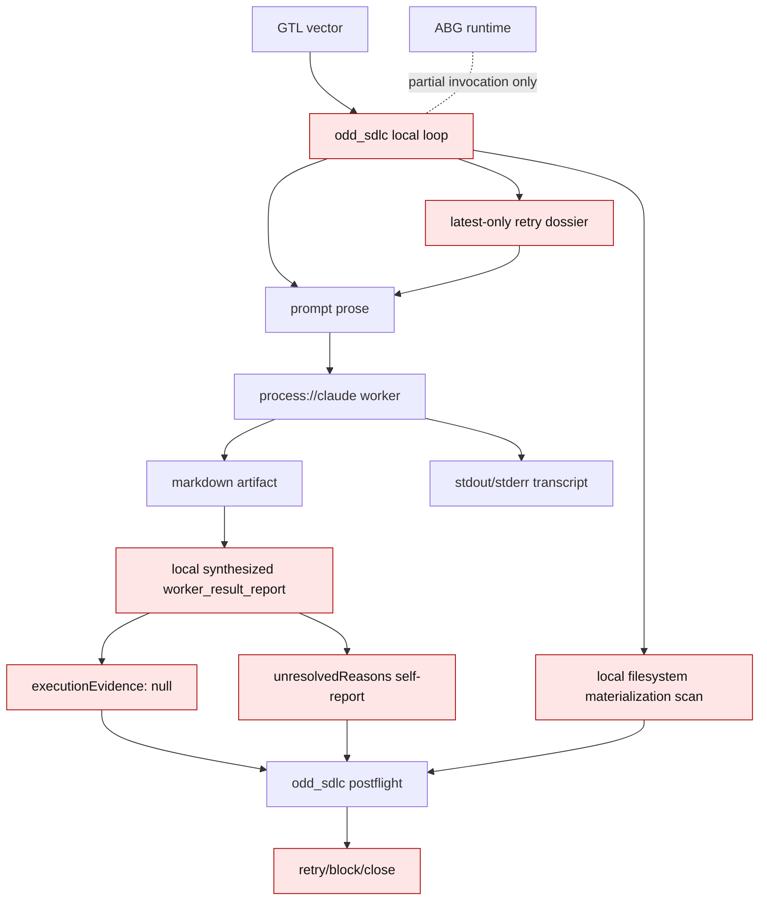
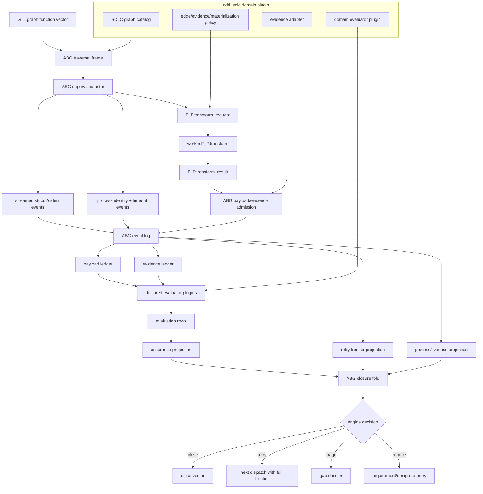
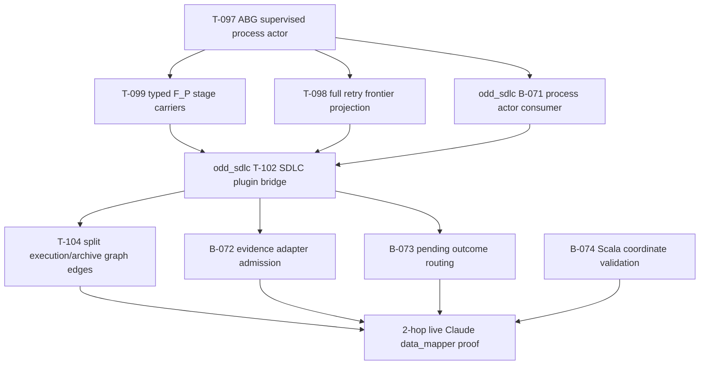
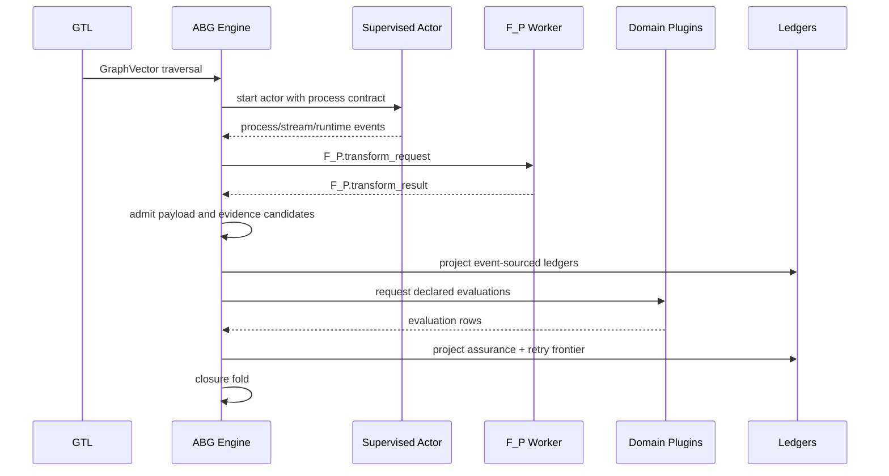

# ABG Engine-First Solution For The Test60 Bug Wave

## Purpose

The `data_mapper.test60.TS.cl` run exposed SDLC symptoms, but the first
architectural defect is in the ABG engine boundary.

The failure mode is not "the SDLC worker did not try hard enough." The failure
mode is that ABG did not yet present one complete engine-owned path for:

```text
GTL vector -> F_P transform -> payload admission -> event emission ->
ledger projection -> evaluation rows -> closure fold -> retry/triage/close
```

Because that engine path was incomplete, `odd_sdlc` carried runtime meaning in
side channels: prompt prose, markdown files, synthesized worker reports, local
postflight checks, latest-only retry context, and local materialization scans.
Those are downstream symptoms of an engine boundary gap.

## Method Anchors

### SPEC_METHOD

Authority flows through:

```text
Goals -> Intent -> Product -> Requirements -> Design -> Code -> Events ->
Projection -> Delta -> Scenarios -> Gap Analysis -> Repricing
```

The `test60` bugs sit in the middle of that chain: code and runtime behavior
were producing events and artifacts, but the authoritative projection and
closure surfaces were split. The lawful re-entry starts at ABG design before
odd_sdlc adapter repairs.

### ODD_METHOD

For an ODD product, the product shape is:

```text
typed domain assets + published graph functions + GTL module or carrier +
ABG runtime + projection/query surface + proof surface
```

ABG is the runtime. `odd_sdlc` is the SDLC domain product over ABG. Therefore
the engine must own traversal, actor execution, event truth, projections,
retry/continuation, and closure fold. `odd_sdlc` supplies graph functions,
domain assets, domain policies, and evaluator plugins.

### DESIGN_MODULE_METHOD

The engine-first bug wave is governed by these design rules:

| Rule | Engine reading |
| --- | --- |
| Authority seam closure | every closure-relevant fact must enter through an admitted ABG carrier |
| Prime law | transform, admission, event, projection, evaluation, and closure are distinct prime carriers |
| Totality | every output is projected as fulfilled, pending, missing, malformed, stale, orphan, or rejected |
| Effect-edge rule | effectful process execution is an explicit engine edge, not hidden inside an archive edge |
| No semantic center | no downstream controller, prompt, or report may become the hidden closure authority |

## Current Engine Fault Topology



The broken shape is that ABG is present, but not yet the sole owner of the
engine loop. The downstream product can still assemble enough local truth to
retry or close without a total engine projection.

## Target Engine Topology



The target rule:

```text
ABG owns execution, events, projections, retry, and closure.
odd_sdlc owns SDLC meaning through graph functions and plugins only.
```

## Engine Bug Set

| Engine bug | Ticket | Symptom seen in test60 | Required correction |
| --- | --- | --- | --- |
| Process actor truth was not fully engine-owned | T-097 | worker process behavior was only partially observable and post hoc | ABG supervised actor emits process, stream, timeout, signal, and exit events and projects liveness |
| F_P stages were collapsed into one report | T-099 | worker report acted as transform result, evidence carrier, evaluator, and closure witness | typed `F_P.transform_request`, `F_P.transform_result`, admission, events, projection, evaluation rows, closure fold |
| Retry frontier was compacted downstream | T-098 | attempt 4 regressed because earlier materialization blockers disappeared | ABG projects full classified retry frontier from all attempts |
| Evidence admission was downstream-local | T-099 plus odd_sdlc B-072 | markdown carried execution evidence but synthesized report showed `null` | ABG admits evidence candidates; odd_sdlc adapter maps artifact evidence into those candidates |
| Pending was not a total closure state | T-099 plus odd_sdlc B-073 | lawful pending became repeated same-edge retry | ABG fold has typed non-closure outcomes; odd_sdlc maps pending blocker classes |
| Effectful test execution was hidden in archive edge | T-099 plus odd_sdlc T-104 | running `sbt test` created `target/` and violated surface edge policy | graph has explicit execution edge whose result feeds archive edge |

## Downstream SDLC Bug Set

These tickets are valid, but they are not the first architectural layer. They
are adapter/domain repairs that consume the ABG engine correction.

| Downstream bug | Ticket | Depends on |
| --- | --- | --- |
| Live Claude lanes need SDLC archive/postflight refs for ABG process actor truth | B-071 | T-097 |
| SDLC typed F_P bridge still uses legacy worker report shape | T-102 | T-099 |
| Execution evidence embedded in artifact is not admitted | B-072 | T-099 |
| Pending execution evidence has contradictory prompt/postflight semantics | B-073 | T-099 |
| Test execution and test run archive are one graph surface | T-104 | T-099 |
| Scala dependency coordinate generation can create invalid cross suffixes | B-074 | T-104 for live qualification, local generator fix can proceed independently |

## Work Order



Closure sequencing:

1. T-097 proves the engine can observe and project live process actor truth.
2. T-099 defines and implements the typed F_P stage algebra.
3. T-098 makes retry frontier a replay-derived ABG projection.
4. T-102 migrates odd_sdlc to the engine-owned stage/admission model.
5. B-072, B-073, T-104, and B-074 repair the SDLC domain plugin and graph.
6. A two-hop live Claude data_mapper lane must show deepening, not premature
   convergence or same-edge oscillation.

## Target Stage Algebra



The worker does not emit authoritative runtime events. The worker returns a
bounded transform result. ABG admits or rejects its payload. Plugins evaluate
admitted facts. The closure fold consumes projections.

## Why Test60 Was Still Worse Than Test35

`test35` deepened because the run carried enough cumulative pressure across
attempts for the next worker call to repair more than one shallow surface.

`test60` restored important TypeScript parity, including normalized source/test
REQ trace coverage, but it still failed the `test35` quality bar because the
engine did not yet force all closure-relevant state through one projected
lineage:

| Quality | test35 behavior | test60 behavior | Engine gap |
| --- | --- | --- | --- |
| cumulative retry memory | pressure deepened across attempts | latest-only retry context erased earlier blockers | T-098 |
| transform/evaluate split | worker output and evaluation were more visibly separated | report carrier mixed construction, evaluation, and closure | T-099 |
| evidence lineage | obligation evidence remained visible to later assessment | artifact evidence did not become admitted execution evidence | T-099/B-072 |
| closure restraint | blockers drove further refinement | pending could become same-edge retry loop | T-099/B-073 |
| effect edge clarity | execution effects were less likely to invalidate the surface edge itself | archive edge both wanted and forbade test execution side effects | T-099/T-104 |

## RC Gate

The tranche is not RC-ready until these conditions hold:

- ABG owns process actor execution and projects live stream/process facts.
- ABG owns typed F_P transform, admission, event, projection, evaluation, and
  closure carriers.
- ABG projects the full retry frontier, not a downstream latest-only dossier.
- odd_sdlc consumes those engine surfaces as a GTL/domain plugin.
- The data_mapper Claude lane proves at least two hops where first-hop evidence
  changes second-hop behavior and prevents premature closure.
- Another agent accepts the STDO/design review after the above is implemented.

Until then, the correct state is active tickets, not release closure.
