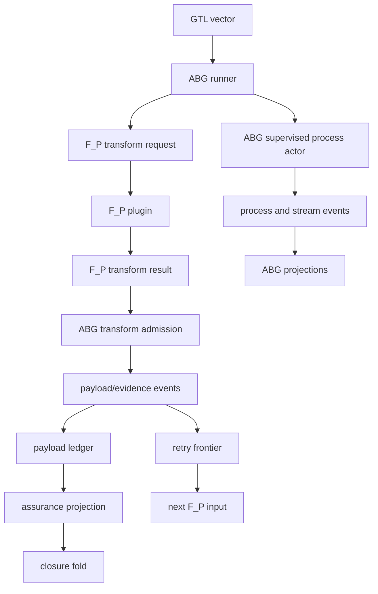

# ABG Engine Bug Fix Implementation Checkpoint

## Claim

The ABG engine bug wave now has deterministic TypeScript implementation for
the three engine-owned surfaces:

- supervised process actor projection (`T-097`)
- full retry frontier projection (`T-098`)
- typed F_P transform stage carriers and admission (`T-099`)

The work is not RC closure. External STDO/code review and a live downstream
Claude lane remain required.

## Method Position

Under `SPEC_METHOD`, the fix starts at ABG because runtime truth sits after
code and before projection, delta, scenarios, gap analysis, and repricing.
Downstream SDLC symptoms are not the first authority layer.

Under `DESIGN_MODULE_METHOD`, the correction is:

| Rule | Correction |
| --- | --- |
| Authority seam closure | closure-relevant payloads enter through ABG carriers and events |
| Prime law | F_P transform request/result, retry frontier, payload ledger, and closure fold are distinct carriers |
| Totality | retry rows and transform evidence are projected, not dropped when the latest dossier changes |
| Effect-edge rule | process actor facts are ABG runtime truth, not terminal transcript truth |
| No semantic center | downstream prompt/report code cannot own retry or closure truth |

## Implemented Shape



## Code Surfaces

| Surface | Change |
| --- | --- |
| `contracts/retry_frontier.ts` | new `RetryFrontierProjection` over retry, actor, payload, ambiguity, and continuation events |
| `contracts/fp_stages.ts` | new `FpTransformRequest`, `FpTransformResult`, `FpEvidenceCandidate`, transform-result admission, and event emission |
| `contracts/plugins.ts` | `EnginePluginInput` now carries `retryFrontier` and `fpTransformRequest` |
| `runner/attached_fp_worker.ts` | attached F_P result ingestion now emits payload/evidence through typed F_P transform admission |
| `runner/engine_runner.ts` | runner passes replay events into plugin input and supplies transform request to result ingestion |
| `runner/assurance_gate.ts` | external authority snapshots now outrank worker-admitted authority rows at convergence |
| `transport/admission.ts` | fulfilled assessments with empty evidence refs are rejected |
| `contracts/index.ts` | new carrier/projection exports |
| `package.json` | added focused `test:t097`, `test:t098`, `test:t099` scripts |
| `test_env/live/test_t097_supervised_process_actor_live.test.mjs` | new Claude live proof through ABG supervised process actor |

## Tests

Passed:

```text
npm run build:semantic
node --test test_env/tests/test_t097_supervised_process_actor.test.mjs
node --test test_env/tests/test_t098_retry_frontier_projection.test.mjs
node --test test_env/tests/test_t099_fp_stage_carriers.test.mjs
node --test test_env/tests/test_t084_attached_fp_worker_loop.test.mjs
node --test test_env/tests/test_t095_payload_ledger_unit.test.mjs test_env/tests/test_t094_assurance_register_two_hop_unit.test.mjs
node --test test_env/tests/test_m03_engine_owned_iterate_runner_unit.test.mjs test_env/tests/t072-m03-plugin-contract-negative.test.mjs test_env/tests/test_m03_plugin_contract_inventory_unit.test.mjs
npm run lint:semantic
npm run test:semantic
npm run lint:test-harness
/bin/zsh -ic 'CODEX_LIVE_FP=1 ABG_TS_LIVE_AGENT=claude ABG_TS_LIVE_TIMEOUT_MS=240000 npm run test:t094:live'
/bin/zsh -ic 'CODEX_LIVE_FP=1 ABG_TS_LIVE_AGENT=claude ABG_TS_LIVE_TIMEOUT_MS=240000 npm run test:t097:live'
```

Full TypeScript semantic suite result at `2026-04-30T23:44:12+10:00`: 304
tests passed, 0 failed. This rerun happened after the review-response changes
for T-098 and T-099.

Live evidence:

- T-094 two-hop Claude assurance register:
  `/Users/jim/src/apps/abiogenesis/build_tenants/abiogenesis/typescript/test_env/test_runs/t094_assurance_register_two_hop_live/20260430T134330381Z`
  (`hop1=close`, `hop2=retry`, `register=deepen`, `mayConverge=false`).
- T-097 Claude supervised process actor:
  `/Users/jim/src/apps/abiogenesis/build_tenants/abiogenesis/typescript/test_env/test_runs/t097_supervised_process_actor_live/20260430T134349638Z`
  (`status=0`, `timedOut=false`, 19 process events, heartbeat before exit,
  stdout stream observed).

## Review Response

The 2026-04-30 review findings were addressed in the code, not only in
commentary:

- T-099 request/result mismatch: added request-scoped transform admission and
  runtime checks for `requestRef`, `actorInvocationId`, and `resultRef`.
- T-099 blocked-result bypass: blocked, runtime-failed, and contract-failed
  attached outcomes now become typed `FpTransformResult` values before retry
  progress is emitted.
- T-099 self-closure leak: fulfilled artifacts with empty evidence refs are
  rejected, and external assurance authority outranks worker-admitted authority
  rows at convergence.
- T-098 spoofed frontier: frontier assertions now validate row shape,
  `frontierRef`, reason classes, event kinds, and full attempt coverage.
- T-097 proof archive drift: live tests now write `assertions.json` beside the
  preserved archive artifacts.

## Remaining Gates

- Independent STDO/code review of T-097/T-098/T-099.
- odd_sdlc T-102 migration to consume the ABG stage/frontier carriers.
- Live data_mapper proof remains downstream acceptance for odd_sdlc T-102, not
  an ABG implementation blocker.
