# F_P Consciousness Loop

## Status

This is a strategy/design proposal, not ratified specification.

The purpose is to make the missing homeostatic evaluator explicit enough to
reason about plugin points, runtime boundaries, and live proof expectations
before this becomes a ticket, requirement, design surface, or implementation.

## Claim

The missing abstraction is the **F_P Consciousness Loop**:

```text
Observe -> Evaluate -> Intend -> Invoke -> Delta -> Observe
```

The loop is not a fixed graph iterator.

The loop is a product/F_P construction controller over linked asset state. It
observes current runtime truth and current assets, evaluates the admissible
graph-function/action library, chooses the highest-value outcome to fulfill,
emits an explicit construction intent, and asks ABG to invoke the selected
graph function.

ABG is the runtime substrate:

- admits intent and invocation carriers
- materializes the selected graph function
- traverses internal graph vectors
- emits events
- stores ledgers
- derives projections
- preserves replay, lineage, and correction truth

ABG does not decide the product-building strategy.

The F_P consciousness evaluator decides which lawful construction outcome to
pursue next.

## Why This Is Needed

The current runtime has many of the pieces:

- `GraphFunction` as public callable constructive carrier
- `GraphVector` as internal realized traversal structure
- `ExecutionBasis`, `AdvancementTransition`, and event-sourced runtime truth
- plugin traversal observers
- traversal modulation
- graph-span reentry frontier projection
- non-progress continuation projection
- assurance ledgers and closure folds
- domain F_P/F_D plugins
- gap dossiers

But these pieces do not yet combine into one first-class construction-site
evaluator.

The result is that a gap often collapses to a narrow projection:

```text
current edge has gap -> retry same edge
```

That is insect-level reflex.

The intended higher-order loop is:

```text
current linked asset state has gap
-> evaluate admissible outcomes and graph actions
-> choose construction intent
-> invoke selected graph function
-> observe delta and ledgers
-> continue, escalate, or stop lawfully
```

## Current Failure Symptom

The live `odd_sdlc` T-109 data-mapper run exposed the defect in a concrete
form.

The worker repaired `derive_implementation_module_surface` incrementally. Each
attempt changed the artifact and removed one blocker, but the public projection
still looked like repeated `same_edge_retry`.

Observed blocker sequence:

```text
design_depth_register.moduleStateDiagramFragments[20].transitions[0].from
  -> unexpected field

design_depth_register.moduleSchemaFragments[0].entities[0].ownership
  -> expected one of "owned", "referenced"

design_depth_register.moduleSchemaFragments[0].entities[3].attributes[0].cardinality
  -> expected one of "one", "optional", "many"

design_depth_register.moduleStateDiagramFragments[8].transitions[0].kind
  -> unexpected transition kind
```

That is not necessarily failed self-healing.

It is incremental repair without a first-class construction progress surface.

The harness timed out because the system only projected the reflex:

```text
same edge retry
```

It did not project:

```text
F_P observed schema-local construction gap;
F_P selected local repair over the implementation module asset;
the artifact changed;
the prior blocker was removed;
the next blocker is different;
repair remains lawful and progressing.
```

## Conceptual Model

### Higher-Order Loop

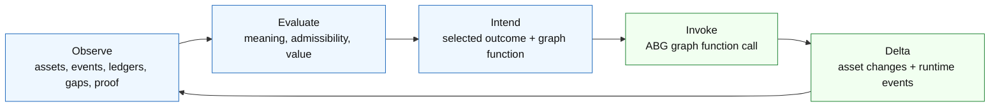

### Layer Ownership

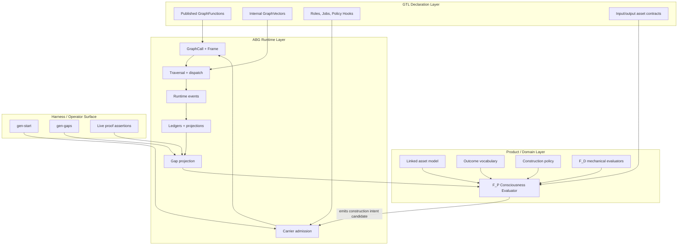

Important distinction:

- F_P selects product construction intent.
- ABG admits and executes the selected invocation.
- The harness observes/proves; it does not become the controller.

## Terminology

### Observer

The observer is the input-gathering stage.

It reads:

- current linked asset state
- runtime events
- ledgers
- gap dossiers
- proof surfaces
- prior intents
- prior graph calls
- prior asset deltas
- current operator request, if any

The observer does not choose.

### Evaluator

The evaluator is the F_P construction judgment stage.

It decides:

- what the current state means
- which gaps are material
- which outcomes are missing or broken
- which graph actions are admissible
- which admissible action has highest value now
- whether the system is progressing, stalled, blocked, or should escalate

This is product/F_P judgment, not ABG runtime judgment.

### Intent

Intent is the emitted construction action.

It names:

- selected outcome
- selected graph function/action
- target assets
- source assets
- observed gap refs
- lawful basis
- expected delta
- progress condition
- escalation condition

Intent is not the iterator.

Intent is the evaluator's selected lawful construction move.

### Invoke

Invoke is ABG accepting the intent and running the selected graph function
under typed runtime law.

### Delta

Delta is the resulting change in asset state and runtime truth:

- artifacts
- admitted payloads
- runtime events
- ledgers
- gap projections
- proof projections
- continuation/reentry projections

## Existing Hook Model And Required Extension

The current hook model already has:

- `dispatch`
- `traversal_modulation`
- `plugin_traversal_observer`
- `evaluation`
- `escalation`
- `proof`
- `closure`
- `assurance`

Those remain valid.

The F_P Consciousness Loop adds a higher product-control hook concern:

```text
construction_evaluator
```

This is not the same as an assurance hook.

Assurance hooks provide policy/evidence inputs to ABG projections. They do not
select the next construction outcome.

The construction evaluator is an F_P/product plugin that returns a typed
construction intent candidate. ABG admits that candidate and emits runtime
events for the accepted decision. The plugin does not write runtime events
directly.

### Hook Placement

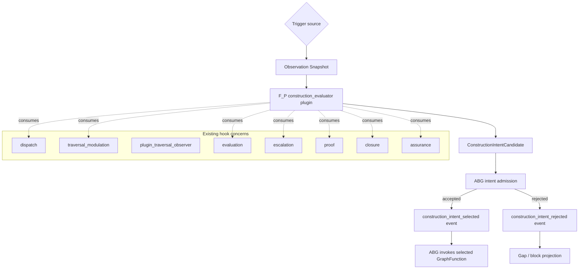

## Trigger Points

The evaluator should be callable from multiple runtime paths.

It is a dropped-in plugin, not a single hardwired loop.

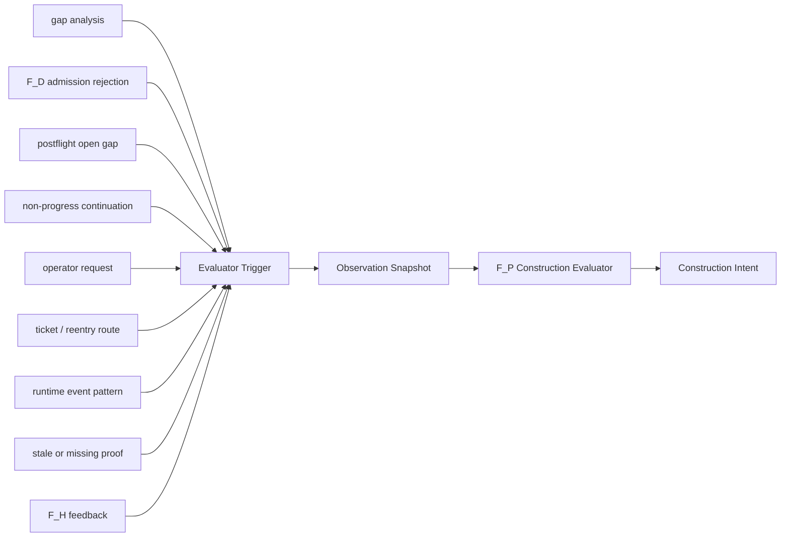

Trigger classes:

| Trigger | Meaning | Typical next evaluator question |
| --- | --- | --- |
| Gap dossier | Current projection has open gap truth | Which missing outcome is highest value? |
| F_D rejection | Mechanical admission found invalid envelope/schema/digest/root | Is local repair admissible or should F_P escalate? |
| Postflight gap | Transform completed but closure conditions did not hold | Is this construction progress, stagnation, or wrong action? |
| Non-progress continuation | Worker produced no progress artifact or transport failed | Retry, yield, inspect, reprice policy, or block? |
| Operator request | Human asks for a product outcome | Which graph function fulfills the requested outcome lawfully? |
| Ticket/reentry route | Durable work item points at a change class/reentry point | Which graph action begins lawful work? |
| Runtime event pattern | A sequence of events implies a construction condition | Should the evaluator inspect, repair, or wait? |
| Proof stale/missing | Closure proof cannot be admitted | Build proof, rerun verification, or reprice claim? |
| F_H feedback | Human resolved ambiguity or changed instruction | Continue same construction episode or reprice? |

## Observation Snapshot

The evaluator must receive one stable observation snapshot.

It should not scrape ad hoc files, parse terminal output as law, or rely on
latest-only local process state.

Candidate carrier:

```ts
interface ConstructionObservationSnapshot {
  readonly kind: "construction_observation_snapshot";
  readonly snapshotVersion: "abg-construction-observation-v1";
  readonly snapshotRef: string;
  readonly basisId: string;
  readonly trigger: ConstructionEvaluatorTrigger;
  readonly graphFunctionCatalogRef: string;
  readonly linkedAssetStateRef: string;
  readonly gapDossierRefs: readonly string[];
  readonly ledgerRefs: readonly string[];
  readonly proofSurfaceRefs: readonly string[];
  readonly priorIntentRefs: readonly string[];
  readonly priorGraphCallRefs: readonly string[];
  readonly priorDeltaRefs: readonly string[];
  readonly operatorInputRefs: readonly string[];
  readonly timestamp: string;
}
```

This is an ABG-admitted carrier because it is runtime input to a product/F_P
decision.

## Linked Asset State

The unit of reasoning is not only the current edge.

The unit is the linked asset workspace.

The linked asset state should represent:

- asset refs
- asset types
- asset status
- owning graph function or source authority
- dependencies
- reverse dependencies
- latest admitted digest
- latest rejected digest
- open gap refs
- proof refs
- materialization roots
- tenant/product scope
- supersession lineage

Candidate carrier:

```ts
interface LinkedAssetState {
  readonly kind: "linked_asset_state";
  readonly stateVersion: "abg-linked-assets-v1";
  readonly stateRef: string;
  readonly assets: readonly LinkedAssetNode[];
  readonly dependencyEdges: readonly LinkedAssetDependency[];
  readonly openGapRefs: readonly string[];
  readonly currentProofRefs: readonly string[];
  readonly projectionBasisEventRefs: readonly string[];
}

interface LinkedAssetNode {
  readonly assetRef: string;
  readonly assetType: string;
  readonly status:
    | "missing"
    | "draft"
    | "admitted"
    | "rejected"
    | "stale"
    | "superseded"
    | "blocked";
  readonly ownerRef: string;
  readonly producedByGraphFunctionRef?: string;
  readonly latestDigest?: string;
  readonly latestRejectedDigest?: string;
  readonly gapRefs: readonly string[];
  readonly proofRefs: readonly string[];
}
```

## Graph Action Library

The evaluator reasons over outcomes, not just edges.

The action library should expose the graph functions and other lawful actions
as outcome-producing moves.

Candidate carrier:

```ts
interface ConstructionActionCatalog {
  readonly kind: "construction_action_catalog";
  readonly catalogVersion: "abg-construction-actions-v1";
  readonly catalogRef: string;
  readonly actions: readonly ConstructionActionDescriptor[];
}

interface ConstructionActionDescriptor {
  readonly actionRef: string;
  readonly actionKind:
    | "invoke_graph_function"
    | "invoke_repair_function"
    | "inspect_runtime_archive"
    | "request_fh_input"
    | "create_ticket"
    | "reprice_requirement"
    | "reprice_design"
    | "typed_block";
  readonly graphFunctionRef?: string;
  readonly producedOutcomeRefs: readonly string[];
  readonly targetAssetTypes: readonly string[];
  readonly requiredInputAssetTypes: readonly string[];
  readonly admissibilityRuleRefs: readonly string[];
  readonly policyRefs: readonly string[];
  readonly estimatedCost?: ConstructionActionCost;
  readonly expectedDeltaKinds: readonly string[];
  readonly closureContributionRefs: readonly string[];
}
```

The action catalog can be derived from:

- GTL module publication
- published graph functions
- graph-function environment contracts
- declared policy hooks
- product action descriptors
- ticket/reentry law
- runtime-installed plugin registry

## Evaluator Algorithm

The evaluator algorithm should be explicit.

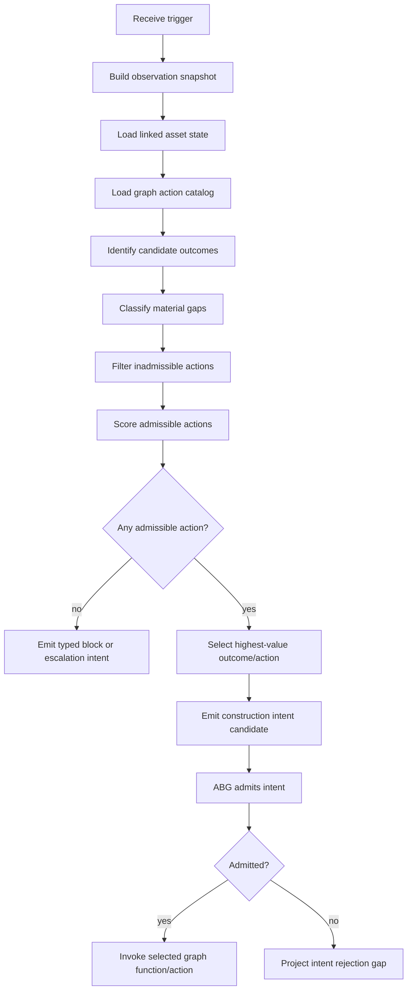

Pseudo-code:

```text
evaluate(snapshot):
  state = load_linked_asset_state(snapshot.linkedAssetStateRef)
  catalog = load_action_catalog(snapshot.graphFunctionCatalogRef)
  gaps = load_gap_truth(snapshot.gapDossierRefs, snapshot.ledgerRefs)
  proof = load_proof_truth(snapshot.proofSurfaceRefs)
  history = load_prior_intents_and_deltas(snapshot.priorIntentRefs, snapshot.priorDeltaRefs)

  outcomes = derive_missing_or_broken_outcomes(state, gaps, proof)
  material = rank_gap_materiality(outcomes, state, history)

  candidates = []
  for outcome in material:
    for action in catalog.actions:
      if action_can_fulfill(action, outcome):
        candidates.push({ outcome, action })

  admissible = candidates.filter(candidate =>
    satisfies_reentry_law(candidate, snapshot) &&
    satisfies_asset_inputs(candidate, state) &&
    satisfies_scope_policy(candidate, state) &&
    satisfies_regime_boundary(candidate, gaps) &&
    satisfies_progress_policy(candidate, history)
  )

  if admissible.empty:
    return typed_block_or_escalation(material, state, history)

  scored = admissible.map(candidate => ({
    candidate,
    score: value(candidate, state, gaps, proof, history)
  }))

  return construction_intent(max(scored))
```

## Admissibility Law

The evaluator can re-enter at any graph point, but not arbitrarily.

Every selected action must satisfy admissibility.

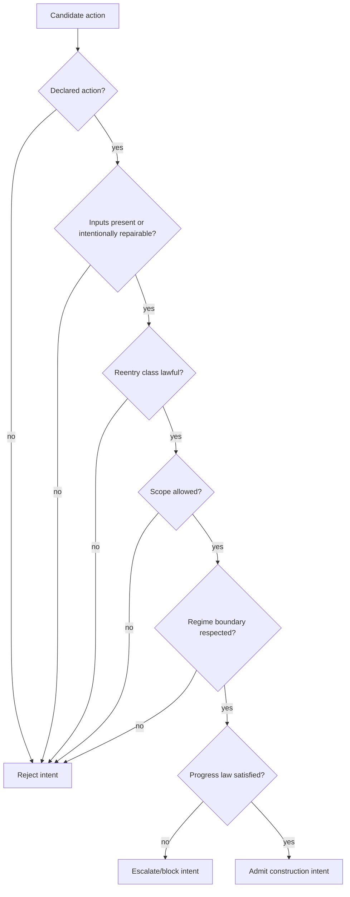

Admissibility dimensions:

| Dimension | Question |
| --- | --- |
| Declaration | Is this action published in the graph/action catalog? |
| Input assets | Are required assets present, or is missing input itself the selected outcome? |
| Reentry class | Does method/design permit this reentry from the observed gap? |
| Scope | Does the action stay inside the current construction scope, or declare widening? |
| Regime | Is F_D only doing mechanics and F_P doing semantic construction judgment? |
| Authority | Are source requirements/design/product surfaces available and current? |
| Progress | Is the action likely to advance, or has it already stagnated? |
| Proof | Does the action improve a declared proof/closure path? |

## Value Function

The evaluator chooses the highest-value admissible outcome.

The value function is product policy, not ABG kernel law.

Default dimensions:

| Dimension | Higher value means |
| --- | --- |
| Closure contribution | Resolves a proof-critical blocker or unlocks release path |
| Dependency fan-out | Unblocks many downstream assets |
| Minimality | Repairs the smallest lawful asset set |
| Progress evidence | Prior attempts show movement, not repetition |
| Risk | Lower chance of broad regeneration or authority drift |
| Cost | Lower worker/runtime cost for the expected gain |
| Specificity | Targeted gap with precise expected delta |
| Freshness | Responds to current gap truth, not stale projections |
| Human burden | Avoids F_H unless ambiguity requires it |

Candidate score sketch:

```ts
interface ConstructionActionScore {
  readonly closureGain: number;
  readonly dependencyGain: number;
  readonly minimalityGain: number;
  readonly progressConfidence: number;
  readonly riskPenalty: number;
  readonly costPenalty: number;
  readonly specificityGain: number;
  readonly freshnessGain: number;
  readonly humanBurdenPenalty: number;
  readonly total: number;
}
```

## Intent Carrier

The key missing carrier is the construction intent.

Candidate shape:

```ts
interface ConstructionIntentCandidate {
  readonly kind: "construction_intent_candidate";
  readonly intentVersion: "abg-construction-intent-v1";
  readonly intentRef: string;
  readonly evaluatorRef: string;
  readonly observationSnapshotRef: string;
  readonly triggerRef: string;
  readonly selectedOutcomeRef: string;
  readonly selectedActionRef: string;
  readonly selectedGraphFunctionRef?: string;
  readonly targetAssetRefs: readonly string[];
  readonly targetAssetTypes: readonly string[];
  readonly sourceAssetRefs: readonly string[];
  readonly observedGapRefs: readonly string[];
  readonly lawfulBasisRefs: readonly string[];
  readonly expectedDelta: ConstructionExpectedDelta;
  readonly scopeDecision: ConstructionScopeDecision;
  readonly progressCondition: ConstructionProgressCondition;
  readonly escalationCondition: ConstructionEscalationCondition;
  readonly valueScore: ConstructionActionScore;
  readonly rejectedAlternativeRefs: readonly string[];
}
```

ABG should admit this candidate into an accepted runtime carrier:

```ts
interface AdmittedConstructionIntent {
  readonly kind: "admitted_construction_intent";
  readonly intentVersion: "abg-construction-intent-v1";
  readonly intentRef: string;
  readonly candidateRef: string;
  readonly basisId: string;
  readonly graphCallPlanRef?: string;
  readonly admittedAt: string;
  readonly admissionEventRef: string;
}
```

## Progress Ledger

Incremental repair becomes lawful through a progress ledger.

The progress ledger should answer:

- Did the target asset change?
- Did the prior blocker disappear?
- Is the new blocker different?
- Is the change within the declared scope?
- Did the action create broader damage?
- Is the evaluator still allowed to continue?
- Has repair stagnated?

Candidate carrier:

```ts
interface ConstructionProgressLedger {
  readonly kind: "construction_progress_ledger";
  readonly ledgerVersion: "abg-construction-progress-v1";
  readonly constructionEpisodeRef: string;
  readonly entries: readonly ConstructionProgressEntry[];
}

interface ConstructionProgressEntry {
  readonly intentRef: string;
  readonly graphCallRef: string;
  readonly attemptIndex: number;
  readonly targetAssetRefs: readonly string[];
  readonly priorAssetDigests: readonly string[];
  readonly newAssetDigests: readonly string[];
  readonly priorGapDigest: string;
  readonly newGapDigest: string;
  readonly priorBlockerRefs: readonly string[];
  readonly resolvedBlockerRefs: readonly string[];
  readonly newBlockerRefs: readonly string[];
  readonly progressStatus:
    | "progressed"
    | "unchanged"
    | "regressed"
    | "broadened_scope"
    | "blocked"
    | "closed";
  readonly nextEvaluatorTriggerRef?: string;
}
```

## Incremental Repair Law

Incremental repair is lawful when progress is real.

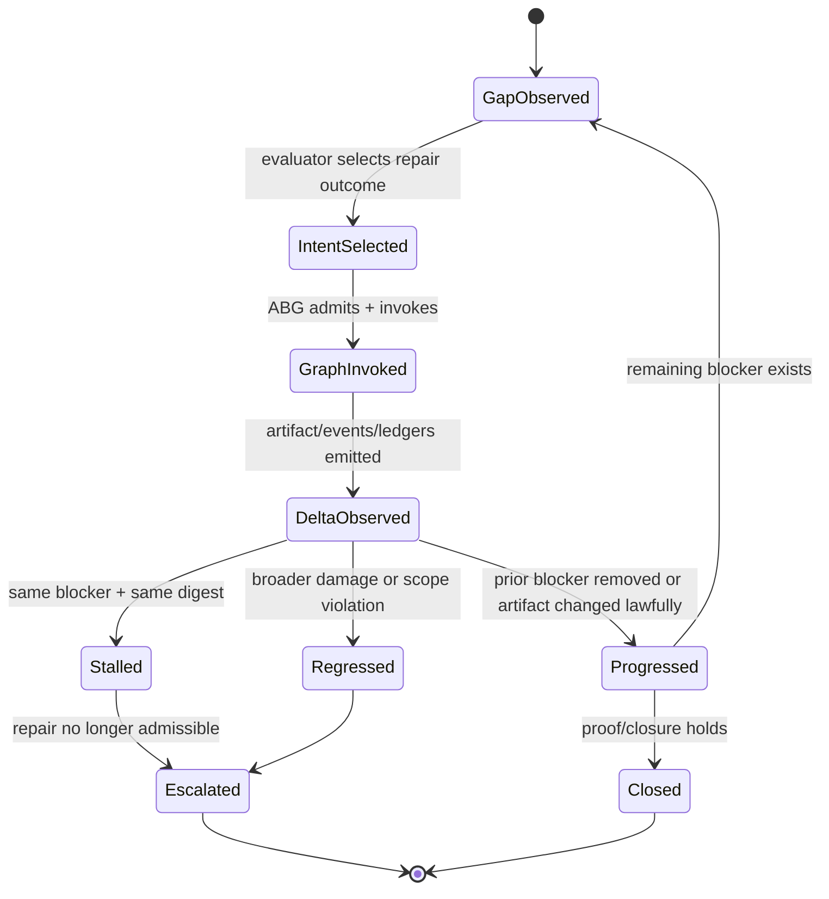

This is different from "fix all errors in one worker call."

The desired law is:

```text
one defect per attempt can be valid
if each attempt produces typed progress
and the evaluator keeps choosing the repair as highest-value admissible action.
```

## Arbitrary Lawful Reentry

The evaluator can re-enter the graph at any lawful point.

It is not bound to:

- next edge
- same edge
- current vector index
- current harness step

It is bound to admissibility.

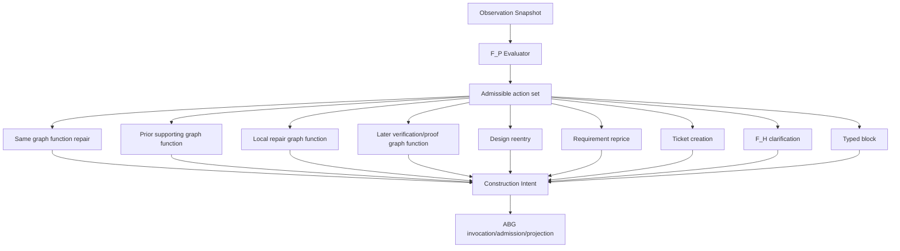

Examples:

| Observed condition | Possible evaluator action |
| --- | --- |
| Schema-local alias in output carrier | same graph function with repair context |
| Missing source asset | invoke earlier graph function that produces source asset |
| Test execution failure | invoke repair graph function over implicated test/code assets |
| Ambiguous requirement identity | F_P requirement clarification or F_H escalation |
| F_D finds exact protocol envelope invalid | block or repair envelope depending on declared alias law |
| Proof stale | invoke proof/verification graph function |
| Repeated same blocker | typed stagnation escalation |

## Sequence: From Gap To Selected Invocation

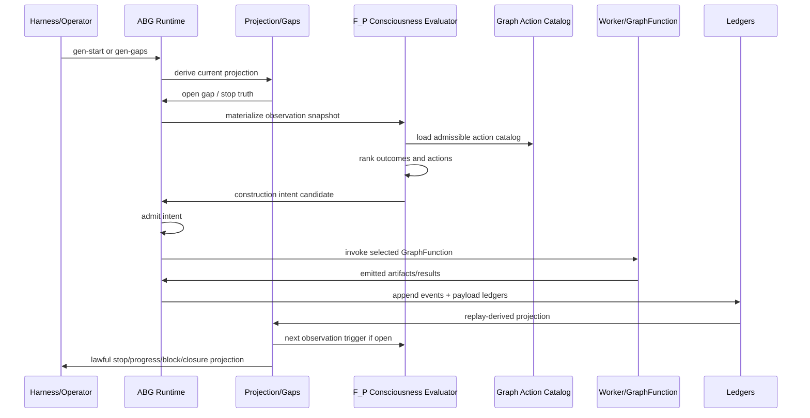

## Event Model

New runtime event classes should be considered.

The plugin should not write these events directly. It returns carriers. ABG
admits the carriers and emits the events.

Candidate events:

```text
construction_observation_snapshot_materialized
construction_evaluator_invoked
construction_action_catalog_projected
construction_intent_candidate_returned
construction_intent_admitted
construction_intent_rejected
construction_graph_function_selected
construction_progress_observed
construction_progress_ledger_projected
construction_reentry_selected
construction_stagnation_detected
construction_escalation_selected
```

Event causation chain:

```mermaid
flowchart LR
  TriggerEvent[trigger event/gap] --> SnapshotEvent[observation snapshot materialized]
  SnapshotEvent --> EvalEvent[evaluator invoked]
  EvalEvent --> CandidateEvent[intent candidate returned]
  CandidateEvent --> AdmitEvent[intent admitted]
  AdmitEvent --> SelectEvent[graph function selected]
  SelectEvent --> GraphCallEvent[graph call started]
  GraphCallEvent --> ResultEvent[result/artifact events]
  ResultEvent --> ProgressEvent[progress observed]
  ProgressEvent --> Projection[projection/gaps]
```

## Projection Requirements

The public projection must not collapse construction truth into
`same_edge_retry`.

It should distinguish:

| Projection | Meaning |
| --- | --- |
| `construction_intent_selected` | F_P selected a graph action for an observed gap |
| `construction_progressing` | Latest attempt made lawful progress but closure remains open |
| `construction_stalled` | Same blocker/digest or no meaningful delta |
| `construction_reentry_selected` | Evaluator selected a different graph point |
| `construction_escalation_required` | No F_P-local action remains admissible |
| `construction_blocked` | Typed block; operator/F_H/ticket/reprice needed |
| `construction_closed` | Target outcome/proof surface closed |

The harness should assert these projections rather than enforcing one fixed
edge sequence.

## Relationship To Current ABG Primitives

### Traversal Modulation

Traversal modulation governs how an F_P attempt over one selected traversal is
bounded.

The consciousness evaluator chooses which outcome/action/traversal should be
attempted.

They compose:

```text
F_P consciousness evaluator
  -> chooses selected graph function/action
  -> ABG resolves traversal modulation for that selected action
  -> ABG derives TraversalAttemptEnvelope
  -> worker performs bounded attempt
```

### Plugin Traversal Observer

Plugin traversal observer materializes prompt/observer context for Transform
and Eval plugins.

The consciousness evaluator consumes observation snapshots and may use observer
bindings, but its output is construction intent, not a transform result.

### Graph Reentry Frontier

Graph reentry frontier projects possible graph-span reentry.

The consciousness evaluator uses the frontier as one admissibility input, but
chooses product construction intent over the linked asset state.

### Non-Progress Continuation

Non-progress continuation classifies no-progress F_P attempts.

The consciousness evaluator consumes that classification and decides whether to
retry, yield, inspect, reprice policy, escalate, or block.

### Assurance Projection

Assurance projection folds admitted evidence and closure policy.

The consciousness evaluator consumes assurance truth. It does not replace
assurance. It chooses the next construction action when assurance leaves gaps
open.

## Corrected Public Loop

The current public loop is roughly:

```text
gen-start -> current traversal -> postflight/gap -> retry/block/close
```

The proposed public loop is:

```text
gen-start or gen-gaps
-> ABG projection
-> evaluator trigger if construction decision is required
-> F_P construction intent
-> ABG graph invocation
-> events/ledgers/projection
-> lawful stop:
     closed
     progressing
     blocked
     escalated
     needs operator/F_H/ticket/reprice
```

Flow:

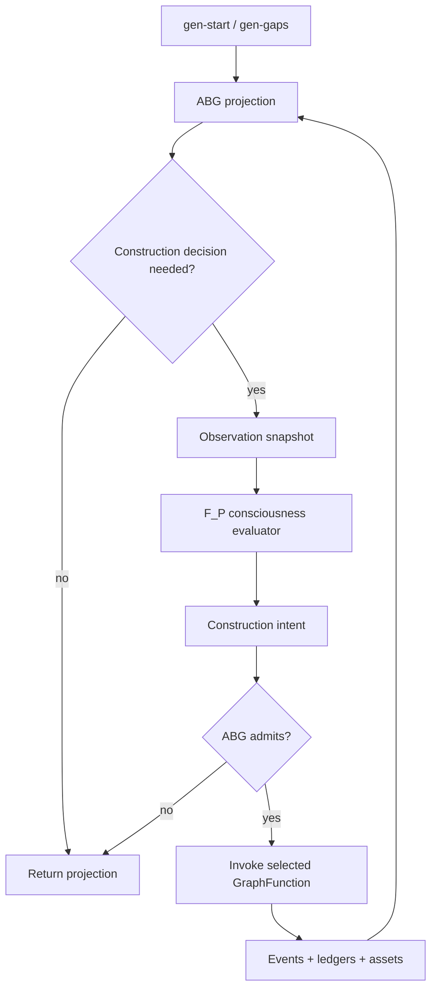

## Live Harness Expectations

The harness should prove the consciousness loop, not force a narrow loop.

The harness should assert:

- observation snapshot was materialized when a gap required construction
- evaluator was invoked through declared plugin law
- construction intent was emitted
- selected graph action was admissible
- ABG admitted and invoked the selected graph function
- runtime events and ledgers preserve causation
- progress ledger records artifact/gap delta
- repeated progress may continue
- repeated stagnation escalates or blocks
- process timeout is infrastructure failure only, not normal construction stop

### Harness Anti-Pattern

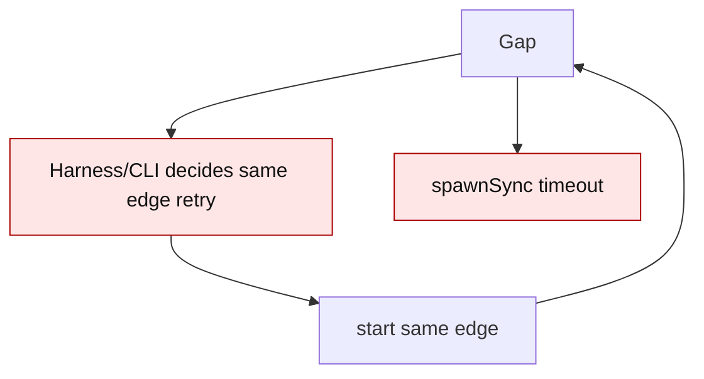

### Harness Target

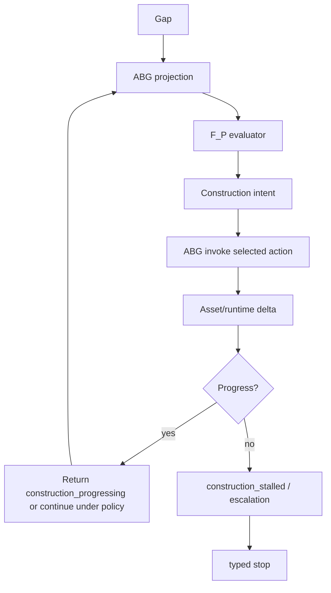

## Boundary Rules

1. F_P controls building-site strategy.
2. ABG controls runtime truth, invocation, events, ledgers, replay, projection,
   and carrier admission.
3. GTL declares graph functions, graph vectors, jobs, roles, and policy hook
   attachment points.
4. F_D checks mechanics only: schema, digest, write root, existence, envelope,
   identity, protocol.
5. F_D cannot invent stricter product requirements from ambiguous inputs.
6. F_D findings can trigger F_P evaluation.
7. The evaluator can re-enter at any lawful graph point.
8. The evaluator's decision must be durable, replayable, and inspectable.
9. The plugin does not emit runtime events directly.
10. Prompt prose is projection, not authority.
11. Harnesses prove emitted runtime truth; they do not own construction policy.

## Non-Goals

This proposal does not say:

- ABG should own product strategy.
- The harness should become a controller.
- Same-edge repair is bad.
- Incremental repair is bad.
- Workers must fix all known errors in one pass.
- F_D should broaden into semantic product judgment.
- Product-specific repair heuristics should move into the ABG kernel.
- Prompt text should become the scheduler.

## Design Questions

These require decision before implementation:

1. Is `construction_evaluator` a new hook concern under GTL declarations, or a
   product-layer policy hook bound through existing `evaluation`/`dispatch`
   declarations?
2. Does the evaluator run inside `gen-start`, `gen-gaps`, or both?
3. Does the evaluator return one selected intent, or a ranked set where ABG
   admits the first lawful option?
4. Should construction progress be a generic ABG carrier or an app-level
   projection contract consumed by ABG?
5. How does the evaluator interact with existing graph-span reentry frontier:
   consume only, or produce reentry-plan candidates?
6. What is the minimal public projection needed by downstream apps:
   `construction_progressing`, `construction_stalled`, `construction_blocked`,
   and `construction_closed`, or a richer surface?
7. How should evaluator policy be tested without embedding tenant vocabulary in
   ABG core?
8. How does F_H feedback enter the same construction episode without becoming
   a side channel?

## Suggested Work Decomposition

### Ticket 1: Design Surface

Ratify the F_P Consciousness Loop design:

- define observation snapshot
- define construction action catalog
- define construction intent
- define progress ledger
- define projection vocabulary
- define boundary with traversal modulation, graph reentry, and assurance

### Ticket 2: Deterministic Contract Tests

Add contract tests for:

- evaluator trigger from gap dossier
- evaluator trigger from F_D rejection
- same-edge incremental progress
- graph reentry to a prior supporting function
- graph reentry to a local repair function
- stagnation detection
- ABG admission rejecting illegal intent
- projection does not collapse to `same_edge_retry`

### Ticket 3: Minimal Runtime Slice

Implement the smallest generic ABG support:

- observation snapshot materialization
- construction intent admission
- event emission
- graph function invocation from admitted intent
- progress ledger projection

### Ticket 4: odd_sdlc Proving Domain

Use `odd_sdlc` as downstream proof:

- design-depth schema-local repair over linked assets
- component repair schedule consumption
- Scala test compile repair
- release-depth proof rederive
- live harness asserts construction progress/block truth

## Minimal Acceptance Scenario

Given:

- an implementation module asset is rejected by F_D for a design-depth schema
  issue
- the graph action catalog has a lawful repair action or the original graph
  function is repair-admissible

When:

- `gen-gaps` or `gen-start` projects the gap
- the F_P consciousness evaluator is triggered

Then:

- an observation snapshot is materialized
- the evaluator selects a lawful construction intent
- ABG admits the intent
- ABG invokes the selected graph function
- the progress ledger records the artifact and gap delta
- if the next gap differs and the prior gap is removed, projection reports
  `construction_progressing`
- if the same gap repeats with unchanged artifact digest, projection reports
  `construction_stalled` or escalation

Mermaid scenario:

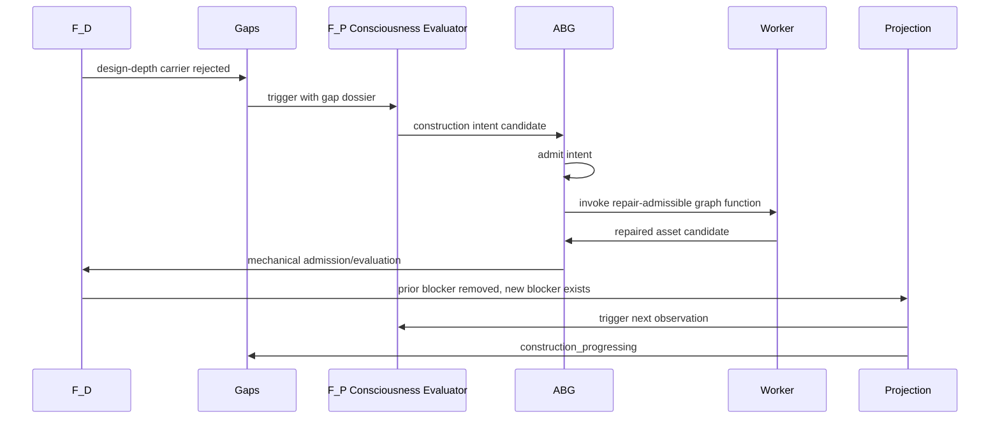

## Closing Position

The F_P Consciousness Loop is the missing homeostatic evaluator.

It turns the system from:

```text
gap -> retry edge
```

into:

```text
gap -> observation -> F_P evaluation -> construction intent ->
selected graph function -> runtime delta -> new observation
```

That is the move from traversal automaton to governed construction agent.

The important implementation discipline is that consciousness does not live in
the CLI, the harness, or prompt prose.

It lives in admitted F_P evaluator outputs over linked asset state, with ABG
preserving the runtime truth of every selected intent, graph invocation, and
progress delta.
