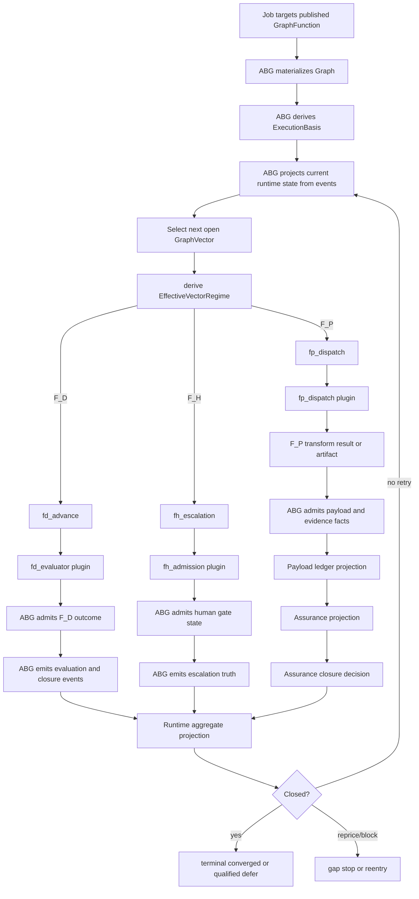
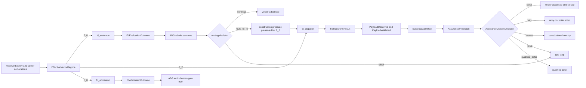
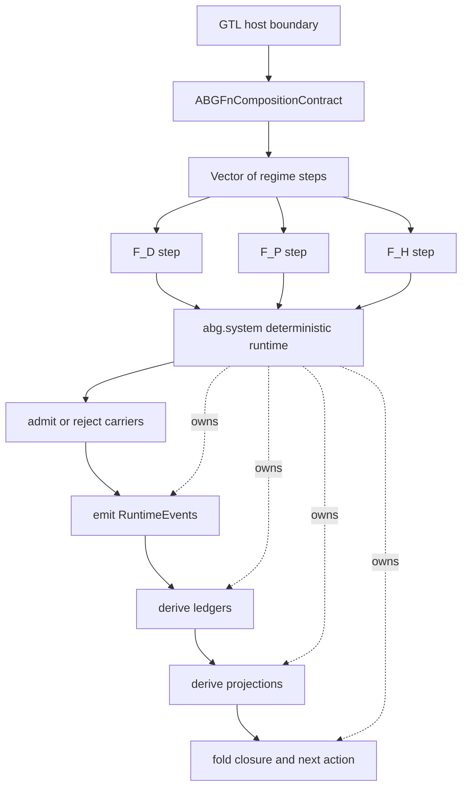

# ABG Current State: Plugins, Ledgers, And Escalation Composition

Status: commentary, not ratified specification.
Author: Codex
Date: 2026-05-22

## Claim

ABG's current architecture is already pointing at the intended regime algebra:

```text
A -> F_{D|P|H}.transform -> B -> F_{D|P|H}.eval -> actions
```

The missing design layer is that the selected regimes are not just a flat
ordered list. They are a regime vector interpreted inside a deterministic ABG
system carrier:

```text
abg.system(Vector(F_D, F_P, F_H))
```

`Vector(F_D, F_P, F_H)` is the composable work/evaluation sequence. `abg.system`
is the deterministic runtime monad that binds the sequence, admits outputs,
emits events, derives ledgers, projects state, and folds closure. Events and
ledgers reside in `abg.system`, not in the regime functors or plugins.

The current TypeScript runtime does not yet expose the full `abg.fn_composition`
contract as one parsed typed runtime object. It does implement the critical
substrate pieces:

- vector-local `F_D` / `F_P` / `F_H` regime selection;
- runner-owned transition selection;
- typed plugin contracts with no vector, event, closure, or loop authority;
- event-sourced payload ledger projection;
- assurance projection and closure fold over admitted ledger truth;
- F_P transform and F_P edge-assurance finding carriers that reject engine
  authority fields.

The Python line still shows the remembered escalation syntax directly:

```python
{
  "regime_order": ("F_D", "F_P", "F_H"),
  "open_transition": {"F_D": "F_P", "F_P": "F_H"},
  "fail_transition": {"F_D": "F_P", "F_P": "F_H"},
}
```

The current TypeScript line realizes that direction through
`EffectiveVectorRegime` and `AdvancementTransition`:

```text
EffectiveVectorRegime(F_D) -> fd_advance
EffectiveVectorRegime(F_P) -> fp_dispatch
EffectiveVectorRegime(F_H) -> fh_escalation
```

## Current Source Anchors

- `specification/PRODUCT.md` defines graph vectors as internal traversal
  boundaries and graph functions as public callable carriers.
- `specification/requirements/abg/REQ-R-ABG3-FN-COMPOSITION.md` defines
  `abg.fn_composition` as the replay-stable mixed-regime contract.
- `build_tenants/abiogenesis/typescript/design/M03_ABG_FN_COMPOSITION_DERIVATION.md`
  defines `ABGFnCompositionContract` and ordered `ABGFnRegimeBinding[]`.
- `build_tenants/abiogenesis/typescript/code/src/abg/m03/contracts/regime_resolution.ts`
  implements vector-local effective regime selection.
- `build_tenants/abiogenesis/typescript/code/src/abg/m03/contracts/iteration.ts`
  maps effective regime to runner transition.
- `build_tenants/abiogenesis/typescript/code/src/abg/m03/contracts/plugins.ts`
  defines plugin inventory and authority limits.
- `build_tenants/abiogenesis/typescript/code/src/abg/m03/contracts/payload_ledger.ts`
  derives event-sourced payload ledger projection.
- `build_tenants/abiogenesis/typescript/code/src/abg/m03/runner/assurance_gate.ts`
  derives assurance gate state from payload ledger and provider output.
- `build_tenants/abiogenesis/typescript/code/src/abg/m03/contracts/edge_assurance_contract.ts`
  admits F_P edge assurance eval findings while forbidding engine authority.

## Domain Model

```mermaid
classDiagram
  direction LR

  class Module {
    <<GTL>>
    +graphs
    +graphFunctions
    +jobs
    +roles
    +policyHooks
  }

  class Job {
    <<GTL>>
    +graphFunctionRefs
    +roles
  }

  class GraphFunction {
    <<GTL>>
    +inputs
    +outputs
    +environment
    +template
  }

  class Graph {
    <<GTL>>
    +nodes
    +vectors
  }

  class GraphVector {
    <<GTL>>
    +source
    +target
    +operators
    +evaluators
    +declarations
  }

  class Operator {
    <<GTL>>
    +regime
    +binding
  }

  class Evaluator {
    <<GTL>>
    +regime
    +binding
    +consumedFieldRefs
  }

  class ABGFnCompositionContract {
    <<ABG>>
    +contractRef
    +host
    +regimes
    +carrier
    +assurance
    +closure
  }

  class RegimeVector {
    <<ABG>>
    +steps
    +orderedRegimeBindings
    +compositionRef
  }

  class AbgSystem {
    <<ABG>>
    +bind
    +admit
    +emit
    +project
    +foldClosure
  }

  class ExecutionBasis {
    <<ABG>>
    +startIntent
    +resolvedPolicy
    +runtimeIdentity
    +graphFunction
  }

  class EffectiveVectorRegime {
    <<ABG>>
    +regime
    +source
    +sourceRef
    +diagnosticRefs
  }

  class AdvancementTransition {
    <<ABG>>
    +kind
    +vectorIndex
    +edge
  }

  class RuntimeEventLog {
    <<ABG>>
    +runtimeEvents
  }

  class PayloadLedgerProjection {
    <<ABGProjection>>
    +observedPayloads
    +validatedPayloads
    +authoritySnapshots
    +evidenceRows
    +ambiguityObservations
    +closureInputs
  }

  class AssuranceProjection {
    <<ABGProjection>>
    +authoritySnapshot
    +evidenceRows
    +ambiguityRows
    +projectionRef
  }

  class AssuranceClosureDecision {
    <<ABGProjection>>
    +decision
    +reason
  }

  class EnginePluginContract {
    <<ABG>>
    +pluginKind
    +authority
    +inputCarrier
    +outputCarrier
  }

  class Plugin {
    <<external>>
    +effectOrProvider
    +noEventAuthority
    +noClosureAuthority
    +noLoopAuthority
  }

  Module --> Job : publishes
  Job --> GraphFunction : binds
  GraphFunction --> Graph : materializes
  Graph --> GraphVector : contains
  GraphVector --> Operator : declares
  GraphVector --> Evaluator : declares
  GraphVector --> ABGFnCompositionContract : may declare
  GraphFunction --> ABGFnCompositionContract : may default
  ABGFnCompositionContract *-- RegimeVector : carries

  GraphFunction --> ExecutionBasis : selected for run
  ExecutionBasis --> EffectiveVectorRegime : derives
  EffectiveVectorRegime --> AdvancementTransition : selects
  AdvancementTransition --> AbgSystem : enters
  RegimeVector --> AbgSystem : interpreted by
  AdvancementTransition --> EnginePluginContract : invokes through
  EnginePluginContract --> Plugin : binds

  AbgSystem --> RuntimeEventLog : emits
  RuntimeEventLog --> PayloadLedgerProjection : projects
  PayloadLedgerProjection --> AssuranceProjection : feeds
  AssuranceProjection --> AssuranceClosureDecision : folds
  AssuranceClosureDecision --> AbgSystem : constrains next action
```



## Runtime Workflow



## Plugin Authority Model

Every plugin is an inversion-of-control seam. A plugin may perform a bounded
effect, provide a current fact, resolve a reference, or consume a projection. It
does not own ABG runtime truth.

Current plugin kinds:

```text
runtime_event_sink
fd_evaluator
fp_dispatch
fh_admission
result_assessment
event_ingress
continuation_repair
policy_provider
assurance_authority_snapshot_provider
assurance_evidence_adapter
assurance_ambiguity_classifier
assurance_closure_policy_provider
assurance_gain_function_adapter
runtime_identity_provider
operator_asset_resolver
context_resolver
projection_consumer
hook_ref
```

Authority classes:

```text
sink
effect_plugin
provider
resolver
projection_consumer
declaration_ref
```

Hard plugin constraints:

```text
maySelectNextVector = false
mayEmitRuntimeEvents = false
mayCloseTraversal = false
mayOwnIterationLoop = false
```

So the plugin contract is:

```text
ABG derives input carrier
-> plugin returns bounded output carrier
-> ABG admits or rejects output
-> ABG emits runtime events
-> ABG projects ledgers and closure
```

not:

```text
plugin returns output
-> plugin emits events
-> plugin closes traversal
-> plugin chooses next vector
```

## Plugin Composition By Regime



This is the current plugin-level reading of the remembered composition:

```text
F_D -> F_P -> F_H
```

It is not a hidden hardcoded ladder in the TypeScript runner. The runner selects
one effective regime for the current vector. Escalation across regimes is a
policy and projection consequence:

- F_D can advance, block, preserve pressure, or route pressure toward F_P.
- F_P can produce transform/evidence carriers, but ABG admission and assurance
  decide whether that evidence closes, retries, reprices, blocks, or defers.
- F_H is an explicit escalation/admission surface, including absentia when no
  automated assurance contract exists.

## Ledgers And Read Models

The load-bearing ABG ledger rule is:

```text
commands are not truth
plugin output is not truth
event emission is truth
ledgers are replay-derived projections
reports are read models over projections
```

Current ABG ledger/projection families:

```text
RuntimeEventLog
PayloadLedgerProjection
TargetCarrierAdmissionProjection
AssuranceProjection
AssuranceClosureDecision
AssuranceLifecycleRegister
RuntimeAggregateProjection
RetryFrontierProjection
ConstructionProjection
Workspace obligation ledger and schedule projections
Eval suite projections
```

The payload ledger is scoped to one basis, graph call, frame, vector index, and
edge. It projects:

```text
payload_observed
payload_validated
payload_rejected
authority_snapshot_admitted
evidence_admitted
ambiguity_observation_admitted
closure_input_published
```

The target carrier admission projection gates closure:

```text
missing target carrier payload -> no closure
rejected target carrier payload -> no closure
validated target carrier payload -> closure-eligible evidence path
```

The assurance projection then folds admitted authority and evidence into a
closed decision vocabulary:

```text
close
retry
reprice
block
qualified_defer
```

## F_P Transform And F_P Eval Finding Boundaries

ABG has two important F_P carrier boundaries in the current TypeScript line.

### F_P Transform

`FpTransformResult` may carry:

```text
requestRef
actorInvocationId
resultRef
artifactRef
status
reason
evidenceCandidates
```

It must not carry:

```text
runtimeEvents
events
closureDecision
closureKind
unresolvedReasons
closedVectorIndexes
nextVectorIndex
transition
```

That means an F_P transform can produce candidate evidence. It cannot own
runtime truth or next action.

### F_P Edge-Assurance Eval Finding

`FpEdgeAssuranceEvalFinding` may carry:

```text
gainReportRef
metricRefs
closeDisposition
residualPressureRefs
continuationRefs
evidenceRefs
authorityRefs
compositionContributionRef
reason
```

It is still a finding carrier. ABG binds it to:

```text
HookActionRecord
EdgeAssuranceContractSelection
HookFindingAdmission
AssuranceProjection
AssuranceClosureDecision
```

The finding contributes to the composition and evidence path. It does not close
the edge by itself.

## Composition Contract Shape

The target ABG.Fn composition law is:

```ts
interface ABGFnCompositionContract {
  kind: "abg.fn_composition";
  version: "1";
  contractRef: string;
  contractDigest: string;
  host: ABGFnHostBinding;
  regimes: readonly ABGFnRegimeBinding[];
  context: ABGFnContextBinding;
  carrier: ABGFnCarrierBinding;
  assurance: ABGFnAssuranceBinding;
  closure: ABGFnClosureContract;
  optimization?: ABGFnOptimizationContract;
}

interface ABGFnRegimeBinding {
  regime: "F_D" | "F_P" | "F_H";
  role:
    | "construct"
    | "observe"
    | "validate"
    | "gate"
    | "repair"
    | "rank"
    | "escalate"
    | "close"
    | "absentia";
  authority: "closure" | "evidence" | "judgment" | "advisory" | "absent";
  order: number;
  inputCarrierRefs: readonly string[];
  outputCarrierRefs: readonly string[];
  evidenceRefs: readonly string[];
  consumedFieldRefs: readonly string[];
}
```

The intended plugin composition should be represented as ordered regime bindings,
for example:

```json
{
  "kind": "abg.fn_composition",
  "contractRef": "composition://example/edge",
  "regimes": [
    {
      "regime": "F_D",
      "role": "validate",
      "authority": "closure",
      "order": 0,
      "inputCarrierRefs": ["carrier://source", "projection://runtime"],
      "outputCarrierRefs": ["outcome://fd-evaluation"],
      "evidenceRefs": ["evidence://mechanical-envelope"],
      "consumedFieldRefs": ["digest", "schema", "write_root"]
    },
    {
      "regime": "F_P",
      "role": "construct",
      "authority": "evidence",
      "order": 1,
      "inputCarrierRefs": ["carrier://source", "pressure://fd-content"],
      "outputCarrierRefs": ["payload://candidate-result"],
      "evidenceRefs": ["evidence://semantic-candidate"],
      "consumedFieldRefs": ["declared-obligations"]
    },
    {
      "regime": "F_H",
      "role": "gate",
      "authority": "judgment",
      "order": 2,
      "inputCarrierRefs": ["projection://assurance"],
      "outputCarrierRefs": ["judgment://human-gate"],
      "evidenceRefs": ["evidence://human-review"],
      "consumedFieldRefs": ["closure-decision", "residual-pressure"]
    }
  ],
  "closure": {
    "closureRegime": "F_D",
    "closureFunctionRef": "closure://assurance-fold"
  }
}
```

The key rule is that closure may only be `F_D` closure over admitted evidence and
judgment carriers. `F_P` and `F_H` can supply evidence or judgment, but their
raw output does not become closure law.

## System Monad And Regime Vector

The composition law should distinguish three layers:

```text
GTL host       = declared graph function / graph vector / evaluator / operator
Regime vector = Vector(F_D, F_P, F_H) over the host boundary
ABG system    = deterministic runtime monad that interprets the vector
```

The missing shape is:

```text
abg.system(
  Vector(
    F_D.validate | F_D.transform | F_D.eval,
    F_P.construct | F_P.eval | F_P.rank | F_P.repair,
    F_H.gate | F_H.judge | F_H.absentia
  )
)
```

The vector composes regime-local functions. The system monad composes their
effects into runtime truth.

```ts
type Regime = "F_D" | "F_P" | "F_H";

type RegimeStep<I, O> = {
  regime: Regime;
  role: string;
  inputCarrierRefs: readonly string[];
  outputCarrierRefs: readonly string[];
  evidenceRefs: readonly string[];
};

type RegimeVector = readonly RegimeStep<unknown, unknown>[];

type AbgSystem<A> = {
  value: A;
  emittedEventRefs: readonly string[];
  ledgerProjectionRefs: readonly string[];
  runtimeProjectionRef: string;
  closureDecisionRef: string | null;
};

declare function system<A>(
  vector: RegimeVector,
  host: ABGFnHostBinding,
  context: ABGFnContextBinding
): AbgSystem<A>;
```

The monad reading is:

```text
return(value)
  -> introduces an admitted runtime value without inventing hidden state

bind(system_value, next_step)
  -> passes admitted output refs into the next regime step
  -> emits events for every admitted effect
  -> reprojects ledgers and runtime state
  -> refuses hidden plugin or worker authority
```

Therefore the execution law is:

```text
GTL declaration
-> select ABGFnCompositionContract
-> build Vector(F_D, F_P, F_H)
-> run abg.system(vector)
-> emit admitted RuntimeEvents
-> derive PayloadLedgerProjection / AssuranceProjection
-> fold AssuranceClosureDecision
-> expose read models and next lawful action
```

`abg.system` is deterministic code, but it is not identical to `F_D`. `F_D` is a
regime inside the vector. `abg.system` is the deterministic host that records and
binds all regime effects, including probabilistic and human effects.



## Current-State Gap

Current TypeScript ABG implements the practical regime and plugin substrate, but
the full `abg.fn_composition` runtime surface remains only partially realized:

```text
implemented:
  - RuntimeRegime = F_D | F_P | F_H
  - vector-local runtime regime resolution
  - AdvancementTransition by regime
  - EnginePluginContract inventory and authority limits
  - FpTransformRequest / FpTransformResult authority guard
  - event-sourced payload ledger projection
  - assurance gate over payload ledger and provider output
  - F_P edge-assurance eval finding admission

designed/required:
  - parsed and admitted ABGFnCompositionContract as one selected runtime identity
  - explicit RegimeVector as the selected composition payload
  - abg.system(...) as the deterministic monad that owns event and ledger truth
  - composition identity carried through every event/projection/ledger consumer
  - ordered regime bindings visible as the single surface truth for mixed lanes
  - migration from implicit policy ladder surfaces into explicit composition refs
```

## Reliability Rule

The reliability boundary is:

```text
one selected composition identity
-> one RegimeVector interpreted by abg.system(...)
-> one ABG-owned plugin input
-> one admitted plugin output
-> one emitted event stream
-> one replay-derived ledger/projection stack
-> one closure/action decision
```

Any hidden surface that bypasses that path is unreliable by construction:

```text
prompt prose selecting next action
worker self-closing a traversal
plugin output emitting runtime truth
mutable downstream ledger closing work
raw report shape standing in for assurance projection
runtime_config becoming semantic law
```

## Closure Note

This post documents ABG current state and the intended composition target. It
should be used as a review aid for deciding whether a downstream product has
properly inverted control into ABG or has rebuilt a hidden local runtime around
plugins, ledgers, or escalation policy.
