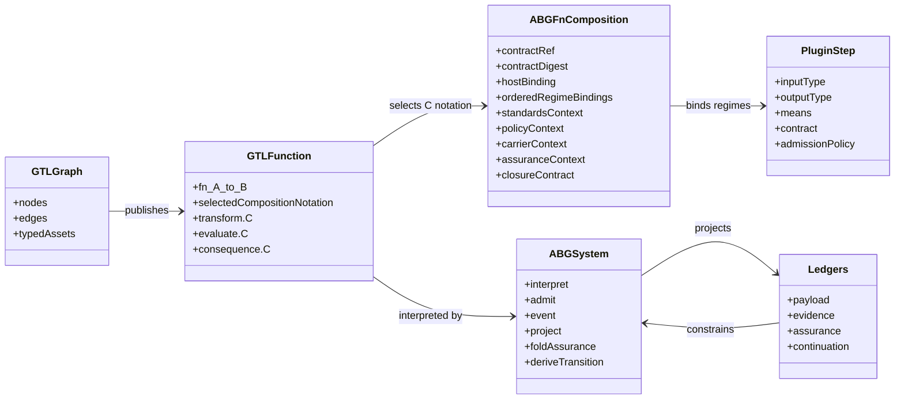
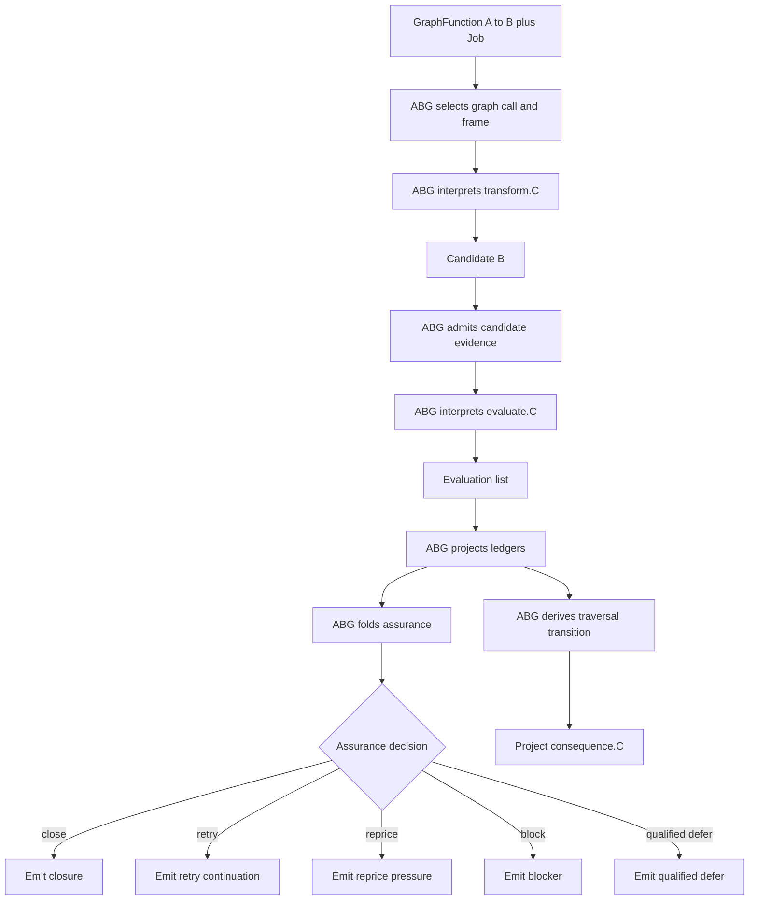

# GTL/ABG Compute Notation Definition

Status: definition surface
Author: Codex
Date: 2026-05-22

## Surface

GTL defines typed graph functions over typed graph assets:

```text
Graph
Node<T>
GraphFunction<A, B>
fn<A, B>
```

Public execution enters through published `GraphFunction` carriers bound by
`Job` contracts. ABG advances the realized internal `GraphVector` boundaries
beneath that carrier.

This definition uses `C` as notation for the selected composition at that
boundary:

```text
fn<A, B>.C
```

`C` is not a first-class GTL topology object. `C` is not an execution target.
`C` is display notation for the selected `abg.fn_composition` attached to the
owning GTL boundary.

```text
C := selected abg.fn_composition for fn<A, B>
```

`F_D`, `F_P`, and `F_H` are compute means:

```text
F_D = deterministic compute
F_P = probabilistic compute
F_H = human compute
```

`Composition(...)` is display shorthand for the ordered regime bindings carried
by `abg.fn_composition`:

```text
C := display(selected abg.fn_composition {
  contract_ref
  contract_digest
  host_binding
  ordered_regime_bindings
  standards_context
  policy_context
  carrier_context
  assurance_context
  closure_contract
  optimization_contract?
})
```

The stage notation binds a function stage to the selected composition:

```text
transform.C
evaluate.C
consequence.C
```

The canonical computation surface is:

```text
fn<A, B>.C =
  transform.C(A) -> Candidate<B>
  evaluate.C(A, Candidate<B>, Evidence, Contract) -> Evaluation<B>[]

ABG.iterate(GraphFunction<A, B>, Job) =
  run(transform.C)
  run(evaluate.C)
  admit(Evaluation<B>[])
  project(ABG.ledgers)
  fold_assurance(ABG.ledgers) -> AssuranceDecision
  derive_traversal(AssuranceDecision, C) -> TraversalTransition
  project_domain_read_models(ABG.ledgers) -> DomainReadModelEffect[]
```

All writes are owned by the ABG system. `transform.C`, `evaluate.C`, plugins,
and downstream apps emit candidate state, evaluation state, evidence, or effect
requests. ABG admits, rejects, events, projects, and writes.

## Stages

`transform.C` produces or observes a candidate:

```text
transform.C : A -> Candidate<B>
```

`evaluate.C` evaluates the candidate against contract, evidence, graph truth,
and policy. It emits evaluations:

```text
evaluate.C : (A, Candidate<B>, Evidence, Contract) -> Evaluation<B>[]
```

`consequence.C` is a typed ABG-derived projection over ABG-admitted evaluation
state, assurance state, traversal state, and downstream read-model state. It is
not an independent semantic selector. The emitted consequence surfaces are
written by ABG:

```text
consequence.C : ABG.AdmittedState<B> -> ConsequenceProjection<B>
```

`ConsequenceProjection<B>` is a typed family:

```text
AssuranceDecision =
  close | retry | reprice | block | qualified_defer

TraversalTransition =
  terminal | fd_advance | fp_dispatch | fh_escalation

DomainReadModelEffect =
  projection | report | query | gap | dossier
```

## Plugins

Plugins implement typed steps inside the selected composition denoted by `C`.

A plugin declaration has this shape:

```text
PluginStep<I, O> =
  ref
  means: F_D | F_P | F_H
  input: I
  output: O
  contract
  evidence_policy
  admission_policy
```

Plugin steps appear inside the selected `abg.fn_composition` regime bindings.
The following is display notation:

```text
Sequence(
  PluginStep<A, X>.F_D,
  Escalate(
    PluginStep<X, Y>.F_D ->
    PluginStep<X, Y>.F_P
  ),
  PluginStep<Y, B>.F_D
)
```

Plugins provide compute, evidence, effect requests, adapters, resolvers, sinks,
and judgments. Plugins do not own writes. They do not own ABG events, ledgers,
traversal, closure, continuation, or replay truth.

Workers, tools, agents, and domain implementations own internal HOW inside the
declared boundary. GTL/ABG own the traversal-affecting boundary, admission, and
runtime truth.

## ABG System

ABG interprets the GTL declaration:

```text
abg.system(GraphFunction<A, B>, Job, selected abg.fn_composition)
```

ABG system responsibilities:

```text
select graph call
select frame
select continuation
interpret selected composition
invoke plugin steps
admit payloads
emit events
project ledgers
fold assurance
derive traversal transition
derive consequence
preserve replay truth
```

ABG is deterministic system code around the declared computation. It records
what ran, what was admitted, what was rejected, what evidence was used, which
composition branch was taken, and which consequence surface was emitted.

The write rule is:

```text
GTL/plugin/app outputs -> ABG admission -> ABG writes
```

## Ledgers

Ledgers are ABG-admitted projections over event truth:

```text
Ledger =
  projection(events, payloads, evidence, contracts, graph_refs, frame_refs)
```

Downstream products may declare domain read-model purpose over ABG-admitted
facts:

```text
ProductPressureProjection<A, B> =
  product_read_model(ABG.ledgers, fn<A, B>.C)
  over A
  toward B
  carrying gaps, residuals, blockers, ambiguity, and evidence pressure
```

The pressure-map evaluation is:

```text
evaluate.C_pressure(
  A,
  Candidate<B>,
  ProductPressureProjection<A, B>
) -> Evaluation<B>[]
```

ABG decision surfaces are:

```text
fold_assurance(ABG.ledgers) -> close | retry | reprice | block | qualified_defer
derive_traversal(...) -> terminal | fd_advance | fp_dispatch | fh_escalation
```

## Syntax Rules

The notation identifies the selected composition for a published function:

```text
fn<A, B>.C
```

Stages bind to that selected composition notation:

```text
transform.C
evaluate.C
consequence.C
```

Compute means live inside the selected `abg.fn_composition`:

```text
C := selected abg.fn_composition
```

Plugins are typed steps inside selected composition regime bindings:

```text
PluginStep<I, O>.F_D
PluginStep<I, O>.F_P
PluginStep<I, O>.F_H
```

ABG interprets the declaration:

```text
abg.system(GraphFunction<A, B>, Job, selected abg.fn_composition)
```

Runtime truth is evented by ABG:

```text
events -> ledgers -> assurance -> traversal -> consequence
```

## Domain Model



## Workflow



## Invariants

All traversal-affecting compute is declared through GTL/ABG carriers:

```text
GraphFunction + Job + GraphVector + abg.fn_composition
```

`C` is notation for selected `abg.fn_composition`:

```text
fn<A, B>.C := selected composition for the owning GTL boundary
```

Stage behavior binds to that selected composition:

```text
transform.C | evaluate.C | consequence.C
```

All plugin behavior is typed inside selected composition regime bindings.

All runtime truth is ABG-admitted.

All writes are ABG system writes.

All ABG ledgers are projections over ABG event truth.

All downstream product meaning, including product pressure, is read over GTL
declarations plus ABG-admitted truth.
