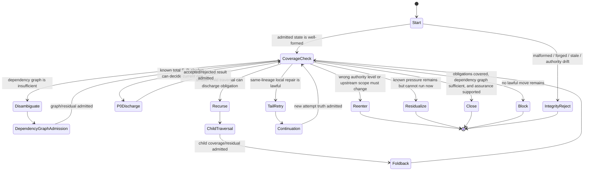
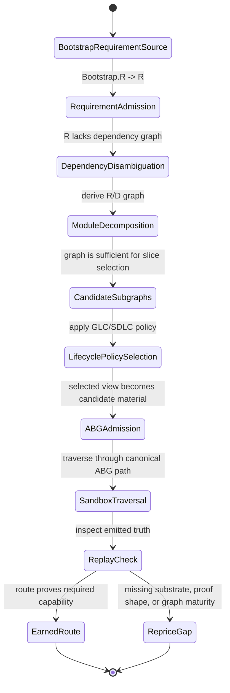

# Strategy: Dependency Graph Traversal State Machine For Obligation Depth

**Status**: strategy commentary, not ratified specification
**Date**: 2026-07-03
**Author**: Codex
**Project**: Abiogenesis
**Responds to**: `20260703T083818Z_STRATEGY_recursive_llms_recursive_gtl_disambiguation_graphs.md`
**Relevant ticket**: T-188 - requirement proof carry-through

## Claim

The correct abstraction is not "recursive agent" and not "steel thread" as a
runtime primitive.

The correct abstraction is:

```text
GTL overlay = program
GTL graph functions = reusable library functions / callable work contracts
workspace = mutable bootstrap/config/data surface for the program
ABG traversal monad = event-sourced bind over admitted GTL program truth
ABG ledger = obligation identity, lineage, admission, replay, coverage,
             residual, foldback, and disposition truth
GLC/SDLC steel thread = product policy over admitted dependency-closed
                        subgraphs
```

That separation prevents the inversion that caused drift:

```text
ABG does not know software steel-thread meaning.
GLC/SDLC does not mint obligation or proof truth.
```

ABG owns the generic dependency and obligation algebra. A downstream lifecycle
product may interpret that algebra as a useful steel-thread slice, app-build
slice, deployment slice, model-building slice, or trading-evaluation slice.

## Layer Split

| Layer | Owns | Does not own |
| --- | --- | --- |
| GTL | overlay/program declaration, node types, graph functions, graph vectors, refinement boundaries, candidate families, roles, evaluators, rules | runtime truth, event emission, closure, ledger mutation |
| Workspace | bootstrap config, product data, local files, mutable execution surface | program topology, dependency truth, closure truth |
| ABG | traversal, admission, event log, replay, dependency graph projection, obligation lineage, proof coverage, residuals, foldback, continuation, re-entry, disposition | product meaning of "steel thread", app-build semantics, downstream lifecycle vocabulary |
| GLC/SDLC | lifecycle policy, steel-thread view, software-build interpretation, valuable slice selection | ABG ledger truth, proof coverage truth, dependency graph truth, traversal control |

## Core Algebra

Let:

```text
R0 = bootstrap requirement source supplied by workspace/config
R  = admitted requirement nodes
D  = admitted dependency / design / module / artifact / proof nodes
V  = R union D
```

Use one edge orientation:

```text
a -> b means b depends on a.
```

The admitted dependency graph is:

```text
G = (V, E, type, source)

E = E_RR union E_DD union E_RD

E_RR subset R x R  requirement-to-requirement dependency
E_DD subset D x D  dependency-to-dependency dependency
E_RD subset R x D  requirement-to-dependency obligation binding
```

For example:

```text
R = { r1, r2, r3, r4 }
D = { d1, d2, d3, d4, d5 }

r1 -> r2
r2 -> r3
r2 -> r4

d1 -> d2
d2 -> d4
d3 -> d5

r1 -> d1
r2 -> d2
r3 -> d3
r4 -> d5
```

The prerequisite closure of a target set is:

```text
Pred*(S) =
  least fixed point containing S and every x where x -> y and y in S
```

A dependency-closed candidate subgraph for target `T` is:

```text
Candidate(T) = induced_subgraph(G, Pred*(T))
```

This is the generic algebra under steel thread. "Steel thread" is not the
algebra. It is a downstream policy that chooses one dependency-closed candidate
subgraph as a useful proof or build slice.

## Bootstrap And Disambiguation

The initial traversal is not:

```text
R -> App
```

as a single known edge.

The actual shape is:

```text
Bootstrap.R
  -> admit requirements R
  -> disambiguate R into dependency graph G
  -> reach sufficient decomposition D
  -> select dependency-closed candidate subgraphs
  -> traverse selected candidate
  -> admit proof coverage / residual / foldback
```

The dependency map is not known at bootstrap. It is discovered by traversal.
The graph overlay is the program that performs that disambiguation.

For software/app build, `R -> App` is product shorthand for:

```text
requirements
  -> product/scope model
  -> module decomposition
  -> source artifacts
  -> test/proof artifacts
  -> execution evidence
  -> app fulfillment
```

Steel-thread selection is meaningful only after enough of that graph has been
disambiguated. In an app-build lifecycle, that usually means at least module
decomposition. Before that point, there is no lawful basis to know which slice
is dependency-closed.

## Generic Graph Functions

The generic ABG/GTL capability should be expressed as graph functions over
admitted carrier truth. The generic substrate does not invent semantic
software modules, proof artifacts, or lifecycle slices. It admits, normalizes,
projects, and closes over dependency graph truth after a product policy, F_P
candidate, or declared graph function proposes candidate nodes and edges.

```text
bootstrap_requirements:
  Bootstrap.R -> RequirementSet

admit_project_dependency_graph:
  { RequirementGraph, DependencyNodeDeclarations, DependencyEdgeDeclarations }
    -> { DependencyGraphProjection, TypedPrerequisiteGaps }

derive_dependency_closed_subgraphs:
  { DependencyGraphProjection, ObligationLineage, ProofPolicy, TargetRefs }
    -> { CandidateSubgraphs, UncoveredObligations, TypedPrerequisiteGaps }
```

Then GLC/SDLC may publish a higher-order policy graph function:

```text
select_software_build_steel_thread_view:
  { CandidateSubgraphs, LifecyclePolicy }
    -> { SelectedThreadView, Rationale }
```

The first three are generic substrate capability. The last one is lifecycle or
software-build interpretation.

The selected thread view is not closure truth. It may become an admitted
policy-selection fact or traversal candidate when ABG admits it. It does not
become dependency truth, proof truth, or closure truth.

## State Vector

The runtime transition function consumes a replay-derived state vector:

```text
S = {
  program: admitted GTL overlay / graph program truth,
  workspace: admitted bootstrap/config/data refs,
  unit: selected graph function, vector, traversal unit, composition, frame,
  requirements: active admitted requirement nodes,
  dependencyGraph: admitted R/D graph projections,
  obligationLineage: requirement -> dependency -> traversal -> proof lineage,
  proofShape: expected proof policies, roles, strength, positive/negative shape,
  witnesses: admitted realization/proof/semantic/human evidence,
  candidates: admitted candidate-output envelopes, candidate families,
              dependency-closed subgraph candidates, or typed gaps,
  coverage: replay-derived coverage per obligation,
  residuals: active residual pressure,
  admissibility: ref/digest/staleness/forgery/role status,
  continuation: attempt identity, retry budget, same-lineage eligibility,
  reentry: allowed change classes and upstream scope refs
}
```

Every field must be admitted, replay-derived, or a typed gap. Raw plugin output,
prompt prose, worker-local memory, local test summaries, workspace files, and
caller-selected refs are not state until ABG admits them.

Framework proof state is deliberately outside `S`. Whether a capability has an
earned steel-thread proof is release/proof-planning context. It may decide that
a proof run is required before downstream use, but it shall not change runtime
closure, recursion, retry, re-entry, residual, or block decisions.

## Runtime State Diagram



## Total Transition Function

The function is total because the first matching rule wins and the final rule
is `block`. It is deterministic over admitted state.

```text
T(S) -> Decision
```

| Priority | Predicate over admitted state | Decision | Reason |
| --- | --- | --- | --- |
| 0 | selected program, graph function, vector, composition, node types, refs, digests, or authority are malformed, stale, forged, or non-composable | `block.integrity` | No lawful traversal can proceed from corrupt authority. |
| 1 | requirement-bearing edge has no active obligation and no typed no-op policy | `block.spec_gap` | Empty pressure is not implicit permission to close requirement-bearing work. |
| 2 | every active applicable obligation has realization witness, proof witness, compatible role, sufficient proof strength, required semantic/human evidence, no stale/forged refs, dependency graph sufficiency for the target or typed no-dependency/no-op policy, and assurance supported | `close` | Closure is earned only when proof and dependency sufficiency are both settled. |
| 3 | current unresolved condition is decidable by a total F_D function over a known algebra | `P0 discharge` | Deterministic truth closes or rejects before F_P. |
| 4 | the unmet obligation requires a different requirement, design, product, policy, proof policy, human decision, or graph-program scope | `re-entry` | Current edge cannot lawfully solve the wrong-level problem. |
| 5 | dependency graph is missing, underdisambiguated, or lacks enough declared dependency structure to choose a dependency-closed candidate | `disambiguate dependency graph` | Select/scoping cannot run before graph truth exists. |
| 6 | an uncovered obligation has a declared decomposition, candidate family, child graph-function, or dependency-closed subgraph whose input tuple is composable, whose foldback contract preserves source obligation identity, and whose missing pressure does not require upstream re-entry | `recursive child traversal` | Missing signal can be narrowed by a child traversal. |
| 7 | the same graph function can lawfully continue over the same obligation lineage, the failure is local-repairable, retry budget remains, no upstream re-entry is required, and F_D can prove the next attempt is not a replay of the same input | `tail retry continuation` | Pure retry is lawful only as typed ABG continuation. |
| 8 | the obligation cannot close now, but remaining pressure, owner, follow-up, and evidence gap are known | `residualize` | Preserve pressure without pretending closure. |
| 9 | no prior predicate matches | `block.no_lawful_move` | Total fallback. Silence is not a state. |

## Steel Thread As Downstream Policy

Steel thread is a higher-order GLC/SDLC policy over admitted ABG graph truth:

```text
SteelThreadView =
  policy_select(
    derive_dependency_closed_subgraphs(
      DependencyGraph,
      ObligationLineage,
      ProofPolicy,
      TargetRefs
    ),
    LifecyclePolicy
  )
```

It answers:

```text
which dependency-closed slice is valuable enough to prove or build first?
```

It does not answer:

```text
which obligations exist?
which dependencies are true?
which proofs cover them?
which residuals remain?
may this edge close?
```

Those are ABG ledger/projection questions.

## Steel Thread Planning State Machine

Steel thread planning is proof/design planning. It is not ordinary runtime
behavior.



The important rule:

```text
Steel thread is not selected from raw R.
Steel thread is selected from a sufficiently disambiguated dependency graph.
```

For app-building, "sufficient" normally means:

```text
requirements are admitted,
module decomposition exists,
requirement-to-module/proof bindings exist,
dependency edges are admitted,
target artifact/proof surfaces are known,
and residual gaps are explicit.
```

## Single-Hop Versus Multi-Hop

Single-hop traversal is lawful only when the dependency graph already proves
that the target can be discharged by one known graph vector:

```text
R_i -> D_j
```

Multi-hop traversal is required when the target is downstream of intermediate
dependency nodes:

```text
R_i -> D_module -> D_source -> D_test -> D_execution -> D_app
```

The choice is not made by worker intuition. It is a deterministic consequence
of admitted graph maturity:

```text
if DependencyGraph is absent:
  admit/project dependency graph declarations
else if target prerequisite closure has typed missing-node or missing-edge gaps:
  recurse or re-enter
else if prerequisite closure is one edge and proof shape is direct:
  single-hop candidate
else:
  multi-hop dependency-closed candidate
```

## Recursion Versus Retry

Recursion is for obligation isolation and dependency discovery.

Use recursion when:

- workspace discovery is needed;
- requirement dependencies are not yet disambiguated;
- module decomposition is needed before construction;
- proof shape must be derived from requirement shape;
- a broad edge must be split into obligation-bearing child traversals;
- a child graph function can produce missing admitted signal and fold it back.

Retry is post-evaluator only.

Use retry when:

- an evaluator outcome exists;
- the same graph function can repair locally;
- the same obligation lineage is preserved;
- the new input is materially different;
- retry budget remains;
- no upstream re-entry or child traversal is required.

If the system needs comprehension, chunking, decomposition, dependency
discovery, proof-shape discovery, or wrong-level correction, retry is the wrong
mechanism.

## F_D And F_P Boundary

F_D may decide only over a known algebra or total function:

```text
known inputs
closed output domain
typed rejection/gap states
replay-derived or admitted refs
```

Examples:

- ref resolution;
- digest comparison;
- schema validation;
- known dependency-closure computation;
- topological prerequisite closure over an admitted graph;
- proof-role compatibility over admitted proof policy;
- response-contract shape validation.

F_P may help produce candidate material when the algebra is not yet known:

- proposing domain-specific candidate dependency nodes;
- proposing candidate dependency edges;
- proposing proof obligations;
- proposing steel-thread policy rationale;
- flagging unresolved requirement nodes as typed gaps.

But F_P output feeds F_D only after ABG admission. The worker does not directly
select runtime truth, close obligations, or decide which proof covers which
requirement.

## Semantic Compiler Impact

The semantic compiler is the dispatch-assurance point for this algebra. It
must prevent prompts from bypassing dependency graph maturity.

Current instruction assembly already owns field cuts, source trace,
type coverage, output-contract derivation, relevance, compression,
proportionality, runtime binding, P0 no-dispatch, non-tautology, and manifest
replay. The dependency graph algebra adds one required compiler gate:

```text
dependency sufficiency before dispatch
```

An F_P prompt for build, test, proof, release, or app-slice work may be rendered
only when the target's prerequisite closure is known, or when the selected
vector is explicitly a dependency-disambiguation traversal.

The compiler should compile or reject using derived dependency instruction
truth:

```text
DerivedDependencyInstructionTruth = {
  dependencyGraphRef,
  dependencyGraphDigest,
  targetRefs,
  prerequisiteNodeRefs,
  prerequisiteEdgeRefs,
  dependencyClosed,
  typedPrerequisiteGapRefs,
  noDependencyPolicyRef
}
```

This is not product policy and not new GTL declaration truth. It is ABG-derived
instruction truth over admitted dependency graph, obligation lineage, proof
policy, and runtime refs.

The known algebra set for instruction assembly should therefore include:

```text
dependency_graph_projection
prerequisite_closure
dependency_sufficiency
obligation_lineage
proof_coverage
```

The compiler behavior is:

| State | Compiler decision |
| --- | --- |
| Raw requirements exist but no dependency graph exists | Compile only a dependency-disambiguation traversal, not build/test/app work. |
| Dependency graph exists but target prerequisite closure has missing nodes or edges | Reject with typed prerequisite gaps. |
| Dependency graph is sufficient for the target | Render only the dependency-closed subgraph relevant to the current target. |
| P0 deterministic edge can discharge through admitted truth | Render no F_P prompt. |
| F_P validation traversal reviews a candidate prompt plan | Admit the review only as evidence; F_D still approves or rejects. |

New compiler rejection kinds should be typed, not narrative:

```text
dependency_sufficiency_gap
typed_prerequisite_gap
unresolved_requirement_node
missing_dependency_edge
```

This makes prompt relevance:

```text
selected vector
  + admitted prerequisite closure
  + active obligations
  + proof policy
  + admitted causal inputs
```

not merely:

```text
selected vector + local prompt context
```

That is the compiler-level guard against shallow smoke-test prompts pretending
to be lifecycle/build prompts.

## T-188 Consequence

T-188 should treat this state machine as the design lens for proof
carry-through:

- `RequirementProofCoverageProjection` supplies proof coverage truth;
- obligation lineage supplies the requirement/dependency/traversal/proof chain;
- plugin result admission supplies candidate output binding;
- dependency graph projection supplies prerequisite closure;
- semantic compiler dependency-sufficiency gates decide whether an F_P prompt
  may exist for the selected target;
- recursive child traversal supplies admitted foldback, not summary text;
- assurance fold consumes coverage and residuals before close.

T-188 should not implement a "steel-thread planner" as closure authority.

The generic follow-on capability is:

```text
derive_dependency_closed_subgraphs
```

The GLC/SDLC follow-on policy is:

```text
select_steel_thread_view
```

The first belongs in GTL/ABG substrate. The second belongs in lifecycle/product
policy over ABG truth.

## One-Line Rule

```text
ABG owns obligation/dependency truth and dependency-closed subgraph algebra;
GLC/SDLC owns steel-thread interpretation over that truth; recurse to discover
or isolate missing obligation pressure; retry only after evaluator-confirmed
same-lineage local repair.
```
