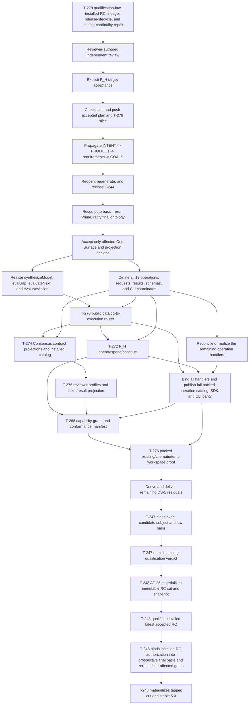

# ABIogenesis 5.0 Repriced End-To-End Plan

**Date**: 2026-07-16 Australia/Sydney

**Status**: current planning read model; second bounded release/algebra repair complete and independent review pending

**Authority**: commentary only; GOALS, INTENT, PRODUCT, requirements, and ratified design remain authoritative

**Integration line**: `codex/t266-stage` at `75618de8`

**Managed plan authority**: `specification/GOALS.md`; this post is its detailed
handoff and review projection

## Executive Position

ABIogenesis 5.0 remains the stable-first, full-product release for one trusted
developer desktop. The feature scope has not been reduced by T-278. The reprice
changes the product model and public projection used to deliver that scope:

```text
38 discovered public behaviors + 3 required internal publication lifecycles
  -> 27 Prime semantic atomic families
  -> 7 higher-order product compositions
  -> 19 candidate public operation identities
  -> SDK, abg.cli, schema, capability, scenario, and release projections
```

The former exact-36-operation roster was promoted before the product Ontology
and One Surface authority chain were derived. It is therefore not a valid
implementation target. The 17 retained feature families remain the no-silence
feature taxonomy, but T-244's remaining-work and closure columns must be
regenerated after the target shape is accepted.

The lawful current position is:

> DS-0 is reopened by T-278. The program/GraphFunction split is accepted and
> the four One Surface authorities are accepted in substance. A later review
> found and caused repair of the release-qualification cycle,
> binding-cardinality contradiction, final-tap ordering, and review provenance.
> Two fresh reviews then rejected an unnecessary qualification-specific
> `C.batch` carrier discontinuity. The third bounded repair feeds one complete
> typed owning-result vector directly to one `C.of(AF-22)` reducer. Prime review
> accepts that algebra; release-authority review then found two count-neutral
> missing bindings. The fourth repair carries the exact method/rule/source law
> basis through qualification and the exact installed-RC green qualification
> into the prospective-final basis and AF-25 verifier. The linked 27/7/19 target
> is held until reviewer-authored independent acceptance of that exact subject.
> Runtime implementation remains frozen. Existing
> T-270/T-272 work is preserved as provisional realization evidence, not
> discarded and not treated as closure.

## Stable Scope

The following remain in ABIogenesis 5.0:

1. exact installed product, workspace, binding, catalog, and source-independent
   package behavior;
2. the LLM-first GTL declaration, admission, compiler, and publication surface;
3. the complete seven-term C algebra, HOF, retry, recurse, and ABG runtime;
4. strict malformed GTL and malformed F_P result admission;
5. one versioned SDK and thin `abg.cli` graph shell;
6. the complete interactive start, inspect, F_H response, and continue loop;
7. the SYSTEM-owned Consensus GraphFunction as a pure GTL free construction;
8. public contracts, schemas, capabilities, replay, provenance, and results;
9. ABIogenesis self-conformance, observer, and tuner proof;
10. native operation plus one bounded Codex adapter projection;
11. packed install, Hello World, Consensus, and downstream catalog proof; and
12. one immutable RC window followed by stable `5.0.0`.

The following do not gate 5.0:

- self-hosting, self-build, or released-over-released bootstrap proof;
- odd_glc 1.0, GLC, the data-mapper campaign, or 5.0.1 dogfood;
- hosted marketplace, scheduler, watcher, automatic wake, or ticket mutation;
- hostile-workstation tamper resistance, signing, IAM, or multi-user hosting;
- multiple host adapters or a generic Review product beyond bounded Consensus.

Stable 5.0 is the SPEC_METHOD-compliant baseline. Installed 5.0 plus a later
odd_glc 1.0 may become the development product for 5.0.1. That is the first
dogfood wave, not evidence required for the 5.0 cut.

## Repriced Product Model

T-278 asks F_H to accept four linked target claims:

1. An admitted overlay or GTL composition is the program. `GraphFunction` is
   the sole public named callable library function and work contract belonging
   to that program.
2. One Surface preserves distinct `synthesizeModel`, `evalGap`,
   `evaluateNext`, and `evaluateAction` authorities at root and published
   recursive refinement. These are internal semantic authorities, not four
   extra CLI or SDK verbs.
3. Twenty-seven atomic families and seven higher-order compositions are the
   Prime semantic algebra for the public control-plane boundary.
4. Nineteen operation identities are the correct public projection.

The candidate public operation projection is:

| Family | Candidate operations |
|---|---|
| Workspace and project | `workspace.create`, `workspace.open`, `project.read`, `workspace.bind` |
| Product and catalog | `product.verify`, `product.resolve`, `product.install`, `catalog.admit`, `catalog.view`, `catalog.apply` |
| Runtime | `run.invoke`, `run.continue`, `interaction.respond`, `result.assess` |
| Governance and tuning | `witness.admit`, `tuning.transition`, `conformance.evaluate` |
| Materialization and release | `product.materialize`, `release.snapshot` |

Closed variations preserve semantic distinctions without multiplying peer
operations. For example, `interaction.respond` carries select, approve, reject,
assess, and answer-escalation; `catalog.apply` carries node-type and overlay
application while only GraphFunction remains callable.

This is a hard-break migration. No legacy facade or second operation register
is retained merely for compatibility.

The current tree also happens to publish 19 operation files, but it is not the
candidate target already realized: only three exact identity strings overlap.
Count equality is not semantic parity. The existing files remain provisional
inputs to the migration until each maps to one accepted atomic authority and
public projection.

## Current Position

| Phase | State | What is true now | Exit still required |
|---|---|---|---|
| `DS-0` authority and design | **Reopened** | Program/GraphFunction and One Surface are accepted in substance. T-278 now carries a pre-RC exact-candidate qualification family with an exact law basis, one Prime typed owning-result vector consumed by `C.of(AF-22)`, final-basis installed-RC authorization lineage, and function-indexed binding cardinality while preserving all 38 behaviors, 17 feature dispositions, and 16 capability dispositions. | Reproduce the 27/7/19 census; reviewer-authored independent acceptance; F_H ruling; constitutional propagation; T-244 regeneration; final basis recomputation and ontology ratification |
| `DS-1` GTL and Consensus foundation | **Complete** | T-252/T-253 and T-263 through T-266 provide the pure-data Consensus body, compiler census, raw admission, type witnesses, topology, and conformance foundation | No general rebuild; rederive only surfaces affected by the accepted ontology |
| `DS-2` public invocation spine | **Provisional** | T-255 through T-258 are closed; dirty T-270/T-272 realization passed its recorded 1,748/1,748 self-review | Realize the missing/partial One Surface authorities and required public projection first; then reconcile T-270/T-272 and independently close |
| `DS-3` generic runtime | **Core complete** | T-259 through T-262, T-267, and T-271 close C/HOF/retry/recurse interpretation and conservation | Bind the generic core to the accepted public router and continuation path |
| `DS-4` full public operation and bounded Consensus product | **Partly built, undelivered** | GTL body and generic runtime exist; T-274/T-275 Prime contractions have partial implementation; full accepted operation parity is not delivered | Complete all 19 operation definitions/bindings/catalog/SDK/CLI first, then schemas/catalog, profiles/result projection, capability manifest, and packed three-workspace proof |
| `DS-5` retained non-operation surface | **Pending re-derivation** | Seventeen feature families remain retained | Generate only genuine non-operation feature and proof leaves from the refreshed T-244 register |
| `DS-6` qualification | **Backlog** | T-247 owns self-conformance plus the exact-candidate subject/law basis and verdict; it does not create a release cut | Bind and qualify exact pre-RC bytes under the exact method/rule/source basis and close all retained proof gates |
| `DS-7` release | **Backlog** | T-248 owns AF-25 release-cut/snapshot materialization, installed-RC qualification lineage, the RC window, and stable release | Consume the same-subject-and-law-basis green verdict; materialize and qualify the immutable RC; bind that installed-RC authorization into final truth; reconcile final-only delta; tap final with coherent tag, package, checksums, and record |

Repository reality at this checkpoint:

- `codex/t266-stage` is 77 commits ahead of its remote and 98 ahead / 5 behind
  `main`;
- the five `main`-only commits are commentary/status changes, not a reason to
  rebase the dirty integration wave now;
- the current preserved wave is 87 tracked files, approximately
  `+6,439/-884`, plus 17 untracked files; this includes the managed-plan update
  as well as the provisional runtime work;
- T-278, its ontology, and its current review evidence are still untracked;
- the latest recorded runtime gates are evidence for the provisional wave, not
  proof against the not-yet-accepted target Ontology.

## Feature Register

The IDs remain stable. The target architecture, remaining work, and closure
evidence are repriced as follows.

| ID | Retained 5.0 feature | Current position | Remaining delivery and closure |
|---|---|---|---|
| `F01` | Exact product, install, workspace, lock, binding, and ABG-owned catalog | T-223 packed foundation exists | Close accepted design and exact source-blind resolve, verify, install, bind, admit, conflict, and no-source-fallback proof |
| `F02` | GTL declaration, serialization, raw admission, typecheck, GraphFunction publication | T-220 and T-263 through T-266 foundation complete | Reconcile program versus GraphFunction terminology and publish exact compiler, schema, corpus, and installed proof |
| `F03` | Seven-term C algebra, HOF, retry, recurse, interpreter, and runtime joins | Generic core closed through T-267/T-271 | Realize accepted One Surface and reconcile T-270/T-272 public integration |
| `F04` | Declared instructions and malformed F_P result admission | T-256/T-257 closed | Carry admitted result truth through invocation/continuation and prove malformed output cannot write or close installed work |
| `F05` | Public contracts, schemas, vocabularies, operations, capabilities, and parity | Existing 19-operation/82-schema/40-asset realization is provisional; eight capability files exist | Hard-break to the complete accepted 19-operation family before T-268; T-274 Consensus projections; T-268 exact 16-capability graph; source/generator/output parity |
| `F06` | Versioned SDK and thin `abg.cli` graph shell | SDK/CLI substrate exists | Project and bind all accepted 19 operations before T-268; prove source-blind parity and no adapter-owned traversal, worker, event, or continuation logic |
| `F07` | Interactive start, stop/hold/gap, lawful actions, typed F_H act, and continue | T-258 carriers and provisional T-272 exist | Complete One Surface, T-270/T-272, read projections, and installed interactive scenario |
| `F08` | SYSTEM-owned bounded Consensus GraphFunction | Pure GTL body and generic atoms/runtime exist | T-270/T-272, T-274, T-275, T-268, then T-276 installed proof; no private runtime or shell orchestration |
| `F09` | List, describe, and apply graph functions, node types, and overlays; only GraphFunction callable | Kind vocabulary and callable-kind selection exist | Accept `catalog.apply`, preserve non-callable node/overlay law, and prove packed negative selection |
| `F10` | Event, replay, lineage, provenance, correction, continuation, consequence, and failure truth | Large kernel corpus plus T-267/T-271 exist | Complete One Surface causal chain and exact event, diagnostic, result, and replay publication proof |
| `F11` | ABIogenesis self-conformance without product exemption | Requirements and conformance machinery exist | T-247 exact frozen inventory, real-tree pass, and seeded-negative refusal |
| `F12` | Replay-grounded observer/tuner with draft-only mutation | Predecessor behavior exists | Prove exact-candidate reports, drafts, attribution, ratify/reject, and no direct authority mutation |
| `F13` | Native operation plus one bounded Codex projection | Native substrate and capability preflight exist | Close native scenario and adapter parity; host path delegates the same public contract |
| `F14` | Packed install, Hello World, and bounded live F_P proof | T-223 70/70 and predecessor proof exist | Rerun over final exact candidate after DS-4/DS-5; include malformed-output and source-isolation differentials |
| `F15` | Exact-candidate qualification contract, enforcement, and one self-certifying release read model | Existing gate/snapshot machinery exists | T-247 binds one exact subject and method/rule/source law basis, admits one complete typed same-basis owning-result vector, and reduces it once through `C.of(AF-22)` to an immutable verdict; T-248 materializes the cut/snapshot only from the matching green non-bypassed verdict and binds installed-RC green qualification into prospective-final truth |
| `F16` | Immutable RC window and stable `5.0.0` release | No 5.0 cut exists | T-248 RC, qualification, final-only reconciliation, fresh install, tag, tarball, manifest, checksum, and evidence coherence |
| `F17` | Generic downstream catalog compatibility sufficient for odd_glc | T-223 fixture and predecessor released-catalog evidence exist | Final bounded fixture against accepted 5.0 contracts; no odd_glc release or data-mapper gate |

## Repriced Dependency Plan



### Phase 0 - Accept And Persist The Product Shape

1. Complete and independently review the bounded qualification-input,
   qualification-law, installed-RC authorization, release-lifecycle, and
   binding-cardinality repair, then F_H accepts or
   rejects the four linked T-278 claims explicitly.
2. Treat `codex/t266-stage` as the sole 5.0 integration line. Checkpoint and
   push the accepted plan/T-278 authority and design slice without staging the
   provisional runtime wave.
3. On acceptance, change constitutional truth in authority order:
   `INTENT -> PRODUCT -> requirements -> GOALS`.
4. Remove the exact-36 roster as constitutional input. Retain all discovered
   behaviors through typed projection or explicit disposition.
5. Reopen T-244 once, preserve its 17 family identities, regenerate every
   authority, remaining-work, dependency, and release-gate cell, then reclose.
6. Recompute ontology source digests, rerun whole-family Prime, and ratify the
   final ontology.
7. Rederive only designs affected by program/GraphFunction, One Surface, or
   public-operation changes. Sound generic C/runtime designs remain evidence.
8. Give each missing or partial One Surface authority an explicit realization
   owner. `synthesizeModel` is absent; `evalGap`, `evaluateNext`, and
   `evaluateAction` have partial precursors. T-270 is not their implementation
   owner.
9. Derive the full 19-operation public migration as two ordered milestones.
   First, define the authoritative operation/request/result/schema/CLI-
   coordinate family consumed by handlers including T-270/T-272. After all
   handlers exist, bind them and publish full packed catalog/SDK/CLI parity.
   T-268's mandatory public-contract capability cannot resolve against a
   partial operation catalog.
10. Keep the sibling `abiogenesis` worktree out of this line. Its untracked
    manuscript numbered T-267 must become T-279 before any future adoption;
    obsolete self-build and T-252 planning artifacts do not enter 5.0.
11. Rebind T-247 and T-248 from completed T-249 and stale T-244 assumptions to
    completed T-278, the ratified final ontology, and regenerated T-244.

**Exit**: constitutional sources, final ontology, T-244, active tickets, and
affected designs name one product model and one public projection.

### Phase 1 - Realize One Surface And Reconcile The Runtime Wave

1. Realize `synthesizeModel`, `evalGap`, `evaluateNext`, and `evaluateAction`
   through accepted singular boundaries. Preserve their distinct authority and
   use shared subordinate libraries only where Prime permits it.
2. Publish accepted definitions for all 19 operations and their request,
   result, schema, and CLI-coordinate projections. Definitions precede
   handlers; packed publication does not claim an operation is realized yet.
3. Review the current dirty T-270/T-272 implementation against the accepted
   ontology rather than rewriting it wholesale.
4. Keep code that maps to accepted atoms and authority; revise only mismatches.
5. Make T-270 close on focused public-router and runtime-authority proof. Remove
   its circular dependency on T-268 packed closure. Retain its non-Consensus
   fixture and authority-negative matrix; T-276 Consensus aggregation does not
   replace generic router proof.
6. After T-270, run T-272 and T-274 in parallel where their accepted designs
   and public projection inputs permit it.
7. Close every accepted operation handler, bind all 19 to the authoritative
   definitions, and publish the full packed operation catalog, SDK, and thin
   CLI required by T-268/T-276. Count parity alone is not closure.
8. Rerun semantic, GTL, packed API, publication, schema, capability, Prime,
   governance, and Mermaid gates; perform an authority-first self-review.
9. Checkpoint and push the reviewed runtime slice separately from the earlier
   authority/design slice.

**Exit**: public invocation reaches the complete generic runtime through one
router; F_H response continues the same engine-held intent; no legacy or second
controller path remains.

### Phase 2 - Deliver Bounded Consensus

1. T-274 publishes nine addressable Consensus schema identities as projections
   of one authoritative contract family, two generated vocabularies, the exact
   installed Module, and one SYSTEM-owned callable catalog row.
2. T-275 admits attributed reviewer/profile/panel truth and projects one typed
   Consensus result plus ticket read model without ticket mutation authority.
3. T-268 publishes the exact capability declaration graph and canonical
   tenant-conformance manifest after T-270, T-272, T-274, T-275, and the
   complete public definition family plus bound packed 19-operation
   catalog/SDK/CLI projection are exact.
4. T-276 alone owns the packed three-workspace aggregation proof: existing,
   alternate explicit, and caller-created temporary workspace applications;
   agreement, recursive dispute, and F_H escalation outcomes.

**Exit**: a calling agent uses ordinary `abg.cli` catalog invocation to run the
pure GTL Consensus GraphFunction and read typed result, dissent, lineage, and
replay truth. Fixtures ignite and observe; they do not orchestrate.

### Phase 3 - Close The Remaining Full Product

Use regenerated T-244 to derive only genuinely missing singular leaves after
subtracting the full public operation surface already required by T-268.
Likely residual families are non-operation product or proof work such as
observer/tuner exact-candidate proof, Codex adapter parity, bounded downstream
compatibility, and publication evidence not already closed. The register, not
the old 36-operation roster, decides the exact leaf set.

Non-overlapping leaves may execute in parallel after accepted three-view
designs. Every phase self-review compares code to current PRODUCT, requirement,
ontology, IACS, domain model, sequence, state machine, trusted-desktop risk
boundary, and next-phase input contract.

**Exit**: all 17 feature rows have exact owning evidence; there is no retained
claim supplied only by prose, compatibility facade, downstream product, or a
second controller.

### Phase 4 - Qualify And Release

After all DS-5 product changes close, T-247 binds one content-addressed
`ExactCandidateQualificationBasis` with one exact method/rule/source
`QualificationLawBasis`, qualifies those exact pre-RC bytes, emits one immutable
`ExactCandidateQualificationVerdict` preserving both bases, and proves:

- self-conformance under exact rule and source bases;
- complete executable-change witnessing;
- malformed GTL and malformed F_P refusal;
- packed/live installed behavior;
- observer/tuner draft-only law;
- native and Codex projection parity;
- mandatory red/bypass refusal; and
- one complete typed same-subject-and-law-basis owning-result vector with
  mandatory red, stale, missing, conflicting, digest, law-basis, and bypass
  refusal, reduced exactly once by `C.of(AF-22)`.

T-247 creates neither a `ReleaseCut` nor a `ReleaseSnapshotManifest`.

T-248 consumes the same-subject-and-law-basis green non-bypassed verdict and:

1. invokes `AF-25(published_rc)` to materialize one immutable versioned RC and
   its `ReleaseSnapshotManifest`;
2. runs clean, source-blind install and every affected retained scenario over
   that published RC and links the terminal qualification addendum;
3. opens a bounded RC correction window;
4. creates a new basis, verdict, and RC after any product-significant change;
5. binds the exact installed-RC basis and green non-bypassed verdict into the
   prospective-final basis with only the RELEASE_METHOD-allowed metadata delta;
6. reruns affected identity, install, deterministic, and bounded behavior gates;
7. invokes `AF-25(tapped_release)` and `AF-26`, then tags and pushes stable
   `5.0.0` with Git ref, tarball, manifest, checksums,
   installed identity, and qualification evidence naming the same bytes.

## Release Scenario Set

The final candidate must close the exact bounded scenario catalog:

1. `ABG5-S01` - exact installed catalog and Hello World through the public SDK
   or CLI, with typed result and replay and no mutable-source fallback;
2. `ABG5-S02` - a declared constructive multi-stage program over all seven C
   terms, with malformed GTL and malformed F_P refusal;
3. `ABG5-S03` - the complete start, truthful stop/hold/gap, frontier and lawful
   actions, typed F_H act, continue or restart, and convergence loop;
4. `ABG5-S04` - exact-candidate self-conformance plus observer/tuner truthful
   halt, grounded drafts, attribution, ratify/reject, replay, and injected
   negative;
5. `ABG5-S05` - packed Consensus agreement, recurse, and F_H escalation over
   existing, alternate, and temporary workspace applications;
6. `ABG5-S06` - equivalent native and bounded Codex public-contract
   invocations with no adapter-owned runtime behavior; and
7. `ABG5-S07` - immutable RC, final-only release reconciliation, fresh install,
   and exact Git, package, manifest, checksum, identity, lineage, and release
   record coherence.

F17 downstream catalog compatibility remains a retained row-specific bounded
fixture. It does not add an eighth release scenario or an odd_glc release gate.

## Immediate Decision And Next Work

The latest review accepts the program/GraphFunction split and four distinct One
Surface authorities in substance, but rejects the linked target pending the
release-lifecycle and binding-cardinality repairs and auditable independent
review. The immediate gate is therefore:

> Accept the repaired T-278 candidate only after one exact pre-RC qualification
> family removes the release cycle, binds its exact method/rule/source basis,
> binding cardinality is exact-function indexed, qualification consumes one
> complete typed same-subject-and-law-basis owning-result vector without a local
> batch/controller, prospective-final truth binds the installed-RC basis and
> green verdict that authorize it, the 27/7/19 census is reproduced, and a
> reviewer-authored independent review identifies its subject digest and
> evidence.

Only then may F_H rule:

> Accept T-278 target shape: admitted GTL composition is the program;
> GraphFunction is its public callable library function/work contract; One
> Surface governs root and published refinement; the Prime boundary is 27
> atomic families plus seven compositions; and the external projection is 19
> operations.

After that F_H ruling, execution starts with constitutional propagation, not new
runtime code. Once the final ontology and affected designs are accepted, the
missing One Surface authorities and the full 19-operation public definition
family are realized before the preserved T-270/T-272 wave is reconciled rather
than restarted. Every accepted handler plus packed catalog/SDK/CLI parity then
closes before T-268/T-276.

## Managed-Plan Revalidation

The GOALS integration and dependency corrections were rechecked against the
live tree:

| Check | Result |
|---|---:|
| T-278 exact source bases after final GOALS update | 30/30 |
| atomic families / authority rows | 27/27 |
| higher-order compositions | 7 |
| discovered behavior dispositions | 38 |
| candidate public operations | 19 |
| retained feature dispositions | 17 |
| capability dispositions | 16 |
| GOALS retained feature rows | 17 |
| T-278 Ontology Mermaid render | 9/9 with pinned Mermaid 11.3.0 |
| GOALS and detailed-plan Mermaid render | 2/2 with pinned Mermaid 11.3.0 |
| existing Prime regression gate | pass over 7 earlier accepted designs and 13 candidates; T-278 not inspected |
| GFM parse | GOALS, T-278 ontology, and detailed plan pass |
| tracked diff check | pass |

An adversarial plan review found and caused repair of four
sequencing defects: missing One Surface realization owners, public projection
scheduled after its consumer, definition and publication collapsed into one
milestone, and mandatory capability publication over a partial operation
surface. It also required deliberate source-line checkpoints and exact
release-candidate ownership. After repair, the review found no remaining
feature-scope omission or dependency cycle. A later independent T-278 review
rejected the linked target on workspace-basis and orchestration-owner grounds.
The `/5-candidate` applied those two earlier repairs. Later reviews found the
release cycle, binding-cardinality contradiction, unauditable review status,
final-tap ordering defect, a qualification-specific `C.batch` carrier
discontinuity, and two omitted qualification authority bindings. The current
candidate removes the unnecessary batch/HOF path, uses one typed `C.of(AF-22)`
input/output relation, binds the exact qualification law basis, and conserves
installed-RC green authorization into the final basis. The repaired counts and
public projection remain explicitly unaccepted pending reviewer-authored
independent review and the F_H ruling.

## Plan Invalidation

This plan must be regenerated if any of the following changes:

- the stable-first full-product scope;
- the accepted program/GraphFunction or One Surface model;
- the 17 retained feature-family set;
- the trusted-desktop risk boundary;
- a compiler census exposes a genuinely missing semantic atom; or
- release qualification finds that a retained claim cannot be proven by the
  selected exact candidate.

Implementation difficulty alone changes sequencing or estimation. It does not
silently delete a retained feature or authorize an imperative substitute.
