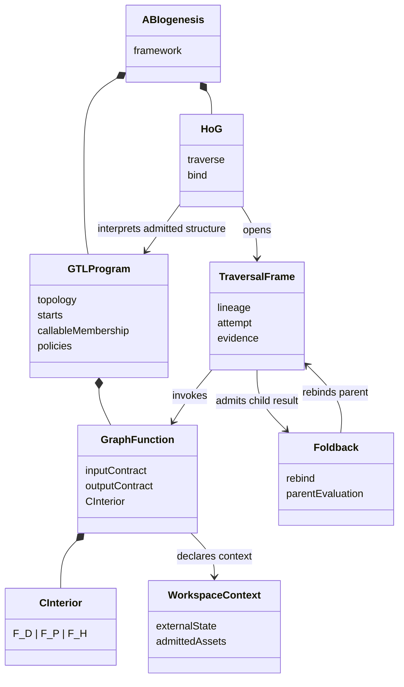
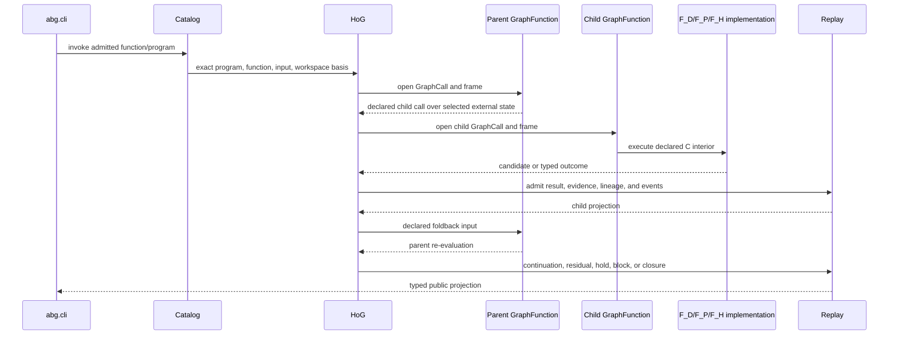
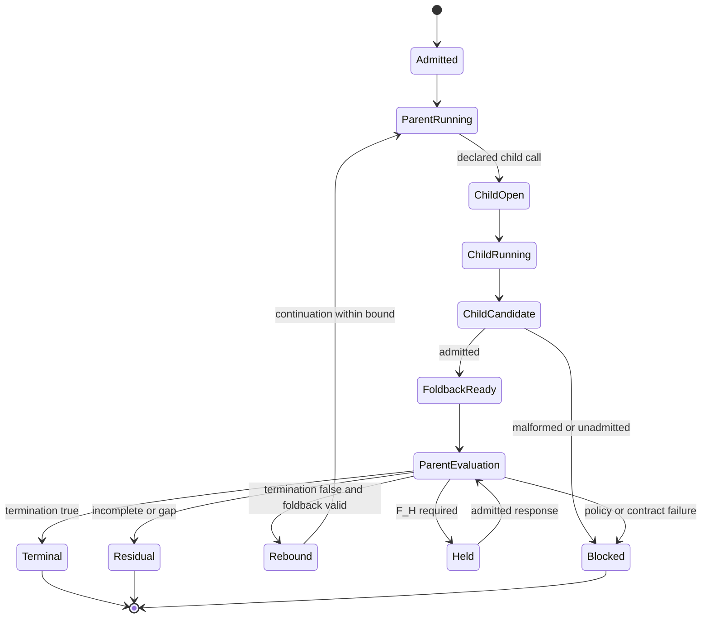

# STRATEGY: Recursive LLM Principles In GTL And HoG

**Author**: codex
**Date**: 2026-07-19T15:51:55Z
**Addresses**: historical Recursive Language Model comparison against GTL
graph-function recursion, C composition, and HoG traversal
**Status**: Superseded in full; historical commentary only
**Reality/Target**: no current target, correction, classification, or delivery
authority
**Superseded by**:
`20260719T152242Z_STRATEGY_abiogenesis_5_0_product_destination.md`

> This post was created beyond the review mandate and is withdrawn as a 5.0
> target or correction surface. Its research observations may be reconsidered
> later, but none of its classifications, directives, or retention claims are
> active. The single 5.0 semantic-basis candidate is the superseding post above;
> the `X -> 5.0` correction vector remains deferred until constitutional product
> closure.

## Summary

The Recursive Language Models paper supplies demand and reference evidence for
one higher-order GTL program shape:

```text
external state
  -> symbolic inspection and decomposition
  -> recursive semantic calls over selected state
  -> aggregation and foldback
  -> parent re-evaluation
  -> continuation or terminal result
```

ABIogenesis does not need a separate RLM runtime, language, compute regime, or C
constructor. The pattern is expressible as an ordinary admitted GTL program
traversed by HoG:

```text
workspace/context assets
  -> admitted GTL decomposition
  -> GraphFunction calls through workflow.C, recurse, and optional fan_out
  -> HoG child traversal frames
  -> F_D, F_P, and F_H interiors under declared C composition
  -> admitted child results
  -> fan_in or declared foldback
  -> parent re-evaluation
  -> replay-derived continuation, residual, hold, block, or closure
```

This interpretation strengthens the corrected ABIogenesis 5.0 destination. It
does not authorize the compiled HoG-program representation, callback-driven
recursive controller, SDK traversal controller, or a Consensus-specific engine
path. HoG must traverse the original admitted GTL structure directly.

## Source And Authority

The source paper is:

> Alex L. Zhang, Tim Kraska, and Omar Khattab, "Recursive Language Models,"
> arXiv:2512.24601 v3.

- Paper: <https://arxiv.org/abs/2512.24601>
- Revised HTML: <https://arxiv.org/html/2512.24601v3>
- Reference code: <https://github.com/alexzhang13/rlm>
- Local reference checkout: `/Users/jim/src/apps/recursive-llm`

The paper treats a long prompt as external environment state, allows a root LLM
to inspect and decompose that state programmatically, and permits recursive LM
calls over selected slices. Its Python REPL, variables, recursive callback, and
final-answer markers are one implementation of the idea. They are not
ABIogenesis architecture.

The first ABIogenesis interpretation is commentary:

- `.ai-workspace/comments/codex/20260703T083818Z_STRATEGY_recursive_llms_recursive_gtl_disambiguation_graphs.md`

The paper did not create GTL recursion. The active GTL recursion requirement
predates that commentary:

- `specification/requirements/gtl/REQ-L-GTL3-RECURSE.md`

The paper-derived obligation-conservation correction was subsequently ratified
and realized through:

- `specification/requirements/abg/REQ-R-ABG3-REQUIREMENT-PROOF-CARRY-THROUGH.md`
- `.ai-workspace/tickets/completed/T-188-realize-requirement-proof-carry-through.md`
- `build_tenants/abiogenesis/typescript/design/M03_REQUIREMENT_PROOF_CARRY_THROUGH_DERIVATION.md`

The load-bearing ratified rules are:

1. A requirement-bearing GTL GraphFunction call denotes a HoG traversal bind.
2. A tail-recursive call denotes continuation over the same GraphFunction
   lineage.
3. Child results fold into parent requirement state only after result and
   evidence admission.
4. Parent coverage, residual, assurance, and closure remain replay-derived.
5. Recursive traversal does not introduce a second ambiguity, entropy,
   disambiguation, or recursive-agent truth surface.

This post is commentary. It records the interpretation and recovery boundary.
It does not itself change specification, design, code, ticket, or release
authority.

## Terminology

The following names are distinct:

| Name | Meaning |
| --- | --- |
| ABIogenesis | The full named framework and released product. |
| GTL | The embedded TypeScript graph language and contract algebra. |
| HoG | The executor engine that traverses admitted GTL. |
| `abg.*` | The existing runtime namespace and older shorthand for traversal/runtime law realized by HoG. It is not a fourth architecture or a peer executor. |
| GraphFunction | A named reusable callable contract belonging to an admitted GTL program or module. |
| GTL program | The admitted graph overlay or composition that owns topology, starts, callable membership, policies, effects, and result contracts. |

Earlier prose used ABIogenesis, ABG, and HoG interchangeably. That ambiguity
allowed HoG to be misread as a compilation target and ABG to be misread as a
second engine. The corrected model is:

```text
ABIogenesis product
  contains GTL language and catalog
  contains HoG executor
  exposes runtime truth through the existing abg.* namespace
```

## Compute And Composition Layers

### C composition

`C<A, B>` declares the computation inside an A-to-B traversal. Its leaves may
use any admitted compute regime:

| Shape | Meaning |
| --- | --- |
| `C.of(F_D)` | A total deterministic function over a declared closed input domain. |
| `C.of(F_P)` | Open-world semantic construction, interpretation, evaluation, ranking, diagnosis, or repair. Its result remains candidate material until admitted. |
| `C.of(F_H)` | An attributed human decision or callout that returns through typed admission. |
| mixed C | A typed composition containing two or more regimes. |

A graph made only of `F_D` traversals is a traditional deterministic workflow
or typed data pipeline. A graph made only of `F_H` traversals is a human
process. A general-purpose LLM construction may use only `F_P` traversals. All
three are reductions of the same traversal model.

The seven C constructors are:

```text
C.of
C.id
C.compose
C.edge
workflow.C
C.batch
C.retry
```

They compose compute interiors. They do not create a second program model.

### Graph composition

GTL graph algebra composes GraphFunctions and topology:

```text
edge
compose
substitute
recurse
fan_out
fan_in
gate
promote
identity
same_object
```

Graph composition owns declared program structure. HoG interprets that
structure. An SDK, CLI, plugin, worker, or runtime callback cannot supply rival
topology.

### HoG traversal bind

HoG executes the admitted GTL program through the ABIogenesis traversal monad.
The unit is `TraversalUnit<A, B>`. Bind joins admitted unit truth to one lawful
next disposition:

- the next declared unit;
- a child GraphFunction traversal;
- same-unit retry;
- recursive child application;
- tail-recursive continuation;
- re-entry or reprice;
- yielded continuation;
- typed F_H hold;
- residual or gap stop;
- block or non-admission; or
- terminal projection.

These are runtime outcomes of one monad. They are not separate runners.

## Recursive LLM Translation

| RLM paper concept | ABIogenesis expression | Required correction |
| --- | --- | --- |
| Prompt as external environment | Workspace/context assets plus admitted payloads and projections | External state remains addressable product truth, not hidden prompt text. |
| REPL variable | Typed asset, carrier, event, or replay-derived projection | Useful mutable state does not become authority without admission. |
| Programmatic prompt inspection | `F_D` only for total typed inspection; otherwise `F_P` | Deterministic code must not infer open semantic truth from unbounded syntax. |
| `llm_query(...)` | An `F_P` GraphFunction or declared F_P C leaf | Output remains a candidate until result admission. |
| Recursive sub-LM call | A declared GraphFunction call in GTL | The call denotes a HoG child traversal bind. |
| Chunking | Typed selection, decomposition, refinement, zoom, or `fan_out` | The declaration preserves source identity, ordinal, and obligation lineage. |
| Intermediate buffers | Workspace assets and replay-derived projections | Buffers do not become a second ledger or truth source. |
| Stitching results | `fan_in`, a total reducer, semantic synthesis, or declared foldback | The selected reducer regime must match whether aggregation is total or semantic. |
| Final-answer marker | Declared termination plus admitted result and replay-derived closure | Worker syntax cannot confer finality. |
| Partial or failed answer | Residual, retry, continuation, F_H, re-entry, or block | Non-closure remains typed runtime truth. |

The central law is:

```text
Every declared GTL GraphFunction call denotes a HoG traversal bind.
Every HoG traversal is recursion-capable.
A traversal with no child call is the base case.
```

There is no normal traversal mode and recursive traversal mode. Recursion is one
lawful shape of traversal.

## Recursive Call Shapes

| GTL call shape | HoG denotation | Meaning |
| --- | --- | --- |
| `F` calls `G` | Child GraphCall and frame | Delegation or decomposition. |
| `F` calls `F` in non-tail position | Recursive child traversal plus parent continuation | Nested refinement. |
| `F` tail-calls `F` | Continuation over the same GraphFunction lineage | Iteration over unresolved pressure. |
| `F` calls `G`, which later calls `F` | Mutual recursion | Lawful only when the complete cycle, termination, interfaces, and foldback are admitted. |
| `F` zooms one vector into `G` | Declared substitution plus child traversal and foldback | Refinement of one exact boundary while preserving the outer interface. |
| `F` fans out `G` over `Vector<A>` | Pointwise child tasks, optionally through `C.batch` | Parallel or serial realization of one declared relation. |
| `F` fans results into `H` | One typed reducer traversal | Aggregation with complete cardinality and attribution. |

Tail recursion is the lawful expression for repeated work until termination:

```text
F(state)
  -> compute next candidate
  -> evaluate declared termination
  -> if terminal: return admitted result
  -> otherwise: rebind admitted next state
  -> continue F(next_state) under the same lineage
```

`C.retry` is not a substitute for recursive GraphFunction application. Retry
repeats a bounded C interior under its retry policy. `recurse(...)` reapplies a
GraphFunction under declared termination, foldback, parent re-evaluation,
lineage, and bound law.

## Domain Model



## Governed Recursive Sequence



The shell performs one admitted invocation and renders one typed projection. It
does not select slices, open child calls, aggregate results, or decide whether
the parent continues.

## Recursive State Machine



## Opaque And Governed RLM Use

Two lawful uses must remain distinct.

### Opaque worker implementation

An F_P worker may internally use an RLM, subagents, a REPL, retrieval, or another
private inference strategy. ABIogenesis observes one F_P invocation and one
candidate result contract. Internal recursive calls are not HoG frames and do
not become replay-visible ABIogenesis traversal.

### Governed recursive GTL program

A product may declare recursive decomposition as GTL. HoG then owns each child
GraphCall, frame, input admission, result admission, lineage relation,
termination decision, foldback, parent re-evaluation, continuation, and replay
projection.

The product selects governed recursion when recursive structure, evidence,
budgets, attribution, continuation, or closure must be inspectable. It may use
opaque worker recursion when only the outer F_P contract matters.

## Relationship To Consensus

Consensus is a standard GTL free construction over public atoms. It is not the
RLM subsystem.

Consensus contains one outer recursion:

```text
round
  -> collect attributed reviews
  -> reduce admitted findings
  -> close | recurse next round | escalate F_H
```

An individual reviewer may independently use an RLM-shaped GraphFunction to
inspect a large ticket, repository, or evidence corpus:

```text
reviewer
  -> bind external workspace/context
  -> select or derive slices
  -> recursively evaluate slices
  -> aggregate attributed findings
  -> return one admitted reviewer result
```

The two recursion dimensions compose:

```text
Consensus round recursion
  contains reviewer context-decomposition recursion
```

They remain separate declared GraphFunctions, frames, bounds, foldbacks, result
contracts, and lineages. HoG requires no Consensus branch and no RLM branch.

## Current Realization Assessment

### Retain

The following capabilities match the corrected model or contain useful runtime
semantics:

- GTL `recurse(...)` and its termination/foldback declaration in
  `build_tenants/abiogenesis/typescript/code/src/gtl/m01/algebra/core.ts`;
- canonical GraphFunction application declarations and raw admission in
  `build_tenants/abiogenesis/typescript/code/src/gtl/m01/contracts/graph_function_application.ts`;
- recursive requirement and proof carry-through projections in
  `build_tenants/abiogenesis/typescript/code/src/abg/m03/contracts/requirement_proof_carry_through.ts`;
- workspace zoom, scheduled-slice, and foldback semantics in
  `build_tenants/abiogenesis/typescript/code/src/abg/m03/contracts/workspace_zoom_foldback.ts`;
- child frame, termination, foldback, parent re-evaluation, boundedness,
  lineage, event, replay, and refusal semantics from T-262; and
- the pure-data Consensus GTL declaration as a reference consumer of recursion
  and higher-order graph operations.

Retention of semantics does not require retention of their current realization
boundary.

### Contract Or remove

The following surfaces depend on treating HoG as a compiler target or on
creating a second controller:

- `CompiledTypedRecurseBinding` and `CompiledTypedRecursePlan` as executable
  program authority;
- the standalone callback-driven loop in `typed_recurse_runtime.ts` when its
  callbacks supply topology or semantic implementation authority;
- `c_algebra_hog_compiler.ts` when it lowers GTL into a rival normalized HoG
  program;
- `CompiledHogProgramPlan`, HoG-specific program catalogs, ladders, selectors,
  and default plans that duplicate admitted GTL truth;
- SDK or CLI sequencing of recursive calls, One Surface stages, retry,
  foldback, continuation, or closure;
- a Python RLM REPL or local recursive-agent controller transplanted into the
  product; and
- feature-specific runtime branches for Consensus, RLM, odd_glc, or any other
  graph program.

HoG may derive an invocation-local cursor, stack, frame, or cached resolution
from admitted GTL. Those runtime artifacts remain subordinate to the original
program identity and cannot become a second executable representation.

## ABIogenesis 5.0 Implication

The 5.0 completion extends the functional 4.6 basis as follows:

```text
admitted GTL.TypeScript program
  -> whole-program validation
  -> catalog publication
  -> thin CLI invocation
  -> HoG direct traversal of complete C and graph algebra
  -> recursive child calls and foldback where declared
  -> F_D, F_P, and F_H result admission
  -> events, replay, continuation, and closure
```

The validator must prove that recursive declarations are complete and
unambiguous. It checks GraphFunction membership, interfaces, termination,
foldback, bounds, implementation binding, result contracts, and reachable
topology. It does not lower the recursive graph into another program.

The minimum recursive proof for the recovered engine is:

1. A packed, source-independent GTL program publishes a recursive
   GraphFunction.
2. `abg.cli` invokes that function through the public catalog.
3. A declared child call opens a causally linked HoG GraphCall and frame.
4. The selected F_P result is admitted through its declared result contract.
5. The child output folds back through the declared rebind law.
6. HoG re-evaluates the parent termination contract.
7. A false termination continues under the same GraphFunction lineage and a
   fresh attempt identity.
8. A true termination returns a replay-derived typed result.
9. A malformed F_P result refuses before foldback or another effect.
10. Mutating the admitted topology changes traversal or fails before effects,
    proving that no SDK, callback, or compiled plan owns the actual sequence.

Consensus can serve as a later reference proof over these atoms. The first
direct recursive engine proof should remain smaller than Consensus so engine
correctness is not conflated with product-specific panel behavior.

## Non-Goals

- No separate RLM runtime.
- No eighth C constructor.
- No fourth compute regime.
- No Python or shell controller inside ABIogenesis.
- No new ambiguity, entropy, or recursive-agent ledger.
- No deterministic parsing of unconstrained semantic syntax as F_D truth.
- No requirement that every F_P worker expose its internal recursion.
- No claim that the paper's REPL implementation is the ABIogenesis programming
  model.
- No Consensus-specific engine law.

## Recommended Recovery Rule

Use this decision test for every recursive realization surface:

> If removing the derived carrier leaves the admitted GTL program sufficient
> for HoG to know what to traverse, the carrier is a lawful runtime projection.
> If removing it causes topology, selection, termination, foldback, or callable
> meaning to disappear, it has become rival program authority and must be
> contracted into GTL or removed.

Apply that test during the 5.0 retention census. Preserve demonstrated C,
recurse, foldback, admission, event, replay, and lineage behavior. Remove the
parallel program and controller layers that were built around them.
