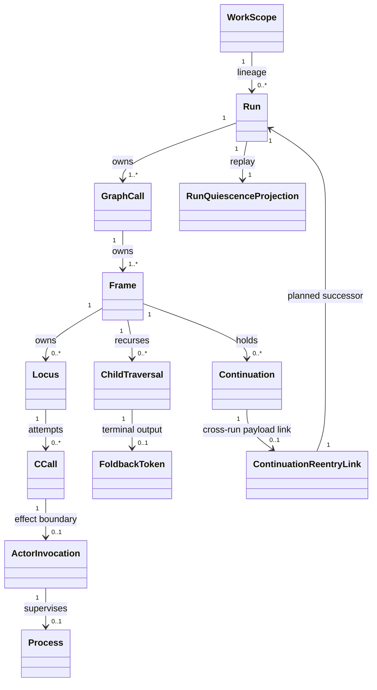
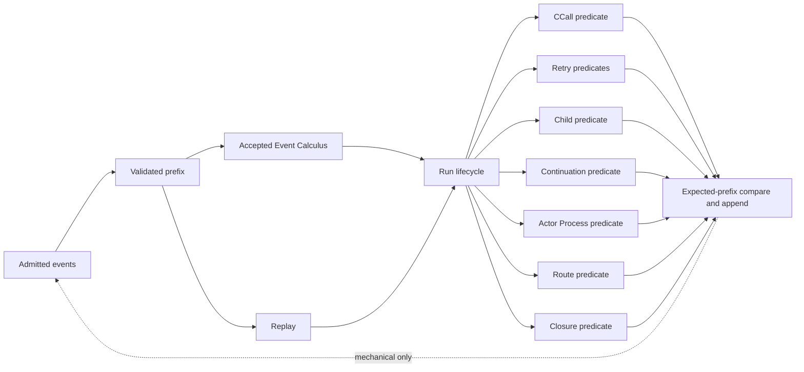
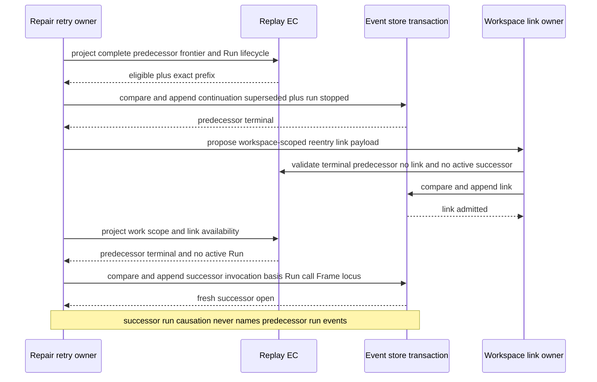
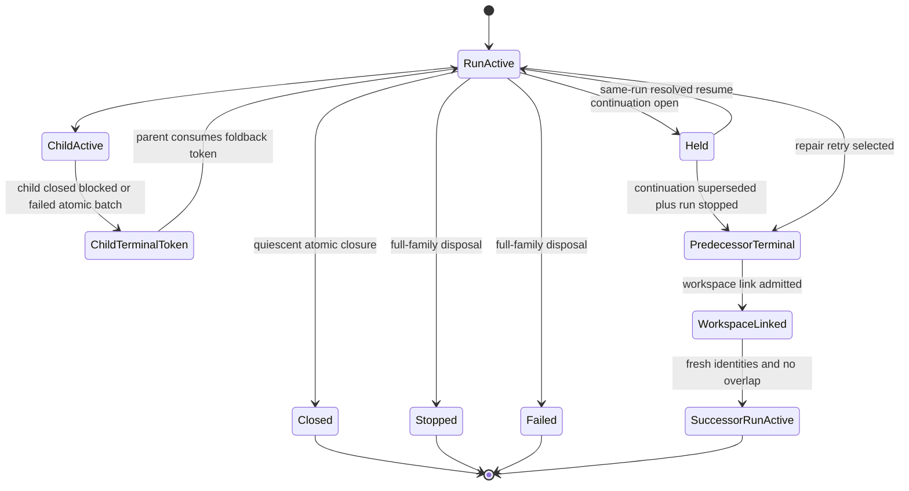

# T-287 A5-F10 Terminal Quiescence Owner Network Replacement Candidate

**Type**: STRATEGY  
**Status**: Frozen replacement candidate for F_H ratification; not operative design or code authority  
**Ticket**: T-287  
**Wave**: Wave 1 / A5-F10  
**Base HEAD**: `a1fa19f68213aa0773b88b3b6ef9ba2e41f5ee99`  
**Accepted checkpoint retained**: `1f6a86074bf995763b4caff286422b5b1501374b`  
**Re-entry if selected**: minimal `goal_reprice` of the active slice, followed by bounded `design_reframe`  
**Rejected predecessor**: SHA-256 `0ac92d829d315b8b0686e331b5486878779e5bde84a2ebd042a31857a2959895`; preserved unchanged as donor evidence only  
**Rejected dirty code donor**: user-identified `abac6114...`; evidence only; no transplant  
**Product and requirements**: unchanged  
**Production, tests, tickets, GOALS, accepted design changed by this post**: none  

## 1. Boundary reconciliation and required reprice

The clean accepted `GOALS.md` and T-287 do not authorize this closure cone.
They select:

```text
selected_slice = invocation_reentry_projection
selected_slice_stage = code_assessment_and_implementation
expected production scope = invocation_admission.ts plus existing replay types
```

That slice replaces two raw invocation re-entry scans with the already
accepted stopped-Run replay projection while preserving the separate
duplicate-consumption guard. It does not select continuation termination,
cross-Run repair, CCall phases, child terminal/foldback, ActorInvocation,
Process, retry-frontier composition, route effects, quiescence, or closure.

The requested terminal-barrier closure cone reaches two unchecked A5-F10 rows:

- migrate invocation, continuation, and retry truth; and
- migrate result, judgment, route, and closure truth.

It also supplies proof dependencies for the unchecked A5-F03 retry and
continuation reconstruction and A5-F04 retry classification rows. It does not
close those feature rows.

### Minimal repricing proposal for F_H

Before adopting this design, F_H must ratify exactly these focus changes:

1. In GOALS, retain GOAL-035, Wave 1, A5-F10 priority, Product scope, all
   accepted checkpoints, and all checkbox states. Change only the active-focus
   wording from stopped-Run/invocation-reentry selection to
   `A5-F10 terminal-quiescence owner-network design assessment`.
2. In T-287 metadata, change only:

   ```text
   selected_slice: invocation_reentry_projection
     -> terminal_quiescence_owner_network
   selected_slice_stage: code_assessment_and_implementation
     -> design_assessment
   ```

3. Replace Current Slice scope/acceptance text with the exact files,
   relations, migration order, and proof gates in this candidate. Retain
   `accepted_checkpoint`, every accepted checkbox, and the whole Wave order.
4. After F_H accepts an exact design blob, advance the stage separately to
   `code_assessment_and_implementation`. Design acceptance alone does not
   authorize code.

If F_H declines that reprice, the only lawful next implementation remains the
original invocation-reentry slice. No part of this candidate silently enters
that narrower authority.

## 2. Corrections relative to the rejected predecessor

1. Delete the purpose-dispatching `RuntimeTransformationAvailability` union.
   There is no generic semantic currentness gateway.
2. Delete every proposed semantic effect/currentness controller from
   `event_store.ts`. The store remains envelope validation, ordinal assignment,
   durable append, reopen, snapshot, and transaction ownership only.
3. Extend the store transaction only with an authority-neutral
   expected-prefix compare-and-append primitive. Concrete owners compute their
   own typed lifecycle predicates before calling it.
4. Select one cross-Run continuation linkage:
   workspace-scoped `continuation_reentry_link_admitted`, referenced through
   typed payloads. Run-scoped events never causally cite events in another Run.
5. Separate `DeclaredInRunCRetryAttempt` from
   `RepairRetryRunTransition`. Only the latter opens a fresh Run.
6. Derive effects from exact admitted event contract variants, not event kind
   alone. A subordinate child/Frame failure cannot terminalize the shared Run.
7. Replace “Run active is enough” with complete replay-derived Run quiescence.
8. Add exact CCall partial-phase cardinalities and full retry-frontier
   projections.
9. Complete ActorInvocation, Process, child terminal, foldback-token, and
   continuation lifecycle rows.
10. Use an atomic semantic cut after mechanical infrastructure and unreachable
    projections exist. No period has two reachable semantic paths.

Sound predecessor decisions retained are historical/current CCall separation,
zero-append stale refusal, atomic closure append, a unified deferred-application
history/current projection, and reuse of the existing batch/transaction owner.

## 3. Governing reconciliation

### Child Run identity

Same-Run child traversal is upstream law, not a choice copied from code:

- accepted M05 section 3.2 explicitly states that a `workflow.C` child
  GraphCall and Frame remain under the same Run;
- Product defines recursive work as child GraphFunction calls, child Frames,
  foldback, parent reevaluation, and ABG continuation in one ordinary runtime;
- Run identifies one execution attempt over one GTL job; and
- retry/replacement, unlike recursion, explicitly requires a fresh Run.

Therefore a recursive child mints a GraphCall and Frame, not a Run. A child
blocked/failed transition can terminalize the child Frame/GraphCall and expose
one parent foldback token while leaving the shared Run active. A root
blocked/failed transition pairs with `run_stopped` and terminalizes the Run.

### Continuation algebra

Accepted M05 section 9 realizes same-Run open/respond/resolved and marks
superseded/abandoned plus `continuation_reentry_link_admitted` deferred. It
also says later cross-Run supersession must use workspace-scoped payload
linkage rather than cross-Run event causation. This candidate selects and
completes those deferred rows; it supersedes no realized same-Run row.

### Retry domains

Requirements say a retryable same-edge repair attempt mints a fresh Run,
GraphCall, and manifest. Accepted M03/M05 also contain a subordinate bounded
`C.retry` atom at an active traversal locus. The word “run” in the historical
`attemptRunRef` spelling does not create a Run aggregate. This candidate
supersedes that ambiguous spelling with `cRetryAttemptRef` and keeps the two
domains disjoint.

## 4. Whole-family Ontology

| Entity | Identity and cardinality | Lifecycle | Authority owner | Terminal/current law |
|---|---|---|---|---|
| WorkScope | exact `workKey`; one lineage across attempts | no live state of its own | ABG lineage projection | at most one active Run per WorkScope |
| Run | exact `runId` inside one `workKey`; one opening; at most one terminal event | not-open -> active -> closed / stopped / failed / superseded | Run admission plus accepted EC/replay projection | terminal is irreversible; close requires complete quiescence; stop/failure/supersession dispose the full Run-owned live family |
| GraphCall | exact `graphCallId`, Run, GraphFunction, materialization | not-open -> active -> closed / blocked / failed | GraphCall admission and replay | child and parent may coexist in one Run; replacement/repair mints fresh identity |
| Frame | exact `frameAttemptId`, stable `frameLineageId`, GraphCall | not-open -> active -> held -> active -> closed / blocked / failed | Frame admission and replay | child terminality is subordinate unless an exact root terminal transaction follows |
| traversal locus | exact `cursorRef`, Run, GraphCall, Frame, term path, attempt path | not-entered -> active -> consumed | route/cursor owner | one current source; route consumes once; Run terminal disposes all active loci |
| CCall | exact `cCallRef`, Run/GraphCall/Frame/locus/attempt | not-open -> opened -> selected -> evidencing -> result-admitted -> judged | CCall owner | history remains durable; phase predicate plus Run/Frame/locus currentness controls each append |
| ActorInvocation | exact `actorInvocationRef`, CCall, binding, dispatch ordinal | not-started -> active -> closed / failed | actor-process owner | may emit active evidence only while exact CCall/Run boundary is current; terminal cleanup is observational |
| Process | exact `processRef`, ActorInvocation, process identity | not-started -> active/live -> exited / spawn-failed / timed-out / termination-unconfirmed | actor-process owner | cleanup cannot reopen ActorInvocation, CCall, Frame, locus, continuation, or Run availability |
| DeclaredInRunCRetryAttempt | exact `cRetryAttemptRef`, retry boundary, positive ordinal/path, current Run/locus, fresh CCall and manifest | eligible -> active -> judged/progressed -> consumed / exhausted | C.retry owner | never opens a Run; stays within one active Run; every attempt has its own complete CCall phase row |
| RepairRetryRunTransition | exact workspace link plus predecessor/successor Run identities and full frontier | eligible -> predecessor-terminal -> linked -> successor-open -> consumed / refused | repair-retry owner | same `workKey`; no overlapping Run; fresh Run/GraphCall/Frame/locus/CCall/manifest |
| child traversal | exact parent waiting relation plus child GraphCall/Frame in same Run | preparing -> active -> closed / blocked / failed -> token-available -> token-consumed | child traversal owner | child terminal batch is atomic; `run_stopped` is absent; parent foldback needs current parent and shared Run |
| child foldback token | exact child-terminal event/ref plus parent locus and disposition | absent -> available -> consumed | child foldback owner | durable child history does not recreate a consumed token |
| Continuation | exact continuation id/kind/cause/Run/GraphCall/Frame/held locus | not-open -> open -> responded -> resolved / abandoned / superseded | continuation owner | strictly Run-local; terminal states irreversible; replacement uses a new continuation in successor Run |
| ContinuationReentryLink | exact workspace-scoped ref/digest over predecessor terminal and planned successor identities | absent -> admitted -> consumed / malformed | repair-retry owner | only selected cross-Run link; carries payload references, never cross-Run causation |
| RunQuiescenceProjection | exact selected prefix digest, Run, and proposed closure spine | non-quiescent / quiescent-for-close / invalid | replay owner | read only; close admits only `quiescent_for_close`; stop/failure explicitly dispose every listed live member |
| closure | exact closure ref over terminal route, root Frame/GraphCall/Run | unavailable -> eligible -> atomically admitted / refused | closure owner | cannot append after any Run terminal; child closure is subordinate and does not close Run |
| DeferredApplicationProjection | exact historical CCall completion plus owner-specific current application predicate | historical-only / currently-applicable / consumed | CCall/application composition | one API; historical truth never supplies mutation authority |

No entity above is implemented by a generic event-store lifecycle controller.

## 5. Authority-neutral atomic append

Extend the retained event-store transaction with:

```text
compareAndAppendExpectedPrefix(
  store,
  expected = { eventCount, lastEventId, prefixDigest },
  candidateBatch
) -> appended immutable events | stale_prefix refusal
```

The comparison and whole-batch append occur under the store's existing
exclusive synchronous transaction. The function:

- compares the full mechanical store prefix from which the owner selected its
  scoped validated semantic prefix; it does not compare a Run projection or
  infer semantic scope;
- validates the ordinary event envelopes/contracts;
- compares only mechanical prefix identity;
- assigns ordinals and appends all or none;
- knows no Run, Frame, locus, CCall, retry, continuation, child, route,
  closure, currentness, or effect semantics; and
- never converts a semantic refusal into an event.

Each concrete owner selects a validated prefix, composes the accepted Run
lifecycle projection with its own typed predicate, constructs candidates, and
passes the selected mechanical prefix identity to this primitive. A mismatch
returns stale refusal with zero append. The owner may retry by reprojecting; it
may not reuse the earlier semantic decision.

## 6. Concrete owner predicates

| Typed owner predicate | Accepted Run relation composed | Owner-specific facts | Consumers |
|---|---|---|---|
| `projectCCallPhase` | exact Run active, GraphCall active, Frame active, locus active | exact spine order/cardinality and current phase | CCall evidence/result/judgment/rejection owners |
| `projectRouteAdmissionBasis` | exact Run active unless candidate is subordinate cleanup inside same terminal batch | exact source locus, declaration, candidate variant, unconsumed evidence/token | route owner |
| `projectChildTerminalBasis` | shared Run active, parent Frame/locus active | exact child GraphCall/Frame terminal variant and token cardinality | child transition/foldback owner |
| `projectDeclaredCRetryFrontier` | exact same Run active and locus current | complete in-Run attempt family, budget, signal, progress | C.retry owner |
| `projectRepairRetryFrontier` | predecessor Run active when eligibility chosen; predecessor terminal before link; no active Run before successor open | complete cross-attempt frontier, policy, liveness, workKey, link state | repair-retry owner |
| `projectContinuationLifecycle` | same Run active for open/respond/resume; terminal Run for abandonment/supersession reconstruction | exact open/respond/terminal cardinality, held Frame, Public ingress | continuation owner/Public consumers |
| `projectActorProcessLifecycle` | Run/Frame/locus/CCall active for active evidence; terminal Run allowed only for cleanup candidate | exact ActorInvocation/Process state and candidate variant | actor/process owner |
| `projectFanOutCompletionBasis` | Run/Frame/locus active | complete ordered task/child token census | fan-out owner |
| `projectClosureBasis` | Run/GraphCall/Frame active and Run quiescent except closure chain itself | terminal route and exact closure evidence | closure owner |
| `projectDeferredApplication` | historical projection always; exact application predicate composes active Run/parent/locus/token | exact CCall result/judgment through judgment prefix | HoG deferred application consumers |

These are distinct owner relations. Shared typed fluent constructors and exact
cardinality helpers are authority-neutral recurrence only.

## 7. Exact event-contract-variant effects

`eventCalculusEffect` is total over the closed event candidate, including its
contract variant discriminant. Kind alone is insufficient.

| Exact event contract variant | Scope | Initiates | Terminates / consumes |
|---|---|---|---|
| `traversal_route_admitted.advance` | current Frame | target locus | source locus plus named evidence/token |
| `traversal_route_admitted.retry_in_run` | current Frame | target locus for declared C.retry | source locus plus judgment/progress; never Run terminal |
| `traversal_route_admitted.hold` | current Frame | hold-route availability and held disposition | source locus, named evidence, Frame active |
| `traversal_route_admitted.child_blocked` | child Frame | child blocked terminal fact | child locus/Frame/GraphCall active; never shared Run active |
| `traversal_route_admitted.child_failed` | child Frame | child failed terminal fact | child locus/Frame/GraphCall active; never shared Run active |
| `traversal_route_admitted.root_blocked` | root Frame | root blocked route fact | source locus and named availability; paired atomically with `run_stopped.blocked` |
| `traversal_route_admitted.root_failed` | root Frame | root failed route fact | source locus and named availability; paired atomically with `run_stopped.failed` |
| `traversal_route_admitted.terminal` | root Frame | terminal-route availability | source locus and named evidence |
| `runtime_failure_observed.actor_or_process` | ActorInvocation/Process | typed failure observation | exact actor/process live state; does not terminate Run |
| `runtime_failure_observed.frame` | subordinate Frame | frame-failed fact | exact Frame/locus/CCall/actor/process; does not terminate Run unless root owner subsequently admits Run terminal transaction |
| `runtime_failure_observed.run_terminal` | Run | runtime-failure terminal fact | complete Run-owned live/availability family |
| `run_stopped.blocked` / `.failed` / `.operator_abort` / `.campaign_close` / `.superseded` | Run | unique Run terminal fluent | complete Run-owned live/availability family |
| `child_foldback_admitted.closed` / `.blocked` / `.failed` | parent Frame | exact child token, or direct workflow-parent evidence variant | parent waiting relation; no Run termination |
| `continuation_superseded` | predecessor continuation | terminal superseded truth | open/respond/pending/held availability for that continuation |
| `continuation_abandoned` | predecessor continuation | terminal abandoned truth | open/respond/pending/held availability for that continuation |
| `run_closed.quiescent_for_close` | Run | closed truth | Run active; exact final closure spine present; no other live/available member |

The event contract roster supplies each discriminant. Missing/unknown variants,
variant/payload disagreement, or an effect without exact identity refuses
before append. Event store validates shape; the concrete owner validates
semantic predecessor; EC projects admitted effects.

## 8. Complete Run quiescence

`RunQuiescenceProjection` composes replay and EC over one validated Run prefix.
For closure it accepts the exact proposed closure spine
`{runId, rootGraphCallId, rootFrameId, terminalRouteRef}`. It is
`quiescent_for_close` only when the Run is active, that one root GraphCall and
Frame are active, that one terminal route is available, and every *other*
following Run-owned set is empty:

- active or held GraphCalls/Frames/loci other than the named root GraphCall and
  Frame; the named root locus is already consumed by the terminal route;
- active CCalls or unconsumed CCall phase availability;
- active ActorInvocations and active/live Processes;
- active declared C.retry attempts and unconsumed retry progress;
- open/responded continuations, interaction-pending, response availability,
  and held Frames;
- parent-waiting relations;
- child preparation-refusal and child foldback tokens;
- fan-out complete/partial availability;
- hold-route, terminal-route, construction-intent/delta, result/judgment, and
  other declared transformation availability; and
- any malformed/dangling lifecycle member.

Historical evidence rows remain replay-visible but do not remain current
availability. CCall phases, actor stream/result evidence, and construction
facts must therefore have explicit consuming effects rather than permanent
`available` fluents.

`run_closed` requires `quiescent_for_close` immediately before the atomic
closure batch. The closure batch itself consumes the permitted final spine by
ordering terminal, Frame close, GraphCall close, then Run close and is compared
against the full expected store prefix once. A projection with no final spine,
more than one root spine, a different terminal route, or any additional live
member is not closure-quiescent.

`run_stopped` and `runtime_failure_observed.run_terminal` do not require prior
quiescence. Their exact payload/effect projection enumerates and disposes the
complete non-quiescent family. Replay rejects a terminal event whose declared
disposal census differs from the pre-event projection. After terminal truth,
only exact ActorInvocation/Process cleanup observations may append, and only
when their candidate effect is observational/termination-only. They cannot
initiate active, live, open, pending, held, route, token, result, judgment,
retry, continuation, or closure availability.

## 9. Continuation lifecycle and selected cross-Run link

Same-Run lifecycle remains:

```text
not-open -> open -> responded -> resolved
                  \-> abandoned
                  \-> superseded
open ----------------^       ^
```

Cardinality is one open, zero-or-one response, and exactly one terminal row.
Resolved uses the accepted resume event. `continuation_abandoned` and
`continuation_superseded` are now selected typed events. Failure/stop owner
must atomically terminalize every open/responded continuation before the Run
terminal event; close refuses while any continuation remains open/responded.

Each new terminal event is Run-scoped under the exact Continuation aggregate
and carries the closed payload:

```text
{
  continuationId,
  continuationKind,
  openedEventRef,
  priorStatus: open | responded,
  respondedEventRef: string exactly when priorStatus is responded,
  terminalDisposition: abandoned | superseded,
  terminalCauseClass:
    runtime_failure | run_stop | repair_retry | operator_stop | campaign_close,
  terminalCauseRefKind: admitted_event | immutable_failure_candidate,
  terminalCauseRef,
  plannedSuccessorRunId: string exactly when superseded
}
```

`terminalCauseRef` names an already admitted same-Run judgment, route,
operator-ingress, or subordinate failure observation. When the Run-terminal
failure observation is itself the first authoritative failure event, the owner
first constructs one immutable content-addressed failure candidate; the
continuation rows cite that candidate and the following Run-terminal event
admits the same candidate fields and cites the continuation rows. A
continuation row never cites a later event. Replay requires exact candidate
equality across the atomic batch. The subsequent workspace link proves the
exact terminal batch and planned successor identity.

The only cross-Run carrier is workspace-scoped:

```text
ContinuationReentryLink {
  linkRef, linkDigest,
  workspaceBindingId, workspaceBindingDigest,
  workKey,
  linkKind: repair_retry,
  predecessor: {
    runId, terminalEventRef, terminalPrefixDigest,
    continuationId, continuationTerminalEventRef,
    graphCallId, frameId, locusRef,
    retryFrontierRef, retryFrontierDigest
  },
  successor: {
    plannedRunId, plannedGraphCallId, plannedFrameAttemptId,
    frameLineageId, plannedInitialCursorRef,
    plannedCCallRef, plannedManifestRef
  }
}
```

Admission order is:

1. predecessor owner projects repair eligibility from the complete frontier;
2. atomic predecessor batch admits `continuation_superseded` when applicable
   and `run_stopped.superseded`;
3. workspace owner admits one link after observing exact predecessor terminal
   truth and proves no existing link for that predecessor/frontier;
4. successor invocation/basis admission carries `linkRef/linkDigest` as typed
   payload authority;
5. successor Run opens only when no Run is active for `workKey`, and its open
   payload consumes the link and equals every planned fresh identity; and
6. any successor continuation opens as a new aggregate in the new Run and
   carries the link in payload. Its same-Run `causedByEventId` names a successor
   Run event, never a predecessor event.

No predecessor Run event appears in a successor Run event's
`causationEventRefs`. The link event is workspace-scoped and carries source
refs in payload. Successor run events cite only successor workspace/basis/run
causation permitted by the accepted envelope law.

Prefix/replay selection for this relation is an explicit composite validated
prefix: the workspace binding/workKey scope plus exactly the named predecessor
and optional successor Run ids. It includes declared workspace events and
those Runs only. It rejects unrelated Runs, missing terminal/open rows,
cross-Run causation refs, duplicate links, link reuse, wrong workspace/workKey,
digest drift, non-fresh successor identities, successor-before-terminal,
overlapping active Runs, an old continuation reopened in the successor, and a
successor continuation without the exact link.

## 10. Two retry domains

### 10.1 Declared in-Run C.retry

`DeclaredInRunCRetryAttempt` is the accepted structural atom for a declared
`C.retry` term. It remains within one active Run, GraphCall/Frame lineage, and
retry locus. Each positive ordinal mints fresh:

- `cRetryAttemptRef` (superseding ambiguous `attemptRunRef` spelling);
- CCall identity;
- manifest identity;
- target cursor/attempt path; and
- current attempt input/state digest.

It does not mint `runId`, cannot consume `ContinuationReentryLink`, and cannot
overlap another active attempt at the same retry boundary. Its complete
`DeclaredCRetryFrontierProjection` contains every ordinal from one through the
latest, with exact CCall phase, manifest, result, judgment, failure signal,
progress, and consumed route. Gaps, duplicates, retry judgment without a next
eligible ordinal, or a latest active attempt plus another open attempt are
invalid.

### 10.2 Requirement-governed repair retry

`RepairRetryRunTransition` applies when same-edge repair leaves the local C
boundary and the Product/ABG retry policy selects another execution attempt.
It preserves `workKey` and stable `frameLineageId` but requires fresh:

- `runId`;
- GraphCall id;
- Frame attempt id;
- initial locus/cursor;
- first CCall id;
- manifest ref/digest regenerated from current state; and
- continuation id when unresolved work remains relevant.

The predecessor must be terminal before link admission and the successor must
be the only active Run for `workKey`. `RepairRetryFrontierProjection` composes
all predecessor/successor attempt rows through workspace links. Each row binds
Run, GraphCall, Frame, locus, CCall, manifest, result/judgment/failure,
liveness, continuation disposition, terminal event, link, and progress signal.
Eligibility uses the whole frontier, not the last result alone.

Refusals include non-retryable class, exhausted budget, stationary full
frontier, active predecessor, another active Run, absent/many/malformed link,
wrong workKey/binding, stale prefix, reused identity/manifest, missing old
continuation terminal truth, attempted same continuation aggregate, incomplete
prior-attempt coverage, and any cross-Run causation ref. Every refusal appends
zero.

## 11. Exact CCall phase projection

One CCall has these cardinalities:

| Phase | Required rows | Permitted next owner action |
|---|---|---|
| `not_open` | no rows | open exactly once |
| `opened_unselected` | one `c_call_opened`; zero fibre rows | select exactly one fibre; normally same atomic opening batch |
| `selected_no_evidence` | one open; one fibre; zero evidence/result/judgment | admit evidence or result |
| `evidencing` | one open; one fibre; one-or-more unique evidence rows; zero result/judgment | admit another unique evidence or one result |
| `result_admitted` | one open; one fibre; zero-or-more evidence; exactly one result; zero judgment | admit exactly one judgment |
| `judged` | one open; one fibre; zero-or-more evidence; one result; one judgment | no CCall phase append; owner-specific consumer may consume judgment availability |
| `invalid` | any orphan, duplicate, out-of-order, post-judgment, mismatched scope/ref/digest row | no append; replay/prefix rejection |

Rejection totalization adds only the missing legal suffix in one atomic batch:

- before result: optional typed rejection evidence, exactly one refusal result,
  and exactly one judgment;
- after result but before judgment: exactly one rejection judgment; and
- after judgment: no row.

Actor/process rows must be enclosed after fibre selection and before result.
The phase projection is historical and exact. Each mutation owner separately
composes it with current Run/GraphCall/Frame/locus and its expected prefix.
Judgment consumes result-phase availability and exposes one judgment token;
route/foldback/continuation/closure consumes that token. Historical result and
judgment remain readable after consumption or Run terminality.

`projectCCallTransformation` is a convenience composition, not a generic
gateway:

```text
{
  history: ExactCCallPhaseProjection,
  current: owner-specific predicate result supplied by the named consumer
}
```

The CCall module does not dispatch on consumer purpose. Each consumer calls its
own predicate and embeds the common historical row.

## 12. Atomic child terminal and foldback-token behavior

The accepted same-Run child variants are:

- `closed`: atomic child batch contains child `terminal_reached`,
  `frame_closed`, `graph_call_closed`, and exact
  `child_foldback_admitted.closed`;
- `blocked`: atomic child batch contains
  `traversal_route_admitted.child_blocked` and
  `child_foldback_admitted.blocked`;
- `failed`: atomic child batch contains
  `traversal_route_admitted.child_failed` and
  `child_foldback_admitted.failed`; and
- preparation refusal: exact refusal plus foldback/direct-parent suffix under
  its accepted workflow/non-workflow variant.

All batches compare one expected prefix. They terminate the child locus,
Frame, GraphCall, and parent-wait relation and create exactly one foldback
token for non-workflow traversal, or directly cause the transparent workflow
parent CCall suffix. They never append `run_stopped`.

Parent route, fan-out completion, or workflow-parent CCall consumes the token
once while shared Run, parent Frame, and parent locus are current. If the Run
becomes terminal first, historical child terminal truth remains reconstructible
but the token is not current and no foldback append occurs. Duplicate token,
wrong parent, wrong Run, incomplete child terminal batch, or already consumed
token is invalid/refused.

## 13. Closure and deferred application

Root/interaction closure owner composes exact CCall/route history with
`RunQuiescenceProjection`. It appends terminal, Frame close, GraphCall close,
and Run close in one expected-prefix transaction. Any failed/stopped/closed/
superseded Run or non-quiescent family refuses with zero append.

Child closure is owned by the D12 child batch and does not use root closure.

`DeferredApplicationProjection` is one API:

```text
{
  historicalCompletion: exact CCall result/judgment through judgment prefix,
  applicationCurrent: projectApplicationAdmissionBasis(...)
}
```

The historical member remains after route, child execution, consumption, or
Run terminality. The application predicate is owned by graph application and
composes current parent Run/Frame/locus plus the unconsumed judgment/application
token. There is no second `hasCurrent...` boolean and no process-local brand.

## 14. Views

### 14.1 Ontology relationship view



### 14.2 Domain authority view



### 14.3 Repair-retry sequence view



### 14.4 State view



### 14.5 Cross-view checks

| Check | Ontology | Domain | Sequence | State | Verdict target |
|---|---|---|---|---|---|
| one active Run per workKey | WorkScope/Run cardinality | Run lifecycle owner | successor opens after predecessor terminal | no overlap edge | pass |
| no generic semantic gateway | distinct owner entities | owner predicates compose Run relation | each owner calls mechanical append | no gateway state | pass |
| cross-Run linkage | workspace link entity | repair owner | payload link between terminal/open | linked intermediate state | pass |
| same-Run child | child under Run | child owner | subordinate batch then parent consume | child terminal returns RunActive | pass |
| CCall phases and retry frontier distinct | CCall versus retry entities | separate owners | per-attempt phase then frontier fold | phases nested in attempts | pass |
| quiescent close | quiescence entity | replay/closure owners | project then atomic close | only RunActive -> Closed | pass |
| observational cleanup | Actor/Process entities | actor owner | terminal cleanup has no active effect | no transition out of terminal Run | pass |

## 15. Whole-family Prime and IACS

### 15.1 Prime atoms and Promotion Tests

| Candidate atom | Domain distinction | Promotion Test | Disposition |
|---|---|---|---|
| mechanical expected-prefix append | identical compare/atomic-append recurrence for all owners; no domain meaning | removing any semantic field leaves behavior unchanged; adding one would violate event-store role | commonize as authority-neutral catalog extension |
| Run lifecycle/quiescence | owns Run-wide terminal algebra and complete live census | cannot be reconstructed by a CCall/route/closure owner without duplicating Run law | retain one Run replay owner |
| CCall partial phase | per-CCall order/cardinality, not retry policy | same Run may contain multiple CCalls and one retry frontier contains many phases | retain CCall owner |
| declared C.retry frontier | same-Run declared structural atom | changing to fresh Run changes accepted M05 recursion/traversal topology | retain distinct in-Run retry owner |
| repair retry frontier | cross-Run work lineage and fresh attempt identities | removing workspace link makes requirement-governed cross-Run relation undecidable | retain distinct repair owner |
| child terminal/foldback token | subordinate same-Run recursion | replacing with Run terminal forbids lawful parent foldback | retain child owner |
| continuation lifecycle/link | run-local obligation plus explicit cross-Run carry-forward | replacing with caller memory violates continuation requirements | retain continuation/repair relation |
| ActorInvocation/Process lifecycle | external effect observation and cleanup | collapsing into CCall loses process evidence; promoting worker state gives it authority | retain subordinate actor owner |
| closure predicate | consumes quiescence plus terminal evidence | Run quiescence alone does not decide Product closure evidence | retain closure owner |
| deferred application projection | historical CCall completion plus graph-application currentness | either member alone cannot answer both replay and mutation questions | retain one composed read API, no new authority |

### 15.2 Before/after semantic authority counts

Counts are maintained semantic decision sources, not type/file/consumer count.

| Semantic fact | Clean-base sources before | Target sources after | Disposition |
|---|---:|---:|---|
| durable event append/transaction | 1 | 1 | extend mechanically |
| validated prefix selection | 1 | 1 | extend explicit composite scope |
| Run lifecycle/currentness | 1 accepted EC/replay plus caller raw terminal scans | 1 accepted EC/replay | retire caller scans |
| CCall phase/currentness | 3: replay order, exported `hasCurrent...` booleans, WeakSet/object membership | 1 CCall phase owner | contract |
| child terminal/foldback currentness | 3: CCall foldback path, graph-application path, route raw projection | 1 typed child-terminal owner with closed variants | contract |
| continuation lifecycle/currentness | 3: replay rows, continuation raw scans, caller-carried object state | 1 continuation replay owner | contract |
| deferred application | 2: HoG historical slice plus separate current checks | 1 composed projection | contract |
| closure currentness | 3: closure raw latest scan, replay, EC | 1 closure predicate composed from accepted replay/EC | contract |
| retry semantics | 1 blurred retry lifecycle | 2 lawful distinct domains: declared C.retry and repair retry | factor, not duplicate |
| cross-Run continuation linkage | 0 realized; 3 deferred rival concepts in accepted M05 history | 1 workspace link | select one; supersede rival unselected linkage rows |
| event effect selection | 1 kind table plus partial payload switch | 1 exact candidate-variant total function | tighten |

The source census before semantic cut must replace qualitative “caller raw
scans” with exact function counts and prove target competing sources are zero.
The relation counts above cannot be weakened by hiding a source in HoG/Public.

### 15.3 IACS projection

| Carrier | Prime atom | Owner | Role |
|---|---|---|---|
| `ExpectedEventPrefixIdentity` | mechanical append | event store | eventCount/lastEventId/digest comparison only |
| `ValidatedRuntimeEventPrefix` | prefix | accepted prefix module | immutable scoped event input |
| `RuntimeEventCalculusProjection` | EC | accepted EC module | HoldsAt over exact variant effects |
| `RunLifecycleProjection` | Run | replay | active/terminal identity |
| `RunQuiescenceProjection` | Run | replay | complete Run-owned live/availability census |
| `ExactCCallPhaseProjection` | CCall | CCall owner | durable phase/cardinality history |
| `DeclaredCRetryFrontierProjection` | in-Run retry | retry owner | complete same-Run attempt family |
| `RepairRetryFrontierProjection` | repair retry | retry owner | complete cross-Run linked attempt family |
| `ChildTerminalProjection` | child | child owner | exact terminal variant and token state |
| `ContinuationLifecycleProjection` | continuation | continuation owner | open/responded/resolved/abandoned/superseded |
| `ContinuationReentryLink` | cross-Run linkage | workspace repair owner | immutable source/target payload relation |
| `ActorProcessLifecycleProjection` | Actor/Process | actor owner | live and cleanup state |
| `ClosureAdmissionBasis` | closure | closure owner | quiescence plus terminal evidence |
| `DeferredApplicationProjection` | deferred application | graph application | exact history plus application predicate |

Every carrier projects one Ontology atom. None is a service/controller/store,
and projections admit no events.

## 16. Eight-field algorithm catalog decisions

### A1. `compareAndAppendExpectedPrefix` — `catalog_extension`

1. **Gap/recurrence**: existing transaction owns atomic append but does not
   mechanically reject a caller decision made against an earlier prefix.
2. **Law/I-O**: compare `{count,lastId,digest}` to current store snapshot and
   append a validated batch all-or-none; return appended rows or stale refusal.
3. **Substrate**: retained in-memory/durable event store transaction and
   canonical digest.
4. **Neutral/prohibited**: owns no lifecycle/currentness/effect/domain law and
   cannot inspect semantic payload meaning.
5. **Adapters/consumers**: every concrete owner admission function.
6. **Why extension**: transaction already owns exclusivity, ordinal, and batch
   append; a new module would duplicate cohesion.
7. **Reuse/retirement**: reuse batch/transaction validation; no second lock,
   CAS store, or semantic admission token.
8. **Proof**: stale interleaving changes zero events; exact prefix appends all;
   semantic payload permutations do not affect comparison.

### A2. Exact candidate-variant EC effects — `catalog_extension`

1. Gap: kind-only rows cannot distinguish root terminal from child/Frame
   failure and identity-less termination does not match initiated fluents.
2. Law: total pure `RuntimeEvent -> RuntimeEventCalculusEffect` over the closed
   contract variant and exact identities.
3. Substrate: accepted EC table/fold and typed fluent constructors.
4. Neutral/prohibited: maps admitted facts only; no admission or owner policy.
5. Consumers: replay, Run lifecycle/quiescence, concrete owner predicates.
6. Why extension: accepted EC already owns effect mapping.
7. Reuse/retirement: retire duplicate static/dynamic disagreements and local
   copied effects.
8. Proof: variant mutation, unknown variant, identity mismatch, effect-table
   completeness, and HoldsAt termination tests.

### A3. `RunQuiescenceProjection` — `catalog_extension`

1. Gap: Run status projection does not enumerate all Run-owned live and
   transformation-availability members required to decide close/disposal.
2. Law: fold exact Run prefix into typed complete census and classify
   quiescent/non-quiescent/invalid.
3. Substrate: replay plus accepted EC.
4. Neutral/prohibited: read-only Run law; cannot decide Product closure or
   append.
5. Consumers: closure, stop/failure disposal validation, work-scope successor
   opening.
6. Why extension: Run lifecycle replay already owns central Run truth.
7. Reuse/retirement: replace closure/route/worker raw terminal scans.
8. Proof: one live member per family prevents close; exact stop/failure clears
   every member; historical evidence remains.

### A4. `ExactCCallPhaseProjection` — `catalog_addition_proposal`

1. Gap: replay validates some order while exported booleans/WeakSets separately
   decide currentness; no complete partial-phase/cardinality carrier exists.
2. Law: exact ordered prefix -> one closed phase/invalid projection with row
   refs and cardinalities.
3. Substrate: validated prefix, exact-match cardinality, canonical digests.
4. Neutral/prohibited: CCall history/phase only; no retry/route/closure policy.
5. Consumers: CCall owners, retry frontiers, route, child, continuation,
   closure, deferred application.
6. Why addition: Run replay cannot own CCall partial-phase semantics without
   violating callable cohesion.
7. Reuse/retirement: internalize `hasCurrent...`, eventsFor raw scans, and
   semantic WeakSets.
8. Proof: every legal prefix, orphan/duplicate/order mutation, rejection
   suffix, fresh-process equality.

### A5. Retry frontier projections — two `catalog_addition_proposal` rows

1. Gap: no complete attempt-family carrier exists; current lifecycle focuses
   latest/local rows and blurs in-Run C.retry with repair retry.
2. Law: exact attempt identities plus CCall phases -> contiguous full frontier;
   separate same-Run and workspace-linked cross-Run contracts.
3. Substrate: validated prefixes, replay, CCall projection, exact-match,
   canonical digests.
4. Neutral/prohibited: retry-owner read models; no Product policy selection,
   worker dispatch, or generic transition engine.
5. Consumers: retry eligibility/admission, route, continuation supersession,
   Public replay.
6. Why additions: CCall phase and Run lifecycle each lack attempt-family
   cohesion; merging the two retry domains would contradict requirements.
7. Reuse/retirement: retire `projectRetryLifecycle`, WeakSet progress truth,
   latest-attempt scans, and ambiguous `attemptRunRef` semantics.
8. Proof: gaps/duplicates/stationarity/budget, whole-prior-frontier mutation,
   same-Run versus cross-Run substitution, fresh-process equality.

### A6. `ChildTerminalProjection` — `catalog_addition_proposal`

1. Gap: child close/blocked/failed and foldback availability are reconstructed
   differently by CCall, graph application, route, and HoG.
2. Law: exact child terminal atomic batch plus parent relation -> historical
   terminal variant and available/consumed token.
3. Substrate: validated prefix, replay/EC, exact-match.
4. Neutral/prohibited: child relation only; never terminalizes Run or selects
   parent route.
5. Consumers: workflow CCall, graph application, fan-out, route, HoG.
6. Why addition: neither Run nor CCall projection owns transparent child
   aggregate terminal cardinality.
7. Reuse/retirement: retire graph-application/C-call/raw route child scans.
8. Proof: three variants, atomic-prefix truncation, duplicate consume, child
   plus Run-stop mutation, fresh process.

### A7. Continuation lifecycle/link — `catalog_extension` plus one addition

1. Gap: accepted same-Run projection omits deferred terminal states and no
   realized cross-Run carrier exists.
2. Law: extend continuation replay to four terminal outcomes and add one
   workspace link with exact predecessor/planned-successor payload.
3. Substrate: accepted replay, workspace event variant, composite validated
   prefix, canonical digest.
4. Neutral/prohibited: continuation owner and repair linkage only; Public
   ingress cannot select/rewrite it; no cross-Run causation.
5. Consumers: respond/continue, stop/failure, repair retry, successor opening.
6. Why split: lifecycle belongs in existing continuation replay; workspace
   link is a new cross-aggregate relation and cannot be hidden in Run replay.
7. Reuse/retirement: explicitly supersede unselected direct cross-Run
   causation or same-aggregate carry-forward rows; retire caller object status.
8. Proof: terminal cardinality, malformed links, link reuse, cross-Run causal
   mutation, basis fork, fresh-process successor reconstruction.

### A8. `DeferredApplicationProjection` — `catalog_addition_proposal`

1. Gap: HoG slices historical replay locally and currentness is checked
   elsewhere.
2. Law: exact historical CCall completion plus graph-application-owned current
   predicate in one immutable return carrier.
3. Substrate: CCall projection and application predicate.
4. Neutral/prohibited: no new authority, dispatch, store scan, or boolean gate.
5. Consumers: deferred recursion/application HoG paths.
6. Why addition: it is the bounded composition boundary exposed to HoG, not a
   CCall or Run semantic.
7. Reuse/retirement: retire `applicationReadyCompletion` local slicing and any
   split `hasCurrentDeferred...` helper.
8. Proof: history remains after consumption/terminal; current member changes;
   mutation without current application predicate appends zero.

## 17. Consumer and competing-path map

| Owner | Producers | Direct consumers | Competing paths to retire |
|---|---|---|---|
| event store | event/batch/transaction append | every ABG owner | raw Run-semantic append bypass after cut; no semantic controller added |
| Run replay/quiescence | replay over validated prefix | every typed owner, Public reads | closure/route/worker terminal scans |
| CCall | open/fibre/evidence/result/judgment/rejection | retry, route, child, continuation, closure, HoG | WeakSets, `eventsFor`, `hasCurrent...`, caller object identity |
| actor/process | binding/start/process/evidence/cleanup | CCall and replay | process-local observation brand as truth |
| retry | in-Run attempt/progress; repair transition/link | route, continuation, HoG/Public | latest-only lifecycle, WeakSets, product-local retry decisions |
| child | preparation, child terminal batch, token | workflow CCall, application, fan-out, route | CCall and graph-application rival scans; `deferFailedRunStop` |
| continuation | open/respond/resume/abandon/supersede/link consume | Public operations, HoG, repair retry | raw open/intent scans and caller-carried status |
| route | all exact variants | HoG apply, child/root terminal owners | reverse latest-cursor scans and WeakSet evidence checks |
| closure | root/interaction atomic close | Public result/replay | latest route scan; sequential partial append; failure append after terminal |
| deferred application | composed read | HoG recursive/application path | HoG event slicing and split current API |

Static census covers `c_call.ts`, `retry.ts`, `traversal_route.ts`,
`graph_application.ts`, `continuation.ts`, `closure.ts`, `fan_out.ts`,
`traversal_cursor.ts`, `open_call.ts`, `actor_process.ts`, `runtime_failure.ts`,
`replay.ts`, HoG execute modules, Public operations, and the child port.

## 18. Exact coding plan and reachability

### Phase 0 — authority gate

No code. Ratify the GOALS/T-287 reprice, then ratify an exact design blob.

### Phase 1 — mechanical primitive only

Extend `event_store.ts` with `ExpectedEventPrefixIdentity` and
`compareAndAppendExpectedPrefix`; keep all existing semantic paths unchanged.
Prove mechanical atomicity and semantic neutrality. This primitive is not
exported as a Public/domain API.

### Phase 2 — unreachable read projections and event contracts

Add exact event variants, EC mapping, composite prefix validation, Run
quiescence, CCall phase, two retry frontiers, child terminal, continuation
terminal/link, actor/process lifecycle, and deferred-application projections.
They may be exercised by tests but are not imported by reachable HoG/Public
production paths. Existing admission remains sole reachable semantics during
this phase. Mutation-differential tests compare projections without dual
writing.

### Phase 3 — one atomic semantic cut

In one candidate commit:

1. migrate every listed concrete owner admission to its own predicate plus
   expected-prefix append;
2. migrate all HoG/Public consumers;
3. switch exact event variants/effects;
4. run producer census and require zero reachable caller raw scans, semantic
   WeakSets, old current booleans, split deferred API, sequential closure, and
   child failure Run-stop exception; and
5. only after the zero census, delete/internalize bypasses in that same cut.

The candidate is not runnable/publishable between steps inside the cut. No
commit exposes two reachable semantic paths. If one atomic cut is too large,
split by an owner whose event kinds and consumers are closed under reachability
and provide a mixed-state proof showing old and new owners cannot consume the
same entity/event variant. Terminal Run, child, continuation, retry, route,
and closure form one strongly connected cut and may not be split.

### Phase 4 — proof and evidence

Run focused module/installed/fresh-process tests, full M5/standing falsifiers,
source census, deterministic artifacts, and diff checks. Only live evidence
may update proof artifacts or T-287 checkboxes in a later authorized action.

## 19. Per-edited-function owner/catalog trace

### Trace vectors

Each vector supplies the Constitution section 11 fields in order: entity;
transition/projection; functional owner; catalog decision; technology; input
authority; output; prohibited calls/state; consumers; competing disposition;
proof.

- **TV1**: event prefix; compare/atomic append; event store; A1 extension;
  retained transaction/canonical digest; owner-supplied expected prefix and
  candidate envelopes; appended batch/stale refusal; no domain semantics/EC/
  replay; ABG owners; raw non-atomic batch path internalized after census;
  interleaving all-or-none tests.
- **TV2**: event/fluent; exact variant effect projection; EC owner; A2
  extension; pure typed fold; admitted exact event; effect/projection; no store
  or policy; replay/owners; kind-only disagreement removed; total variant and
  identity mutation tests.
- **TV3**: Run; lifecycle/quiescence projection; replay owner; A3 extension;
  validated prefix plus EC; exact Run prefix; typed lifecycle/census; no close
  or retry selection; all owners/Public reads; raw terminal scans removed;
  complete-family and fresh-process tests.
- **TV4**: CCall; partial phase/history; CCall owner; A4 addition; prefix,
  exact-match, canonical digest; exact CCall rows plus Run scope; phase or
  invalid projection/admission; no retry/route/closure policy and no WeakSet;
  CCall producers and downstream owners; old booleans/scans removed; phase
  matrix/cardinality/rejection tests.
- **TV5**: declared C.retry; attempt/frontier/admission; retry owner; A5
  in-Run addition; replay/CCall/GTL declaration; exact Run/locus/whole frontier;
  attempt/progress/refusal; no fresh Run or product-local policy; route/HoG;
  latest-only lifecycle removed; frontier/budget/stationarity tests.
- **TV6**: repair retry/link; predecessor terminal/link/successor projection;
  repair owner; A5 cross-Run plus A7 link addition; composite prefix/replay/EC;
  full frontier/workKey/policy; terminal batch/link/fresh opening/refusal; no
  cross-Run causation or overlap; successor opening/continuation/Public replay;
  rival linkage removed; two-Run mutation/fresh-process tests.
- **TV7**: child relation; terminal batch/token projection/admission; child
  owner; A6 addition; prefix/replay/EC/transaction; same-Run parent/child basis;
  child terminal/token/refusal; no Run terminal or implementation exception;
  workflow/application/fan-out/route; rival child scans removed; three-variant
  atomic/exact-once tests.
- **TV8**: continuation; lifecycle/public admission/terminal/link consumption;
  continuation owner; A7 extension/addition; replay/EC/composite prefix;
  exact continuation plus actor/capability/Public ingress; typed state/events;
  no caller status, same aggregate cross-Run, or Public selection; Public/HoG/
  retry; raw scans removed; lifecycle/link/basis-fork tests.
- **TV9**: ActorInvocation/Process; active evidence/cleanup; actor-process
  owner; catalog reuse of event/replay/EC with owner predicate; worker transport
  plus exact CCall scope; typed lifecycle events/observation; no lifecycle
  authority from PID/callback/WeakSet; CCall/replay; semantic brand removed;
  async terminal cleanup and enclosure tests.
- **TV10**: route/fan-out; exact variant admission/token consumption; route or
  fan-out owner; catalog reuse plus A2/A4/A5/A6 adapters; GTL declarations and
  owner projections; admitted route/completion/refusal; no latest raw scan or
  generic current gate; HoG/closure; raw/WeakSet evidence removed; variant,
  stale, exact-consumption tests.
- **TV11**: closure; quiescent atomic close; closure owner; A3 reuse; replay/EC/
  expected-prefix transaction; exact terminal evidence and quiescence;
  closure batch/refusal; no post-terminal failure/close or sequential append;
  Public/replay; raw route scan removed; partial-prefix/quiescence tests.
- **TV12**: deferred application; history plus application predicate;
  graph-application/CCall composition; A8 addition; CCall and child/application
  projections; exact completion and parent current basis; composed read;
  no boolean gate/local event slice; HoG; old local helper removed;
  historical/current divergence tests.

### Function map

Every function listed in one row inherits that row's complete trace vector.

| Files and exact functions | Trace |
|---|---|
| `abg/event_store.ts`: `admitRuntimeEventTransaction`; new `compareAndAppendExpectedPrefix` | TV1 |
| `abg/event_prefix.ts`: `selectValidatedRuntimeEventPrefix`; new composite-scope validation helper | TV1 for mechanical scope selection; TV6 for cross-Run contract adapter |
| `abg/event_calculus.ts`: `eventCalculusEffectRefs`, `eventCalculusEffect`, `deriveRuntimeEventCalculusProjection`, exact fluent constructors | TV2 |
| `abg/replay.ts`: `validateCCallOrder`, `replayValidatedRuntimeEventPrefix`, `replay`; new `projectRunQuiescence` | TV3; CCall validation delegates TV4 |
| `abg/c_call.ts`: `eventsFor`, `hasOpenedCCall`, `hasCurrentAdmittedCCallResult`, `hasCurrentAdmittedCCallOutcome`, `projectAdmittedLeafCCallOutcome`, `rehydrateAdmittedCCallState`; new `projectCCallPhase` and `projectCCallTransformation` | TV4 |
| `abg/c_call.ts`: `openCCall`, `openInteractionCCall`, `openWorkflowCCall`, `admitPendingInteraction`, `admitEvidence`, `admitResult`, `admitJudgment`, `completeRejectedCCall` | TV4 |
| `abg/c_call.ts`: `admitChildPreparationRefusal`, `admitChildFoldback`, `deriveSubTraversalEvidence` | TV7 |
| `abg/open_call.ts`: `openCall`, `openChildCall`, `hasOpenedTraversalScope`, `rehydrateOpenedTraversalScope`; `abg/execution_basis.ts`: `admitChildExecutionBasis`; `abg/traversal_cursor.ts`: `hasAdmittedTraversalCursor`, `admitInitialTraversalCursor` | TV3 for root; TV7 for child; owner-specific predicates only |
| `abg/actor_process.ts`: `invokeActorProcess`, `isActorProcessObservation`; new `projectActorProcessLifecycle` | TV9 |
| `abg/retry.ts`: `projectRetryLifecycle`, `hasAdmittedRetryProgress`, `admitRetryAttempt`, `projectRetryEligibility`, `admitRetryProgress`; new `projectDeclaredCRetryFrontier` | TV5 |
| new retry-link owner module: `projectRepairRetryFrontier`, `admitContinuationReentryLink`, `openRepairRetrySuccessor` | TV6 |
| `abg/graph_application.ts`: `projectCurrentApplicationChildPreparationRefusal`, `projectCurrentApplicationChildFoldback`, `admitApplicationChildPreparationRefusal`, `admitApplicationChildFoldback`; new `projectChildTerminalBasis` | TV7 |
| `abg/fan_out.ts`: `taskTruth`, `admitFanOutCompletion` | TV10 composed with TV7 |
| `abg/traversal_route.ts`: `projectAdmittedRecursionRoute`, `isCurrentAdmittedRecursionRoute`, all `has*RouteEvidence` helpers, `admitRoute`, `admitRecursionRoute`; new `projectRouteAdmissionBasis` | TV10 |
| `abg/continuation.ts`: `resolveCurrentContinuationOperationCoordinate`, `projectFhContinuations`, `rehydrateFhContinuation`, `admitContinuationPublicOperation`, `admitFhInteractionOpen`, `admitFhInteractionResponse`, `admitFhInteractionResume`; new terminal/link lifecycle projectors/admitters | TV8 |
| `abg/runtime_failure.ts`: `admitRuntimeFailure`; new exact subordinate/run-terminal variant admissions | TV2 plus TV3/TV9 according to exact variant, never kind-only |
| `abg/closure.ts`: `projectCurrentClosureTruth`, `refuseClosure`, `admitClosure`, `admitInteractionClosure`, `admitChildClosure` | TV11 for root/interaction; TV7 for child |
| deferred application owner: new `projectDeferredApplication`; `hog/execute.ts`: `applicationReadyCompletion`, deferred restore/advance/foldback consumers | TV12 |
| `hog/execute.ts`, `hog/structural_execute.ts`, `hog/graph_execute.ts`: all calls to the named CCall/retry/route/child/continuation/failure/closure owners | consume TV4-TV12; no event append or currentness |
| `public/operations.ts`: interaction respond/run continue and runtime-failure call sites; Public child traversal port | consume TV7/TV8/TV11; no lifecycle selection or pre-refusal event append |
| `abg/index.ts`: exact new projection/event exports and retirement of misleading booleans | subordinate export map; no authority |

No other production function enters the cut without a new trace row and F_H
scope decision.

## 20. Falsifiers and promotion proof gates

1. Current GOALS/T-287 remains invocation-only but any lifecycle code is
   edited: candidate invalid.
2. Event store imports replay/EC or inspects Run/event semantic variants:
   invalid generic controller.
3. Any owner appends after its expected prefix became stale: event count and
   digest must remain unchanged.
4. Any Run kind or route kind alone decides root versus child terminality:
   invalid; exact candidate variant is required.
5. Child closed/blocked/failed emits `run_stopped`, or parent cannot fold back
   while shared Run remains active: invalid.
6. Parent foldback succeeds after shared Run terminal or twice for one token:
   invalid.
7. `run_closed` admits with any member of the complete quiescence family live
   or available: invalid.
8. Stop/failure leaves any family member live/available, or cleanup initiates
   new transformation availability: invalid.
9. CCall prefix admits duplicate/out-of-order rows, more than one result/
   judgment, actor rows outside enclosure, or post-judgment suffix: invalid.
10. Historical CCall truth disappears after token consumption/Run terminal,
    or supplies current authority by itself: invalid.
11. Retry eligibility ignores any prior attempt row, accepts a frontier gap,
    or blurs same-Run C.retry with repair retry: invalid.
12. Repair successor reuses Run/call/Frame/locus/CCall/manifest identity,
    changes workKey, overlaps predecessor, or opens without exact link: invalid.
13. Successor event causation names a predecessor Run event: invalid.
14. Old continuation survives replacement, successor reuses its id, terminal
    status is absent/many, or Public ingress pre-appends on stale status:
    invalid.
15. Deferred application needs a second current boolean or local raw history
    slice: invalid.
16. Two reachable semantic paths coexist during migration, or a bypass is
    retired before the producer census reaches zero: invalid.
17. Fresh-process reconstruction changes any lifecycle/frontier/token/link/
    quiescence answer: invalid.

Proof order after authorization:

1. mechanical expected-prefix module tests;
2. event contract/effect variant totality and identity tests;
3. CCall phase and two complete retry-frontier promotion tests;
4. same-Run child atomic/token tests;
5. continuation terminal and workspace-link two-Run tests;
6. full-family quiescence and observational-cleanup tests;
7. atomic closure and zero-append terminal tests;
8. deferred historical/current tests;
9. source producer/consumer/WeakSet/raw-scan census;
10. existing Event Calculus, installed recursion, causal closure, invocation
    re-entry, installed external, R10, standing falsifiers, full M5, and
    `git diff --check`; and
11. fresh-process external installed proof over persisted events with no
    process-local objects.

Fixture/proof mutation and ticket checkboxes cannot satisfy a gate without the
corresponding live observation.

## 21. Assessor decision surface

F_H has three explicit choices:

1. reject the focus reprice; resume only accepted invocation re-entry;
2. accept the focus reprice but reject/return this design; no code; or
3. accept both an exact reprice and this exact design identity, then separately
   authorize the coding stage and its atomic semantic cut.

This post does not alter GOALS/T-287, ratify deferred M05 rows, authorize code,
accept any dirty donor, update the progression log, close a checkbox, or move
accepted checkpoint `1f6a86074bf995763b4caff286422b5b1501374b`.
