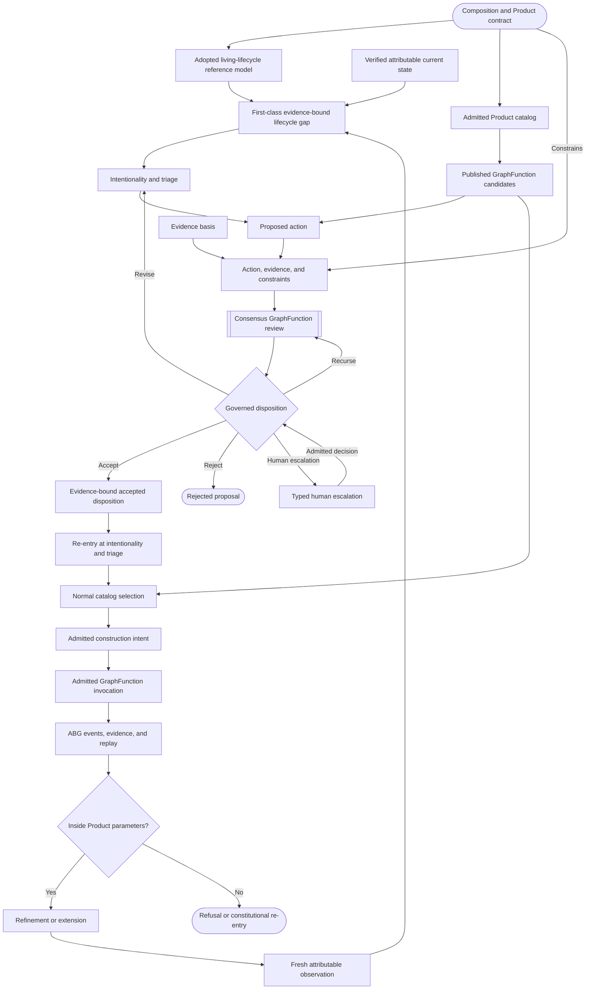
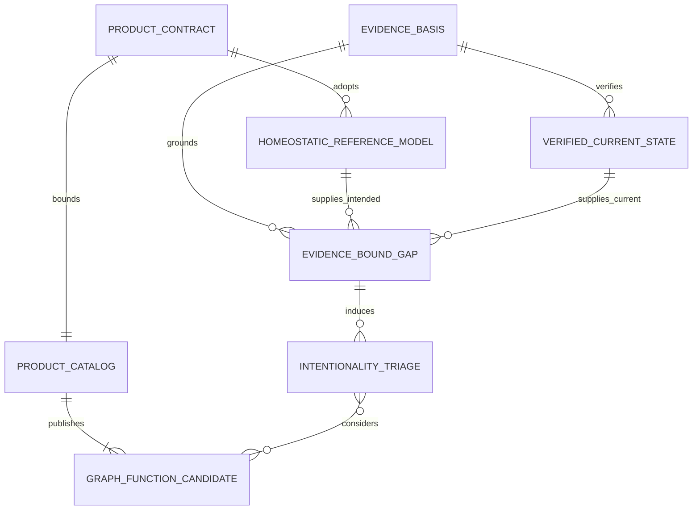
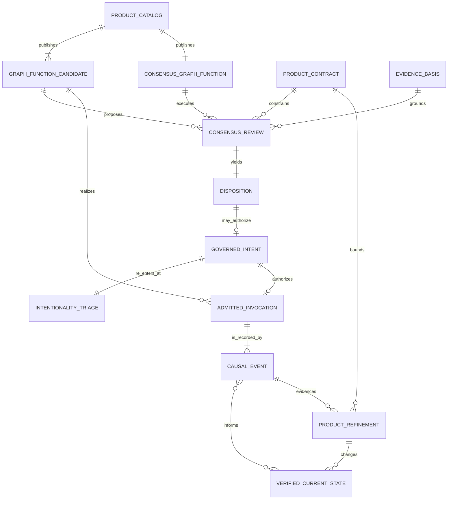

# STRATEGY: Living Four-Dimensional Product Lifecycle

**Author**: codex
**Date**: 2026-08-22T03:42:00Z
**Addresses**: the strategic relation among Product composition, homeostatic
observation, intentionality, catalog selection, Consensus, admitted execution,
and bounded Product refinement in ABIogenesis 5.0
**Status**: Open
**Reality/Target**: current constitutional concepts plus a proposed strategic
synthesis; no implementation-completeness claim
**Authority**: commentary only; this post changes no specification, design,
ticket, catalog, runtime, or release truth

## Executive Foreword

ABIogenesis 5.0 should demonstrate a living software lifecycle whose identity
exists before its activity. Composition occurs before iteration. It establishes
the Product contract: what the Product is, which constraints govern it, and
which actions it may lawfully perform. Iteration begins only inside that
declared possibility space.

The Product becomes four-dimensional when operation adds attributable change
over time. Observations expose the current state, the homeostatic gap creates
directed pressure, governance converts a proposed response into admitted
intent, and causal execution produces the evidence for the next observation.
Consensus regulates that transition as a higher-order, ordinary catalogued
GraphFunction with no executor privilege.

## Summary

The strategic loop is:

```text
composition and Product contract
  -> homeostatic model plus attributable observation
  -> gap and intentionality
  -> lawful catalog candidates
  -> Consensus disposition over action, evidence, and constraints
  -> evidence-bound re-entry at intentionality and triage
  -> admitted intent and ordinary GraphFunction invocation
  -> events, replay, evidence, and fresh observation
```

Refinement and extension remain inside admitted Product parameters. A change
outside those parameters is a refusal or constitutional re-entry, not
self-authorized evolution.

The central proposal is reflexive. Once explicitly adopted into Product
authority, this living-lifecycle model can itself become ABIogenesis 5.0's
homeostatic reference model. The difference between that intended model and a
verified current-state observation becomes a first-class, evidence-bound gap.
That gap supplies governed intentional pressure for the same triage, catalog,
Consensus, intent-admission, and invocation path described here.

## Analysis

### Current Reality And Target Direction

Current accepted authority already defines the main constitutional relations:

- `specification/PRODUCT.md` defines GTL composition, the four One Surface
  semantic authorities, ordinary catalogued Consensus, and ABG-owned runtime
  truth.
- `REQ-R-ABG3-FPC-001` through `REQ-R-ABG3-FPC-009` separate model synthesis,
  observation, gap evaluation, action-catalog projection, next-action
  evaluation, ConstructionIntent admission, invocation, evidence, and replay.
- `REQ-P-CATALOG-007` makes GraphFunction the sole public named callable
  catalog kind.
- `REQ-P-CONSENSUS-009` through `REQ-P-CONSENSUS-012` require Consensus to use
  ordinary GTL, HoG, ABG, and triage boundaries and prohibit it from owning a
  second loop, ticket mutation, or governance truth.
- `REQ-L-GTL3-GRAPHFUNCTION-008` and
  `REQ-L-GTL3-GRAPHFUNCTION-REFINEMENT-001` through `-006` bound internal
  refinement by stable outer contracts, declared authority, typed wiring, and
  admitted foldback.

This post proposes one strategic interpretation of those relations. It does
not assert that the current working tree realizes the complete lifecycle, that
the disposition words below are current serialized contract values, or that
Product self-extension is already implemented.

### The Four Dimensions

| Dimension | Strategic meaning |
| --- | --- |
| Product contract | Composition fixes identity, constraints, permitted behavior, publication, policy, and proof boundaries before iteration. |
| Homeostatic state | An adopted, versioned living-lifecycle model supplies the target relation; attributable observations and replay describe verified current operation. |
| Intentionality | The admitted gap creates directed pressure. Triage and evaluation bind that pressure to lawful candidate actions. |
| Causal time | Admitted intent, invocation, events, evidence, replay, and refreshed observation preserve why the Product changed and what may happen next. |

The homeostatic gap is not execution authority. It is the reason to evaluate a
next action. A candidate next action is not governed intent. A governed intent
is not an invocation. Keeping those boundaries distinct preserves attribution
and prevents a projector, evaluator, worker, or Consensus result from becoming
a hidden controller.

### The Lifecycle Model As Homeostatic Reference

The strategic conclusion is that the lifecycle model can govern the work of
realizing the lifecycle. This commentary file is not that authority. After
explicit adoption and constitutional reification, its model can serve as the
versioned homeostatic reference for ABIogenesis 5.0.

Each evaluation compares two exact subjects:

- the adopted living-lifecycle reference model; and
- a verified current-state observation grounded in attributable evidence and
  replay.

Their difference should be represented as a first-class, evidence-bound
lifecycle gap. The gap should preserve the reference-model basis, observation
basis, unsatisfied relation, evidence, provenance, and lineage needed to
explain the pressure. It does not select or execute its own repair.

The lifecycle gap is the source of governed intentionality. It enters Product
gap evaluation and triage, is bound to lawful candidate actions from the
admitted catalog, and is reviewed through the ordinary Consensus GraphFunction
where policy requires. Only an accepted, evidence-bound disposition that has
re-entered triage may support normal next-action selection and ABG admission of
a ConstructionIntent and invocation.

This creates a strategic operating model for steering ABIogenesis 5.0 toward
its intended lifecycle while preserving the distinction between intended
state, verified current state, proposed action, governed intent, and admitted
runtime truth. It is not evidence that the repository already implements the
complete feedback loop.

### Lifecycle Flow



The accepted branch deliberately returns to intentionality and triage before
normal catalog selection. Consensus therefore governs the proposal-to-intent
transition without directly invoking the reviewed action. Revision returns to
the proposal basis. Recursion remains bounded Consensus work. Human escalation
returns an attributed decision through the same governed disposition boundary.

### Domain Relationship Models

The following diagrams are two bounded projections of one conceptual
relationship model. Repeated entities are shared across the projections. They
are not storage schemas or a new runtime ontology.

#### Homeostatic Reference And Intentionality



#### Governed Action And Causal Evolution



This model makes Consensus structurally ordinary. The Product catalog
publishes both candidate GraphFunctions and the Consensus GraphFunction. The
distinction is semantic role, not runtime privilege. Consensus reviews a
proposed action against evidence and Product constraints, then returns a typed
result. It does not admit governed intent, select the post-review action, emit
runtime truth, mutate Product authority, or execute the proposal.

### Disposition And Re-entry Semantics

At the strategy level, Consensus needs five intelligible dispositions:

- `accept`: the evidence supports re-entry with a governed intent basis;
- `reject`: the proposal is not admitted;
- `revise`: the proposal or its evidence must change before another review;
- `recurse`: another bounded review round is required; and
- `human escalation`: unresolved authority crosses an attributed `F_H`
  boundary.

These labels describe strategic meaning. They are not a claim that the current
Consensus schema publishes those exact enum values. Any ratification must map
them onto the existing typed ruling, round-outcome, `F_H`, re-entry, and triage
contracts without creating a rival outcome algebra.

Acceptance also remains non-executing. The accepted result and its evidence
re-enter the Product-intentionality boundary. Ordinary triage evaluates that
new basis, normal catalog selection identifies the lawful action, and ABG may
then admit one ConstructionIntent and invocation. This preserves
`REQ-P-CONSENSUS-012`: Consensus does not invoke triage automatically or admit
its own ruling as governance truth.

### Bounded Refinement And Extension

Living operation does not grant unlimited self-modification. A lawful change
must remain within the admitted Product contract:

- internal GraphFunction refinement preserves the published outer contract,
  declared target, type wiring, lineage, foldback, and parent re-evaluation;
- catalog extension preserves Product identity, publication authority,
  compatibility, policy, effects, and proof obligations;
- invocation and resulting change preserve admitted actor, basis, event,
  evidence, result, and replay identities; and
- a proposed change to Product meaning, identity, constraints, feature scope,
  or permitted behavior stops for the applicable constitutional re-entry.

This is the strategic safety property: the lifecycle can refine and extend a
Product without losing the evidence of what it was, why it acted, who or what
authorized the transition, and how the resulting state can be replayed.

## Recommended Action

Use this post as a discussion surface for the ABIogenesis 5.0 lifecycle model.
Before constitutional adoption, perform a bounded requirement reconciliation
that:

1. defines adoption, identity, versioning, and evidence binding for the
   living-lifecycle homeostatic reference and its verified-current-state gap;
2. maps the strategic disposition vocabulary to existing Consensus, One
   Surface, re-entry, and `F_H` contracts;
3. defines which proposed actions require Consensus and which remain governed
   by existing policy without it;
4. states the exact test for remaining inside admitted Product parameters; and
5. proves that accepted Consensus output can re-enter triage without a direct
   invocation, ticket mutation, second event authority, or privileged
   Consensus path.

Until that reconciliation is explicitly accepted, this model authorizes no
specification, design, ticket, implementation, or release change.
