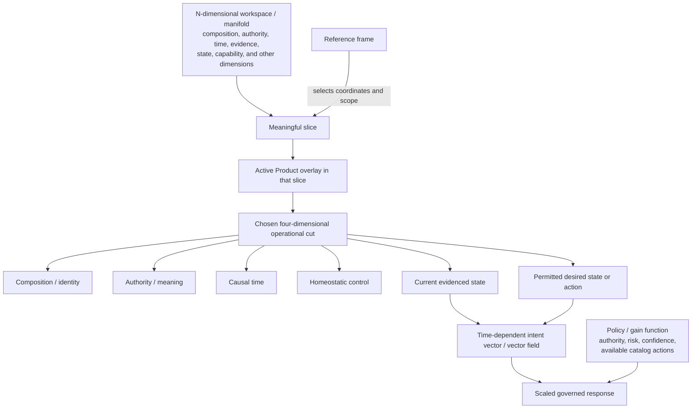

# STRATEGY: Living Product Lifecycle In An N-Dimensional Workspace

**Author**: codex
**Date**: 2026-08-22T03:42:00Z
**Updated**: 2026-08-22T04:13:17Z
**Addresses**: the strategic relation among Product composition, reference
frames, overlays, homeostatic control, intent, catalog selection, Consensus,
admitted execution, and bounded Product refinement in ABIogenesis 5.0
**Status**: Open
**Reality/Target**: current constitutional concepts plus a proposed strategic
synthesis; no end-to-end implementation-completeness claim
**Authority**: commentary only; this post changes no specification, design,
ticket, catalog, runtime, or release truth

## Executive Foreword

ABIogenesis 5.0 should be understood as a Product trajectory through an
n-dimensional workspace, or manifold, rather than as a thing with exactly four
dimensions. That larger workspace may include composition, authority, time,
evidence, state, capability, and other dimensions. A reference frame selects a
meaningful slice through it. An overlay is the active projection of the Product
in that slice.

The four-dimensional lifecycle is a chosen operational cut through that larger
workspace. Its four aspects are composition and identity, authority and
meaning, causal time, and homeostatic control. This cut makes living operation
tractable without claiming to exhaust the Product's structure.

Composition precedes operation. It establishes what the Product is and the
possibility space within which it may act. Homeostatic control then compares a
permitted reference with evidenced current state. Their gap induces directed
intent; policy scales the response; governed execution produces the evidence
for the next observation.

## Summary

The proposed strategic loop is:

```text
n-dimensional Product workspace or manifold
  -> reference frame -> meaningful slice -> active overlay
  -> four-aspect operational cut
  -> permitted reference plus evidenced observation -> homeostatic gap
  -> time-dependent intent vector or vector field
  -> admitted Product catalog -> admitted Program -> read-only ActionCatalog
  -> evaluateNext binding, eligibility filtering, and policy/gain ranking
  -> pre-effect Product-parameter gate
  -> ABG-admitted selected action or typed non-constructive outcome
  -> optional ordinary One Surface Consensus intent admission and invocation
  -> returned ruling remains evidence/input for the caller or F_H
  -> ordinary triage in a later refreshed iteration
  -> ordinary action intent admission and GraphFunction invocation
  -> declared effects, events, replay, evidence, and fresh observation
```

Intent is neither a fifth dimension nor a gain function. It is a directed,
time-dependent relation from an evidenced current state toward a permitted
desired state or action. The gain or policy function scales that response using
authority, risk, confidence, and available catalog actions without widening
authority.

Every effectful action remains inside admitted Product parameters. A proposed
change outside those parameters refuses or takes constitutional re-entry before
effects; it is not self-authorized evolution.

## Analysis

### Current Reality And Target Direction

Current accepted authority already defines the main constitutional relations:

- `specification/PRODUCT.md` defines GTL composition, the four One Surface
  semantic authorities, ordinary catalogued Consensus, and ABG-owned runtime
  truth.
- `REQ-R-ABG3-FPC-004` makes ActionCatalog a read-only projection of actions
  published by the admitted Program and narrowed catalog view, with no
  eligibility, ranking, or selection truth. `REQ-R-ABG3-FPC-005` assigns those
  decisions to `evaluateNext`; `REQ-R-ABG3-FPC-006` through `-008` separately
  assign ConstructionIntent and invocation admission to ABG.
- `REQ-P-CATALOG-007` makes GraphFunction the sole public named callable
  catalog kind, and `REQ-P-CATALOG-009A` identifies Consensus as a canonical
  SYSTEM-owned catalogued GraphFunction.
- `REQ-P-CONSENSUS-010` requires Consensus to enter through ordinary catalog
  selection inside an admitted program and One Surface intent admission.
  `REQ-P-CONSENSUS-012` prevents its result from becoming ticket mutation or
  governance truth by itself.
- `REQ-L-GTL3-GRAPHFUNCTION-008` and
  `REQ-L-GTL3-GRAPHFUNCTION-REFINEMENT-001` through `-006` bound internal
  refinement by stable outer contracts, declared authority, typed wiring, and
  admitted foldback.

This post proposes one strategic interpretation of those relations. In
particular, it does not assert that the current working tree realizes the
complete manifold model, a universal action-family classifier or ranking
engine, end-to-end Product self-extension, or the strategic disposition
vocabulary below as current serialized contract values.

### Workspace, Reference Frames, And Overlays

The workspace is the larger domain in which Product facts and relations can be
located. A reference frame establishes the coordinates, scope, and basis needed
to interpret one meaningful slice. The overlay is the active Product projection
within that slice. It does not create a second Product or a new authority.

Different frames may expose different lawful overlays over the same Product:
for example, a release frame, a runtime frame, or a capability frame. Each must
retain its exact Product, authority, evidence, and observation basis. A useful
projection cannot silently become constitutional or runtime truth.



### The Four-Dimensional Operational Cut

| Operational aspect | Strategic meaning |
| --- | --- |
| Composition / identity | Establishes what the Product is, its parts and relations, its publication identity, and its permitted possibility space before iteration. |
| Authority / meaning | Preserves who owns each claim, what declarations and actions mean, and which policy or human authority may admit a transition. |
| Causal time | Preserves the ordered lineage from intent and invocation through events, evidence, replay, correction, and refreshed state. |
| Homeostatic control | Compares a permitted reference with evidenced current state, exposes the gap, scales a lawful response, and feeds resulting evidence back into observation. |

These aspects are jointly useful, not ontologically exhaustive. Evidence,
state, capability, risk, and other dimensions remain visible in the enclosing
workspace even when the operational cut projects them through these four
aspects.

### Intent, Gain, And Catalog Selection

Intent is a time-dependent vector at the current evidenced state, or a vector
field when the permitted direction varies across the operational workspace. It
points from current evidence toward a permitted desired state or action. A gap
may induce that direction, but the gap does not select or execute its repair.

The active policy or gain function scales the proposed response. It may
attenuate, prioritize, hold, redirect, or escalate pressure based on authority,
risk, confidence, and the lawful actions currently available. It cannot make an
inadmissible action lawful, manufacture evidence, or confer execution
authority.

The proposed selection relation preserves three catalog layers:

1. the admitted Product catalog is the exact candidate universe;
2. the admitted Program publishes a read-only ActionCatalog over its actions
   and narrowed catalog view; and
3. `evaluateNext` binds the evidence-bound gap to applicable action families,
   filters ActionCatalog rows by authority, scope, preconditions, declared
   effects, and required evidence, then ranks eligible candidates under the
   active policy or gain function.

`evaluateNext` proposes at most one best-fit action or a typed non-constructive
outcome. ABG must admit that evaluator result before it becomes runtime
selection truth. Lawful non-constructive outcomes include re-entry, `F_H`, a
ticket or reprice proposal, and no action.

Consensus may itself be the ordinary GraphFunction selected when policy
requires review of the proposed best fit. It is neither mandatory nor a bypass
around the Product catalog, admitted Program, ActionCatalog, `evaluateNext`, or
ABG admission. This sequence refines the strategic interpretation of existing
boundaries; it is not a claim that ABIogenesis currently implements one
universal classifier, filter, or ranking engine.

### The Lifecycle Model As Homeostatic Reference

The lifecycle model remains unratified strategy unless a live authority surface
proves its adoption. Making it a versioned homeostatic authority requires
intake triage and explicit change classification and re-entry. Because that
would change Product shape or meaning, the likely re-entry is
`product_reprice`; if it also changes the selected work wave,
`goal_reprice` may be required. The owning intake and human authority must make
the exact classification. Requirement reconciliation cannot substitute for
that adoption.

Each evaluation compares two exact subjects:

- the adopted reference model in a declared reference frame; and
- a verified current-state observation grounded in attributable evidence and
  replay.

Their difference should be represented as a first-class, evidence-bound gap.
The gap should preserve the frame, overlay, reference-model basis, observation
basis, unsatisfied relation, evidence, provenance, and lineage needed to
explain the pressure. It supplies input to intent and evaluation; it does not
own selection, admission, invocation, or closure.

### Governed Lifecycle Flow

```mermaid
flowchart TD
    reference["Adopted reference in the selected frame"]
    observation["Verified attributable observation"]
    gap["Evidence-bound homeostatic gap"]
    intent["Time-dependent intent vector / vector field"]
    classify["Classify gap into applicable action families"]
    productCatalog["Admitted Product catalog<br/>candidate universe"]
    program["Admitted Program"]
    actionCatalog["Read-only ActionCatalog<br/>published by the admitted Program"]
    policy["Active policy / gain"]
    evaluateNext["evaluateNext binds, filters, ranks,<br/>and proposes at most one action"]
    nextCandidate["Candidate NextActionProjection"]
    parameterGate{"Inside admitted Product parameters<br/>before any effect?"}
    nextAdmission{"ABG admits evaluator result?"}
    nextKind{"Admitted next-action kind"}
    noAction["Typed non-constructive outcome<br/>re-entry | F_H | ticket/reprice | no action"]
    actionSelected["Selected ordinary GraphFunction action"]
    actionIntent["ABG admits action ConstructionIntent<br/>for the admitted Program"]
    actionInvoke["ABG admits invocation"]
    actionRun["HoG traverses selected GraphFunction"]
    consensusSelected["Policy-required review through One Surface:<br/>evaluateNext selects Consensus from the same ActionCatalog<br/>with the proposed action bound as its subject"]
    consensusIntent["ABG admits Consensus ConstructionIntent<br/>for the admitted Program"]
    consensusInvoke["ABG admits invocation of the<br/>ordinary Consensus GraphFunction"]
    consensusRun["Bounded review, recursion, and evidence"]
    roundOutcome{"Consensus round outcome"}
    ruling["Returned ruling / result<br/>evidence and input only"]
    caller["Caller or F_H authority"]
    triage["Ordinary triage in a later refreshed iteration"]
    refreshed["Fresh observation and exact next basis"]
    human["Typed F_H boundary and admitted response"]
    effects["Declared effects"]
    events["ABG events, evidence, and replay"]
    fresh["Fresh attributable observation"]
    refused["Typed refusal or constitutional re-entry"]

    reference --> gap
    observation --> gap
    gap --> intent
    intent --> classify
    productCatalog -->|"bounds callable universe"| actionCatalog
    program -->|"publishes"| actionCatalog
    classify --> evaluateNext
    actionCatalog --> evaluateNext
    policy --> evaluateNext
    evaluateNext --> nextCandidate
    nextCandidate --> parameterGate
    parameterGate -->|"No"| refused
    parameterGate -->|"Yes"| nextAdmission
    nextAdmission -->|"No"| refused
    nextAdmission -->|"Yes"| nextKind
    nextKind -->|"ordinary action"| actionSelected
    nextKind -->|"policy-required review"| consensusSelected
    nextKind -->|"non-constructive"| noAction
    actionSelected --> actionIntent
    actionIntent --> actionInvoke
    actionInvoke --> actionRun
    actionRun --> effects
    consensusSelected --> consensusIntent
    consensusIntent --> consensusInvoke
    consensusInvoke --> consensusRun
    consensusRun --> roundOutcome
    roundOutcome -->|"recurse_next_round"| consensusRun
    roundOutcome -->|"escalate_fh"| human
    roundOutcome -->|"return typed result"| ruling
    human -->|"Admitted response"| consensusRun
    ruling -.->|"evidence / input only"| triage
    caller -->|"may take ruling through"| triage
    triage --> refreshed
    refreshed --> observation
    effects --> events
    events --> fresh
    fresh --> observation
```



Everything before the Product-parameter gate is side-effect-free selection or
evaluation in this proposed model. The admitted Product catalog supplies the
candidate universe; the admitted Program publishes the read-only ActionCatalog;
`evaluateNext` alone binds, filters, ranks, and proposes runtime candidates; and
the candidate crosses the gate before ABG admits the evaluator result,
ConstructionIntent, invocation, or any other effect. The Product catalog is
never wired directly to execution.

The same pre-effect gate applies when the candidate action is Consensus. Only
when policy requires review through the ordinary One Surface path may
`evaluateNext` select the catalogued Consensus GraphFunction. ABG then admits
its Program-bound ConstructionIntent and invocation, and HoG traverses it
before it can return a result. Consensus is therefore ordinary in realization
and optional in selection.

The returned ruling is result data, not authority. It does not authorize
governed intent, triage, ConstructionIntent, invocation, ticket mutation, or
the reviewed action. Only the caller or `F_H` may take it as evidence or input
through ordinary triage in a later refreshed iteration. `evaluateNext` then
selects on the fresh basis, and ABG independently admits any resulting intent
and invocation. Bounded Consensus recursion remains inside its admitted
traversal; unresolved judgment crosses its attributed `F_H` boundary.

Agreement, dissent, bounded recursion, and human escalation are intelligible
strategic meanings, not a new enum or a claim about current serialized values.
Any ratification must map them onto the existing ruling, round-outcome, `F_H`,
re-entry, and triage contracts without creating a rival outcome algebra.

### Bounded Refinement And Extension

Living operation does not grant unlimited self-modification. Before an
effectful action, the lifecycle must determine that the proposal remains within
the admitted Product contract:

- the selected reference frame and overlay preserve Product identity and do
  not mint authority;
- internal GraphFunction refinement preserves the published outer contract,
  declared target, type wiring, lineage, foldback, and parent re-evaluation;
- catalog extension preserves Product identity, publication authority,
  compatibility, policy, effects, and proof obligations;
- invocation and resulting change preserve admitted actor, basis, event,
  evidence, result, and replay identities; and
- a proposed change to Product meaning, identity, constraints, feature scope,
  or permitted behavior refuses or stops for the applicable constitutional
  re-entry before effects.

The safety property is causal and pre-effect: the Product may refine or extend
without losing what it was, why it proposed an action, who or what authorized
it, which effects were permitted, and how the resulting state can be replayed.

## Recommended Action

Use this post only as a discussion surface for the ABIogenesis 5.0 lifecycle
model. If the proposal is pursued:

1. perform intake triage and declare the exact change classification and lawful
   re-entry, likely `product_reprice` and additionally `goal_reprice` if the
   current work-wave selection changes;
2. obtain explicit adoption in the owning live authority surface through the
   applicable human-authority boundary;
3. only then reconcile reference-frame, overlay, intent-vector, policy/gain,
   Product-catalog, ActionCatalog, `evaluateNext`, Consensus, and pre-effect
   Product-parameter semantics into requirements and design; and
4. prove that Consensus itself enters through ordinary selection,
   Program-bound ConstructionIntent admission, and invocation, while its
   returned ruling remains evidence/input for later caller- or `F_H`-driven
   triage rather than authority over the reviewed action.

Unless and until those authority steps close, this post remains unratified
strategy and authorizes no specification, design, ticket, implementation, or
release change.
