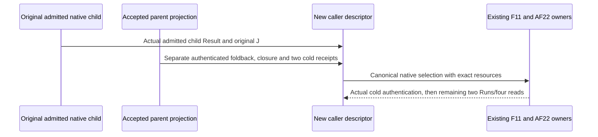

# Runtime10 cold-consumer Root triage

Runtime10 is CLOSED NO_GO. Independent review is1715B/08f5d3c…; Root verified all six review files60792B. No new calls/Runs/reads/actors/append. Original accepted parent/J/two reads and genuine closed resource remain conserved.

| Material frame | Origin and selected scope |
| --- | --- |
| Product/framework | A judgment selection must authenticate the actual native assessment producer. Parent terminal and admitted child Result have distinct coordinates despite equal J value. Framework schemas permit selection of the original admitted child. |
| Design/realization | Actual graphOwner uses the three-argument opened-carrier projection; workflow reconstruction requires sourceCursor and graphFunction. This prevents the selected parent owner from reaching the authenticated fold loop. Existing HOW realization has a parent-alias gap. |
| Identity/lifecycle | Child Result81110a32… retains parent Program and invocation admission1777212b…; actual assess graph/locus matches Task/plan. Parent Resultd2627b4f…, J921cd358…, foldback, closures and two cold reads remain exact companion evidence. |
| Proof/cost/effects | Previous checks conserved J/evidence but did not execute its native cold selection. Runtime10 completed owner establishment, then original cold consumer returned null before dispatch. Original one Run/two reads survive; no fake completion or population trimming. |
| Reuse/applicability | Smallest current reentry is external realization_refactor selecting the original admitted child Result, with parent/foldback retained and fresh dependent identities. Full child cold pass is unknown. Direct parent-alias support is a separate existing-HOW realization gap; whether a required RC claim needs it remains an explicit applicability obligation. |

Root's initial raw-kind missing-parent hypothesis is withdrawn: authenticated body-reference records carry the parent Result and child basis. The canonical native decoder owns those events. Raw top-level kind scans do not establish admitted populations.

Existing HOW6 already names actual assessment CCall, root/child basis and foldback. No new WHAT, framework interface/schema/export or Source increment is selected for the child route. Do not modify the immutable original parent proof descriptor. Construct one derived caller descriptor backed by actual original child admission; preserve original J/terminal/Task/plan/resource/parent evidence. Recompute dependent caller input identities through the existing framework.

First actual failure freezes. No source patch, parent/actor repetition or broader alias expansion follows without separate material triage/grant. Entire RC qualification remains open.
