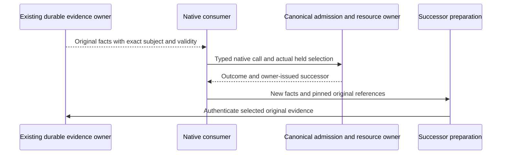

# Library closure Executive record

Documentary Writer T287_LIBRARY_CLOSURE_CONTROLS_WRITER_01 is CLOSED_DOCUMENTS_ONLY; Root returns to Executive. Source and proof grants are separately declared. Target design accepted; G1-G6 end-to-end closures remain open. Closed Worker, Reviewer and Executive dispositions will be recorded here under a separate recording activation.

## Bounded Source assurance activation record

Root Executive verified G1 830 and G3 746 frozen body/mode records without mismatch; both producer Workers are CLOSED. Root explicitly transitions Executive -> documentary Writer under T287_G1_G3_ASSURANCE_RECORD_WRITER_01 solely to append these zero-effect Reviewer assignments and preservation evidence to this existing return.md, within the original control territory. No Code, candidate, prior evidence or runtime effect.

G1 actual preimage loss reproduced, isolated compile/four focused tests passed; Source/component authored cut is ready for independent assurance. G3's three negatives now reach the intended guards; Source/body-reference positive and disclosed counterfactual lower premises retain their bounded scope. Installed/genuine qualification remains open.

### T287_G1_SOURCE_CONSERVATION_ASSURANCE_01

Product frame and Reviewer activation
Fixed fifteen-family ABG5/GOAL-035/T-287; STDO2.5.1RC2 manifest 3d860ff4c1746f06ac25295a9e205cffb8e7725869615ac77cf2304b70ff2782. Reconstruct owning Product/requirements before HOW/code, under repo://abiogenesis/build_tenants/abiogenesis/typescript/design/ABI5_PROJECT_REFERENCE_FRAME_BASIS.md#f-end-to-end-interface-integration. Target accepted 7e8b887eaf0c73187cdfdb72ec157500ef5ca383087a69c5242cf4590efe3cd4. No rival runtime/checker, changed WHAT or weakened guard. Root remains Executive; producer Workers are CLOSED and stopped. Executive activates you as zero-write Reviewer after your CLOSED G3 Worker. You did not author the G1 Source/test changes. Selected F11 finding conservation under SELF005/007A and native HOW136; Source aggregation is a pure evaluator relation, not admission/release authority.

Exact subject
G1 freeze /Users/jim/src/apps/abiogenesis/.ai-workspace/comments/codex/20260928_FRAMED_GOVERNANCE/g1-self-conformance-conservation-01/freeze.json 171217B/8dd2269955829b3e5d2b62f6f3540896c31bb074bf570019e80b75b6957da730; Source29339B/5183bce7a986462eb2d924fdd288cef23439dc72811f4047f3d964a286e46537; scopes test43068B/a1e00db17056aebcd22186acdc87d2bd7d68985889d4572d81d0eedfdc85b051. All 830 frozen records were Root verified. Source/test preimages, exact old failure and 4 focused tests/compile/managed closures are inside the frozen territory.

Frame and purpose
Independently inspect actual typed source→matching rows→F11 findings/whole result→native F11 projection/sole AF22, with identity/effect and Proof frames. Ensure failure/citation survive missing roots while missing obligations remain explicit, partial satisfied/inapplicable/unknown cannot pass, duplicate/competing matching logic and old complete behavior remain correct. Conjoin actual supported fields, not section presence.

Permitted effects
ZERO WRITES/imports/build/tests/Runtime/provider/pack/install/Git/release. Read only exact frozen postimages, canonical contracts and material downstream owners/receipts. Do not review or accept your own G3 increment in this operation; no repair or further actor activation.

Evidence
Check the preimage counterexample, actual callback/evaluator harness premises, strict compile, four test assertions and process closures. Verify mode/body pins and compare authored diff. Identify if changed finding multiplicity/surfaceRefs affects real native readers or reducer; distinction between known failure and unresolved support must hold end to end.

Stops
Stop on exact subject drift, unowned semantics or needed effect. No broad hardening/whole-Product survey. Report any material counterexample with owning violated relation, affected sunny-day scope, smallest lawful re-entry and reproof; preserve existing accepted evidence.

Closed return
Return CLOSED GO/NO_GO for Source/component only, exact unchanged subject and zero effects. Independently state contract/implementation/component-proof results and still-open installed F11→AF22/fresh read and genuine semantic proof. Root alone accepts and selects successor.

### T287_G3_NATIVE_PARENT_SOURCE_ASSURANCE_01

Product frame and Reviewer activation
Fixed fifteen-family ABG5/GOAL-035/T-287; STDO2.5.1RC2 manifest 3d860ff4c1746f06ac25295a9e205cffb8e7725869615ac77cf2304b70ff2782. Reconstruct owning Product/requirements before HOW/code, under repo://abiogenesis/build_tenants/abiogenesis/typescript/design/ABI5_PROJECT_REFERENCE_FRAME_BASIS.md#f-end-to-end-interface-integration. Target accepted 7e8b887eaf0c73187cdfdb72ec157500ef5ca383087a69c5242cf4590efe3cd4. No rival runtime/checker, changed WHAT or weakened guard. Root remains Executive; producer Workers are CLOSED and stopped. Executive activates you as zero-write Reviewer after your CLOSED G1 Worker. You did not author the G3 test or native parent Source increment. Selected F10/F11/F15 supported alias reconstruction under native HOW120-126/249; original producer remains unique/current.

Exact subject
G3 freeze /Users/jim/src/apps/abiogenesis/.ai-workspace/comments/codex/20260928_FRAMED_GOVERNANCE/g3-parent-alias-fixture-01/freeze.json 170192B/153a3eced2061acbb7b32c96904ad791d667186dcd4e3121fb4a9dbc80262e2c; parent test15438B/4e6ce1f8049017be0d480d71052bf4066e5c8c0fda669f3cd2611df250c179f8; production Source qualification_proof.ts82284B/b928caefff4aa9bbd5e3e0d6fdb65f4a9617d54b3df817df287975825d36c9e5 unchanged by this test continuation. Review also the existing unaccepted native parent Source increment from rc1-parent-alias-owner-repair-01, with its real preimage/positive and exact reused emitted stage.

Frame and purpose
Evaluate canonical prefix/cursor/CCall/GraphFunction→parent/direct original Result/J→foldback/currentness/uniqueness. The current reader imports the actual opened-CCall traversal cursor and exact reconstructed published GraphFunction; verify actual source producer-consumer contract rather than guessed coordinates. Locate each negative's entry/preconditions/intended guard, including immutable snapshot and causality. Preserve source/result/resources/currentness checks.

Permitted effects
ZERO WRITES/imports/build/tests/Runtime/native/provider/package/Git/release/actor effects. Read selected production/preimage Source, actual retained event/body-reference evidence, frozen stage reuse proof and exact test/receipts. Do not review or accept your own G1 increment; no repair.

Evidence and bounds
Root verified all 746 frozen records. One focused check passed; no new compile, earlier exact compile reused. All three negatives show canonical prefix selection and parent-state reconstruction before null at intended missing foldback/crossed graph-call/exact child Result guards. Test arrays supply counterfactual lower reads, declaration lookup and competing-producer admission; independently verify these disclosures and that actual owners/guards are not bypassed. Do not call this new native history/admission or semantic qualification.

Stops
Stop on drift, invalid fixture attribution, hidden guard replacement, unsupported Source semantics or needed effect. No complete scenario/native campaign. A remaining material counterexample returns originating relation, downstream symptoms, scope and bounded lawful repair.

Closed return
Return CLOSED GO/NO_GO for this native Source readiness and component boundary coverage, with exact pins, independently reacquired Product frame and zero effects. Installed successor direct/parent J/F11/AF22/cold proof remains separate. Root alone accepts/conjoins/releases.

Documentary Writer T287_G1_G3_ASSURANCE_RECORD_WRITER_01 CLOSED_DOCUMENTS_ONLY; Root returns to Executive before Reviewer activation. Reviewer closures/Executive disposition will be appended only under a separately declared recording effect.

## Closed Source acceptance and owning publication re-entry

Root explicitly activates documentary Writer T287_G1_G3_ACCEPTANCE_G2_DESIGN_SELECTION_RECORD_01 for this appendix, new g2-pins.json and three advisory grants in this directory, T-287 current fields and one Goals paragraph only. Source/candidate/Runtime/Product/Git/sibling mutation is excluded.

Executive adjudication: G1 independent Reviewer T287_G1_SOURCE_CONSERVATION_ASSURANCE_01 is CLOSED GO_SOURCE_COMPONENT_ONLY; G3 independent Reviewer T287_G3_NATIVE_PARENT_SOURCE_ASSURANCE_01 is CLOSED GO for native Source readiness/component boundary coverage. Root accepts those exact bounded Source/component claims. G1 preserves failed available judgments and original J citations alongside missing support. G3 reconstructs the exact canonical cursor/GraphFunction and authentic parent-to-original-child Result/J alias without weakening admission/currentness/uniqueness. Root verified all 830 G1 and 746 G3 frozen body/mode records, zero mismatch. Both reviewers made zero writes or execution effects, and neither assessed their own authored repair.

G1 freeze171217B/8dd2269955829b3e5d2b62f6f3540896c31bb074bf570019e80b75b6957da730; Source29339B/5183bce7a986462eb2d924fdd288cef23439dc72811f4047f3d964a286e46537; test43068B/a1e00db17056aebcd22186acdc87d2bd7d68985889d4572d81d0eedfdc85b051. G3 freeze170192B/153a3eced2061acbb7b32c96904ad791d667186dcd4e3121fb4a9dbc80262e2c; owner82284B/b928caefff4aa9bbd5e3e0d6fdb65f4a9617d54b3df817df287975825d36c9e5; test15438B/4e6ce1f8049017be0d480d71052bf4066e5c8c0fda669f3cd2611df250c179f8. The component harnesses supply lower resolved-J/lookup/counterfactual-admission premises; they establish neither new native history nor semantic qualification. Installed successor J->F11->AF22->cold-read conservation remains OPEN.

G2 advisory mapping T287_G2_PUBLICATION_OWNER_MAPPING_01 and closed-pinset return T287_G2_CLOSED_PINSET_RETURN_01 are CLOSED with zero effects. Root reacquired the 60 pinned paths: 7,791,208 body bytes; sorted compact key-sorted array13,311B/de8ceb0fb1dbd16c77e078839c6aa55ce834ad03e8b316b5d6557f3cb474325c, no drift. g2-pins.json preserves those material reads. The current61-row catalog has19/44 required PUBLIC006A asset identities,25missing; all19present resolve actual asset/pointer hashes. All8 PUBLIC005 group addresses are absent. Honest generator mandatory-gap diagnostics, exact packing and self-agreement are not complete publication evidence.

Triangulation: Product already requires the groups, named APIs and assets; WHAT stays fixed. Design locates the existing reusable framework/library but leaves several required native/serialized projections unsettled. Integration selects insufficient publication inputs. Identity validates existing rows without establishing absent mandatory identities. Proof checked agreement of generated subsets rather than the independent required population. The recurring cause is a missing/unused complete owner-to-publication design relation, not a demonstrated need to change ABG calculus. Root selects design_reframe at the existing M01/M02/M03/M04/M05 Public projection HOW; raw language admission/serialization and runtime/install/release carrier choices require closed owner bindings before implementation. Existing canonical schemas/types remain the source; related candidates, admitted objects, logical events, physical envelopes and replay projections must not be conflated.

New zero-effect grants, rendered by the installed a_c text join, are recorded here:
- g2-gtl-design-grant.txt: T287_G2_GTL_SERIALIZATION_DESIGN_01, GTL language/admission/serialization/conformance/vocabulary/corpus.
- g2-runtime-design-grant.txt: T287_G2_NATIVE_CARRIER_PROJECTION_DESIGN_01, Product/runtime/install/release serialized owner bindings.
- successor-readiness-grant.txt: T287_G1_G3_EARLIEST_INSTALLED_COMPOSITION_READINESS_01, proof/effect readiness of the earliest installed G1/G3 composition.

Evidence sequencing goal_reprice preserves the fixed Product: examine whether a bounded exact successor can prove G1/G3 end to end while G2 HOW is resolved. Such a witness is not the final qualifying candidate; no construction/preparation/Runtime effect is granted by this advisory selection. Native partial support must use a valid partial plan with authentic J for every declared slot; an unresolved declared slot yields null and misses the changed fold.

G4 genuine independent judgment/context sufficiency, G5 complete positive/seven actual mutants/restoration and G6 exact qualification remain OPEN. The current read-only unauthenticated Anthropic probe failed DNS before authentication; no loss of login is established and no bypass/retry is authorized. Local design and implementation work continues.

Documentary Writer T287_G1_G3_ACCEPTANCE_G2_DESIGN_SELECTION_RECORD_01 CLOSED_DOCUMENTS_ONLY. Root returns to Executive before activating the recorded advisory Workers.

## Implementation selected from accepted HOW

Root Executive accepts the CLOSED G2 GTL advisory's existing-owner eight-facade constructability only. Missing strict GTL carrier admission/conformance-input/diagnostic/repair/corpus semantics remain a distinct owning HOW gap; rawAdmitValue<S> kind/canonical checks do not supply structural type admission. The proposed paired API aggregate can use existing nativeTypedLocator semantics after owning HOW adoption. No unknown API/schema or placeholder is authorized now.

Root selects T287_G2_EXISTING_OWNER_GROUP_REALIZATION_01 under g2-source-grant.txt: actual eight facades, package exports and native catalog rows from the accepted reusable-library target/current canonical owners. This is Code tied to sufficient existing HOW, not complete PUBLIC005/006A acceptance. Existing contract identities and required missing-content diagnostic remain. Strict isolated compile and exact packed-consumer export/declaration/catalog proof follow; no native Runtime.

CLOSED readiness T287_G1_G3_EARLIEST_INSTALLED_COMPOSITION_READINESS_01 establishes no new native HOW gap for the selected mechanical path. Root selects T287_G1_G3_C10_CONSTRUCTION_01 under c10-construction-grant.txt: exact immutable C09 successor with independently accepted G1/G3 Source and separately enumerated accepted authority differences, excluding evolving G2 Source/drafts. A valid partial unscoped one-slot plan will later create fresh controlled current-subject J, A=falsified/B=uncovered -> F11 failed with original J citation plus missing obligation -> soleAF22red/releasefalse -> cold reads. Predecessor J cannot authenticate C10 subject. Three native Runs/six reads are a proposed later discriminator, not this construction grant. Controlled native evidence is mechanical; genuine semantic qualification remains separate.

Root transitions Executive -> documentary Writer T287_G2_SOURCE_C10_CONSTRUCTION_RECORD_01 only to record the two grants/this selection and T-287 activation fields. Documentary Writer is CLOSED; Root returns Executive before these Worker activations. Source Worker and construction Worker freeze/stop independently; Root assigns assurance. Original accepted Hello/Rust/C09/evidence and unrelated dirty Source remain.

## Eight-group Code acceptance and installed proof selection

Root Executive accepts CLOSED T287_G2_EIGHT_GROUP_SOURCE_ASSURANCE_01 GO_SOURCE_COMPONENT_ONLY: eleven authored Source subjects implement eight static canonical-owner facades, exact package exports and fresh native declaration/catalog locators. Root verified all 13,404 files/266,868,401 B and 1,251 directories including root; independent Reviewer verified all 5,276 archive bodies/modes and reproduces Product/catalog digests. Sixty-one extant catalog identities and seven exports are conserved; 69 rows now include all eight required group addresses. Four actual managed payloads passed once, three source-blind consumer tests include missing-group/crossed-locator/altered-digest negatives. Group content, named APIs and 25 required assets remain incomplete; no installed or semantic qualification credit. g2-eight-group-source-acceptance.json records the exact bounded adjudication.

G2 report refusal was a proof-consumer literal assumption: finalizer expected TAP prefix while the actual frozen Node producer emitted its spec-reporter summary. Product/Design outcomes and Source remain supported; exact receipt/3-pass stdout and independent review supersede the guessed prefix. Retire that consumer assumption, retain the refusal, repeat no payload.

C10 first construction assurance rejected complete effect-cut closure only. The finalize.py selector excluded final-tmp; frozen npm enables its compile cache under the owned TMPDIR. This is a proof census-selection miss, with no demonstrated Code/Product payload failure. External T287_C10_EFFECT_CENSUS_SUPPLEMENT_01 is CLOSED: original C10 unchanged, all 16,362 actual file/link members/538,415,091 B and 1,940 directories accounted, including 593 scratch files/2,934,900 B/all0600, sixteen already-nested archives and original freeze-self. Root verified all thirteen supplemental records and the complete actual C10 membership/body/link/mode/directory census. Inherited NODE_COMPILE_CACHE and timing influence stay unknown; cache-independent reproducibility was not proved. No rebuild/install/cache deletion or payload retry occurred. Resumed T287_C10_CONSTRUCTION_ASSURANCE_CONTINUATION_02 evaluates the remaining native/archive/wrapper/publication joins before Setup10; construction acceptance is pending.

Root's read-only verification also exposed an assumption at its proof consumer: it initially omitted the explicit root-dot directory in G2 and treated the C10 directory census wrapper as a bare array. The actual producers respectively include root-dot and {rootMode,directories}. Reacquiring those bodies corrected the read-only checks; all actual subject hashes/membership remain supported. Across Design, integration and Proof this is the same caller-contract-guess pattern. Required re-entry is the proof caller, with actual producer shape read before conjunction; no framework contract or Code change follows. These failures remain recorded instead of being hidden as new Product defects.

Root selected compact proposed current GTL serialization/conformance/publication HOW under T287_G2_GTL_CURRENT_HOW_01. It binds the required native APIs/schema/corpus to current canonical owner definitions. Historical Module inventories and generic raw casts cannot substitute. The separately recorded Writer grant confines one current scaffold and private evidence; no Code/Runtime is authorized by that draft. Owning missing installer/event/release content remains explicit. G1/G3 installed failure/citation/parent propagation, G4 genuine assessment, G5 seven actual defects and G6 exact qualification/release remain open.

Root documentary Writer T287_G2_ACCEPTANCE_C10_CENSUS_CONTINUATION_RECORD_WRITER_01 records these decisions/grants and current work fields only; no candidate or runtime effect. Writer CLOSED_DOCUMENTS_ONLY; Root returns Executive.

## C10 construction accepted; actual Setup10 selected

T287_C10_CONSTRUCTION_ASSURANCE_CONTINUATION_02 is CLOSED GO_CONSTRUCTION_ONLY. Root Executive conjoins the unchanged original freeze with the complete external effect supplement and accepts bounded C10 construction. All 61 catalog rows, 11 current publication bindings/raw validators, 37 native declarations, 307 declaration plus two schema required bodies and 16 capability rows/196 current owner coordinates agree. Original incomplete scratch-census claim remains rejected; the separately pinned supplement repairs effect accounting without changing the Product. Native installation and proof remain open. c10-construction-review-record.md is Root documentary capture of the actual Reviewer return, not a Reviewer-authored file.

Root selects T287_G1_G3_C10_INSTALLED_SETUP_10 for Runtime Worker /root/rc1_c03_install_review under c10-setup-grant.txt, concrete c10-construction-acceptance.json and c10-setup-operation-basis.json. Exactly one reused 14-call ordinary setup installs/admit/binds/catalogs current C10 plus unchanged wrapper and checks four Programs in the new confined Setup10 territory. No Task/Run/helper/provider/qualification/release call. Current-input preparation and three-Run/six-read whole-path proof remain distinct later grants. Eight-group Source remains separately accepted; proposed current GTL HOW is CLOSED awaiting independent Design assurance/adoption.

Documentary Writer T287_C10_CONSTRUCTION_ACCEPTANCE_SETUP_SELECTION_RECORD_01 CLOSED_DOCUMENTS_ONLY; Root returns Executive before Setup Worker activation.

## Current GTL core Code and storage correction

Root accepts the independently reviewed current GTL core HOW and selects the exact fifteen-path Code increment under `T287_G2_GTL_CORE_REALIZATION_01`. Required canonical admission, serialization, schemas, API pairs and fixed corpus use the existing framework owners. Four unresolved drift repair mappings and other mandatory content remain open. The operative grant is in `.ai-workspace/work/T287_G2_GTL_CORE_REALIZATION_01/controls/code-grant.txt`; retained proof is in the corresponding `.ai-workspace/evidence/` territory. Comments are permanent commentary, not working storage. No historical evidence is relocated by this decision. Actual Setup10 passed all14Public calls, two admitted installs and four Program conformances; independent assurance is active. Source and native whole-path proof remain distinct.

## Transformation scaffold applied to current increments, 2026-10-04

Root Executive adopts the practical constraints from 20261004_TRANSFORMATION_CALCULUS_FOR_ABG_CONSISTENCY_AND_COMPLEXITY.md (9892B, SHA25669497cf680a2e2c4601381bc69950eccd2e12284042278171799029fd2f20dd2) within the existing accepted library target and GTL core HOW. The category/HoG-monad interpretation remains a proposal. T287_TRANSFORMATION_SCAFFOLD_G2_ADVISORY_01 and T287_TRANSFORMATION_SCAFFOLD_INSTALLED_ADVISORY_01 are CLOSED read-only advisory returns, not Code or qualification acceptance. The former is author constructability advice.

Recording activation T287_TRANSFORMATION_SCAFFOLD_RECORD_01: Root Executive -> Writer for this one append to this return.md only, preimage SHA256db5435e69464dc87b0cc867e42e835e05c76dd6366db16f2ccafbd1677502cc6. This is a work-constraint projection within unchanged WHAT/HOW. Root returns Executive after verified recording. Preserve all existing record bytes and all other files; this recording grants no Source or Runtime effects.

Every successor grant uses the existing UML and names: consumes; produces and its standing; preserves; may change; effect owner/territory; valid while; observable acceptance and nearest negative; relevant cost evidence. These are concise constraints in the existing carrier, not a new scaffold schema or mechanism.

G2: the canonical predicate -> serialized schema join is the observed failure. The current core continuation is CLOSED: strict compilation passed, manifest generation refused flagged environment regexes, and pack/corpus/consumer proof did not run. Existing HOW suffices. The proposed correction cone is gtl/stdo_run_environment.ts plus the existing focused serialization/publication test. Preserve the existing nonempty-reference denotation, digest/tag meaning, relative-path segment law, optional declarations and original-carrier identity. Consume the canonical digest owner and define projectable path/tag predicates at their current owner. Complete nested lifecycle/handoff structure retains its separate native relational predicates; published structural validity cannot mint local admission, whole-Program conformance or native C standing. Acceptance requires actual generated-schema checking and extracted-package native/API/roundtrip/declaration/catalog joins, including malformed paths, crossed stage bindings, duplicates and invalid content policy. The wider Public-content and qualification gaps remain open.

G1/G3: the next installed discriminator consumes authentic current-C10 J through the actual direct/parent producer and resource owners. Every planned slot has authentic J so aggregation is reached; A's known failure and original citations survive while B remains uncovered. F11 retains both the failure and missing obligation; sole AF22 remains non-green; fresh result/replay agree at the same committed boundary. A controlled judgment proves conservation only. Exact subject/basis/access/currentness invalidation remains binding. Future effects use their granted work/evidence territory; historical resource identity cannot be relocated by copying.

Cost: fourteen Setup10 authorization files total197565353B versus2498379B of admitted events. One authorization's compact ownerArtifact.verified is12374769B, including9746944B native declaration evidence and2233372B Public contracts. ordinary-caller.mjs39-43 records that verified owner repeatedly. This locates diagnostic copying, distinct from F11 material/partition expansion; it does not attribute runtime time/RSS or establish a reduction. The smallest proposed normalization is one immutable verified-owner report body with bound per-call references, while retaining the native invocation contract. Record fixed-input, fixed-output conservation and before/after bytes/work/RSS by phase; cold access and necessary prefix reconstruction remain explicit. Added unrelated, unselected bodies must not drive ordinary handoff work without a named dependency. No reduction or genuine semantic qualification is accepted by this read/adoption.

## Environment-owner repair selected, 2026-10-05

Owner requested start of the repair. Root Executive selects T287_G2_ENVIRONMENT_SCHEMA_REPAIR_01 under unchanged WHAT and accepted GTL core HOW. Native owner predicate -> serialized projection is the violated relation; current compiler success did not prove publication. The complete nested cone and preserved native/refusal/optional/lineage meanings are bound in the operative .ai-workspace/work/T287_G2_ENVIRONMENT_SCHEMA_REPAIR_01/controls/code-grant.md. Only stdo_run_environment.ts and the existing focused serialization/publication test are Source-writable. Fourteen other core postimages and accepted historical cuts remain unchanged; whole core packaged proof follows. First material integration failure returns to Root triangulation before another repair. Independent frozen-cut assurance remains separate; no installed/genuine/RC1 credit is claimed.

Root Writer activation T287_G2_ENVIRONMENT_SCHEMA_REPAIR_01_GRANT_WRITER_01 records only the two-file Worker grant, exact preimages and this current selection in T-287/GOALS/current closure record, with private controls/work and retained evidence storage. Recording is CLOSED_DOCUMENTARY_ONLY after conservation verification; Root returns Executive before Worker activation.

## Physical staging continuation selected, 2026-10-05

Root Executive conjoins CLOSED environment repair and independent staging triage. Strict compile passed6.357s; complete structural schema was emitted; manifest failed at unchanged generator424 because private node_modules resolved to the donor physical root. Pack and focused checks did not run. Compiler accessibility was mistaken for exact package ownership; the correct guard exposes the preparation relation, not a demonstrated Source defect. All16 Source rows and2511 retained records/193directories verify. Original failure remains frozen434b7ddcff2da1b4948de069e000c4f2d00d487012b822a42bf83d3d1e2ceee1.

Root selects T287_G2_BUNDLE_STAGE_CONTINUATION_01 as realization_refactor of private staging only. Source writes NONE. Acquire the complete thirteen-package locked physical closure in a new stage; retain exact Source/dependency bodies and prove compiler-input/emitted-output correspondence before reusing compile evidence. Resume manifest, actual offline pack and source-blind schema/native/API/declaration/catalog/roundtrip/corpus proof. The operative Worker grant and bounded triage capture live in .ai-workspace/work/T287_G2_BUNDLE_STAGE_CONTINUATION_01/controls/. Independent Source/component/package assurance follows the CLOSED successful frozen cut. No installed, genuine assessment or RC1 credit follows.

Root Writer T287_G2_BUNDLE_STAGE_CONTINUATION_01_GRANT_WRITER_01 records only these controls and current T-287/GOALS/closure selection. CLOSED_DOCUMENTARY_ONLY after verification; Root returns Executive before Worker activation.

## Canonical tuple and proof-caller repair selected, 2026-10-05

Root Executive conjoins CLOSED package cut077583b94db03bf417409df113e30289c582c063ff931e21103ada8fea89b8ff and independent T287_G2_PACKAGED_FAILURE_TRIAGE_01. New physical closure/resolution and compiler reuse, manifest, offline pack and extraction passed. Focused proof6pass4fail has two originating relations: three canonical v.tuple definitions accept tails inconsistent with fixed native/event/authority shapes, and proof declaration selection omits five .d.cts/.d.mts bodies needed by the closed resolver. Draft2020 open-prefix syntax is valid; its strict checker refusal exposes the owner denotation mismatch. The resolver correctly refuses incomplete caller inputs; the precise first internal branch remains uninstrumented. Correct both owners, preserve both guards and original evidence.

Root selects T287_G2_CLOSED_TUPLE_PROOF_CONSUMER_REPAIR_01 as realization_refactor with existing HOW. Source writes exactly serialization_contracts.ts and the existing serialization/publication proof. Close the three tuples at their canonical definition; make the caller consume the complete producer declaration family; add meaningful arity/order/tail and population correspondence evidence. All14 other Source postimages remain. Source changes invalidate affected compiled/schema/declaration/catalog/Product/archive proof; recompile and recompute the bounded complete package once. Physical-stage ownership and six passing original tests retain original-cut standing. Actual installed/G1/G3/F11/AF22/RC1 remain open.

Root Writer T287_G2_CLOSED_TUPLE_PROOF_CONSUMER_REPAIR_01_GRANT_WRITER_01 records only this selection/grant/preimages in new controls and T-287/GOALS/current closure. CLOSED_DOCUMENTARY_ONLY after conservation verification; Root returns Executive before Worker activation.

## Imported canonical assembly cone repaired by selection, 2026-10-05

Root Executive conjoins CLOSED cut10784258ecbb30175673eda17184c088589ba450b98b917adf7f4f7edeebbb10 and independent complete-cone triage. Compile/manifest/pack/extraction passed; focused6pass5fail all reach one imported eight-section semantic_stage owner. Earlier three exact tuples now emit closed schemas; complete declaration inputs yield nonnull and50nativeinventory/namejoins. Current authored tuple negatives remain blocked by Modulechecker. Root verifies13509files/1288dirs/fullmembership/current16postimages; original failure is preserved.

Prior triage/Executive scope selected directly visible definitions and omitted their imported owner. Complete schema census now covers23tuple nodes:11closed and12open, the latter allone stage definition reused by2policies/2lifecyclefamilies/3containingdefinitions. Native type declares exact8 while predicate/constructor retain tails. Existing HOW is sufficient. Root selects T287_G2_SEMANTIC_ASSEMBLY_TUPLE_REPAIR_01 realization_refactor: semantic_stage.ts and existing proof only; Source subject17paths; preserve priorSource corrections/fifteen other bodies. Recompute affected package identities and compile allfourselectedschemas pluscorpus throughactualAjvstrict before individualcases, with fulltuplecensus and meaningful eight-section conservation/refusal. Otherloose tupleowners outsidethiscone remain in widerPublic-content/qualification scope; no globalpatch authorized.

Root read-only postimage verifier initially assumed an object; actual producer is a16rowarray. Corrected reader verified allSource pins without mutation. Documentary Writer T287_G2_SEMANTIC_ASSEMBLY_TUPLE_REPAIR_01_GRANT_WRITER_01 records exact grant/triage/pins/preimages and these threecurrent surfaces only; CLOSED_DOCUMENTARY_ONLY; Root returns Executive before Worker effects. Installed/genuine/RC1 acceptance remains open.

## GTL core Source/component/package accepted, 2026-10-05

Root Executive accepts `T287_G2_SEMANTIC_ASSEMBLY_TUPLE_REPAIR_01` after CLOSED author readiness, independent `T287_G2_GTL_CORE_PACKAGE_ASSURANCE_01` GO and Root verification. The [bounded acceptance](../../../../evidence/T287_G2_CORE_PACKAGE_ACCEPTANCE_RECORD_01/acceptance.json) binds the seventeen-path Source subject, freeze `2b30493d4874518d96613e04211cfbd4c4c76dda5989b74c688717fa22af70c4` and archive `c00589d0073f6f118f7ab0209ae90d21ef53d5ec976845e1dc0e95918e2d925b`. Strict compile, full manifest, actual offline pack/extraction, complete strict schema preflight and all twelve focused tests pass; all twenty-three selected composed tuples are closed. Independent review found no material counterexample. Root verified 13,528 files, 1,288 directories, exact membership, seventeen Source postimages and the 5,283 archive members without mismatch. All seven supervised groups are reaped/absent; zero retries. Payload62.910s, peakRSS2,485,829,632B, default heap/HOME unchanged. These are Source/component/core-package facts.

The repaired originating relations are canonical predicate-to-schema projectability, fixed tuple denotation through imported owners, complete producer declaration input to the closed resolver, and physical package ownership in preparation. Prior triage selected visible tuples but missed their imported owner; complete produced-schema census now constrains that cone. Original stopped cuts, Source authorship and accepted Hello/Rust/lifecycle evidence remain. No new calculus, rival validator, softened guard or WHAT change is adopted. Four drift mappings/constitutional adjunct, remaining mandatory Public content, complete Runtime conjunction, installed G1/G3 judgment→F11→sole AF22→cold-read conservation, genuine F11/seven defects, exact qualification and RC1 remain open. The next installed discriminator retains failed findings/citations and uncovered obligations through that existing chain; its effect grant is separate.

Documentary activation `T287_G2_CORE_PACKAGE_ACCEPTANCE_RECORD_01` records only this acceptance, current T-287/GOALS projection and small owned controls/evidence. It grants no Source/Runtime/install/provider/Git/release effect. Writer closes after verifying documentary postimages and Source conservation, then Root returns Executive.

## Existing-evidence consumer repair selected, 2026-10-05

Owner directs existing Product Live State/Recovery/Valid Reuse and Outcome/Computational Proportionality. Root conjoins CLOSED native T287_REUSE_CONSUMER_NATIVE_TRIAGE_01 and retention T287_REUSE_RETENTION_TRIAGE_01. The originating relations are full verifier serialization at ordinary caller/report boundaries and repeated enclosing environment/catalog in successor preparation; the framework already supplies native verifier/resource reuse and authenticated cold Result recovery. Setup10 extents are197,565,353B authorization reports,336,865,593B CLI input carriers,81,363,942B setup-state and57,715,713B closed environment against2,498,379B admitted events. These overlap and have different duties; they are baseline extents, not measured repaired savings. Existing HOW suffices; smallest re-entry is realization_refactor of caller/report/preparation consumers.

Root separately activates Worker /root/native_applicability_design under T287_REUSE_CONSUMER_REPAIR_01. Source-writable paths only: build_tenants/abiogenesis/typescript/test_env/support/retained-installed-consumer.mjs; scripts/prepare-retained-setup-binding.mjs; test_env/tests/t287-retained-installed-consumer.test.mjs (the last two under the same TypeScript tenant). New outputs only in .ai-workspace/work/T287_REUSE_CONSUMER_REPAIR_01 and corresponding evidence root. Framework Source and original C10/Setup10/Q15/Runtime11/history/Hello/Rust remain unchanged. Consume pinned original facts, native exports and current authority/physical checks; maintain one verifier and successor selection during live calls, outer-close once; retain new facts and checked original owner references. Preparation must actually consume the current binding through existing QualificationResources/Task/request/renderer, keeping supplied material and original producer/subject/basis/scope/validity. Q15's C09 donor cannot be relabeled C10. No historical preimages or control pack copies.

Allowed proof effects: necessary current C10 Product/archive/install checks; read-only installed catalog/View; fresh historical Result/J recovery through actual original Runtime11/Setup09 handoff/declaration proof. No setup/install/build/Run/actor/producer replay, historical log append, provider/network/Git/release call. C10 archive f9a14aa627049b79a0a22b7a0a117f823758d97ecc4b7a88c23c73ce66bc2edb; original verifier report13,964,324B/c0209e75bde02054fb2065dbb498ad13975b4791b482e62728aa48961c8013bf. Original historical Run06b733f7/GraphCall59eec0f5 is selected only after fresh full original descriptor checks; expected Result81110a32c09869280399a00745f5c4a9664f6d69397bc4842f145cb1210fcec4 and J921cd358d20af0d1944c9742b4541956e0b9e6632dabeb1f154425eefbcfdeb7 retain historical scope. Fresh JSON nominal evidence is not native verifier ownership. Required cold acquisition remains explicit.

Acceptance: real native/preparation consumer, fresh original Result/J recovery without copied historical bodies or producer rerun, invalid references/requests/actor/basis/prefix/selection refusal, preserved failures/citations/unresolved assessments, whole-cone new retained/transferred-byte ledger with declared necessary reads. One supervised current native/preparation stage cap180s, fresh historical read60s, overall600s/grace5s, default heap/HOME; caches/TMP confined to work; no retry. First unexpected integration/owner/applicability failure closes groups and returns Root triangulation. Worker freezes/returns/stops; independent acceptance remains separate.

Recording T287_REUSE_CONSUMER_SELECTION_WRITER_01: Root Executive explicitly enters documentary Writer only to append this selection/grant/compact scaffold to the existing closure commentary, with preimage hash0997b84065a12fca31fdc4c407a2b319e6e4a6e5053a05ef01be9ee539b3a705. Verify prefix preservation and return Executive before Worker effects. No copied preimage body, new control pack or other documentary mutation is granted.

## Published consumer and selected resource closure continuation, 2026-10-05

Root Executive conjoins CLOSED author cut `ec869d41cddedb92e3d116b2e89a62558ce3c604b24b30979032cb575efd3bda` with independent CLOSED `T287_REUSE_CONSUMER_INSTALLED_CALLER_TRIAGE_01`. Root verified512files/5,694,551B and three Source pins without mismatch. Current payload stopped12.923s at an artificial borrowed-completion call; neither C10 nor current Source publishes that function or its correspondence helper through ./abg. The actual catalog View operation is eventless. Original event prefix/inode and one outer close survive; all four process groups reaped/absent. Archive/native ownership/physical install/reopen/current projection and copied/crossed selection checks passed before the failure. Positive native/preparation/historical recovery did not run; no reduction is accepted. The retained failed cut remains unchanged.

The originating relations are external caller→published namespace and preparation→actual selected resource closure. The partial historical Task selects four material bodies/85,591 decoded bytes; blindly acquiring its504,760,365B enclosing manifest expands unrelated entries. Canonical acquisition also needs complete selected scope/inventory metadata, retained provenance and its referenced records, and selected declaration proofs. Existing HOW suffices; no WHAT change, private native bypass, framework API or renderer repair follows.

Root activates Worker /root/native_applicability_design under `T287_REUSE_CONSUMER_REPAIR_02`, realization_refactor. Source writes remain exactly the three original caller/preparation/test paths. Entry hashes are helper0974a3d320452d98c58e01f11aa154935ffddbc5ed985c2708f0458a46059cc1/10917B, preparation79832a41d30f1a42d26f576e095c87ca9afe105bd8bdfe8afd16aa0e9642c182/4999B, teste69f874005b1227512fc1bc27a20c4b31a17fe94900dcdcacaf87a2bb316fc1a/13285B. New effects only .ai-workspace/work/T287_REUSE_CONSUMER_REPAIR_02 and matching evidence root. Consume original failed-cut config/reporter/supervisor by pinned reference where valid; new phase facts only. No copied historical/preimage/control packs.

Remove artificial private completion; consume actual published transport outcomes and native selection/currentness guards. Eventless calls retain the same selection and read_only_unchanged standing. Preserve handling of genuine owner-returned successors without calling unavailable private exports; this selected proof does not newly qualify advancing-resource traversal. Keep genuine outer close on success/failure. Establish and report the minimal closed per-Task dependency population before owner acquisition. Select original values through actual resource/scope/provenance owners and new canonical resource identity; preserve full required inventory, original attribution, record-set correspondence and selected declaration proofs. Original material remains at existing owners; do not write subset body snapshots. Whole-report cold reads needed to authenticate/select existing stored suppliers remain explicitly measured, separate from new retained/transferred bodies. Current fresh View must reach canonical Task/request/renderer; historical C09 subject remains C09 and component preparation stays unadmitted.

One supervised current native/preparation stage≤180s, separate fresh historical original Result/J stage≤60s, overall execution≤600s/grace5s, default heap/HOME and work-confined caches/TMP, zero retries. Original actor/Run producer is never rerun. A new process requires its own genuine native verifier and current physical checks; prior JSON is not transferable native ownership. Complete missing/crossed references, exact request/archive/basis/actor/prefix and copied/stale/released selection negatives within the selected owner contracts, preserve failures/citations/unknowns and disclose unsupported joins. Measure the entire successor cone, decoded required bodies, necessary cold reads and new bytes without presenting a14-call historical baseline as a matched two-call saving. First unexpected integration failure freezes/stops for Root triangulation. Worker CLOSED freeze and independent assurance precede bounded acceptance; Public/genuine F11/RC1 remain open.

Root explicitly records only this appendix as documentary Writer `T287_REUSE_CONSUMER_CONTINUATION_SELECTION_WRITER_01`, preimage a4e99be9b4d4ed18a0934ae0689234a4432dc63e56a6fed565e429ff7785025c. Verify exact prefix preservation, close documentary effects and return Executive before Worker effects.

## Corrupt-archive oracle continuation, 2026-10-05

Root Executive conjoins CLOSED02 cut `c0731292e89cddf918faac3701ecf14a3fc32e7c2d90bb9f47eb3e4ab0cb6955` with independent CLOSED /root/q03_input_review NO_GO_READINESS. Root verifies521files/5,889,715B and all3Source pins. The invalid21B non-gzip archive correctly fails parsing as artifact_unreadable before digest comparison; the test expected the wrong code. A separate valid-archive/changed-expected-digest negative passed. Mutating a Task resource without its identity only proves identity refusal, so the next proof directly invokes the canonical missing-manifest lookup. No framework/helper/preparation defect or guard relaxation follows; selected182-entry dependency preflight retains its bounded standing.

Root activates Worker /root/native_applicability_design `T287_REUSE_CONSUMER_REPAIR_03` as test-only realization_refactor. Source write only test_env/tests/t287-retained-installed-consumer.test.mjs under the existing TypeScript tenant, preimage17051B/36de7b9dd32e5c34f43b65daaa53ab51cbfac563a1f24abe6a9c2e848c5341d9. Helper10687B/37a68c79145981db30d31277adfb00ae8bb416e2a9053c84d2f946d18ababca5 and preparation8505B/0b4697546426552498a109d19f56f60d94850bc4b7d85027deec72bb23fbd777 stay unchanged. Correct only the two identified negative oracles; consume genuine producer discriminants. New work/evidence only under matching03 roots. Reuse02 closed closure preflight/config/supervisor/reporter through pinned references and new small execution deltas; no pack/preimage/history body copies. Fresh native verifier/current physical checks are required for the new process, not a Run/actor producer replay.

Inherited02 native effects, selected dependency closure, original C09 subject, eventless/non-advancing standing and preservation duties remain. Current stage180s, historical60s, overall execution600s/grace5s, default heap/HOME, owned TMP/cache, zero retries. First unexpected integration failure closes/freezes for Root triangulation. Preserve01/02/accepted historical cuts; freeze exact Source/effect/proof cut and stop for independent assurance. No Public/genuine F11/RC1 acceptance yet.

Root documentary Writer `T287_REUSE_CONSUMER_03_SELECTION_WRITER_01` appends only this selection, with43727B preimage5e99c408981c86be3421776ef2325b596a8cbbf2bcdebd128751c9683a737561; verify prefix, close and return Executive before Worker effects. Root's initial02 census reader expected the prior cut's files key; actual producer uses records. Corrected reader verified all521 bodies without mutation.

## Declaration-selector oracle continuation, 2026-10-05

Root Executive conjoins CLOSED03 cut255c784914e8592c31a76a4aa79b066b512eefa0c18cdf6aba67d01d707db265 with independent CLOSED /root/q03_input_review NO_GO_COMPLETE_PROOF. Root verifies505files/5,853,210B and three Source pins. Two native eventless View calls and canonical selected-resource/Task/request/renderer preparation passed before a negative oracle stopped the cut. Altered proofDigest fails exact manifest selection membership as qualification_declaration_selection_unbound; proof-body lookup is a later distinct guard. Both are correct. Outgoing preparation report and cold historical recovery remain unfinished.

Root activates Worker /root/native_applicability_design T287_REUSE_CONSUMER_REPAIR_04, test-only realization_refactor. Source write only the existing retained-consumer test,17006B/f383324b64602f0419bc0cd17ad5fdde2dbb82ff3c80ee857c27a5323b646c22: change only this selector oracle to the actual selection-unbound discriminant. Fixed helper37a68c79/preparation0b469754 and all earlier cuts stay unchanged. New matching04 work/evidence only; reuse actual02 closure preflight and03 suppliers/config/reporter/supervisor through pins and small execution deltas. No copies/packs, new runtime or deeper negative campaign. The missing-preimage branch is not established by this selector case.

Inherited03 effects/proof/preservation and caps180s current/60s historical/600s execution/grace5s/default heap/HOME/owned TMP/cache/zero retries remain. Execute current consumer/preparation and then fresh original Result/J recovery without any actor/Run producer replay. First unexpected integration failure stops/freezes for Root triangulation; CLOSED exact cut precedes independent assurance. RC1 remains open.

Root Writer T287_REUSE_CONSUMER_04_SELECTION_WRITER_01 appends only this bounded grant to46293B preimage8366f7a3e51bd33178d4583d66e7927a59fc44ba541cbd1ce2afab31fb216674, verifies prefix and returns Executive before Worker effects.

## Existing-evidence consumer repair accepted, 2026-10-05

Root Executive accepts the bounded Source consumer/preparation and historical recovery repair after CLOSED author04 and independent /root/q03_input_review `GO_BOUNDED_CONSUMER_PREPARATION_AND_HISTORICAL_RECOVERY_ONLY`, with no material finding in scope. [The exact frozen cut](../../../../evidence/T287_REUSE_CONSUMER_REPAIR_04/final-freeze.json) is384,548B/256669866cef46f82ec6df1935d01e42ccb3da3356fcf2d00637901e2db62d2c. The Source subject is retained-installed-consumer.mjs10687B/37a68c79145981db30d31277adfb00ae8bb416e2a9053c84d2f946d18ababca5, prepare-retained-setup-binding.mjs8505B/0b4697546426552498a109d19f56f60d94850bc4b7d85027deec72bb23fbd777 and its focused test17022B/54eab951cd96e5dfd82ace948b79c39e3ba98ea7e2e8d83e6323158fecc1e6b1. Native calls consume the real immutable verifier and acquired selection. Actual eventless View outputs feed canonical selected-resource/Task/request/renderer preparation; repeated preparation borrows the same immutable Task. Reports retain new facts and checked original references, with no historical body snapshots or serialized full-verifier CLI inputs.

Distinct fresh recovery authenticates original Result81110a32c09869280399a00745f5c4a9664f6d69397bc4842f145cb1210fcec4 and qualification J921cd358d20af0d1944c9742b4541956e0b9e6632dabeb1f154425eefbcfdeb7, preserving all eleven original source-lineage fields and the full raw digest. Missing/crossed references refuse. This J remains the original controlled indeterminate C09 judgment, with unknown applicability/grouping and empty criterion evidenceRefs; it is not a known-failure seed or new semantic qualification. Current Task/request identities change while the preserved historical material/subject prompt remains unchanged. The new Task is not credited with the original producer's J.

Root verifies986files/7directories/8,950,052B, exact membership/body/mode/device/inode, all3Source pins and all3prior failed freezes. Both event populations retain original bytes/hash/device/inode; one authentic current outer close and all3reaped/absent groups are independently checked. Syntax/current/fresh phases pass once in the successful04 cut:22.371s total, peakRSS3,942,105,088B, default heap/HOME. Earlier stopped cuts remain; no actor/Run producer, setup lifecycle, provider or release was rerun. Initial caller publication/shape joins, selected dependency cone and proof-oracle guard order were corrected at caller scope under the existing framework contracts and Product law; no new runtime/calculus or softened guard is adopted.

The [cost ledger](../../../../evidence/T287_REUSE_CONSUMER_REPAIR_04/byte-ledger.json) selects182of4920original entries/20,963,216encoded entry bytes, including all required provenance and4653inventory members. Four Task materials total85,591decodedB; all required record material is11,050,145decodedB. Two native call reports total2732B. New evidence is215,483B excluding the384,548Bfreeze; work is8,734,569B including tool caches. Required cold reads remain602,919,999B current and29,475,999B historical, including the504,760,365B original manifest once. Whole owner-internal I/O/native argument traffic remains unmeasured; no lower total cold I/O/RSS or matched14-call savings is claimed. Future successors consume these reusable helpers and original owners rather than copy historical caller/report bodies.

Acceptance remains private component preparation and eventless/non-advancing native consumption plus historical recovery. Complete Public preparation, valid-selector/missing-proof-body coverage, installed known-failure/citation→F11→soleAF22→fresh-read conservation, genuine F11/seven defects, exact final qualification and RC1 remain open. Current C10 is still a bounded development witness; G2's later accepted core package remains a distinct artifact. Preserve accepted Hello/Rust/lifecycle and all original evidence.

Documentary Writer `T287_REUSE_CONSUMER_ACCEPTANCE_WRITER_01` records only this Executive acceptance and the corresponding T-287/GOALS projection. Entry pins: this record48303B/2d4a648ddfbd892ee571fa9e0ce6e57542216d313c541f139e58cded98f719a7, ticket493216B/42678bfa62fc29a0bd8b3263b6723dbd42a146a179b2831856a7c54ce7e6f2f6, GOALS67650B/7c36e9cd0b5fbc3eb09e2ba88c509f591b2c98e5ae3656651f13aaa0c7e3a09c. Original grant remains authenticated by its48303B preserved commentary prefix, not a claim that the later appended whole file is unchanged. No preimage/body/control-pack copy is required. Verify documentary changes and Source conservation, close Writer and return Executive; no subsequent Runtime operation is activated here.

## Public preparation bridge accepted, 2026-10-05

Root accepts [the exact Public preparation bridge](../../../../evidence/T287_PUBLIC_PREPARATION_PROOF_REPAIR_01/acceptance.json) after CLOSED Worker and independent /root/current_source_review CLOSED_GO. Source is the canonical m05 facade reexport plus the focused source-blind test; both implementation owners remain unchanged. Two different responsibility bindings share the existing resource/preparation owners, conserve embedded/reference meaning and retain their distinct input identities. Seven tests pass, including strict native imports, intended refusals and complete generated m05/eight-group joins. The accepted successor archive is c54721805a8adb73c3fa74ee8c3c04126dc5bd7ad2da542967b9292c6a4943e5; its 5,283 members, 75 contract identities and 53 serialized assets are independently verified. The generated capability graph follows new catalog/Product coordinates without semantic membership changes.

The first stopped proof reached an outer identity guard before the intended byte guard, omitted package-owned Node type lookup and assumed the derived capability graph would remain byte-identical. One bounded proof repair corrected those inputs/oracle against the unchanged archive: zero rebuilds/full stage copies, 24.688s commands and 1.616GB peak RSS. Accepted old cuts and original failed evidence remain intact. No authenticated judgment, runtime admission, F11/AF22 conservation, scaling, all-44 or RC1 claim follows. Next: fresh exact-successor setup and authentic controlled failure A plus uncovered required B through F11/sole AF22/fresh reads; then genuine independent assessment. B is outside finite planned coverage; every declared slot is authenticated.

Documentary Writer T287_PUBLIC_PREPARATION_ACCEPTANCE_01 records only this acceptance and T-287/GOALS routing, then returns to Executive. The existing three-step plan supplies worker scope; no runtime effect is activated by this recording.
