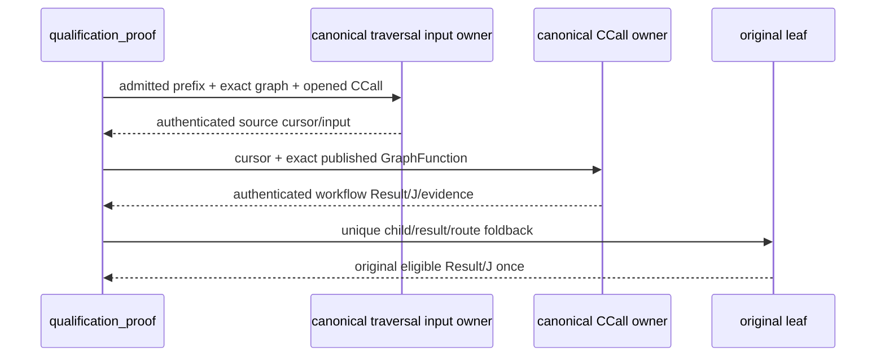

Existing D4/D5 HOW73/120–126/249 and AGENTS UML constraints apply.

The GraphFunction is reconstructed through the existing declaration/environment owners. The workflow failure contract retains the canonical agreeing admitted-row guard. Qualification resources in this component supply only declaration lookup; complete material/resource adequacy and downstream J/F11/AF22 installed proof remain open. No schema, Product meaning, cursor, route or runtime event is minted by this source change.
