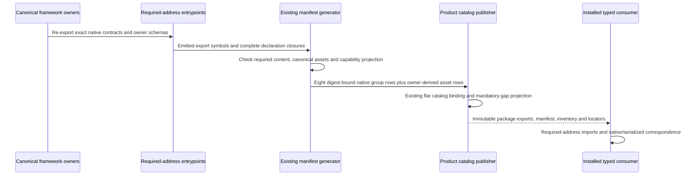

# Required Public contract group publication proposal

CLOSED design preparation; not complete content-closure acceptance or implementation authority. Root retains all eight REQ-P-PUBLIC-CONTRACTS-005 groups as intended RC1 WHAT. This proposal uses existing framework owners and static Product publication. It introduces no utility package, runtime mechanism, universal shape, Public function family, or independent catalog authority.

## First material uncertainty

Address publication is bounded, but complete content closure is not established. Exact current-source name references find RuntimeEvent and no references to sixteen other names explicitly required by -006/-007A (listed in source-effect-roster.json). Current canonical owners expose ROOT_EVENT_KIND_VALUES, StaticDiagnostic/STATIC_DIAGNOSTIC_CODE_VALUES, rawAdmitValue, validateProgram, canonicalizeAuthoredGtlCarrier, and current installation/release carriers. Their equivalence to the prescribed names or content cannot be minted by an export alias. In particular raw admission alone does not perform whole-Program validation, the current canonicalizer has four closed subject kinds and no c_program_term arm, and the current conformance result exposes an empty repairAffordances tuple. No diagnostic repair domain or named installer equivalence is selected here.

C09 also has 19 of the 44 required -006A identities; 25 related schema/vocabulary/corpus IDs are absent. Existing product/public_contract_publication.ts already owns the forty-four-identity roster and mandatoryGapSet; its binding can report missing identities while successfully binding the implemented subset. A bound catalog is not complete release publication. Some canonical assets already contain reusable definitions (public operation family, native locator, qualification and contribution coordinates), but the missing locators and all required meanings must be joined before closure. Internal absence of meaning has not been established by this bounded metadata review.

The requirements groups need more than the existing requirement-handoff witness: REQ-L-GTL3-REQUIREMENTS-ALGEBRA-002/-006/-014/-015 require identity, relation/span and distinct proof-role declarations; the ABG requirements/proof-carry laws require admitted/replay-derived obligation, coverage, fold and residual relations. Existing gtl/requirement_handoff.ts and abg/requirement_handoff.ts supply authentic finite handoff contracts. Publishing just that witness cannot certify every required group content. Missing owner coverage remains an explicit design-input uncertainty, not a new ledger proposal.

## One existing-owner publication path

Domain and lifecycle are the existing ProductPublicContract, ProductNativeTypedLocator, ProductAssetLocator, NativeDeclarationClosure and immutable Product catalog/binding carriers under ABI5_REALIZATION_CONSTITUTION. Reuse their existing publication lifecycle; no new entity, semantic carrier or runtime transition is proposed. The diagram is a compact agent constraint for that unchanged boundary, not a replacement ontology or executable scaffold. Any missing canonical type/schema/admission meaning returns to its owning HOW before a material typed boundary is retained. STDO proportional decision completeness prevents treating unresolved equivalences as co-evolution authority.

## Eight required groups

All owner paths below are relative to code/src. Proposed addresses are package subpaths of @abiogenesis/typescript-tenant. Anchors are actual existing native symbols; each anchor alone is insufficient. Each group must expose its complete required content and retain separate canonical asset locators where -003/-006A/-007A require them.

| Required identity / address | Required content and existing canonical owners | Proposed entrypoint / anchor; closure condition |
|---|---|---|
| abg.contract.gtl.m01 / ./gtl/m01 | Graph/declaration/interfaces in gtl/contracts.ts; seven-term C in gtl/c_algebra.ts; structural construction/refinement/foldback in gtl/graph_construction.ts, graph_applications.ts and contracts.ts; raw admission in validator/raw_admission.ts; validation/diagnostics in validator/validation.ts; canonicalization in gtl/canonicalization.ts. Required graph/C/conformance schemas, diagnostics/repair vocabularies and corpus retain distinct asset rows. | gtl/m01.ts; GraphFunction. Explicitly prove required native admit/serialize and refinement/diagnostic/repair content; no raw-admission/typechecking equivalence by name. |
| abg.contract.gtl.m02 / ./gtl/m02 | ModulePublication/CatalogContribution/declaration carriers in gtl/contracts.ts and declarations.ts; lookup/publication and descriptor coordinates in product/catalog.ts, declaration_closure.ts and contracts.ts; module validation/canonicalization reuse Validator/GTL owners. | gtl/m02.ts; ModulePublication. Native Module admission/serialization plus module/descriptor/contribution schemas must be located, not inferred from the group. |
| abg.contract.gtl.requirements / ./gtl/requirements | Existing ContextDeclaration, RequirementTerm, GtlContractFulfillmentBinding and GtlRequirementHandoffDeclaration schemas/constructors in gtl/requirement_handoff.ts. Required identity/relation/span/evidence-policy wrappers stay declaration-only under the GTL requirements law. | gtl/requirements.ts; GtlRequirementHandoffDeclaration. Complete relation/span/proof-role roster needs owner coverage; no import of ABG runtime authority. |
| abg.contract.abg.requirements / ./abg/requirements | RequirementHandoffDeclarationBasis/authentication in abg/requirement_handoff.ts; typed coordinate/input/output schemas in product/requirement_handoff.ts; existing admitted events/CCall/closure/Event Calculus own proof/currentness. Required requirement coverage/fold/residual interfaces must be traced to these existing owners. | abg/requirements.ts; RequirementHandoffDeclarationBasis. Authentic finite handoff is proven; complete requirements algebra/proof-carry content not certified. No new RequirementLedger authority or caller-minted coverage. |
| abg.contract.abg.m03 / ./abg/m03 | RuntimeEvent/ROOT_EVENT_KIND_VALUES in abg/event_store.ts; prefix/admission/catalog/basis/CCall/Result/replay/continuation/closure in existing ABG modules; qualification proof in abg/qualification_proof.ts; required conformance/diagnostic entrypoints reuse Validator owners. | abg/m03.ts; RuntimeEvent. Required CanonicalRuntimeEvent/event roster names and GTL conformance/diagnostic/repair native names need explicit owner mapping/supersession. Canonical runtime/result/replay/F_H assets must be located separately. |
| abg.contract.abg.transport / ./abg/m03/transport | WorkerTransportContract and strict native result-assessment/failure contracts in abg/transport_contracts.ts; existing worker request/result carriers in abg/worker_transport.ts and implementation/contracts.ts. | abg/m03_transport.ts; WorkerTransportContract. Export exact replaceable transport input/result contracts and pure guards; transport owns no event, traversal, continuation or runtime authority. No execute-worker shortcut or provider invocation is selected. |
| abg.contract.app.m04 / ./app/m04 | Existing public/index.ts and shared/public_function_family.ts/projections/contracts own the singular operation/invocation/outcome family; Product environment/install/catalog/invocation/project-read contracts own workspace/lock/catalog/install/SDK result/replay relations; ABG owns actual events. | public/m04.ts; PUBLIC_FUNCTION_DEFINITION_FAMILY. Expose owner request/result/refusal and installer contracts; preserve current 5.0 F_H hold/block/attribution/refusal allocation without claiming 5.1 human response/resumption. Named installer and lock/binding/install/host/F_H assets remain required. |
| abg.contract.qualification.m05 / ./qualification/m05 | validator/qualification_contracts.ts and self_conformance_contracts.ts own qualification law/basis/coverage/J/F11/AF22; qualifier resources use their owner; product/release_snapshot_operations.ts/contracts.ts own release request/artifact/identity/manifest carriers; ABG qualification_proof owns admitted evidence/currentness. | validator/m05.ts; QUALIFICATION_ASSESSMENT_PLAN_SCHEMA (or its exact inferred type selected by publisher). Preserve existing self-conformance schema's ExactCandidateQualification basis/verdict and subordinate definitions. Release snapshot/A5-R1-manifest/evidence locators must be proved; no new qualification authority. |

## Proposed minimal owning HOW change

The exact proposed appendix is in owning-how.diff, targeting ABI5_REALIZATION_CONSTITUTION section16.14. Existing family/capability/publication authority and generic addresses stay operative. The missing eight-group/content projection is a bounded design_reframe at the existing publication owner; once content/supersession choices are resolved and Root adopts the HOW, its static export/catalog realization is a realization_refactor. Historical M04 candidate/invalidated designs supply context only.

source-effect-roster.json names fourteen base proposed paths: one owning HOW, four current package/generator/Product-publication/capability-projection files, eight re-export-only entrypoints, and one focused test. Existing source preimages and absence of all nine new paths are pinned. This roster closes only the known static mapping cone; it is deliberately not a sufficient grant for all unresolved native/schema/algebra content. No source effects occurred.

Capability IDs, owningPublicContractIds, dependency semantics and existing function keys stay unchanged. Add group IDs only to the existing register's projectedPublicContractIds when their complete canonical content establishes that relationship; capabilityRefsForContract remains the single projector. Do not hardcode a second capability list in eight generator rows. Transport exposure alone does not confer a runtime capability. Exact projection membership requires the same Root content selection; no empty list may hide a supported mandatory claim.

## Focused proof and cost

After Root selects the unresolved cone, one isolated default-heap compile and focused external consumer must import every required address, all mandated named symbols and each required content category. Use actual positive declarations/admission/canonical serialization/conformance/installer/J/release inputs, and meaningful malformed raw/unknown diagnostic or repair/crossed contract examples. Missing address, wrong group anchor, incomplete export roster, crossed declaration inventory, stale asset/hash/schema definition, duplicate/unlocated ID, wrong capability projection and missing corpus/vocabulary must refuse the publication/content claim. Test canonical asset parity against actual owner guards/types, not equivalent handwritten schemas or mirrored register expectations.

Publish each new native row from its exact emitted closure and canonical tuple inventory; preserve distinct asset rows/definition pointers and the existing PublicFunctionDefinition operation projection. Reuse existing mandatoryGapSet and exact inventory/verifier/binder logic rather than author another checker. Complete the group-content and mandatory-asset correspondence before claiming complete publication. Never assume future generated count, total native row count, inventory body count, catalog digest, capability selector coordinates or semantic publication identities.

Root then joins accepted parent repair and complete publication source assurance before ONE new successor. Verify pack/install/native/catalog/capability/unchanged-wrapper correspondence on that subject and repeat only the affected actual wrapper-parent/native-child/J/foldback/cold-parent-consumer/F11/truthful non-green AF22 proof. Current C09 three Runs/six reads and generated928/physical929 remain preserved historical evidence; they do not qualify changed publication identities. Preserve original Hello/Rust without unrelated campaigns. Genuine context-sufficient F11, fixed15/QUAL056, sole green AF22 and human/provider/release work remain separate.

Planning estimate, not a release forecast: the fourteen-path static address/catalog/test portion is approximately 2–4 active Worker hours plus 1–2 focused component-proof hours once exact content and capability mappings are selected. The sixteen native-name and twenty-five asset/requirements-algebra content cone has no defensible complete estimate yet: reuse versus new owner admission/serialization/schema work is unresolved. Successor/affected installed proof costs should use measured predecessor construction and Runtime receipts after source selection; provider/human waiting is neither included nor measured. One finite proposal pass is now CLOSED. Root must select the complete missing-content/supersession owner cone before claiming decision completeness or granting the base roster as full RC1 closure.
