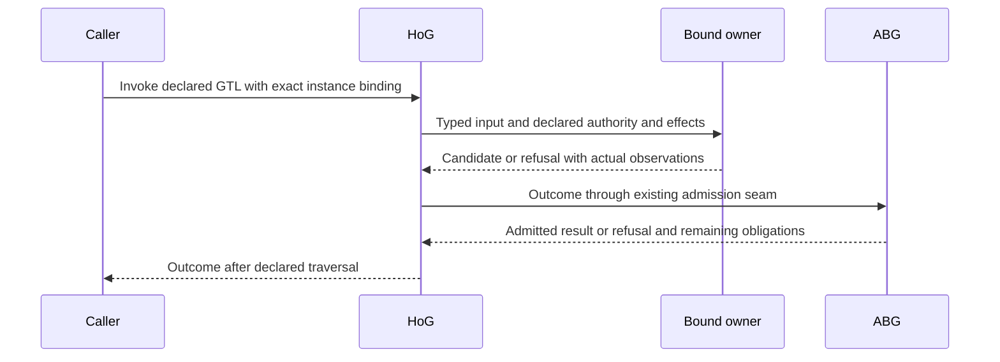

# ABG transformation library design

**Status:** Proposed realization scaffold for the active T-287 session.  
**Basis:** Current Product, canonical owners and STDO 2.5.1 RC2.  
**Purpose:** Control implementation through reusable transformation families, typed instances and derived publication views.

ABG should express different domain responsibilities as instances of its underlying library. New domains and representations should increase bindings and data before they increase independently implemented functions. The existing GTL, HoG, implementation owners and ABG admission provide execution.

## Definitions and instances

| Subject | Design meaning |
|---|---|
| Canonical contract | One owner defines an information family's meaning, shape, standing and validity conditions. |
| Transformation family | A reusable relation between source and destination contracts, with preconditions, preserved facts, allowed changes and owning authority. |
| Instance | Binds that relation to a domain, exact subject and basis, material, criteria, actor policy and permitted effects. |
| Publication view | Derives a native export, serialization schema, vocabulary, catalogue locator or adapter view from canonical definitions and bindings. |
| Execution occurrence | An existing ABG invocation executes an instance through declared GTL and retains its actual producer and history. |

These are design distinctions expressed through existing contracts and declarations. They do not require new runtime classes.

Different information states remain explicit. A candidate judgment and an admitted judgment have different standing; a finding and a qualification verdict have different authority. Repeated representations of the same information share their canonical owner.

## Bind information transformation to computation

Use this notation:

```text
tau_i : A => B       required information relation for instance i
c_i   : A -> H(B)    declared computation realizing that relation
```

Here H denotes computation through the existing HoG composition and owner ports. B includes the declared result, refusal, hold or unresolved alternatives. Existing owners supply the required evidence; ABG applies its admission conditions before granting runtime standing. Semantic adequacy retains its independent judgment. Pure construction and publication retain their existing eventless status.

GTL declares the instance binding and computation. HoG follows the original admitted Program. The selected owner performs the computation and permitted effects; ABG admits runtime facts; replay projects them. A failed admission preserves actual physical observations and does not imply rollback.



The diagram shows responsibilities, not a new dispatcher. The categorical interpretation remains a working hypothesis; this proposal does not establish formal category or monad laws.

## Reuse the underlying library

Organize existing functions by responsibility. This is a reuse map, not a mandatory new primitive roster.

| Responsibility | Existing owning realization |
|---|---|
| Structural admission and canonical serialization | Owner-local definitions, Valibot, GTL admission and serializers |
| Bind material and responsibility to a request | Qualification task, plan, resources and request construction |
| Perform independent assessment | Declared F_P seam and native actor/transport owners |
| Authenticate judgment and producer | Canonical judgment construction, qualification proof and ABG admission |
| Aggregate findings | Existing F11 evaluator, preserving failures, citations and missing assessment |
| Decide exact qualification | Sole AF22, consuming authenticated F11 and required coverage |
| Publish and project | Existing Product catalogue, schemas, SDK, CLI and replay owners |

For example:

```text
assess[Requirements](selected material, requirements criteria, exact basis)
assess[Design](selected material, design criteria, exact basis)
```

These are schematic instances of the same declared assessment machinery. The bindings change material and criteria. They preserve subject, attribution, independent assessor requirements and unresolved obligations.

Shared machinery does not transfer authority. F_D, F_P and F_H retain their regimes. F11 aggregation and AF22 qualification preserve their distinct relations even when they share utilities.

## Derive publication from canonical definitions

Publish each required instance or contract through its existing canonical owner. Native types, schemas, vocabularies, catalogue addresses and adapter views derive from that source. Several addresses may resolve definitions within one document.

The current 44-item roster counts 38 schemas, five vocabularies and one corpus. It is not a function count or a target number of implementations.

Classify an apparent gap by its consumer consequence:

- An unavailable required contract or incorrect binding prevents supported consumption and needs repair.
- An existing accessible contract with an absent prescribed address needs publication or versioned supersession.
- An address with no established current Product purpose needs an explicit requirement disposition.

Keep current required identities until their owning authority changes them. Proposed contraction cannot silently remove mandatory coverage. Reserved definitions carry truthful capability scope.

## Preserve information and reuse evidence

Every instance preserves exact subject and law, original producer, applicable scope, failures, citations and unknowns. A projection declares any loss of detail and supplies accessible evidence sufficient for its consumer.

Reuse established facts while dependencies and applicability remain valid. Changed subject, authority, physical resource or evidence triggers the affected checks. Cold acquisition and independently required judgment retain their duties.

Keep immutable material at existing durable owners. Subsequent events and reports retain new facts and authenticated selections where the contract permits. Actual assessor context includes the material the actor must read.

The current bounded consumer still parses a 504.8 MB enclosing manifest before selecting 182 entries. A future acquisition repair should let the existing resource owner authenticate selected bodies through a compact complete index. It must preserve membership, complete required inventory, provenance and missing/crossed-reference refusal. Existing full-manifest authentication remains necessary until that owner supplies a sufficient selective acquisition contract.

## Proof follows the relation

Reuse proof of a transformation family only within its demonstrated assumptions. Check each instance's bindings and changed dependencies. Derived views need correspondence evidence against their canonical source.

The installed composition proves a separate claim: actual producer to consumer, admission, consequence and fresh readback on the exact candidate. A shared implementation does not supply an unperformed semantic judgment.

The first discriminator should carry authenticated failure for A and uncovered required coverage B through F11, sole AF22 and fresh reads. Every declared assessment slot retains its authenticated judgment; B is outside that assessed coverage, not an omitted planned judgment. A's failure and citations survive; B stays unresolved; qualification remains non-green. A controlled failure proves conservation, not genuine assessment or defect detection. Then obtain one genuine assessment with adequate bound context before expanding the campaign.

Measure the same workload across preparation, execution, admission, retention and recovery. Separate necessary cold reads, new retained/transferred bytes, actor work and RSS. Increased unrelated material should expose an unjustified dependency. Set bounds for the selected workload through existing work authority.

## Worker instruction and completion

Record the following in the existing design or grant:

| Binding | Required statement |
|---|---|
| Reuse | Existing family, owning implementation and canonical source/destination imports |
| Instance | Domain, exact subject/basis, material, criteria and actor policy |
| Conservation | Meaning, lineage, coverage, failures, citations and uncertainty retained |
| Effects and validity | Permitted effects, admitting owner and material invalidators |
| Exit evidence | Actual consumer outcome, nearest refusal and affected installed join |
| Cost | Necessary acquisition and new retained/transferred bytes, time and RSS |

A new primitive requires a counterexample showing that the existing families cannot express a necessary semantic relation. A different role, phase, filename or catalogue address alone does not establish that need.

Start with one existing installed chain. Within that chain and its required dependencies, replace duplicated meaning with imports and bindings, derive its views, and retire superseded realization. Preserve accepted cuts and prove affected joins. Unrelated equivalent pure-helper compression can remain in 5.1 under the Product's existing boundary; it does not precede this discriminator.

Completion means required consumers use canonical instances successfully, meaningful authority distinctions survive, failures and lineage survive composition, and cost is attributable to declared dependencies. F11, seven actual defect cases, exact-candidate coverage and release retain their existing gates.

## Source basis

- [Product execution calculus and valid reuse](../../../specification/PRODUCT.md#execution-and-context-calculus).
- [Public contracts and publication views](../../../specification/requirements/product/REQ-P-PUBLIC-CONTRACTS.md).
- [Accepted reusable qualification library target](../../../build_tenants/abiogenesis/typescript/design/T287_F11_REUSABLE_QUALIFICATION_LIBRARY_TARGET_DESIGN.md).
- [Accepted GTL publication design](../../../build_tenants/abiogenesis/typescript/design/T287_G2_GTL_SERIALIZATION_PUBLICATION_DESIGN.md).
- [Current library acceptance and reuse limits](20260928_FRAMED_GOVERNANCE/rc1-library-closure-controls-01/return.md).
