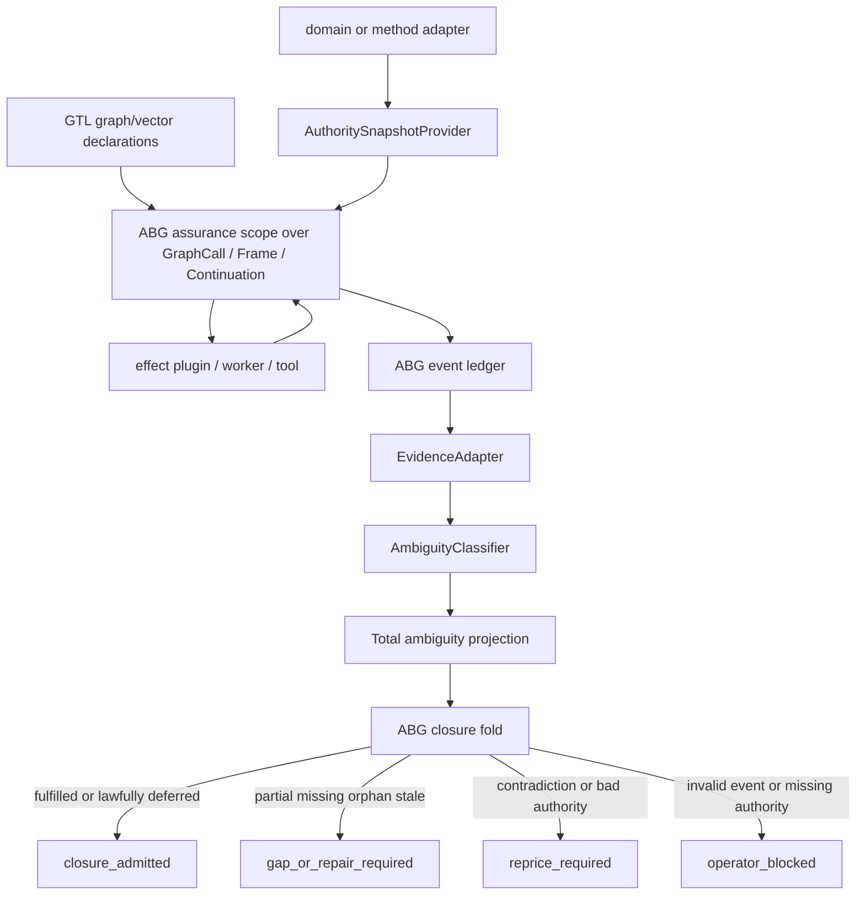

# T-088: ABG Total Unit-Of-Compute Assurance

## Problem

The data_mapper forensic comparison exposed a substrate-level closure defect.

`test57.fp.cx` proved that the modern TypeScript traversal loop can converge and
retry cleanly. It did not prove test35-class product closure because the release
claim was not derived from a total lineage/evidence/gap projection. The system
could accept traversal success while lifecycle ambiguity remained undercounted.

That is premature closure.

The issue is not unique to SDLC. Any bounded unit of compute can produce an
output whose boundary is under-accounted:

```text
U: input authority + input state -> output state + admitted events
```

ABG needs a generic assurance law for that boundary.

This does not widen the product boundary. In this ticket, "unit of compute"
means an invocation-local assurance carrier contained by the existing GTL edge
traversal and ABG runtime aggregate family: `GraphCall`, `Frame`, and
`Continuation`. If the audit finds that assurance must govern a new product
boundary outside edge traversal, this ticket must stop and a `product_reprice`
ticket must be opened first.

## Core Design Claim

For every governed unit of compute:

```text
assure(U) = fold(project_ambiguity(A_U, E_U))
```

Where:

- `A_U` is the current authority/input snapshot for the unit
- `E_U` is the admitted event ledger for the unit
- `project_ambiguity` is total
- `fold` returns exactly one lawful decision: close, retry, reprice, block, or
  qualified defer

No unit may close from worker success, test success, local archive shape,
controller-local memory, prompt-side self-assessment, or absence of a closure
register.

## Ticket Scope After STDO Review

This is an upstream spike for requirement audit and lawful sequencing.

It is not the design implementation ticket. It is not a Python tenant ticket.
It is not a TypeScript tenant ticket. It must not close by implementing one
tenant or by pointing to downstream `odd_sdlc` proof.

The closure question for this ticket is:

```text
Does ABG already have sufficient constitutional authority for total
unit-of-compute assurance, or does the requirement layer need new acceptance
criteria before design and tenant implementation proceed?
```

The answer must be written as an audit table, not asserted verbally.

It must also answer the product-boundary question:

```text
Is total assurance a contained runtime carrier under the existing edge
traversal boundary, or does it define a new product-level compute boundary?
```

Only the first answer can proceed under `requirement_reprice`.

## Requirement Audit Deliverable

The audit note must include this matrix. Each row must be audited against the
full audit set listed below, not only against the example requirement families
that seem most relevant to that row.

| Ambiguity status | Requirement audit set | Decision | Required follow-up |
|---|---|---|---|
| `fulfilled` | full audit set | `covered` / `new AC needed` / `new REQ needed` | requirement/design/proof refs or follow-on ticket |
| `partial` | full audit set | `covered` / `new AC needed` / `new REQ needed` | requirement/design/proof refs or follow-on ticket |
| `missing` | full audit set | `covered` / `new AC needed` / `new REQ needed` | requirement/design/proof refs or follow-on ticket |
| `stale_input` | full audit set | `covered` / `new AC needed` / `new REQ needed` | requirement/design/proof refs or follow-on ticket |
| `authority_missing` | full audit set | `covered` / `new AC needed` / `new REQ needed` | requirement/design/proof refs or follow-on ticket |
| `orphan_evidence` | full audit set | `covered` / `new AC needed` / `new REQ needed` | requirement/design/proof refs or follow-on ticket |
| `contradictory_authority` | full audit set | `covered` / `new AC needed` / `new REQ needed` | requirement/design/proof refs or follow-on ticket |
| `contradictory_evidence` | full audit set | `covered` / `new AC needed` / `new REQ needed` | requirement/design/proof refs or follow-on ticket |
| `deferred` | full audit set | `covered` / `new AC needed` / `new REQ needed` | requirement/design/proof refs or follow-on ticket |
| `event_ledger_invalid` | full audit set | `covered` / `new AC needed` / `new REQ needed` | requirement/design/proof refs or follow-on ticket |

Every `covered` cell must name the existing requirement, design carrier,
implementation surface, and proof surface. Every non-covered cell must name the
required follow-on requirement/design/proof work. No ambiguity status may be
closed by a general claim that ABG is already sufficient.

The audit scope must include the full runtime boundary touched by the ticket:

- `REQ-R-ABG3-INTERPRET`
- `REQ-R-ABG3-BINDING`
- `REQ-R-ABG3-RUN`
- `REQ-R-ABG3-GRAPHCALL`
- `REQ-R-ABG3-FRAME`
- `REQ-R-ABG3-CONTINUATION`
- `REQ-R-ABG3-EVENTS`
- `REQ-R-ABG3-PROJECTION`
- `REQ-R-ABG3-CONVERGENCE`
- `REQ-R-ABG3-CORRECTION`
- `REQ-R-ABG3-LINEAGE`
- `REQ-R-ABG3-POLICY`
- `REQ-R-ABG3-PROVENANCE`
- `REQ-R-ABG3-RETRY`
- `REQ-R-ABG3-TRANSPORT`
- `REQ-R-ABG3-WORKER`
- `REQ-R-ABG3-JOB-WORKER`
- GTL hook, language, graph-function, and graph-vector requirement families

## Ledger Algebra

The target model uses a small ledger set:

| Ledger | Owner | Meaning |
|---|---|---|
| Authority ledger `A` | GTL declaration plus domain adapter | What this unit is allowed and required to transform. |
| Event ledger `E` | ABG | Append-only admitted facts for the unit. |
| Evidence ledger `V` | ABG projection with plugin/domain classifiers | What evidence exists for each authority obligation. |
| Gap ledger `G` | ABG projection | Missing, partial, shallow, stale, orphan, contradictory, or deferred states. |
| Closure ledger `C` | ABG projection/fold | The lawful close/retry/reprice/block decision. |

All reports, dashboards, release surfaces, and closure registers are read
models over these ledgers. They are not independent truth stores.

## Total Ambiguity Projection

The projection must emit one row for every relevant state. It must never skip a
dimension or treat unknown as success.

Required row states:

| State | Meaning | Default decision |
|---|---|---|
| `fulfilled` | Current evidence is bound to current authority and satisfies required proof shape. | close candidate |
| `partial` | Evidence exists but is trace-only, planned, shallow, or unbound to required proof shape. | retry |
| `missing` | Required evidence is absent. | retry |
| `stale_input` | Current authority/input digest differs from the digest closed against. | block/replay |
| `authority_missing` | The unit is release-capable but lacks current authority. | block |
| `orphan_evidence` | Evidence exists without matching current authority. | block/repair |
| `contradictory_authority` | Authority conflicts with itself. | reprice |
| `contradictory_evidence` | Evidence conflicts with authority. | reprice or repair |
| `deferred` | Deferral is explicitly admitted and release policy allows it. | qualified defer |
| `event_ledger_invalid` | Events are unreadable or inadmissible. | operator block |

Closure is legal only when every row is `fulfilled` or release-lawfully
`deferred`.

## Input-Change Invalidation

Closure is a projection cache, not a permanent mutation.

If input authority changes after closure:

```text
if digest(A_current) != digest(A_closed_against):
    C := unavailable(stale_input)
    G := project_open_gaps(A_current, E_current)
```

The event log remains intact. The prior closure is shadowed by the current
projection and must be re-proved or reopened. This generalizes the Python
requirement-closure behavior where stale published analysis makes the closure
read model unavailable until rebuilt.

## ABG / GTL / Domain Ownership

| Layer | Owns |
|---|---|
| GTL | Declares graph functions, vectors, contracts, hook attachment points, hook refs, and opaque config. |
| ABG | Unit identity, input digest binding, event admission, replay, total ambiguity projection shape, stale-input invalidation, closure/retry/reprice/block fold, and runtime enforcement. |
| IoC plugins | Provide effect execution, authority snapshots, evidence adapters, classifier functions, and policy providers behind typed contracts. |
| downstream product | Domain gain functions, evidence semantics, product capability profiles, and domain release interpretation. |

ABG guarantees no declared ambiguity is lost or prematurely closed.

ABG does not guarantee that a downstream product declared the right gain
function. A bad SDLC requirement decomposition or weak release profile remains
an `odd_sdlc` / methodology / domain-adapter defect.

## GTL Impact

GTL impact should be limited and declarative.

No GTL event calculus or ambiguity DSL is required.

GTL must expose enough hook declaration surface that an LLM-authored graph
function can specify the full graph-function boundary through GTL itself rather
than through side-door runtime configuration. The hook semantics remain opaque
and ABG-resolved, but the hook references and boundary intent must be visible in
the graph-function/vector declaration.

GTL may need an explicit assurance hook concern, or a clarification that the
existing closure/proof hook concerns cover total assurance:

```text
GraphFunction.declarations:
  hook_ref: assurance.total_projection
  config: opaque

GraphVector.declarations:
  closure_contract: total_ambiguity_projection
  proof_policy_ref: domain-owned
```

The GTL language remains engine-agnostic. It declares the boundary and hook
references. ABG interprets and enforces the assurance law.

The target GTL rule is:

```text
An LLM constructing a graph function shall be able to declare the graph
function's assurance, closure, proof, dispatch, evaluation, and escalation hook
refs inside GTL declarations. ABG may resolve those refs through IoC providers,
but runtime side doors must not be required to complete the graph-function
contract.
```

This keeps GTL as the authored program surface. It does not make GTL the
semantic owner of assurance status, evidence classification, event admission,
or closure folding.

## Open GTL Decision

This is a major ambiguity and must be decided before this ticket closes:

```text
Does GTL need an explicit assurance hook concern, or do the existing
deterministic-proof and closure hook concerns already cover total
unit-of-compute assurance?
```

The decision must record:

- affected GTL invariant
- affected GTL requirement refs
- whether requirement text changes
- why the chosen option keeps GTL declarative and engine-agnostic
- whether the resulting hook surface is expressive enough for LLM-authored
  graph functions to declare the full graph-function boundary without side-door
  runtime config

## IoC Plugin Extension

This ticket extends the B-016 plugin model.

Candidate plugin/provider contracts:

| Contract | Purpose | Authority limit |
|---|---|---|
| `AuthoritySnapshotProvider` | Produces current authority/input snapshot and digest for a unit. | Cannot close the unit. |
| `EvidenceAdapter` | Maps event facts and artifacts into evidence candidates. | Cannot admit events directly. |
| `AmbiguityClassifier` | Classifies evidence against authority using domain semantics. | Returns candidate row classification only. |
| `ClosurePolicyProvider` | Supplies release/defer policy for row folding. | Cannot override stale, invalid, orphan, or missing authority states. |
| `GainFunctionAdapter` | Maps method/domain gain outputs into authority obligations and evidence expectations. | Bad gain function remains domain/method responsibility. |

The runner consumes plugin output through admitted carrier types. Plugins cannot
emit runtime events, choose next vectors, or close a unit. ABG owns the fold.

`UnitOfCompute` is not introduced here as a new public aggregate or runtime
carrier. It is diagram shorthand for the assurance scope over existing ABG
runtime truth: `GraphCall`, `Frame`, and `Continuation`. If follow-on design
wants `UnitOfCompute` as a stable named carrier, that requires explicit
requirement/design authority before implementation.

## Target Topology



## Core-Interface Migration Requirement

Any follow-on design or proof ticket must treat this as a core-interface
migration if it changes runtime closure, event/projection semantics,
identity/binding, provider/resolver behavior, or plugin contracts.

The follow-on work must inventory:

- old and new producers
- old and new consumers
- runtime projections
- reports and dashboards
- proof surfaces
- superseded closure paths
- compatibility or adapter boundaries
- negative proof that superseded closure paths cannot still close work

No follow-on implementation ticket may close by adding a new projection while
leaving an older closure path authoritative.

## Interaction With T-086

T-086 defines or proves the generic traversal envelope:

```text
current projection
+ cumulative context
+ obligation pressure
+ prior gaps
+ output/result coverage
-> retry | reprice | close | continue
```

T-088 adds the assurance law that decides whether that envelope can close.

If T-086 is the topology of the traversal envelope, T-088 is the total closure
calculus over the envelope.

T-088 cannot claim final design closure while T-086 remains unresolved unless
the audit explicitly records why the assurance requirement can close without
settling the traversal-envelope topology. The default expected path is that
T-086 completes first or co-closes in the same requirement/design wave.

## Downstream odd_sdlc Adapter

`odd_sdlc` should become the first consumer.

It maps:

| odd_sdlc surface | Generic ABG role |
|---|---|
| goals, intent, product, requirements, design carriers | authority snapshot |
| F_P worker handoff manifest | unit input state |
| worker report and materialized artifacts | event/evidence candidates |
| code/test trace bindings | evidence rows |
| test execution reports | runtime evidence rows |
| gap analysis | gap facts |
| release fulfillment ledger | closure projection |

The SDLC adapter owns gain quality:

- intent to requirements
- requirements to design
- design to code/test obligations
- code/test evidence policy
- product quality profile

ABG owns whether those declared obligations are totally projected and not
prematurely closed.

## Tenant Boundary

This ticket is upstream-only.

If the audit finds implementation work, the tenant implementation and proof
must split into tenant-local follow-on tickets. Python and TypeScript may share
the same requirement/design authority, but they do not share closure proof.

At minimum, the follow-on set must distinguish:

- ABG shared design/IACS for total assurance carriers and plugin seams
- projection-totality proof work
- Python tenant implementation/proof if Python changes are required
- TypeScript tenant implementation/proof if TypeScript changes are required

One tenant proving stale-input invalidation or total projection does not close
the other tenant.

## Expected Work Order

1. Audit active ABG/GTL requirements and decide whether T-088 needs new
   requirement text or only design under existing event/projection/convergence
   law. The output is the audit matrix above.
2. Reconcile T-086, B-016, T-087, B-013, B-014, and T-084 so total assurance
   does not create a rival mechanism.
3. Decide the GTL assurance-hook ambiguity and record rationale.
4. Create follow-on design/proof tickets for ABG total assurance.
5. Create tenant-suffixed implementation/proof tickets if the audit finds
   Python or TypeScript changes.
6. Create odd_sdlc follow-on adapter ticket after the ABG authority boundary is
   known.

## Closure Evidence

Closed at: 2026-04-29T07:50:10Z

Audit surfaces:

- `.ai-workspace/comments/codex/20260429T172415AEST_T088_requirement_audit.md`
- `.ai-workspace/comments/codex/20260429T175010AEST_T089_requirement_closure.md`

Requirement authority:

- `specification/requirements/abg/REQ-R-ABG3-ASSURANCE.md`
- `specification/requirements/gtl/REQ-L-GTL3-HOOKS.md`
- `specification/requirements/gtl/REQ-L-GTL3-GRAPHFUNCTION.md`
- `specification/requirements/gtl/REQ-L-GTL3-GRAPHVECTOR.md`

Follow-on tickets:

- `T-090`
- `T-091`
- `T-092-PY`
- `T-092-TS`

T-088 closes only the upstream audit and sequencing spike. Design, proof, and
tenant implementation remain open.
