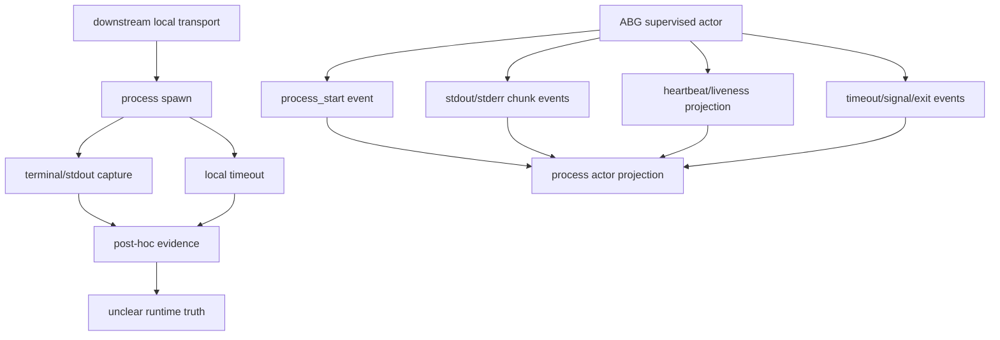

# T-097: ABG Supervised Process Actor Execution

## STDO Triage

First missing layer: requirement.

The product boundary is already ABG-owned execution. The defect is that the
requirement surface did not explicitly authorize the full supervised
actor/process event family, live stream observation, process projection, and
transport ownership rule now needed by the TypeScript implementation and
downstream odd_sdlc consumer.

This is not an odd_sdlc feature. odd_sdlc should publish GTL programs and
plugins. ABG should execute actors, supervise process transports, emit event
truth, and project ledgers.

The requirement reprice is carried by:

- `REQ-R-ABG3-EVENTS-012..015`
- `REQ-R-ABG3-PROJECTION-007..010`
- `REQ-R-ABG3-TRANSPORT-016..019`

## Boundary Rule

| Layer | Owns |
| --- | --- |
| GTL | graph function declaration and traversal shape |
| ABG | actor invocation, process supervision, runtime facts, retry/continuation lineage, event log, projections |
| Plugin | domain prompt/materialization adapter and result artifact mapping |
| odd_sdlc | SDLC domain meaning, hook contracts, requirement/design/code/test/release interpretation |

## Engine-First Holistic Context

Holistic solution reference:

`/Users/jim/src/apps/abiogenesis/.ai-workspace/comments/codex/20260430T224308AEST_abg_engine_first_holistic_solution.md`

This ticket is the first engine ticket in the `test60` bug wave. If ABG cannot
own process actor identity, streamed stdout/stderr, timeout escalation, signal
sequence, and exit projection, then downstream products will keep rebuilding
runtime truth in local transport code.

T-099 and T-098 depend on this surface being real enough to make F_P stages and
retry frontier replay-derived rather than downstream-local.

## Required Implementation Wave

1. Define the ABG supervised-process actor carrier and event family.
2. Add stream/process projections over admitted runtime events.
3. Implement TypeScript process supervision with live stdout/stderr writes.
4. Rebind odd_sdlc `process://claude` and node-script worker lanes to the ABG
   process actor seam.
5. Prove deterministic negative and regression cases.
6. Run a Claude lane and show pre-exit stream/process facts in the archive.
7. Request independent STDO/code review before closure.

## Current State

The logical loop ownership defect is fixed: odd_sdlc now uses ABG
`runEngineIterateAsync` for F_P traversal/retry and supplies an effect plugin.
ABG carries the GTL vector edge as dispatch expectation and projects
`priorManifestId` into retry lineage.

The deterministic process actor implementation is now in place:

- ABG exports `invokeSupervisedProcessActor`.
- ABG emits admitted actor/process runtime events for process start, stream
  chunks, heartbeat, timeout, signal, and exit.
- ABG projects process refs, stream refs, running state, latest heartbeat,
  timeout observation, signal sequence, exit status, and error state from
  replay.
- Missing executable or PATH drift no longer crashes event admission: negative
  Node close codes are normalized to `status: null`, with spawn error detail
  preserved in the exit event.
- ABG has deterministic tests for streamed stdout/stderr and timeout signaling.
- ABG has deterministic tests for missing command failure, two-phase
  timeout escalation through `SIGTERM` then `SIGKILL`, and liveness projection.
- odd_sdlc consumes the ABG process actor primitive and no longer owns local
  `spawnSync` worker execution.

Claude's 2026-04-30 closure-readiness review accepted the design and
deterministic implementation, but held closure pending one of:

- an explicit T-094 live-archive citation that proves the same ABG actor seam
  preserved process/stream evidence in a live Claude lane, with the pre-exit
  claim argued from event timeline; or
- a fresh T-097-tagged Claude live archive with named pre-exit
  `worker_stdout.log`, `worker_stderr.log`, actor/process event rows, child
  identity, timeout policy, and final result or typed timeout failure.

The live Claude pre-exit evidence gate is now satisfied by the T-097 live
archive listed below. The external STDO/code review accepted the final patch before the `3.4.0-rc.4` cut.

2026-05-03 supersession note:

- The historical T-097 live archive remains valid evidence for the original
  supervised-process-actor ticket.
- The `test:t097:live` harness and
  `test_env/live/test_t097_supervised_process_actor_live.test.mjs` were removed
  during the T-108/T-109 one-interface refactor because they used the stale
  Claude text-mode process path.
- Current actor/worker call-out proof is owned by
  `runAgentActorWorkerCallout` and `npm run test:t109`, including the migrated
  supervised actor fixture in
  `test_env/tests/test_t109_agent_callout_traced_substrate.test.mjs`.

2026-04-30 refresh:

- `node --test test_env/tests/test_t097_supervised_process_actor.test.mjs`
  passed.
- `npm run test:semantic` passed at `2026-04-30T23:44:12+10:00`: 304 tests,
  0 failed.
- Historical, now superseded:
  `/bin/zsh -ic 'CODEX_LIVE_FP=1 ABG_TS_LIVE_AGENT=claude ABG_TS_LIVE_TIMEOUT_MS=240000 npm run test:t097:live'`
  passed before the later one-interface refactor removed that harness.
- Live archive:
  `/Users/jim/src/apps/abiogenesis/build_tenants/abiogenesis/typescript/test_env/test_runs/t097_supervised_process_actor_live/20260430T134349638Z`.
  Evidence includes `worker_process_events.jsonl`, `runtime_projection.json`,
  `worker_stdout.log`, `worker_stderr.log`, `process_result.json`, and
  `result_artifact.json`, plus `assertions.json`.
- Live projection showed `status=0`, `timedOut=false`, 19 actor process events,
  pre-exit heartbeat/liveness, and a stdout stream observation before process
  exit.
- The test includes streamed stdout/stderr, timeout signaling, missing-command
  typed runtime failure evidence, SIGTERM-to-SIGKILL escalation, and liveness
  projection assertions.
- The final implementation was reviewed and accepted before the `3.4.0-rc.4` cut.

2026-04-30 review-response refresh:

- Triage corrected from `design_reframe` to `requirement_reprice` because this
  ticket added the `actor_process_*` runtime event family, not only a
  realization design.
- Live archive postmortems now write `assertions.json` beside preserved
  evidence so archived evidence and proof assertions do not drift.
- T-097 is accepted for the `3.4.0-rc.4` cut. Downstream odd_sdlc live regression proof remains outside this ABG source ticket.

## Closure Disposition

- External STDO/code review accepted the requirement and implementation surface
  before the `3.4.0-rc.4` cut.
- Fresh rc.4 deterministic and Claude live proof passed.
- Downstream odd_sdlc test60-class regression proof remains a downstream
  consumer gate, not an ABG source closure blocker.
