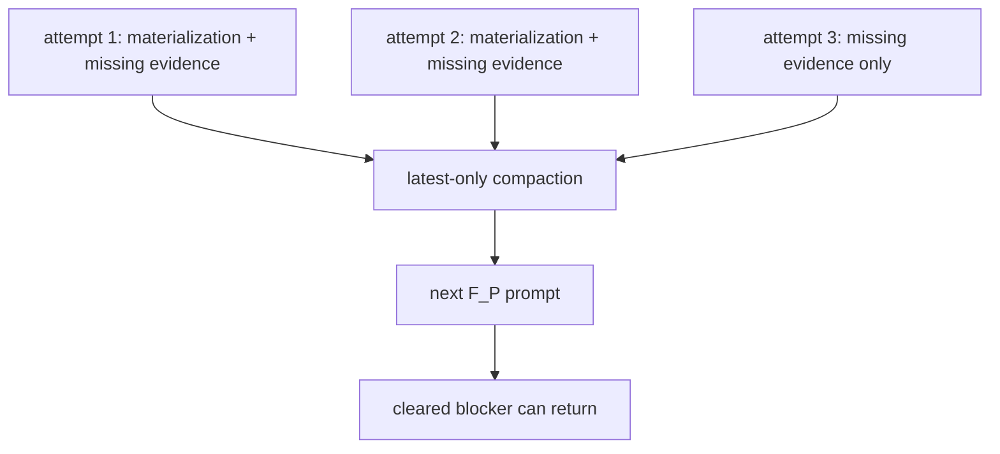
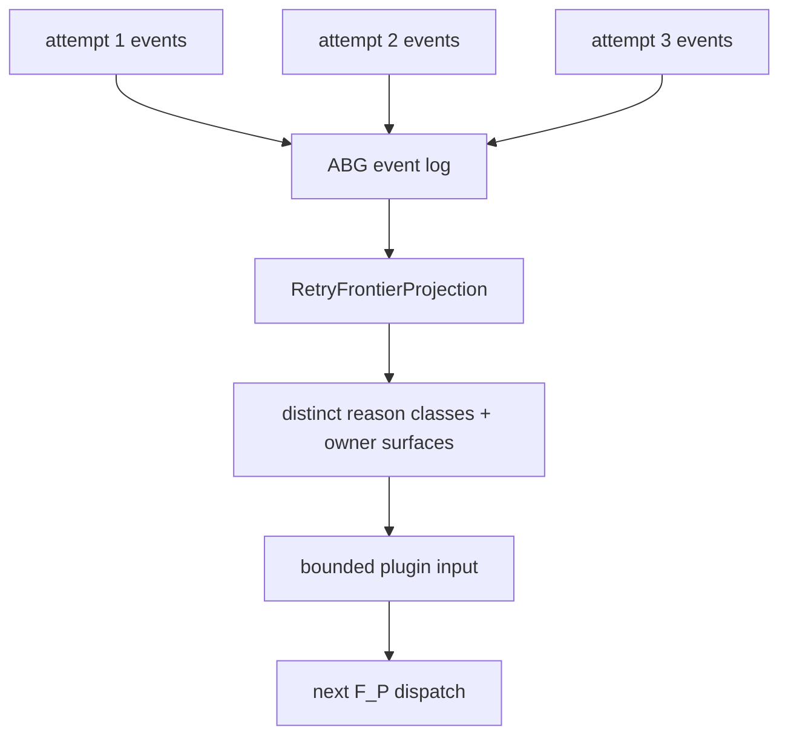

# T-098: ABG Full Retry Frontier Projection

## STDO Triage

First missing layer: design.

ABG already owns continuation, retry, lineage, provenance, payload ledgers, and
projection mechanics. The missing design is the retry-frontier read model that
downstream F_P plugins should consume.

The `test60` failure is not only an odd_sdlc prompt issue. The worker regressed
because the next attempt did not receive the full retry frontier. That is a
substrate projection responsibility: ABG must preserve the attempt history and
publish a bounded, classified view for plugin input.

## Required Work

1. Define the retry frontier carrier and projection fields.
2. Define prompt-budget-safe summarization rules that preserve distinct reason
   classes.
3. Implement the TypeScript projection over admitted retry/gap/payload events.
4. Replace downstream latest-only compaction consumers.
5. Prove with a multi-attempt live lane that cleared and uncleared blockers
   remain visible.

## Solution Design

Engine-first holistic solution reference:

`/Users/jim/src/apps/abiogenesis/.ai-workspace/comments/codex/20260430T224308AEST_abg_engine_first_holistic_solution.md`

Downstream SDLC symptom reference:

`/Users/jim/src/apps/odd_sdlc/.ai-workspace/comments/codex/20260430T223828AEST_test60_bug_wave_domain_solution.md`

This ticket defines retry frontier as replay-derived ABG projection truth.

Current broken shape:

Target shape:

Design-module checks:

- Authority seam closure: retry truth is projected from ABG events, not rebuilt
  by odd_sdlc from local files.
- Prime law: `RetryFrontierProjection` is a prime public projection carrier;
  individual reason rows remain subordinate payload.
- Totality: every attempt contributes a classified row or a rejected/invalid
  row; no attempt silently disappears.
- No semantic center: downstream prompt assembly does not decide which prior
  facts count as runtime truth.

## Implementation Status

TypeScript implementation is in place.

- Added `retry_frontier.ts` as the ABG replay-derived frontier projection.
- `RetryFrontierProjection` preserves all retry rows for one vector: attempt
  identity, manifest identity, prior manifest identity, reason class, owner
  surface, evidence refs, and source event kind.
- `EnginePluginInput` now carries `retryFrontier` for every plugin invocation.
  F_P plugins no longer need to reconstruct frontier truth from latest local
  dossiers.
- `assertFullRetryFrontierProjection` rejects latest-only objects as not being
  full frontier truth.
- `assertFullRetryFrontierProjection` now validates row shape, deterministic
  `frontierRef`, vector/edge consistency, reason class consistency,
  source-event kinds, attempt count, latest attempt, and one row for each
  covered attempt. A latest-only object with `isFullFrontier: true` no longer
  passes.
- `clearedByClosure` is a vector-level closure marker on still-visible rows.
  It does not claim per-attempt clearance; per-attempt clearance remains outside
  T-098 unless a later requirement explicitly adds it.
- Added `test_t098_retry_frontier_projection.test.mjs`.

Verification:

- `npm run build:semantic` passed.
- `node --test test_env/tests/test_t098_retry_frontier_projection.test.mjs`
  passed.
- Adjacent regressions passed:
  `test_t084_attached_fp_worker_loop.test.mjs`,
  `test_t095_payload_ledger_unit.test.mjs`,
  `test_t094_assurance_register_two_hop_unit.test.mjs`,
  `test_m03_engine_owned_iterate_runner_unit.test.mjs`,
  `t072-m03-plugin-contract-negative.test.mjs`,
  `test_m03_plugin_contract_inventory_unit.test.mjs`.
- `npm run lint:semantic` passed.
- `npm run test:semantic` passed at `2026-04-30T23:44:12+10:00`: 304 tests,
  0 failed.
- 2026-04-30 review-response focused proof:
  `node --test test_env/tests/test_t098_retry_frontier_projection.test.mjs
  test_env/tests/test_t099_fp_stage_carriers.test.mjs
  test_env/tests/test_t097_supervised_process_actor.test.mjs` passed 13/13.
- `npm run lint:semantic` passed after the review-response patch.
- `/bin/zsh -ic 'CODEX_LIVE_FP=1 ABG_TS_LIVE_AGENT=claude ABG_TS_LIVE_TIMEOUT_MS=240000 npm run test:t094:live'`
  passed.
- T-094 live archive:
  `/Users/jim/src/apps/abiogenesis/build_tenants/abiogenesis/typescript/test_env/test_runs/t094_assurance_register_two_hop_live/20260430T134330381Z`.
  The register shows `hop1=close`, `hop2=retry`, `decision=deepen`,
  `mayConverge=false`, proving a second hop with missing evidence prevents
  convergence. The archive includes `assertions.json`.

Closure disposition:

- External STDO/code review accepted before the `3.4.0-rc.4` cut.
- ABG source-layer closure is accepted for this RC.
- Downstream odd_sdlc consumption and live data_mapper proof remain owned by odd_sdlc T-102.
