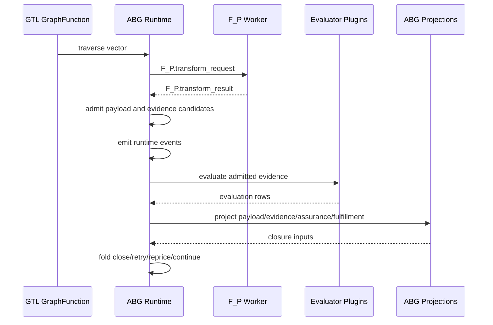
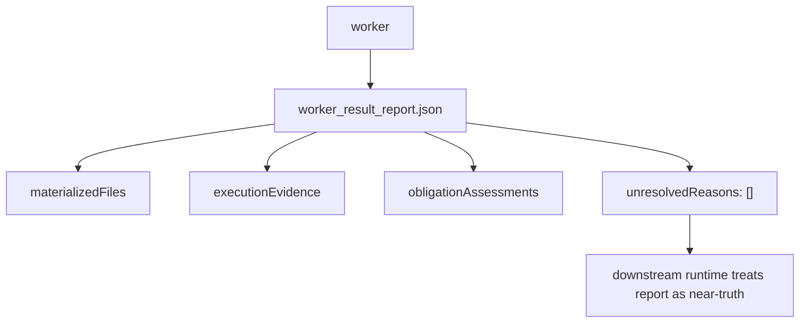
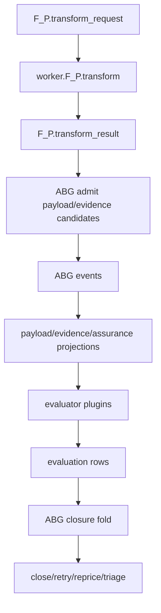

# T-099: ABG Typed F_P Stage Carriers

## STDO Triage

First missing layer: design.

The ABG product boundary already says ABG owns runtime facts, admitted payload
ledgers, total assurance projection, and closure fold. The missing design is
the typed carrier family for an F_P invocation lifecycle.

Downstream `odd_sdlc` has a containment bridge in T-102, but that bridge still
generates legacy reports and keeps too much lifecycle interpretation in the
domain package. This ticket is the upstream substrate correction.

## Target Flow

## Downstream Dependency

`odd_sdlc` T-102 is the downstream SDLC plugin migration. It should not close as
the final architecture until this ABG carrier design exists and odd_sdlc can
consume it.

## Solution Design

Engine-first holistic solution reference:

`/Users/jim/src/apps/abiogenesis/.ai-workspace/comments/codex/20260430T224308AEST_abg_engine_first_holistic_solution.md`

Downstream SDLC symptom reference:

`/Users/jim/src/apps/odd_sdlc/.ai-workspace/comments/codex/20260430T223828AEST_test60_bug_wave_domain_solution.md`

This ticket defines the missing ABG F_P stage algebra. It removes closure
authority from the worker report and makes ABG the runtime owner of admission,
events, projection, and fold.

Current broken shape:

Target shape:

Design-module checks:

- Authority seam closure: one admitted carrier owns each boundary.
- Prime law: transform request/result, admitted payload, projection, and
  closure decision are the irreducible carrier set.
- Effect-edge rule: worker/process effects are outside semantic closure fold.
- No semantic center: no controller or domain plugin can decide closure outside
  ABG fold truth.

## Implementation Status

TypeScript implementation is in place for the primary carrier path.

- Added `fp_stages.ts` with `FpTransformRequest`, `FpTransformResult`,
  `FpEvidenceCandidate`, transform-result admission, and
  `runtimeEventsForFpTransformResult`.
- `EnginePluginInput` now carries `fpTransformRequest` for F_P plugin calls.
- Attached F_P result ingestion now turns fulfilled transform evidence into
  ABG payload/evidence events through `runtimeEventsForFpTransformResult`
  instead of a worker-report-owned evidence path.
- Attached F_P blocked, runtime-failed, and contract-failed outcomes now enter
  retry progress through request-scoped `FpTransformResult` admission before
  retry rows are emitted.
- `admitFpTransformResultForRequest` rejects result carriers whose request ref,
  actor invocation id, or result ref do not match the active transform request.
- Fulfilled result artifacts with empty `evidence_refs` are rejected at artifact
  admission; a vacuous fulfilled assessment is no longer a structurally valid
  transform result.
- The assurance gate now gives an external provider authority snapshot
  precedence over worker-admitted authority rows. Worker-supplied fulfilled
  evidence can close a vector locally, but cannot override external authority at
  convergence.
- `admitFpTransformResult` rejects closure-authority fields such as
  `runtimeEvents`, `unresolvedReasons`, `nextVectorIndex`, and
  `closedVectorIndexes`.
- Added `test_t099_fp_stage_carriers.test.mjs`.

Verification:

- `npm run build:semantic` passed.
- `node --test test_env/tests/test_t099_fp_stage_carriers.test.mjs` passed.
- Adjacent regressions passed:
  `test_t084_attached_fp_worker_loop.test.mjs`,
  `test_t095_payload_ledger_unit.test.mjs`,
  `test_t094_assurance_register_two_hop_unit.test.mjs`,
  `test_m03_engine_owned_iterate_runner_unit.test.mjs`,
  `t072-m03-plugin-contract-negative.test.mjs`,
  `test_m03_plugin_contract_inventory_unit.test.mjs`.
- `npm run lint:semantic` passed.
- `npm run test:semantic` passed at `2026-04-30T23:44:12+10:00`: 304 tests,
  0 failed.
- 2026-04-30 review-response focused proof:
  `node --test test_env/tests/test_t098_retry_frontier_projection.test.mjs
  test_env/tests/test_t099_fp_stage_carriers.test.mjs
  test_env/tests/test_t097_supervised_process_actor.test.mjs` passed 13/13.
- `npm run lint:semantic` passed after the review-response patch.
- `/bin/zsh -ic 'CODEX_LIVE_FP=1 ABG_TS_LIVE_AGENT=claude ABG_TS_LIVE_TIMEOUT_MS=240000 npm run test:t094:live'`
  passed.
- T-094 live archive:
  `/Users/jim/src/apps/abiogenesis/build_tenants/abiogenesis/typescript/test_env/test_runs/t094_assurance_register_two_hop_live/20260430T134330381Z`.
  The register shows the first admitted transform artifact can close its local
  hop, while the second hop projects missing execution evidence and forces
  `decision=deepen`. The archive includes `assertions.json`.

Closure disposition:

- External STDO/code review accepted before the `3.4.0-rc.4` cut.
- ABG source-layer closure is accepted for this RC.
- Downstream odd_sdlc T-102 migration from the legacy report bridge to ABG stage
  carriers remains a downstream consumer gate.
