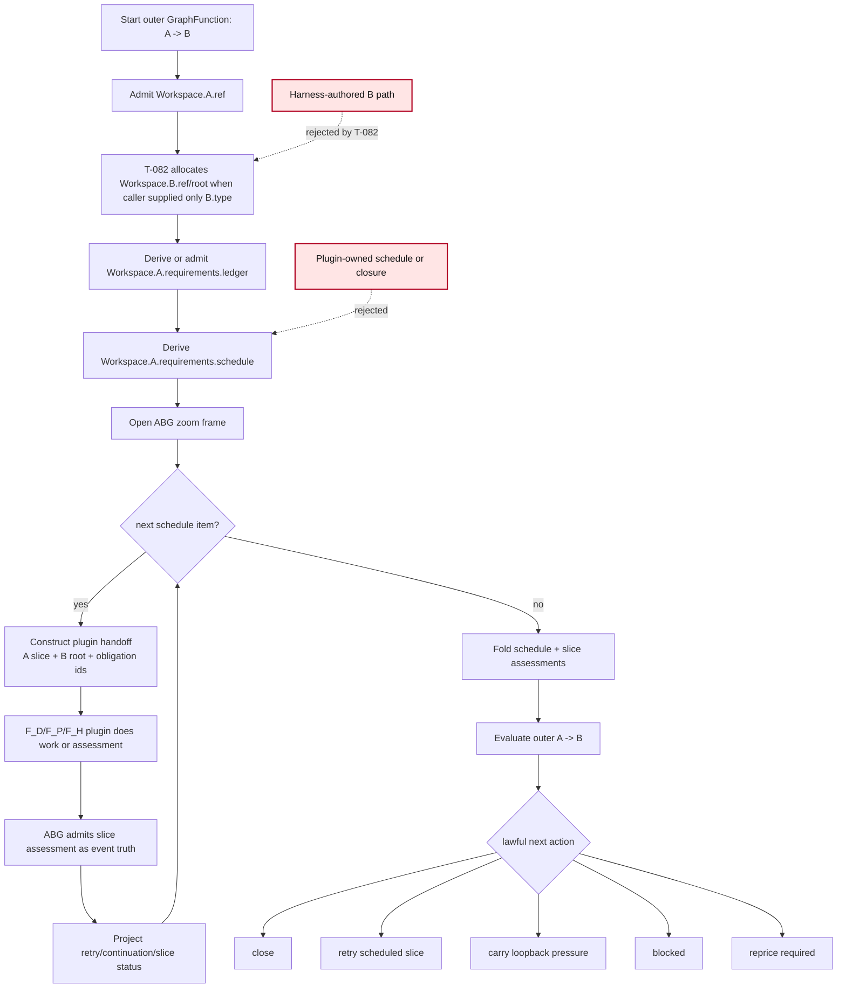

# T-100: Zoomed Workspace-Asset Obligation Schedule And Foldback Evaluation

## STDO Triage

### First Missing Layer

Requirement.

T-070 established that zoom and fold are not new interpreter words. They map to
existing GTL/ODD operations:

- zoom in: refinement or substitution of an outer edge by an inner graph
  function while preserving the outer contract
- zoom out: explicit typed projection or comparison over replay-visible
  evidence
- fold: `fan_in`, recursion foldback, or an explicit reducer graph function
  over a vector boundary

The missing layer now is not the word "zoom". The missing layer is ABG runtime
law for a repeatable, workspace-visible building block:

```text
outer A -> B graph function
  -> open zoom frame
  -> publish or admit Workspace.A.requirements.ledger
  -> publish or admit Workspace.A.requirements.schedule
  -> traverse finite scheduled slices through plugins
  -> fold slice evidence back into an outer A -> B evaluation
```

### Lawful Re-Entry

`requirement_reprice`.

Existing requirements cover frames, lineage, graph functions, events, binding,
and provenance. They do not yet explicitly say that ABG owns the injected
workspace-visible obligation schedule and foldback evaluation carrier for this
repeatable traversal pattern.

## Proposal Under Review

The operator wants a small building block capability that can be tested outside
the full SDLC product:

1. Define a sandbox test environment.
2. Use workspaces to manually trigger test scenarios, observe results, and
   tune them.
3. Keep ABG as engine and GTL as language.
4. Use plugins for callouts to agentic coders.
5. Make `Workspace.A.requirements.ledger` and
   `Workspace.A.requirements.schedule` inspectable assets.
6. Treat `Workspace.system` as the system/runtime plane that maps to
   `.ai-workspace`.
7. Zoom out through a foldback evaluation of the outer `A -> B` traversal.

This ticket captures the version of that proposal where ABG owns schedule,
frame, event, projection, and foldback truth. It rejects the alternative where
the additional assurance is baked into an opaque plugin capability.

## Relationship To odd_sdlc T-109

The purpose of this ticket is to produce the ABG/GTL design building block that
can solve the odd_sdlc T-109 parity problem.

The controlling odd_sdlc analysis is:

`/Users/jim/src/apps/odd_sdlc/.ai-workspace/comments/codex/20260502T022427AEST_test35_test65_edge_parity_gap_analysis.md`

That post identifies the test35 success algorithm:

1. GTL declares edge obligations.
2. Worker produces artifact plus fulfillment assessments.
3. Runtime builds a published fulfillment ledger.
4. Interpreter projects edge convergence from the ledger.
5. Incomplete obligations fail edge closure but remain typed.
6. Valid artifacts can be salvaged across transport failure.
7. Later failed retries do not erase earlier admitted edge-converged facts.
8. Traversal reaches code, tests, run archive, release, and execution-result
   surfaces.

It also identifies the test65 failure mode:

1. TypeScript reaches vector 8, `derive_implementation_design_surface`.
2. The first attempt produces an artifact and base postflight passes.
3. Assurance detects missing requirement evidence and correctly creates
   `retry_same_edge` pressure.
4. The retry worker is silent and becomes `silent_worker_inactivity`.
5. The run stops at `triage_gap` and does not reach downstream stack, module,
   schedule, code, test, archive, release, or execution-result edges.

T-100 is the design route for making that failure impossible at the ABG/GTL
building-block layer. The outer edge must zoom into a finite, inspectable,
replay-visible schedule over `Workspace.A.requirements.ledger`; plugins may do
slice construction or assessment, but the foldback from scheduled slice truth
to outer `A -> B` evaluation must be ABG-owned runtime projection.

For odd_sdlc T-109, the concrete mapping is:

| T-109 need | T-100 building block |
| --- | --- |
| published edge fulfillment ledger | `Workspace.A.requirements.ledger` plus per-slice assessment events folded into outer evaluation |
| missing requirements remain edge pressure | schedule items remain open/retryable until folded closed or typed exhausted |
| worker silence is not the semantic answer | worker/runtime failure attaches to the slice attempt, not to the outer semantic closure |
| prior admitted edge convergence is not erased | foldback projection preserves admitted slice/edge facts until governed reprice or supersession |
| materialization beyond runtime markdown | T-082 allocates B root and T-100 observes plugin writes under that root |

This ticket is therefore not a generic abstraction exercise. It is the
candidate ABG/GTL design answer for T-109, kept in abiogenesis because the
missing primitive belongs to ABG/GTL rather than odd_sdlc-local controller
logic.

## Relationship To T-082

T-082 is the lower building block:

```text
input asset binding + graph function output declaration
  -> ABG-allocated output asset instance/root
```

This ticket consumes that building block:

```text
Workspace.A.ref + ABG-allocated Workspace.B.ref/root
  -> Workspace.A.requirements.ledger
  -> Workspace.A.requirements.schedule
  -> scheduled slice traversal
  -> foldback evaluation of A -> B
```

T-082 must not absorb this ticket's assurance law. T-082 owns output instance
allocation and binding. T-100 owns the zoomed traversal schedule and foldback
evaluation pattern over those allocated assets.

## Ownership Rule

| Surface | Owner |
| --- | --- |
| Graph-function outer A-to-B contract | GTL |
| Refinement/substitution/fold declaration | GTL |
| Workspace root and admitted asset refs | ABG binding |
| `Workspace.system` projection over `.ai-workspace` | ABG runtime projection |
| Output B allocation root | ABG, through T-082 |
| `Workspace.A.requirements.ledger` carrier | ABG runtime/product-neutral carrier shape, populated by declared functions/plugins |
| `Workspace.A.requirements.schedule` carrier | ABG runtime schedule carrier over finite traversal slices |
| Slice construction or assessment work | F_D/F_P/F_H plugins |
| Slice events, retry state, continuation, lineage | ABG |
| Outer A-to-B foldback projection | ABG projection over schedule and slice evidence |
| Domain meaning of an obligation | downstream product/domain evaluator |

Plugins may construct, assess, or propose evidence. Plugins may not own:

- the schedule authority
- emitted runtime truth
- the outer closure decision
- retry/continuation state
- foldback projection

## Carrier Model To Design

Minimum carrier families:

- `WorkspaceAssetBinding`
- `WorkspaceSystemProjection`
- `ObligationLedgerAsset`
- `ObligationLedgerRow`
- `ObligationScheduleAsset`
- `ObligationScheduleItem`
- `ZoomFrameOpened`
- `ScheduledSliceDispatch`
- `ScheduledSliceAssessment`
- `ZoomFoldbackEvaluation`
- `OuterTraversalEvaluation`

The carrier names may change during design, but the roles may not collapse.

## Target Functional Shape

The TypeScript solution must be primarily pure-function shaped:

```text
admitWorkspaceAssetBinding(raw, workspace) -> Result<WorkspaceAssetBinding>
deriveObligationLedger(A, graphFunction, context) -> Result<ObligationLedgerAsset>
deriveObligationSchedule(ledger, policy) -> Result<ObligationScheduleAsset>
openZoomFrame(outerBasis, ledger, schedule) -> Result<ZoomFrame>
deriveNextScheduledSlice(schedule, projection) -> SliceDecision
constructPluginHandoff(slice, bindings, outputRoot) -> PluginHandoff
admitSliceAssessment(pluginResult, slice) -> Result<ScheduledSliceAssessment>
foldScheduledSlices(schedule, assessments) -> Result<ZoomFoldbackEvaluation>
deriveOuterTraversalEvaluation(foldback) -> OuterTraversalEvaluation
decideNext(evaluation) -> AdvancementTransition
```

Effects must stay behind adapters:

- id/time generation
- filesystem observation
- plugin/process dispatch
- event append
- workspace asset publication
- CLI rendering

## Mermaid Flow



## Minimal Sandbox Proof

Create a TypeScript sandbox scenario that can be run repeatedly without the
full SDLC product:

```text
A = requirements_surface
B = design_surface
```

The sandbox must:

1. Create a workspace with an admitted `Workspace.A.ref`.
2. Start a graph function with `A.ref` and `B.type`, not a concrete B path.
3. Use T-082 allocation to mint `Workspace.B.ref/root`.
4. Publish or admit `Workspace.A.requirements.ledger`.
5. Derive `Workspace.A.requirements.schedule` as finite schedule items.
6. Dispatch a fake or local F_P transform over one or more schedule items.
7. Observe transform output under the allocated B root only.
8. Run a domain/F_P quality assessment over each `A.req_i -> B.result_i`
   slice by reading the materialized B artifact.
9. Admit per-slice assessments as runtime events only after the domain/F_P
   quality assessor accepts the requirement-specific transform.
10. Fold schedule and slice evidence into an outer A-to-B evaluation.
11. Let the operator inspect workspace/system assets under `.ai-workspace`.

The current first sandbox uses a bounded local transform that returns random
fixed-feature batches, then a live domain/F_P quality-assessment fixture
evaluates the materialized design artifact requirement by requirement. F_D is
limited to deterministic carrier, schema, path, digest, and materialization
checks; it is not the semantic judge of requirement satisfaction.
A later proof may swap in a live agentic coder F_P plugin without changing the
ABG/GTL law.

## Acceptance Criteria

- AC-1: requirements are updated or explicitly judged sufficient for
  workspace-visible obligation ledger, schedule, zoom frame, and foldback
  evaluation ownership.
- AC-2: a TypeScript design document defines the carrier model, event law,
  projection law, plugin boundary, and relationship to T-082.
- AC-3: module/IACS proof assigns exactly one owner to each carrier and rejects
  plugin-owned schedule or closure.
- AC-4: `Workspace.system` is defined as ABG runtime projection over
  `.ai-workspace`, not a rival authority plane.
- AC-5: `Workspace.A.requirements.ledger` and
  `Workspace.A.requirements.schedule` are represented as inspectable assets or
  projections with stable refs.
- AC-6: the TypeScript implementation exposes pure functions for deriving
  ledger, schedule, slice decisions, foldback evaluation, and next transition.
- AC-7: effect adapters isolate filesystem, event append, plugin dispatch,
  id/time generation, and CLI rendering.
- AC-8: schedule and foldback state are replay-derived from emitted runtime
  events plus declared GTL surfaces.
- AC-9: plugins cannot emit runtime events, select next slice, close the outer
  traversal, own retry, or mutate schedule authority.
- AC-10: the sandbox proves input-only B allocation through T-082 and fails if
  the caller or plugin supplies a hidden B path outside the allocated root.
- AC-11: the sandbox can be manually rerun after changing the ledger or
  schedule fixture and shows the changed projection in `gaps` or an equivalent
  runtime projection.
- AC-11a: the eval-loop sandbox keeps transform output non-authoritative;
  per-slice closure is admitted only after a domain/F_P quality assessor reads
  the materialized artifact and accepts the scheduled `A.req_i -> B.result_i`
  obligation evidence. Deterministic checks may validate mechanics, not replace
  semantic quality assessment.
- AC-12: negative tests cover missing A binding, invalid schedule item,
  plugin write outside allocated root, missing slice assessment, and conflicting
  foldback evidence.
- AC-13: final STDO review confirms the building block does not recreate a
  product-local controller, harness-owned scheduler, or plugin-owned closure.
- AC-14: design review against the odd_sdlc T-109 parity analysis confirms the
  building block can represent same-edge retry pressure, runtime-failure
  separation, prior admitted convergence preservation, and downstream
  materialization progress.

## Open Design Questions

- Is `Workspace.A.requirements.ledger` an admitted asset, a projection, or both
  with one authoritative source?
- Is `Workspace.A.requirements.schedule` derived only from the ledger and
  policy, or may product/domain declarations influence the schedule shape?
- Should the schedule item identity be stable under ledger edits, or should a
  ledger edit force schedule supersession?
- Is foldback represented as a graph-function reducer, recursion foldback, or
  both depending on the declared outer graph-function shape?
- What is the minimal public operator surface for manual test tuning: start
  plus gaps, or a dedicated sandbox projection command?

## Non-Goals

- Do not define SDLC-specific requirement semantics inside ABG.
- Do not require live agentic coder proof for the first sandbox.
- Do not replace T-082 output allocation.
- Do not introduce a second event log under `Workspace.system`.
- Do not make zoom/fold vocabulary new interpreter magic.

## Implementation Checkpoint: 2026-05-02

First TypeScript slice implemented under the shared T-082/T-100 design:

- `code/src/abg/m03/contracts/workspace_zoom_foldback.ts`
- `code/src/abg/m03/contracts/output_allocation.ts`
- `code/src/abg/m03/contracts/carriers.ts`
- `code/src/abg/m03/contracts/event_admission.ts`
- `code/src/abg/m03/contracts/projection.ts`
- `code/src/abg/m03/contracts/retry_frontier.ts`
- `code/src/abg/m03/contracts/index.ts`
- `test_env/tests/test_t100_workspace_zoom_foldback_unit.test.mjs`
- `test_env/tests/test_t082_output_allocation_unit.test.mjs`
- `test_env/sandbox/test_t100_mini_data_mapper_lifecycle_sandbox.test.mjs`

Implemented runtime law:

- `WorkspaceSystemProjection`
- `ObligationLedgerAsset`
- `ObligationScheduleAsset`
- `ZoomFrame`
- `ScheduledSliceDispatch`
- `ScheduledSliceAssessment`
- `ZoomFoldbackEvaluation`
- `OuterTraversalEvaluation`
- `WorkspaceZoomProjection`
- `workspace_obligation_ledger_admitted`
- `workspace_obligation_schedule_derived`
- `zoom_frame_opened`
- `scheduled_slice_dispatched`
- `scheduled_slice_assessed`
- `zoom_foldback_evaluated`

Proof covered:

- workspace-visible ledger and schedule refs are stable and inspectable
- ABG opens the zoom frame over admitted A and T-082-allocated B
- plugins receive handoff data but do not own schedule or closure
- schedule plus admitted slice assessments folds deterministically to outer
  evaluation
- missing assessment creates same-edge retry pressure, not closure
- fulfilled slice assessment requires admitted evidence refs and every scheduled
  required output ref
- replay-derived foldback projection rejects a contradictory asserted
  `zoom_foldback_evaluated` event
- zoom frame opening rejects mismatched basis, graph-function, workspace, ledger,
  schedule, or output-allocation lineage
- scheduled slice handoff rejects a T-082 manifest that does not include the
  zoom frame's output asset
- runtime failure before fulfillment remains retryable
- runtime failure after prior fulfillment does not erase the fulfilled semantic
  fact
- conflicting semantic assessments at the same latest attempt, including
  `partial` plus `blocked`, produce `reprice_required`
- domain-eval filesystem sandbox writes a mini data-mapper lifecycle under
  `test_env/test_runs/t100_mini_data_mapper_lifecycle/<timestamp>`
- sandbox starts from 10 bootstrapped requirements, allocates design,
  implementation, test-suite, and run-archive outputs through T-082, lets the
  transform return bounded random fixed-feature batches, requires a domain/F_P
  quality assessment over the materialized design artifact before admitting
  slice assessments, folds the 10 requirement schedule through T-100, and
  persists transform/eval/foldback, event/projection/system evidence for manual
  inspection
- five-rule parity lane proves the test35 load-bearing algorithm: named
  five-term closure predicate, latest-assessed-per-slice projection, typed
  retry allowlist, artifact salvage on transport failure, and behavioral
  finding-class split without promoting F_D to semantic judge

Validation:

```text
npm run build:semantic
node --test test_env/tests/test_t082_output_allocation_unit.test.mjs test_env/tests/test_t100_workspace_zoom_foldback_unit.test.mjs
npm run lint:semantic
npm run test:t100
npm run test:t100:sandbox
npm run test:t100:five-rule
npm run test:t100:test35-parity
npm run test:semantic
```

Observed validation result on 2026-05-02:

- `npm run lint:semantic` passed
- `npm run test:t100` passed, 9/9 after adding the mini data-mapper lifecycle
  sandbox lane
- `npm run test:t100:sandbox` passed, 1/1; latest observed sandbox proof used
  random fixed-feature transform attempts and domain/F_P quality assessments
  over the materialized design artifact before final close
- `npm run test:t100:five-rule` passed, 6/6; live F_P was not enabled, so R1
  used the controlled F_P fixture and the algebra assertions still ran
- `npm run test:t100:test35-parity` passed, 15/15 across unit, sandbox, and
  five-rule parity lanes
- `npm run test:semantic` passed, 318/318

Remaining active gate:

- public/manual sandbox path has a first live-eval filesystem proof under
  `test_runs`; closure still needs the chosen operator-facing rerun/tuning
  command contract if this sandbox is to become the public review loop rather
  than a test-only lane.
- odd_sdlc T-109 still needs downstream consumption of this ABG building block;
  this ticket now supplies the runnable graph-function parity proof for the
  test35 semantics, but it does not itself rewrite odd_sdlc traversal.

## Closure Disposition: 2026-05-02

T-100 is closed for the ABIogenesis TypeScript source scope after the five-rule
parity repair.

Closure evidence:

- `ZoomFoldbackEvaluation` exposes the named five-term closure predicate:
  `carryConverged`, `fulfillmentConverged`, `admitted`,
  `targetCertificationPassed`, and `fdRecheckPassed`.
- Slice foldback uses latest semantic assessment truth per scheduled slice
  while preserving prior assessments in event history.
- Runtime retry is gated by the typed allowlist
  `{transport_failure, no_output, contract_failure}`.
- Artifact salvage is representable as fulfilled semantic assessment with a
  retryable runtime-failure annotation when a valid artifact survives transport
  failure.
- `findingClass` preserves the distinction between fulfilled,
  semantic-fulfillment gap, and traceability-reference gap.
- The mini data-mapper lifecycle sandbox writes workspace-visible ledger,
  schedule, assessment, foldback, event, projection, eval, summary, and review
  artifacts under `test_env/test_runs`.

Verification rerun:

- `npm run test:t100:test35-parity` passed, 15/15.
- `npm run test:t102` passed, 7/7 including repeated T-100 sandbox proof.
- `npm run test:semantic` passed, 349/349.
- `npm run lint:semantic` passed.

Downstream boundary:

- This closes the ABG building block and test35-parity proof surface. It does
  not rewrite `odd_sdlc` traversal; downstream consumption remains owned by the
  downstream SDLC ticket line.
