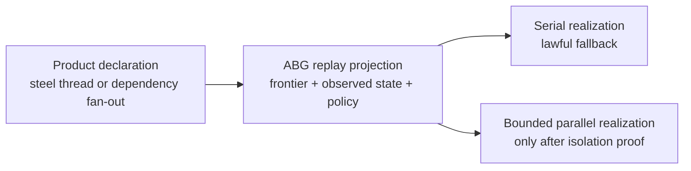
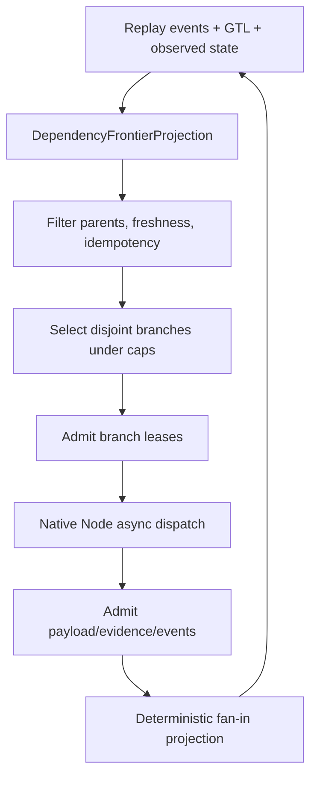

# T-141: Declare Event-Sourced Saga Frontier And Runtime Realization Transparency

## Entry

The immediate pressure is generic: a downstream product can know which
construction path is the steel thread and which work branches are
dependency-isolated. That product knowledge should be declared as authority. It
should not force a particular runtime realization or make ABG depend on the
downstream product's domain.

The ABG axiom to declare is:

```text
same product authority
same dependency declarations
same closure expectations

serial if isolation is not proven or not exploited
parallel only where isolation is proven and admitted
```

A downstream product may create a steel thread or dependency fan-out because it
owns the content. ABG may exploit that fan-out with bounded parallel runtime
execution, or may run the same admitted plan serially. The product meaning does
not change.

That axiom turns async execution into an ABG runtime admission consequence, not
a second product model and not a product-local orchestration burden.



## STDO Triage

### S - Specification Method

First missing layer: requirement.

Current ABG requirements already state:

- event truth is append-only and `emit()` is the only lawful write path;
- projection is replay-derived current truth;
- fan-out/fan-in preserve lineage;
- workers may run in parallel only with disjoint write territories;
- retry and liveness decisions consume admitted runtime truth;
- observed workspace/register/projection reads must be admitted before they
  affect selection, routing, pressure, or closure.

The missing constitutional truth is the runtime-realization transparency axiom:
a product-declared steel-thread or dependency fan-out is an admitted traversal
opportunity. ABG decides the lawful runtime realization from replay-derived
frontier, branch, lease, idempotency, liveness, and write-territory truth.

This is therefore `requirement_reprice`. It must update requirement/design
surfaces before code.

### T - Ticket Method

This ticket owns the durable ABG work item. It is self-contained in ABG and
does not close any downstream product ticket directly. It supplies the ABG
substrate downstream products can consume later.

Closure must prove the axiom across both cases:

- the same dependency fan-out plan runs serially and preserves product meaning;
- the same plan runs bounded-parallel only when ABG proves isolation and
  idempotent replay safety.

### D - Design Module Method

Design must split the work into prime carrier/projection/effect surfaces.
This ticket is under `DESIGN_MODULE_METHOD.md` Prime Law and functional
realization review. System parallelism must be a Functional Programming Prime
solution: immutable admitted carriers, pure replay-derived projections, and
new-value semantic state transitions. Native promises coordinate effects; they
do not own semantic truth.

Irreducible candidate carrier/projection set:

- `DependencyFrontierProjection`;
- `BranchRef`;
- `BranchAttemptRef`;
- `BranchIdempotencyKey`;
- `BranchLease`;
- `BranchExecutionPolicy`;
- `BranchLivenessProjection`;
- `WriteTerritoryConflictProjection`;
- `FanInProjection`;
- `PublicConstructionProgressProjection`.

These surfaces consume existing Event Calculus law. They must not introduce a
new saga calculus, new scheduler authority, or cloud-vendor workflow semantics.

Effect edges are restricted to observed-state admission, branch lease admission,
branch dispatch, payload/evidence admission, cancellation/interruption, and event
append. Semantic state remains replay-derived projection.

The shared mutable workspace remains an admitted reality of the effect edge.
The design must guard it with observed-state freshness, declared write territory
or output allocation, branch staging, idempotent payload admission, and
replay-visible publication. Workspace mutation is not readiness, selection,
fan-in, or closure authority by itself.

Carrier inheritance:

- T-139 `ConstructionPressurePackage` remains the branch dispatch pressure input
  carrier; T-141 does not replace it.
- T-136 observed-state records remain the authority for workspace/register/
  projection reads that affect branch readiness.
- T-129 `RuntimeWatchdogPolicy` and liveness projection remain the authority for
  leases, safety caps, retry budget, interruption, and watchdog disposition.
- T-120/T-121 Event Calculus law remains the projection substrate for all new
  branch/frontier fluents.
- T-126 temporal-scope work is not superseded; T-141 consumes temporal/liveness
  policy where it affects branch readiness, timeout, or continuation.

### O - ODD Method

The constructive carrier remains GTL graph-function work interpreted by ABG.

Product-owned ODD builders may supply domain dependency maps, steel-thread
selection, evidence expectations, and fan-in meaning. ABG owns traversal runtime,
branch identity, event causality, replay, projection, leases, retry, liveness,
transport, fan-in admission, and closure gating.

No downstream product should implement a private async worker loop to compensate
for missing ABG fan-out support.

## Runtime-Realization Transparency Axiom

The axiom is:

```text
Product declarations identify lawful work.
ABG realization decides how lawful work runs.
```

Consequences:

1. A product-declared steel thread is content authority, not a runtime command.
2. A product-declared dependency fan-out is content authority, not a concurrency
   mandate.
3. ABG may run a fan-out plan serially without changing product meaning.
4. ABG may run independent branches concurrently only after isolation is proved.
5. If write-territory, observed-state, idempotency, or fan-in safety is
   underdeclared, ABG serializes or blocks.
6. Serial fallback is lawful and must be replay-visible.
7. Parallel exploitation is an optimization/admission consequence, not a
   different product contract.
8. Functional Programming Prime immutability governs system parallelism.
9. Shared workspace mutation is an effect substrate, not scheduler truth.

## Event Calculus Boundary

ABG already uses Event Calculus for runtime truth. This ticket must preserve that
boundary.

Saga, frontier, branch, lease, timeout, cancellation, idempotency, fan-in, and
progress surfaces are candidate ABG event families, carriers, and projections
inside existing Event Calculus law:

```text
Happens(runtime event)
-> declared Initiates / Terminates / clipping law
-> replay-derived HoldsAt fluents
-> projection read model
-> lawful next command or terminal disposition
```

Non-goal: introduce a new saga calculus, scheduler calculus, or workflow-state
authority.

## Branch Identity And Idempotency

Idempotency is critical because ABG must remain correct under at-least-once
effect delivery, retries, late worker results, and crash recovery.

`BranchRef` must be stable for the logical branch. Attempts must be separate.

Candidate shape:

```text
BranchRef =
  primary:
    graph_call_id
    frame_id
    vector_index or action_ref
    branch_key
    fan_in_scope_ref
  replay convenience:
    work_key
    basis_id
    graph_function_id
    frame_lineage_id
    frame_attempt_id
    frontier_ref or frontier_digest

BranchAttemptRef =
  branch_ref
  attempt_ordinal
  retry_attempt_ref
  actor_invocation_ref when present
```

`branch_key` must come from declared graph/vector identity, declared fan-out item
identity, or an admitted product dependency row. It must not come from worker
prose, filenames, completion order, or transient runner state.

Every branch command/result admission needs an idempotency key derived from
logical command identity plus admitted input identity:

```text
IdempotencyKey =
  command_kind
  branch_ref
  branch_attempt_ref when attempt-scoped
  payload_ref or payload_digest when payload-scoped
  observed_state_ref set digest when state-dependent
  output_allocation_ref / write_territory_ref when write-dependent
```

Admission law:

- same idempotency key and same payload digest returns the prior logical
  admission result and does not create a second logical fact;
- same idempotency key and different payload digest is an idempotency conflict
  and fails closed through admitted rejection/correction truth;
- same `BranchRef` with a different `BranchAttemptRef` may legitimately produce
  a different payload; retry/supersession law decides which attempt is current;
- retry opens a new `BranchAttemptRef`, not a new logical `BranchRef`;
- late results from superseded, cancelled, expired, or compensated attempts are
  historical evidence only unless correction/reopen truth makes them current;
- fan-in consumes branch logical closure, not duplicate transport delivery.

The expected delivery model is at-least-once effects with idempotent admission.
Exactly-once transport must not be assumed.

## Dependency Frontier And Serial Fallback

`DependencyFrontierProjection` answers:

```text
Which branch work is lawful now?
Which parents prove readiness?
Which observed state proves current inputs?
Which write territory is allocated?
Which branches conflict?
Which branches may run together?
Which branches must serialize?
Which fan-in scope consumes the result?
Which idempotency keys already have admitted truth?
```

Default selection should:

1. filter to rows whose parents are closed or lawfully satisfied;
2. reject rows with stale or missing observed-state refs;
3. reject rows whose idempotency key is already admitted, rejected, or actively
   leased;
4. sort by declared priority, critical-path/dependency depth when present, then
   stable branch identity;
5. select a batch whose write territories are disjoint from already selected and
   active leased branches;
6. stop at declared resource caps;
7. if no lawful disjoint batch exists, serialize, yield, block, or escalate
   through projection.

Serial execution is the degenerate frontier case. It must remain lawful for the
same dependency declaration.

Ready rows that do not fit under current caps remain unleased frontier rows.
They are reconsidered after the next branch closure, lease expiry, policy change,
or observed-state update. ABG does not commit to a row until branch lease
admission succeeds.

`WriteTerritoryConflictProjection` should expose both:

- static conflicts derived from declared write roots/output allocation; and
- dynamic conflicts derived from active branch leases.

Static conflicts are planning truth. Dynamic conflicts are dispatch admission
truth.



## Reliability And Liveness Policy

The branch runner needs explicit policy carriers, but they consume existing
ABG system-level configuration and resolved runtime policy. This ticket must not
create a parallel configuration surface.

Existing authority to consume includes:

- visible runtime policy and policy/default law under `REQ-R-ABG3-POLICY`;
- the `abg_defaults` visible defaults family for configurable reference
  defaults;
- `RuntimeWatchdogPolicy` for leases, safety cap, retry budget, and default
  terminal actions;
- retry, liveness, continuation, and projection law.

Candidate compact carrier:

```text
BranchExecutionPolicy =
  retry_policy
  timeout_policy
  cancellation_policy
  resource_policy
  lease_policy
```

`BranchExecutionPolicy` may be a resolved view over the existing system-level
configuration surfaces. It is not a new hidden config source.

Retry policy must consume the existing retry allowlist:

```text
transport_failure
no_output
contract_failure
```

Other failure classes block, escalate, compensate, or re-enter according to
declared continuation and assurance law.

Timeout policy must distinguish no-output timeout, inactivity timeout, hard
safety cap, and F_H waiting state.

Cancellation policy must preserve cooperative signal, forceful termination,
grace interval, evidence preservation, and branch-attempt supersession truth.

Lease policy must preserve lease identity, ttl or freshness condition, renewal,
expiry projection, and crash recovery behavior.

Watchdog reactions are selected from `BranchExecutionPolicy` as resolved through
existing system-level policy/default surfaces. When policy is silent, retry
budget exhaustion defaults to `block` with non-progress evidence; product policy
may explicitly route to compensation, F_H escalation, or lawful re-entry.

Event-store unavailability is a hard semantic boundary. A runner that cannot
append or verify event admission may not dispatch new branch work or claim
closure.

## Fan-In And Public Progress

Fan-in is deterministic admission, not array concatenation after promises return.

Fan-in must preserve:

- included branch refs;
- parent/dependency refs;
- admitted branch outputs;
- ordering law or declared order irrelevance;
- conflict/merge/compensation policy;
- aggregate projection consumed downstream.

Default ordering is declared order when present, otherwise stable branch
identity. Wall-clock completion order is not authority unless explicitly
declared.

Branch output publication must be atomic from the downstream observer's
perspective. The concrete primitive may be same-filesystem rename,
content-addressed publish, or another admitted output-allocation mechanism, but
downstream branches may only observe the published/admitted output, not partial
staging writes.

The graph-function invocation becomes terminal only when replay projects an
outer-scope terminal disposition: all required branch/fan-in obligations are
closed or lawfully routed, assurance/closure projection admits `close`, `block`,
`escalate`, `reprice`, or equivalent terminal disposition, and the corresponding
terminal event/fact is admitted. Promise completion alone is not terminal truth.

`PublicConstructionProgressProjection` must expose branch/frontier state from
admitted truth only. Minimum row states:

- `blocked_by_parents`;
- `ready`;
- `leased`;
- `dispatched`;
- `awaiting_evidence`;
- `awaiting_human`;
- `retry_pending`;
- `compensated`;
- `closed`;
- `blocked`;
- `escalated`.

The progress projection is read-only. It must not become a controller.

## Work Plan

1. Update requirements for runtime-realization transparency, branch identity,
   idempotency, dependency frontier, serial fallback, and Event Calculus boundary.
2. Add or update design modules for frontier, branch identity/idempotency, branch
   execution policy, fan-in, write-territory conflict, and public progress.
3. Implement pure carrier/projection kernels before runner effects.
4. Strengthen dispatch/request carriers with branch refs, attempt refs,
   idempotency keys, observed-state refs, write territory, frontier refs, and
   fan-in refs.
5. Implement local dependency-ready saga runner with serial fallback and bounded
   disjoint branch execution.
6. Add deterministic tests for all closure criteria.
7. Add an ABG-contained scenario proof using admitted dependency-map input
   without product-local async orchestration.

## Implementation Progress

First slice landed:

- `specification/INTENT.md`
- `specification/GOALS.md`
- `specification/requirements/abg/REQ-R-ABG3-SAGA-FRONTIER.md`
- `specification/requirements/abg/REQ-R-ABG3-FP-CONSCIOUSNESS.md`
- `specification/PRODUCT.md`
- `specification/requirements/abg/README.md`
- `build_tenants/abiogenesis/typescript/design/M03_SAGA_FRONTIER_DERIVATION.md`
- `build_tenants/abiogenesis/typescript/design/M03_SAGA_FRONTIER_FIRST_SLICE_IACS.md`
- `build_tenants/abiogenesis/typescript/design/README.md`
- `build_tenants/abiogenesis/typescript/code/src/abg/m03/contracts/saga_frontier.ts`
- `build_tenants/abiogenesis/typescript/code/src/abg/m03/contracts/index.ts`
- `build_tenants/abiogenesis/typescript/code/src/abg/m03/contracts/carriers.ts`
- `build_tenants/abiogenesis/typescript/code/src/abg/m03/contracts/event_admission.ts`
- `build_tenants/abiogenesis/typescript/code/src/abg/m03/contracts/projection.ts`
- `build_tenants/abiogenesis/typescript/code/src/abg/m03/contracts/retry_frontier.ts`
- `build_tenants/abiogenesis/typescript/code/src/abg/m03/runner/saga_frontier_runner.ts`
- `build_tenants/abiogenesis/typescript/code/src/abg/m03/runner/index.ts`
- `build_tenants/abiogenesis/typescript/test_env/tests/test_t141_saga_frontier.test.mjs`

The slice is pure carrier/projection work. It proves serial fallback, bounded
disjoint selection, write-conflict serialization, parent dependency blocking,
observed-state blocking, idempotent duplicate admission, idempotency conflict,
retry-attempt separation, active lease blocking, lease-expiry recovery input,
completion-order-independent fan-in, underdeclared safety blocking, and output
allocation conflict serialization, event-backed lease projection, event-backed
payload/fan-in projection, native-promise serial fallback, native-promise
bounded fan-out, evented native lease/payload/release/fan-in emission, and
staging invisibility before matching payload admission. Construction-runner
consumption of the evented saga frontier, cancellation/evidence preservation,
physical publish/merge implementation, and broader policy consumption by the
runner remain successor-runtime work outside the minimal 3.8.0 RC substrate bar.

Functional Prime follow-up landed:

- requirement/design/ticket surfaces now cite `DESIGN_MODULE_METHOD.md` and
  declare system parallelism as an immutable semantic boundary over a shared
  mutable workspace effect substrate;
- `runNativeSagaFrontier(...)` now advances completed branches, batches, and
  result sets by frozen value replacement rather than mutable semantic
  accumulators;
- focused tests prove frontier, selection, and native runner results are frozen
  while branch tasks may still exercise native async effect work.

Review follow-up addressed:

- underdeclared frontier declarations with missing observed-state refs, missing
  write/output allocation proof, or missing idempotency keys now project as
  `underdeclared_safety` instead of `ready`;
- selection now treats output allocation as dispatch-conflict territory when no
  write territory is declared;
- active leased rows now seed dispatch conflicts with both write territory and
  output allocation refs, so output-only leases block ready siblings that target
  the same output;
- `WriteTerritoryConflictProjection` now reports static and dynamic conflicts
  over the unified dispatch-conflict ref set, including `output:*` refs;
- the policy carrier now exposes retry, timeout, cancellation, lease,
  worker/transport/resource cap, preemption, queueing, watchdog, and visible
  system-policy/default refs, and admits `maxRetryAttempts: 0` as an exhausted
  no-retry budget; runner consumption beyond `maxConcurrency` remains open for
  runtime closure.

Native runner slice landed:

- `runNativeSagaFrontier(...)` derives the frontier on each batch, selects
  disjoint ready rows under `BranchExecutionPolicy.maxConcurrency`, runs selected
  tasks with native promises, and marks completed branches for the next
  projection iteration.
- `runEventedNativeSagaFrontier(...)` wraps native dispatch with admitted
  branch lease acquired, branch payload admitted, branch lease released, and
  branch fan-in projected events emitted through ABG `emit(...)`.
- This proves the lawful tradeoff in code: max concurrency `1` is serial
  fallback over the same declarations; max concurrency `2+` may exploit only
  safe disjoint fan-out.

Async suite follow-up landed:

- `test:t141` now runs the full T-141 frontier contract plus async proof lane;
  `test:t141:async` runs only the async proof file.
- `test_t141_saga_frontier_async.test.mjs` proves native async serial/parallel
  transparency over the same dependency plan, lease-before-effect ordering,
  event-store failure before dispatch, deterministic fan-in after out-of-order
  branch completion, shared output serialization over a mutable effect target,
  stale/underdeclared no-dispatch behavior, replayed active-lease gating and
  recovery, and system max-concurrency caps over a wider fan-out.
- Review hardening added replay-visible leased output allocation and unified
  dispatch-conflict refs to branch lease events/projections, an async duplicate
  payload-delivery fan-in proof, evented max-concurrency parity, and explicit
  per-batch event-order coverage.
- Native task rejection after branch lease acquisition now emits replay-visible
  `branch_task_failed` truth and releases acquired leases before the evented
  runner returns a controlled failed-branch result. The async proof asserts that
  rejected branch tasks do not leave an active replayed lease behind and do not
  masquerade as scheduling deferrals.
- ABG-contained review fan-out scenario proof landed: ABG now has a synthetic
  and live test for the abstract shape `work surface -> configured reviewer
  fan-out -> finding reduction -> routing decision`, where reviewer branches run
  in parallel only because their declared output allocations are disjoint, and
  reducer/router branches wait for admitted parent closure.
- Synthetic async stress proof landed: a deterministic random dependency graph
  with 65 branches runs through the real evented native async runner as a
  50-branch initial fan-out, 10 reducer branches, and 5 terminal leaf branches.
  The proof asserts real max-active concurrency of 50, three replay-visible
  dependency batches, parent coverage across every layer, 65 acquired/payload/
  released event trios, three fan-in events, no active leases after replay, and
  exactly five terminal leaves.
- Live proof lane landed:

  - `test:t141:live` runs `test_env/live/test_t141_saga_frontier_live.test.mjs`
    with the Claude PTY transport profile.
  - The live lane has sunny-day coverage for disjoint live F_P branches running
    concurrently under `runEventedNativeSagaFrontier(...)`.
  - The live lane has negative coverage proving event-store append failure,
    stale observed state, and underdeclared safety rows do not start live-capable
    branch workers.
  - The live lane has live serialization coverage proving shared output
    allocation serializes two live F_P branches even when max concurrency is
    greater than one.
  - The live lane has an ABG-contained review fan-out scenario where two
    configured reviewer branches execute as live F_P calls and then feed
    abstract reducer and routing branches through the same replay-visible
    frontier/fan-in mechanics.
- RC live sweep on 2026-05-21 passed the unique live-script set:
  `test:live`, `test:live:uat`, `test:t087:live`, `test:t094:live`,
  `test:t100:five-rule`, `test:t107:data-mapper-live`, `test:t113:live`,
  `test:t119:live`, `test:t127:live`, `test:t132:live`, and
  `test:t141:live`.
- Live-suite hardening repaired two stale proof fixtures discovered by the RC
  sweep: T-094 now supplies the current GTL target-carrier defaults to payload
  ledger projection, and T-113 now asserts replay-visible runtime activity
  probes between actor start and actor exit.
- Self-review disposition after the RC sweep:
  - the T-113 helper requires at least one replay-visible
    `runtime_activity_probe_observed` event instead of merely allowing probes;
  - T-094 loads target-carrier defaults at the projection call site instead of
    caching them at module import;
  - branch task failure after lease acquisition is implemented in code and
    tests rather than carried as a prose-only caveat;
  - failed branch results are reported through `failedBranchRefs`, not
    `deferredBranchRefs`, so scheduling deferral and branch failure remain
    separate replay/result concepts.
- Minimal ABG RC closure pass landed on 2026-05-21:
  - downstream-product consumer proof was removed from the T-141 closure bar;
  - synthetic and live review fan-out scenarios are ABG-contained and no longer
    cite downstream product tickets, reviewer refs, or work-surface refs;
  - `runEventedNativeSagaFrontier(...)` no longer halts the whole frontier after
    one branch task failure; independent rows continue while failed parents keep
    dependents blocked;
  - failed native branch tasks preserve declared failure evidence refs into
    replay-visible `branch_task_failed` truth;
  - `runNativeSagaFrontier(...)` now has symmetric branch-failure handling and
    reports failed branch refs instead of throwing the whole wide fan-out.
- Minimal ABG RC verification passed:
  - `npm run build:semantic`
  - `npm run lint:semantic`
  - `npm run lint:test-harness`
  - `npm run test:t141` - 34/34
  - `npm run test:semantic` - 597/597
  - `npm run test:t141:live` - 5/5

## Acceptance Proofs

Required tests/proofs:

1. serial equivalence for a graph with no independent branches;
2. serial execution of a product-declared dependency fan-out preserves product
   meaning;
3. dependency blocking prevents child dispatch before parent closure;
4. write conflict serialization prevents overlapping write branches from running
   concurrently;
5. read overlap plus disjoint writes permits bounded concurrency;
6. idempotent duplicate admission admits one logical branch result;
7. late result after retry remains historical unless correction/reopen makes it
   current;
8. lease expiry recovery permits a fresh attempt after runner crash;
9. retry budget exhaustion routes by declared policy;
10. hard timeout/cancellation emits liveness and evidence-preservation truth;
11. fan-in remains deterministic across different branch completion orders;
12. observed-state freshness rejects stale workspace state before dispatch;
13. mid-write abort does not expose partial staged output downstream;
14. public progress projection answers mid-flight state from replay truth;
15. ABG-contained dependency-map scenario proves steel-thread then
   dependency-isolated fan-out without any downstream product owning async
   runtime mechanics.

## Product Boundary

Downstream products own:

- product dependency meaning;
- dependency maps;
- steel-thread or parallel traversal selection;
- product target/output/evidence expectations;
- product fan-in meaning.

ABG owns:

- runtime realization;
- branch identity and idempotency;
- Event Calculus event/projection truth;
- observed-state admission;
- branch leases and liveness;
- retry, cancellation, interruption, and compensation routing;
- write-territory-safe concurrency;
- deterministic fan-in admission;
- public progress projection.

This is the lawful tradeoff: product-declared parallelism is an opportunity for
ABG to exploit, not an obligation for ABG to execute concurrently and not a
reason for the product to implement private async orchestration.
