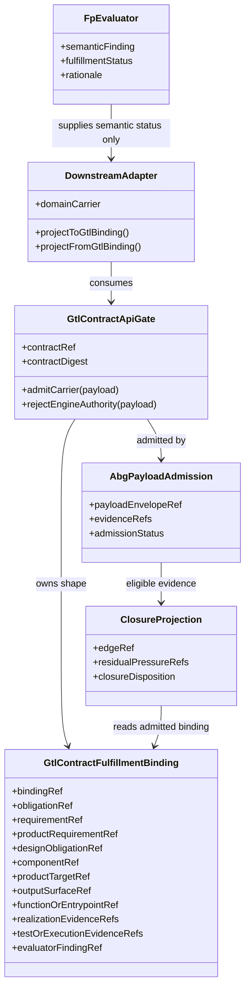
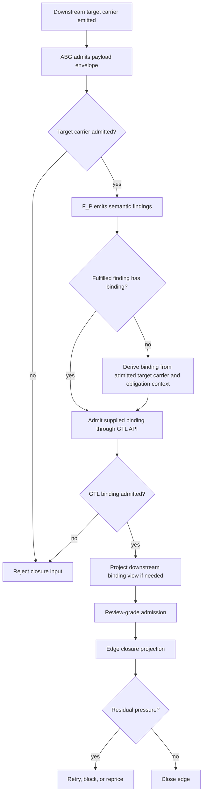
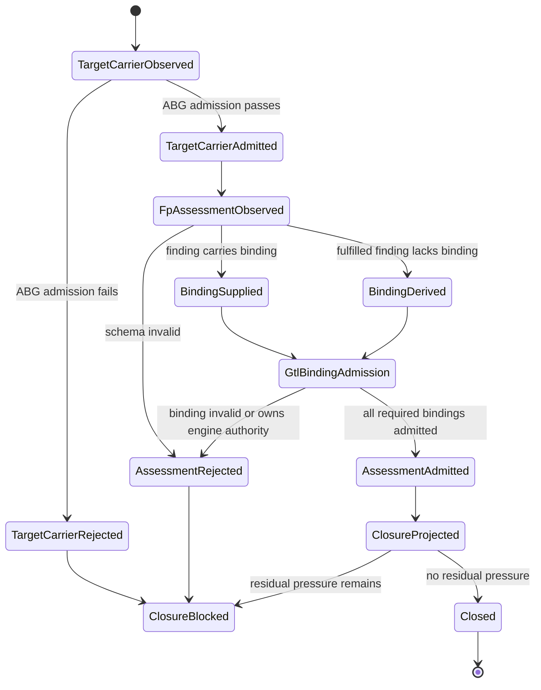

# T-150: Promote Prompt Assets Into The GTL Typed Asset Interface

## Intake Triage

Smallest lawful re-entry point: `requirement_reprice`.

Reason: odd_sdlc T-191 proved the immediate prompt-control need, but its SDLC
register is a downstream prototype. The durable home is GTL: prompts are
renderer-backed typed assets produced from declared authority, contexts,
constructors, policy refs, and proof obligations. If GTL does not carry that
interface, each downstream ODD product will keep rebuilding its own prompt
asset registry and the system will drift back into a zoo of local prompt
types.

This is not an ABG runtime decision and not F_D semantic evaluation. GTL
declares the typed asset interface. ABG and downstream runtimes may admit,
project, render, and replay those declarations. F_P still owns semantic
construction or evaluation judgment.

## Target Model

Extend the GTL typed asset surface, without adding a new topology prime, so a
Node or GraphFunction/GraphVector output can declare a renderer-backed prompt
asset with these subordinate contracts:

- asset kind and schema ref
- required contexts and installed standards or compression refs
- constructor refs and input asset kinds
- renderer refs and rendered-view digest policy
- section/part kinds for rendered assets
- clause/fragment kinds for rendered assets
- opaque authority-kind refs grouped into normal, bounded fallback, and
  forbidden routine slots
- fallback precondition refs
- proof obligation refs
- output contract refs

The primitive remains `AssetSurface`. Prompt assets are one declared asset
surface shape, not a new GTL public work carrier.

## Boundary Rules

- GTL declares prompt asset interface truth.
- GTL admission validates declaration shape: slot disposition labels,
  fallback-precondition presence, refs, constructor refs, renderer refs, and
  proof refs.
- ABG interprets declarations, admits payloads/events, projects replay truth,
  and enforces runtime authority use through assurance/policy contracts.
- Downstream products bind domain-specific prompt clauses and product authority
  to the GTL interface.
- F_D may validate envelope, declared metadata, schema, digest, refs, and
  fallback-policy shape.
- F_D must not infer semantic meaning from rendered prompt text.
- F_P owns semantic judgment inside the declared prompt contract.

## Round Addendum: GTL Contract API Gate For Prompt And Review Handoff

### Trigger Evidence

The odd_sdlc T-132 hello-world live lane proved the product behavior but still
blocked at closure. The component-code worker produced source, test, and an
admitted component-depth target carrier. The F_P review-grade assessment marked
the edge passed, but omitted repeated structural fulfillment bindings for
module, requirement, and source-asset findings. Prompt prose already instructed
the evaluator to include those bindings. The failure was therefore not missing
context. It was a boundary placement defect: F_P-shaped prose was carrying a
contract API field that belongs to deterministic GTL/ABG admission.

This addendum extends T-150 from renderer-backed prompt asset truth to the
adjacent handoff contract truth. The same single point of control applies:
typed GTL API carrier first, downstream adapter second, rendered prompt and MCP
surfaces as views or transports only.

### STDO Grade Design

#### Domain Model



#### Flow Diagram



#### State Diagram



#### Pseudocode

```text
function admitReviewHandoff(manifest, reviewAssessment, targetArtifact):
  targetAdmission = ABG.admitPayloadEnvelope(targetArtifact)

  parsedAssessment = parseAssessment(reviewAssessment)

  for finding in parsedAssessment.findings:
    if finding.fulfillmentStatus != "fulfilled":
      continue

    if manifest.targetAssetType requires contract fulfillment binding:
      if finding.fulfillmentBinding exists:
        binding = downstreamAdapter.projectToGtlBinding(finding.fulfillmentBinding)
      else:
        require targetAdmission.status == "admitted"
        binding = deriveGtlBinding(
          obligationContext = manifest.traversalObligationContext,
          targetCarrier = targetAdmission.payload,
          finding = finding
        )

      admittedBinding = GTL.admitContractFulfillmentBinding(binding)
      finding.fulfillmentBinding =
        downstreamAdapter.projectFromGtlBinding(admittedBinding)

  require no fulfilled finding lacks an admitted binding
  require no binding owns closure, event, ledger, projection, or traversal authority
  return admitted assessment as closure input
```

The rule is intentionally asymmetric. F_P may decide whether an obligation is
fulfilled, partial, blocked, or unassessed. F_D owns whether a fulfilled claim
has an admitted contract binding to a target carrier, requirement, component,
surface, and evidence refs.

### Prime Law Confirmation

This change does not create a new GTL topology prime. It introduces a
subordinate contract API carrier under existing GTL interface and evaluator
law:

- `AssetSurface`, graph functions, graph vectors, modules, hooks, evaluators,
  and target carriers remain the public constructive surfaces.
- `GtlContractFulfillmentBinding` is not a traversal selector, ledger writer,
  event emitter, closure decider, or new work carrier.
- ABG remains the owner of payload admission, runtime facts, frames,
  traversal, replay, assurance projection, and closure mechanics.
- GTL owns the known deterministic contract ABI. Downstream products bind
  product meaning to that ABI through adapters.
- MCP, when introduced, can only act as a late-bound transport or discovery
  provider behind a GTL/MCP gate. MCP output cannot bypass GTL contract
  admission or become the source of contract truth.

Prime law therefore holds: this is API algebra inside existing GTL/ABG
surfaces, not a new prime and not an SDLC-local control plane.

### Sole Source Of Truth Audit Checklist

- [x] Exactly one exported GTL constructor/admitter owns contract fulfillment
  binding shape.
- [x] Downstream products may project domain-specific binding views, but those
  views must round-trip through the GTL carrier before closure.
- [x] Review-grade, prompt, and handoff prompts are rendered views over typed
  contract truth, not schema authority.
- [x] F_P outputs may supply semantic findings and rationale, but closure does
  not trust F_P to be the sole source for deterministic binding structure.
- [x] Missing fulfilled bindings are derived only from an admitted target
  carrier plus declared obligation context.
- [x] If the target carrier is missing or rejected, binding derivation fails
  closed and existing closure pressure remains.
- [x] No deterministic code infers obligation semantics from rendered Markdown.
- [x] No SDLC-local parser, JSON convention, or prompt registry can accept a
  binding that the GTL contract API rejects.
- [x] No admitted binding may contain engine authority fields: closure
  decision, events, ledgers, projections, traversal selection, or next-vector
  state.
- [x] MCP tools, if later added, must map to GTL contract inputs and be
  admitted through the same API gate.
- [x] Positive tests prove supplied and derived bindings admit through GTL.
- [x] Negative tests prove missing target carriers, missing realization
  evidence, undeclared requirement refs, and engine-authority fields reject.
- [x] Live or live-style proof shows a product run closes from admitted target
  carrier truth, not from prompt memory.

## Work Ledger

| id | task | closure proof | status |
| --- | --- | --- | --- |
| P-010 | Add or extend GTL requirements for full `AssetSurface` typed interface support. | `REQ-L-GTL3-ASSET-SURFACE` defines renderer-backed prompt asset declarations without making a new topology prime | complete |
| P-020 | Update GTL design surfaces with IACS and structural carrier diagram changes. | diagram shows `Node.assetSurface` plus subordinate prompt asset interface fields and no new public carrier | complete |
| P-030 | Extend TypeScript GTL carriers, constructors, admission, and serialization. | semantic build and tests prove declarations round-trip and invalid prompt asset interfaces fail admission | complete |
| P-040 | Add prompt asset declaration fixtures/tests. | tests cover normal authority, bounded fallback, forbidden routine authority, renderer refs, proof obligations, and chain composition | complete |
| P-050 | Define and prove downstream migration seam for odd_sdlc T-191. | odd_sdlc completed T-191 consumes the released GTL AssetSurface interface through `prompt_assets.ts`; production prompt sidecars are GTL Node/AssetSurface views and the retired SDLC prompt register/admitter are absent | complete |
| P-060 | Prove no F_D semantic drift. | tests/source review prove no Markdown parsing or semantic prompt classification in GTL/ABG deterministic code | complete |
| P-070 | Add GTL contract fulfillment binding API for prompt/review handoff. | TypeScript GTL constructor/admitter freezes binding shape, rejects engine authority, and exposes one package export | complete |
| P-080 | Consume the GTL binding gate in odd_sdlc review-grade closure. | component-code fulfilled findings with omitted or prompt-shaped structural bindings are admitted only when binding can be derived from an admitted component-depth target carrier | complete |
| P-090 | Prove single-control-point behavior. | focused ABG and odd_sdlc tests plus T-132 live prove positive derivation, prompt-null canonicalization, and negative fail-closed paths without MCP or prompt-memory schema authority | complete |

## Proof Requirements

- Static proof: `AssetSurface` remains subordinate to existing GTL carriers and
  does not become a new topology object or public execution target.
- Static proof: prompt asset declarations preserve constructor refs, renderer
  refs, authority kinds, fallback preconditions, proof obligations, and
  output contract refs through admission and serialization.
- Negative proof: forbidden-routine disposition shape and fallback authority
  without precondition fail GTL declaration admission; concrete downstream
  authority values are not embedded in GTL.
- Negative proof: rendered Markdown text is not parsed to infer clause type,
  authority kind, or semantic intent.
- Downstream proof: odd_sdlc T-191 can consume GTL prompt asset surface truth
  and remove or demote its local prompt register.
- Contract API proof: review and handoff fulfillment bindings are constructed
  and admitted through GTL before a downstream closure projection may consume
  them.
- Fail-closed proof: fulfilled findings without an explicit binding are
  canonicalized only when an admitted target carrier supplies the deterministic
  component, target, requirement, and evidence refs.

## Current Verification

- `npm run test:semantic` passes: 682/682, including the T-150 synthetic
  prompt-asset cases and existing M01/M02/M03+ semantic regressions.
- `npm run test:t150` passes: 7/7, including declaration-shape rejection,
  GTL source purity, local live-style rendered-view proof, graph-function
  chain composition, anti-topology guard, and M02 module publication.
- `npm run test:t009` passes: 25/25, proving M01 integration and canonical
  identity across existing graph-function composition paths.
- `npm run test:t010` passes: 5/5, proving M02 publication still preserves
  graph-function-first work truth.
- `npm run lint:semantic`, `npm run lint:test-harness`, direct ESLint over
  `test_env/tests/test_t150_gtl_prompt_asset_surface.test.mjs`, and
  `git diff --check` pass.
- `npm pack --dry-run` passes for `@abiogenesis/typescript-tenant@3.9.0-rc.12`.
- GTL does not embed downstream authority-kind values; the T-150 test scans the
  GTL carrier, constructor, admission, and serialization source for known
  SDLC-local values and Markdown parser drift.
- Prompt asset support remains subordinate to `AssetSurface`; the T-150 test
  guards against prompt-specific topology tokens in GTL production source and
  against `AssetSurface` promotion into M02 public work carriers.
- `npm run build:semantic` passes in
  `build_tenants/abiogenesis/typescript`.
- `node --test test_env/tests/test_t152_contract_fulfillment_binding_api.test.mjs`
  passes: 4/4. This proves the GTL contract fulfillment binding API is frozen,
  deterministic, admits serialized payloads, rejects missing realization
  evidence, and rejects engine-authority fields.
- Local verification pack built from the current source:
  `/tmp/abg-t150-pack/abiogenesis-typescript-tenant-3.9.0-rc.13.tgz`.
  It was installed into odd_sdlc with `npm install --no-save --package-lock=false`
  for downstream proof. A clean release snapshot and package pin update remain
  separate release work.
- `npm run build:semantic` passes in
  `/Users/jim/src/apps/odd_sdlc/build_tenants/typescript`.
- `node --test test_env/tests/test_t182_fp_review_grade_edge_fulfillment.test.mjs`
  passes: 15/15. This proves admitted target-carrier derivation, prompt-shaped
  null canonicalization, fail-closed rejection without a carrier, undeclared
  requirement rejection, and the existing review-grade closure gates.
- `node --test test_env/tests/test_t172_decomposition_admission.test.mjs test_env/tests/test_t182_fp_review_grade_edge_fulfillment.test.mjs`
  passes: 31/31. This preserves decomposition admission and review-grade
  handoff behavior together.
- `npm run test:t132:hello-world-live` passes from fresh run root
  `/Users/jim/src/apps/odd_sdlc/build_tenants/typescript/test_env/test_runs/scenario_t132_hello_world_js_live/20260607T061055177Z_pid90098`.
  The component-code edge
  `operator-runs/20260607T061946295Z_pid90098` has
  `targetCarrierAdmissionStatus: admitted`, `edgeResidualPressureRefs: []`,
  `sdlc_edge_closure_decision.disposition: close`, and
  `operator_summary.status: converged`.
- The two earlier live attempts in this round blocked on prompt-shaped binding
  parser boundaries (`requirementRef: null`, then
  `functionOrEntrypointRef: null`). Focused tests now encode both failure
  shapes, and the final live run closes without `review_grade_assessment_invalid`.
- `node --test test_env/tests/test_t191_typed_prompt_assets.test.mjs` passes
  in `/Users/jim/src/apps/odd_sdlc/build_tenants/typescript`: 10/10. This
  proves odd_sdlc pins `@abiogenesis/typescript-tenant@3.9.0-rc.13`, imports
  `constructAssetSurface`, `constructNode`, and `admitAssetSurface` from the
  released package, retires `SDLC_PROMPT_ASSET_TYPED_REGISTER` and
  `admitSdlcPromptInvocationAsset`, archives prompt asset sidecars, and keeps
  prompt construction on the F_D carrier side rather than rendered-Markdown
  parsing.
- P-050 is complete. The contract API gate addendum is implemented and
  live-proven; the downstream prompt AssetSurface steel thread is implemented
  and focused-test proven through completed odd_sdlc T-191.

## Depth Review Fix - 2026-06-07

Deep review found one remaining single-control-point defect in the contract API
gate:

- `admitGtlContractFulfillmentBinding(...)` rejected engine-authority fields,
  but the exported `constructGtlContractFulfillmentBinding(...)` constructor did
  not run the same check. A JavaScript caller or downstream adapter using a
  spread payload could pass `closureDecision`, `events`, `ledger`, traversal, or
  next-vector fields into the constructor and receive a frozen binding with the
  illegal fields silently stripped. That made admission stricter than the public
  constructor and weakened the "one known GTL API gate" claim.

Fix:

- `constructGtlContractFulfillmentBinding(...)` now rejects forbidden
  engine-authority fields with the same guard used by admission.
- `test_t152_contract_fulfillment_binding_api.test.mjs` now proves both
  constructor-level and admission-level rejection.

Verification:

- `npm run build:semantic` passed.
- `npm run test:t150` passed `7/7`.
- `node --test test_env/tests/test_t152_contract_fulfillment_binding_api.test.mjs`
  passed `4/4`.
- Implementation-time snapshot: `npm run test:semantic` passed `717/717`.
- Subsequent review rerun reported `npm run test:semantic` passed `721/721`.
- `git diff --check` clean.

## Final Close Proof - 2026-06-07

Close-readiness review found that the contract API gate was locally fixed but
not final-pack/downstream proven. Final implementation and proof close that
boundary:

- `constructGtlContractFulfillmentBinding(...)` and
  `admitGtlContractFulfillmentBinding(...)` now share the same forbidden
  engine-authority guard, extended across closure, event, ledger, runtime
  projection, graph call/frame, terminal, transition, and next-vector fields.
- T-150 tests now prove the m02 binding API is importable through the public
  package surface, deterministic, frozen, and fail-closed through both
  constructor and admission paths.
- A final temporary package was cut from the current ABG source at
  `/tmp/abg-t150-final-pack/abiogenesis-typescript-tenant-3.9.0-rc.13.tgz`.
  `npm pack --dry-run --json` reported `403` package files and confirmed the
  m02 compute-notation API, shared agent transport, and M04 lever-resolution
  event files are included.
- The final package was installed into the odd_sdlc TypeScript tenant with
  `npm install --no-save --package-lock=false`; package metadata was not saved.
- The consuming odd_sdlc adapter was migrated off the stale T-149
  `edgeCanClose` argument so it consumes the ABG fold through admitted rows
  instead of a product-supplied close flag.

Verification:

- `npm run lint:semantic` passed.
- `npm run test:semantic` passed `728/728`, `0` skipped, `0` todo.
- `npm run test:t150` passed `9/9`.
- Downstream proving-domain pack in
  `/Users/jim/src/apps/odd_sdlc/build_tenants/typescript` passed:
  `npm run build:semantic && node --test
  test_env/tests/test_t191_typed_prompt_assets.test.mjs
  test_env/tests/test_t182_fp_review_grade_edge_fulfillment.test.mjs
  test_env/tests/test_t172_decomposition_admission.test.mjs` -> `41/41`.
- `git diff --check` clean.

## Follow-On Moved To T-152 - 2026-06-08

The ABG-owned GTL program typecheck/admission function discovered during
odd_sdlc T-194 is not part of this completed T-150 closure. It is successor
scope under active ticket `T-152`.

T-150 closure is limited to the AssetSurface promotion and the typed prompt
asset steel thread. Any downstream claim that relies on
`typecheckGtlProgram(...)`, the `typecheck-gtl-program` CLI wrapper, or the
engine-authority vocabulary cleanup must close and release T-152 first.

## Notes

The current odd_sdlc T-191 source shape is acceptable as a proving-domain
bridge: constructor-first typed clauses, admission over declared metadata, and
Markdown as rendered view. This ticket exists to move that interface down into
GTL so the next downstream product does not rebuild it.
