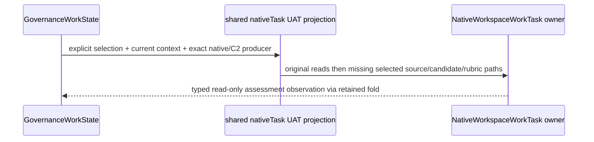

G08 Worker return — frozen Source and mechanical readiness only. Product: fixed fifteen-family 5.0, GOAL035/T287 Run02, six external Hello UAT workloads then original full Data Mapper. Frame: canonical #f-end-to-end-interface-integration; STDO2.5.1RC2 manifest 3d860ff4c1746f06ac25295a9e205cffb8e7725869615ac77cf2304b70ff2782. Source main@0b1187c40cca619b26b56b24b72cf8beb4841310; no WHAT/authority change.

Executive conjoined the closed [G08 Product/HOW triage](../triage-uat-08/return.md) (bd10c9792b9dadc61538f3481e93606a47aa7ee6b31dc156785522db4c550104) and [P08 proof triage](../triage-proof-08/return.md) (267a53329068d0840fce742a01297b3f405d1dbb62429160c2361575054de307). Original upper input81aa8687… explicitly selects its candidate and permits it in readRoots, but the adapter passed UAT readFirst unchanged into the stricter lower task. Original result5500 retains implementation_exception; the detailed TypeError is recovered constructor evidence, not retained exception text. C2 succeeds; UAT actor was never dispatched. Downstream parent mislocalization remains the registered P1; neither that constructor redesign nor any caller change is selected here. Earlier fixtures supplied the candidate in their read lists, and caller/context readiness did not test this mandatory lower membership join.

Existing authority is DL-I02 in [default-library HOW](../../../../../build_tenants/abiogenesis/typescript/design/T287_DEFAULT_GOVERNANCE_LIBRARY_DESIGN.md), lines158–165, and [native-work HOW](../../../../../build_tenants/abiogenesis/typescript/design/T287_NATIVE_WORKSPACE_WORK_DESIGN.md), lines204–211; canonical lower native task lines46–51 retains refusal law. Reuse their selected execution/assessment relation:

The only production change copies the original readFirst list and appends missing explicitly selected assessment source/candidate/rubric paths. Original positions and duplicates survive; the existing lower owner rejects invalid duplicates. No assessment meaning or wider scope is derived. Context/source/producer dependencies, currentness, schema, authority, read-only scope and absent/stale/ref-crossing refusal guards are unchanged. Shared preparation, output admission and assessment fold use this owner, including fulfillment. Non-UAT purposes return through the unchanged branch. Grant effects were exactly this Source file, its existing test, existing build-generated outputs, and these report/package destinations; no old archive, caller/config/oracle, Git/tag/publish, model/Run/event effect.

Readiness CLOSED: one npm run build; eight focused actual-owner checks passed. The modified existing fixture proves valid-upper omitted-candidate → valid lower for native and C2 producers, exact output admission and both independent assessment folds, present-order preservation, explicit missing-selection completion and original duplicate refusal; existing missing producer/stale/crossed ref checks remain. Affected fulfillment and lower context/schema checks pass. Current required unit lane passes70, existing skips5; syntax/diff checks pass. Admitted occurrence/index facts are controlled test premises; typed tasks/context/observations and actual shared owners execute. This is not installed semantic UAT or whole-Run proof.

Freeze: freeze.json SHA 012dea8a19dd0e6c9c92599421ba7ffff0d51e4f8984c0c8fe27d9d9e9560246. Source SHA ac65695511a97a7d757b2be5a36b87cab4db820618578146f2713eff31a61902; test SHA 3976cac9dbe0db789cde409ece0192d2090ca97245810042a465fd06c7a881aa. All263 production paths are conserved, only the granted Source differs from accepted ca7; all86 governing and six mechanical pins are unchanged. All720 compiled/contract paths match the package, with only default_library.js and generated capability graph changed. Manifest is the remaining derived archive delta. Candidate archive SHA d8c58f4ac5a8ea7c773d324559e94bc0fdf8bf3545387f296180027555d808b4; complete identity is [candidate08](../candidate-08/identity.json). No further edit/build/repack is selected.

Residual/exit: independent Source/Product and candidate correspondence reviews return to Root. Root alone conjoins and activates clean successor basic-cli, authentic independent assessor, truthful parent closure, fresh result/replay and original oracle; remaining six UATs/qualification/release remain open. Worker stops editing.
