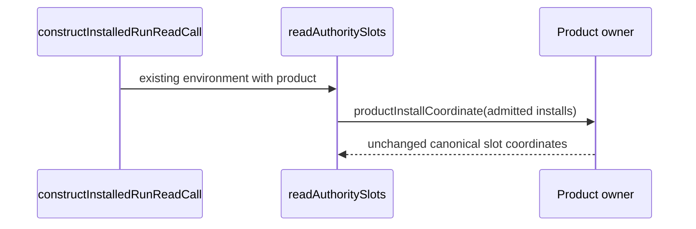

Product Frame: fixed fifteen-family ABI5 5.0/GOAL035/T287, original external UAT, exact STDO2.5.1RC2; f-end-to-end-interface-integration. External harness construction only; ABG owns runtime truth.
CLOSED Worker84 readiness. Sole change: readAuthoritySlots now destructures product from the unchanged environment it already receives. The existing canonical productInstallCoordinate owner and slot meaning are unchanged.
Original preimage fba7116c…/21817B retained; inverse replacement is byte-exact. One node --check passed; no tests/build/install/runtime/model/Git or other source effects.
Callthrough: constructInstalledRunReadCall→same environment→readAuthoritySlots→canonical installed-product coordinates. Missing local binding previously made the selected81 fresh-read construction fail before CLI dispatch.

Editing stopped; independent84 review and genuine81 fresh result/replay remain pending. No production/P0/UAT/release claim.
