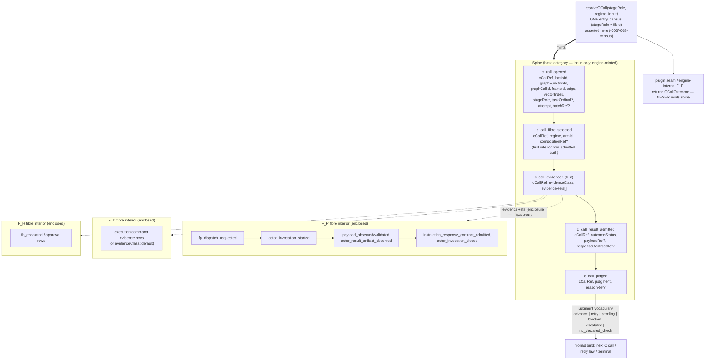

# ABG 3 Uniform C-Call Envelope — Design Module (T-200)

**Status**: Ratified (user, 2026-07-06)
**Authority**: realizes `REQ-R-ABG3-CCALL-001..-012`; design under T-200
§2 as amended §8; governed by DESIGN_MODULE_METHOD.
**Module**: the traversal monad's single compute envelope — spine
carriers, the one resolver, fibre enclosure, and the erase of the
per-arm effect zoo.

## 1. Structural carrier diagram (§5E)



Invariant visible by construction: no fibre name appears in any SPINE
box; `regime`/`armId` exist only in the fibre-selection interior row.
Edge traversal = one spine instance per stage of the DECLARED program
(default program: the canonical triple); composed stage-tasks that can
invoke work each get their own spine with `batchRef` grouping (-005).

## 2. Seams and authority

| Surface | Authority | Consumers |
|---|---|---|
| Spine minting | engine (`resolveCCall` path) ONLY | replay, projections, gates, retry law |
| `c_call_fibre_selected` | engine, from census registry data | temporal gate joins (-010), audit (-012) |
| Fibre interiors | existing event families, unchanged kinds | enclosed via `c_call_evidenced` refs |
| Plugin seam | returns `CCallOutcome`; kind-restricted sink for transport envelope only (T-195 C4) | engine admission |
| Census | `(stageRole × fibre)` registry rows beside `ENGINE_FP_DISPATCH_ARM_IDS`' successor | resolveCCall assert |
| Admission | `event_admission` field rules for 5 spine kinds | emit choke point |
| Replay adapter (-011) | projection layer, read-time derivation | pre-envelope ledgers |

## 3. Evaluator table (§3B — how each decision is judged)

| Decision | Evaluator | Verdict criterion |
|---|---|---|
| Locus-only spine (-002) | admission differential + this diagram | spine event carrying `regime` REJECTED at admission; diagram shows no fibre in spine |
| Fibre selection as truth (-003) | admission axes | missing/duplicate selection row per cCallRef fails closed |
| Full-identity ref (-004) | collision differential | recursive-frame + repeated-graph-call fixture yields distinct cCallRefs; collision constructs rejected |
| Spine-per-task (-005) | audit equality on composed lane | N worker sessions in a batch ⇒ N spines; archives≡replay holds on t145/t146 lanes |
| Enclosure (-006) | NEGATIVE control | a free-floating `fp_dispatch_requested` (no open spine) yields a typed drift diagnostic on real replay |
| Shape preservation (-007) | substitution differential | same scenario, evaluate.C flipped F_P→F_D fixture: identical spine kind sequence; diff limited to selection row + evidence class |
| Judgment vocabulary (-008) | NEGATIVE control | `no_declared_check` on an edge with declared checks does NOT advance; never satisfies any temporal gate |
| One retry law (-009) | allowlist differential | evaluator-arm transport failure retries exactly as transform-arm; non-allowlisted class blocks on both |
| Antecedent = selection row (-010) | gate re-proof, single-event guards | five standing gates non-vacuous on evaluate + composed arms in the p4 lane; no join machinery added |
| Replay compat (-011) | old-ledger differential | rc.10-era events.jsonl projects a derived spine; zero synthetic events written |
| Audit equality (-012) | standing gate measurement | sessions-in-archives == spine invocations, per arm, per fibre, in t194 + data-mapper lanes |

## 4. Module lifecycle confirmation (§6C — answer / N-A / named gap)

- **Creation**: P1 carriers/factories/admission; spine kinds enter the
  event vocabulary with field rules. ANSWERED.
- **Operation**: P2 strangler — old resolvers delegate through
  `resolveCCall`; spine emitted around existing interiors; parity
  differentials green before any behavior change. ANSWERED.
- **Migration**: pre-envelope ledgers remain readable FOREVER via the
  -011 read-time adapter; no ledger rewrite, no synthetic truth.
  In-flight mixed ledgers (old prefix + new suffix) project uniformly.
  ANSWERED.
- **Decommission**: P5 erase — per-arm effect resolvers, C3 vacuity
  markers, transform-arm `dispatch_required` specialness removed only
  after P2–P4 differentials hold; enclosure drift witness stands
  against regression. ANSWERED.
- **Failure modes**: spine outcomes carry the one retry law; binding
  defects surface as `runtime_failure_observed` (T-195 C4); worker
  refusals/corruption remain typed blocked truth (campaign #3b/#5).
  ANSWERED.
- **Observability**: -012 audit equality automated into the standing
  gate; cost per fibre readable from replay alone. ANSWERED.
- **NAMED GAP (resolved in-plan)**: m04 public-outcome mapping for
  `pending` on non-transform arms — public `dispatch_required`
  projection generalizes; specified at P3, proven in the m04 lanes at
  P4. Named here per the sufficiency rule, not deferred silently.

## 5. Differential proof plan (positive AND negative controls)

`test:t200` lane, grown per phase:

- P1: admission axes for all 5 kinds; cCallRef collision rejection;
  selection-row uniqueness; **negative**: spine-with-regime rejected.
- P2: parity — t072/t145/t146/t183 event streams gain spine without
  interior change; archives≡replay on the engine p4 lane; **negative**:
  free-floating fibre event → drift diagnostic.
- P3: five standing gates re-proven via join antecedents; **negative**:
  `no_declared_check` never satisfies; vacuous ≠ satisfied preserved.
- P4: retry-law parity across arms; **negative**: non-allowlisted spine
  failure blocks identically on transform and evaluate arms.
- P5: erase pass with enclosure witness on REAL replay from the t194
  sandbox run.
- P6: substitution differential (F_P→F_D evaluate fixture) + audit
  equality in `test:t194:sandbox-live` + odd_glc data-mapper live lane.

## 6. Erase register (P5 exit criteria)

1. fd_evaluate/fp_evaluate/fp_dispatch/consequence_project/composed_*
   per-arm resolvers → delegated, then removed.
2. C3 default-marker refs → degenerate-fibre envelopes.
3. Transform-arm `dispatch_required` special case → pending projection.
4. Per-arm retry detours (#5b class) → spine retry law.
5. Evaluator-invisible sessions (finding #11) → impossible.
6. Vacuous off-transform gates → non-vacuous by -010.
7. Binding-level dispatchGuard/evaluatorGuard (odd_glc) → retired
   downstream once `runtime_failure_observed` + spine cover the class.

## 7. Ratification

Ratified by the user 2026-07-06. P1 executes under this design
authority; findings anchor to §-clauses of this document and the CCALL
requirement family.

## 8. The monad reviewed: a composed workflow beneath (pre-P2, ratified framing)

Review of the traversal monad as realized today, against the algebra:

**Current state (verified this session).** The iterate machine is a
~8k-line yield-based state machine. The three C calls exist on every
edge but are INTERLEAVED, not composed: transform dispatch at the six
census sites, evaluation via the fp/fd evaluate paths, consequence via
consequence_project plus the construction lane; judgment routing
(advance/retry/stop) is implicit in per-arm branch logic scattered
across the machine. The composition is real but hidden — which is
precisely why the evaluate arm could go invisible (finding #11): a
hidden step cannot be audited.

**The insight this design realizes.** Each edge traversal IS a composed
workflow of exactly three plugin-capable steps:

```
traverseEdge = transform >=> evaluate >=> consequence     (Kleisli)

bind(cCall)  = open → select fibre (census) → resolve (plugin seam)
               → admit → judge
```

where `>=>` routes on the judgment vocabulary: advance → next step;
retry → same step, attempt+1, under the one retry law; pending /
escalated / blocked → stop states; no_declared_check → advance only
where nothing demanded the check. Graph traversal = fold of this
three-step program over planned vectors. The monad core shrinks to:
plan next vector → run the edge program → fold judgments → terminal
law. Everything else is fibre interior.

**Consequences.**
1. The per-edge program becomes DATA (the composed-stage-set family
   already models programs-as-data for batches); the engine is its
   interpreter. The all-F_D degeneracy is then literal: ABG interpreting
   a three-step F_D program IS a workflow engine — the workflow was
   always beneath the monad; the spine makes it visible instead of
   hidden.
2. P2's strangler target is therefore NOT spine-wrapping the six old
   sites in place — it is the edge pipeline itself (resolveCCall + the
   Kleisli router), with the old state-machine branches delegating
   edge-by-edge into it. The erase pass then collapses branches into
   the router rather than deleting six wrappers.
3. The plugin seam's meaning sharpens: downstream systems compose
   workflows by choosing fibres per stage role — three plugin-capable
   steps per edge, no more surface than that.

## 9. The recursive boundary (ratified framing)

Once the edge program is data and the engine its interpreter, the
structure is self-recursive: a C call's fibre interior may itself be a
whole traversal (the construction/consequence lane already runs inner
engine iterations today; an F_P worker may itself be an ABG instance —
the workspace recursive-product taxonomy appearing inside the runtime).
The MONAD BOUNDARY is therefore a placement choice per call:

- **atomic**: evidence = opaque session/artifact refs (a leaf);
- **transparent**: evidence = `sub_traversal` child basis/run refs — the
  child is the same monad one level down (REQ -013).

The spine makes the choice declared and auditable rather than
accidental: enclosure gives a fractal replay (spines at every level),
audit equality composes per level, and cCallRef's frame/graph-call
identity keeps recursion collision-free. Where to put the boundary is
product/design authority; that it must be DECLARED is envelope law.
P2 note: the construction lane's inner runs become the first
sub_traversal evidence rows — the lane closure from T-195 C5 (full
passthrough) is what makes the child lawfully the "same monad".

## 10. Construction primitives: the C algebra generator set (ratified framing)

The minimal constructors from which every lawful compute composition is
built — GTL-side carriers (declarations-are-data), interpreted by the
monad; the census admits what they name:

```
C.of(fibre, armId)                 -- unit: one atomic call bound to a
                                      census arm; the leaf boundary.
C.id                               -- identity: judgment no_declared_check
                                      where nothing is demanded; compose
                                      identity element.
C.compose(c1, c2)  (c1 >=> c2)     -- Kleisli sequencing under judgment
                                      routing; ASSOCIATIVE; the edge
                                      program constructor.
C.edge({transform, evaluate,       -- the stage-role triple; record form
        consequence})                 of compose over the three roles.
workflow.C(graphFunctionRef)       -- THE LIFT (-013): an entire graph
                                      function/program as ONE C; the
                                      transparent monad boundary;
                                      evidence = sub_traversal child refs.
C.batch([tasks], batchRef)         -- grouped composition: spine per
                                      invoking task, parent grouping ref
                                      (-005); composed stage sets are its
                                      existing carrier.
C.retry(c, budget)                 -- attempt closure under the ONE
                                      allowlist (-009); budgets declared,
                                      never implicit.
```

Laws: compose is associative with C.id as identity; workflow.C(g) is a
functor from the graph category back into compute (the recursion
functor) — lift then traverse ≡ traverse then lift per level; batch
distributes over compose at task granularity; audit equality composes
through every constructor (-012/-013).

Degeneracy theorems (not features): fold of C.edge with all fibres F_D
IS a traditional workflow engine; all F_H IS a human process; mixed
tuples are the product's choice. workflow.C makes "a workflow" itself
just a C — the composed workflow beneath the monad (§8), now
constructible from above.

Downstream consequence: bindings stop hand-assembling plugin objects
and DECLARE C compositions as product data; the plugin seam realizes
C.of leaves; everything else is algebra the engine interprets. P2
realizes these as typed GTL carriers beside the composed-stage-set
family; the census is the admission gate for every C.of.

### 10.1 Closure law: compose.C.compose

compose is CLOSED: a composition is a C and may be an operand of
compose. Nested compose has exactly two lawful readings, distinguished
by boundary declaration:

1. FLAT (default): compose(compose(a,b),c) ≡ a >=> b >=> c by
   associativity — nesting is syntax and ERASES at interpretation; the
   spine sees one leaf per C.of, all in the same frame. Spine count =
   leaf count.
2. BOUNDED: to make an inner composition ONE call at the outer level,
   it must be NAMED and lifted — workflow.C over an admitted program
   (graph function / composed-stage-set carrier). There is NO anonymous
   seal: an undeclared boundary would be unauditable recursion,
   violating -013's declared-placement law. Every spine level
   corresponds to an admitted program identity.

Corollary: compose.C.compose is always lawful; whether it is one frame
or two is never an accident of nesting syntax — it is the presence or
absence of a named lift.

## 11. Open programs: HoG beyond the triple (ratified framing)

The primitives compose INTO the engine: the edge program
[transform >=> evaluate >=> consequence] is the canonical DEFAULT
composition, not the monad's shape (REQ -014). Declared programs may
carry more stages — e.g. plan >=> transform >=> critique >=> repair >=>
evaluate >=> consequence — each stage a C with its own fibre selection,
spine, judgment, and retry, all under the unchanged router. Programs
declare their RESULT-BEARING role so closure/carry law binds without
knowing the program. The campaign's observed retry loops (worker →
evaluator-reject → blind retry) become declarable stages (worker →
critic → repair → evaluate), spine-visible instead of implicit.
Census generalizes to (declared role × fibre); role membership is a
conformance/enclosure check (program in scope), never free-form truth.

## 12. Tuning HoG — levers grounded in the data-mapper campaign

1. FIBRE PARAMETERS PER STAGE ROLE (effort/model/timeout as program
   data). Evidence: xhigh closed intent/product stages in 17-45s —
   wasted effort — while code/test stages genuinely needed it (control:
   37s xhigh vs 10s low on the same problem). Lever: C.of carries
   declared fibre params; early doc roles run low/medium, code/test/
   repair roles run xhigh. Expected ~2x cost reduction on the default
   program.
2. RETRY POLICY PER FIBRE, not per run. Evidence: 20 attempts burned on
   a DETERMINISTIC fault (sbt spawn null) — F_D failures are not
   stochastic; identical retries are waste. Lever: C.retry budgets
   distinguish stochastic-retry (F_P, meaningful), repair-retry (F_D,
   only after input change), transport-retry (backoff class).
3. CAUSAL-CARRY POLICY PER ROLE. Evidence: 12k starved the test-design
   worker into lawful refusal; 96k carried whole but pays tokens on
   every stage. Lever: causalExcerptMaxChars (already plan policy)
   declared per stage role; carry-by-reference with selective expansion
   as the successor.
4. PROGRAM SHAPE (-014). Evidence: valid candidates burned 9-blind-loop
   retries where ONE critique pass would have surfaced the naming
   contract. Lever: declare critique/repair stages where retries
   cluster; retries stop being the only repair mechanism.
5. EVALUATOR CALIBRATION AS DATA. Evidence: bug family #6/#8/#9 —
   over-demand (execution evidence everywhere), two-truth pins, exact
   counts. Lever: T-191 latitude + golden-instance calibration (already
   live machinery) declared per stage; strictness is data, not prompt
   accident.
6. GATE-DRIVEN ESCALATION. Evidence: retry exhaustion was always
   discovered at terminal. Lever: temporal properties with judgment
   thresholds — N identical retry judgments on one cCallRef routes to a
   repair stage or F_H escalation before the budget burns.
7. FIBRE ANNEALING. Evidence: deterministic stages were the cheapest
   and most reliable. Lever: stages start F_P and harden to F_D as
   their programs stabilize — lawful by the degeneracy theorems;
   substitution changes tags, never shape.
8. THE TUNING LOOP IS REPLAY-DERIVED. Evidence: the run-15 cost audit
   was one pass over events. Lever: a standing cost projection (per
   C call class: attempts, wall, judgment mix) feeds declarations 1-7;
   HoG tunes off its own truth, no external telemetry.

### 12.1 Proportionality as measure (lineage: odd_sdlc bootstrap)

The §12 levers are one concept: PROPORTIONALITY — how much compute/
rigor a piece of work deserves — previously encoded as a static class
in the odd_sdlc bootstrap and carried today as the plan-level
proportionalityClass. The earlier encoding was DECLARED but not
MEASURED: a label with no truth loop, so nothing enforced or learned
from it. The envelope completes it:

- CARRIER: proportionality attaches per C call and composes like a
  measure — additive over compose/batch, declared at lift boundaries,
  comparable across fibres (effort, retry budget, carry bound, and
  program length are its components).
- OBSERVATION: the spine yields observed cost per C-call class from
  replay alone (attempts, wall, judgment mix) — the measure's actual
  value.
- LAW: declared proportionality vs observed cost is a reconcilable
  pair; sustained divergence is a typed tuning signal (and a
  drift-class candidate), not an anecdote. Tuning = moving declarations
  toward observed reality or justifying the gap.

The plan-level proportionalityClass re-homes as the C-call measure's
declaration surface at P2; odd_sdlc's bootstrap intent lands here as
enforceable runtime law rather than a bootstrap annotation.

## 13. The consciousness layer (framing; cross-repo ticket family)

T-166 (odd_sdlc: adaptable consensus graph function), T-196 (witness
migration), T-201 (closure-point verdict consumption), the FPC
requirement family, proportionality (§12.1), and the cost projection
are organs of ONE layer: a reflective layer that optimizes over limited
resources — as consciousness does. Its closed loop:

1. SELF-OBSERVATION: spine replay, temporal verdicts, coverage, the
   proportionality measure (declared vs observed);
2. SELF-JUDGMENT: gates, consensus rounds, golden calibration — all
   DECLARED PROGRAMS in the -014 sense (T-166's submitter-reviewer
   rounds are a multi-stage program with a judgment fold, not engine
   magic);
3. RE-ALLOCATION: fibre annealing, budgets, program reshaping,
   escalation.

Resource law: the fibre tuple IS a scarcity hierarchy — F_D cheap,
F_P costly, F_H scarcest (human attention). The layer allocates across
it: which calls earn xhigh, which anneal to F_D, which few escalate to
a human. Boundary law: the layer OWNS ALLOCATION, never truth — it
consumes replay and authors declarations; ABG remains the only truth
authority. In the algebra it is a functor from replay projections to
declaration updates — the tuner, standing above the monad, itself
expressible as graph functions over the same substrate (the recursion
functor makes self-reflection lawful: the tuner is traversals reading
traversals).

### 13.1 Solve loop vs optimize loop — same shape, different object

Backlogging the layer was correct method (steel thread first: atoms and
primes lined up, working-but-inefficient solution, optimize later). The
subtlety that makes the deferral SAFE to end later: the optimize loop
and the solve/evaluate loop are the SAME SHAPE — judgment-routed C
compositions over the same primitives — so they are distinguished by
LAW, not by structure:

| | Solve loop | Optimize loop |
|---|---|---|
| Judges | the CANDIDATE (is this artifact lawful/adequate?) | the DECLARATIONS (was this allocation right?) |
| Writes | candidates/artifacts (retry, repair) | terms (budgets, fibres, program shapes, proportionality) |
| Tempo | in-run, online | between runs / at declared checkpoints (online only through declared seams: budgets, escalation routes) |
| Failure mode if confused | retries doing allocation's job (20 identical attempts on a deterministic fault) | allocation editing truth-seeking (tuner weakening evaluators to save cost) |

LAW: solve writes only candidates, never declarations; optimize writes
only declarations, never candidates. A program that does both in one
judgment is unlawful. The campaign already exhibited both failure
modes' precursors; the table is their permanent guard. Because the
shapes are identical, un-backlogging costs no new machinery: the
optimize loop is a -014 program over replay projections, the day it is
wanted.

## 14. The workflow structure (campaign-hardened default program)

There is no universal best — -014 exists because structure is
conditional — but there is a best KNOWN default for work-producing
edges, assembled from sixteen runs of evidence:

```
plan(F_P, low)             -- bind contracts/constraints EARLY (kills the
                              #8 class: two-truth discovered at judgment)
>=> transform(F_P, effort by proportionality)
>=> admit(F_D)             -- mechanical gate: schema, paths, compile;
                              the cheapest kill (run-10's SBT evidence)
>=> critique(F_P, low-med) -- ONE adversarial pass; converts blind-loop
                              retries into guidance (kills the v12/v14
                              class: 9 attempts where 1 critique sufficed)
>=> repair(F_P, conditional on critique/admit findings)
>=> evaluate(F_P, high; latitude+golden calibrated)
>=> consequence(F_D)       -- deterministic projection default
```

Routing: admit-fail routes to repair with findings (never blind retry);
retry budgets per fibre (#12.2); an escalation property watches for N
identical judgments per cCallRef and routes to F_H or reprice before
budgets burn.

SELECTION PRINCIPLES (the theorem behind the shape): expected cost =
Σ cost_i × P(reach_i) — order verifiers by ascending cost-to-kill ratio
(cheap deterministic gates first, xhigh judgment last); place repair
immediately after the cheapest signal that can inform it; spend F_P
only behind F_D gates; anneal stages to F_D as they stabilize; doc-
producing edges keep the lean default triple at low effort. The
canonical triple remains the degenerate minimum — this program is what
it grows into where the work is code.

### 14.1 Status of §14: configuration, not substrate

§14 is CONFIGURATION built from the primitives — C.of/compose/edge
applications with fibre parameters and proportionality declarations.
Nothing in it is engine. It ships as reference declaration data in
product space (a declared default program carrier), never as engine
code paths. The substrate's whole surface is: seven primitives, five
spine kinds, one judgment router, one census, and law. Everything else
in §8–§14 — including the "best" workflow — is authored from them.

## 15. The sovereignty decision: the monad as GTL-declared program (RATIFIED — by necessity, user 2026-07-06)

Question: is the edge program a GTL declared program run by ABG —
system-level configuration in the constitutional carrier — rather than
TS-side declaration data?

RECOMMENDATION: YES. The design already implies it twice: §10.1 demands
every spine level correspond to an ADMITTED PROGRAM IDENTITY, and
workflow.C lifts graphFunctionRefs — programs are only nameable,
liftable, boundary-declarable if they are GTL objects. Making it
explicit buys, for free: admission + digest pinning + T-191 authoring
law + T-193 drift witnessing + conformance corpus proof for the
monad's own interior; the consciousness layer's write surface becomes
lawful GTL authoring (already constitutionally governed); products
declare programs exactly as they declare overlays; §14 ships as a
published GTL program in the catalog.

THE ONE REAL COST — bootstrap circularity — resolves by the workspace's
own recursive-product law: ABG carries ONE BUILT-IN program (the
canonical triple) as its bootstrap P0; it needs no GTL to run it.
Declared GTL programs admit at startup and override per overlay/edge.
Compiler analogy exact: baked triple = bootstrap compiler; declared
programs = self-hosted successors. Fail-closed: malformed program
declarations reject at startup admission; the census derives from the
admitted program.

Stratification law (ratified): built-in bootstrap triple (never
removed, never extended); everything richer is GTL. ABG interprets;
GTL structures; nothing else configures the monad.

### 15.1 The stack, stated exactly

- ABG — the code engine: interprets GTL, mints spine truth, enforces
  law; carries the baked bootstrap triple (P0) and nothing richer.
- GTL — the language: typed nodes, graph functions,
  declarations-are-data; the C-algebra primitives are its carriers.
- HoG.GTL — the SYSTEM-LEVEL COMPOSITION written in GTL: the published
  program family that constitutes the heart — edge programs (§14 as
  catalog reference), census, fibre parameters, proportionality
  declarations. System-level because it configures the engine's own
  operation rather than any domain; products overlay it exactly as they
  overlay domain graphs.

Precision: HoG is not a third component beside ABG and GTL — HoG IS
ABG running HoG.GTL. The name denotes the composition, not a part.
Publication home on ratification: a catalog module (e.g.
gtl://abg/hog/*) versioned and drift-witnessed like all published law.

### 15.2 Ratification record

Ratified by necessity (user: "we have no choice"). The forcing
argument: every alternative violates already-ratified law — a TS-side
program format is a second configuration language (duplicate-surface
violation); unnamed programs are undeclarable boundaries (violates
-013/§10.1); engine-coded programs are the substrate learning what must
stay emergent (violates the T-030 boundary law). GTL-declared programs
are the only coherent point in the design space. P2 target final:
resolveCCall as GTL-program interpreter over the baked P0 triple;
HoG.GTL as the first system-level catalog module.

### 14.2 Stage reification vs instruction inlining (capability-relative shape)

A cognitive stage ("make a plan", "critique") has TWO lawful homes:

- REIFIED: an explicit program stage — its own C call, envelope,
  judgment, retry budget, cost line in replay;
- INLINED: an instruction category inside another stage's prompt
  (the T-191 section machinery), trusting the worker's internal
  coherence.

The selection principle: THE DUMBER THE AGENT, THE MORE EXPLICIT
STAGES; the smarter, the fewer — the original triple was not a
minimal agentic coder but the smart-agent compression, taking
advantage of capable workers by inlining cognition. The 7-stage
campaign-hardened program is the same program at lower trust.

THE INVARIANT — GATE INVARIANCE UNDER COMPRESSION: hard gates never
inline. F_D admission, deterministic execution/verification, and the
evaluate judgment are trust boundaries, not cognitive assists — a
program may compress COGNITION into prompts, never VERIFICATION.
Compression moves plan/critique/repair-guidance between stage and
instruction category; the gate set is the fixed point.

Consequences: (a) program shape is a PROPORTIONALITY lever with a
capability input — reification costs an envelope + possibly a session;
inlining costs prompt complexity and worker trust; (b) this is the dual
of fibre annealing (§12.7): annealing hardens fibres as OUTPUTS
stabilize, compression folds stages as WORKERS strengthen — both
preserve gates; (c) the consciousness layer gains its program-shape
axis: observed capability (retry rates, critique-catch rates) drives
declared compression level, per §13.1 writing declarations only.

The organizational isomorphism (user): REGULATOR over CORPORATE PROCESS
over DETAILED PROCESS FOR JUNIORS. Gates = the regulator — external to
the regulated, invariant across seniority, never folded into anyone's
discretion (the audited never write their own audit). The declared
program = corporate process — the organization's chosen shape. Stage
reification = the junior's checklist; inlining = senior autonomy.
The failure modes map exactly and are already named in this design:
gate inlining = regulatory capture (the fabricated-success default
class, T-195 C3); over-reification of capable workers =
micromanagement (proportionality waste, §12.1); under-reification of
weak workers = chaos (the campaign's blind-retry loops). Trust
calibration is program shape; compliance is gate invariance.

### 8.1 P2 checkpoint amendment (codex round 4 + user checkpoint)

The strangler is TWO-STEP, ratified retroactively with the evidence in
hand: step 1 (DONE) — spine visibility by site-bracketing; the wrapped
sites are real truth and serve as the parity ORACLE for step 2. Step 2
(pre-P5) — the old branches delegate through resolveCCall (the §8
pipeline), proven by oracle-equality: delegation must reproduce the
bracketed sites' spine streams exactly. Acceptance item "one resolver
entry" is EARNED AT STEP 2, not before (codex checkpoint verdict:
"P2 clears as a visibility/parity checkpoint, not as design-complete
HoG realization"). Granularity CONFIRMED at checkpoint:
spine-per-invoking-task (taskOrdinal = pluginIndex, batchRef grouping) —
"per-batch would hide the unit of compute you are trying to audit."
P3/P4 must explicitly prove evaluator EXTERNAL-session parity on the
live lanes (the named evaluate-interior asymmetry).
