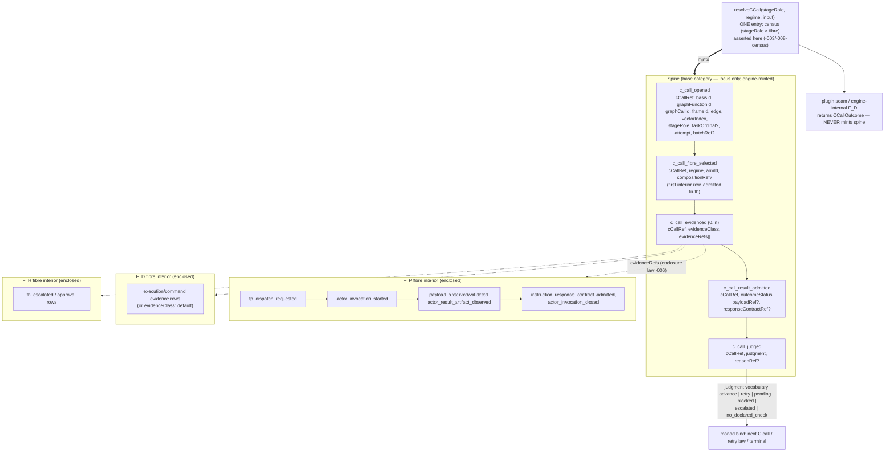

# ABG 3 Uniform C-Call Envelope — Design Module (T-200)

**Status**: Ratified (user, 2026-07-06)
**Authority**: realizes `REQ-R-ABG3-CCALL-001..-012`; design under T-200
§2 as amended §8; governed by DESIGN_MODULE_METHOD.
**Module**: the traversal monad's single compute envelope — spine
carriers, the one resolver, fibre enclosure, and the erase of the
per-arm effect zoo.

## 1. Structural carrier diagram (§5E)



Invariant visible by construction: no fibre name appears in any SPINE
box; `regime`/`armId` exist only in the fibre-selection interior row.
Edge traversal = three spine instances (transform, evaluate,
consequence); composed stage-tasks that can invoke work each get their
own spine with `batchRef` grouping (-005).

## 2. Seams and authority

| Surface | Authority | Consumers |
|---|---|---|
| Spine minting | engine (`resolveCCall` path) ONLY | replay, projections, gates, retry law |
| `c_call_fibre_selected` | engine, from census registry data | temporal gate joins (-010), audit (-012) |
| Fibre interiors | existing event families, unchanged kinds | enclosed via `c_call_evidenced` refs |
| Plugin seam | returns `CCallOutcome`; kind-restricted sink for transport envelope only (T-195 C4) | engine admission |
| Census | `(stageRole × fibre)` registry rows beside `ENGINE_FP_DISPATCH_ARM_IDS`' successor | resolveCCall assert |
| Admission | `event_admission` field rules for 5 spine kinds | emit choke point |
| Replay adapter (-011) | projection layer, read-time derivation | pre-envelope ledgers |

## 3. Evaluator table (§3B — how each decision is judged)

| Decision | Evaluator | Verdict criterion |
|---|---|---|
| Locus-only spine (-002) | admission differential + this diagram | spine event carrying `regime` REJECTED at admission; diagram shows no fibre in spine |
| Fibre selection as truth (-003) | admission axes | missing/duplicate selection row per cCallRef fails closed |
| Full-identity ref (-004) | collision differential | recursive-frame + repeated-graph-call fixture yields distinct cCallRefs; collision constructs rejected |
| Spine-per-task (-005) | audit equality on composed lane | N worker sessions in a batch ⇒ N spines; archives≡replay holds on t145/t146 lanes |
| Enclosure (-006) | NEGATIVE control | a free-floating `fp_dispatch_requested` (no open spine) yields a typed drift diagnostic on real replay |
| Shape preservation (-007) | substitution differential | same scenario, evaluate.C flipped F_P→F_D fixture: identical spine kind sequence; diff limited to selection row + evidence class |
| Judgment vocabulary (-008) | NEGATIVE control | `no_declared_check` on an edge with declared checks does NOT advance; never satisfies any temporal gate |
| One retry law (-009) | allowlist differential | evaluator-arm transport failure retries exactly as transform-arm; non-allowlisted class blocks on both |
| Antecedent = selection row (-010) | gate re-proof, single-event guards | five standing gates non-vacuous on evaluate + composed arms in the p4 lane; no join machinery added |
| Replay compat (-011) | old-ledger differential | rc.10-era events.jsonl projects a derived spine; zero synthetic events written |
| Audit equality (-012) | standing gate measurement | sessions-in-archives == spine invocations, per arm, per fibre, in t194 + data-mapper lanes |

## 4. Module lifecycle confirmation (§6C — answer / N-A / named gap)

- **Creation**: P1 carriers/factories/admission; spine kinds enter the
  event vocabulary with field rules. ANSWERED.
- **Operation**: P2 strangler — old resolvers delegate through
  `resolveCCall`; spine emitted around existing interiors; parity
  differentials green before any behavior change. ANSWERED.
- **Migration**: pre-envelope ledgers remain readable FOREVER via the
  -011 read-time adapter; no ledger rewrite, no synthetic truth.
  In-flight mixed ledgers (old prefix + new suffix) project uniformly.
  ANSWERED.
- **Decommission**: P5 erase — per-arm effect resolvers, C3 vacuity
  markers, transform-arm `dispatch_required` specialness removed only
  after P2–P4 differentials hold; enclosure drift witness stands
  against regression. ANSWERED.
- **Failure modes**: spine outcomes carry the one retry law; binding
  defects surface as `runtime_failure_observed` (T-195 C4); worker
  refusals/corruption remain typed blocked truth (campaign #3b/#5).
  ANSWERED.
- **Observability**: -012 audit equality automated into the standing
  gate; cost per fibre readable from replay alone. ANSWERED.
- **NAMED GAP (resolved in-plan)**: m04 public-outcome mapping for
  `pending` on non-transform arms — public `dispatch_required`
  projection generalizes; specified at P3, proven in the m04 lanes at
  P4. Named here per the sufficiency rule, not deferred silently.

## 5. Differential proof plan (positive AND negative controls)

`test:t200` lane, grown per phase:

- P1: admission axes for all 5 kinds; cCallRef collision rejection;
  selection-row uniqueness; **negative**: spine-with-regime rejected.
- P2: parity — t072/t145/t146/t183 event streams gain spine without
  interior change; archives≡replay on the engine p4 lane; **negative**:
  free-floating fibre event → drift diagnostic.
- P3: five standing gates re-proven via join antecedents; **negative**:
  `no_declared_check` never satisfies; vacuous ≠ satisfied preserved.
- P4: retry-law parity across arms; **negative**: non-allowlisted spine
  failure blocks identically on transform and evaluate arms.
- P5: erase pass with enclosure witness on REAL replay from the t194
  sandbox run.
- P6: substitution differential (F_P→F_D evaluate fixture) + audit
  equality in `test:t194:sandbox-live` + odd_glc data-mapper live lane.

## 6. Erase register (P5 exit criteria)

1. fd_evaluate/fp_evaluate/fp_dispatch/consequence_project/composed_*
   per-arm resolvers → delegated, then removed.
2. C3 default-marker refs → degenerate-fibre envelopes.
3. Transform-arm `dispatch_required` special case → pending projection.
4. Per-arm retry detours (#5b class) → spine retry law.
5. Evaluator-invisible sessions (finding #11) → impossible.
6. Vacuous off-transform gates → non-vacuous by -010.
7. Binding-level dispatchGuard/evaluatorGuard (odd_glc) → retired
   downstream once `runtime_failure_observed` + spine cover the class.

## 7. Ratification

Ratified by the user 2026-07-06. P1 executes under this design
authority; findings anchor to §-clauses of this document and the CCALL
requirement family.

## 8. The monad reviewed: a composed workflow beneath (pre-P2, ratified framing)

Review of the traversal monad as realized today, against the algebra:

**Current state (verified this session).** The iterate machine is a
~8k-line yield-based state machine. The three C calls exist on every
edge but are INTERLEAVED, not composed: transform dispatch at the six
census sites, evaluation via the fp/fd evaluate paths, consequence via
consequence_project plus the construction lane; judgment routing
(advance/retry/stop) is implicit in per-arm branch logic scattered
across the machine. The composition is real but hidden — which is
precisely why the evaluate arm could go invisible (finding #11): a
hidden step cannot be audited.

**The insight this design realizes.** Each edge traversal IS a composed
workflow of exactly three plugin-capable steps:

```
traverseEdge = transform >=> evaluate >=> consequence     (Kleisli)

bind(cCall)  = open → select fibre (census) → resolve (plugin seam)
               → admit → judge
```

where `>=>` routes on the judgment vocabulary: advance → next step;
retry → same step, attempt+1, under the one retry law; pending /
escalated / blocked → stop states; no_declared_check → advance only
where nothing demanded the check. Graph traversal = fold of this
three-step program over planned vectors. The monad core shrinks to:
plan next vector → run the edge program → fold judgments → terminal
law. Everything else is fibre interior.

**Consequences.**
1. The per-edge program becomes DATA (the composed-stage-set family
   already models programs-as-data for batches); the engine is its
   interpreter. The all-F_D degeneracy is then literal: ABG interpreting
   a three-step F_D program IS a workflow engine — the workflow was
   always beneath the monad; the spine makes it visible instead of
   hidden.
2. P2's strangler target is therefore NOT spine-wrapping the six old
   sites in place — it is the edge pipeline itself (resolveCCall + the
   Kleisli router), with the old state-machine branches delegating
   edge-by-edge into it. The erase pass then collapses branches into
   the router rather than deleting six wrappers.
3. The plugin seam's meaning sharpens: downstream systems compose
   workflows by choosing fibres per stage role — three plugin-capable
   steps per edge, no more surface than that.
