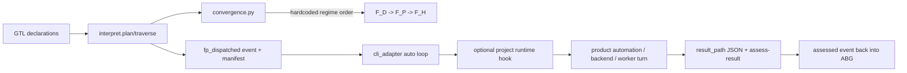
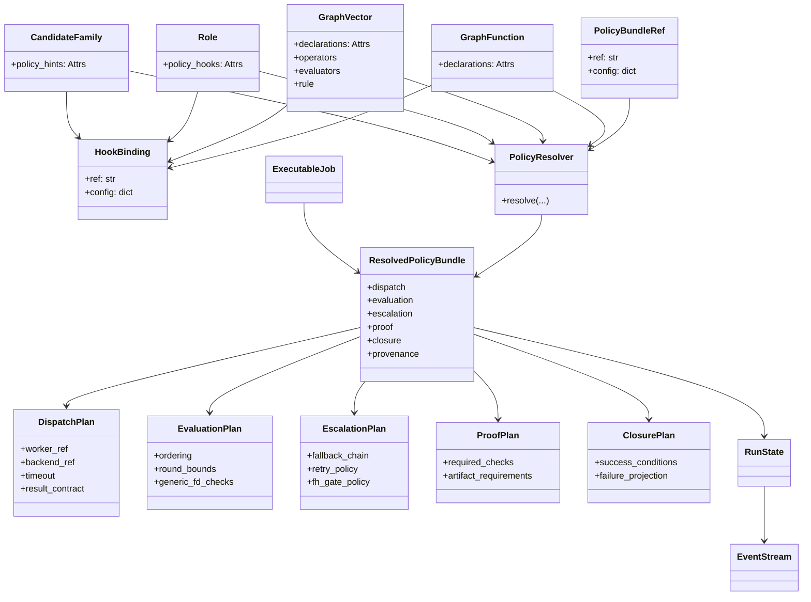
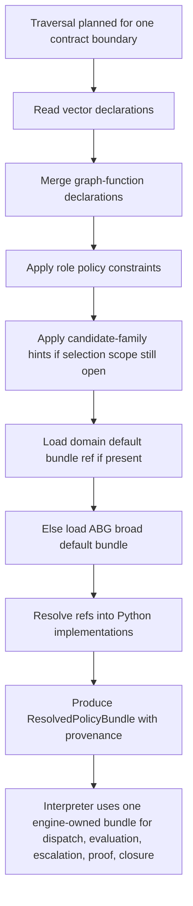
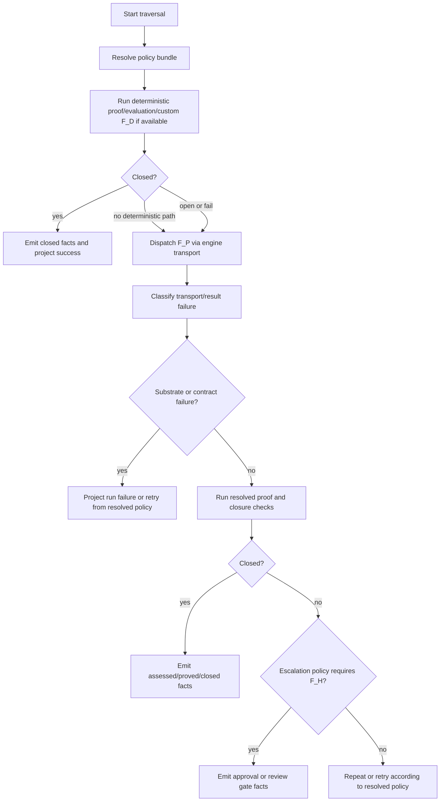
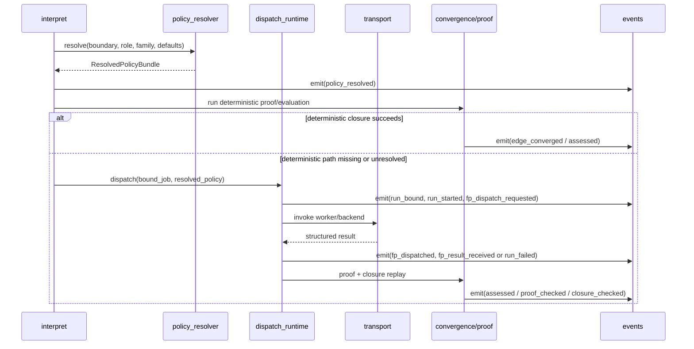
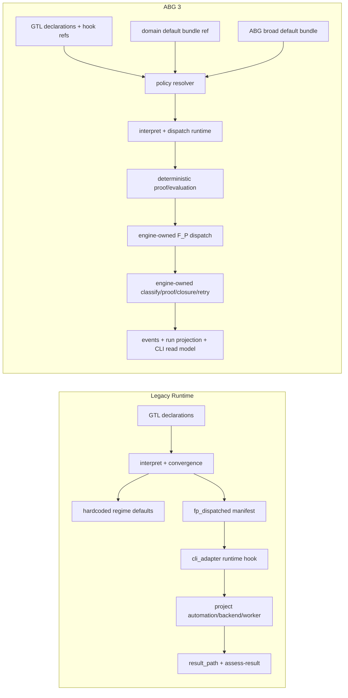
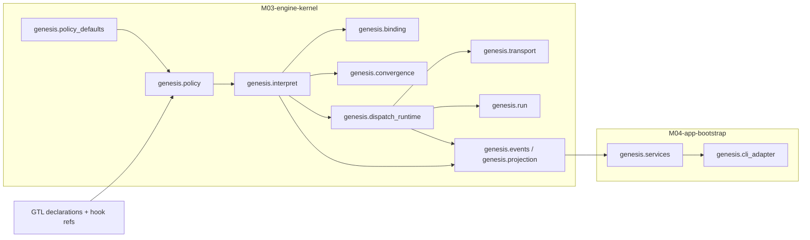

# ABG 3 Module Design

**Status**: Active
**Date**: 2026-04-05
**Purpose**: Human-readable design and impact assessment for the ABG 3 line,
focused on configured default policy bundles, engine-owned post-dispatch
runtime truth, and the runtime/module cut required by the ABG 3 constitution.

---

## 1. Position

ABG 3 keeps the same center:

- GTL declares law
- ABG interprets, enforces, emits facts, and projects truth
- the event stream remains the one runtime truth surface

The major ABG 3 change is not a new runtime ontology.

It is a stricter engine boundary:

- policy/default resolution becomes engine-owned
- post-dispatch runtime truth becomes engine-owned
- app bootstrap becomes control-plane projection, not runtime law

ABG 3 therefore turns the current GTL 3 hook surfaces into a real engine
consumption model.

Public execution entry is graph-function-first:

- jobs bind published graph functions
- ABG materializes and executes those graph functions
- graph vectors remain internal realized invariant boundaries for local
  evaluation, proof, and closure

The target default profile is broad and F_P-biased:

1. Try deterministic constructive and proof paths when they exist.
2. If they do not exist, or they do not close the contract, fall forward to
   governed F_P execution.
3. Escalate to F_H only when the resolved escalation policy still requires it.

The important constraint is that these are not hidden hardcoded branches.
They are configured default bundles that ship with ABG as reference material,
and domain users can copy, edit, and reference them from their own GTL/ABG
surfaces.

---

## 2. Why ABG 3 Exists

The prior runtime line already has the right primitives:

- GTL 3 exposes hook attachment points on graph-function, graph-vector, role,
  and candidate-family surfaces.
- ABG owns event emission, projection, run algebra, convergence, transport,
  interpretation, and replay.
- the engine already preserves GTL declarations through frame and publication
  serialization.

The ABG 3 cut removes those seams directly:

- convergence regime progression is driven by ABG policy/default law rather
  than hidden runtime constants
- `genesis.interpret` no longer accepts runtime callback injection at the F_P
  seam
- `genesis.cli_adapter` no longer imports project dispatch/approval hooks to
  define runtime law
- the result-file protocol is engine-owned, with CLI `assess-result` reduced to
  a thin ingress wrapper over engine ingest

That is the point of ABG 3: full runtime ownership without a shadow runtime.

---

## 3. Design Goals

### 3.1 Goals

- provide reference default behavior without hardcoding domain semantics
- let a domain copy, edit, and reference broad default policy bundles
- preserve GTL as hook attachment plus opaque config, not a policy DSL
- keep deterministic proof, replay, provenance, and closure visible
- default to governed F_P behavior when F_D custom or generic paths do not
  exist or do not close the boundary
- eliminate project-local shadow runtime after `fp_dispatched`

### 3.2 Non-goals

- invent a second workflow language above GTL
- encode policy semantics as an in-language mini DSL
- prescribe agent tactics or prompt choreography
- move event truth back into CLI or product runtime code

---

## 4. Legacy Baseline And Pressure Points

### 4.1 Current Legacy Shape



### 4.2 What Is Wrong With That Shape

| Concern | Legacy behavior | Problem |
| --- | --- | --- |
| Default regime progression | Encoded by ABG3 policy/default law in `genesis.convergence` | Defaults are explicit, configured, and replay-visible rather than hidden constants |
| F_P dispatch seam | `interpret._realize_iteration()` emits the dispatch fact and stops | Runtime truth remains in the engine at the critical seam |
| Auto orchestration | `cli_adapter._run_start_auto()` calls engine-owned dispatch runtime and optional CLI proxy approval only | CLI/app bootstrap no longer defines runtime law |
| Result closure | `result_path` is ingested by engine-owned `result_ingest`; `_assess_result_cmd()` is a thin wrapper | Assessment/proof closure is no longer split across engine and app edge |
| External policy | `Worker.is_eligible()` preserves `authority_ref` but does not enforce policy hooks | GTL hook surfaces exist, but ABG does not yet consume them deeply |

---

## 5. ABG 3 Core Thesis

ABG 3 adds two engine-owned capabilities.

### 5.1 Configured Default Policy Bundles

ABG 3 resolves policy from:

- GTL hook declarations on the active traversal boundary
- role policy constraints
- candidate-family hints when selection is still open
- a domain-configured default bundle reference
- an ABG-shipped broad reference bundle when no domain bundle is supplied

The ABG-shipped bundle is still ordinary configuration plus Python functions.
It is not a hidden branch table inside the interpreter.

### 5.2 Engine-Owned Post-Dispatch Runtime

After a traversal reaches an F_P boundary, ABG 3 owns:

- dispatch request creation
- worker/backend resolution
- subprocess or adapter invocation
- substrate failure classification
- result-artifact loading
- proof/evaluation replay
- closure decision
- retry and correction scheduling
- fact emission for every stage

The CLI may still poll, present, proxy, or request approval.
It no longer becomes the owner of F_P runtime truth.

The entry shape is:

`Job -> GraphFunction -> materialized graph -> GraphVector(s) -> evaluation / proof / closure`

---

## 6. Default Policy Model

### 6.1 Design Rule

GTL stays declarative.

It exposes hook references and opaque config.
ABG resolves those references to executable Python implementations.

### 6.2 Minimal Hook Contract

ABG 3 should consume a very small contract shape:

```python
{
    "ref": "package.module:symbol",
    "config": {...}
}
```

That same shape can be used for:

- dispatch
- evaluation
- escalation
- proof
- closure

ABG may also accept one bundle reference that expands to those five concerns.

### 6.3 Configured Default Bundle

The shipped broad default should be a published bundle, not a hidden engine
constant. Conceptually:

```python
{
    "default_policy_bundle": {
        "ref": "abiogenesis.abg_defaults:broad_fp_first",
        "config": {...}
    }
}
```

Domain users can then:

1. reference that bundle directly
2. copy it into their own project and edit it
3. replace only selected concerns while inheriting the rest

### 6.4 Resolution Precedence

ABG 3 should resolve policy in this order:

1. `GraphVector.declarations`
2. `GraphFunction.declarations`
3. `Role.policy_hooks`
4. `CandidateFamily.policy_hints`
5. domain-configured default bundle
6. ABG-shipped broad default bundle

Two boundaries matter:

- candidate-family hints can influence bundle selection while traversal choice
  is still open
- once a concrete vector is active, vector and graph-function declarations win
  over candidate-family hints

### 6.5 Broad F_P-First Default Behavior

The broad default bundle should mean:

1. Run declared deterministic proof and evaluation first when available.
2. Run generic deterministic proof and evaluation when declared custom logic is
   absent but generic engine checks are available.
3. If deterministic handling is missing, open, or failing, dispatch governed
   F_P.
4. Re-run post-transform proof and blocker-class closure checks on the
   returned result, while publishing unresolved deterministic observer findings
   as runtime fact truth and yielding to the next lawful observer or routing
   layer instead of promoting them back into blocking closure or flattening
   them into plain success by default.
5. Escalate to F_H only when the resolved escalation policy still says the
   contract remains unresolved or approval-bearing.

This is the closest engine-owned equivalent to native agentic coder behavior
under GTL/ABG governance.

---

## 7. ABG 3 Domain Model



### 7.1 Key Reading

- GTL surfaces stay small and declarative.
- `PolicyResolver` is engine-owned and becomes the semantic entry point.
- `ResolvedPolicyBundle` is the internal engine shape that the interpreter,
  convergence layer, dispatch runtime, and run projection consume.
- the bundle carries provenance so replay can answer not just what happened,
  but which policy defaults and overrides caused it.

---

## 8. ABG 3 Workflows

### 8.1 Policy Resolution Workflow



### 8.2 F_P-Biased Traversal Workflow



### 8.3 Engine-Owned Post-Dispatch Sequence



---

## 9. Legacy To ABG 3 Contrast



### 9.1 Summary Table

| Concern | Legacy | ABG 3 |
| --- | --- | --- |
| Default behavior | inline constants and interpreter branches | configured default bundle refs |
| F_P seam | optional project runtime hook | engine-owned dispatch runtime |
| CLI | runtime hook owner and result closer | control-plane reader, poller, optional F_H proxy |
| Deterministic fallback | partial and local | explicit resolved proof/evaluation plan |
| Escalation | mostly encoded in convergence code | resolved escalation plan with provenance |
| Domain customization | custom app/runtime code | copy/edit/reference default bundles plus GTL hook refs |
| Replayability | strong for events, weaker for policy/default cause | strong for both events and policy-resolution cause |

---

## 10. Module Impact Assessment

### 10.1 Proposed Module Layout



### 10.2 New Engine Surfaces

| Module | Responsibility | Why it is needed |
| --- | --- | --- |
| `genesis.policy` | resolve GTL hook refs plus default bundle refs into one `ResolvedPolicyBundle` | policy needs a single semantic entry point |
| `genesis.policy_defaults` | ship ABG broad default bundles and generic deterministic checks as editable reference material | defaults must be provided but not hardcoded |
| `genesis.dispatch_runtime` | own F_P dispatch, backend invocation, result capture, classification, proof replay, closure, retry facts | removes the current shadow runtime |

### 10.3 Existing Module Changes

| Module | Legacy role | ABG 3 impact | Size |
| --- | --- | --- | --- |
| `genesis.convergence` | computes aggregate state from typed outcomes | consume ABG3 policy/default law and remove hidden semantic dependence on hardcoded regime tables | High |
| `genesis.interpret` | plans traversal and emits runtime facts | plan and execute from graph-function job entry, resolve policy after graph-function identity is known, materialize internal graph structure, emit policy-resolution and closure facts, and stop accepting runtime callback injection as the semantic carrier | High |
| `genesis.binding` | resolves jobs, workers, deterministic precompute, prompt assembly | resolve semantic jobs against published graph functions first, then materialize internal graph structure for executable traversal, use role policy hooks during eligibility and binding, and attach resolved policy provenance to bound jobs/manifests | High |
| `genesis.transport` | subprocess invocation plus failure classification | remain substrate-only and reusable, but become subordinate to engine dispatch runtime rather than app hooks | Medium |
| `genesis.run` | projects lifecycle from stream | keep one canonical run algebra; add projection support for retry scheduling and richer dispatch/result facts if needed | Medium |
| `genesis.events` | canonical write path | unchanged in principle; event vocabulary expands | Low |
| `genesis.frames` | serializes frame-local GTL declarations | likely preserve policy-resolution provenance refs when frame-local surfaces override defaults | Medium |
| `genesis.projection` | current-state replay | add read-model coverage for new policy and closure facts | Medium |
| `genesis.services` | one-step engine progression with optional dispatch callback | remove semantic dependency on callback injection; keep API thin over engine kernel | Medium |
| `genesis.cli_adapter` | app-level auto loop, runtime hook import, result assessment command | delete runtime hook ownership for F_P; keep polling, CLI commands, and optional human proxy for F_H | High |

### 10.4 Shared Module Decomposition Impact

ABG 3 changes module ownership in one important way:

- `M03-engine-kernel` grows to own configured default policy resolution and the
  full post-dispatch runtime fact path
- `M04-app-bootstrap` shrinks to command orchestration, display, polling, and
  optional human proxy behavior

That is the correct direction. The runtime law moves down, not up.

---

## 11. Requirement Family Impact

The active ABG 3 runtime families now carry the following pressure:

| Active family | ABG 3 design pressure |
| --- | --- |
| `REQ-R-ABG3-INTERPRET` | interpreter must resolve policy bundles and own graph-function-first post-dispatch fact flow |
| `REQ-R-ABG3-CONVERGENCE` | evaluator ordering, proof, closure, fallback, and failure taxonomy must be driven by resolved policy bundles |
| `REQ-R-ABG3-BINDING` | worker/backend eligibility and role constraints must consume policy hooks while preserving graph-call identity |
| `REQ-R-ABG3-TRANSPORT` | transport remains substrate-only but sits under engine-owned dispatch runtime |
| `REQ-R-ABG3-RUN` | retry, supersession, and continuation termination/opening must remain central under the new runtime flow |
| `REQ-R-ABG3-PROVENANCE` | policy bundle refs, resolved hook refs, graph-call identity, and default-source provenance become replay-visible |
| `REQ-R-ABG3-PROJECTION` | read models must understand the new event vocabulary without inventing rival lifecycle truth |
| `REQ-R-ABG3-GRAPHCALL`, `REQ-R-ABG3-FRAME`, `REQ-R-ABG3-CONTINUATION` | runtime aggregates and event ownership must remain explicit and replay-safe |

No GTL 3 constitutional change is required for this cut.

GTL 3 already exposes the necessary hook surfaces.
ABG 3 is the engine realization of those surfaces.

---

## 12. Risks And Design Checks

### 12.1 Risks

- If the broad default bundle is too weak, domains still reinvent local runtime
  hooks.
- If it is too opinionated, ABG leaks domain semantics into engine defaults.
- If policy provenance is not emitted explicitly, replay explains outcome but
  not why one fallback or escalation path was chosen.
- If CLI remains in the dispatch loop, ABG 3 keeps the same split runtime law
  under a different name.

### 12.2 Design Checks

- defaults are published config plus Python references, not hidden constants
- every fallback and escalation step emits facts
- deterministic proof remains explicit even in the F_P-biased default
- transport failure, no output, contract failure, and certification failure
  remain distinct
- CLI never becomes the owner of runtime truth

---

## 13. Recommended Implementation Order

1. Add `genesis.policy` plus `ResolvedPolicyBundle` and bundle-resolution
   precedence.
2. Add ABG-shipped broad default bundles and generic deterministic checks.
3. Cut `genesis.dispatch_runtime` and move the post-dispatch seam there.
4. Rework `genesis.interpret`, `genesis.binding`, and `genesis.convergence` to
   consume resolved policy instead of callback/runtime-hook seams.
5. Thin `genesis.cli_adapter` back to control-plane behavior only.
6. Reprice the ABG requirement line and then derive tests from the new runtime
   surfaces.

---

## 14. Bottom Line

ABG 3 should not become a richer hook-callback system.

It should become:

- a GTL-hook-consuming engine
- with configured, editable, broad default bundles
- with an F_P-biased default runtime profile
- and with one engine-owned fact path from dispatch through closure

That gives domains the behavior they want by default, while keeping the real
governance boundary where it belongs.
