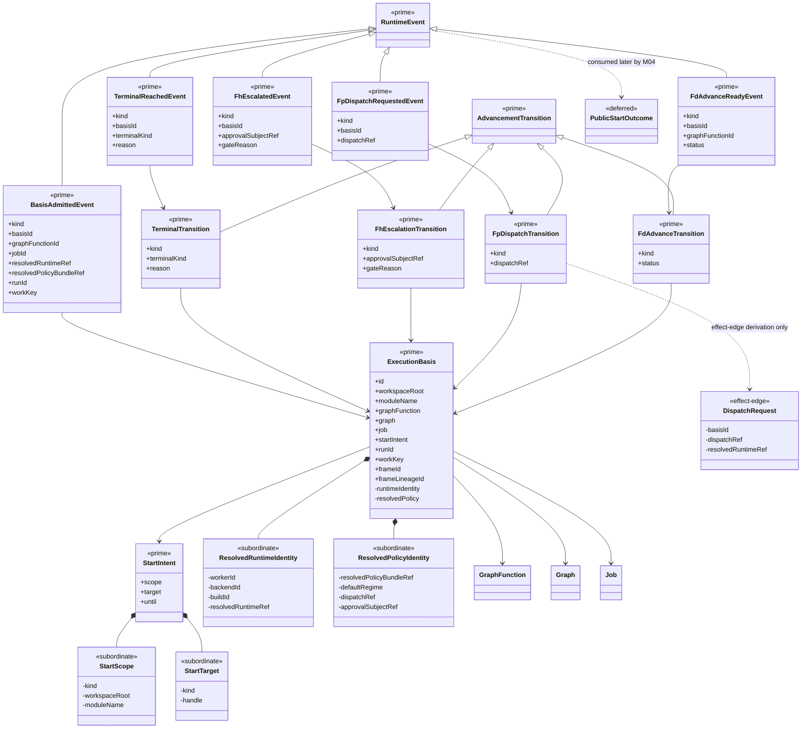

# ABG 3 M03 Structural Carrier Diagram

**Status**: Active
**Date**: 2026-04-23
**Derived from**: [ABG_3_MODULE_DESIGN.md](./ABG_3_MODULE_DESIGN.md), [ABG_3_FIRST_SLICE_IACS.md](./ABG_3_FIRST_SLICE_IACS.md), [T-011](../../.ai-workspace/tickets/completed/T-011-realize-typescript-abg-first-runtime-slice-under-explicit-execution-event-carrier-law.md)
**Purpose**: Module-bounded structural carrier sign-off asset for the
completed TypeScript `M03-engine-kernel` steel thread.

## Scope

This diagram covers the completed first TypeScript ABG runtime slice:

- admitted public runtime ingress through `StartIntent`
- admitted runtime basis through `ExecutionBasis`
- closed runtime advancement through `AdvancementTransition`
- closed event truth through `RuntimeEvent`

It does **not** claim to show:

- app/bootstrap control loops
- public-start outcome families above the kernel
- downstream stop/status/live-status projections
- qualification harnesses

## Mermaid UML View

## Reading Rules

- `<<prime>>` means top-level carrier family for the active ABG runtime slice.
- `<<subordinate>>` means nested payload detail that remains inside a prime
  carrier.
- `<<effect-edge>>` means payload detail derived only for the transport or emit
  boundary and not promoted to a prime runtime carrier.
- `<<deferred>>` means later family outside the completed `M03` slice.
- `+` fields are public/exported carrier truth for the active slice.
- `-` fields are module-bounded subordinate detail.

## Sign-Off Consequence

This asset is the visual check that:

- `StartIntent`, `ExecutionBasis`, `AdvancementTransition`, and `RuntimeEvent`
  remain the only prime runtime families in the completed steel thread
- resolved runtime identity and resolved policy identity remain subordinate to
  `ExecutionBasis`
- dispatch request derivation stays at the effect edge instead of becoming a
  rival runtime carrier
- downstream public-start outcomes remain deferred to `M04` rather than
  promoted into the kernel
