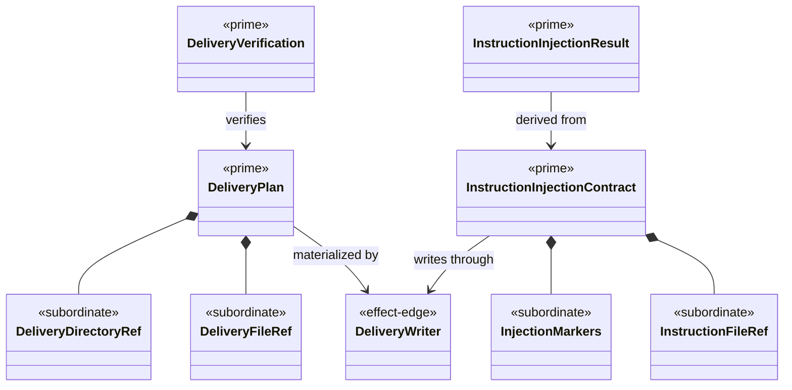

# ABG Common Delivery Library Structural Carrier Diagram

**Status**: Completed
**Date**: 2026-04-24
**Derived from**: [ABG_COMMON_DELIVERY_LIBRARY_DERIVATION.md](./ABG_COMMON_DELIVERY_LIBRARY_DERIVATION.md), [ABG_COMMON_DELIVERY_LIBRARY_FIRST_SLICE_IACS.md](./ABG_COMMON_DELIVERY_LIBRARY_FIRST_SLICE_IACS.md), [T-028](../../.ai-workspace/tickets/completed/T-028-realize-a-tenant-local-abg-common-delivery-library-for-installed-root-plans-verification-and-instruction-file-injection.md)

## Purpose

Render the first tenant-local ABG common delivery library as one
module-bounded Mermaid UML carrier topology.

## Diagram

## Sign-Off Claim

This common delivery library is lawful only if the future TypeScript code:

- keeps delivery plans and verification reusable without creating a rival
  product boundary,
- keeps writer effects explicit,
- keeps instruction-file injection explicit and idempotent, and
- leaves owned module meaning in the consuming ticket.
