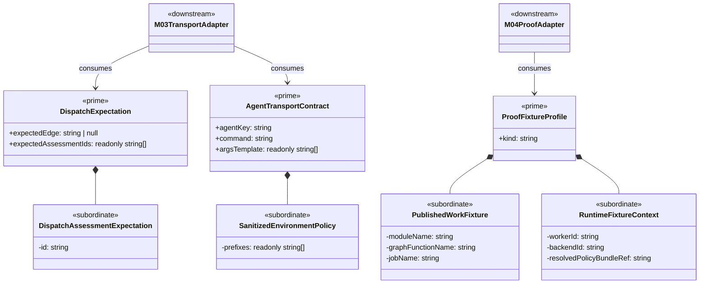

# ABG Common Realization Library Structural Carrier Diagram

**Status**: Active
**Date**: 2026-04-24
**Derived from**: [ABG_COMMON_REALIZATION_LIBRARY_DERIVATION.md](./ABG_COMMON_REALIZATION_LIBRARY_DERIVATION.md), [ABG_COMMON_REALIZATION_LIBRARY_FIRST_SLICE_IACS.md](./ABG_COMMON_REALIZATION_LIBRARY_FIRST_SLICE_IACS.md), [T-027](../../.ai-workspace/tickets/completed/T-027-realize-a-tenant-local-abg-common-realization-library-for-expectation-derivation-contract-carriers-and-module-derived-proof-helpers.md)
**Purpose**: Render the first tenant-local ABG common realization library slice
as one module-bounded structural carrier diagram before shared code opens.

## Mermaid UML

## Reading Notes

- `DispatchExpectation`, `AgentTransportContract`, and `ProofFixtureProfile`
  are the only prime carriers in this library slice.
- nested policy and fixture detail stays subordinate inside those three
  reusable families.
- consuming modules use adapters to map module-owned truth into library
  carriers.
- the library is reusable realization support, not a rival semantic center.
