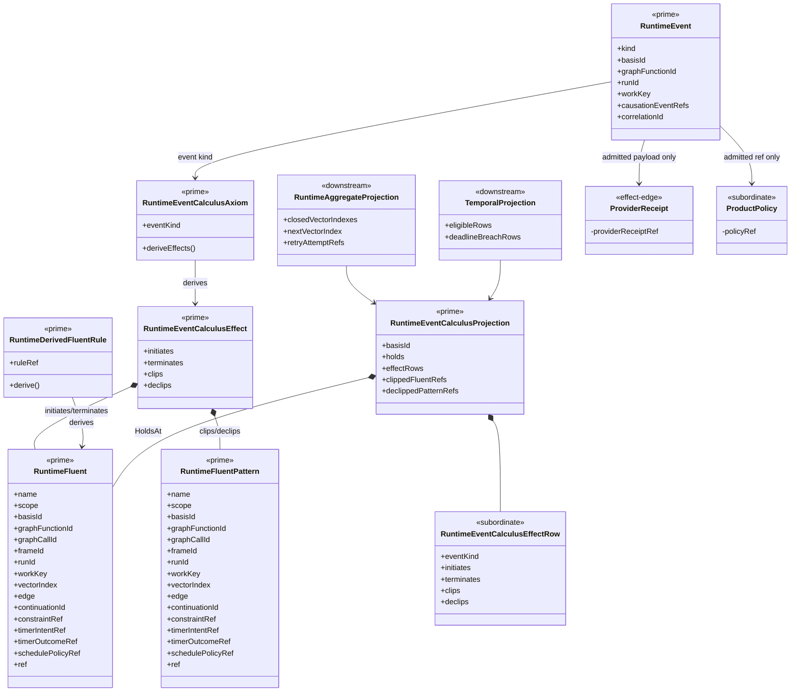

# ABG Event Calculus Structural Carrier Diagram

**Status**: Active
**Date**: 2026-05-07
**Tickets**: T-120, T-121, T-122

## Boundary Notes

`RuntimeEvent` is the admitted happened-fact carrier. `RuntimeEventCalculusAxiom`
declares event-kind effects, and `RuntimeEventCalculusProjection` derives
`HoldsAt` read-model truth. Downstream projections consume that truth; they do
not become event emitters or graph iterators.

Provider receipts and product policy are subordinate payload refs on admitted
events or projection inputs. They do not authorize runtime truth without ABG
event admission.
