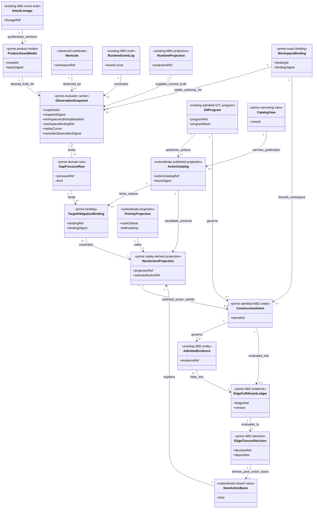
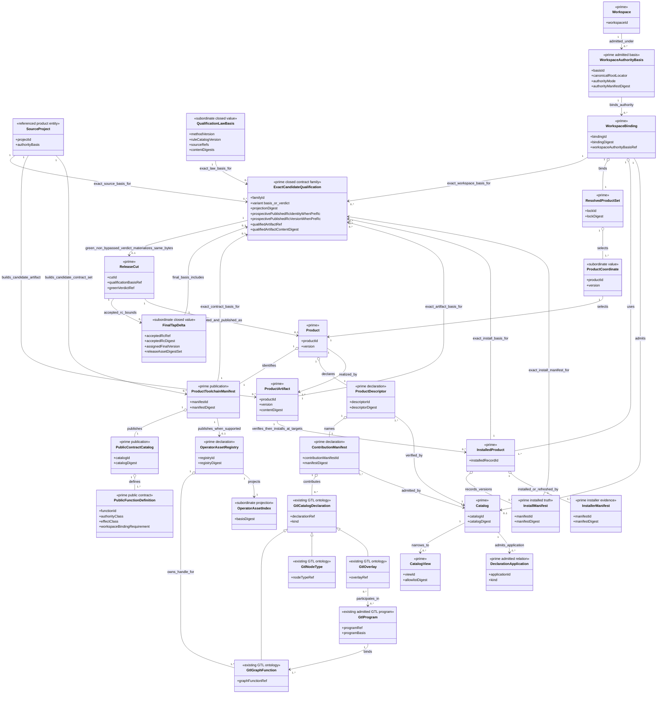
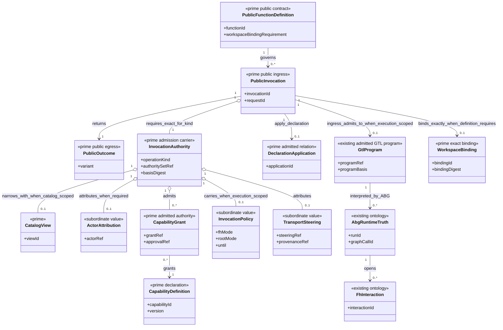
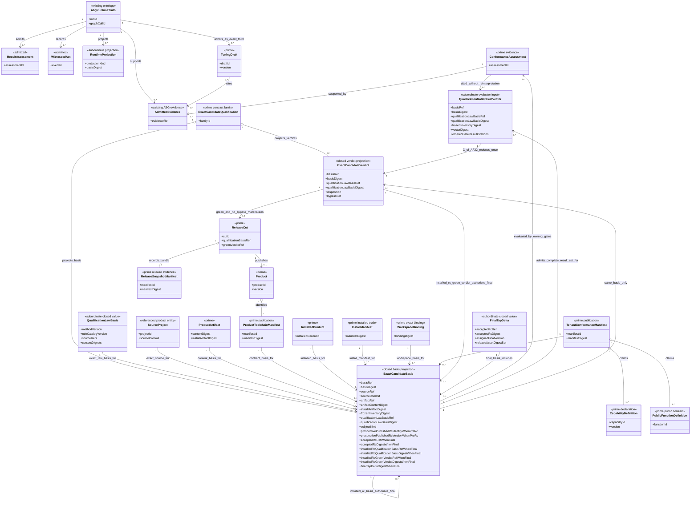
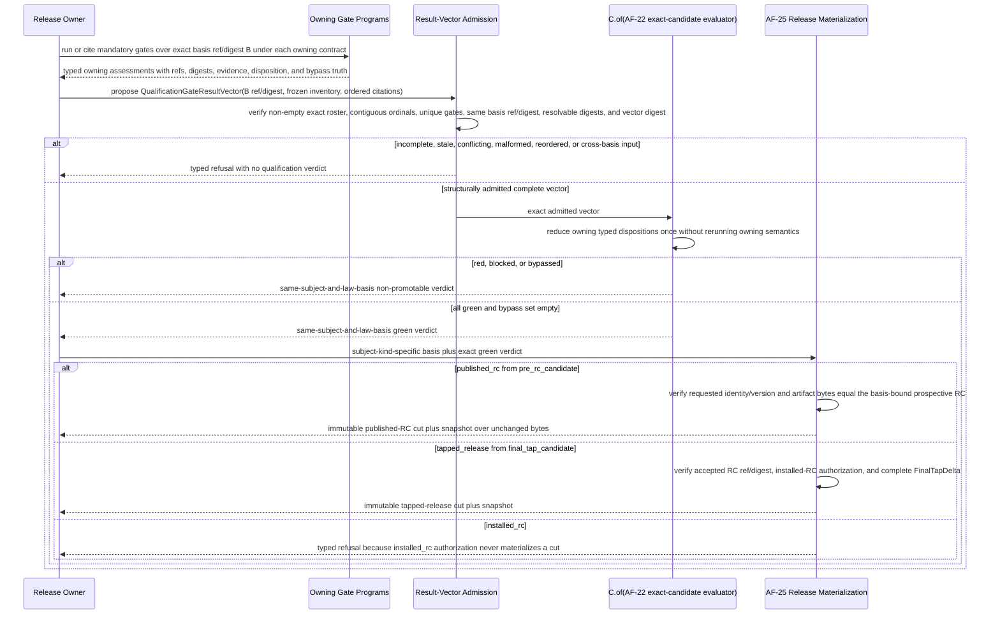
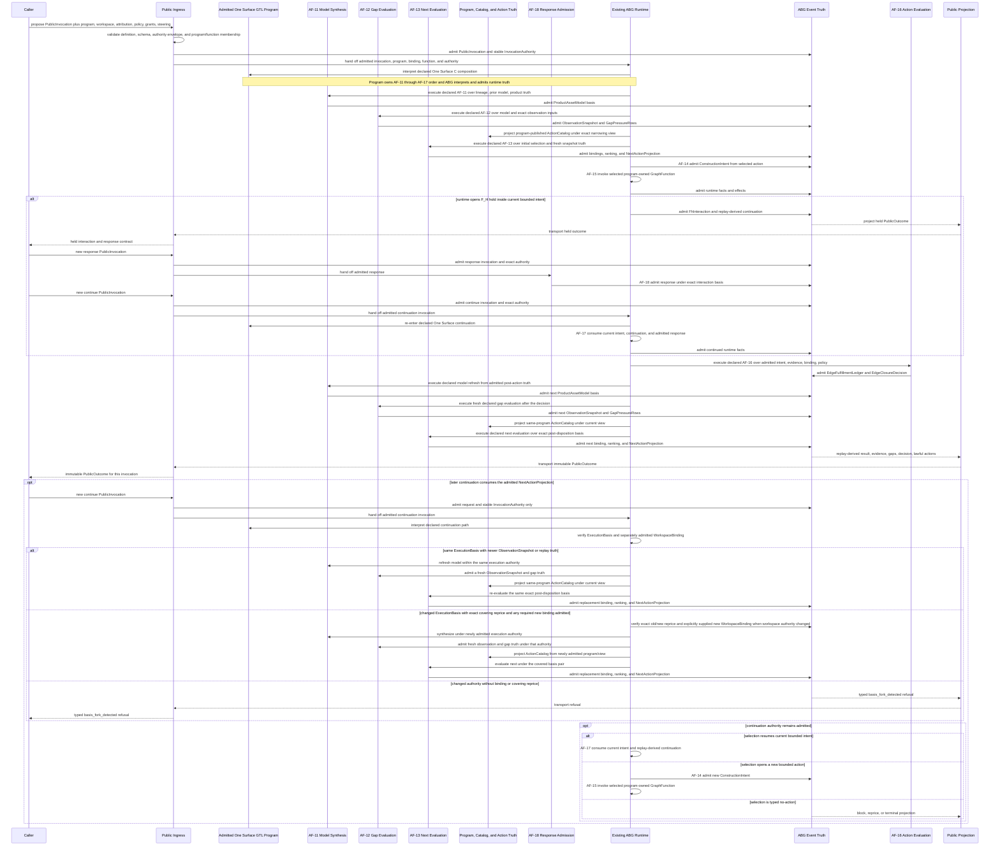
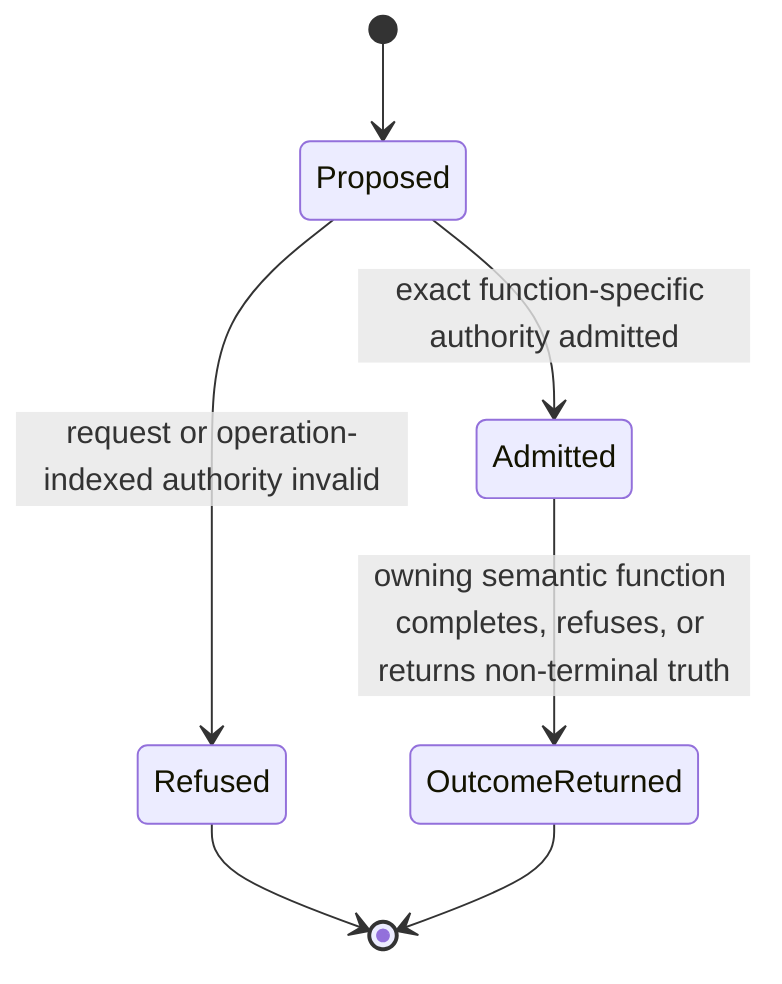
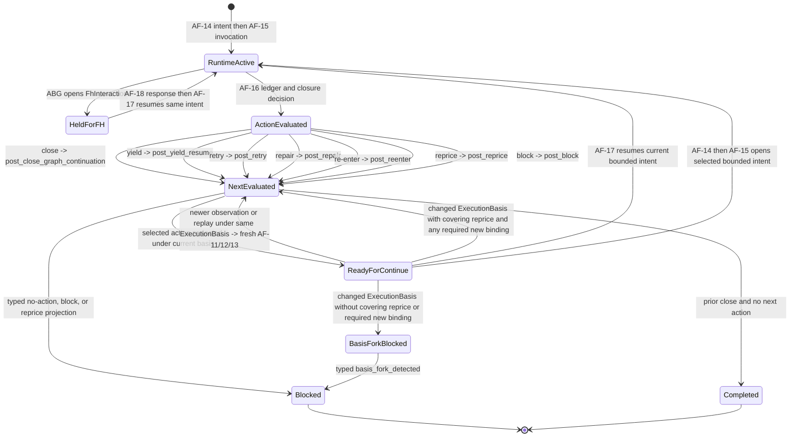

# ABIogenesis Public Control-Plane Ontology

**Status**: Ratified

**Design verdict**: `accepted`

**Owner ticket**: T-278

**Boundary**: ABIogenesis 5.0 installed product and public operator control plane

**Ontology version**: `abg.public-control-plane.ontology/9`

**Date**: 2026-07-16

**Accepted semantic candidate SHA-256**:
`1ca39b2b5c536be6d16eecfb30d8310e798853232ae7c03f71ac655a7f97bf40`

Constitutional propagation, T-244 regeneration, and final independent design
review are complete. Runtime implementation remains prohibited until the
affected three-view designs are reconciled to this Ontology and accepted.

## Exact Basis

| Source | SHA-256 basis | Use |
|---|---|---|
| `specification/GOALS.md` | `ec8945b558833c2073c70bcf99d28d668200d225867ca288b46f7c0fd52b9756` | current 5.0 goal, retained feature families, and DS sequence |
| `specification/INTENT.md` | `a24c6bcbe4605d8ef0444c063ce61a58d43632b2bcc42b4752e42935d93d9b9f` | operator and product direction |
| `specification/PRODUCT.md` | `5baa698c8d398118649260ce350f3dc2bd2d33c60ef66078d4a2a0a927fb15f2` | GTL, ABG, recursive product taxonomy, installed-product, and public-operator truth |
| `REQ-P-POLICY.md` | `89cf57e14f74cd4ea433c277f88d89a5972e49b421801878d44b7481801c022f` | operator grammar, control modes, descriptors, and discovered public behavior |
| `REQ-P-PUBLIC-CONTRACTS.md` | `eed6bfd474d8e572a82d25a7e227f5e1e447f0f78f75933a32fdaf3ed7c43764` | current identities, invocation descriptors, capabilities, and publication law |
| `REQ-P-CATALOG.md` | `af273d059574c4e8e19a9599005956683372db88ba0d8e57d5c5b14a58ff3c84` | product descriptors, contribution manifests, kinds, application, and allowlist law |
| `REQ-P-INSTALL.md` | `72b09080ed9b47643a73e762a8a43622b798f5b0c7d55d31906947432b783e74` | product, artifact, install, toolchain, workspace, and binding law |
| `REQ-P-CONSENSUS.md` | `d6e92b75cd52fb9f2063d0a6ff99d36a7617a52c997ff165236cb2571c9fd36d` | reference GraphFunction consumer and workspace applications |
| `REQ-P-SCENARIOS.md` | `a7430bb1468f6d26d46bfdd41be43c81220954e793ff47052488b206b54b0562` | installed operator and Consensus behavior |
| `REQ-P-QUAL.md` | `bebedefb749e6cb6be3111bbadb8a342aca396b88456947bbe0dde1cb5b4b6dd` | exact candidate, malformed-output, manifest, and release evidence |
| `REQ-P-SELF-CONFORMANCE.md` | `a1f7e53a0bf5ec8516d2fecb0a720e2580fd18d72b49e94bc44f38f68e935349` | exact-candidate self-conformance evaluator and release-gate law |
| `REQ-L-GTL3-CONTRACT-LAW-API.md` | `c2380d7798e1bd8eec80b7b603ca2a3dba963a9ab5ba337d9ce28649f7118473` | public GTL contract-law and conformance boundary |
| `REQ-L-GTL3-GRAPHFUNCTION.md` | `9a985fef7c65d7d8300889fc907cc98f5a5635af5369f53f965dd43d44519ce9` | sole callable graph-function law |
| `REQ-L-GTL3-MODULE.md` | `28fb36494877498bab6de5b0753c9000a299a32487b396110d2e76365da53f5d` | publication boundary |
| `REQ-L-GTL3-C-ALGEBRA.md` | `d8aed10438318ed4b9f1a7007dd0a184255f082baeb020dd3be859e0ae42f78b` | higher-order composition law |
| `REQ-M-GTL3-CAPABILITY.md` | `747da8c0749961c985f79cebe8629a8f5c07790ad501c227036bec24cfa64642` | declared and admitted capability-profile law |
| `REQ-M-GTL3-PROGRAM-TRAVERSAL.md` | `c437994f6e1760cbd2e8bec5f542f1158e805fc518eb8f9c48843e9b480e7cc4` | admitted GTL program, callable GraphFunction library, workspace, and ABG traversal boundary |
| `REQ-R-ABG3-INTERPRET.md` | `6abd6e6c40195bc99a23f1bbf4e69cdaf43b8f04d5f4a7c9ea02831ff86c6092` | interpreter ownership |
| `REQ-R-ABG3-BINDING.md` | `b700df9d9bda0a1f538be517de3e55ebef878f55b6cf7eae8a08c36fd60650d2` | exact workspace and product binding |
| `REQ-R-ABG3-CONTINUATION.md` | `9b76d770d2bfe5f1e365cafcdf4c4fb21c37356f5a5848124e149a5d57cce144` | replay-derived continuation |
| `REQ-R-ABG3-EVENTS.md` | `eee93a090f45576b2e76b3a9f8379c71ffbd8e2009057297da1bed27e04a03a2` | only-written runtime truth, emission, attribution, and replay-reconstructability law |
| `REQ-R-ABG3-PROJECTION.md` | `ea67216190dc59dd14eac9797ab544ee79d9798673a82925d2d8bcddb2a2dfb5` | replay-owned projection truth |
| `REQ-R-ABG3-PLUGIN-SEAMS.md` | `8bbf9d74b621ab2d1ebabda6b096f46c2417ecfa7c0fabb8594b1a7db8562dae` | live capability ingress and approval gap |
| `REQ-R-ABG3-FP-CONSCIOUSNESS.md` | `8ab5dcce84df9ac077afbc358bd980f19149dbd39dff1b19aa9636070ef019c7` | existing construction-episode precursor and current One Surface reconciliation input |
| `REQ-R-ABG3-FN-COMPOSITION.md` | `39d9e8a2678a1cacff0ffd2a518b2857e378660022d51c81ac0d3d9429619677` | construction-intent and graph-function composition admission |
| `REQ-R-ABG3-TUNER.md` | `8c3fb81bcdc831f7f4b1c5dc7b640e9bc9a18c64a57bb54df80c23a0ee0a5c0f` | drafts-only tuning and event-owned truth |
| `REQ-R-ABG3-SUPERVISOR-WITNESS.md` | `2e2262380a9e29cf1fc6aba7c291b50d33518c149bbe2c59b2cd464d579e27e3` | one operator-command/event grammar |
| derived T-244 feature register | `fa49b92289ee0e86f58c59ee84aed57f843c906d7c296dcf6d2cde00815ff2c2` | no-silence coverage input; not constitutional authority |
| upstream `DESIGN_MODULE_METHOD.md` | `c28084bc8b14dc4b19f50bf280be249031ff06a89559760d362524b4267c7911` | Ontology-first semantic-design law |
| upstream `ODD_METHOD.md` | `e420024069307ec0de189b3e6e401058db063dfdcc8c701fee3088e844f060f4` | One Surface constructive-evaluation and yield-loop law |
| upstream `RELEASE_METHOD.md` | `31b549e749867ff6280f7529dce4a2ddd7080df8cd548652343099bfabf4f6e8` | release-cut and tapped-product distinction |

Any changed digest invalidates this candidate basis and requires affected rows
to be re-evaluated before acceptance or implementation.

## Claim

ABIogenesis already defines two governing ontologies:

- GTL owns authored language entities and composition;
- ABG owns runtime entities, admitted facts, traversal, continuation, lineage,
  and replay.

The missing design authority is the public control-plane Ontology that joins
installed-product entities and operator interaction goals to those two
ontologies. The public control plane must not recreate GTL or ABG entities. It
projects and invokes them through product-owned lifecycle, policy, and public
contract boundaries.

The 36 legacy operation labels and the two required public application
behaviors for `node_type` and `overlay` remain discovery inputs. All 38
behaviors are accounted for, but they are not axiomatic primitives. The
accepted constitutional output is the Prime-derived 19-operation projection;
constitutional propagation and T-244 regeneration are complete.

## Accepted Intent And Product Shape

The bounded intent reprice resolved the former ambiguity between program and
callable function. The accepted intent is:

- a GTL program is an admitted graph overlay or GTL program composition;
- `GraphFunction` is the sole public named callable library function/work
  contract inside such a program;
- a workspace is mutable instance/worksite surface, never program or traversal
  authority; and
- ABG interprets the admitted program and invokes selected GraphFunctions
  through one event-sourced runtime.

The superseded PRODUCT `iterate(current_surface_projection,
cumulative_context, evaluators) -> runtime_events` precursor could not define
outcome compute by collapsing model synthesis, gap evaluation, next-action
selection, action evaluation, intent admission, and invocation. Current PRODUCT
preserves the One Surface chain and the four distinct authority functions
defined below.

F_H accepted the target shape at `83c87dec`, authorizing constitutional
propagation only. INTENT, PRODUCT, requirements, GOALS, and the derived T-244
register now carry that accepted truth, and the exact basis above has been
recomputed. Final Ontology ratification still requires independent review of
this exact current-basis candidate; runtime implementation remains frozen until
that review is accepted.

## Boundary And Exclusions

This Ontology owns:

- installed product and workspace lifecycle exposed to a trusted developer;
- public catalog preparation, selection, and invocation;
- public projection of ABG run, result, evidence, replay, gap, action, and F_H
  truth;
- product-owned conformance, observer, tuning, configuration, and release
  behavior; and
- the SDK/CLI contract through which those functions are invoked.

It does not own:

- GTL language declarations or composition law;
- ABG runtime event, frame, continuation, closure, retry, or replay semantics;
- downstream domain meaning;
- worker internals or private plugin strategy;
- a second controller, event store, catalog, or truth model; or
- compatibility preservation for a superseded public operation shape.

## Ontology Model

### Entity Classes

| Entity or value family | Identity and authority | Classification | Governing truth |
|---|---|---|---|
| `SourceProject` | stable project identity plus current authority basis; mutable authoring reality | referenced product entity | recursive product taxonomy and project authority |
| `Workspace` | stable workspace identity; root and observations do not redefine it | prime entity | installed substrate contract |
| `WorkspaceAuthorityBasis` | workspace identity, canonical root locator, authority mode, and authority-bearing manifest/configuration digest; excludes readiness, replay, runtime projection, observed-state refs, and mutable-root content | prime admitted authority basis | workspace identity and authority admission law |
| `IntentLineage` | admitted source-intent identity plus causal lineage refs | referenced existing ABG event-log entity | One Surface and ABG event truth |
| `RuntimeEventLog` | append-only admitted runtime fact identity, predecessor chain, and cursor | referenced existing ABG entity | ABG runtime and replay truth |
| `ProductAssetModel` | model identity/version/basis over desired and known typed product assets | prime product-model entity | One Surface product-owned model truth |
| `Worksite` | current workspace, runtime archive, product roots, profile, and observed file/process state | subordinate observed substrate | One Surface observation law |
| `ObservationSnapshot` | snapshot identity/digest over stable workspace authority/binding refs, model basis, replay cursor, runtime projection, worksite observation digest, and observed-state refs | prime evaluator carrier | One Surface observation and gap-evaluation law |
| `GapPressureRow` | pressure identity/ref over missing, partial, blocked, waiting, or ambiguous typed truth | prime product-domain row | One Surface gap meaning |
| `TargetObligationBinding` | binding identity/digest from pressure to exact targets, obligations, roles, evidence, and admissible outcomes | prime product-domain binding | One Surface exact-target law |
| `GtlProgram` | admitted overlay or GTL composition identity/version/basis that binds GraphFunctions, vectors, starts, roles, policy, proof, and result contracts | referenced existing GTL/ABG boundary entity | GTL program declaration plus ABG program admission |
| `ActionCatalog` | exact-basis projection of actions published by one admitted GTL program and narrowed catalog view; contains no dynamic eligibility decision | subordinate published projection | GTL/program publication and catalog-view truth |
| `NextActionBasis` | closed `initial_selection | post_yield_resume | post_close_graph_continuation | post_retry | post_repair | post_reenter | post_reprice | post_block` reason plus causal refs | subordinate value family | One Surface totality law |
| `PriorityProjection` | deterministic ranking and tie-break projection over lawful bindings | subordinate projection family | product policy plus evaluator law |
| `ConstructionIntent` | admitted selected action identity bound to lineage, admitted program, target obligations, and next-action projection | prime admitted ABG entity | One Surface intent-admission law |
| `AdmittedEvidence` | evidence identity/ref admitted from worker, process, product, execution, materialization, liveness, or postflight truth | referenced existing ABG entity | ABG evidence admission |
| `EdgeFulfillmentLedger` | immutable ledger identity/version over closure-relevant admitted evidence and obligations | prime ABG evidence entity | One Surface closure-evidence law |
| `EdgeClosureDecision` | decision identity over exact ledger/basis and `close|yield|retry|repair|re-enter|reprice|block` | prime ABG decision entity | One Surface action-evaluation law |
| `NextActionProjection` | causal replay-derived next-action identity over basis, fresh gap, binding, action catalog, ranking, and selected/no-action result | prime replay-derived projection | One Surface next-action law |
| `ProductCoordinate` | product identity plus exact version and contract/capability constraints | subordinate value family | product dependency law |
| `QualificationLawBasis` | exact specification-method version, applicable rule-catalog version, source refs, and content digests used to decide one qualification basis | subordinate closed value owned by the qualification basis; no independent lifecycle or evaluator | self-conformance and exact-candidate qualification law |
| `ExactCandidateQualification<K>` | one content-addressed qualification contract family with closed `basis` and `verdict` projections; the basis binds a closed `pre_rc_candidate | installed_rc | final_tap_candidate` subject kind plus exact source, artifact, manifest, installed-product, workspace-binding, tenant-manifest, frozen-inventory, and `QualificationLawBasis` truth; a pre-RC basis also binds the prospective published-RC identity/version and the exact already-versioned artifact ref/content digest that publication must preserve unchanged; a final-tap basis additionally binds the accepted RC, the exact installed-RC qualification basis and green non-bypassed verdict that authorize final derivation, and the permitted final delta; the verdict binds that same basis ref/digest and law-basis digest to mandatory assessment outcomes and an explicit bypass set | prime qualification contract family | exact-candidate qualification and self-conformance law |
| `QualificationGateResultVector<K>` | one closed non-empty `C.of` input containing the exact `ExactCandidateQualification<basis>` projection ref and digest, matching `QualificationLawBasis` ref/digest, its basis-bound frozen inventory digest, vector digest, and a complete ordered family of subordinate gate-result citations; each citation preserves stable ordinal, unique gate identity, owning assessment ref/digest, typed `green | red | blocked` disposition, evidence refs/digests, and bypass refs without reinterpreting the owning result | subordinate typed result-vector carrier; not a GTL HOF application | exact-candidate qualification plus owning gate law |
| `FinalTapDelta` | subordinate closed value over accepted-RC ref/digest, assigned final version, and reconciled release-scoped asset digests; product behavior, declaration, public-contract, or dependency change is unrepresentable | subordinate release value | final-only release reconciliation law |
| `ReleaseCut` | immutable published-RC or tapped-release boundary materialized only from a same-subject-and-law-basis green, non-bypassed `pre_rc_candidate` or `final_tap_candidate` verdict respectively; `installed_rc` cannot materialize it | prime entity | release method and release product law |
| `Product` | tapped immutable product identity/version bound to one accepted release cut and product toolchain manifest | prime entity | recursive product taxonomy and release authority |
| `ProductToolchainManifest` | `abg_product_toolchain_manifest` identity/digest over exact candidate/product content and one public-contract catalog; built before qualification and later identified by the released Product | prime publication entity | installed-product and public-contract law |
| `PublicContractCatalog` | catalog identity/version/digest over addressable native/schema/vocabulary/corpus/operation/capability contract rows; exact-candidate qualification is published as one schema identity and one authoritative document with addressable basis, verdict, law-basis, result-vector, and final-delta definitions | prime publication entity | public-contract law |
| `ProductArtifact` | artifact identity plus candidate/product coordinate, content digest, and install-artifact digest; a source project may build it before release, publisher supplies it, verifier admits it, and a later released Product binds the exact accepted artifact | prime entity | release/product contract |
| `ProductDescriptor` | publisher-authored immutable identity over product/version/artifact/dependencies/contribution manifest | prime declaration entity | catalog product identity law |
| `ContributionManifest` | publisher-authored immutable identity over exact contribution rows | prime declaration entity | catalog contribution law |
| GTL `GraphFunction`, `NodeType`, and `Overlay` declarations | existing GTL identities named by contribution rows | referenced existing Ontology | GTL and catalog-kind law |
| `ResolvedProductSet` | lock identity and digest; resolver derives | prime entity | product dependency law |
| `InstalledProduct` | product identity plus installed-content record | prime entity | installer result |
| `InstallManifest` | installed runtime and command-binding truth for one target/basis | prime installed-truth entity | install and public-schema law |
| `InstallerManifest` | installer build, copied reference payload, provenance, and result truth | prime installer-evidence entity | install and public-schema law |
| `WorkspaceBinding` | stable workspace-authority-basis ref, exact resolved lock, installed-product identities/digests, declared root locators, and binding digest | prime entity | product binding law |
| `Catalog` | catalog identity/version/digest over admitted contribution rows | prime entity | M02 declaration plus M03 admission |
| `CatalogView` | catalog-bound narrowing identity and allowlist digest | prime entity | session selection law |
| `DeclarationApplication` | kind, catalog row, admitted target, basis, and application identity | prime admitted relation | non-callable node-type/overlay application law |
| `OperatorAssetRegistry` | published handle-to-one-governing-GraphFunction ownership declarations; present only when asset targets are published | prime declaration entity | operator asset ownership law |
| `OperatorAssetIndex` | handle lookup projected from one admitted operator asset registry | subordinate projection family | operator asset ownership law |
| `PublicFunctionDefinition<K>` | derived function identity, contracts, authority/effect class, operation/variant-indexed `workspaceBindingRequirement: forbidden | exactly_one`, and adapter coordinates | prime public contract family | accepted Ontology plus contract publication |
| `PublicInvocation<K>` | invocation/request identity plus exact function, schema, authority, input basis, and a workspace binding exactly when its closed operation variant requires one | prime public ingress family | accepted function definition and public admission |
| `ActorAttribution` | actor identity and provenance only; carries no authority by itself | subordinate value family | operator-command/event grammar |
| `CapabilityDefinition` | stable capability identity/version plus owning contracts and proof obligations | prime declaration entity | product capability law |
| `CapabilityGrant` | grant identity over actor, capability, approval/policy ref, scope, and exact basis | prime admitted authority entity | capability-profile and plugin-capability admission law |
| `InvocationPolicy` | exact `fh_mode` and `root_mode`, `until`, and session values; only the two mode families/defaults are currently closed | subordinate value family | product operator policy |
| `TransportSteering` | declared host steering input/ref plus provenance; carries no authority itself | subordinate value family | host descriptor and public ingress law |
| `InvocationAuthority<K>` | operation-indexed authority-set identity over the exact required attribution, grants, optional catalog view, optional policy, steering provenance, and stable authority basis for `K`; mutable model, observation, and replay refs are inputs/evidence rather than grants | prime admission carrier | public ingress and ABG execution-basis law |
| `Run`, `GraphCall`, `Frame`, `TraversalUnit`, `Continuation` | existing ABG identities | referenced existing ontology | ABG runtime Ontology |
| `FhInteraction` | pending interaction identity plus exact basis and response contract | referenced existing ontology | ABG runtime Ontology |
| `ResultAssessment` | assessment identity over exact result, contract, actor, and basis | referenced/admitted entity | ABG admission and event truth |
| `WitnessedAct` | event identity over typed act, subject, actor, and basis | referenced/admitted entity | ABG event truth |
| `EvidenceRecord` | typed read/schema representation of one `AdmittedEvidence`; preserves the same evidence ref, subject, producer, basis, content/artifact ref, and digest | subordinate projection family | owning ABG or product evidence law |
| `TuningDraft` | draft identity/version/basis; product policy owns lifecycle | prime entity | product tuning policy |
| `ConformanceAssessment` | assessment identity over submitted subject and law basis | prime evidence entity | conformance evaluator |
| `GeneratedProductAsset` | kind, content identity, basis, provenance | closed value family | context/config projection or materialization |
| `TenantConformanceManifest` | manifest identity/version/digest plus exact contract/capability claims | prime publication entity | mapping and tenant-conformance law |
| `ReleaseSnapshotManifest` | authoritative read model over one immutable snapshot bundle, exact cut, artifacts, checksums, and gate evidence | prime release-evidence entity | qualification and release-snapshot law |
| `RuntimeProjection<K>` | projection kind plus exact source basis; no independent mutation authority | subordinate projection family | ABG replay or product evidence truth |
| `PublicOutcome<K>` | admitted result or typed refusal/non-terminal sum | prime public egress family | owning semantic function |

`ProductCoordinate`, `ActorAttribution`, `InvocationPolicy`,
`TransportSteering`, `OperatorAssetIndex`, `RuntimeProjection<K>`, request payload details, refusal
payload details, catalog rows, schema rows, command coordinates, and adapter
metadata remain subordinate unless a separate Promotion Test proves independent
identity, authority, lifecycle, effect, reuse, or public pattern-match
semantics. `PublicInvocation<K>` and `PublicOutcome<K>` are promoted because
public consumers pattern-match their closed variants; they are not rival domain
lifecycles or semantic function owners.

### Basis Taxonomy

| Basis carrier | Change law | Fork significance |
|---|---|---|
| `WorkspaceAuthorityBasis` | Changes only when workspace identity, canonical root locator, authority mode, or authority-bearing manifest/configuration changes | For workspace- and execution-scoped invocations, requires a separately admitted new `WorkspaceBinding`; observation cannot create it and the old binding is not mutated |
| `WorkspaceBinding` | Immutable exact product, install, lock, and declared-root selection, explicitly named by every workspace- or execution-scoped invocation and ABG execution spine | A different binding is another identity admitted by `AF-07`; it may enter a continued spine only when explicitly supplied with the covering reprice, while the old binding remains immutable and no global current-binding pointer changes; pre-binding operations forbid this carrier |
| ABG `ExecutionBasis` | Immutable execution authority for one causal spine | A different identity on the same spine requires an exact covering declaration reprice or returns `basis_fork_detected` |
| `ObservationSnapshot` | A new value is admitted whenever worksite, runtime projection, or replay observation advances | Invalidates dependent projections only; never requires rebind or reprice |
| `NextActionProjection` | Replaceable replay-derived truth over one execution authority and exact observation/decision inputs | Newer observation or replay truth makes it stale; staleness is not a basis fork |
| `ExactCandidateQualification<basis>` | Immutable content-addressed join of the closed subject kind, exact source ref/commit, product artifact content and install-artifact digests, product toolchain manifest, installed product and install manifest, workspace binding, tenant-conformance manifest, frozen subject-inventory digest, and exact `QualificationLawBasis` ref/digest; `pre_rc_candidate` also binds the prospective published-RC identity/version and exact already-versioned artifact ref/content digest; `final_tap_candidate` also binds accepted-RC ref/digest, the exact installed-RC qualification basis and green non-bypassed verdict refs/digests, and one verified `FinalTapDelta` | Any changed subject or law-basis input is a different qualification basis and invalidates verdict reuse; it is not a release cut or release snapshot; published-RC materialization must preserve the basis-bound identity/version/bytes unchanged; a final basis cites rather than reuses the installed-RC verdict and refuses if that evidence does not bind the accepted RC bytes and installed identity |
| `QualificationGateResultVector<K>` | Structurally admitted only when it cites the exact qualification-basis ref and digest and its result citations are non-empty, contiguous by zero-based ordinal, roster-complete against the basis-bound frozen inventory, same subject and law basis, unique by gate identity, typed, digest-bound, and explicit about bypass; owning gates remain the result authorities | A changed subject basis ref/digest, law basis, inventory, ordinal, gate identity, owning result, digest, disposition, evidence set, or bypass fact creates a different vector; incomplete or conflicting input cannot enter `AF-22` |
| `ExactCandidateQualification<verdict>` | Immutable result over one exact subject-basis ref/digest and matching `QualificationLawBasis` ref/digest, all mandatory assessment refs/outcomes, a closed `green | red | blocked` disposition, and an explicit bypass set | Only `green` with the exact same subject and law basis and an empty bypass set permits `AF-25`; verdict and later release snapshot cannot serve as their own qualification inputs |

Authority-bearing and observed truth therefore have different nominal carriers.
No digest field is interpreted by name or string shape to cross that boundary.

### Relationship And Cardinality Law

The One Surface chain is the governing computational model for construction,
closure, and next-action selection:





Public invocation and authority consume this product/catalog truth and enter the
existing ABG runtime Ontology:



The aggregate `0..1` binding cardinality is the projection of a discriminated
invocation sum, not an optional field available to every request. Each
`PublicFunctionDefinition<K>` operation variant fixes the value to
`forbidden` or `exactly_one`; public admission rejects both a forbidden binding
and an absent required binding before any semantic function executes.

Runtime evidence, product publication, and qualification remain distinct but
joined by exact bases:



Exact qualification and release materialization are acyclic:

```mermaid
stateDiagram-v2
  [*] --> BasisAdmitted: construct exact content-addressed basis with prospective RC identity version and bytes
  BasisAdmitted --> OwningGatesRunning: owning gates execute under their own contracts
  OwningGatesRunning --> InputRefused: missing, duplicate, unordered, stale, untyped, conflicting, or cross-basis citation
  OwningGatesRunning --> QualificationInputAdmitted: complete ordered same-subject-and-law-basis result set matches frozen inventory
  QualificationInputAdmitted --> VerdictReducing: C.of(AF-22 exact_candidate_qualification)
  VerdictReducing --> RedOrBlocked: owning typed outcome is red or blocked
  VerdictReducing --> Bypassed: any mandatory bypass declared or observed
  VerdictReducing --> GreenVerdict: all mandatory owning outcomes green and bypass set empty
  InputRefused --> [*]: no verdict emitted
  RedOrBlocked --> [*]: not promotable
  Bypassed --> [*]: not promotable
  GreenVerdict --> PublishedRcMaterialized: AF-25 published_rc consumes only pre_rc_candidate and preserves identity/version/bytes
  PublishedRcMaterialized --> InstalledRcQualified: fresh install and exact installed_rc qualification; authorization evidence only
  InstalledRcQualified --> FinalAuthorityRefused: installed-RC basis/verdict missing, stale, cross-RC, non-green, or bypassed
  InstalledRcQualified --> FinalBasisAdmitted: bind accepted RC, exact installed-RC basis and green verdict, and complete FinalTapDelta fields
  FinalAuthorityRefused --> [*]: reopen RC window
  FinalBasisAdmitted --> FinalGateRerun: owning deterministic, install, identity, and affected bounded gates
  FinalGateRerun --> FinalInputRefused: incomplete, stale, conflicting, or cross-basis result set
  FinalGateRerun --> FinalInputAdmitted: complete ordered same-subject-and-law-basis result set matches affected inventory
  FinalInputAdmitted --> FinalRefused: C.of(AF-22) emits red, blocked, or bypassed verdict
  FinalInputAdmitted --> FinalGreenVerdict: C.of(AF-22) emits same-subject-and-law-basis green non-bypassed verdict
  FinalInputRefused --> [*]: reopen RC window
  FinalRefused --> [*]: reopen RC window
  FinalGreenVerdict --> TappedReleaseMaterialized: AF-25 tapped_release consumes only final_tap_candidate, verdict, and complete delta
  TappedReleaseMaterialized --> [*]: AF-26 may publish immutable Product
```



The qualification sequence consumes owning proof truth; it does not schedule
the heterogeneous owning gates through a new controller:



`ReleaseMaterialized` cannot transition back into qualification. A changed
source, artifact, install, binding, manifest, or inventory input creates a new
basis identity and a new qualification run.

Representative public invocation and continuation sequence:

Public ingress owns request admission and transport only. The admitted GTL
program owns the AF-11 through AF-17 composition; ABG interprets that
declaration and owns runtime truth. SDK, CLI, and public ingress do not order,
retry, select, evaluate, invoke, continue, or close One Surface work.



Each `PublicInvocation<K>` is immutable and ends in one returned outcome:



ABG runtime state remains a separate replay-derived lifecycle. Response and
continuation transitions below are caused by distinct later public invocations:



Invariants:

1. Source project, exact-candidate qualification family and its basis/verdict
   projections, release cut, product, product artifact, installed product,
   workspace, workspace authority basis, workspace binding, execution basis,
   and observation snapshot are distinct identities. None may relabel another.
2. A workspace identity, `WorkspaceAuthorityBasis`, and `WorkspaceBinding`
   survive ordinary file, process, runtime, replay, artifact, and observed-root
   change. Each re-observation creates a new `ObservationSnapshot`. Only a
   changed workspace identity, canonical root locator, authority mode, or
   authority-bearing manifest/configuration creates a new authority basis.
3. `PublicFunctionDefinition<K>` closes
   `workspaceBindingRequirement(K.variant)` as `forbidden | exactly_one`; no
   concrete invocation variant carries a freely optional binding. Workspace-
   and execution-scoped invocations and every ABG execution spine name exactly
   one current immutable `WorkspaceBinding`. Pre-binding `AF-01`, `AF-02`,
   `AF-04`, `AF-05`, `AF-06`, and `AF-07` invocation variants forbid a binding:
   they establish or verify the inputs from which a later binding is admitted.
   Source-specific read variants and every other operation are classified by
   the same closed definition relation. A binding names one exact workspace
   authority basis, resolved set, verified installed-product set, and declared
   root set. Multiple immutable binding identities may exist for a workspace,
   but 5.0 has no mutable global current-binding pointer and does not update,
   unbind, or supersede an old binding. A changed binding enters a continued
   spine only as an explicitly supplied, separately admitted identity under the
   exact covering reprice. New observations do not create or invalidate a
   binding.
4. Product descriptor and contribution manifest are publisher-authored immutable
   truth. Resolution, installation, and catalog admission verify them but never
   reconstruct omitted declarations.
5. Catalog admission consumes the exact binding, lock, installed products,
   descriptors, and contribution manifests; it cannot infer or change them.
6. A catalog view narrows one catalog and cannot widen or rewrite it. The
   operator-asset index is a projection over one published operator-asset
   registry, not inferred catalog ownership or a rival catalog.
7. Only `graph_function` is callable. `node_type` and `overlay` application use
   one typed non-callable admission family and cannot open a GraphCall or invoke
   a worker.
8. Every public invocation names one function definition and one exact
   operation-indexed `InvocationAuthority<K>`. Its public definition closes
   which attribution, grants, catalog view, policy, steering, basis values, and
   workspace binding are required, optional, or forbidden. Workspace-binding
   cardinality is stricter than the other constituents: every closed operation
   variant chooses only `forbidden` or `exactly_one`. Pre-binding functions
   cannot be made dependent on a workspace binding, and pre-catalog functions
   cannot be made dependent on a catalog view, by a universal carrier shape.
9. For execution-scoped functions, invocation authority carries the effective
   catalog view, closed control modes, `until`, session policy, steering
   provenance, and capability grants required by that function. Actor
   attribution, available capability definitions, admitted per-basis grants,
   and steering remain distinct. Steering carries no grant. A composed function
   cannot widen any constituent grant or the stable execution authority basis.
10. Runtime truth remains ABG-owned after invocation enters admission.
11. Projections read exact source truth and cannot manufacture lifecycle or
    authority.
12. Tuning drafts and state transitions are actor-attributed ABG event truth.
    Product policy owns their meaning; no draft store owns rival lifecycle truth.
13. Tuning ratification does not change effective configuration; it creates
    admitted re-entry work.
14. `ExactCandidateQualification<basis>` exists before qualification and is not
   a release cut or release snapshot. It binds one exact source ref/commit,
   artifact content and install-artifact digests, product toolchain manifest,
   installed-product and install-manifest truth, workspace binding,
   tenant-conformance manifest, frozen subject inventory, and one exact
   `QualificationLawBasis` ref/digest covering the specification-method version,
   applicable rule-catalog version, source refs, and content digests used to
   decide the run. A `pre_rc_candidate` basis also binds the prospective
   published-RC identity/version and exact artifact ref/content digest whose
   already-versioned bytes `AF-25(published_rc)` must publish unchanged. The
   result vector, `AF-22` argument, and verdict must cite that same subject-basis
   ref/digest and law-basis ref/digest. A release cut
   exists only after an `ExactCandidateQualification<verdict>` over that exact
   basis is `green` with an empty bypass set. The cut and its snapshot are
   outputs of `AF-25`; neither may be an input that qualifies itself.
   `AF-25(published_rc)` consumes only `pre_rc_candidate` and verifies exact
   equality with the basis-bound identity/version/bytes. `installed_rc` is
   qualification authorization evidence only and never materializes a cut or
   snapshot. `AF-25(tapped_release)` consumes only `final_tap_candidate`. A
   `final_tap_candidate` basis additionally binds the accepted RC ref/digest,
   the exact installed-RC qualification basis ref/digest and same-basis green
   non-bypassed verdict ref/digest that authorize final derivation, and one
   verified `FinalTapDelta` containing accepted-RC ref/digest, assigned final
   version, and reconciled release-asset digests. The installed-RC basis must identify the exact RC
   bytes and installed identity named by the accepted lineage. Every
   deterministic, install, identity, and
   bounded-behavior gate affected by that delta runs before
   `AF-25(tapped_release)`. A released Product exists only after release
   authority binds that qualified tapped cut to exact artifacts and one product
   toolchain manifest.
15. Public ingress validates and admits `PublicInvocation<K>` and transports
    `PublicOutcome<K>`. The admitted `GtlProgram` owns AF-11 through AF-17
    composition and ABG interprets it. Public ingress and adapters cannot call,
    order, retry, select, evaluate, invoke, continue, close, or own any entity
    lifecycle in that composition.
16. Existing, alternate, and caller-created temporary workspaces are three
    applications of the same workspace/open/create/bind contracts, not runtime
    modes or additional operation identities.
17. `synthesize_model`, `eval_gap`, `evaluate_next`, and `evaluate_action` are
    distinct authority functions. Shared libraries do not authorize one to
    observe, select, admit, invoke, close, or continue on behalf of another.
18. Worksite state is observation only. Closure and next-action selection may
    consume it only through admitted snapshot, pressure, evidence, ledger,
    decision, and causal projection truth.
19. `evaluate_next` is total and selects only published lawful actions. A newly
    selected bounded action cannot invoke until `AF-14` admits a
    `ConstructionIntent` with the exact lineage, binding, action, and authority
    basis. A lawful post-yield resume may cite the existing current intent and
    must consume its replay-derived continuation through `AF-17` instead of
    manufacturing another intent.
20. Public status, result, gaps, lawful-actions, and summary views are read-only
    projections of One Surface and ABG truth. They cannot run evaluators, append
    events, admit intent, select traversal, or close work.
21. Every execution-scoped public invocation names one admitted `GtlProgram`,
    workspace binding, and GraphFunction published by that program. Exact
    function input may narrow the published action universe but cannot bypass
    `evaluateNext` or treat the GraphFunction as the whole program.
22. `ActionCatalog` contains only actions published by the admitted program and
    narrowed catalog view. Current frontier eligibility, target binding,
    ranking, and selection belong exclusively to `AF-13 evaluateNext`.
23. F_P output, F_H judgment, process status, liveness, and worker prose may
    enter only as admitted evidence. `AF-16` is the deterministic F_D closure
    fold over the complete reachable evidence/obligation basis; no individual
    evidence row may close, yield, retry, repair, re-enter, reprice, or block an
    edge directly.
24. One Surface recurses over published refinement. Each published inner vector
    boundary carries its own visible model, gap, binding, action, evidence,
    ledger, closure decision, and next-action projection. Intentionally opaque
    implementation may use local control flow inside one bounded action, but it
    cannot publish, dispatch, retry, repair, re-enter, or close hidden graph
    work.
25. A stale `NextActionProjection` may be recomputed after a newer
    `ObservationSnapshot` or replay cursor inside the same admitted program,
    workspace binding, catalog view, policy, and ABG `ExecutionBasis` identity.
    Observation freshness never requires rebind or reprice. A different
    `ExecutionBasis` on the same spine fails closed as typed
    `basis_fork_detected` unless an admitted declaration reprice names the exact
    old/new pair; a different workspace authority or product binding also
    requires a separately admitted new `WorkspaceBinding` explicitly named by
    the invocation. The old binding remains immutable and is not superseded.
    No public route may infer a binding or silently cross a reprice.
26. Exact-candidate qualification does not schedule heterogeneous owning gates
    through `C.batch`, `fan_out`, `fan_in`, or a release-local controller. Each
    owning gate emits its own typed assessment. Structural admission constructs
    one `QualificationGateResultVector<K>` only when the non-empty result family
    exactly matches the basis-bound frozen inventory, preserves contiguous
    zero-based ordinals and unique gate identities, resolves every owning result
    and evidence digest, and carries one exact basis ref/digest throughout. One
    `C.of(AF-22 evaluateConformance(exact_candidate_qualification, ...))` stage
    consumes that carrier and emits exactly one verdict. Structural admission
    may reject the envelope; it cannot reinterpret an owning gate disposition.

## Entity Lifecycle Completeness

| Entity | Identity | Authority owner | Declare/create | Read/project | Update/transition | Delete/retire |
|---|---|---|---|---|---|---|
| `SourceProject` | project id + current authority basis | project authority | external/project intake establishes identity | `AF-03 project(sourceProject, identity/basis)` | ordinary admitted project work changes its basis | retirement excluded from the 5.0 public control plane |
| `Workspace` | stable workspace id | product workspace authority | `AF-01 constructWorkspace` or admitted imported identity | `AF-02 openWorkspace`; `AF-03 project` after admission | mutable reality is recorded through new `ObservationSnapshot` values; workspace identity remains stable | `excluded_5_0`: workspace deletion requires product re-entry |
| `WorkspaceAuthorityBasis` | basis id over workspace identity, canonical root locator, authority mode, and authority-bearing manifest/configuration digest | workspace authority admission | `AF-02 openWorkspace` verifies and admits | `AF-03 project(workspaceAuthorityBasis, authority/evidence)` | immutable; an authority-bearing change creates a new basis and requires a separately admitted binding | prior authority bases remain evidence; ordinary observation never supersedes them |
| `IntentLineage` | source-intent ref plus causal predecessor refs | ABG event-log admission | source intent enters through existing attributed event admission | `AF-03 project(intentLineage, evidence)` | corrections append or supersede through ABG event law | immutable history retained |
| `RuntimeEventLog` | event-log identity plus ordered event ids, predecessor refs, and cursor | ABG event admission and replay | existing ABG event admission appends exact facts | `AF-03 project(runtime, replay/status/evidence)` | append-only event admission advances the cursor | immutable history retained under ABG law |
| `ProductAssetModel` | model id/version/basis | product model authority with ABG admission | `AF-11 synthesizeModel` publishes an admitted version | `AF-03 project(productAssetModel, assets/evidence)` | `AF-11` creates a new version from lineage, prior model, and admitted product truth | superseded models remain causal evidence |
| `Worksite` | owning workspace/runtime observation basis | observed substrate only | `not_applicable`: it is a view over existing mutable surfaces | consumed only by `AF-12 evalGap` under an exact observation basis | mutable reality changes independently of truth; a new snapshot observes it | subordinate view; no independent retirement |
| `ObservationSnapshot` | snapshot id/digest + stable workspace-authority/binding refs + exact model, replay cursor, runtime projection, worksite observation digest, and observed-state refs | gap evaluator admission | `AF-12 evalGap` admits the read-only snapshot | `AF-03 project(snapshot, observation/gaps)` | immutable; every fresh observation/replay evaluation creates a new snapshot without changing authority or binding | historical evaluator input retained |
| `GapPressureRow` | pressure ref + snapshot/basis/kind | product gap meaning with evaluator admission | `AF-12 evalGap` emits typed pressure | `AF-03 project(snapshot, gaps)` | immutable; fresh gap evaluation emits new/superseding pressure | resolved pressure remains history |
| `TargetObligationBinding` | binding ref/digest over pressure/action/target/evidence basis | product binding policy with ABG selection admission | `AF-13 evaluateNext` derives or verifies the exact binding before selection | `AF-03 project(nextAction, bindings/evidence)` | immutable; changed gap/catalog/target basis creates a new binding | expires with selection basis; remains evidence |
| `GtlProgram` | program ref/version/basis over one admitted overlay or GTL composition | GTL declaration plus ABG program admission | existing GTL declaration and program-admission boundary | `AF-03 project(program, functions/starts/policy/evidence)` | changed overlay/composition creates a new admitted program basis | governed by GTL lifecycle and ABG admission history; public control plane cannot rewrite it |
| `ActionCatalog` | action-catalog ref/digest over actions published by one admitted program and narrowed catalog view | subordinate GTL/program publication projection | `AF-03 project` derives the declared candidate universe from exact program and catalog-view truth only | consumed by `AF-13`; current frontier eligibility, binding, and ranking remain `evaluateNext` authority | changed program or view basis creates a new projection | stale projection cannot select; no independent retirement |
| `NextActionBasis` | exact eight-case kind plus causing lineage/model or decision refs | One Surface dispatch-basis law | `initial_selection` derives from lineage/model; each exact post-action variant derives from the corresponding `AF-16` decision | carried by `AF-13` result/evidence | immutable; each decision creates one causally exact basis value | subordinate value follows projection retention |
| `PriorityProjection` | action-catalog/binding/policy basis plus stable rank/tie-break | product priority policy plus selection admission | `AF-13 evaluateNext` derives | `AF-03 project(nextAction, ranking)` | immutable; changed basis produces a new ranking | subordinate projection; no independent retirement |
| `NextActionProjection` | projection ref + next basis/fresh gap/binding/catalog/ranking/selected-or-no-action basis | ABG next-action admission with product policy | `AF-13 evaluateNext` admits one total result | `AF-03 project(nextAction, result/evidence)` | immutable; post-action evaluation creates a new basis and later projection | retained as causal selection evidence |
| `ConstructionIntent` | intent ref + lineage/program/next-action/binding/authority basis | ABG construction-intent admission | `AF-14 admitConstructionIntent` | `AF-03 project(intent, status/evidence)` | immutable; another selected action creates another intent | ABG retention law; caller cannot rewrite or delete |
| `AdmittedEvidence` | evidence ref + producer/action/basis | owning ABG/product evidence admission | invocation/effect/result admission emits evidence under existing law | `AF-03 project(intent, evidence)` | corrections append new evidence | immutable history retained |
| `EdgeFulfillmentLedger` | ledger ref/version + intent/binding/evidence basis | ABG closure-evidence admission | `AF-16 evaluateAction` creates or versions the ledger | `AF-03 project(ledger, fulfillment/evidence)` | new admitted evidence creates a new immutable version | history retained; no destructive rewrite |
| `EdgeClosureDecision` | decision ref + ledger/basis/disposition | ABG action-evaluation admission | `AF-16 evaluateAction` admits one closed disposition | `AF-03 project(decision, result/evidence)` | immutable; corrected evidence produces a new decision/version | history retained; cannot be deleted by adapter or worker |
| `QualificationLawBasis` | exact method version + rule-catalog version + source refs/content digests | subordinate value owned by one qualification basis; no independent evaluator or lifecycle | constructed from the exact declared self-conformance inputs before the qualification basis admits | cited only with its owning basis, result vector, assessments, and verdict | immutable; any changed method, rule catalog, source ref, or content digest creates a new qualification basis | retained with exact qualification evidence; unresolvable or mismatched basis refuses |
| `ExactCandidateQualification<K>` | family id plus closed `basis` or `verdict` projection; basis is content-addressed over exact subject-kind/source/artifact/manifest/install/binding/tenant/inventory and qualification-law inputs, plus prospective published-RC identity/version and exact already-versioned artifact bytes when pre-RC, or accepted-RC/installed-RC-green-qualification/final-delta inputs when final; verdict cites that exact basis ref/digest and law basis plus all owning assessment outcomes and bypass set | qualification authority; no release authority | the qualify-release composition constructs and admits the basis from existing exact carriers, admits one complete `QualificationGateResultVector<K>` over owning proof truth, then invokes `C.of(AF-22 evaluateConformance(exact_candidate_qualification, ...))` as the sole total typed verdict reducer; this subordinate join and existing evaluator variant add no atomic family or public operation | `AF-03 project(exactCandidateQualification, basis/evidence/verdict)` | immutable; changed subject or law-basis input creates a new basis, and later assessments create a new same-basis verdict rather than mutating an earlier one | historical bases and verdicts remain qualification evidence; red, blocked, stale, mismatched, or bypassed verdicts cannot promote |
| `QualificationGateResultVector<K>` | vector digest over one exact qualification-basis ref/digest, matching qualification-law basis, frozen inventory, and ordered owning-result citations | structural qualification-input admission; owning gates retain semantic authority | proposed only from already-admitted owning assessment/evidence truth and admitted after exact roster, subject basis ref/digest, law basis, ordinal, identity, digest, disposition, and bypass-envelope checks | consumed once by `C.of(AF-22 exact_candidate_qualification)` and projected only with its basis/verdict evidence | immutable; any changed citation, subject basis ref/digest, or law basis creates a new vector digest | retained with qualification evidence; malformed/incomplete vectors are refused and emit no verdict |
| `FinalTapDelta` | accepted RC ref/digest + assigned final version + reconciled release-asset digests | release authority verifier; subordinate to final qualification basis | derived only after the latest accepted RC qualifies and admitted into a `final_tap_candidate` basis after deterministic refusal of behavior/declaration/contract/dependency changes | projected only with final basis and release evidence | immutable; changed value creates a new basis and reruns affected pre-publication gates | retained with release evidence; invalid delta reopens the RC window |
| `ReleaseCut` | cut id + exact qualification-basis and green-verdict refs | release authority | `AF-25 materializeReleaseCut`: `published_rc` consumes only `pre_rc_candidate` and preserves its basis-bound prospective identity/version and already-versioned bytes unchanged; `tapped_release` consumes only `final_tap_candidate`; `installed_rc` is authorization evidence only and cannot materialize a cut or snapshot | `AF-03 project(releaseCut, identity/evidence)` | immutable; changed basis or requested release identity creates another cut | retirement/revocation excluded from 5.0 |
| `Product` | product id + tapped version + release-cut/product-toolchain-manifest basis | release/product authority | `AF-26 publishProduct` only at the final tap | `AF-03 project(product, identity/evidence)` | immutable; later version is another Product | revocation/supersession excluded by REQ-P-POLICY-048 |
| `ProductCoordinate` | product identity/version/constraint tuple | product dependency authority | supplied as a dependency requirement or derived into an exact resolved coordinate by `AF-05` | projected only as part of dependency/product truth | immutable value; changed constraint or selected version is a new value | subordinate value; retirement follows referenced Product law |
| `ProductToolchainManifest` | manifest id/version/digest | product contract publisher | `AF-24 publishProductContractSet` derives exact bootstrap/catalog truth | `AF-03 project(productToolchainManifest, contracts/locators/evidence)` | changed basis creates a new manifest identity | superseded manifest remains historical product evidence |
| `PublicContractCatalog` | catalog id/version/digest | product contract publisher | `AF-24 publishProductContractSet` derives exact addressable contract rows, including exactly one `abg.schema.exact-candidate-qualification` identity backed by one authoritative document with addressable basis, verdict, `QualificationLawBasis`, `QualificationGateResultVector<K>`, and `FinalTapDelta` definitions | `AF-03 project(publicContractCatalog, rows/evidence)` | changed rows create a new catalog identity/version/digest | superseded catalog remains product evidence; reuse with different truth conflicts; subordinate qualification definitions never gain peer schema identities |
| `ProductArtifact` | artifact id + candidate/product coordinate + content and install-artifact digests | source/project artifact publisher; verifier admits checked status; released Product later binds exact accepted bytes | source project or external publisher supplies artifact; `AF-04 verifyProductArtifact` verifies before install or qualification | `AF-03 project(productArtifact, identity/evidence)` | immutable; corrected bytes create a new artifact identity | revocation/supersession excluded by REQ-P-POLICY-048 |
| `ProductDescriptor` | publisher/product/version/descriptor digest | catalog-product publisher | external publisher or `AF-24` for ABIogenesis native product | `AF-03 project(descriptor, identity/dependencies/evidence)` | changed content creates a new descriptor/product version | historical descriptor retained; reuse with different content conflicts |
| `ContributionManifest` | contribution-manifest id/digest | catalog-product publisher | external publisher or `AF-24` for ABIogenesis native product | `AF-03 project(contributionManifest, rows/evidence)` | changed rows create a new manifest identity/version | historical manifest retained; silent replacement conflicts |
| GTL `GraphFunction`, `NodeType`, and `Overlay` declarations | owning GTL identity/version | GTL declaration authority | existing GTL declaration/admission lifecycle | `AF-03` catalog projection after admission | changed declaration versions or supersedes under GTL law | governed by existing GTL lifecycle; public control plane cannot retire it |
| `ResolvedProductSet` | lock id + lock digest | product dependency authority | `AF-05 resolveProductSet` over descriptors and artifacts | `AF-03 project(resolvedSet, lock/evidence)` | immutable; changed requirements create a new lock | supersession excluded in 5.0; historical identity retained |
| `InstalledProduct` | installed-record id + product/artifact content basis | installer admission | `AF-06 installProduct` only after `AF-04` verification | `AF-03 project(installedProduct, status/evidence)` | immutable install; different content creates a different record | uninstall/disable excluded by REQ-P-POLICY-048 |
| `InstallManifest` | manifest id/digest over target runtime and command-binding truth | installer admission | `AF-06 installProduct` | `AF-03 project(installManifest, status/evidence)` | deterministic same-identity refresh creates new attributed manifest truth; cross-content overwrite refuses | historical install truth retained |
| `InstallerManifest` | manifest id/digest over installer build, copied reference payload, provenance, and result | installer admission | `AF-06 installProduct` | `AF-03 project(installerManifest, provenance/evidence)` | changed installer/result basis creates a new manifest | historical installer evidence retained |
| `WorkspaceBinding` | binding id + workspace-authority-basis/exact-lock/installed-product/declared-root digest | product binding admission | `AF-07 bindWorkspace` | `AF-03 project(binding, status/evidence)` | observations leave it unchanged; a different authority basis, product set, or declared root set creates a separately admitted identity explicitly selected by a later invocation | prior bindings remain immutable evidence; 5.0 has no mutable current-binding pointer, unbind, or supersession, and a covering reprice cannot manufacture a binding |
| `Catalog` | catalog id/version/digest | M03 catalog admission | `AF-08 admitCatalog` verifies binding, lock, descriptors, manifests, and rows | `AF-03 project(catalog, list/describe/evidence)` | new contribution basis creates a new catalog version | retirement/revocation excluded by REQ-P-POLICY-048 |
| `CatalogView` | catalog-bound view id + allowlist digest | session-view admission | `AF-09 deriveCatalogView` | `AF-03 project(catalogView, list/describe)` | immutable; changed allowlist creates a new view | expires with session/basis; durable delete not applicable |
| `DeclarationApplication` | application id over kind/row/target/basis | ABG declaration-application admission | `AF-10 applyCatalogDeclaration` | `AF-03 project(application, result/evidence)` | immutable; changed target or declaration creates another application | retirement follows owning program/declaration law, excluded 5.0 |
| `OperatorAssetRegistry` | registry id/digest over published handle ownership | product contract publisher | `AF-24 publishProductContractSet` only when asset targets are supported | `AF-03 project(registry, handles/evidence)`; `OperatorAssetIndex` is its lookup projection | changed ownership creates a new registry identity/version | superseded registry remains publication evidence |
| `OperatorAssetIndex` | registry-basis digest | pure projector | derived from one admitted registry | used only for exact handle lookup | regenerated from new registry truth | subordinate projection; no independent retirement |
| `PublicFunctionDefinition<K>` | function id/version/contract digest plus operation/variant-indexed `workspaceBindingRequirement: forbidden | exactly_one` | accepted Ontology plus public contract publisher | `AF-24 publishProductContractSet` | catalog/schema/SDK/CLI project the same definition and binding requirement | semantic change versions or supersedes the definition | hard-break migration retires non-derived identities |
| `PublicInvocation<K>` | invocation/request id + function/schema/authority/input basis and a workspace binding exactly when its definition variant requires one | owning public function admission | caller proposes; public ingress validates one closed variant, rejects forbidden/present and required/absent binding mismatches, then hands execution-scoped truth to ABG's interpreter | `AF-03 project(invocation, outcome/evidence)` when persisted; ingress transports but does not construct the outcome | `not_applicable`: response and continuation are distinct new invocations bound to prior truth | expires as ingress but remains attributable evidence |
| `PublicOutcome<K>` | owning invocation plus closed result/refusal/non-terminal variant | owning semantic function | owning AF constructs after admission/execution | returned directly and projected from admitted truth when durable | immutable; later runtime truth creates another projection/outcome | no independent delete; follows source retention |
| `RuntimeProjection<K>` | source identity/basis + projection kind | owning source projector | `AF-03 project` derives from admitted source truth | returned through the owning public definition | immutable read model; changed source truth creates a new basis/result | subordinate projection; no independent delete |
| `ActorAttribution` | actor/provenance tuple | operator-command/event admission | supplied and verified at owning public ingress | projected only with owning invocation/event evidence | immutable; changed actor or provenance creates a new value | subordinate value; follows owning evidence retention |
| `CapabilityDefinition` | capability id/version + owning contract basis | product capability authority | `AF-24 publishProductContractSet` | `AF-03 project(capability, definition/evidence)` | semantic change creates a new version | supersession is explicit; no compatibility alias |
| `CapabilityGrant` | grant ref over actor/capability/approval/scope/basis | capability admission | public ingress admits exact grant; **Gap:** per-instance approval attribution/event is not yet realized and routes to T-270 authority reconciliation after Ontology acceptance | `AF-03 project(invocationAuthority, grants/evidence)` | changed actor, scope, capability, approval, or basis requires a new grant | expires with admitted scope/basis; remains evidence |
| `InvocationPolicy` | exact policy-value tuple and basis | product invocation policy | owning ingress validates the requested modes/session/`until` relation | projected with owning invocation authority | immutable; changed value creates a new policy value | subordinate value; follows invocation retention |
| `TransportSteering` | steering ref/input plus provenance | host descriptor/public ingress | supplied only through declared host ingress | projected with owning invocation evidence | immutable input; changed steering or provenance creates a new value | subordinate value; follows invocation retention |
| `InvocationAuthority<K>` | operation kind + stable authority-set ref/digest | owning public ingress then ABG execution-basis admission where applicable | owning invocation admission derives the closed required/optional/forbidden constituent set for `K`; observation and replay freshness are excluded | `AF-03 project(invocation, authority/evidence)` | immutable; any changed authority constituent or operation kind requires a new authority set | expires with invocation/execution basis; remains provenance |
| ABG runtime entities | existing ABG identities | ABG | `AF-15 invokeGraphFunction` or existing ABG admission opens them | `AF-03 project` reads replay truth | `AF-17 continueExecution` and ABG event/continuation law | ABG retention/closure law; public delete not applicable |
| `FhInteraction` | interaction id + exact runtime/response basis | ABG F_H admission | ABG opens from a held runtime locus | `AF-03 project(runtime, pendingInteraction/actions)` | `AF-18 admitHumanResponse` then `AF-17` resumes the same current intent; returned evidence enters `AF-16`, after which ordinary post-disposition One Surface derives the next basis and action projection | ABG resolves/expires under exact basis; caller cannot delete |
| `ResultAssessment` | assessment id + exact result/contract/actor/basis | result-assessment admission | `AF-19 admitResultAssessment` | `AF-03 project(runtime, result/evidence)` | corrections are new attributed assessments | append-only truth retained; delete not applicable |
| `WitnessedAct` | event id + typed act/subject/actor/basis | witness admission | `AF-20 admitWitnessedAct` | `AF-03 project(runtime, evidence/replay)` | correction is a new event | append-only truth retained; delete not applicable |
| `TuningDraft` | draft id/version/basis | product tuning policy; ABG event admission owns truth | `AF-21 transitionTuningDraft(propose)` admits actor-attributed event truth | `AF-03 project(tuning, report/drafts)` from replay | `AF-21 transitionTuningDraft(ratify|reject)` admits events | rejection is terminal disposition; hard delete not applicable |
| `ConformanceAssessment` | assessment id + subject/law basis | conformance evaluator/admission | `AF-22 evaluateConformance` | `AF-03 project(conformance, result/evidence)` | changed subject or law basis creates a new assessment | historical evidence retained; delete not applicable |
| `GeneratedProductAsset` | kind + content/basis digest | owning product asset admission | `AF-23 materializeProductAsset` | `AF-03 project(productAsset, content/evidence)` | changed basis creates a new content identity | supersession by new identity; destructive delete not product truth |
| `TenantConformanceManifest` | manifest id/version/digest | tenant conformance publisher; qualification verifies | `AF-27 publishTenantConformanceManifest` admits claims over exact realized contracts/capabilities/evidence | `AF-03 project(manifest, claims/evidence)` | changed claim or evidence basis creates a new manifest identity/digest | superseded manifest remains evidence; cannot claim current conformance |
| `ReleaseSnapshotManifest` | manifest id/digest over one already-qualified immutable release cut, exact snapshot bundle, and gate evidence | release-snapshot admission | `AF-25 materializeReleaseCut` emits the authoritative snapshot read model alongside the cut after the same-subject-and-law-basis green non-bypassed verdict | `AF-03 project(releaseSnapshotManifest, artifacts/checksums/evidence)` | immutable; changed cut or artifact basis creates a new manifest | historical release evidence retained; it records a published RC or tapped cut and cannot qualify itself or promote bypassed/non-release truth |

No mutable CRUD API is implied. Create means declaration, admission, or
materialization; update means an admitted transition or new version; delete
means retirement or explicit exclusion.

## Atomic Function Families

| Id | Parameterized atomic function | Domain relation | Effect class | Prime reason |
|---|---|---|---|---|
| `AF-01` | `constructWorkspace(target, createPolicy)` | target -> `Workspace` | product filesystem effect | independent workspace identity and explicit clean/import admission policy |
| `AF-02` | `openWorkspace(target, expectedAuthorityBasis)` | existing target -> admitted `WorkspaceAuthorityBasis` plus readiness projection or refusal | boundary admission plus pure read | stable workspace authority is distinct from mutable readiness and observation |
| `AF-03` | `project<S, K>(sourceRef, projectionKind, basis)` | authoritative source -> typed read model | pure projection | one closed parameterized read family; projection kind is subordinate |
| `AF-04` | `verifyProductArtifact(candidate, expectedBasis)` | candidate -> verified/refused artifact | deterministic evaluation | distinct artifact verification authority |
| `AF-05` | `resolveProductSet(requirements, candidates)` | product constraints -> exact lock or gap | deterministic evaluation | distinct dependency-resolution semantics |
| `AF-06` | `installProduct(verifiedArtifact, target)` | verified artifact -> `InstalledProduct` + exact `InstallManifest` + `InstallerManifest` | product filesystem effect | independent immutable install lifecycle and distinct installed/provenance truth |
| `AF-07` | `bindWorkspace(workspaceAuthorityBasis, installedSet, lock, declaredRoots)` | stable workspace authority + installed set + exact lock/roots -> `WorkspaceBinding` | workspace-binding persistence effect | independent immutable binding identity and authority; observation is excluded |
| `AF-08` | `admitCatalog(binding, descriptors, contributions)` | exact binding and publisher truth -> admitted `Catalog` | ABG catalog admission events | crosses declaration/runtime admission boundary |
| `AF-09` | `deriveCatalogView(catalog, allowlist)` | catalog -> narrowing `CatalogView` | deterministic derivation | independent session-view identity; never widens |
| `AF-10` | `applyCatalogDeclaration(kind, row, target, basis)` | admitted `node_type|overlay` row + target -> `DeclarationApplication` or refusal | typed declaration-application admission | non-callable declarations have application semantics distinct from GraphFunction invocation |
| `AF-11` | `synthesizeModel(intentLineage, priorModel, admittedProductTruth)` | admitted lineage + prior model -> `ProductAssetModel` | governed model-synthesis effect and admission | product-model authority is distinct from worksite observation, action selection, invocation, and closure |
| `AF-12` | `evalGap(workspaceBinding, model, eventLog, runtimeProjection, worksite)` | stable binding + desired/known model + observed truth -> `ObservationSnapshot` + `GapPressureRow[]` | governed read-only evaluator effect and admission | snapshot freshness is distinct from stable authority, action selection, and action-result evaluation |
| `AF-13` | `evaluateNext(nextBasis, freshGap, targetObligations, actionCatalog, runtimeFrontier, policy)` | exact current truth -> `TargetObligationBinding[]` + `PriorityProjection` + `NextActionProjection` | governed selection-evaluator effect and admission | exact binding, current eligibility, and total lawful action selection are distinct from published action projection, intent admission, invocation, and prior-action closure |
| `AF-14` | `admitConstructionIntent(lineage, program, nextAction, binding, authority)` | selected action published by one admitted program -> `ConstructionIntent` or typed refusal | ABG admitted event | selection alone carries no invocation authority; program-bound intent admission is an independent boundary |
| `AF-15` | `invokeGraphFunction(constructionIntent, program, view, function, input)` | admitted program-bound intent -> ABG runtime entry | ABG traversal effect | invocation proves the selected function belongs to the admitted program, consumes admitted intent, and never selects its own action |
| `AF-16` | `evaluateAction(intent, admittedEvidence, binding, policy)` | one action's complete admitted evidence set -> `EdgeFulfillmentLedger` + `EdgeClosureDecision` | deterministic F_D closure fold plus ABG admission | F_P/F_H/liveness outputs remain evidence; only the complete governed fold creates closure truth and it cannot select next action |
| `AF-17` | `continueExecution(continuation, currentIntent, admittedResponseOrInput)` | held/replay frontier for the current bounded intent -> next ABG state | ABG continuation effect | consumes exact replay-derived continuation and existing intent; a newly selected action must use `AF-14` then `AF-15` |
| `AF-18` | `admitHumanResponse(kind, interaction, actor, value)` | pending F_H interaction -> admitted response | ABG admitted event | one closed response family; kind is subordinate |
| `AF-19` | `admitResultAssessment(result, assessment, actor, basis)` | assessed F_P output -> admitted/rejected/blocked result truth | ABG admitted event and evidence input | assessment admission precedes and does not replace `evaluateAction` |
| `AF-20` | `admitWitnessedAct(act, subject, actor, basis)` | witnessed external act -> admitted event | ABG admitted event | attribution records an act; it does not evaluate F_P result truth |
| `AF-21` | `transitionTuningDraft(kind, draft, actor, basis)` | tuning draft -> proposed/ratified/rejected event truth | ABG admitted event | one lifecycle family over one entity without a rival draft store |
| `AF-22` | `evaluateConformance(kind, subject, lawBasis)` | declared subject -> typed assessment; `exact_candidate_qualification` consumes one admitted `QualificationGateResultVector<K>` containing its exact subject-basis ref/digest, matching basis-bound `QualificationLawBasis`, and complete ordered owning-result citations, then emits its same-subject-and-law-basis verdict projection with result cardinality one | deterministic evaluation | evaluator family parameterized by admitted conformance kind; structural input admission checks envelope/completeness and exact subject/law-basis equality only, owning gates keep semantic authority, and the exact-candidate variant is the sole total verdict reducer |
| `AF-23` | `materializeProductAsset(kind, basis, inputs)` | admitted inputs -> context/config asset | product filesystem effect | one content-addressed product-asset family |
| `AF-24` | `publishProductContractSet(definitions, basis)` | accepted product definitions -> exact toolchain manifest, public-contract catalog, descriptors, contribution manifests, public function definitions, capability definitions, and exactly one authoritative exact-candidate-qualification schema document projected under one schema identity | deterministic publication effect | one authoring register projects distinct product-definition artifacts without claiming realized tenant conformance or multiplying subordinate qualification definitions into peer schemas |
| `AF-25` | `materializeReleaseCut(kind, exactBasis, exactVerdict, releaseIdentity, finalTapDelta?)` | `published_rc` consumes only a same-basis green non-bypassed `pre_rc_candidate`, verifies the requested identity/version and artifact bytes equal its prospective basis fields, and publishes those bytes unchanged; `tapped_release` consumes only a same-basis green non-bypassed `final_tap_candidate` with accepted-RC lineage, exact installed-RC qualification basis and green non-bypassed verdict, complete `FinalTapDelta`, and green affected-gate reruns; `installed_rc` never materializes a cut | release publication effect | independent immutable release-cut authority and authoritative snapshot read model; it rejects wrong subject kind, stale/mismatched/red/blocked/bypassed verdicts, cross-RC installed qualification, changed pre-RC bytes, or mismatched law basis, cannot use its own output as qualification input, and cannot publish a final delta that was not qualified before publication |
| `AF-26` | `publishProduct(releaseCut, artifacts, productToolchainManifest)` | final accepted cut + exact artifacts + toolchain manifest -> tapped immutable `Product` | product publication effect | a tapped Product is distinct from its source project, RC/final cut, artifacts, and install |
| `AF-27` | `publishTenantConformanceManifest(tenant, contractCatalog, claims, evidence)` | exact realized contract/capability evidence -> `TenantConformanceManifest` | tenant-conformance publication effect | realized support claims have a distinct publisher, verifier, and evidence basis from product-definition publication |

`AF-03` is not an untyped universal query. `S` and `K` form a closed relation in
the accepted public definition family. A projection kind cannot select a source
for which it has no declared output contract.

`AF-15` does not create an outer traversal controller. It consumes one admitted
program-bound `ConstructionIntent`, verifies that the selected GraphFunction is
published by that program, and invokes it through the existing ABG monad.
`AF-17` consumes replay-derived continuation truth for the current bounded
intent after either admitted F_H input or lawful `AF-13` post-action selection.
It cannot open a newly selected action; that path requires `AF-14` then
`AF-15`. Neither family selects vectors or threads outputs privately.

`InvocationAuthority` construction is subordinate admission inside the owning
public function. It does not become another public atom: the admitted authority
set must be exact for the operation kind before any effect-bearing function may
act. `AF-11`, `AF-12`, `AF-13`, and `AF-16` may share subordinate evaluator
libraries but cannot perform one another's authority. `AF-16` is a deterministic
F_D/ABG closure fold: F_P output, F_H judgment, process status, liveness, or any
single evidence row may be admitted as evidence but cannot directly create an
`EdgeClosureDecision`.

## Higher-Order And Effect Algebra

The public control plane invents no new composition engine. Its constructive
algebra is the accepted GTL `C` family interpreted by ABG:

- unit/lift: `C.of`, `C.id`, `C.edge`, and named `workflow.C`;
- sequence: `C.compose` / ABG Kleisli bind;
- parallel: `C.batch` with declared fan-out/fan-in and cardinality;
- recovery: `C.retry` under one declared retry policy;
- recursion: named GraphFunction/workflow lift and typed termination;
- projection: `AF-03` over admitted source truth; and
- external effect: the owning atomic function emits only its declared effect
  request and admitted result.

Product-level compositions are declared applications of that algebra:

| Composition | Form | Conservation law |
|---|---|---|
| prepare installed workspace | `resolve -> batch(verify) -> batch(install) -> bind -> admit` | exact product, lock, artifact, install, binding, and catalog identities survive every bind |
| One Surface constructive action declared by the admitted GTL program and interpreted by ABG | `synthesize model -> eval gap -> derive action catalog -> evaluate next -> admit new intent or cite current intent -> invoke|continue -> admit evidence -> evaluate action -> exact next basis -> refresh model -> fresh eval gap -> evaluate next -> project` | lineage, stable workspace binding, model, observation, gap, binding, selected action, intent, runtime, evidence, ledger, decision, exact post-disposition basis, and current next-action projection remain causally joined before result/lawful-action projection; `invoke|start` are initial-selection applications, not rival selectors; observation freshness does not change authority; public ingress cannot order the composition; and post-yield continuation cannot invent another current intent |
| supervised root convergence | `One Surface(initial_selection, supervised) -> recurse from admitted decision and fresh gap until typed terminal/no-action` | root supervision is declared GTL/ABG recursion over the same four authorities; every published inner vector refinement recursively receives its own visible One Surface chain, while opaque implementation stays inside one bounded action; no SDK/CLI loop owns convergence |
| interactive continuation | `project pending -> AF-18 response -> AF-17 continuation of current intent -> admit evidence -> AF-16 action evaluation` | direct and human-proxy applications share one interaction policy; F_H response supplies admitted input only and cannot create a next-action basis or select work |
| tune | `project drafts -> propose -> evaluate -> ratify|reject -> ordinary re-entry` | ratification cannot mutate effective config directly |
| qualify release | `AF-24 contract set -> AF-27 tenant manifest -> construct ExactCandidateQualification<basis> from exact source/artifact/install/binding/manifest/inventory/qualification-law truth -> run or cite owning gates under their existing contracts -> structurally admit QualificationGateResultVector<K> with exact basis ref/digest -> C.of(AF-22 exact_candidate_qualification total reducer) -> AF-25 release cut and snapshot`; the pre-RC variant binds prospective published-RC identity/version and already-versioned artifact bytes before qualification; the tapped variant first binds the accepted RC and its exact installed-RC basis/green-verdict evidence, derives prospective final bytes through a complete `FinalTapDelta`, constructs a new final basis, and reruns every affected owning gate | basis construction and result-vector admission are subordinate typed joins; the vector roster derives from the basis-bound frozen inventory rather than a second registry; no qualification-local batch, HOF dispatcher, scheduler, filesystem scan, or semantic checker is introduced; the declared `C.of(AF-22)` stage alone emits exactly one same-subject-and-law-basis verdict; `AF-25(published_rc)` accepts only pre-RC and preserves its bound identity/version/bytes, `installed_rc` authorizes final derivation without materializing a cut, and `AF-25(tapped_release)` accepts only the fully qualified final basis |
| publish product | `qualified AF-25 release cut -> bind exact artifacts and product toolchain manifest -> AF-26 product` | source project, qualification basis/verdict, cut, product, artifacts, named manifests, and eventual install remain distinct identities |

Composition never widens authority. The required authority set for a composed
program is the union of constituent requirements. Each constituent effect may
consume only its own admitted grant, and the complete program remains bounded
by the current workspace, catalog, invocation-policy, and execution basis.
`C.batch`, retry, recursion, and workflow lift cannot borrow a sibling grant or
turn a declared requirement into authority. Projection has no mutation
authority. Adapter transport has no semantic authority.

## Authority Matrix

| Function | Proposer | Evaluator | Verifier | Admitter | Executor | Projector | Retirement owner |
|---|---|---|---|---|---|---|---|
| `AF-01 constructWorkspace` | operator/host | product workspace policy | target/path verifier | public product admission | workspace effect handler | `AF-03` | future product requirement; excluded 5.0 |
| `AF-02 openWorkspace` | caller | workspace identity/readiness policy | stable authority-manifest/root verifier | workspace authority admission plus readiness projection | pure reader | `AF-03` | workspace authority |
| `AF-03 project` | caller selects admitted projection kind | owning source policy | source-basis verifier | query admission | pure projector | owning projection module | source entity owner |
| `AF-04 verifyProductArtifact` | artifact supplier | product compatibility policy | deterministic artifact verifier | product verification admission | deterministic evaluator | verification result projector | product publisher/revocation law, excluded 5.0 |
| `AF-05 resolveProductSet` | operator/host supplies constraints | dependency policy | deterministic resolver | product resolution admission | deterministic evaluator | lock/gap projector | product dependency authority |
| `AF-06 installProduct` | operator | install policy | verified-artifact check | installer admission | installer effect handler | installed-record projector | future uninstall authority, excluded 5.0 |
| `AF-07 bindWorkspace` | operator | binding policy | workspace-authority/exact-set/declared-root verifier | product binding admission | binding effect handler | binding projector | creates immutable binding identities; future in-place rebind/unbind/supersession authority is excluded 5.0 |
| `AF-08 admitCatalog` | bound product contributions | catalog policy | declaration/schema verifier | M03 catalog admission | ABG event writer | catalog projector | future catalog retirement authority, excluded 5.0 |
| `AF-09 deriveCatalogView` | caller allowlist | narrowing policy | catalog/view verifier | session-view admission | deterministic derivation | catalog-view projector | session lifecycle owner |
| `AF-10 applyCatalogDeclaration` | operator/host | typed node-type/overlay application policy | catalog row, kind, target, and basis verifier | declaration-application admission | owning ABG/GTL application handler; never a GraphCall | application/evidence projector | declaration owner; retirement excluded 5.0 |
| `AF-11 synthesizeModel` | attributed intent/product-model source | product model-synthesis policy | lineage, prior-model, and product-truth verifier | ABG event/model admission | declared product model evaluator | model/evidence projector | product model authority |
| `AF-12 evalGap` | stable workspace binding plus current admitted model/runtime/worksite observations | product gap evaluator | workspace-binding/model/replay/worksite observation verifier | ABG evaluator-result admission | declared read-only gap evaluator | observation/gap projector | product gap authority plus ABG evidence retention |
| `AF-13 evaluateNext` | exact eight-case `NextActionBasis` | product next-action evaluator | fresh-gap, target binding, published action catalog, runtime frontier, policy, totality, and causal-basis verifier | ABG next-action admission | declared selection evaluator | priority/next-action projector | ABG selection retention plus product policy |
| `AF-14 admitConstructionIntent` | selected action from admitted next-action projection | invocation/admissibility policy | lineage, admitted program, binding, published action, grant, and current-basis verifier | ABG construction-intent admission | ABG event writer | intent/evidence projector | ABG intent retention law |
| `AF-15 invokeGraphFunction` | admitted program-bound `ConstructionIntent` | public invocation policy | admitted program, workspace binding, catalog view, selected function membership, input, grants, and execution basis | M03/ABG runtime admission | ABG interpreter and declared effect handlers | runtime projections | ABG terminal/retention law |
| `AF-16 evaluateAction` | admitted intent and complete admitted evidence set | product deterministic F_D closure policy plus ABG closure law | evidence reachability, obligation ledger, policy, causal basis, and no-single-evidence closure | ABG ledger/decision admission | deterministic F_D closure fold | fulfillment/decision projector | ABG closure-evidence retention |
| `AF-17 continueExecution` | admitted response/input or post-action resume selection for the current intent | replay frontier and basis-fork law | continuation, current intent, admitted input, current-basis identity, and exact covering reprice when crossing bases | ABG continuation admission | ABG interpreter and declared effect handlers | runtime projections | ABG terminal/retention law |
| `AF-18 admitHumanResponse` | attributed human or admitted human proxy | declared interaction policy | actor/grant/response verifier | ABG F_H admission | ABG event writer | interaction/runtime projector | ABG interaction lifecycle |
| `AF-19 admitResultAssessment` | attributed assessor | declared result/assessment policy | result/contract/evidence verifier | ABG result-assessment admission | ABG event writer | result/evidence projector | append-only runtime law |
| `AF-20 admitWitnessedAct` | attributed witness | witnessed-act policy | act/subject/evidence verifier | ABG witness admission | ABG event writer | evidence/replay projector | append-only runtime law |
| `AF-21 transitionTuningDraft` | operator/observer/tuner | product tuning policy or F_H | draft/current-basis verifier | ABG command/event admission | ABG event writer | replay-derived tuning projector | product tuning policy |
| `AF-22 evaluateConformance` | caller submits subject; exact-candidate variant receives one admitted `QualificationGateResultVector<K>` containing the subject-basis ref/digest, matching qualification-law basis, and complete ordered owning-result citations | named law/evaluator, exactly matching the basis-bound `QualificationLawBasis` | structural vector admission plus deterministic conformance and total qualification-verdict verifier; owning result semantics are not recomputed | conformance admission | deterministic evaluator | conformance or exact-candidate-verdict projector preserving subject and law-basis refs/digests | assessment evidence owner |
| `AF-23 materializeProductAsset` | operator/build process | asset-kind policy | input/basis verifier | product asset admission | asset effect handler | asset/evidence projector | product asset supersession law |
| `AF-24 publishProductContractSet` | product build authority | accepted Ontology and product contract policy | definition/basis/completeness verifier, including one exact-candidate schema identity/document with five addressable definitions | product contract publication admission | deterministic publication generator | manifest/catalog/schema/capability projections | product contract publisher |
| `AF-25 materializeReleaseCut` | release owner | release gate policy | subject-kind verifier: `published_rc` only from pre-RC with equal identity/version/bytes, `tapped_release` only from final-tap with accepted-RC lineage, installed-RC authorization, complete delta, affected green gates; `installed_rc` cannot materialize | release-cut admission | release publisher | release/evidence projector | release authority; revocation excluded 5.0 |
| `AF-26 publishProduct` | release/product owner | product publication policy | cut/artifact/manifest exactness verifier | product publication admission | product publisher | product/manifest/evidence projector | product authority; revocation excluded 5.0 |
| `AF-27 publishTenantConformanceManifest` | tenant product publisher | tenant conformance claim policy | exact catalog/contract/capability/evidence verifier | tenant-conformance publication admission | deterministic manifest publisher | manifest/claim/evidence projector | tenant conformance publisher |

An implementation may combine roles only where the accepted product authority
does. It cannot infer admission from successful execution or infer authority
from actor labels, capability strings, or payload shape.

## Discovered Function Derivation Matrix

| Discovered functionality | Entity | Atomic function or template | Higher-order composition | Effect class | Required authority | Accepted disposition |
|---|---|---|---|---|---|---|
| `workspace.create` | `Workspace` | `AF-01 constructWorkspace` | none | product filesystem | workspace admission | derived atomic -> `abg.operation.workspace.create` |
| `workspace.open` | `Workspace` | `AF-02 openWorkspace` | admission then projection | pure read | workspace query admission | derived atomic -> `abg.operation.workspace.open` |
| `catalog.resolve` | `ResolvedProductSet` | `AF-05 resolveProductSet` | none | deterministic evaluation | resolution admission | derived atomic -> `abg.operation.product.resolve` |
| `catalog.verify` | `ProductArtifact` | `AF-04 verifyProductArtifact` | batch for many artifacts | deterministic evaluation | verification admission | derived atomic -> `abg.operation.product.verify` |
| `catalog.bind` | `WorkspaceBinding` | `AF-07 bindWorkspace` | installed-workspace composition | workspace-binding persistence | binding admission | derived atomic -> `abg.operation.workspace.bind` |
| `catalog.admit` | `Catalog` | `AF-08 admitCatalog` | installed-workspace composition | ABG catalog events | M03 catalog admission | derived atomic -> `abg.operation.catalog.admit` |
| `catalog.list` | `Catalog` | `AF-03 project(catalog, list)` | none | pure read | catalog query admission | derived projection -> `abg.operation.project.read` |
| `catalog.describe` | `Catalog` | `AF-03 project(catalog, describe)` | none | pure read | catalog query admission | derived projection -> `abg.operation.project.read` |
| `catalog.allow` | `CatalogView` | `AF-09 deriveCatalogView` | execution preparation | deterministic derivation | session-view admission | derived atomic -> `abg.operation.catalog.view` |
| `catalog.apply-node-type` | `DeclarationApplication` | `AF-10 applyCatalogDeclaration(node_type, ...)` | none | typed declaration application | declaration-application admission | derived variant -> `abg.operation.catalog.apply`; never callable |
| `catalog.apply-overlay` | `DeclarationApplication` | `AF-10 applyCatalogDeclaration(overlay, ...)` | none | typed declaration application | declaration-application admission | derived variant -> `abg.operation.catalog.apply`; never callable |
| `catalog.invoke` | `PublicInvocation<invoke>` | admitted GTL program declares the `AF-11..AF-16` initial-selection application; ABG interprets it | One Surface constructive action over one exact callable catalog row | governed evaluation + ABG traversal | ingress admits the request; program/ABG own model, gap, next-action, intent, runtime, and action-evaluation order/admission | derived mode -> `abg.operation.run.invoke`; exact function constraint narrows `ActionCatalog`, never bypasses `evaluateNext` |
| `run.start` | `PublicInvocation<start>` | admitted GTL program declares the `AF-11..AF-16` initial-selection application; ABG interprets it | One Surface constructive action under `scope + target + until` | governed evaluation + ABG traversal | ingress admits the request; program/ABG own model, gap, next-action, intent, runtime, and action-evaluation order/admission | derived mode -> `abg.operation.run.invoke`; target resolution is an `AF-13` application, not a second selector |
| `run.resume` | `PublicInvocation<continue>` bound to ABG `Continuation` | admitted GTL program declares the continuation/post-disposition application: F_H hold uses `AF-17` over admitted response/current intent; post-disposition consumes admitted `AF-13`, using `AF-17` for current intent or `AF-14/AF-15` for a new action; newer observation/replay under the same `ExecutionBasis` reruns `AF-11..AF-13`; changed execution authority requires a new binding when applicable and an exact covering reprice; `AF-16` runs when evidence returns | interactive continuation or One Surface exact post-disposition application interpreted by ABG | ingress admits/transports only; program/ABG own response/current projection, intent, continuation, evaluation, and runtime admission | derived atomic -> `abg.operation.run.continue`; an uncovered changed `ExecutionBasis` refuses typed as `basis_fork_detected` |
| `read.status` | ABG runtime truth | `AF-03 project(runtime, status)` | none | pure read | runtime query admission | derived projection -> `abg.operation.project.read` |
| `read.result` | ABG runtime truth | `AF-03 project(runtime, result)` | none | pure read | runtime query admission | derived projection -> `abg.operation.project.read` |
| `read.evidence` | evidence-bearing entity | `AF-03 project(subject, evidence)` | none | pure read | evidence query admission | derived projection -> `abg.operation.project.read` |
| `read.replay` | ABG replay truth | `AF-03 project(runtime, replay)` | none | pure read | replay query admission | derived projection -> `abg.operation.project.read` |
| `read.gaps` | ABG/product gap truth | `AF-03 project(runtime, gaps)` | evaluator projection | pure read | gap query admission | derived projection -> `abg.operation.project.read` |
| `read.lawful-actions` | ABG frontier truth | `AF-03 project(runtime, lawful_actions)` | evaluator projection | pure read | action query admission | derived projection -> `abg.operation.project.read` |
| `fh.select` | `FhInteraction` | `AF-18 admitHumanResponse(select, ...)` | interactive continuation | ABG event | F_H admission | derived variant -> `abg.operation.interaction.respond` |
| `fh.approve` | `FhInteraction` | `AF-18 admitHumanResponse(approve, ...)` | interactive continuation | ABG event | F_H admission | derived variant -> `abg.operation.interaction.respond` |
| `fh.reject` | `FhInteraction` | `AF-18 admitHumanResponse(reject, ...)` | interactive continuation | ABG event | F_H admission | derived variant -> `abg.operation.interaction.respond` |
| `fh.assess` | `FhInteraction` | `AF-18 admitHumanResponse(assess, ...)` | interactive continuation | ABG event | F_H admission | derived variant -> `abg.operation.interaction.respond` |
| `fh.answer-escalation` | `FhInteraction` | `AF-18 admitHumanResponse(answer_escalation, ...)` | interactive continuation | ABG event | F_H admission | derived variant -> `abg.operation.interaction.respond` |
| `result.assess` | `ResultAssessment` | `AF-19 admitResultAssessment` | result admission then `AF-16` action evaluation when closure-relevant | ABG event | result-assessment admission | derived atomic -> `abg.operation.result.assess` |
| `witness.admit` | `WitnessedAct` | `AF-20 admitWitnessedAct(act, ...)` | witness admission then `AF-16` action evaluation when closure-relevant | ABG event | witness admission | derived atomic -> `abg.operation.witness.admit` |
| `observe.report` | runtime/evidence truth | `AF-03 project(observer, report)` | observer fold | pure read | observer projection admission | derived projection -> `abg.operation.project.read` |
| `observe.drafts` | `TuningDraft` | `AF-03 project(tuning, drafts)` | observer fold | pure read | draft query admission | derived projection -> `abg.operation.project.read` |
| `tune.report` | `TuningDraft` | `AF-03 project(tuning, report)` | none | pure read | tuning query admission | derived projection -> `abg.operation.project.read` |
| `tune.propose` | `TuningDraft` | `AF-21 transitionTuningDraft(propose, ...)` | tune composition | ABG admitted event | proposal admission | derived variant -> `abg.operation.tuning.transition` |
| `tune.ratify` | `TuningDraft` | `AF-21 transitionTuningDraft(ratify, ...)` | tune composition then ordinary One Surface re-entry | ABG admitted event | F_H/policy ratification | derived variant -> `abg.operation.tuning.transition` |
| `tune.reject` | `TuningDraft` | `AF-21 transitionTuningDraft(reject, ...)` | tune composition | ABG admitted event | F_H/policy rejection | derived variant -> `abg.operation.tuning.transition` |
| `conformance.typecheck-gtl-program` | `ConformanceAssessment` | `AF-22 evaluateConformance(gtl_program, ...)` | conformance evaluation | deterministic evaluation | conformance admission | derived variant -> `abg.operation.conformance.evaluate` |
| `install.context-bootstrap` | `GeneratedProductAsset` | `AF-23 materializeProductAsset(context_bootstrap, ...)` | installed-workspace composition | product filesystem | asset admission | derived variant -> `abg.operation.product.materialize` |
| `install.install` | `InstalledProduct` | `AF-06 installProduct` | installed-workspace composition | product filesystem | installer admission | derived atomic -> `abg.operation.product.install` |
| `install.gen-config` | `GeneratedProductAsset` | `AF-23 materializeProductAsset(configuration, ...)` | installed-workspace composition | product filesystem | configuration admission | derived variant -> `abg.operation.product.materialize` |
| `release.snapshot` | `ReleaseCut` + `ReleaseSnapshotManifest` | `AF-25 materializeReleaseCut` | consume same-subject-and-law-basis exact qualification verdict emitted by declared `C.of(AF-22)` from one complete basis-ref/digest-bound `QualificationGateResultVector<K>`; `published_rc` consumes only pre-RC and preserves its prospective identity/version/bytes unchanged; `tapped_release` consumes only final-tap and additionally consumes exact accepted-RC and installed-RC-green-qualification lineage plus the qualified complete `FinalTapDelta`; `installed_rc` never materializes | release publication | release admission | derived atomic -> `abg.operation.release.snapshot`; never candidate-freeze or qualification input, and final publication cannot precede affected-gate reruns |

Every row is retained as behavior. No row in this candidate establishes that
its current `abg.operation.*` identity must survive.

### T-244 Retained-Feature No-Silence Check

T-244 is a derived planning basis, not authority. Its 17 retained feature rows
must nevertheless remain accounted for so compression cannot silently delete
accepted release scope.

| Retained feature | Ontology carrier | Current disposition or honest gap |
|---|---|---|
| `A5-F01` exact product/install/workspace/binding/catalog | `AF-01..AF-09`, `AF-24`, `AF-26` | retained; recursive product identities and exact publication truth are explicit |
| `A5-F02` GTL declaration/admission/typecheck/publication | existing GTL Ontology, `AF-22`, `AF-24` | retained; no public-control-plane atom replaces the GTL compiler |
| `A5-F03` seven-term C/runtime join/application | existing GTL C algebra and ABG Ontology, `AF-10`, `AF-11..AF-17` | retained; T-270/T-272 integration remains frozen pending this Ontology |
| `A5-F04` declared instruction and malformed F_P output admission | existing GTL instruction law, `AF-15`, `AF-16`, `AF-19` | retained; malformed output remains pre-write fail-closed and never supplies closure truth directly |
| `A5-F05` addressable contracts/schemas/capabilities/publication | `PublicFunctionDefinition<K>`, `CapabilityDefinition`, `PublicContractCatalog`, `TenantConformanceManifest`, `AF-24`, `AF-27` | retained and Prime-contracted to one definition register and schema projector while keeping realized-claim publication distinct; exact-candidate qualification publishes one schema identity/document with five addressable subordinate definitions |
| `A5-F06` SDK and thin CLI graph shell | public operation projection below | retained as adapters over the derived operation family; no adapter controller |
| `A5-F07` interactive operator loop | `AF-03`, `AF-11..AF-18`, supervised-root and interactive compositions | retained; the operator observes, responds, and continues through One Surface without adapter-owned selection |
| `A5-F08` bounded Consensus GraphFunction | public One Surface/runtime atoms plus existing GTL composition | retained as the first free construction; it creates no Consensus-specific engine atom or private invocation path |
| `A5-F09` list/describe/apply by catalog kind | `AF-03`, `AF-10`, `AF-15` | retained; `node_type|overlay` application is public and non-callable, GraphFunction alone invokes |
| `A5-F10` runtime/replay/provenance/continuation truth | existing ABG Ontology, `AF-03`, `AF-11..AF-20` | retained; no public event store, closure evaluator, action selector, or continuation truth is introduced |
| `A5-F11` ABIogenesis self-conformance | `AF-22 evaluateConformance(self_conformance, ...)`, `AF-27` | retained; exact candidate inventory, realized-claim manifest, and negative proof remain DS-6 work |
| `A5-F12` observer/tuner draft workflow | `AF-03`, `AF-15`, `AF-21` | retained; mutation is ABG event truth and ratification creates ordinary One Surface re-entry rather than direct config change |
| `A5-F13` native plus bounded host compatibility | adapter projection law | retained; native path is semantic authority, host integration is transport only |
| `A5-F14` packed/install/Hello World/live proof | prepare-workspace and One Surface constructive-action compositions | retained as qualification evidence, not a new runtime atom |
| `A5-F15` qualification/self-certifying release read model | `ExactCandidateQualification<K>`, `QualificationLawBasis`, `QualificationGateResultVector<K>`, `FinalTapDelta`, `AF-22`, `AF-25`, `AF-27` | retained; pre-RC qualification binds the prospective RC identity/version and unchanged already-versioned bytes; exact basis ref/digest and matching law basis flow through the vector and verdict; installed-RC authorizes but does not publish; final-tap requires the complete qualified delta before snapshot materialization |
| `A5-F16` immutable RC and final product | `AF-25`, `AF-26` | retained; qualification basis/verdict, published-RC or tapped release cut, snapshot manifest, and released Product remain distinct |
| `A5-F17` downstream catalog compatibility | `AF-04..AF-10`, `AF-15` | retained as generic substrate proof; no odd_glc runtime or release enters the boundary |

No feature row votes for its own constitutional retention. Any later scope
change still requires the named upstream re-entry; this matrix only proves the
candidate Ontology has not lost the current retained set by silence.

### Capability Projection No-Silence Check

The 16 current capability identities remain independently addressable
`CapabilityDefinition` projections from `AF-24`; they do not become 16 runtime
authorities or 16 authored registries.

| Current capability identity | Owning Ontology carrier |
|---|---|
| `abg.capability.gtl.declare@5` | existing GTL declaration law |
| `abg.capability.gtl.admit@5` | existing GTL raw-admission law |
| `abg.capability.gtl.serialize@5` | existing GTL serialization law |
| `abg.capability.gtl.typecheck@5` | existing GTL compiler plus `AF-22` |
| `abg.capability.module.publish@5` | existing GTL Module law plus `AF-24` publication |
| `abg.capability.catalog.contribute@5` | publisher declarations plus `AF-08` and `AF-24` |
| `abg.capability.catalog.invoke-graph-function@5` | One Surface initial selection through `AF-11..AF-15` |
| `abg.capability.catalog.apply-node-type@5` | `AF-10(node_type)` |
| `abg.capability.catalog.apply-overlay@5` | `AF-10(overlay)` |
| `abg.capability.runtime.execute-seven-term-c@5` | existing GTL C and ABG interpreter law through `AF-15` and `AF-17` |
| `abg.capability.runtime.admit-fp-result@5` | `AF-19`, followed by `AF-16` when closure-relevant |
| `abg.capability.runtime.replay-continuation@5` | `AF-03`, `AF-13`, and `AF-17` over ABG replay truth |
| `abg.capability.operator.public-contract@5` | accepted public definition family and its 19 projected operation identities |
| `abg.capability.install.bind-products@5` | `AF-04..AF-09` installed-workspace composition |
| `abg.capability.qualification.self-conformance@5` | `AF-22(self_conformance)` under its distinct qualification law |
| `abg.capability.graph-function.consensus@5` | pure GTL Consensus construction over ordinary published atoms |

Capability availability still does not admit actor-specific execution. An
effect-bearing invocation requires exact `CapabilityGrant` rows in its
`InvocationAuthority`; per-instance approval attribution/event realization
remains an explicit gap rather than being inferred from this catalog.

## Whole-Family Prime Review

This section is the T-278 whole-family contraction and Promotion-Test evidence.
The existing automated Prime regression gate inspects the earlier T-277 design
set and does not inspect T-278; its green result cannot validate this 27/7
target. The 27/7/19 shape below is the F_H-accepted target; this current-basis
realization of that shape remains pending final independent review.

| Recurrence | Prime disposition | Reason |
|---|---|---|
| list, describe, status, result, evidence, replay, gaps, actions, observer reads, and tuning report | contract to `AF-03 project<S,K>` | all are typed projections over admitted truth; source/projection relation remains closed |
| workspace open | retain `AF-02` | unlike an admitted projection, it validates a raw target and establishes workspace/readiness identity |
| `GraphFunctionInvocation` and public operation request carriers | contract to `PublicInvocation<K>` | one public ingress sum owns closed request identity; ABG `GraphCall` remains the distinct admitted runtime identity |
| public result, refusal, and non-terminal carriers | contract to `PublicOutcome<K>` | public consumers pattern-match a closed egress sum; domain results and ABG runtime truth retain their own identities |
| `AdmittedEvidence` and `EvidenceRecord` | retain `AdmittedEvidence`; derive `EvidenceRecord` as its typed schema/read projection | one evidence identity, admission, correction, and retention lifecycle; serialization does not create another truth |
| `synthesizeModel`, `evalGap`, `evaluateNext`, and `evaluateAction` | retain `AF-11`, `AF-12`, `AF-13`, and `AF-16` | One Surface requires four distinct authority functions; common libraries may be subordinate but cannot merge model, gap, selection, or closure authority |
| invoke and start | share one `AF-11..AF-16` initial-selection application | exact-function and `scope + target + until` constraints produce one program/view-derived ActionCatalog consumed by `AF-13`; neither path owns current eligibility, a second selector, or a router |
| node-type and overlay application | contract to `AF-10` with closed declaration kind | both are typed non-callable applications; neither may share GraphFunction invocation |
| five F_H verbs | contract to `AF-18` with closed response kind | one interaction lifecycle and admission owner |
| result assessment and witnessed acts | retain `AF-19` and `AF-20` separately | assessment influences F_P result/retry/closure truth; witness records an attributed external act |
| tune propose, ratify, reject | contract to `AF-21` transition family | one entity lifecycle; authority differs by transition kind and remains explicit |
| context bootstrap and config generation | contract to `AF-23` materialization family | both create content-addressed product assets from admitted basis |
| product toolchain manifest, public-contract catalog, descriptors, contribution manifests, public definitions, capability declarations, and exact-candidate schema projections | derive through `AF-24` from one authoritative product definition register while retaining distinct identities/authorities; publish qualification as exactly one schema identity/document with addressable basis, verdict, law-basis, result-vector, and final-delta definitions | product-definition identities remain addressable and are not collapsed into one generic manifest; subordinate qualification values do not become peer schema authorities |
| tenant-conformance manifest | retain `AF-27` separately from `AF-24` | realized tenant support claims require exact implementation evidence and cannot be authored by the product-definition publisher |
| exact candidate basis, qualification-law basis, gate-result citations, qualification verdict, release cut, and release snapshot | contract basis and verdict into one `ExactCandidateQualification<K>` family; keep `QualificationLawBasis` subordinate to that basis, retain one subordinate `QualificationGateResultVector<K>` as the typed `C.of(AF-22)` input, and retain `AF-25` for cut/snapshot materialization | basis and verdict share one content-addressed qualification lifecycle and exact law basis, while owning gate results retain their own authority and the later cut/snapshot have distinct immutable release identity and publication effect; basis construction and vector admission are subordinate, and verdict reduction is an explicit existing `C.of(AF-22)` leaf, so no atom or public operation is added |
| resolve, verify, install, bind, catalog admit | retain distinct atoms | entities, authority, effects, and failure semantics differ; composition commonizes flow without merging boundaries |
| catalog allow | retain distinct atom | creates independent narrowing view identity and authority |
| continuation | retain `AF-17` | consumes replay-derived continuation for the existing intent after admitted F_H input or fresh `AF-13` post-disposition selection; newly selected actions use `AF-14/AF-15` |
| conformance, release cut, and product publication | retain `AF-22`, `AF-25`, and `AF-26` | assessment, immutable cut/snapshot creation after a same-subject-and-law-basis green verdict, and released-product publication have different identities and authority |

Accepted target contraction:

```text
38 discovered public behavior labels
+ 3 required internal publication lifecycles
  -> 27 atomic function families
  -> 7 higher-order product compositions
  -> 19 public operation identities
  -> 1 derived public definition family
  -> SDK, CLI, schema, capability, and scenario projections
```

The 38 public behavior rows reach 24 atomic families. `AF-24` product-contract
publication, `AF-26` Product publication, and `AF-27` realized tenant-
conformance publication are required by lifecycle completeness rather than by
a separately named public operator verb. They are counted explicitly so
internal publication authority cannot disappear behind a public-operation
census.

This is a design census, not a target code count. A later Promotion Test may
split or contract a family only by showing identity, authority, effect,
lifecycle, reuse, or public pattern-match consequences.

The release-lifecycle repair retains one Prime architectural carrier family,
`ExactCandidateQualification<K>`, with closed `basis` and `verdict`
projections. Its `QualificationLawBasis`, basis constructor, and
`QualificationGateResultVector<K>` admission are subordinate typed joins over
existing authority. Its verdict is
emitted once by the existing `C.of(AF-22)` evaluator leaf. `FinalTapDelta` is a
subordinate closed value owned by a final qualification basis. None adds a
semantic function, composition, public operation, scheduler, HOF dispatcher,
or separately authored qualification truth. The accepted target count therefore
remains 27 atomic families, seven compositions, and 19 public operations.

## Accepted Public Operation Projection

The accepted public surface has 19 operation identities. One Surface functions
are internal semantic authorities used by `run.invoke` and `run.continue`, not
four extra SDK/CLI verbs. `AF-24`, `AF-26`, and `AF-27` are internal product-
definition, release-product, and realized-claim publication authorities. They
have no independent 5.0 operator ingress. CLI command paths may retain ergonomic
spellings, but every path binds one row below and owns no rival defaults or
semantics.

| Public identity | Atomic authority | Closed variation |
|---|---|---|
| `abg.operation.workspace.create` | `AF-01` | target plus explicit clean/import creation policy |
| `abg.operation.workspace.open` | `AF-02` | expected stable workspace authority basis plus readiness projection |
| `abg.operation.project.read` | `AF-03` | closed source/projection relation |
| `abg.operation.product.verify` | `AF-04` | artifact format/contract |
| `abg.operation.product.resolve` | `AF-05` | product requirements |
| `abg.operation.product.install` | `AF-06` | install target policy |
| `abg.operation.workspace.bind` | `AF-07` | exact product set and roots |
| `abg.operation.catalog.admit` | `AF-08` | admitted contribution family |
| `abg.operation.catalog.view` | `AF-09` | narrowing allowlist |
| `abg.operation.catalog.apply` | `AF-10` | `node_type | overlay`; both non-callable |
| `abg.operation.run.invoke` | admitted GTL program declares the One Surface initial-selection application through `AF-11..AF-16`; ABG interprets it after ingress admission | `invoke | start`; invoke constrains one exact function, start carries `scope + target + until`; ingress owns no orchestration |
| `abg.operation.run.continue` | admitted GTL program declares F_H hold through `AF-17` and post-disposition consumption of admitted `AF-13`, using `AF-17` for current intent or `AF-14/AF-15` for a new action; newer observation/replay under the same `ExecutionBasis` reruns `AF-11..AF-13`; changed authority requires a new binding when applicable and an exact covering reprice; ABG interprets the path and `AF-16` when evidence returns | continuation over one public invocation contract; uncovered execution-basis changes refuse typed as `basis_fork_detected`; ingress admits/transports and cannot relabel continuation or select work |
| `abg.operation.interaction.respond` | `AF-18` | `select | approve | reject | assess | answer_escalation` |
| `abg.operation.result.assess` | `AF-19` | declared result-assessment contract |
| `abg.operation.witness.admit` | `AF-20` | `reprice | attest | hygiene-stamp | intake | run-resumed | run-stopped` |
| `abg.operation.tuning.transition` | `AF-21` | `propose | ratify | reject` |
| `abg.operation.conformance.evaluate` | `AF-22` | public `gtl_program`; `self_conformance` remains qualification-bound over the same atom |
| `abg.operation.product.materialize` | `AF-23` | `context_bootstrap | configuration` |
| `abg.operation.release.snapshot` | `AF-25` | `published_rc` consumes only a green non-bypassed `pre_rc_candidate`, verifies the request equals its basis-bound prospective identity/version and already-versioned artifact bytes, and publishes those bytes unchanged; `tapped_release` consumes only a green non-bypassed `final_tap_candidate` with accepted-RC lineage, exact installed-RC qualification authorization, and complete basis-bound `FinalTapDelta` after all affected pre-publication gates; `installed_rc` is authorization evidence only and refuses materialization; returns the cut and authoritative snapshot manifest |

For `run.invoke`, the accepted target contract must preserve:

- `fh_mode = direct | human-proxy`, default `direct`;
- `root_mode = direct | supervised`, default `supervised`;
- both control modes remain outside `scope + target + until` and are lawful
  only when `until = converged`;
- an allowlist derives one narrowing `CatalogView`;
- capability definitions, admitted per-basis grants, actor attribution, and
  transport steering remain separate inputs; and
- steering has provenance but cannot widen authority.

The Ontology does not invent a closed general `until` or transport-steering
vocabulary. The two exact control-mode families above are the closed current
values. Existing, alternate explicit, and caller-created temporary workspaces
are applications of the same operations, never modes.

For `conformance.evaluate`, the function family may share typed admission and
assessment structure, but each conformance kind retains its own law and
authority. The current public kind is GTL program typecheck. ABIogenesis
self-conformance is qualification-bound use of `AF-22`, not another public
operator mode. Tenant-manifest validation and release qualification do not
silently enter the public variant set.

This is the accepted identity granularity now carried by
`REQ-P-PUBLIC-CONTRACTS-008`. The 19 identities were derived from behavior and
Prime authority rather than copied from the dirty realization. No old identity
survives merely because it is already coded; runtime reconciliation must retire
every non-derived legacy identity without a facade or parallel register.

Every multi-variant operation above uses a closed discriminated request/result/
refusal relation keyed by its variant. One schema family may publish closed
addressable `$defs`; one permissive optional-field object is forbidden. SDK
types, schema generation, admission, CLI binding, capability claims, and tests
must consume that same relation.

## Accepted Irreducible Architectural Carrier Set

| Carrier | Classification | Authority |
|---|---|---|
| existing GTL declarations, admitted `GtlProgram`, and `C` algebra | consume existing | GTL declaration plus GTL/ABG program-admission truth |
| existing `RuntimeEventLog`, ABG runtime, and replay carriers | consume existing | ABG |
| `IntentLineage` and `AdmittedEvidence` | consume existing | ABG event/evidence truth; the public control plane cannot recreate either |
| `ProductAssetModel` | prime | product-owned desired/known asset truth has independent identity, version, basis, lifecycle, and model-synthesis authority |
| `Worksite` | subordinate mutable observed substrate | `evalGap` may observe it under one stable workspace binding; mutable worksite state never changes authority or becomes admitted truth by itself |
| `ObservationSnapshot` and `GapPressureRow` | distinct primes | the snapshot is the sole admitted carrier for mutable worksite/replay observation under stable authority; the pressure row is typed product-domain gap meaning emitted over it |
| `TargetObligationBinding` | prime | exact gap-to-target/action/evidence binding is independently identifiable and required before lawful selection or invocation |
| `ActionCatalog` | subordinate published projection | exact actions derive from one admitted program and narrowed catalog view; current eligibility remains `evaluateNext` authority |
| `NextActionBasis` | subordinate closed value | exact eight-case initial/post-disposition cause is owned by `NextActionProjection` and cannot act independently |
| `PriorityProjection` | subordinate projection | deterministic rank/tie-break truth is owned by the selected next-action basis |
| `NextActionProjection` | prime replay-derived projection | consumers pattern-match selected/no-action truth and its complete causal basis; it cannot admit intent or invoke work |
| `ConstructionIntent` | prime admitted ABG entity | one selected bounded action crosses a distinct admission boundary before invocation |
| `EdgeFulfillmentLedger` and `EdgeClosureDecision` | distinct primes | immutable closure evidence and its closed disposition have different identities and authority from selection |
| `EvidenceRecord` | subordinate projection | typed schema/read representation of `AdmittedEvidence`; it cannot own a second evidence identity or lifecycle |
| `ExactCandidateQualification<K>` | Prime contract family | one content-addressed qualification authority publishes closed basis and verdict projections reused by DS-6 and `AF-25`; its pre-RC basis owns prospective identity/version and unchanged bytes; the existing `C.of(AF-22)` exact-candidate evaluator emits the verdict; separate authored basis/verdict models, release-snapshot-as-input, an undeclared reducer, and a new qualification atom fail contraction |
| `QualificationGateResultVector<K>` | subordinate typed evaluator input | it has no independent semantic authority, execution effect, scheduler, or public identity; it conserves the exact basis ref/digest and owning-result citations needed by `C.of(AF-22)`, and its structural admission cannot reinterpret them |
| `QualificationLawBasis` | subordinate closed qualification value | exact method, rule-catalog, and source refs/digests are owned by and content-address one qualification basis; a separate evaluator, registry, lifecycle, or public identity would fail contraction |
| `FinalTapDelta` | subordinate closed release value | it has no independent lifecycle or effect; the final qualification basis owns its accepted-RC ref/digest, assigned final version, and release-asset digest set, and any non-release-only change refuses and reopens the RC window |
| source project, release cut, Product, artifact, install, workspace, workspace authority basis, binding, catalog, and named toolchain/install/installer/tenant/release manifest entities | prime or referenced as classified above | owning product/release requirement; exact qualification basis/verdict cites them without relabeling, and their identities and publication authorities may not absorb one another or observation truth |
| publisher-authored product descriptor, contribution manifest, and conditional operator asset registry | prime declarations | owning publisher/product contract authority |
| catalog view and declaration application | prime admitted carriers | narrowing-view and typed non-callable application authority |
| `PublicFunctionDefinition<K>` | prime | one derived public contract relation closes operation/variant-specific workspace-binding cardinality as `forbidden | exactly_one` |
| `PublicInvocation<K>` | prime by Promotion Test | public consumers pattern-match one closed typed ingress relation, including its definition-indexed binding requirement; aggregate `0..1` does not create a universally optional field and the invocation is not an ABG `GraphCall` |
| `PublicOutcome<K>` | prime by Promotion Test | public consumers pattern-match one typed result/refusal/non-terminal relation; it is not domain result or runtime truth |
| `CapabilityDefinition` and `CapabilityGrant` | distinct prime declaration/admission carriers | available capability law is not actor-specific admitted authority |
| `InvocationAuthority` | prime | exact attribution, grant, view, policy, steering, and basis join is independently admitted and reused across effect-bearing public ingress |
| actor attribution, invocation policy, transport steering, and product coordinates | subordinate values | their owning prime carrier or definition |
| `OperatorAssetIndex` and `RuntimeProjection<K>` | subordinate projections | published asset ownership and owning ABG/product truth respectively |
| operation IDs, command paths, handlers, schemas, catalog rows | subordinate projections | `PublicFunctionDefinition<K>` |
| adapter metadata and rendering | subordinate payload/projection | SDK/CLI adapter only |

No public control-plane session, controller, orchestration loop, alternate
catalog, alternate continuation, or adapter-local operation roster is admitted.

## Projection Law

After acceptance, these surfaces must be generated or validated as projections
of the same Ontology basis:

| Projection | Must preserve | Must not invent |
|---|---|---|
| PRODUCT and requirements | entities, behavior, authority, exclusions | operation count or API shape without derivation |
| three-view designs | Ontology identities, relations, lifecycle, authority | helper classes as product concepts |
| public contract catalog | exact derived function relation and schema basis; one `abg.schema.exact-candidate-qualification` identity/document with addressable basis, verdict, `QualificationLawBasis`, `QualificationGateResultVector<K>`, and `FinalTapDelta` definitions | independent identity roster or peer schema identities for subordinate qualification definitions |
| SDK | admitted invocation/outcome relation | private runtime authority |
| CLI and host adapters | command binding and rendering | semantic defaults, orchestration, closure |
| schemas/vocabularies | closed variants and exact value domains; one authoritative exact-candidate qualification family document | permissive mega-schema, duplicate enums, or separately authored peer qualification schemas |
| capability manifest | exact supported derived functions/contracts | prose-only capability claims |
| tests and scenarios | lifecycle, authority, malformed input, composition | fixture-authored truth or count-only parity |

### Projection Fidelity And Loss

| Projection | Accepted loss or omission | Failure condition |
|---|---|---|
| PRODUCT and requirements | implementation carrier and adapter detail | any discovered behavior, entity lifecycle, authority, or exclusion loses an owning constitutional claim |
| domain diagrams | field-level payload and algorithm detail | an entity, cardinality, ownership, or authority relation appears only in prose or code |
| sequence diagrams | entities and paths irrelevant to the selected scenario | a participant, message, effect, or authority has no Ontology source |
| state diagrams | unrelated entity lifecycles | a state or transition cannot be traced to one Ontology entity/function and authority owner |
| public contract catalog | private GTL/ABG interior carriers | request/result/refusal shape changes lifecycle, authority, effect, or variant meaning |
| SDK | transport and rendering detail | SDK creates policy, continuation, event, retry, traversal, or closure truth |
| CLI and host adapters | native type detail and non-selected presentation | adapter supplies semantic defaults or behavior absent from the public definition |
| schemas and vocabularies | native generic/type-level implementation detail | a closed variant substitutes for another, unknown fields admit, or duplicated enums drift |
| capability manifest | unsupported functions explicitly absent from the claimed profile | a capability is claimed without the exact contract and proof basis |
| tests and scenarios | exhaustive enumeration of equivalent applications | a lifecycle, authority, malformed-input, composition, or hard-break obligation has no proof case |

No projection is permitted to omit identity basis, authority, effect class, or
typed refusal when those participate in the projected boundary.

## Honest Realization Gap Census

This candidate derives required product authority; it does not infer closure
from similarly shaped code. Current realization evidence is classified as
follows:

| Required authority or carrier | Current evidence | Current disposition |
|---|---|---|
| admitted GTL program/workspace/function binding | retained program-traversal law and partial startup/runtime carriers exist | partial; T-270 must prove every execution-scoped invocation consumes one admitted program and workspace binding and that the function belongs to that program |
| stable workspace authority/binding versus mutable observation truth | current native workspace-binding and construction-observation carriers are distinct precursors | design corrected to `WorkspaceAuthorityBasis` plus immutable `WorkspaceBinding` plus replaceable `ObservationSnapshot`; each public operation variant must publish and enforce `forbidden | exactly_one` binding cardinality, and affected design/code reconciliation must prove observation progress cannot create a binding or `basis_fork_detected` |
| `synthesizeModel` and `ProductAssetModel` | no exact admitted product-model lifecycle was found in the 5.0 source line | required gap; design and realization follow accepted constitutional propagation |
| `evalGap` | construction observation snapshots and pressure rows are substantial precursors | partial; reconcile names, inputs, admission, and prohibited authority rather than duplicating them |
| `evaluateNext` | action-catalog, target-binding, priority, candidate, and next-action carriers exist in partial form | partial; prove totality, published-program source, and the exact eight-case basis before closure |
| `evaluateAction` | assurance/evidence folding is a precursor | partial; prove ledger and closed disposition admission independently from result assessment and next-action selection |
| One Surface causal chain | current consciousness-loop and T-270/T-272 realization do not yet carry the complete four-authority sequence | open; preserve as provisional evidence and rederive the affected design after acceptance |
| public operation projection | accepted requirements and T-244 publish 19 identities; committed realization exposes only three target identities and still carries legacy identities | open runtime hard break; retire every non-derived identity with no facade or parallel register and prove exact catalog/SDK/CLI parity |
| product definition and schema projection | constitutional Prime/source basis is current; committed realization publishes 82 legacy/current schemas and eight capability assets, while the target qualification family is absent | open realization; regenerate from the accepted definition family, including one exact-candidate schema identity/document with five addressable definitions, then prove publication parity |
| exact-candidate qualification versus release materialization | constitutional law and this design now distinguish pre-RC, installed-RC, and final-tap subjects but the realization has no exact-candidate qualification family | design corrected to one `ExactCandidateQualification<K>` basis/verdict family consumed by `AF-25`; pre-RC binds prospective identity/version and already-versioned bytes, the structurally admitted vector conserves exact subject-basis ref/digest and owning proof truth, `C.of(AF-22)` alone reduces it to one verdict, installed-RC authorizes but never materializes, and final-tap binds accepted-RC lineage plus complete `FinalTapDelta` before affected-gate reruns; DS-6/DS-7 must prove exact subject/law basis, schema projection, roster, digest resolution, no bypass, unchanged RC bytes, installed-RC lineage, final delta, and pre-publication admission |

The census is deliberately incomplete in the Goedel sense: it names what this
finite model cannot prove about its own implementation. Qualification must use
an exact content-addressed candidate basis, source-independent conformance evidence, and typed
negative cases; neither this ontology nor its self-review can certify its own
realization.

## Accepted F_H Target Ruling

F_H accepted these four linked target claims at `83c87dec`:

1. a GTL program is the admitted overlay/composition, while `GraphFunction` is
   its sole public named callable library function/work contract, and every
   execution-scoped invocation binds the admitted program, workspace, and a
   function published by that program;
2. One Surface preserves `synthesizeModel`, `evalGap`, `evaluateNext`, and
   `evaluateAction` as four distinct authorities, recurses across published
   refinement, and adds no four public SDK/CLI verbs;
3. the entity/lifecycle model, including one Prime
   `ExactCandidateQualification<K>` basis/verdict family, 27 atomic families,
   and seven compositions is the Prime semantic algebra for this boundary; and
4. the 19-row public operation projection is the correct external identity
   granularity.

The hard-break rule is also decided: STDO has one truth and ABIogenesis 5.0 does
not preserve non-derived operation compatibility. Final independent review of
this current-basis design may identify a bounded field/relation defect, but it
cannot silently alter the accepted semantic shape or authorize implementation
defaults.

## Ratified Verdict

`accepted`.

The Ontology accounts for all 38 discovered public behaviors plus three
required internal publication lifecycles, consumes rather than duplicates the
GTL and ABG ontologies, makes One Surface explicit, states lifecycle and
authority, and carries the accepted Prime contraction to 27 semantic atoms,
seven compositions, and 19 public operation identities. The `/9` repair
separates stable workspace authority from mutable observation truth and makes
the admitted GTL program plus ABG interpreter, not public ingress, own the
AF-11 through AF-17 composition. It also separates pre-release exact-candidate
qualification from `AF-25` cut/snapshot materialization, binds the prospective
published-RC identity and unchanged bytes before qualification, and closes
workspace-binding cardinality per operation variant. Target acceptance,
constitutional propagation, source-basis persistence, and final current-basis
independent review are complete. Runtime reconciliation resumes only through
the affected accepted three-view designs and the GOALS sequence.
