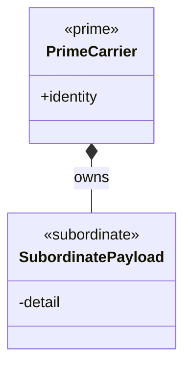
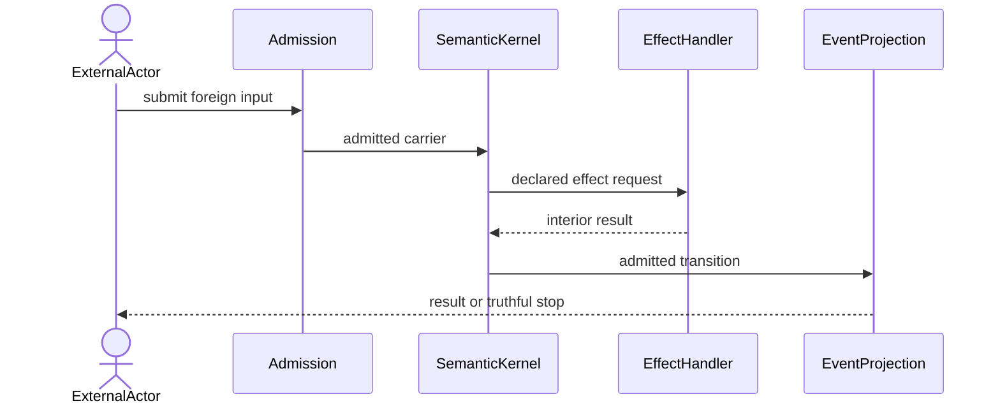
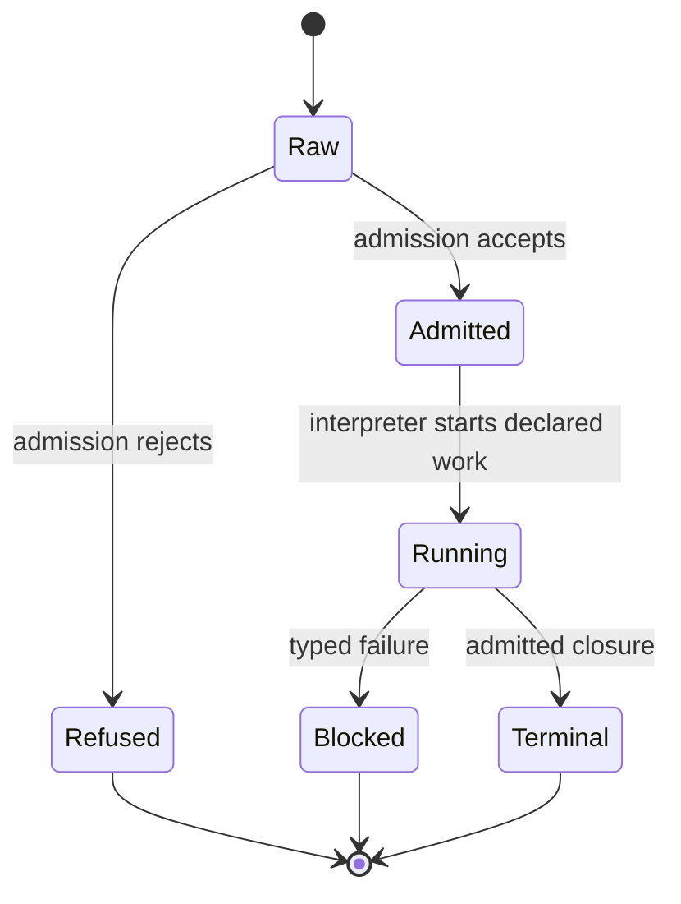

# Design Slice Pre-Code Gate Template

**Status**: Template
**Method authority**: `specification_methodology/specification/standards/DESIGN_MODULE_METHOD.md` section 5E
**Tenant authority**: [TYPESCRIPT_REALIZATION_GUARDRAILS.md](./TYPESCRIPT_REALIZATION_GUARDRAILS.md)

Use one copy per semantic boundary or durable delivery checkpoint. Do not use
one copy per source file. Delete all instructional placeholders before review.

## Boundary

- **Design verdict**: `candidate | accepted | rejected | blocked`
- **Owning module**:
- **Requirements**:
- **Ticket or intake**:
- **Code scope**:
- **Dependencies**:
- **Explicit exclusions**:
- **GTL/ABG executable design probe**: required when the constructive carrier is
  a GraphFunction
- **GTL admission, ABG semantic-compiler result, and typed gaps**:

Implementation is prohibited unless the verdict is `accepted` and the axiom
matrix contains no failed applicable axiom or relied-on realization gap.

## Domain Model

The domain model must show identity, ownership, cardinality, authority,
visibility, effect-edge payloads, downstream projections, and deferred
families. It models product concepts, not helper classes.

## Execution Sequence

Show the supported path and applicable malformed, refusal, retry, recursion,
fan-out/fan-in, nested-workflow, and F_H paths. Every participant must exist in
the domain model or be explicitly external. Every message must have a declared
semantic or effect owner.

## Lifecycle State Machine

Every state and transition must derive from admitted carrier, compiler, event,
projection, or explicit external-act truth. Controller-local memory is not a
lifecycle authority.

## Cross-View Invariants

| Check | Evidence | Verdict |
|---|---|---|
| Every sequence participant exists in the domain model or is external | | |
| Every lifecycle carrier exists in the domain model | | |
| Every message names a typed transform, graph/C constructor, interpreter act, or effect boundary | | |
| Every transition names an admission, compiler, interpreter, event, projection, or external owner | | |
| Raw F_P output cannot transition directly to accepted or closed | | |
| Plugins and handlers own interiors only | | |
| Batch, retry, recursion, and nested workflow use declared algebra | | |

For GTL/ABG boundaries also evaluate: lawful layer ownership, GraphFunction
decomposition, atom sufficiency, declared policies/profiles/prompts/budgets,
engine-rendered instructions, traversal-owned fan-out/fan-in, admission before
consumption, ABG/F_H closure ownership, declared recursion/foldback, and
explicit F_H lifecycle exits.

When the constructive carrier is a GraphFunction, attach the exact GTL Module
or graph-body fixture, its GTL admission result, and the current ABG
semantic-compiler result. An absent body, rejected body, or relied-on
`semantic_not_realized` result makes the design `blocked`; diagrams alone
cannot substitute for the executable probe. A downstream GLC product may be a
consumer fixture, but it does not own GTL admission or semantic compilation.

## Axiom Evaluation

| Axiom | Authority | Domain evidence | Sequence evidence | State evidence | Native enforcement | Admission/compiler enforcement | Verdict | Gap owner |
|---|---|---|---|---|---|---|---|---|
| | | | | | | | | |

Mandatory baselines include applicable PRODUCT axioms, ODD and Design Module
law, GTL laws and C algebra, ABG C-call and handler law, and slice-specific
requirements. Use only `pass`, `fail`, or reasoned `not_applicable` verdicts.

## Gap And Exclusion Register

| Gap or exclusion | Why outside or blocking | Owner | Re-entry condition |
|---|---|---|---|
| | | | |

## Design Verdict

State `accepted`, `rejected`, or `blocked` and why. An `accepted` verdict must
name the proving review. A `blocked` verdict must name the exact axiom or
realization gap and may not authorize an implementation workaround.
