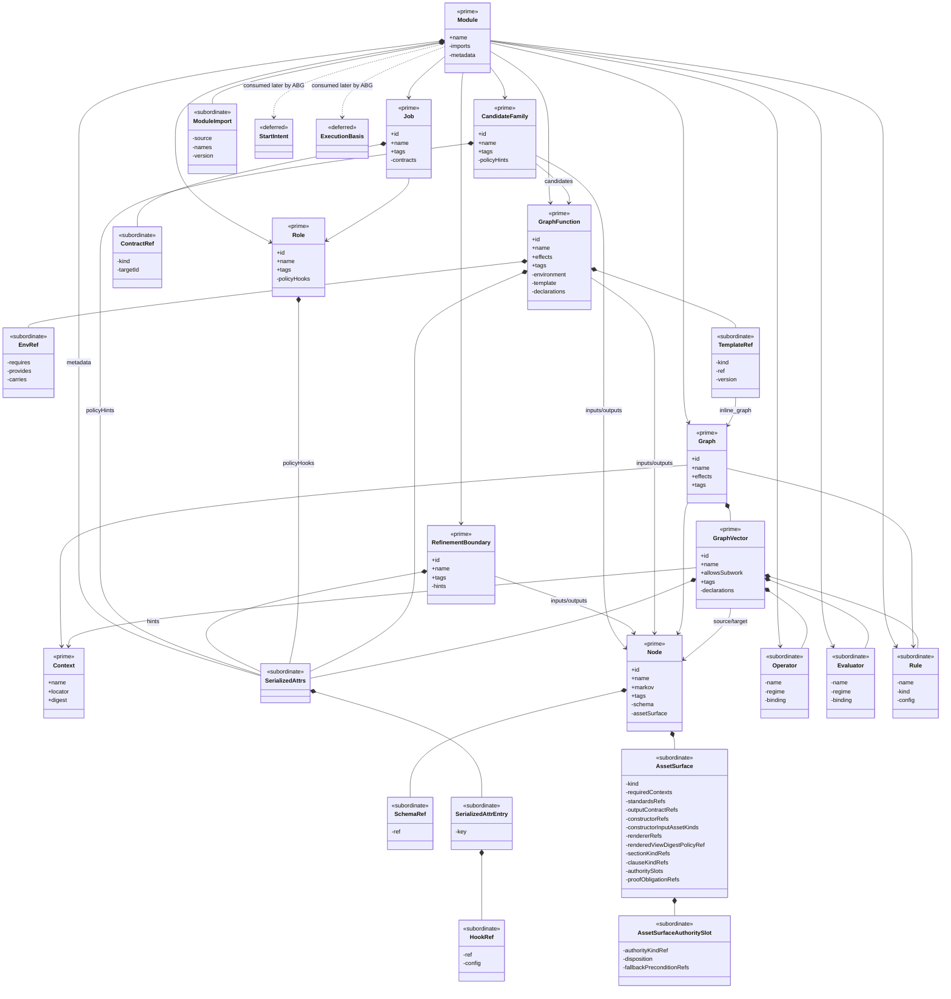

# GTL 3 Structural Carrier Diagram

**Status**: Active
**Date**: 2026-04-23
**Derived from**: [GTL_3_MODULE_DESIGN.md](./GTL_3_MODULE_DESIGN.md), [GTL_3_INTERFACE_CONTRACTS.md](./GTL_3_INTERFACE_CONTRACTS.md), [GTL_3_FIRST_SLICE_IACS.md](./GTL_3_FIRST_SLICE_IACS.md), [GTL_3_M02_WORK_PUBLICATION_IACS.md](./GTL_3_M02_WORK_PUBLICATION_IACS.md), [T-009](../../.ai-workspace/tickets/completed/T-009-build-the-typescript-tenant-first-slice-under-explicit-carrier-law.md), [T-010](../../.ai-workspace/tickets/completed/T-010-realize-typescript-gtl-m02-work-publication-under-explicit-publication-carrier-law.md)
**Purpose**: Module-bounded structural carrier sign-off asset for the completed
TypeScript `M01-gtl-core` and `M02-work-publication` waves.

## Scope

This diagram covers the active TypeScript GTL structural boundary:

- completed `M01-gtl-core`
- completed `M02-work-publication`

It does **not** claim to show:

- ABG runtime carriers
- package/bootstrap carriers
- qualification harness carriers
- deferred GTL families outside the completed `M01` and `M02` waves

## Mermaid UML View

## Reading Rules

- `<<prime>>` means top-level carrier admitted by the active GTL waves.
- `<<subordinate>>` means nested payload detail that does not acquire
  independent publication authority in the active GTL waves.
- `<<deferred>>` means out-of-scope family that is shown only to make the
  GTL-to-ABG boundary visible.
- `+` fields are public/exported carrier truth.
- `-` fields are module-bounded subordinate detail inside the active carrier
  family.

## Sign-Off Consequence

This asset is the visual check that:

- the active GTL TypeScript line has one prime carrier set rather than many
  peer payload wrappers
- `GraphFunction` remains the sole public named callable carrier
- `Operator`, `Evaluator`, and `Rule` remain subordinate to the GTL outer
  carriers in the completed TypeScript waves
- `Module` is the publication boundary rather than package metadata or npm
  export glue
