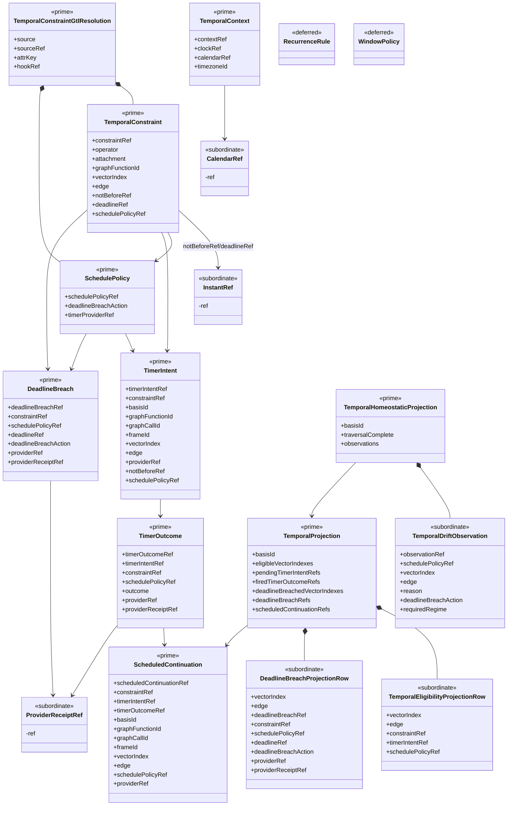

# GTL Time Algebra Structural Carrier Diagram

**Status**: Active
**Date**: 2026-05-07
**Tickets**: T-119, T-122

## Boundary Notes

`TemporalEligibilityProjectionRow`, `DeadlineBreachProjectionRow`, and
`TemporalDriftObservation` are downstream row shapes. They are public because
the projection exposes them, but they remain subordinate to
`TemporalProjection` and `TemporalHomeostaticProjection`.

`RecurrenceRule` and `WindowPolicy` are explicitly deferred from the active
slice. They do not become prime carriers until a later ticket proves the
promotion.
