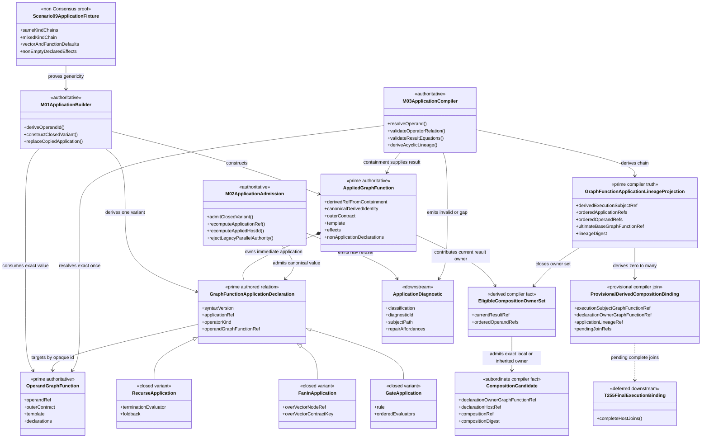
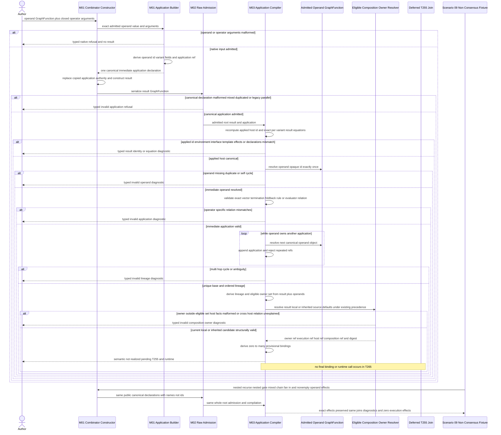
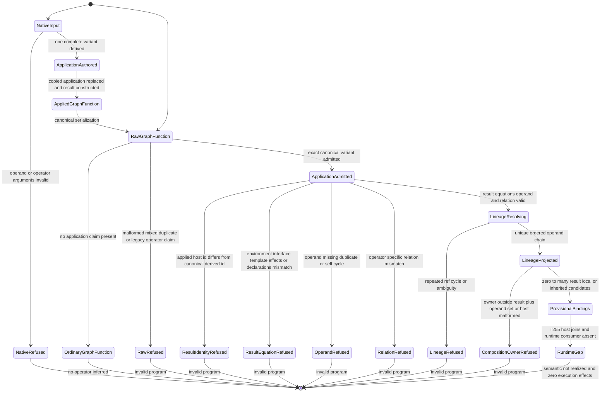

# M01/M02/M03 GraphFunction Combinator Application Behavior Design

**Design verdict**: `accepted_by_fh`
**Implementation status**: `admitted`
**Delivery phase**: DS-1 authoring prerequisite
**Ticket**: [T-265](../../../../.ai-workspace/tickets/active/T-265-close-canonical-graph-function-combinator-applications.md)
**Owning modules**: M01 GTL algebra authoring, M02 serialized module admission,
and M03 whole-program semantic compilation
**Requirement authority**: `REQ-L-GTL3-GRAPHFUNCTION-004/-006/-007/-009/-011/-012`,
`REQ-L-GTL3-HOF-002/-003/-005/-006`, `REQ-L-GTL3-RECURSE-001..008`,
`REQ-L-GTL3-IDENTITY-004/-007`, `REQ-L-GTL3-C-ALGEBRA-012..017`,
`REQ-L-GTL3-HOOKS-017/-018`, `REQ-R-ABG3-FN-COMP-001..014`, and
`REQ-L-GTL3-GRAPHVECTOR-017/-020`

## Boundary And Correction

This design closes one canonical application relation for three existing
GraphFunction combinators:

```text
recurse(graph_function, termination, foldback)
fan_in(reducer, over)
gate(target, rule, evaluators)
```

The rejected predecessor design treated the current constructors' common
template-reuse implementation as a new language category and added a separate
host-lineage declaration. That was a category error. `graph_function`,
`reducer`, and `target` are already the operands of the three constitutional
operators. Their exact identities and operator-specific arguments belong in
the operators' own first-class application declaration, following the accepted
T-253 `fan_out` precedent.

The correction is one discriminated declaration family provisionally keyed as
`gtl.graph_function_application`. Each derived GraphFunction contains exactly
one immediate application declaration. The declaration owns the immediate
operand opaque `.id` and the complete arguments for exactly one operator. It
does not contain the derived GraphFunction ref; containment supplies that
identity. It does not contain a lineage chain, composition ref, C-program ref,
plugin ref, runtime selection, or precedence field.

M03 derives lineage by following operand objects in the admitted root. A nested
constructor replaces copied application data on the new host, while the
immediate operand object retains its own declaration. Consequently
`recurse(recurse(f))`, `gate(gate(f))`, and mixed application chains retain every
layer's semantics without duplicate declaration keys or flattened config.

The live demand remains the 15 source-hosted composition mismatches found by
the T-252 probe. Consensus is not part of this atom's vocabulary or compiler
path. It is one later consumer.

## Canonical Relations

All variants share:

```text
syntax_version
application_ref
operator_kind
operand_graph_function_ref
```

The exact variant fields are:

| Variant | Operand meaning | Complete operator-specific fields |
|---|---|---|
| `recurse` | recursively applied GraphFunction | canonical `termination_evaluator` value and closed `foldback` value including mode, binding, parent-evaluation requirement, and admitted additional fields |
| `fan_in` | reducer GraphFunction | `over_vector_node_ref` and `over_vector_contract_key` derived from the exact supplied vector boundary |
| `gate` | target GraphFunction | canonical `rule` value and ordered canonical `evaluators` values |

`application_ref` is derived from every other canonical field. The operand ref
comes only from the supplied admitted GraphFunction value. Rule and evaluator
values remain canonical values because their present GTL carriers are not
opaque-id declarations. M01 and M02 compare their entire closed serialized
form; names do not become targeting authority.

The old standalone `recursion` and `gate` JSON entries are not retained as
parallel operator truth. The `fan_in` tag remains descriptive only and cannot
stand in for its reducer relation. A compatibility read may diagnose those old
shapes, but it may not admit them as 5.0 application authority or synthesize a
canonical declaration from them.

### Per-Variant Result Equations

Let `O` be the exact operand GraphFunction, `R` the applied result, `A` the
canonical immediate application, `over` the admitted fan-in vector Node, and
`L` an explicit result-local set of canonical non-application declarations.
The existing convenience constructors use `L = empty`; the lower-level typed
GraphFunction builder may supply `L`. Define:

```text
N(F) = F.declarations without gtl.graph_function_application or retired legacy operator authority
M(...) = existing canonical fail-closed declaration merge
D(R) = canonical GraphFunction identity over R name, environment, inputs,
       outputs, template, effects, declarations, and tags
```

Exact duplicate non-application entries deduplicate under `M`; conflicting
values for one key refuse. `L` is therefore not an unbounded escape: M03 derives
it only from canonical result keys absent from `N(O)`. Every operand
non-application key must remain present with the exact same canonical value;
missing or changed inherited bytes are an equation failure. The current operand
object retains its own immediate application even though `N(O)` excludes that
row from the new host.

The result equations are:

```text
recurse:
  R.environment  = O.environment
  R.inputs       = O.inputs
  R.outputs      = O.outputs
  R.template     = O.template
  R.effects      = O.effects
  N(R)           = M(N(O), L)

fan_in:
  R.environment.requires = [over]
  R.environment.provides = O.environment.provides
  R.environment.carries  = stableNodes([over], O.environment.provides)
  R.inputs       = [over]
  R.outputs      = O.outputs
  R.template     = O.template
  R.effects      = O.effects
  N(R)           = M(N(O), L)

gate:
  R.environment  = O.environment
  R.inputs       = O.inputs
  R.outputs      = O.outputs
  R.template     = O.template
  R.effects      = O.effects
  N(R)           = M(N(O), L)

all variants:
  R.declarations = M(N(R), [A])
  R.id           = D(R)
```

For inline fan-in templates, `O.template.graph.inputs` must already equal
`[over]`; template reuse cannot conceal an outer-input mismatch. The three
combinators add no effects of their own. A non-empty operand effect set remains
non-empty and byte-equal on `R`; that declaration fact is independent of the
observation that T-265 authoring and compilation execute no effects.

`L` permits a current-result-local composition. Its canonical acyclic form
derives GraphFunction ownership from declaration containment and must omit a
self-referential `host_graph_function_ref`; embedding `R.id` would create an
identity cycle because `D(R)` covers declarations. An inherited composition
remains byte-identical to the operand declaration and retains its explicit
operand host ref. M03 considers exactly:

```text
EligibleCompositionOwners(R) = { R.id } union ApplicationLineage(R).operandGraphFunctionRefs
```

## Architectural Axioms

1. **GA-01 - One application authority.** An applied GraphFunction contains
   exactly one canonical immediate application declaration. No host-lineage,
   legacy operator, name, tag, or runtime binding is a second operand authority.
2. **GA-02 - Operand identity is opaque.** The supplied GraphFunction value
   provides `operand_graph_function_ref` from `.id`. `.name`, tag, prefix, path,
   template equality, and object position have no targeting semantics.
3. **GA-03 - Operator semantics are complete.** The discriminant and all
   arguments needed to distinguish one application from another reside in the
   same closed declaration. The interpreter cannot reconstruct missing
   termination, foldback, vector boundary, rule, or evaluator truth.
4. **GA-04 - Containment supplies a canonically derived result.** The containing
   GraphFunction is the application result. Its id equals `D(R)` over the full
   canonical value; the declaration cannot carry or override that ref, and raw
   input cannot replace it with an explicit non-equal id.
5. **GA-05 - Same-kind nesting is lossless.** A new constructor removes copied
   application authority from the new host and writes its own immediate
   declaration. The operand object retains the previous layer in the submitted
   root.
6. **GA-06 - Raw and native judgments agree.** Native authoring and M02 raw
   admission produce the same canonical variant or the same typed refusal. M02
   never infers an operator from descriptive or structural resemblance.
7. **GA-07 - Lineage is compiler truth.** Ordered operand/application lineage is
   derived by M03. It is never authored, serialized as GTL input, or accepted
   from a caller.
8. **GA-08 - Composition owner and execution subject are independent roles.** A
   current-result-local composition has owner equal to execution subject. An
   inherited source-local composition retains an operand owner distinct from the
   outer execution subject. Neither case is rewritten into the other.
9. **GA-09 - Composition admission remains provisional.** T-265 may validate
   the application chain and derive candidate joins. It does not satisfy or
   bypass any remaining `REQ-R-ABG3-FN-COMP-003` field or the T-254
   `owning_declaration_ref` join owned by T-255.
10. **GA-10 - Precedence is unchanged.** Application lineage is not a
    composition selector or a new default level. Existing vector-local and
    GraphFunction-local source precedence remains authoritative.
11. **GA-11 - Ordinary functions remain ordinary.** A raw GraphFunction with no
    canonical application declaration is not an applied combinator merely
    because its name, tags, template, or interface resemble one.
12. **GA-12 - Cross-host declarations fail without a relation.** A selected
    composition naming another GraphFunction host without a valid application
    path is invalid. M03 reports the missing relation without inventing an
    operator kind.
13. **GA-13 - Generic proof is structural.** T-252 supplies demand. Scenario 09
    supplies non-Consensus same-kind and mixed-kind applications, both
    vector-local and GraphFunction-local composition, and names different from
    opaque ids through the same M01/M02/M03 path.
14. **GA-14 - No execution effects.** Authoring, raw admission, application
    compilation, and the proof fixtures invoke no worker, plugin, event, archive,
    traversal, replay, or workspace mutation. This observation never requires
    an empty declared `GraphFunction.effects` surface.
15. **GA-15 - Result equations are exact.** M03 recomputes every per-variant
    environment, input, output, template, effect, and non-application-declaration
    equation. A merely plausible outer interface is not admission.
16. **GA-16 - Eligible composition owners are closed.** A selected composition
    owner is exactly the current result or one operand-chain member. Missing,
    duplicate, outside-set, nearest, first, and ultimate-by-convention resolution
    all fail closed.

## IACS

| Carrier | Kind | Owner | Identity and role |
|---|---|---|---|
| `OperandGraphFunction` | prime authoritative | admitted GTL | exact immediate operand value, opaque `.id`, interface, template, declarations, and effects |
| `GraphFunctionApplicationDeclaration` | prime authored relation | M01 authored GTL | closed discriminated union containing one operand id and all semantics for one `recurse`, `fan_in`, or `gate` application |
| `AppliedGraphFunction` | prime authoritative | M01 authored GTL | containing result whose id equals `D(R)` and whose complete surfaces satisfy one exact variant equation; owns exactly one immediate application declaration |
| `RawGraphFunctionApplication` | subordinate raw data | M02 input | serialized candidate whose closed variant must be admitted before compiler use |
| `AdmittedGraphFunctionApplication` | prime admitted relation | M02 | canonical application value and applied-host derived-id equality equivalent to native authoring |
| `GraphFunctionApplicationLineageProjection` | prime compiler truth | M03 | ordered acyclic chain of result, application, operator, and operand refs ending at one ultimate base function |
| `EligibleCompositionOwnerSet` | derived compiler fact | M03 | closed set containing the current result id and every ordered operand id exactly once |
| `CompositionCandidate` | subordinate compiler fact | M03 | decoded current-result-local or inherited vector/GraphFunction-local composition plus exact containment and owner evidence |
| `ProvisionalDerivedCompositionBinding` | provisional compiler join | M03 | declaration owner and execution subject, which may equal or differ, plus application lineage and selected composition; not runtime-admitted |
| `GraphFunctionApplicationDiagnostic` | downstream projection | M02 or M03 | stable invalid-program or semantic-not-realized result with path, authority, evidence, and repair affordance |
| `FinalCompiledExecutionBinding` | downstream deferred | T-255 | completes every FN-COMP-003 and owning-declaration join before runtime use |

No carrier above is a controller. `GraphFunctionApplicationLineageProjection`
and `ProvisionalDerivedCompositionBinding` are derived output; neither can be
authored back into GTL.

## Domain Model



### Domain Invariants

1. `AppliedGraphFunction` owns one immediate application only. Earlier layers
   remain attached to their own operand objects.
2. `operandGraphFunctionRef` and the containing derived ref are different roles
   even when an invalid input tries to make their strings equal.
3. A Recurse, FanIn, or Gate variant cannot carry fields belonging to another
   variant. Unknown and mixed fields fail closed.
4. Rule, evaluator, termination, and foldback values are canonical data. Tags
   and names may describe them but cannot replace them.
5. One derived application compiles to one lineage projection and zero to many
   separate provisional composition bindings. The rows are never aggregated.
6. The applied GraphFunction id equals the canonical identity recomputed over
   every result field. Application containment does not waive identity law.
7. A provisional composition binding records declaration owner and execution
   subject separately. They are equal for current-result-local composition and
   distinct for inherited composition.
8. A final runtime binding does not exist in this design.

## Native Authoring

The public native shape is a discriminated constructor-owned relation, or a
provably equivalent invariant API:

```ts
type GraphFunctionApplicationDeclaration =
  | {
      readonly operatorKind: "recurse";
      readonly operandGraphFunctionRef: string;
      readonly terminationEvaluator: CanonicalEvaluatorDeclaration;
      readonly foldback: CanonicalFoldbackDeclaration;
    }
  | {
      readonly operatorKind: "fan_in";
      readonly operandGraphFunctionRef: string;
      readonly overVectorNodeRef: string;
      readonly overVectorContractKey: string;
    }
  | {
      readonly operatorKind: "gate";
      readonly operandGraphFunctionRef: string;
      readonly rule: CanonicalRuleDeclaration;
      readonly evaluators: readonly CanonicalEvaluatorDeclaration[];
    };
```

The actual carrier also contains fixed `syntaxVersion` and derived
`applicationRef`. Callers cannot supply either operand or result identity as an
override. The lower-level typed builder may additionally receive `L`, the closed
result-local non-application declarations used by the equations above; the three
existing convenience constructors use the empty set. Their builders:

1. re-admit the supplied GraphFunction and operator arguments;
2. derive the operand `.id` and exact operator variant;
3. remove any copied `gtl.graph_function_application` entry from the new host;
4. refuse legacy parallel operator authority rather than carrying it beside the
   new declaration;
5. construct the exact per-variant result and exactly one canonical application
   entry;
6. derive the result id from the complete canonical result, refusing an explicit
   id override; and
7. preserve the exact environment, interface, template, effect, and
   non-application-declaration equations without inventing runtime topology.

`gate` does not write `target.name`. `fan_in` does not rely on
`over:${over.name}`. Names and tags may remain descriptive output, but M02/M03
ignore them for relation admission.

Same-kind nesting is ordinary:

```text
recurse-2 --application operand--> recurse-1
recurse-1 --application operand--> base
```

`recurse-2` contains only its own termination/foldback values. `recurse-1`
retains its own different values. No declaration merge overwrites or collides.

## M02 Raw Admission

M02 registers exactly one declaration key and one closed tagged-object syntax.
It validates common field order and the exact fields for the selected variant,
recomputes `application_ref`, rejects duplicate keys and unknown fields, and
admits canonical rule/evaluator/foldback values through their existing raw
admitters. After canonical declaration admission, M02 recomputes `D(R)` through
the ordinary GraphFunction identity law and requires exact equality with the raw
applied host `.id`; M03 independently corroborates the same equality before any
operand or composition resolution.

M02 classifications include at minimum:

| Diagnostic | Meaning |
|---|---|
| `gtl-application-missing-field` | a required common or variant field is absent |
| `gtl-application-unknown-field` | an unregistered field or mixed-variant field is present |
| `gtl-application-duplicate-authority` | application key, field, or legacy parallel operator authority is duplicated |
| `gtl-application-invalid-operator` | `operator_kind` is not one of the three admitted variants |
| `gtl-application-identity-mismatch` | operand ref is empty or not a canonical opaque-ref value; whole-root resolution remains M03 truth |
| `gtl-application-result-identity-mismatch` | applied host id differs from `D(R)` recomputed from its complete canonical value |
| `gtl-application-contract-mismatch` | application ref, vector contract, rule, evaluator, or foldback value is noncanonical |

A GraphFunction with no application declaration remains an ordinary
GraphFunction. M02 does not infer an operator from `recurse(`, `fan_in(`,
`gate(`, an `operator:*` tag, template equality, or an `abg.fn_composition`
host mismatch. A present legacy `recursion` or `gate` operator claim is not
silently upgraded; it produces a typed repair directing the author to the
canonical constructor.

## M03 Compiler Relation

For each admitted application, M03 performs:

```text
current result GraphFunction from declaration containment
  -> recompute D(result) and require exact applied-host id equality
  -> resolve operand_graph_function_ref exactly once in admitted root
  -> recompute exact per-variant environment, inputs, outputs, template,
     effects, and non-application-declaration equations
  -> validate exact vector contract, termination/foldback, or rule/evaluators
  -> record current application ref and operand ref
  -> follow the operand only when it has its own admitted application
  -> reject a missing ref, duplicate ref, self-cycle, multi-hop cycle, or ambiguity
  -> derive one ordered GraphFunctionApplicationLineageProjection
  -> derive EligibleCompositionOwners = result plus ordered operand chain
  -> resolve effective composition under existing precedence
  -> require its owner to equal exactly one eligible result or operand member
  -> validate available declaration-owner host facts against that exact surface
  -> derive zero to many ProvisionalDerivedCompositionBinding rows
  -> return semantic_not_realized pending T-255 complete joins and runtime use
```

The compiler never identifies an operator from names or template sharing. It
does separately reject a selected composition whose host names another
GraphFunction when no admitted application path explains the relationship.
That diagnostic says the cross-host relation is absent; it does not guess
whether the author intended recurse, fan-in, or gate.

### Composition Ownership And Execution Identities

For each selected composition, M03 keeps these roles explicit:

| Identity | Meaning |
|---|---|
| `declarationOwnerGraphFunctionRef` | current result or operand GraphFunction whose admitted surface owns the selected composition contract |
| `declarationHostRef` | exact GraphFunction or GraphVector declaration surface selected under existing precedence |
| `executionSubjectGraphFunctionRef` | outer applied GraphFunction whose execution would consume the relation after T-255 |
| `applicationLineageRef` | derived proof joining execution subject to declaration owner through canonical applications |

M03 may decode the composition and validate any host field whose exact
owner surface is already available. The output remains
`provisional_pending_t255`. It is not named `admitted`, cannot enter plugin
selection, and cannot be consumed by runtime. T-255 must join every remaining
host field, including `owning_declaration_ref` against the compiled T-254
vector/program binding, before producing a final execution binding.

The application chain is not a new precedence order. The closed eligible owner
set is the current result plus every operand in the ordered lineage. A
current-result-local GraphFunction declaration derives owner identity from its
containment/source-ref and must omit `host_graph_function_ref` to avoid a
content-identity cycle. A declaration with an explicit GraphFunction host is
inherited and must retain bytes proving the exact operand owner; that host ref
must equal exactly one operand. A missing, repeated, or outside-set match is
invalid; M03 never picks the nearest, first, or ultimate function by convention.

Composition precedence remains:

```text
vector local > graph function local > job > role > module > visible default
```

Application lineage explains ownership; it neither selects composition nor
adds a precedence level.

## Execution Sequence



### Sequence Invariants

1. The first identity-bearing message carries the operand GraphFunction value;
   no later message supplies a replacement operand or derived ref.
2. M01 authors one complete variant before serialization. M02 never fills a
   missing operator field.
3. Each nested layer is resolved through its operand object. No sequence copies
   a prior layer's config onto the current host.
4. Applied-host identity and every per-variant result equation validate before
   operand traversal or composition resolution.
5. Composition resolution begins only after the entire application chain is
   acyclic and each operator-specific relation is valid. Its eligible owner set
   includes the current result and every operand.
6. The sequence ends at a provisional compiler join and typed gap. No message
   enters T-255, plugin selection, traversal, replay, or closure.

## Lifecycle State Machine



Current evidence stops before `ApplicationAuthored`: this file is a design
candidate awaiting F_H acceptance. The state machine describes target behavior,
not implementation status.

### State Invariants

1. `OrdinaryGraphFunction` has no combinator semantics and cannot enter lineage
   resolution.
2. Every refusal state is terminal before a provisional binding or execution
   effect; declared effect refs remain static data.
3. `LineageProjected` contains derived compiler truth only; it cannot return to
   an authored or raw state.
4. `ProvisionalBindings` cannot transition directly to runtime. T-255 remains a
   required external successor.
5. A zero-composition application still reaches `RuntimeGap` with one lineage
   projection and zero bindings; its operator provenance remains complete.
6. `ResultIdentityRefused` and `ResultEquationRefused` cannot reach operand
   resolution. Native and raw applied hosts use the same result equation.
7. `ProvisionalBindings` may contain an owner equal to the execution subject or
   an operand owner distinct from it, but never an owner outside the eligible set.

## Cross-View Axiom Matrix

| Axiom | Domain evidence | Sequence evidence | State evidence | Native target | M02/M03 target | Verdict |
|---|---|---|---|---|---|---|
| One application authority | one contained discriminated declaration | builder replaces copied application before raw admission | duplicate authority reaches RawRefused | one constructor-owned entry | duplicate and legacy-parallel checks | `candidate` |
| Operand uses opaque id | declaration points to OperandGraphFunction | operand value precedes derived relation | missing or duplicate id reaches OperandRefused | derive `.id`; no override | exact root lookup | `candidate` |
| Operator semantics are complete | closed variant owns every argument | no M02 fill or interpreter reconstruction | partial relation reaches RawRefused or RelationRefused | exhaustive discriminated builders | closed variant admission and comparison | `candidate` |
| Same-kind nesting is lossless | each source object retains its own application | compiler follows one operand object at a time | repeated refs refuse; valid chain projects | replace only new host application | ordered acyclic source-object traversal | `candidate` |
| Native and raw are equivalent | one canonical serialized relation and applied host identity | native serialization enters same M02 path | both converge on ApplicationAdmitted or ResultIdentityRefused | canonical builder and `D(R)` | recompute refs, host id, and admit same variant | `candidate` |
| Per-variant result equations are exact | result exposes environment interface template effects and non-application declarations | compiler checks complete result before operand traversal | mismatch reaches ResultEquationRefused | closed equations for recurse fan-in gate | exact canonical equality | `candidate` |
| Names and tags have no authority | no label field targets operand | no name lookup message | OrdinaryGraphFunction remains ordinary | descriptive output only | no prefix or tag inference | `candidate` |
| Lineage is derived | projection is M03-owned | projection follows admitted applications | LineageProjected has no authored predecessor | no lineage constructor | compiler-only projection | `candidate` |
| Owner and execution subject may equal or differ | eligible owner set contains result plus operands | resolver returns current-local or inherited owner to outer compiler | outside-set owner reaches CompositionOwnerRefused | no runtime binding | exact containment or operand-chain membership; provisional join only | `candidate` |
| Composition precedence is unchanged | application has no selector fields | existing source resolver is called after lineage | no application selection state | closed fields exclude precedence | existing precedence path | `candidate` |
| FN-COMP admission is not overclaimed | final binding belongs to T255 | sequence stops before Handoff | RuntimeGap is terminal | no final binding API | provisional status and pending joins | `candidate` |
| Genericity is non-Consensus | Scenario09ApplicationFixture is a domain entity | same public path for fixtures | same states and diagnostics | same constructors | same admission/compiler code | `candidate` |
| Declared effects differ from execution | applied result preserves exact possibly non-empty operand effects | no runtime participant receives a call | RuntimeGap terminates with zero execution effects | effect equation adds none | exact effect equality plus no event/archive/workspace output | `candidate` |

No row becomes `pass` before F_H acceptance and implementation evidence.

## Required Proof Corpus

Realization must pin at least:

1. native and raw positives for all three variants with names deliberately
   different from opaque ids and exact environment/input/output/template/effect/
   non-application-declaration equations;
2. `gate` serializes the target `.id`, never the target `.name`;
3. `fan_in` serializes the reducer `.id`, exact vector node ref, and exact vector
   contract key;
4. `recurse(recurse(labRefinement))` with different termination/foldback values
   retains both layers through two source objects;
5. `gate(gate(labRefinement))` with different rules/evaluator sets retains both
   layers;
6. mixed `gate(recurse(labRefinement))` produces one ordered mixed lineage;
7. a non-empty operand effect set remains exact on every applied result while
   authoring/admission/compiler observation records zero executed effects;
8. a composition-free raw GraphFunction with no application remains ordinary,
   while a malformed canonical or legacy operator claim fails closed;
9. a raw applied host whose explicit id differs from `D(R)` fails before operand
   resolution, while native and serialized canonical ids are equal;
10. absent, duplicate, empty, label-substituted, or unknown operand refs and direct or
   multi-hop cycles fail before projection;
11. missing common fields, mixed variant fields, reordered/duplicate fields,
   stale `application_ref`, altered foldback, vector contract, rule, or evaluator
   data fail M02 or M03 with stable diagnostics;
12. a current-result-local GraphFunction composition omits a cyclic self-host
    field, derives owner from result containment, and produces
    `owner == executionSubject`;
13. inherited vector-local and GraphFunction-local compositions retain exact
    operand owner identity and produce `owner != executionSubject`;
14. an owner outside `{result} union operands`, an ambiguous owner, and a copied
    source composition rewritten to the derived host all fail;
15. cross-host composition without an admitted application path fails without
    operator inference;
16. an `owning_declaration_ref` mismatch remains provisional/non-realized and
    cannot become a final execution binding before T-255;
17. the T-252 recurse and fan-in demands use the public atom with no special
    branch; and
18. Scenario 09 fixtures contain zero Consensus identity, schema, route, policy,
    diagnostic, or helper vocabulary.

## Non-Scope

- a second host-lineage declaration or authored full lineage chain;
- final composition admission, execution handoff, plugin selection, runtime,
  events, replay, closure, or assurance;
- fan-in reduction, gate evaluation, recurse foldback execution, recursion
  runtime, `workflow.C`, typed batch runtime, or `C.retry`;
- changing composition precedence or C-program selection;
- topology-changing graph substitution/zoom or symbolic `promote`;
- Consensus-specific code or a Consensus-specific declaration family; and
- public CLI, SDK, catalog, scheduler, ticket mutation, or workspace behavior.

## Design Verdict

`accepted_by_fh` on 2026-07-13. The design replaces the rejected second-authority
host-lineage carrier with one complete operator-owned application relation.
M03 derives acyclic lineage and provisional owner/execution joins from that
relation. F_H accepted the domain, sequence, state, axioms, and proof corpus;
realization is authorized within this boundary.
