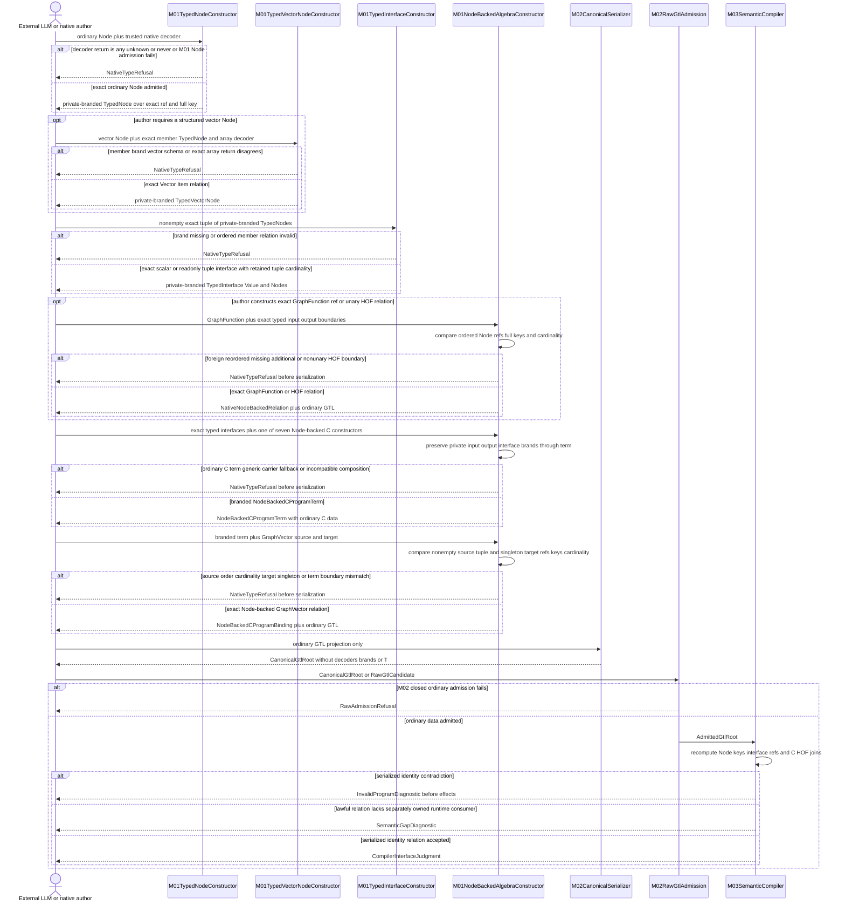
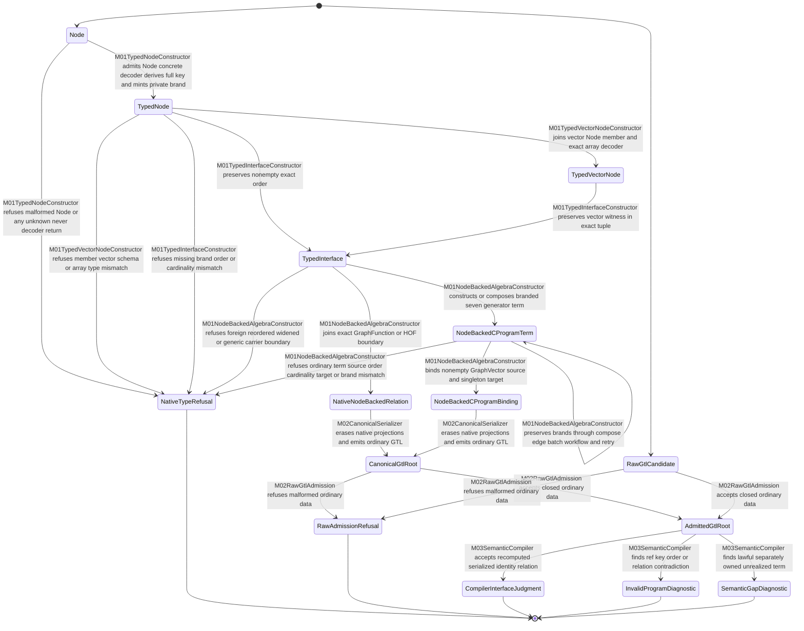

# M01/M02/M03 Native Node And Interface Type Witness Behavior Design

**Status**: Accepted by F_H on 2026-07-13
**Ticket**: T-266
**Change class**: `design_reframe`
**Modules**: M01 GTL core, M02 work publication, M03 engine conformance
**Implementation admission**: admitted

## Boundary

The TypeScript line currently lets a caller attach any type parameter to an
ordinary `Node` through `cInterfaceCarrier<T>(nodes)` and
`hofContract<T>(node)`. The runtime ref checks prove Node identity but cannot
prove that caller-selected `T` denotes the Node contract. T252 amplified the
defect through body helpers such as `leafProgram<Input,Output>`.

This design closes one generic native-authoring relation:

```text
trusted native decoder d : unknown -> T
ordinary admitted Node n -> exact full nodeContractKey(n)
TypedNode<T> := constructor-owned native projection of (d, n, key(n))
TypedInterface<Value, ExactNodes> := ordered TypedNode projection
NodeBackedCProgramTerm<A,B,InputNodes,OutputNodes> := branded C relation
-----------------------------------------------------------------------
Node-backed C/HOF constructors infer their types from those projections
```

The trusted decoder is the one explicit host-language assertion point. Its
return type is inferred. It is not a published schema contract, decoder
certification, raw-data admission result, or runtime payload validator. This
design does not claim that TypeScript derives a structural type from
`SchemaRef`, that a local decoder proves a public schema digest, or that raw M03
compilation reconstructs TypeScript `T`.

The constitutional `Node`, `GraphVector`, `GraphFunction`, and `Module` carriers
do not change ontology. `Node.typeRef` stays optional. Native witnesses are
non-serialized enforcement projections over existing pure GTL data. M02 and M03
recompute the same ordinary Node contract keys and ordered interface refs from
canonical data; that identity parity is the only raw/native parity claimed.

### Authority

- `REQ-L-GTL3-NODE-001/-002/-013..015`
- `REQ-L-GTL3-INTERFACE-001..004`
- `REQ-L-GTL3-HOF-001/-005/-006`
- `REQ-L-GTL3-C-ALGEBRA-004/-006/-012..017`
- `REQ-L-GTL3-CONTRACT-LAW-API-009..013`
- PRODUCT atom criterion and trusted single-developer desktop boundary
- ODD Method and Design Module Method section 5E

### Explicit exclusions

- no Consensus domain entity or body;
- no JSON Schema publication, decoder certification, or catalog expansion;
- no runtime, worker, plugin, handler, effect, event, archive, or replay work;
- no mandatory `typeRef` and no globally generic Node or GraphFunction; and
- no hostile in-process forgery or cryptographic defense.

## Irreducible Carrier Set

| Carrier | Stereotype | Visibility | Owner | Meaning |
|---|---|---|---|---|
| `Node` | prime | public canonical GTL | M01 | ordinary typed locus; remains non-generic and serializable |
| `TrustedNativeDecoder<T>` | subordinate | author-supplied native code | native authoring boundary | one explicit trusted assertion whose return type introduces `T`; never GTL truth |
| `TypedNode<T>` | subordinate | public opaque return, private brand | M01 | exact ordinary Node ref/full contract key plus inferred native `T` projection |
| `TypedVectorNode<T>` | subordinate | public opaque return, private brand | M01 | `TypedNode<readonly T[]>` plus exact member witness and structured vector relation |
| `TypedInterface<V,Nodes>` | subordinate | public opaque return, private brand | M01 | exact non-empty ordered TypedNode tuple/cardinality plus existing interface ref; `V` is inferred |
| `CInterfaceCarrier<V,Nodes>` | subordinate | public opaque return, private brand | M01 | nominal Node-interface C carrier derived only from the exact `TypedInterface<V,Nodes>` |
| `HofContract<V>` / `HofVector<V>` | subordinate | public opaque return, private brand | M01 | scalar/vector HOF boundaries derived only from TypedNode witnesses |
| `NodeBackedCProgramTerm<A,B,In,Out>` | subordinate | public opaque return, private brand | M01 | ordinary C term plus exact nonserialized branded input/output Node interfaces; all seven C constructors preserve it |
| `NodeBackedCProgramBinding<A,B,SourceNodes,TargetNode>` | subordinate | public opaque return, private brand | M01 | exact GraphVector source tuple/singleton target join to one `NodeBackedCProgramTerm`, never an ordinary term |
| canonical Node/GraphVector/GraphFunction/Module | prime | public serialized GTL | M01/M02 | sole authored and serialized language truth |
| admitted GTL root | downstream | module-local | M02/M03 | closed ordinary GTL after raw admission |
| compiler interface judgment | downstream | public result | M03 | recomputed ordinary refs/keys and typed diagnostic; never native `T` truth |

The native witness family is one enforcement projection, not a new GTL type
ontology. `TypedNode<T>` is the Node-backed type root. There is no
`TypedSchemaContract<T>` in this design because no pre-DS-4 authority can prove
that a caller-supplied contract ref/digest and local decoder are one published
schema contract.

## Trusted Native Projection

`TypedNode<T>` is created from:

1. one ordinary Node re-admitted through the existing M01 Node admission path;
2. one trusted decoder whose return type is inferred as `T`;
3. the exact opaque Node ref;
4. the full existing `nodeContractKey(node)` covering name, schema, optional
   typeRef, markov, and asset-surface truth; and
5. a local deterministic digest of that full key for internal comparison.

The decoder return type must be concrete. Type utilities reject `any`, `unknown`,
and `never` before `TypedNode` construction; those types would otherwise erase
the distinction this design exists to preserve.

The decoder and invariant type witness are non-enumerable. Every exported native
witness contains a module-private, non-exported unique-symbol brand. Public
constructors check that own brand again after type erasure. A structurally
similar object literal cannot satisfy the public type and cannot pass erased
constructor admission.

This is the current trusted-desktop boundary. The constructor does not invoke
the decoder against worker output and does not prove the decoder implements the
Node's symbolic schema. A Node with a bad or unknown `typeRef` still fails under
the existing NODE-015 conformance law. A Node without `typeRef` remains lawful
ordinary GTL and carries exactly its inline contract.

## Ordered Interface Type Law

For a non-empty tuple `N` of `TypedNode` witnesses:

```text
ValueOf<TypedNode<A>> = A

InterfaceValue<[TypedNode<A>]> = A

InterfaceValue<[
  TypedNode<A>,
  TypedNode<B>,
  ...,
  TypedNode<Z>
]> = readonly [A, B, ..., Z]
```

The multi-source product is the exact readonly tuple in GraphVector source
order. No arbitrary record interface is stamped over an ordered Node list. A
domain transform that wants a named record must declare a lawful graph/C
transform from the tuple product to that record.

`TypedInterface<Value,Nodes>` retains `Nodes` as its exact non-empty readonly
TypedNode tuple. Its public `nodes`, ordered refs, and ordered keys preserve the
same tuple cardinality and order; they do not widen to an uncorrelated
`readonly Node[]` inside native authoring APIs. The interface ref remains the
existing deterministic ref over those ordered full Node contract keys.

GraphFunction input and output interfaces may each be any non-empty exact tuple.
A GraphVector source may be a singleton or non-empty tuple. A GraphVector target
is one Node by constitutional law, so its native target boundary is exactly
`TypedInterface<T, readonly [TypedNode<T>]>`. No TypeScript type name, decoder,
private brand, or generic enters the serialized ref.

## Native API And Exact Joins

Illustrative signatures, not implementation authorization:

```ts
declare const TYPED_NODE_AUTHORITY: unique symbol;       // module-private
declare const TYPED_INTERFACE_AUTHORITY: unique symbol;  // module-private
declare const C_INTERFACE_AUTHORITY: unique symbol;      // module-private
declare const NODE_BACKED_C_AUTHORITY: unique symbol;    // module-private
declare const NODE_BACKED_C_REF_AUTHORITY: unique symbol;// module-private

type TrustedNativeDecoder<Value> = (raw: unknown) => Value;

type IsAny<Value> = 0 extends (1 & Value) ? true : false;
type IsNever<Value> = [Value] extends [never] ? true : false;
type IsUnknown<Value> = IsAny<Value> extends true
  ? false
  : unknown extends Value
    ? [keyof Value] extends [never] ? true : false
    : false;
type ConcreteDecoded<Value> = IsAny<Value> extends true
  ? never
  : IsNever<Value> extends true
    ? never
    : IsUnknown<Value> extends true
      ? never
      : Value;

type ExactType<Left, Right> = [Left] extends [Right]
  ? [Right] extends [Left] ? unknown : never
  : never;

interface TypedNodeBase {
  readonly kind: "typed_node" | "typed_vector_node";
  readonly node: Node;
  readonly nodeRef: string;
  readonly nodeContractKey: string;
  readonly nodeContractDigest: `sha256:${string}`;
  readonly [TYPED_NODE_AUTHORITY]: object;
}

interface TypedNode<Value> extends TypedNodeBase {
  readonly [TYPED_NODE_AUTHORITY]: {
    readonly invariant: (value: Value) => Value;
  };
}

interface TypedVectorNode<Item> extends TypedNode<readonly Item[]> {
  readonly kind: "typed_vector_node";
  readonly member: TypedNode<Item>;
}

type NonEmptyTypedNodeTuple = readonly [
  TypedNodeBase,
  ...TypedNodeBase[]
];
type ValueOf<Witness extends TypedNodeBase> =
  Witness extends TypedNode<infer Value> ? Value : never;
type InterfaceValue<Nodes extends NonEmptyTypedNodeTuple> =
  Nodes extends readonly [infer Only extends TypedNodeBase]
    ? ValueOf<Only>
    : { readonly [Index in keyof Nodes]: ValueOf<Nodes[Index]> };
type NodeValues<Nodes extends NonEmptyTypedNodeTuple> = {
  readonly [Index in keyof Nodes]: Nodes[Index]["node"];
};
type TupleNodeRefs<Nodes extends NonEmptyTypedNodeTuple> = {
  readonly [Index in keyof Nodes]: Nodes[Index]["nodeRef"];
};
type TupleNodeContractKeys<Nodes extends NonEmptyTypedNodeTuple> = {
  readonly [Index in keyof Nodes]: Nodes[Index]["nodeContractKey"];
};

interface TypedInterface<
  Value,
  Nodes extends NonEmptyTypedNodeTuple
> {
  readonly kind: "typed_interface";
  readonly nodes: NodeValues<Nodes>;
  readonly orderedNodeRefs: TupleNodeRefs<Nodes>;
  readonly orderedNodeContractKeys: TupleNodeContractKeys<Nodes>;
  readonly cardinality: Nodes["length"];
  readonly interfaceRef: string;
  readonly [TYPED_INTERFACE_AUTHORITY]: {
    readonly value: (value: Value) => Value;
    readonly typedNodes: (nodes: Nodes) => Nodes;
  };
}

interface CInterfaceCarrier<
  Value,
  Nodes extends NonEmptyTypedNodeTuple
> extends CCarrier<Value> {
  readonly kind: "c_carrier";
  readonly interface: TypedInterface<Value, Nodes>;
  readonly [C_INTERFACE_AUTHORITY]: true;
}

type NodeBackedCProgramTerm<
  Input,
  Output,
  InputNodes extends NonEmptyTypedNodeTuple,
  OutputNodes extends NonEmptyTypedNodeTuple,
  Roles extends string = string,
  Cardinality extends CAlgebraResultCardinality = CAlgebraResultCardinality
> = CProgramTerm<Input, Output, Roles, Cardinality> & {
  readonly [NODE_BACKED_C_AUTHORITY]: {
    readonly input: CInterfaceCarrier<Input, InputNodes>;
    readonly output: CInterfaceCarrier<Output, OutputNodes>;
  };
};

type NodeBackedCGraphFunctionRef<
  Input,
  Output,
  InputNodes extends NonEmptyTypedNodeTuple,
  OutputNodes extends NonEmptyTypedNodeTuple
> = CGraphFunctionRef<Input, Output> & {
  readonly [NODE_BACKED_C_REF_AUTHORITY]: {
    readonly input: CInterfaceCarrier<Input, InputNodes>;
    readonly output: CInterfaceCarrier<Output, OutputNodes>;
  };
};

declare function typedNode<
  const Decode extends TrustedNativeDecoder<unknown>
>(input: {
  readonly node: Node;
  readonly decode: Decode;
} & (ConcreteDecoded<ReturnType<Decode>> extends never
  ? never
  : unknown)): TypedNode<ConcreteDecoded<ReturnType<Decode>>>;

declare function typedVectorNode<
  Item,
  const Decode extends TrustedNativeDecoder<readonly NoInfer<Item>[]>
>(input: {
  readonly node: Node;
  readonly member: TypedNode<Item>;
  readonly decode: Decode;
} & (ExactType<
    ReturnType<Decode>,
    readonly Item[]
  > extends never
    ? never
    : ConcreteDecoded<ReturnType<Decode>> extends never
      ? never
      : unknown)): TypedVectorNode<Item>;

declare function typedInterface<
  const Nodes extends NonEmptyTypedNodeTuple
>(...nodes: Nodes): TypedInterface<InterfaceValue<Nodes>, Nodes>;

declare function cInterfaceCarrier<
  Value,
  const Nodes extends NonEmptyTypedNodeTuple
>(boundary: TypedInterface<Value, Nodes>): CInterfaceCarrier<Value, Nodes>;

declare function cGraphFunctionRef<
  Input,
  Output,
  const InputNodes extends NonEmptyTypedNodeTuple,
  const OutputNodes extends NonEmptyTypedNodeTuple
>(input: {
  readonly graphFunction: GraphFunction;
  readonly input: TypedInterface<Input, InputNodes>;
  readonly output: TypedInterface<Output, OutputNodes>;
}): NodeBackedCGraphFunctionRef<Input, Output, InputNodes, OutputNodes>;

declare function bindGraphVectorCProgram<
  Input,
  Output,
  const SourceNodes extends NonEmptyTypedNodeTuple,
  TargetNode extends TypedNode<Output>
>(input: {
  readonly graphVector: GraphVector;
  readonly source: TypedInterface<Input, SourceNodes>;
  readonly target: TypedInterface<Output, readonly [TargetNode]>;
  readonly program: NodeBackedCProgramTerm<
    Input,
    Output,
    SourceNodes,
    readonly [TargetNode]
  >;
}): NodeBackedCProgramBinding<Input, Output, SourceNodes, TargetNode>;

declare function hofContract<Value>(
  node: TypedNode<Value>
): HofContract<Value>;

declare function hofVector<Item>(
  node: TypedVectorNode<Item>
): HofVector<Item>;

declare function hofUnaryRef<Input, Output>(input: {
  readonly graphFunction: GraphFunction;
  readonly input: HofContract<Input>;
  readonly output: HofContract<Output>;
}): HofUnaryRef<Input, Output>;
```

Equivalent signatures may encode exactness through another invariant
conditional parameter type. No public assertion token, sample value, or cast
may satisfy the relation.

### Exact GraphFunction join

`cGraphFunctionRef` must:

1. require a constructor-admitted GraphFunction;
2. compare its ordered `inputs` with `input.orderedNodeRefs` and full contract
   keys, exactly and without set conversion;
3. compare its ordered `outputs` with `output.orderedNodeRefs` and full contract
   keys, exactly;
4. derive the returned carrier refs from those witnessed interfaces; and
5. refuse missing, additional, foreign, or reordered Nodes.

`hofUnaryRef` applies the same rule to exactly one input and one output. Its
GraphFunction Nodes must match both opaque Node refs and full contract keys of
the supplied HOF boundaries.

### Node-backed C constructor closure

The native API shall expose one nominal Node-backed overload/factory family over
the existing seven serialized C generators. The implementation may use
overloads or a `nodeC` namespace, but the public type relations are fixed:

| Generator | Required native input | Required native result |
|---|---|---|
| `C.of` | exact branded input/output `CInterfaceCarrier`s | `NodeBackedCProgramTerm` carrying those same interfaces |
| `C.id` | one exact branded `CInterfaceCarrier<A,Nodes>` | Node-backed `A -> A` carrying that interface on both sides |
| `C.compose` | two Node-backed terms whose middle typed interface tuple, value, refs, keys, and cardinality are exact | Node-backed term carrying left input and right output interfaces |
| `C.edge` | three exact Node-backed `C.of` leaves with matching adjacent interfaces | Node-backed term carrying transform input and consequence output interfaces |
| `workflow.C` | `NodeBackedCGraphFunctionRef` produced by the exact GraphFunction join | Node-backed term preserving the ref's exact input/output interfaces |
| `C.batch` | non-empty Node-backed task tuple with the same exact input/output interfaces and result cardinality | Node-backed term preserving that one boundary pair |
| `C.retry` | one Node-backed term and positive budget | Node-backed term preserving the identical input/output interfaces |

Every constructor checks the module-private Node-backed brand after type
erasure and stores the exact input/output interface witnesses under a
non-enumerable private symbol. The brand is preserved only by this constructor
family. Serialization projects the unchanged ordinary C term, so this adds no
eighth generator and no serialized declaration.

An ordinary `CProgramTerm`, including one produced with
`cCarrier<T>(matchingInterfaceRef)`, is not assignable to
`NodeBackedCProgramTerm`. A matching generic argument or string ref cannot mint
the missing private term brand.

### Exact GraphVector/C-program join

Every native API that binds a C program to a GraphVector must require a nominal
`NodeBackedCProgramTerm`. It compares the vector's ordered non-empty `source`
Nodes with the term's exact source interface and its one `target` Node with the
term's singleton target interface, then compares the ordinary C term's input/
output carrier refs. The result reuses the existing T-254 serialized selection
relation; no second selector or declaration is added.

Generic `cCarrier<T>(ref)` may remain available for a genuinely non-Node
contract carrier. It is not assignable to nominal `CInterfaceCarrier<T,Nodes>`;
a term built from it is not assignable to `NodeBackedCProgramTerm`; and neither
can satisfy GraphFunction, GraphVector, Node-backed C-program, HOF, or graph-body
parameters. A matching string ref does not create either private brand.

## Serialization And Raw Admission

Native brands, decoders, invariant functions, `T`, and wrapper names are not
canonical GTL and are never serialized. Serialization projects only ordinary
Node, GraphVector, GraphFunction, Module, C, and HOF declaration data already
owned by M01/M02.

M02 raw admission:

1. admits the ordinary closed GTL shape;
2. recomputes each full Node contract key;
3. preserves exact ordered Node refs and interface membership;
4. preserves existing serialized C/HOF relation fields; and
5. never mints `TypedNode`, `TypedInterface`, `CInterfaceCarrier`,
   `NodeBackedCProgramTerm`, or any other native brand.

M03 conformance:

1. resolves ordinary Nodes from the submitted admitted root;
2. recomputes their full contract keys and existing ordered interface refs;
3. compares those identities with C/HOF declaration refs and T-254 selection
   relations already serialized by existing language carriers; and
4. emits `invalid_program` with stable requirement, axiom, evidence, and repair
   refs for contradictions before effects.

M03 does not reconstruct TypeScript `T`, invoke a trusted decoder, certify a
schema, or validate decoder output. Native compilation and raw semantic
compilation enforce different locally available facts over one ordinary
serialized GTL identity. The parity claim is identity parity, not structural
host-type equivalence.

## Domain Model

```mermaid
classDiagram
  direction LR

  class Node {
    <<prime>>
    +id
    +schema
    +optional typeRef
    +markov
    +assetSurface
  }
  class GraphVector {
    <<prime>>
    +ordered source Nodes
    +one target Node
  }
  class GraphFunction {
    <<prime>>
    +ordered input Nodes
    +ordered output Nodes
  }
  class TrustedNativeDecoder {
    <<subordinate>>
    -native function value
    -concrete inferred return type T
    -any unknown never refused
  }
  class TypedNode {
    <<subordinate>>
    -private unique symbol brand
    +exact Node ref
    +full Node contract key
    +local key digest
  }
  class TypedVectorNode {
    <<subordinate>>
    -private unique symbol brand
    +exact member witness
  }
  class TypedInterface {
    <<subordinate>>
    -private unique symbol brand
    +exact ordered TypedNode tuple
    +exact tuple cardinality
    +ordered Node refs and keys
    +existing interface ref
  }
  class CInterfaceCarrier {
    <<subordinate>>
    -private unique symbol brand
    +derived interface ref
  }
  class HofBoundary {
    <<subordinate>>
    -private unique symbol brand
    +exact TypedNode
  }
  class NodeBackedCProgramBinding {
    <<subordinate>>
    -private unique symbol brand
    +exact GraphVector and C program join
  }
  class NodeBackedCProgramTerm {
    <<subordinate>>
    -private unique symbol brand
    +exact input TypedInterface
    +exact output TypedInterface
    +ordinary seven generator C term
  }
  class NativeNodeBackedRelation {
    <<subordinate>>
    +ordinary GTL relation
    +nonserialized native witnesses
  }
  class CanonicalGtlRoot {
    <<prime>>
    +ordinary serialized GTL only
  }
  class RawGtlCandidate {
    <<subordinate>>
    -independent foreign ordinary data
  }
  class AdmittedGtlRoot {
    <<downstream>>
    -closed ordinary GTL
  }
  class NativeTypeRefusal {
    <<downstream>>
    +path and expected relation
  }
  class RawAdmissionRefusal {
    <<downstream>>
    +path and admission diagnostic
  }
  class CompilerInterfaceJudgment {
    <<downstream>>
    +recomputed refs and keys
  }
  class InvalidProgramDiagnostic {
    <<downstream>>
    +stable diagnostic and repair refs
  }
  class SemanticGapDiagnostic {
    <<downstream>>
    +separately owned unrealized term
  }
  class Scenario09LabFixture {
    <<downstream>>
    +non Consensus scalar vector tuple proof
  }
  class M01TypedNodeConstructor {
    <<authoritative>>
    +admit Node
    +derive full key
    +mint private brand
  }
  class M01TypedVectorNodeConstructor {
    <<authoritative>>
    +admit vector Node
    +join exact member witness
    +refuse wrong decoder or vector schema
  }
  class M01TypedInterfaceConstructor {
    <<authoritative>>
    +preserve exact order
    +infer scalar or tuple
  }
  class M01NodeBackedAlgebraConstructor {
    <<authoritative>>
    +preserve Node-backed C brands
    +join GraphFunction GraphVector and HOF
  }
  class M02CanonicalSerializer {
    <<authoritative>>
    +project ordinary GTL only
  }
  class M02RawGtlAdmission {
    <<authoritative>>
    +admit closed ordinary data
  }
  class M03SemanticCompiler {
    <<authoritative>>
    +recompute serialized identities
    +classify invalid or unrealized
  }

  TypedNode *-- Node : binds exact ordinary contract
  TypedNode *-- TrustedNativeDecoder : projects inferred T
  TypedVectorNode --|> TypedNode
  TypedVectorNode *-- TypedNode : binds exact member
  TypedInterface *-- "1..*" TypedNode : preserves order
  CInterfaceCarrier *-- TypedInterface : derives nominal Node interface
  HofBoundary *-- TypedNode : derives scalar or vector boundary
  NodeBackedCProgramBinding --> GraphVector : joins exact source and target
  NodeBackedCProgramBinding *-- NodeBackedCProgramTerm : accepts only branded term
  NodeBackedCProgramTerm *-- CInterfaceCarrier : preserves exact input and output
  NativeNodeBackedRelation *-- CInterfaceCarrier : carries native projection
  NativeNodeBackedRelation *-- HofBoundary : carries native projection
  NativeNodeBackedRelation --> GraphFunction : verifies exact outer Nodes
  M01TypedNodeConstructor --> TypedNode : constructs
  M01TypedNodeConstructor --> NativeTypeRefusal : refuses
  M01TypedVectorNodeConstructor --> TypedVectorNode : constructs
  M01TypedVectorNodeConstructor --> NativeTypeRefusal : refuses
  M01TypedInterfaceConstructor --> TypedInterface : constructs
  M01TypedInterfaceConstructor --> NativeTypeRefusal : refuses
  M01NodeBackedAlgebraConstructor --> NodeBackedCProgramTerm : constructs and preserves seven generator brand
  M01NodeBackedAlgebraConstructor --> NodeBackedCProgramBinding : binds exact GraphVector boundary
  M01NodeBackedAlgebraConstructor --> NativeNodeBackedRelation : constructs
  M01NodeBackedAlgebraConstructor --> NativeTypeRefusal : refuses
  M02CanonicalSerializer --> CanonicalGtlRoot : emits
  RawGtlCandidate --> M02RawGtlAdmission : submitted to
  M02RawGtlAdmission --> AdmittedGtlRoot : admits
  M02RawGtlAdmission --> RawAdmissionRefusal : refuses
  M03SemanticCompiler --> CompilerInterfaceJudgment : emits accepted identity judgment
  M03SemanticCompiler --> InvalidProgramDiagnostic : emits contradiction
  M03SemanticCompiler --> SemanticGapDiagnostic : emits unrealized term
  AdmittedGtlRoot --> M03SemanticCompiler : submitted root
  Scenario09LabFixture --> M01TypedNodeConstructor : generic proof consumer
  Scenario09LabFixture --> M01TypedVectorNodeConstructor : generic proof consumer
  Scenario09LabFixture --> M01TypedInterfaceConstructor : generic proof consumer
  Scenario09LabFixture --> M01NodeBackedAlgebraConstructor : generic proof consumer
```



## Execution Sequence



There is no runtime execution participant. The trusted decoder is passed as a
native authoring assertion but is not invoked here against external payloads.
The applicable result-schema boundary owns F_P payload admission.

## Lifecycle State Machine



No state represents runtime execution or closure. Every state carrier appears
in the domain model, and every transition names its constructor, admission, or
compiler owner.

## Non-Consensus Generic Proof

Scenario 09 provides the second-consumer proof:

```text
LabObservation -> NormalizedObservation

TypedNode<LabObservation>
TypedNode<NormalizedObservation>
TypedNode<LabPolicy>

fan_out:
  Vector<LabObservation> -> Vector<NormalizedObservation>

multi-source evaluator input:
  readonly [
    readonly NormalizedObservation[],
    LabPolicy,
    LabEvidence
  ]
```

Required negative compile/admission fixtures:

1. trusted decoders whose inferred return types are exactly `any`, `unknown`,
   and `never`;
2. a typed Node projected with the wrong concrete domain decoder then used where the
   actual `LabObservation` boundary is required;
3. a vector Node whose decoder/member type or closed `Vector[T]` schema relation
   disagrees;
4. `C.compose(C<A,B>, C<C,D>)` where `B != C` using actual TypedNodes;
5. a GraphFunction whose exact output Nodes differ from the supplied typed
   output interface;
6. fan-out input/output member witnesses reversed;
7. fan-in reducer expecting a different vector member contract;
8. a three-source interface widened to
   `TypedInterface<Value,NonEmptyTypedNodeTuple>`, including attempts to pass the
   widened value through `CInterfaceCarrier` or `bindGraphVectorCProgram`, plus
   shortened, lengthened, or reordered variants after the exact tuple is fixed;
9. a zero- or multi-Node target interface supplied to GraphVector binding;
10. an ordinary Node passed directly to typed C/HOF builders;
11. a structural object literal attempting to impersonate each private-branded
   witness;
12. `cCarrier<Wrong>(interfaceRef)` supplied to a Node-backed API;
13. an ordinary `CProgramTerm` from any generator supplied to
    `bindGraphVectorCProgram`, including matching-ref attempts;
14. Node-backed compose, workflow, edge, batch, or retry that drops or changes
    either branded interface; and
15. raw GTL with a mutated Node contract, ordered interface, C carrier ref, or
    HOF relation ref.

The proof must not contain Consensus vocabulary in generic carrier,
constructor, diagnostic, or compiler names.

## Cross-View Invariants

F_H accepted these design judgments before realization. T-266 realization and
the declared proof corpus now evaluate them as `pass`.

| Check | Domain evidence | Sequence evidence | State evidence | Verdict |
|---|---|---|---|---|
| One explicit concrete native assertion introduces `T` | TrustedNativeDecoder and TypedNode | decoder enters only M01TypedNodeConstructor | Node to TypedNode or refusal | pass |
| Vector member and array type join before interfaces | TypedVectorNode and M01TypedVectorNodeConstructor | VectorCtor returns exact vector witness or refusal | TypedNode to TypedVectorNode or refusal | pass |
| Private brands make witnesses constructor-only | private fields on witness family | constructors return or refuse branded values | refusal precedes every later state | pass |
| Ordinary Node remains canonical truth | Node and CanonicalGtlRoot | serializer emits ordinary GTL only | native relation erases into canonical root | pass |
| Multi-source order and cardinality are invariant type truth | TypedInterface's private brand consumes and returns the exact witness tuple | InterfaceCtor returns scalar or readonly tuple that cannot widen through carrier/binding APIs | TypedNode or TypedVectorNode to TypedInterface | pass |
| GraphVector target is singleton | exact target interface and NodeBackedCProgramBinding | AlgebraCtor compares singleton target | term binds or refuses target mismatch | pass |
| Node-backed C brands survive all seven generators | NodeBackedCProgramTerm | AlgebraCtor constructs and preserves interface brands | term self-transition then binding | pass |
| C/HOF types derive from actual Nodes | nominal carriers and exact join | AlgebraCtor compares refs keys and order | TypedInterface to NativeNodeBackedRelation | pass |
| Raw data cannot mint native proof | AdmittedGtlRoot has no native brand | Raw sends ordinary root only | no AdmittedGtlRoot to TypedNode path | pass |
| Compiler validates serialized identity only | CompilerInterfaceJudgment | M03 recomputes keys and refs | admitted root reaches accepted invalid or gap | pass |
| No runtime or effect boundary is added | no runtime entity | no runner or effect participant | no running state | pass |
| Generic proof is not demand-specific | Scenario09LabFixture | same public constructor path | same lifecycle | pass |

## Axiom Evaluation

| Axiom | Authority | Domain evidence | Sequence evidence | State evidence | Native enforcement | Admission/compiler enforcement | Verdict | Gap owner |
|---|---|---|---|---|---|---|---|---|
| Node is the typed locus, not a rival interface ontology | NODE-001/-002; INTERFACE-001 | TypedNode wraps ordinary Node; interface is subordinate | Node precedes interface | Node to TypedNode to TypedInterface | private invariant projection | ordinary Node admission | pass | none |
| `typeRef` remains optional strengthening | NODE-013..015 | witness does not alter Node | Node enters with present or absent typeRef | no typeRef-required transition | binds full present contract only | existing NODE-015 compiler law | pass | none |
| Native language decides locally knowable relations | C-ALGEBRA-012 | private-branded invariant carriers | any unknown never or relation mismatch refuses before serialization | NativeTypeRefusal terminal | concrete inferred generics exact tuples nominal brands | M03 owns erased/global facts | pass | none |
| Canonical authored data and raw admission preserve ordinary identity | C-ALGEBRA-013 | native projection is nonserialized | one ordinary root enters M02 | canonical to admitted | serialization projection | closed raw admission and identity recomputation | pass | none |
| Raw compilation does not claim TypeScript type truth | C-ALGEBRA-013/-014 | compiler judgment has refs/keys only | decoder never reaches M02/M03 | no raw-to-native transition | native-only inference | serialized identity checks only | pass | none |
| Composition middle contracts match | C-ALGEBRA-004; INTERFACE-002 | C carriers derive from exact interface | AlgebraCtor joins inferred types | mismatch to NativeTypeRefusal | compile-time invariant generics | exact interface ref comparison | pass | none |
| Node-backed C closure spans all seven generators | C-ALGEBRA-001..008/-012 | NodeBackedCProgramTerm owns exact interfaces | AlgebraCtor preserves brands through of id compose edge workflow batch retry | branded term persists or refuses | nominal term family and exact middle/batch types | ordinary serialized generator set unchanged | pass | none |
| GraphVector source is nonempty and target singleton | GRAPHVECTOR-003; INTERFACE-001 | TypedInterface retains tuple cardinality | binding compares source tuple and one target | wrong cardinality to NativeTypeRefusal | exact tuple and singleton generics | M03 recomputes ordinary source/target relation | pass | none |
| TypedInterface tuple identity is invariant | C-ALGEBRA-012; INTERFACE-001/-002 | private brand consumes and returns exact `Nodes` | widened carrier/binding attempts refuse before serialization | no widening transition exists | invariant unique-symbol member plus negative compilation | raw route preserves exact ordered identities only | pass | none |
| GraphFunction boundaries match exact ordered Nodes | C-ALGEBRA-006; GRAPHFUNCTION-002 | GraphFunction and TypedInterface both modeled | AlgebraCtor compares refs keys and order | mismatch to NativeTypeRefusal | nominal interface inputs | M03 serialized outer-boundary check | pass | none |
| HOF preserves element/vector type truth | HOF-001/-005/-006 | HOF boundaries derive from TypedNode | fan-out/in consume exact witnessed relations | mismatch to NativeTypeRefusal | member/vector inference | existing HOF compiler plus exact refs | pass | none |
| Generic C carrier or ordinary C term cannot impersonate Node-backed relation | C-ALGEBRA-012; one-truth law | CInterfaceCarrier and NodeBackedCProgramTerm have private nominal brands | AlgebraCtor refuses both fallbacks | fallback to NativeTypeRefusal | nonassignable nominal carrier and term types | serialized Node join still checked | pass | none |
| One serialized truth surface per seam | Design Module Method | ordinary GTL is sole serialized authority | native projection erased before publication | no raw-to-native transition | one private enforcement view | one ordinary identity derivation | pass | none |
| Malformed LLM-authored GTL fails before effects | C-ALGEBRA-015..017 | refusal and diagnostics modeled | native or M03 refusal | refusal/invalid terminal | negative compile corpus | negative raw corpus | pass | none |
| Atom is generic | PRODUCT atom criterion; ODD Method | Scenario09LabFixture | same constructors | same states | zero demand-specific symbols | same compiler law | pass | none |
| Public schema and decoder certification are outside this atom | REQ-P-PUBLIC-CONTRACTS; ticket boundary | no schema catalog carrier | no schema publication participant | no schema-certified state | trusted native assertion only | DS-4 later publishes schemas | not_applicable | T252 DS-4 |
| Runtime behavior is unchanged | ticket boundary | no runtime carrier | no runtime participant | no running state | not applicable | semantic gap remains separate | not_applicable | runtime successor tickets |

## Irreducible API Retirement

The following routes are design debt and must not survive realization:

| Existing route | Defect | Replacement |
|---|---|---|
| `cInterfaceCarrier<T>(readonly Node[])` | caller selects `T` independently of Nodes | `cInterfaceCarrier(typedInterface(...typedNodes))` returning nominal `CInterfaceCarrier<T,Nodes>` |
| `hofContract<T>(Node)` | caller selects member type independently of Node | `hofContract(TypedNode<T>)` with inferred `T` |
| `cGraphFunctionRef({graphFunction,inputCarrier,outputCarrier})` without outer join | carriers can disagree with actual GraphFunction Nodes | exact typed input/output interfaces joined to ordered GraphFunction refs and keys |
| body helper `leafProgram<Input,Output>({source,target})` | generic pair can lie about ordinary Nodes | helper receives exact TypedInterfaces and returns `NodeBackedCProgramTerm` |
| body helper `workflowProgram<Input,Output>(...)` | disconnected assertion across workflow lift | exact witnessed GraphFunction ref returns a branded Node-backed workflow term |
| generic `cCarrier<T>(ref)` at a Node-backed boundary | matching string can carry unrelated `T` | private-branded `CInterfaceCarrier<T,Nodes>`; generic carrier is non-Node only |
| ordinary `CProgramTerm` at GraphVector binding | term erases whether its carriers came from witnessed Node interfaces | all seven Node-backed constructors return `NodeBackedCProgramTerm`; binding accepts only that nominal family |
| arbitrary object type over multi-source Node array | object fields are absent from ordered Node truth | exact readonly tuple product plus explicit graph transform for named records |

Generic `cCarrier<T>(ref)` is not removed solely by T-266 because non-Node
contract carriers remain lawful. The mechanical boundary is nominal: it cannot
substitute for `CInterfaceCarrier<T,Nodes>`, an ordinary term built from it
cannot substitute for `NodeBackedCProgramTerm`, and every native Node-backed
binding API requires both exact nominal families.

## Gap And Exclusion Register

| Gap or exclusion | Why outside or blocking | Owner | Re-entry condition |
|---|---|---|---|
| runtime validation of probabilistic output | different payload-admission seam | T-257 / applicable F_P contract | typed F_P output is consumed |
| public JSON Schema/catalog publication and decoder certification | DS-4 product contract boundary | T252 DS-4 | public contract rows and schema assets are authored |
| C/HOF runtime consumers | this design stops at authoring/admission/compiler identity | T255/T259..T262 | accepted runtime designs |
| proving a symbolic `SchemaRef` denotes TypeScript `T` | impossible from the string alone and not claimed | DS-4/native adapter author | published schema/adapter contract exists |
| hostile witness forgery | outside trusted desktop threat model | none for 5.0 | threat model changes |

## Design Verdict

`accepted_by_fh` on 2026-07-13.

`realization_evaluated_pass` on 2026-07-13 against the T-266 focused native,
raw, compiler, packed-package, full semantic, publication, and Mermaid gates.

`repair_evaluated_pass` on 2026-07-13 after renewed review added fixed-cardinality
refusal for open variadic witness tuples. The already-completed term-mode and
internal fan-in containment repairs were retained by user direction after the
reviewer repriced them as non-blocking under the trusted-desktop threat model.
No further algebra or constructor redesign is authorized by those retained
repairs.

The revised design removes the false pre-DS-4 schema-contract authority,
retains one explicit trusted native assertion point, binds every Node-backed
projection to the exact full ordinary Node contract key, closes structural and
generic-carrier/ordinary-term bypasses through private nominal brands, preserves
exact interface tuple cardinality, and keeps ordinary GTL as the sole serialized
authority. F_H accepted the three views and axiom matrix; realization is
authorized within this boundary.
