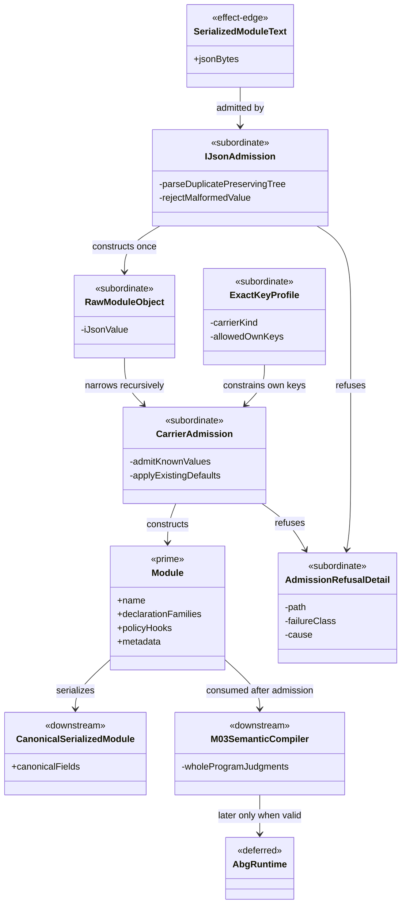
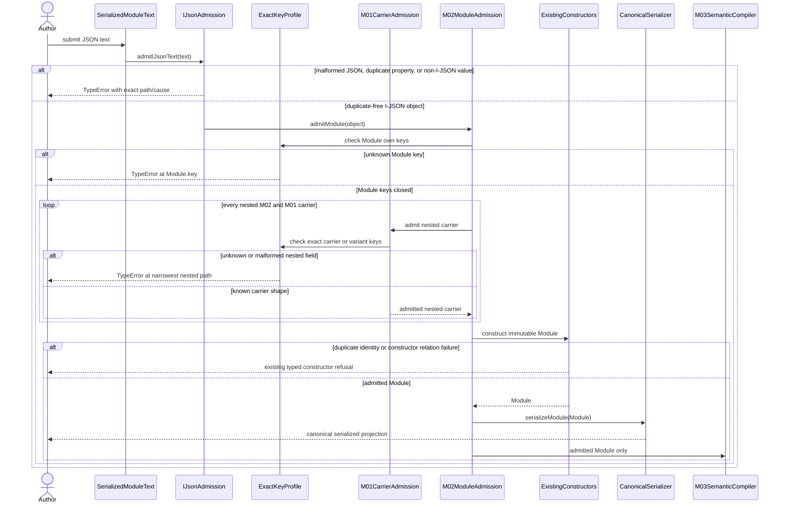
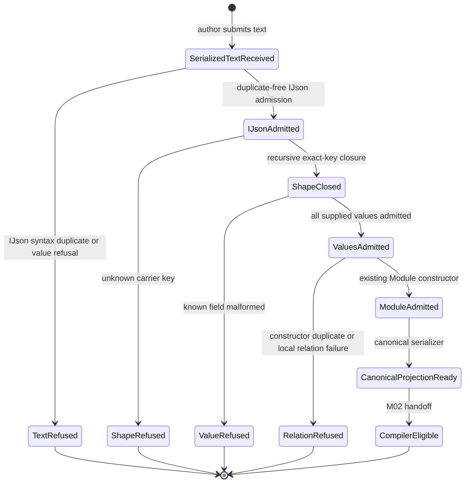

# M01/M02 Strict Raw Module Admission Behavior Design

**Design verdict**: `accepted_by_fh_realization_admitted`
**Implementation admission**: `not_admitted_before_fh_acceptance`
**Ticket**: [T-263](../../../../.ai-workspace/tickets/active/T-263-close-strict-raw-module-admission.md)
**Owning modules**: M01 GTL carrier admission and M02 work publication
**Change class**: `design_reframe`
**Delivery phase**: DS-1 admission foundation

## Boundary

This design closes one generic serialized-validity relation:

```text
serialized Module text
  -> duplicate-preserving I-JSON admission
  -> recursively closed GTL object admission
  -> existing immutable Module constructor
  -> canonical serialized Module
```

The current `admitModule(unknown)` reads known fields and silently ignores an
unknown sibling at the Module root and at several nested M01/M02 carrier
boundaries. A caller can therefore submit data that appears meaningful, have it
dropped, and still receive an admitted `Module`. T-252 pins this defect with an
unknown root field that is accepted and absent after serialization.

`admitModule(unknown)` also cannot prove that JSON text contained no duplicate
property names. A JavaScript object exists only after a parser has already
collapsed that distinction. Duplicate-property refusal must therefore occur at
the existing `admitIJsonText` boundary before object construction. Parsed-object
admission may reject unknown, malformed, sparse, accessor-backed, or
non-I-JSON values, but it must not claim knowledge that its input representation
cannot carry.

This boundary adds no new GTL ontology. `Module` remains the sole admitted
publication carrier. The implementation may add one public text-ingress
function and subordinate exact-key profiles, but no `RawModule`, schema family,
AST, parser, validator service, or post-admission shadow carrier is justified.

## Authority

- `GOALS.md` DS-1 requires malformed serialized GTL to refuse rather than strip.
- `INTENT.md` places authored and serialized GTL at a defended malformed-input
  boundary and requires malformed GTL to fail before execution.
- `PRODUCT.md` assigns serialized validity to raw admission and local validity
  to native types.
- `REQ-L-GTL3-MODULE-001/-005` define the complete Module-owned declaration and
  immutable metadata surfaces.
- `REQ-L-GTL3-ATTRS-003/-005` require duplicate-key refusal and serializable,
  replayable metadata truth.
- `REQ-L-GTL3-CONTRACT-LAW-API-009/-010/-012/-013` assign ABG-owned program
  admission, require lossless supplied inventory, forbid second local contract
  law, and require every accepted concrete syntax carrier to trace to an
  admission function.
- The trusted developer desktop boundary excludes hostile in-process forgery,
  while malformed external serialized values remain in scope.

No requirement reprice is needed. The constitutional law already requires
closed, non-lossy serialized admission. The defect is the M01/M02 realization
shape.

## Current Evidence

| Surface | Current fact | Disposition |
|---|---|---|
| `admitIJsonText` | rejects malformed JSON, duplicate decoded property names, comments, trailing commas, non-finite values, lone surrogates, accessors, sparse arrays, and non-I-JSON values | reuse unchanged |
| `admitModule` | reconstructs a valid Module but does not reject unknown Module keys | repair |
| M02 subordinate admitters | ContractRef, Role, Job, RefinementBoundary, CandidateFamily, and ModuleImport read known keys without exact-key closure | repair |
| M01 subordinate admitters | SerializedAttrs, GraphVector, GraphFunction, and tagged serialized values are substantially closed; Context, SchemaRef, AssetSurface, Node, Operator, Evaluator, Rule, Graph, EnvRef, TemplateRef, HookRef, and authority-slot payloads remain open | repair recursively |
| Module constructors | already reject duplicate declaration ids and duplicate named operator/evaluator/rule/import-style authorities where applicable | preserve |
| canonical serializers | already emit the canonical M01/M02 carrier fields | preserve as emitted-shape authority |
| T-252 body | exact canonical round-trip succeeds at body digest `sha256:e4555c21cdb4292b64f7f4d5a625c2a520195aa8d6e9c759498eed4bf28d0ea0` | bytes must remain unchanged |

## Irreducible Architectural Carrier Set

| Carrier | Stereotype | Visibility | Authority | Meaning |
|---|---|---|---|---|
| `SerializedModuleText` | effect-edge | public input | caller bytes until admission | UTF-8 JSON text whose duplicate property names are still observable |
| `Module` | prime, authoritative | public GTL | existing M02 constructor after admission | sole immutable GTL publication carrier |
| `CanonicalSerializedModule` | downstream | public projection | existing serializer over admitted Module | canonical I-JSON-compatible Module value used for publication, digest, and replay |
| exact-key profiles | subordinate | module-local | M01/M02 serialized-shape law | allowed own-key sets for each serialized carrier and variant; not data or runtime truth |
| admission refusal detail | subordinate | exception boundary | failing parser/admitter | exact path and cause for syntax, duplicate, unknown, malformed, or semantic refusal |

`SerializedModuleText` names an ingress representation, not a new stored type.
`CanonicalSerializedModule` is a projection, not a rival Module. Exact-key
profiles are constants consumed by admission; they do not become package
contracts, schemas, or first-class carriers.

### Subordinate Payloads

The existing Module-owned families remain subordinate to Module admission:

```text
Graph
GraphFunction
RefinementBoundary
CandidateFamily
Job
Role
Operator
Evaluator
Rule
ModuleImport
Module policyHooks and metadata
```

Nested M01 carrier objects remain their existing constitutional types. T-263
does not promote a per-carrier raw wrapper or refusal variant for each one.

### Promotion Test

No proposed helper passes the promotion test:

- exact-key profiles have no independent authority or publication lifecycle;
- parser nodes are implementation detail of the existing I-JSON admission;
- a raw-object mirror would preserve open authority rather than collapse it;
- a post-admission comparison record would duplicate Module truth; and
- one exception subclass per carrier would inflate the boundary without
  changing the caller's decision surface.

## Closed Admission Contract

### Text ingress

The public serialized-text path is:

```text
admitSerializedModuleText(text, label)
  = admitModule(admitIJsonText(text, label), label)
```

`admitIJsonText` remains the one duplicate-preserving JSON parser. T-263 does not
add `JSON.parse`, a regex duplicate scanner, a second JSON AST, or a Module-local
parser.

### Parsed-object ingress

`admitModule(input, label)` remains the object admission API. It first narrows
the complete input through existing I-JSON value admission, then applies exact
own-key closure recursively before constructing the existing carriers.

The object path makes no duplicate-property claim. Duplicate property names are
not representable in its input. Semantic duplicate authorities that remain
representable as array rows or repeated identities continue to fail in existing
Attrs and Module constructors.

### Exact keys and optionality

Exact-key closure answers only whether a supplied key belongs to the carrier.
It does not redefine which allowed fields are required, optional, nullable, or
defaulted. Existing constructor and admitter law retains those decisions.

```text
supplied key not in carrier allowed-key profile -> refuse
allowed required key missing                    -> existing required-field refusal
allowed optional key missing                    -> existing default/normalization
allowed key malformed                           -> existing typed value refusal
all supplied keys consumed                      -> construct admitted carrier
```

Default insertion is declared normalization, not silent loss. Unknown-field
stripping is loss and is forbidden.

### Shape authority and compression

The existing canonical serializers remain the authority for emitted field
shape. M01/M02 exact-key profiles are the admission projection of that shape.
They are declared once beside the carrier family and consumed by the relevant
admitters. A deterministic parity test compares every maximal canonical
serialized carrier's own keys with its profile so serializer and admission
cannot drift silently.

The profiles do not duplicate value, identity, reference, cardinality, or
cross-object law. Existing admitters and constructors retain those judgments.
No JSON Schema or public-contract generator enters M01/M02 admission.

### Refusal contract

The existing synchronous admission boundary continues to throw `TypeError`.
T-263 does not create a second diagnostic algebra. Every refusal must retain:

```text
label/path
failure class in the message or cause
offending key or malformed relation where representable
no admitted Module result
```

The stable refusal families are:

| Family | Owner |
|---|---|
| malformed or non-I-JSON text/value | `admitIJsonText` / `admitIJsonValue` |
| duplicate JSON property name | `admitIJsonText` before object reconstruction |
| unknown carrier field | exact-key profile at the narrowest owning carrier |
| malformed known field | existing field admitter |
| duplicate Attr key | existing `admitSerializedAttrs` |
| duplicate declaration identity/name | existing Module and carrier constructors |
| whole-program reference/completeness failure | M03 semantic compiler, not T-263 |

## Domain Model



## Sequence Model



No worker, plugin, handler, event, traversal, continuation, archive, workspace,
or product-publication effect participates in this sequence.

## State Model



Refusal states produce no Module. `ModuleAdmitted` is the only state that may
reach canonical serialization or M03 compilation.

## Architectural Axioms

1. **RM-01 - One prime carrier.** `Module` remains the sole admitted publication
   carrier. No raw, normalized, compared, or schema-wrapped peer carries Module
   authority.
2. **RM-02 - Duplicate-preserving ingress.** Duplicate JSON property refusal
   occurs only while text structure still preserves duplicates. Parsed-object
   admission makes no impossible duplicate-property claim.
3. **RM-03 - Recursive closed keys.** Every object reachable from a serialized
   Module is either a closed carrier/variant or a declared open value inside the
   existing typed Attrs JSON representation. Unknown carrier siblings refuse at
   the narrowest owning path.
4. **RM-04 - Existing value law.** Exact-key profiles govern only field
   membership. Existing admitters and constructors remain the one authority for
   type, optionality, defaults, identity, duplicates, and local relations.
5. **RM-05 - No loss by stripping.** Every supplied carrier key is admitted or
   refused. Reconstruction cannot silently omit it.
6. **RM-06 - Round-trip is witness, not guard.** Canonical
   `serializeModule(admitModule(serializeModule(module)))` equality is required,
   but post-admission digest or deep comparison cannot substitute for ingress
   closure.
7. **RM-07 - Shape compression.** Exact-key profiles are one subordinate
   admission projection of canonical serializer shape. No second schema,
   reflection framework, or per-feature parser is introduced.
8. **RM-08 - Compiler separation.** M01/M02 decide serialized shape and local
   carrier validity. M03 retains cross-reference, reachability, completeness,
   and realization judgments.
9. **RM-09 - Effect freedom.** Text parsing, raw admission, construction, and
   serialization invoke no runtime or publication effect.
10. **RM-10 - Stable body.** T-252 unknown-field mutation changes from accepted
    and dropped to refusal while its canonical body and body digest remain
    unchanged.
11. **RM-11 - Generic proof.** One non-Consensus Module exercises root and nested
    unknown fields, duplicate decoded names, malformed values, semantic
    duplicates, and exact canonical round-trip.
12. **RM-12 - Proportional trust.** The slice rejects malformed serialized GTL.
    It does not defend against malicious trusted in-process code, cryptographic
    substitution, or hostile workstation tampering.

## IACS And Interface Contract

### Interface contract

| Function | Input | Output | Refusal boundary |
|---|---|---|---|
| `admitSerializedModuleText` | JSON text plus label | existing `Module` | I-JSON syntax/value/duplicate refusal, then recursive Module refusal |
| `admitModule` | programmatic unknown value plus label | existing `Module` | non-I-JSON value, exact-key, known-field, duplicate authority, or constructor relation refusal |
| `serializeModule` | admitted `Module` | canonical serialized Module projection | native Module invariant failure remains impossible under constructors |
| exact-key assertion | I-JSON object, allowed-key profile, label | void/narrowed continuation | first unknown own key at exact path |

### Module key profile

The top-level profile is exactly:

```text
name
graphs
graphFunctions
refinementBoundaries
candidateFamilies
jobs
roles
operators
evaluators
rules
imports
policyHooks
metadata
```

M02 subordinate profiles cover `ContractRef`, `Role`, `Job`,
`RefinementBoundary`, `CandidateFamily`, and `ModuleImport`. M01 profiles cover
every object emitted by its canonical carrier serializers, including variant-
specific `TemplateRef`, serialized Attr value, serialized JSON value, and
AssetSurface authority-slot shapes.

### Allowed open data

Only values already represented through the closed `SerializedJsonValue`
algebra may carry domain-defined object keys. Those objects encode their keys as
`entries[]`, and existing admission rejects duplicate entry keys. An Attr JSON
blob is therefore extensible data inside a closed carrier; it is not permission
for open siblings on Module, Graph, Node, or any other carrier.

## Proof Matrix

| Proof family | Positive case | Negative case |
|---|---|---|
| text syntax | canonical serialized non-Consensus Module text admits | malformed JSON, comment, trailing comma, lone surrogate, non-finite number refuse |
| duplicate text names | unique decoded names admit | literal duplicate and escaped-equivalent duplicate refuse before object reconstruction |
| root closure | canonical T-252 and non-Consensus Module roots admit | unknown root key refuses at `Module.<key>` |
| recursive M02 closure | canonical jobs, roles, boundaries, families, imports admit | one unknown field at each M02 carrier refuses |
| recursive M01 closure | maximal graph/function/vector/node/operator/evaluator/rule/context/attrs shapes admit | unknown nested field at every M01 carrier/variant refuses |
| optional/default law | declared optional omission normalizes through existing defaults | missing required field and malformed present optional field refuse |
| semantic duplicates | unique ids/names/Attr keys admit | duplicate declaration id/name and duplicate Attr entry key retain existing refusal |
| canonical parity | native serialization, object admission, and text admission converge on one canonical Module | no accepted input serializes with a supplied key missing |
| T-252 oracle | body digest remains `sha256:e4555c21cdb4292b64f7f4d5a625c2a520195aa8d6e9c759498eed4bf28d0ea0` | `unknownT252Field` becomes refusal and `strict_raw_module_admission` leaves the census |
| effect fence | source dependency closure remains inside M01/M02/shared deterministic admission | runner, transport, event, app, qualification, workspace, or product dependency fails |

## Cross-View Axiom Matrix

| Axiom | Authority | Domain evidence | Sequence evidence | State evidence | Native enforcement | Admission/compiler enforcement | Verdict | Gap owner |
|---|---|---|---|---|---|---|---|---|
| Module is the one publication carrier | MODULE-001/-003/-005; Prime Law | one prime Module; projections and profiles subordinate | all successful paths construct existing Module | only ModuleAdmitted reaches compiler eligibility | existing Module type and constructors | M02 admission then M03 | `pass` | T-263 realization |
| Serialized input is non-lossy | GOALS DS-1; CONTRACT-LAW-API-010 | exact-key profiles constrain every carrier object | unknown key refuses before construction | ShapeRefused cannot reach ModuleAdmitted | canonical serializers emit closed shapes | recursive M01/M02 exact-key admission | `pass` | T-263 realization |
| Duplicate JSON names fail before collapse | ATTRS-003; concrete syntax trace law | SerializedModuleText remains distinct from object input | `admitIJsonText` precedes object construction | TextRefused precedes IJsonAdmitted | not representable in object types | existing duplicate-preserving I-JSON parser | `pass` | existing shared parser |
| Parsed objects do not fabricate duplicate proof | epistemic honesty; Enforcement After Proof | RawModuleObject carries only observable object truth | object path skips duplicate claim and applies shape/value law | IJsonAdmitted begins after duplicate distinction is absent | object semantics | semantic duplicate arrays/ids still checked | `pass` | T-263 realization |
| Existing defaults remain lawful | MODULE and current carrier requirements | profiles declare allowed keys, not required-key policy | known fields route to existing admitters | ShapeClosed can still reach ValueRefused or ValuesAdmitted | constructors own defaults | current admission functions own optionality | `pass` | T-263 realization |
| Round-trip does not replace ingress closure | CONTRACT-LAW-API-010/-012 | canonical projection is downstream only | exact-key checks precede serializer witness | CanonicalProjectionReady follows ModuleAdmitted | serializer types | negative unknown-field tests plus parity | `pass` | T-263 realization |
| Extensible data stays inside typed Attrs | ATTRS-002..005 | SerializedJsonValue is existing subordinate algebra | Attr JSON entries admit inside closed Attr carrier | malformed or duplicate entries refuse | closed tagged values | existing Attr admission | `pass` | none |
| Whole-program law remains M03-owned | CONTRACT-LAW-API-009/-016 | M03 compiler is downstream | M03 receives only ModuleAdmitted | CompilerEligible follows admission | no M02 cross-program inference | M03 retains reachability/completeness | `pass` | none |
| Admission is effect-free | PRODUCT GTL/ABG boundary | no runtime carrier in active set | no effect participant in sequence | all states are deterministic admission states | pure constructors/serializers | dependency fence | `pass` | T-263 realization |
| T-252 body is unchanged | T-252 checkpoint | same prime Module bytes | only mutation outcome changes | canonical path remains admitted | existing body constructors | digest and manifest oracle | `pass` | T-263 realization |
| Runtime execution | outside T-263 | ABG runtime deferred | no runtime message | no runtime state | not applicable | not applicable | `not_applicable` | T-255 onward |

## Closure Conditions

1. F_H accepts this domain, sequence, state, IACS, and axiom design before code.
2. One existing duplicate-preserving I-JSON parser owns text syntax and duplicate
   property refusal.
3. `admitModule` recursively rejects every unknown carrier sibling without
   changing existing required/optional/default law.
4. Exact-key profiles are subordinate constants with deterministic serializer
   parity proof, not a second schema or carrier family.
5. Native serialization, object admission, and text admission converge on one
   canonical Module.
6. T-252 canonical bytes and body digest remain unchanged; its unknown-field
   mutation becomes typed refusal and only T-263's gap disappears.
7. A non-Consensus maximal Module proves root, nested, variant, duplicate,
   malformed, optional/default, and canonical parity behavior.
8. M01/M02 admission source closure reaches no runtime or product effect module.

## Non-Closure

- deep-equality or digest comparison after admission as the only unknown-field
  guard;
- claiming parsed JavaScript objects preserve duplicate property names;
- adding a second JSON parser, regex duplicate scanner, Module AST, schema
  validator, or public raw-carrier family;
- closing only the Module root while nested Graph, GraphFunction, Node, Rule,
  Role, Job, boundary, family, import, or Attr-adjacent carriers still strip
  unknown siblings;
- rejecting all omitted optional fields merely to make parity easy;
- accepting unknown keys because the reconstructed Module digest is stable;
- moving whole-program reachability or runtime realization judgments into M02;
- adding Consensus vocabulary, body mutation, runtime execution, publication,
  hostile-desktop hardening, or cryptographic proof.

## Non-Scope

- T-264 proportional conformance inventory;
- T-255 execution handoff and all DS-2/DS-3 runtime atoms;
- DS-4 public schemas, catalog publication, or installed Consensus scenarios;
- changes to Module ontology, field names, identity equations, or optionality;
- typed non-throwing diagnostic result families; and
- hostile in-process object forgery or filesystem tamper defense.

## Accepted Verdict

`accepted_by_fh_realization_admitted`. The design closes the observed
lossy seam with existing I-JSON, carrier, constructor, and serializer
authorities. It introduces no competing parser, schema, carrier, or runtime
path. F_H accepted the design and closed T-252 on 2026-07-13 by directing the
proposed review and execution sequence to continue. Implementation is admitted.
