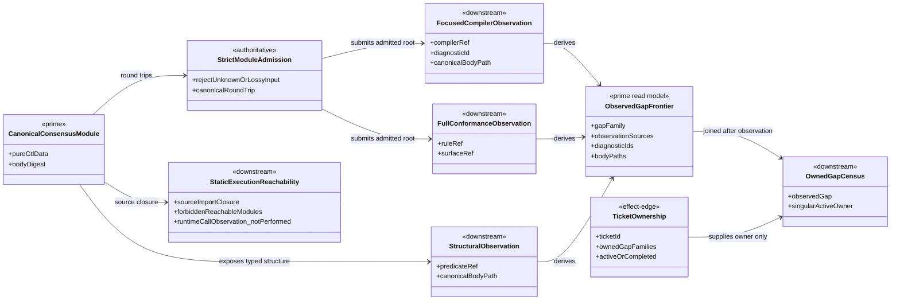
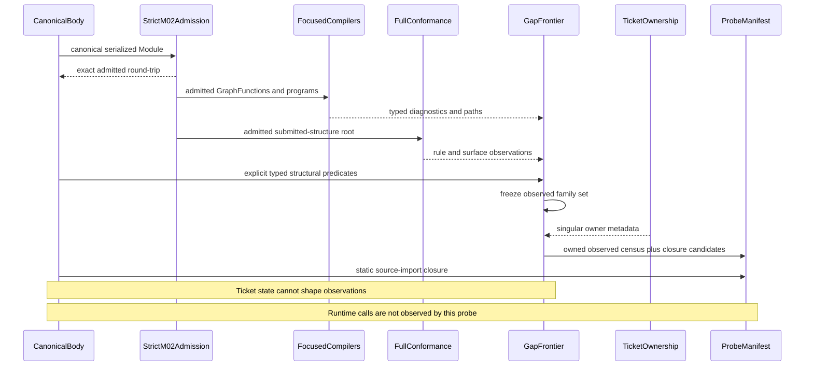
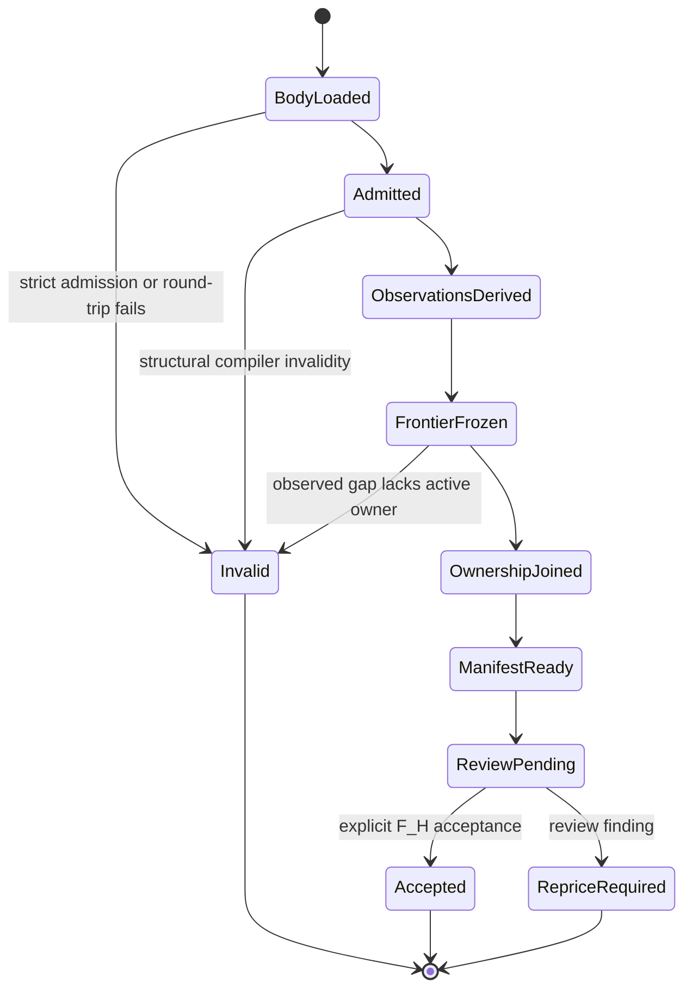

# M01/M02/M03 Consensus GTL Free Construction Behavior Design

**Design verdict**: `accepted_by_explicit_fh`
**Implementation disposition**: canonical body landed; observation-first probe
corrected; runtime realization out of scope
**Ticket**: [T-252](../../../../.ai-workspace/tickets/completed/T-252-design-and-probe-consensus-gtl-free-construction.md)
**Owning modules**: M01 GTL carriers, M02 Module admission, M03 semantic
compilation
**Change class**: `design_reframe`
**Delivery phase**: DS-1

## Boundary

T-252 defines one generic proof relation:

```text
public GTL atoms
  -> canonical pure-data Consensus Module
  -> strict M02 round-trip
  -> focused semantic compilers plus full conformance
  -> independently observed gap frontier
  -> singular ticket-owner join
  -> static source-reachability evidence
```

The body is a free construction over public GTL atoms. It is not a plugin
controller, prompt shell, traversal loop, workflow runner, or Consensus-specific
runtime. The probe reports compiler and structural truth. It does not execute
the graph or establish runtime non-invocation.

## Authority

- `REQ-P-CONSENSUS-001..019` defines the bounded Consensus product behavior.
- `REQ-L-GTL3-GRAPHFUNCTION`, `REQ-L-GTL3-HOF`,
  `REQ-L-GTL3-RECURSE`, and `REQ-L-GTL3-C-ALGEBRA` define the public atoms.
- M02 owns strict serialized Module admission and canonical round-trip.
- M03 owns semantic compilation and conformance observations.
- `.ai-workspace/tickets/` owns work-item assignment only. Ticket state does not
  create or suppress compiler observations.
- DS-4 owns product catalog publication and the published tenant capability
  profile.
- ABG runtime owners retain traversal, effects, events, continuations, replay,
  result admission, and closure.

The prior design is retained as superseded commentary at
`.ai-workspace/comments/codex/20260713T041830Z_SUPERSEDED_t252_consensus_gtl_free_construction_design.md`.
It is not current authority because it proposed literal call-count evidence
without an observing runtime seam and inferred F_H acceptance from a generic
continuation instruction.

## Current Body

The canonical body is
`code/src/abg/m03/contracts/consensus_gtl_body.ts` and serializes to:

```text
sha256:e1344106d4e90c8883f72c6e1490742b98a839433b89855315fec4b571ca8695
```

Current structural facts:

| Relation | Current fact |
|---|---|
| Module | one `abg.consensus.ds1` Module |
| GraphFunctions | seven public GTL GraphFunctions |
| GraphVectors | 35 materialized typed vectors |
| local C selection | 34 exact T-254 vector/program bindings |
| HOF | one typed selector-free `fan_out` wrapper |
| applications | canonical `fan_in` and `recurse` lineage through T-265 |
| effects | exact transitive effect requirements remain declaration truth |
| jobs and roles | zero, lawfully absent for direct catalog construction |
| DS-4 owner | absent from DS-1 body |

The body preserves these distinctions:

- HOF arrays contain only member values; context is carried by parallel typed
  GraphVector sources.
- `Operator.binding` is domain operation identity, never a plugin or handler.
- C program selection and `abg.fn_composition` are separate authorities.
- effects, capability requirements, plugin selections, and handler bindings
  remain separate declaration families.
- `fan_out`, `fan_in`, `recurse`, `workflow.C`, and `C.retry` retain their own
  generic semantics and successor owners.
- F_H is typed pending interaction truth, not graph success.

## Domain Model



### Prime And Subordinate Carriers

| Carrier | Status | Authority |
|---|---|---|
| canonical Consensus Module | prime authoritative | admitted GTL body |
| compiler/conformance observations | downstream evidence | actual compiler outputs |
| structural observations | downstream evidence | explicit body predicates |
| observed gap frontier | prime read model | observations before ownership |
| ticket ownership | effect-edge work metadata | ticket files only |
| owned gap census | downstream join | observed frontier plus singular owner |
| static reachability | downstream evidence | source import closure only |

No carrier above supplies runtime execution, non-execution, capability
compatibility, or closure truth.

## Observation-First Census

The probe must perform this sequence exactly:

```text
1. import and serialize the canonical body
2. strictly admit and round-trip the Module
3. run focused HOF, application, vector-selection, C, and execution-declaration compilers
4. run full proportional conformance
5. derive observed gap families from returned diagnostics, issues, and explicit typed predicates
6. freeze the observed family set
7. load ticket ownership
8. require one active owner for every observed family
9. report active owned families not observed as closure candidates
10. persist evidence and independent digests
```

Ticket ownership may not participate in steps 1 through 6. In particular:

- a successor ticket cannot cause a family to appear;
- moving a ticket cannot suppress a compiler observation;
- an implemented but unratified ticket may remain active while its family is
  absent from the observed frontier; and
- a completed ticket whose family reappears is a regression requiring re-entry,
  not a reason to hide the observation.

Every observed family carries:

```text
gap family
observation source
diagnostic or rule identity
canonical body path
actual relation
requirement authority
owner joined after observation
evidence digest
```

Synthetic labels are permitted only for explicit structural predicates that no
current compiler names directly. Such a row must cite the concrete typed
structure that triggered it. An empty path set cannot create a gap.

## Static Reachability

The source-import closure starts at the canonical body source and follows local
TypeScript imports. The proof fails if that closure reaches the fenced runner,
transport, events, app, qualification, or bin implementation directories. Pure
M03 contract modules remain visible even when their filenames contain words
such as `runtime` or `event`.

Its claim is deliberately narrow:

> The canonical body source dependency closure reaches none of the fenced
> execution or product implementation directories.

It does not claim that runtime call counts are zero. The probe records
`runtimeCallObservation: not_performed`. Declaration counts remain unrelated to
runtime invocation evidence.

## Capability Ownership

The capability relation spans three owners:

```text
T-264
  -> project exact matchable effect requirements

DS-4
  -> publish the versioned tenant capability profile

T-255
  -> admit the exact profile and decide effect compatibility
```

T-252 carries effect and capability references as declared data only. T-264
cannot perform compatibility without the profile. DS-4 cannot self-admit its
profile into an execution handoff. T-255 cannot infer profile content from
names, package versions, plugin refs, handler refs, or tests.

## Sequence



## State Model



## Cross-View Invariants

| Invariant | Domain | Sequence | State |
|---|---|---|---|
| body is pure GTL data | canonical Module has no runtime carrier | only admission and compilation consume it | runtime execution state is absent |
| observations precede ownership | frontier and ticket metadata are separate | frontier freezes before ticket load | no owner can create a gap |
| strict admission is lossless | one Module remains prime | round-trip precedes compilation | malformed input reaches `Invalid` |
| static reachability is narrow | source closure is downstream evidence | closure scan is independent of compiler work | no runtime-count state exists |
| compatibility authority is split | requirements, profile, and admission have distinct owners | T-264 and DS-4 inputs precede T-255 judgment | missing profile remains deferred |
| closure requires explicit F_H | review status is authoritative | no continuation wording is interpreted as acceptance | ticket stays `ReviewPending` |

## Proof Matrix

| Proof | Required evidence |
|---|---|
| body identity | unchanged canonical body digest |
| strict admission | exact round-trip and unknown-field refusal |
| structural validity | zero invalid-program diagnostics and blocking structural issues |
| observation independence | gap frontier freezes before ticket ownership load |
| gap evidence | each family has non-empty observations and body paths |
| ownership | every observed family has one active owner; duplicates and unowned families refuse |
| closure candidates | active owned but absent families are reported separately |
| static reachability | no forbidden module in source-import closure; runtime observation explicitly not performed |
| non-Consensus law | generic compiler fixtures remain green |
| authority | explicit F_H review record before ticket closure |

## Non-Closure

- hard-coded successor ticket expectations presented as compiler output;
- equality between active ticket families and observed gaps;
- empty evidence rows retained to preserve a planned family count;
- literal runtime call counts without an admitted observation seam;
- declaration counts used as invocation or non-invocation evidence;
- inferred F_H acceptance from `continue`, scheduling, or implementation work;
- a Consensus-specific compiler or runtime branch;
- body mutation to make downstream diagnostics disappear;
- capability compatibility without the DS-4 profile and T-255 admission; or
- catalog-owner, runtime, event, replay, or closure truth at DS-1.

## Review Decision

F_H explicitly accepted this corrected three-view design, the unchanged
pure-data body, the observation-first census, and the bounded static-reachability
claim on 2026-07-13. The decision does not claim runtime-call observation or
admit downstream runtime realization.
