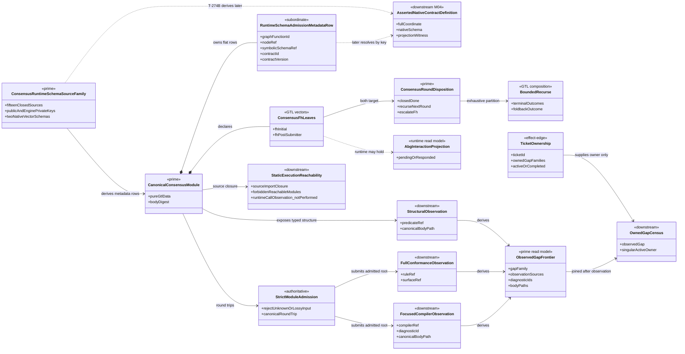
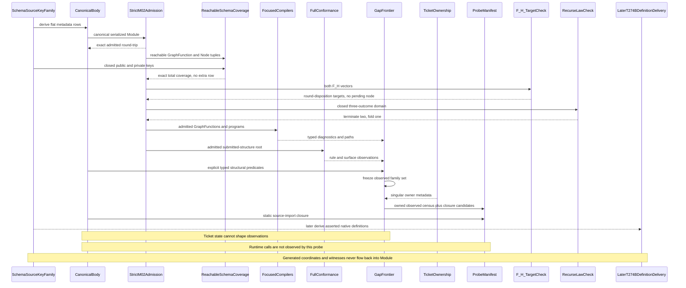
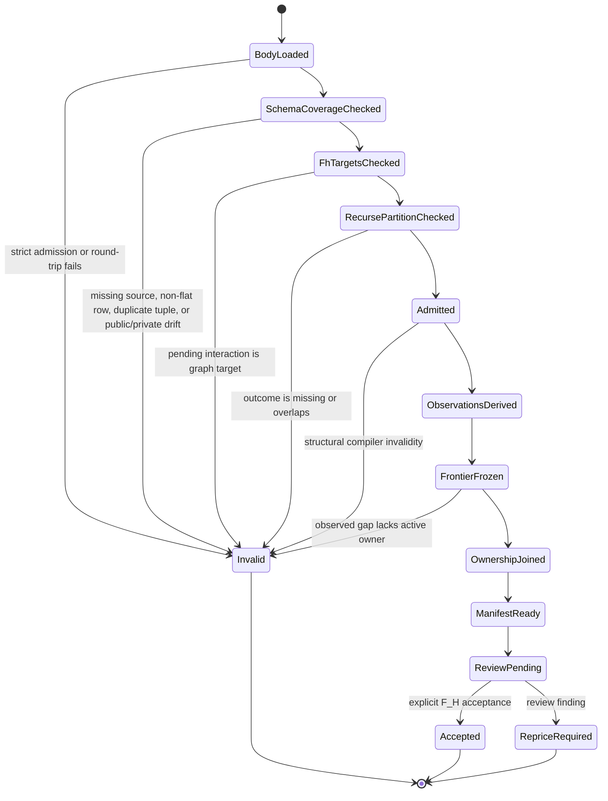

# M01/M02/M03 Consensus GTL Free Construction Behavior Design

**Design verdict**: `candidate_pending_fh_review_for_bounded_structural_and_schema_ownership_repair`
**Implementation disposition**: prior canonical body retained as DS-1 evidence;
F_H target, recurse-law, and reachable-schema ownership corrections are
design-only and not yet realized; runtime realization remains out of scope
**Ticket**: [T-252](../../../../.ai-workspace/tickets/active/T-252-design-and-probe-consensus-gtl-free-construction.md)
**Owning modules**: M01 GTL carriers, M02 Module admission, M03 semantic
compilation
**Change class**: `design_reframe`
**Delivery phase**: DS-1

## Boundary

T-252 defines one generic proof relation:

```text
public GTL atoms
  -> canonical pure-data Consensus Module
  -> strict M02 round-trip
  -> focused semantic compilers plus full conformance
  -> independently observed gap frontier
  -> singular ticket-owner join
  -> static source-reachability evidence
```

The body is a free construction over public GTL atoms. It is not a plugin
controller, prompt shell, traversal loop, workflow runner, or Consensus-specific
runtime. The probe reports compiler and structural truth. It does not execute
the graph or establish runtime non-invocation.

The 2026-07-18 constructability review reopens only the body relation at the two
F_H leaves, the bounded recurse boundary, and the Module's exact declaration of
the native contract key that owns each reachable symbolic Node schema. It does
not move response, continuation, pending-interaction, event, replay, native
definition, projection-witness, or public-catalog ownership into GTL.

## Authority

- `REQ-P-CONSENSUS-001..019` defines the bounded Consensus product behavior.
- `REQ-L-GTL3-GRAPHFUNCTION`, `REQ-L-GTL3-HOF`,
  `REQ-L-GTL3-RECURSE`, and `REQ-L-GTL3-C-ALGEBRA` define the public atoms.
- M02 owns strict serialized Module admission and canonical round-trip.
- M03 owns semantic compilation, conformance observations, and the closed
  native source/key family for every schema boundary reachable from the
  canonical Module.
- `.ai-workspace/tickets/` owns work-item assignment only. Ticket state does not
  create or suppress compiler observations.
- DS-4 owns product catalog publication and the published tenant capability
  profile.
- ABG runtime owners retain traversal, effects, events, continuations, replay,
  result admission, and closure.

The prior design is retained as superseded commentary at
`.ai-workspace/comments/codex/20260713T041830Z_SUPERSEDED_t252_consensus_gtl_free_construction_design.md`.
It is not current authority because it proposed literal call-count evidence
without an observing runtime seam and inferred F_H acceptance from a generic
continuation instruction.

## Current Body

The prior admitted canonical body is
`code/src/abg/m03/contracts/consensus_gtl_body.ts` and serializes to:

```text
sha256:e1344106d4e90c8883f72c6e1490742b98a839433b89855315fec4b571ca8695
```

That digest remains historical DS-1 evidence. It is not the digest of the
repaired candidate because the code has not crossed the renewed design gate.

Prior as-built structural facts:

| Relation | Current fact |
|---|---|
| Module | one `abg.consensus.ds1` Module |
| GraphFunctions | seven public GTL GraphFunctions |
| GraphVectors | 35 materialized typed vectors |
| local C selection | 34 exact T-254 vector/program bindings |
| HOF | one typed selector-free `fan_out` wrapper |
| applications | canonical `fan_in` and `recurse` lineage through T-265 |
| effects | exact transitive effect requirements remain declaration truth |
| runtime schema metadata | absent; prior body does not yet declare the exact native owner key for each reachable symbolic Node schema |
| jobs and roles | zero, lawfully absent for direct catalog construction |
| DS-4 owner | absent from DS-1 body |

The body preserves these distinctions:

- HOF arrays contain only member values; context is carried by parallel typed
  GraphVector sources.
- `Operator.binding` is domain operation identity, never a plugin or handler.
- C program selection and `abg.fn_composition` are separate authorities.
- effects, capability requirements, plugin selections, and handler bindings
  remain separate declaration families.
- `fan_out`, `fan_in`, `recurse`, `workflow.C`, and `C.retry` retain their own
  generic semantics and successor owners.
- an F_H hold is typed runtime pending-interaction truth, not graph success;
  after continuation, the declared graph value is
  `ConsensusRoundDisposition`.

## Closed Reachable Schema Source And Key Family

The repaired candidate has one M03-owned
`CONSENSUS_RUNTIME_SCHEMA_SOURCE_FAMILY`. It is the single native authoring
source for every symbolic schema boundary reachable from the canonical Module.
Each source row binds one exact symbolic ref to one native schema and one
versioned owning contract key. Public rows reuse an existing T-274A public
contract identity. Engine-only rows use a private key and never enter the
public contract catalog.

This is a Prime extension and keyed projection of the existing
`CONSENSUS_DOMAIN_SCHEMAS`, not a second schema or decoder family. Each of the
thirteen direct rows references the exact existing native schema object. The
same family gains the two vector schema objects once, derived from the admitted
member schemas. No field roster, native decoder, symbolic-ref map, or contract
key is authored on a second surface.

The repaired roster is closed at fifteen sources: thirteen direct symbolic
schemas after `FhPendingInteraction` leaves the graph, plus two native vector
schemas. The two vector schemas are real closed native sources derived from
their member schemas; the existing ad hoc `vectorDecoder` witness is not a
runtime-admission source.

| Symbolic schema ref | Owning contract key | Publication |
|---|---|---|
| `schema://abg/consensus/subject` | `abg.schema.consensus-subject@5.0.0` | existing public asset |
| `schema://abg/consensus/result` | `abg.schema.consensus-result@5.0.0` | existing public asset |
| `schema://abg/consensus/review-findings` | `abg.schema.review-findings@5.0.0` | existing public asset |
| `schema://abg/consensus/round-execution` | `abg.private.schema.consensus-round-execution@5.0.0` | engine-only definition |
| `schema://abg/consensus/round-disposition` | `abg.private.schema.consensus-round-disposition@5.0.0` | engine-only definition |
| `schema://abg/consensus/reviewer-assignment` | `abg.private.schema.consensus-reviewer-assignment@5.0.0` | engine-only definition |
| `Vector[schema://abg/consensus/reviewer-assignment]` | `abg.private.schema.consensus-reviewer-assignment-vector@5.0.0` | engine-only definition |
| `Vector[schema://abg/consensus/review-findings]` | `abg.private.schema.consensus-review-findings-vector@5.0.0` | engine-only definition |
| `schema://abg/consensus/round-exact-projection` | `abg.private.schema.consensus-round-exact-projection@5.0.0` | engine-only definition |
| `schema://abg/consensus/semantic-reducer-binding` | `abg.private.schema.consensus-semantic-reducer-binding@5.0.0` | engine-only definition |
| `schema://abg/consensus/initial-semantic-assessment` | `abg.private.schema.consensus-initial-semantic-assessment@5.0.0` | engine-only definition |
| `schema://abg/consensus/submitter-turn-binding` | `abg.private.schema.consensus-submitter-turn-binding@5.0.0` | engine-only definition |
| `schema://abg/consensus/submitter-response` | `abg.private.schema.consensus-submitter-response@5.0.0` | engine-only definition |
| `schema://abg/consensus/post-submitter-semantic-assessment` | `abg.private.schema.consensus-post-submitter-semantic-assessment@5.0.0` | engine-only definition |
| `schema://abg/consensus/fh-interaction-binding` | `abg.private.schema.consensus-fh-interaction-binding@5.0.0` | engine-only definition |

The canonical Module owns exactly one
`abg.runtime_schema_admission_bindings` metadata entry. Its `json_blob` is the
canonical ordered array of strict flat rows derived from Module containment and
the source family:

```ts
interface RuntimeSchemaAdmissionMetadataRow {
  readonly graphFunctionId: string;
  readonly nodeRef: string;
  readonly symbolicSchemaRef: string;
  readonly contractId: string;
  readonly contractVersion: string;
}
```

Each reachable `(graphFunctionId, nodeRef, symbolicSchemaRef)` tuple has exactly
one row, and no unreachable or duplicate tuple is admitted. The Node belongs to
the named GraphFunction, and `symbolicSchemaRef` equals that Node's admitted
`schema.ref`. Several tuple rows may lawfully name the same contract key. The
Module's existing canonical digest seals the complete metadata entry; no row
identity or row digest is added.

The metadata row is a versioned reference projection, not a schema authority.
It contains no `PublicContractCoordinate`, projected `schemaId`,
`schemaVersion`, or digest, locator, native symbol, projection witness,
callable, or admission result. T-274B later
uses the accepted native projector to derive and deliver one asserted native
definition per referenced `contractId@contractVersion`. M04 performs a total
functional join: every row resolves to exactly one asserted definition, every
definition in the exact runtime-join input is referenced by at least one row,
and duplicate definition keys, missing join definitions, extra join-input
definitions, or mismatches refuse. The six standing public schemas that are
not reachable from the canonical Module remain publication assets outside this
runtime-join input. Only the asserted join definition supplies the full
coordinate, native schema, and projection witness to the downstream capability
basis.

T-274A remains closed over exactly the existing nine public schema assets and
two vocabularies. Before implementation, T-274B's own accepted design and ticket
must adopt derivation and delivery of the exact fifteen-definition runtime join
input while packaging the standing public assets. It must keep the other six
public assets outside that join and must not publish private keys as public
catalog rows. T-275 owns profiles, bindings, result admission, and ticket
projection only. It owns no schema key, schema source, native definition, or
metadata row.

This split is acyclic:

```text
T-252 native source/key family
  -> T-252 canonical Module flat metadata rows
  -> T-274B asserted native definitions
  -> M04 exact key join and sealed capability basis
```

Generated T-274A/T-274B digests, locators, and witnesses never flow back into
the synchronous T-252 Module. Adding the private keys creates no public schema,
operation, capability, or catalog identity.

## Bounded F_H Target And Recurse Correction

The prior body incorrectly modeled pending interaction as the output value of
both F_H vectors. The lawful graph target is the result the held leaf will
eventually admit:

| F_H vector | Source | Repaired target |
|---|---|---|
| `graph-vector://abg/consensus/fh-initial` | round, initial assessment, T-275 F_H binding | `ConsensusRoundDisposition` |
| `graph-vector://abg/consensus/fh-post-submitter` | round, post-submitter assessment, T-275 F_H binding | `ConsensusRoundDisposition` |

The body therefore removes `FhPendingInteraction` as a GTL node and target.
Pending/responded/resolved interaction state belongs to ABG's existing event and
projection family while T-271 holds the leaf receipt. T-275 supplies the subject,
policy, response shape, and `ConsensusRoundDisposition` result binding without
supplying an interaction or schema identity. T-272 owns same-locus
response/continuation.

The bounded recurse relation is one total partition over the admitted closed
outcome vocabulary:

```text
closed_done        -> terminate
escalate_fh        -> terminate
recurse_next_round -> declared next-round foldback
```

An open interaction is not an outcome. `escalate_fh` becomes graph data only
after T-272 admits the F_H response against the vector's declared result
contract. The outer result projection accepts either terminal outcome and never
accepts an open/held interaction. Malformed or unrecognized outcomes are
compiler/admission failures, not default recursion.

Cross-view invariants:

- both F_H leaves have one declared graph result type;
- an ABG hold is absent from the GTL value graph;
- only admitted `ConsensusRoundDisposition` enters recurse;
- termination and foldback are disjoint and exhaustive; and
- no Consensus-specific runtime, selector, continuation, or interaction writer
  is introduced by the body repair.

## Domain Model



### Prime And Subordinate Carriers

| Carrier | Status | Authority |
|---|---|---|
| canonical Consensus Module | prime authoritative | admitted GTL body |
| runtime schema source/key family | prime authoritative within native schema ownership | one closed M03 family over every repaired reachable symbolic ref |
| runtime schema metadata rows | subordinate declaration projection | Module containment plus exact source-family key; existing Module digest is the only seal |
| asserted native definitions | downstream projection | T-274B derives through the accepted projector; M04 asserts and joins |
| compiler/conformance observations | downstream evidence | actual compiler outputs |
| structural observations | downstream evidence | explicit body predicates |
| observed gap frontier | prime read model | observations before ownership |
| ticket ownership | effect-edge work metadata | ticket files only |
| owned gap census | downstream join | observed frontier plus singular owner |
| static reachability | downstream evidence | source import closure only |

No carrier above supplies runtime execution, non-execution, capability
compatibility, or closure truth. The source/key family does not create another
public identity roster: its three public rows reuse T-274A identities and its
twelve private rows are excluded from public-catalog projection.

## Observation-First Census

The probe must perform this sequence exactly:

```text
1. import the closed runtime-schema source/key family and canonical body
2. strictly admit and round-trip the Module
3. derive the exact reachable GraphFunction/Node/symbolic-schema tuple census
4. require total source coverage and exact flat Module metadata rows
5. run focused HOF, application, vector-selection, C, and execution-declaration compilers
6. run full proportional conformance
7. derive observed gap families from returned diagnostics, issues, and explicit typed predicates
8. freeze the observed family set
9. load ticket ownership
10. require one active owner for every observed family
11. report active owned families not observed as closure candidates
12. persist evidence and independent digests
```

Ticket ownership may not participate in steps 1 through 8. In particular:

- a successor ticket cannot cause a family to appear;
- moving a ticket cannot suppress a compiler observation;
- an implemented but unratified ticket may remain active while its family is
  absent from the observed frontier; and
- a completed ticket whose family reappears is a regression requiring re-entry,
  not a reason to hide the observation.

Every observed family carries:

```text
gap family
observation source
diagnostic or rule identity
canonical body path
actual relation
requirement authority
owner joined after observation
evidence digest
```

Synthetic labels are permitted only for explicit structural predicates that no
current compiler names directly. Such a row must cite the concrete typed
structure that triggered it. An empty path set cannot create a gap.

## Static Reachability

The source-import closure starts at the canonical body source and follows local
TypeScript imports. The proof fails if that closure reaches the fenced runner,
transport, events, app, qualification, or bin implementation directories. Pure
M03 contract modules remain visible even when their filenames contain words
such as `runtime` or `event`.

Its claim is deliberately narrow:

> The canonical body source dependency closure reaches none of the fenced
> execution or product implementation directories.

It does not claim that runtime call counts are zero. The probe records
`runtimeCallObservation: not_performed`. Declaration counts remain unrelated to
runtime invocation evidence.

## Capability Ownership

The capability relation spans three owners:

```text
T-264
  -> project exact matchable effect requirements

DS-4
  -> publish the versioned tenant capability profile

T-255
  -> admit the exact profile and decide effect compatibility
```

T-252 carries effect and capability references as declared data only. T-264
cannot perform compatibility without the profile. DS-4 cannot self-admit its
profile into an execution handoff. T-255 cannot infer profile content from
names, package versions, plugin refs, handler refs, or tests.

## Sequence



## State Model



## Cross-View Invariants

| Invariant | Domain | Sequence | State |
|---|---|---|---|
| body is pure GTL data | canonical Module has no runtime carrier | only admission and compilation consume it | runtime execution state is absent |
| reachable schema ownership is total | one closed source/key family covers every repaired reachable symbolic ref | source family and Module tuples join before compilers | missing, duplicate, extra, or divergent coverage reaches `Invalid` |
| schema delivery is acyclic | Module rows carry only tuple plus versioned owner key | T-274B receives sources later; generated definition facts never return to Module | no coordinate or witness state exists in T-252 |
| public projection remains bounded | three reachable rows reuse public identities; twelve private rows remain engine-only | later definition delivery separates private definitions from nine public assets | a private public-catalog row reaches `Invalid` downstream |
| F_H target is declared result | both F_H leaves target round disposition; pending interaction is a runtime read model | target check precedes compilers | pending target reaches `Invalid` |
| recurse partition is total | terminal and foldback outcomes are disjoint | closed outcome check precedes compilers | missing or overlapping outcome reaches `Invalid` |
| observations precede ownership | frontier and ticket metadata are separate | frontier freezes before ticket load | no owner can create a gap |
| strict admission is lossless | one Module remains prime | round-trip precedes compilation | malformed input reaches `Invalid` |
| static reachability is narrow | source closure is downstream evidence | closure scan is independent of compiler work | no runtime-count state exists |
| compatibility authority is split | requirements, profile, and admission have distinct owners | T-264 and DS-4 inputs precede T-255 judgment | missing profile remains deferred |
| closure requires explicit F_H | review status is authoritative | no continuation wording is interpreted as acceptance | ticket stays `ReviewPending` |

## Proof Matrix

| Proof | Required evidence |
|---|---|
| body identity | prior digest retained as historical evidence; repaired digest generated only after accepted design and exact round-trip |
| strict admission | exact round-trip and unknown-field refusal |
| schema-source closure | repaired candidate has exactly the fifteen named reachable sources, including two native vector schemas and no pending-interaction source |
| metadata exactness | one strict flat row per reachable GraphFunction/Node/symbolic-ref tuple; canonical order; duplicate, missing, extra, divergent, and generated-fact rows refuse |
| public/private boundary | three reachable keys reuse accepted public identities; twelve engine-only keys create no public catalog rows; T-274A remains nine public assets |
| downstream constructability | T-274B can derive the exact fifteen-definition runtime join input; every row resolves exactly one definition and no join-input definition is unused; six other public assets stay outside the join |
| structural validity | zero invalid-program diagnostics and blocking structural issues |
| observation independence | gap frontier freezes before ticket ownership load |
| gap evidence | each family has non-empty observations and body paths |
| ownership | every observed family has one active owner; duplicates and unowned families refuse |
| closure candidates | active owned but absent families are reported separately |
| static reachability | no forbidden module in source-import closure; runtime observation explicitly not performed |
| non-Consensus law | generic compiler fixtures remain green |
| authority | explicit F_H review record before ticket closure |

## Non-Closure

- hard-coded successor ticket expectations presented as compiler output;
- equality between active ticket families and observed gaps;
- empty evidence rows retained to preserve a planned family count;
- literal runtime call counts without an admitted observation seam;
- declaration counts used as invocation or non-invocation evidence;
- inferred F_H acceptance from `continue`, scheduling, or implementation work;
- a Consensus-specific compiler or runtime branch;
- body mutation to make downstream diagnostics disappear;
- a `PublicContractCoordinate`, digest, projected `schemaId` or
  `schemaVersion`, locator, native symbol, projection witness, callable, or
  admission result in Module metadata;
- a private runtime schema key published as a public contract-catalog row;
- a T-274A generated fact copied back into T-252 source or Module metadata;
- an ad hoc decoder presented as one of the two native vector schema sources;
- T-274B manufacturing a schema identity absent from the T-252 source family;
- T-275 owning or supplying a schema key, native definition, or metadata row;
- capability compatibility without the DS-4 profile and T-255 admission; or
- catalog-owner, runtime, event, replay, or closure truth at DS-1.

## Review Decision

F_H explicitly accepted the prior observation-first probe and bounded static-
reachability claim on 2026-07-13. That decision remains evidence for the DS-1
probe but does not accept the 2026-07-18 F_H-target and recurse-law amendment.
It also does not accept the 2026-07-18 reachable-schema source/key amendment.
The combined amended design is a candidate pending independent review. No body
or runtime code may change under these amendments before that acceptance.
