# M01/M02/M03 Consensus GTL Free Construction Behavior Design

**Design verdict**: `corrected_three_view_design_accepted_by_fh`
**Review status**: accepted by F_H on 2026-07-13; canonical body and probe
checkpoint self-reviewed; F_H checkpoint review pending
**Probe and runtime disposition**: canonical body and exact no-execution census
complete; 21 generic compiler/runtime/conformance gaps retained; runtime and
DS-4 publication remain out of scope
**Delivery phase**: DS-1 executable Consensus design probe
**Ticket**: [T-252](../../../../.ai-workspace/tickets/active/T-252-design-and-probe-consensus-gtl-free-construction.md)
**Owning modules**: M01 GTL language carriers, M02 serialized module admission,
and M03 semantic compilation
**Product authority**: `PRODUCT.md` bounded Consensus and atom criterion
**Requirement authority**: `REQ-P-CONSENSUS`, `REQ-L-GTL3-GRAPHFUNCTION`,
`REQ-L-GTL3-HOF`, `REQ-L-GTL3-RECURSE`, `REQ-L-GTL3-C-ALGEBRA`
**Negative calibration**: [M03_CONSENSUS_REJECTED_AS_BUILT_BEHAVIOR_DESIGN.md](./M03_CONSENSUS_REJECTED_AS_BUILT_BEHAVIOR_DESIGN.md)

## Boundary And Verdict

This design defines the lawful target GTL program shape and the no-execution
compiler probe that now fixes its first canonical gap census. It does not design
or authorize the missing generic language or runtime atoms.

T-253 closed structural HOF child/member/vector identity, canonical
`gtl.hof_application` data, constructor ownership, raw admission, and the absent-runtime diagnostic
for `ReviewerAssignment -> ReviewFindings` over
`ReviewerAssignmentVector -> AttributedFindingsVector`. T-266 subsequently
rebound the native entry points and proofs to constructor-inferred
Node/interface witnesses. The canonical body consumes that relation without a
handwritten name/tag, same-node lie, cast, or `promote` workaround.

T-254 now makes the complete target body natively authorable: each
C-program-executing transition GraphVector carries the existing scalar
`abg.hog_program_ref`, while M03 derives the exact contained-function, vector,
catalog-member, and carrier binding. Runtime consumption remains explicitly
unrealized. A global program, `operator.binding`, `abg.fn_composition` used as a
program selector, opaque configuration, name/tag inference, or helper-
GraphFunction rewrite remains an inadmissible substitute.

The earlier candidate body exposed one further generic atom gap before closure:
`recurse`, `fan_in`, and `gate` create new GraphFunction identities without
complete discriminated `gtl.graph_function_application` declarations, while selected source composition
remains owned by its source GraphFunction or vector. T-265 owns one canonical
operator application declaration across M01 construction and M02 admission;
M03 derives its acyclic operand lineage and provisional owner/execution join.
The canonical Consensus body now consumes that closed atom; it does not rehost or
clone composition declarations, infer identity from names/tags, author a second
host-lineage carrier, or add a private compiler path. Every pre-T-265 body digest
and census value remains historical non-closure evidence.

Fresh review found six independent body-design defects:

1. HOF values must be pure `readonly ReviewerAssignment[]` and
   `readonly ReviewFindings[]`. Round, subject, actor, policy, and binding context
   are explicit parallel GraphVector source Nodes, not named properties on arrays
   or facts smuggled through `RoundExactProjection`.
2. Every GraphFunction declares the exact transitive union of reachable effect
   identities under GF-005, regardless of whether their producing stage is F_D,
   F_P, or F_H. Capability refs remain separate profile/execution-binding rows;
   T-264 checks required effect-to-capability compatibility. Declared effects
   are static truth; the compiler probe's no-execution observation is separate.
3. Module operator publication is a unique `(name, canonical value digest)`
   registry. Exact copied values deduplicate; same-name/different-value refuses;
   embedded GraphVectors remain unchanged.
4. DS-1 proves canonical GraphFunction target identity and body only. DS-4 owns
   admission of `owner://abg/substrate` and the product-catalog row.
5. `Operator.binding` retains domain binding identity. Exact HOG handler-binding
   declarations select each C program/stage/arm interior. An executable
   GraphFunction owns exactly one local `abg.plugin_selection` equal to its used
   scalar-seam set when that set is non-empty; when it is empty the declaration
   is absent. No outer Consensus selection is inherited, and plugin selection
   never substitutes for a handler.
6. Job, Role, effect, handler, and plugin rows are declaration truth. Structural
   conformance inventories them; only absence of runtime calls/outputs proves the
   probe executed nothing.

All six body corrections use existing public serialized carriers and are present
in the canonical body. They do not authorize a new Consensus engine atom. Their
remaining generic enforcement appears as compiler/conformance evidence for the
existing successor owners.

One native-language defect required a generic prerequisite. The former
`hofContract<T>(plainNode)` and `cInterfaceCarrier<T>(plainNodes)` APIs let the
caller choose a phantom `T`; the plain Node did not infer it. T-266 introduced a
constructor-owned native projection from one trusted decoder over the exact full
Node contract key, used by HOF and ordered C interfaces.
Pure arrays and parallel GraphVector sources do not themselves need new algebra,
and T-266's compile-time negatives now protect the consumed relation.

The prior implementation failed at the category boundary: a catalog
GraphFunction name selected an imperative Consensus plugin whose TypeScript
loop owned prompts, panel fan-out, round control, and closure. The lawful
replacement makes those relations visible as GTL data. ABG interprets the
admitted program; it does not contain a Consensus algorithm.

The decisive separation is:

```text
semantic verification round = recurse(graph_function, termination, foldback)
same-contract recovery       = C.retry(c, retryable_failure_budget)
```

`recurse_next_round` is a domain outcome. It is never a retryable transport or
malformed-output failure. The body uses `C.retry` only around one reviewer F_P
turn, with declared positive attempt budget `2` and the one standard
`RETRYABLE_RUNTIME_FAILURE_CLASS_VALUES` allowlist (`transport_failure`,
`no_output`, `contract_failure`). This is the probable malformed-F_P defensive
boundary and exercises the required generic retry atom without making retry the
round controller.

Two further authority separations are load-bearing:

1. the submitting actor identifies the subject submission but does not select
   or authorize the F_P submitter-response turn. That turn requires a separate
   declared role/worker-selection, instruction-contract, result-contract,
   capability, and configuration binding; and
2. `RoundOutcome` is internal round truth. The public outer GraphFunction
   target is `ConsensusResult`, which nests and cites the terminal and prior
   round outcomes. The current declaration's
   `contract://abg/consensus/round-outcome` target is insufficient and must not
   be preserved as the outer contract.

## Requirement Interpretation

| Requirement family | Design interpretation |
|---|---|
| `REQ-P-CONSENSUS-001..003` | DS-1 proves one canonical GraphFunction target and inline executable body. DS-4 separately admits that exact body under `owner://abg/substrate` as the callable product-catalog row. Profiles and overlays configure it but never replace it. |
| `-004..008A` | Invocation, panel, policy, findings, rulings, round outcome, and result remain typed contract data. This design names their relations; DS-4 publishes their final schemas. |
| `-009` | Explicit pure vector fan-out/fan-in and graph recursion/foldback are the constructive body. Context is carried by parallel GraphVector sources. Prompts, policies, effects, HOG handlers, and plugin selections are separate declarations. |
| `-010..012` | Ordinary GraphCall, frame, C-call, admission, replay, F_H, and ticket-read boundaries remain ABG-owned. Consensus returns data and never mutates a ticket. |
| `-013..015` | Workspace identity is one input binding. Current, alternate, and temporary roots are later applications of the same contract, not branches in this graph. |
| `-016..018` | Installed and live qualification is DS-4. DS-1 proves only body admission and the exact no-execution compiler observation plus declaration inventory. |
| `-019` | No generic Review product, scheduler, watcher, recurrence, ticket mutation, or feature-specific engine law appears. |

## Irreducible Architectural Carrier Set

| Public prime carrier | Authority owner | Identity | Invariants | Consumer |
|---|---|---|---|---|
| `ConsensusGraphFunction` | M01 GTL module | `graph-function://abg/consensus/submitter-reviewer-rounds` | immutable target identity, admitted body, one exact outer input/output contract, inline executable graph, complete transitive effects; no owner stamp | M03 semantic compiler; DS-4 publication admission |
| `ConsensusSubject` | `abg.schema.consensus-subject` | subject contract, ref, digest, submitting actor, panel, policy, submitter-turn, workspace refs | exact immutable reviewed subject and explicit invocation workspace | canonical GraphFunction input |
| `ConsensusPanel` | `abg.schema.consensus-panel` | panel ref/version | explicit non-empty ordered unique reviewer-profile refs; no fixed cardinality | panel expansion |
| `ConsensusReviewerProfile` | `abg.schema.consensus-reviewer-profile` | profile ref/version plus config digest | one profile-local role-or-worker-selection contract, instruction/result contracts, capabilities, and attribution are declared; the selected worker assignment derives backend and transport | one reviewer assignment |
| `ReviewFindings` | `abg.schema.review-findings` | reviewer invocation ref plus output digest | profile/config attribution, evidence, typed findings and residual/refusal | panel collection and semantic reducer |
| `ReviewRulings` | `abg.schema.review-rulings` | round/ref reduction identity | only the five closed ruling kinds; never ticket status | result and ticket projection |
| `ConsensusRoundPolicy` | `abg.schema.consensus-round-policy` | policy ref/version | positive semantic-round budget, convergence/disagreement/escalation/foldback law plus exact semantic-reducer and F_H-interaction binding refs; distinct from reviewer attempt budget | recursion termination and routing |
| `ConsensusRoundOutcome` | `abg.schema.consensus-round-outcome` | round ref plus outcome identity | exactly `closed_done`, `recurse_next_round`, or `escalate_fh`; recurse is internal, while escalate is replay-derived from ordinary F_H held truth | foldback and public result lineage |
| `ConsensusResult` | `abg.schema.consensus-result` | subject invocation plus terminal identity | closed is graph-success; escalated and contract-failure variants are replay-derived from held/blocked runtime truth | public result/read projection |
| `TicketConsensusProjection` | `abg.schema.ticket-consensus-projection` | ticket ref/digest plus result ref | read-only ticket-bound view; no status or mutation authority | agent/F_H TICKET_METHOD triage |

These public, versioned schema contracts are architecturally prime even when
their rows are carried inside another contract. Prime does not imply runtime
control authority. Existing GTL `Module`, `Graph`, `GraphFunction`, `Node`,
`GraphVector`, C-program, `GraphCall`, `Frame`, event, result, and replay
carriers remain owned by their existing modules and are not copied.

## Module-Local Prime And Subordinate Carriers

| Carrier or payload | Category | Governing join |
|---|---|---|
| `ConsensusRoundExecution` | module-local prime recursion input | same subject/panel/policy; positive ordinal; prior outcomes, dissent, residuals, evidence, lineage |
| `ReviewerAssignmentVector` | module-local prime GraphFunction boundary | pure `readonly ReviewerAssignment[]`; stable member order only; no named metadata fields |
| `AttributedFindingsVector` | module-local prime GraphFunction boundary | pure `readonly ReviewFindings[]`; stable member order only; no named metadata fields |
| `RoundExactProjection` | module-local prime F_D output | only membership, attribution, cardinality, schema/digest, and exact-row facts derivable from findings members; no round/actor/policy/workspace/binding refs |
| `RoundContextSources` | module-local parallel prime sources | explicit `ConsensusRoundExecution`, subject/policy/actor, and applicable reducer/submitter/F_H binding Nodes supplied alongside arrays to consuming GraphVectors |
| `InitialSemanticAssessment` | module-local prime admitted F_P output | consumes exact projection plus attributed findings; can close, select the submitter turn, or select F_H, but cannot recurse |
| `PostSubmitterSemanticAssessment` | module-local prime admitted F_P output | consumes the admitted initial assessment and exact submitter-response ref; can close, recurse, or select F_H |
| `SubmitterResponse` | module-local prime admitted F_P output | round ref, submitting actor, disputed finding/ruling refs |
| `ConsensusRoundDisposition` | module-local prime recursion-output sum | `RoundClosedDisposition` carries `closed_done`; `RoundRecurseDisposition` requires `recurse_next_round` plus foldback; runtime blocked/held truth is outside this carrier |
| `FoldbackMaterial` | module-local prime recursion boundary | next ordinal, same subject/panel/policy, prior outcomes, dissent, residuals, evidence, lineage |
| `ReviewerAssignment` | subordinate vector element | ordinal, profile/config identity, profile-local execution-selection ref, shared assignment/findings outer contracts |
| `SemanticReducerBinding` | subordinate execution binding | role/worker-selection, config, instruction/result contracts, capabilities |
| `SubmitterTurnBinding` | subordinate execution binding | role/worker-selection, config, instruction/result contracts, capabilities |
| raw reviewer/reducer/submitter output | effect-edge-only payload | selected result contract; standard F_P admission before any prime result |
| `TransitiveEffectDeclaration` | subordinate authoritative GraphFunction field | stable union of every reachable effect identity across F_D/F_P/F_H; capability refs remain separate binding/profile data |
| `ModuleOperatorRegistry` | prime module publication data | one row per unique operator name and canonical value digest; exact duplicates collapse; conflicting values refuse; embedded vectors unchanged |
| `HogHandlerBindingSet` | subordinate execution declarations | exact program/stage/arm/regime to handler identity/config relation; never stored in `Operator.binding` |
| `GraphFunctionPluginSelection` | subordinate execution declaration | exactly one local declaration when an executable GraphFunction's used scalar-seam set is non-empty; absent when the set is empty; keys equal the used set, with no inheritance |
| `NativeNodeInterfaceWitness<T>` | generic T-266 native enforcement projection | constructor-only trusted decoder type bound to the exact full ordinary Node contract key; HOF/C APIs infer `T` and cannot accept an unrelated caller phantom |

Module-local prime means irreducible at an internal GraphFunction or recursion
boundary; it does not mean public catalog visibility. No module-local carrier
may publish itself, emit events, choose an undeclared graph vector, open a
round, admit itself, or close Consensus.

## Domain Model

```mermaid
classDiagram
  class ConsensusGraphFunction {
    <<prime>>
    +canonicalRef
    +inlineGraphBody
    +declaredPrograms
  }
  class ConsensusSubject {
    <<prime>>
    +subjectContractRef
    +subjectRef
    +subjectDigest
    +panelRef
    +roundPolicyRef
    +submittingActorRef
    +submitterTurnBindingRef
    +workspaceRef
  }
  class ConsensusPanel {
    <<prime>>
    +panelRef
    +orderedProfileRefs
  }
  class ConsensusReviewerProfile {
    <<prime>>
    +profileRef
    +configDigest
    +reviewerExecutionSelectionRef
    +instructionContractRef
    +resultContractRef
    +capabilityRefs
  }
  class ReviewFindings {
    <<prime>>
    +profileRef
    +configDigest
    +invocationRef
    +outputDigest
    +evidenceRefs
    +typedFindings
    +typedResidualOrRefusal
  }
  class ReviewRulings {
    <<prime>>
    +rulingRows
    +sourceFindingRefs
    +closedRulingKinds
  }
  class ConsensusRoundPolicy {
    <<prime>>
    +policyRef
    +version
    +positiveRoundBudget
    +convergenceRuleRef
    +disagreementRuleRef
    +escalationRuleRef
    +foldbackContractRef
    +semanticReducerBindingRef
    +fhInteractionBindingRef
  }
  class ConsensusRoundOutcome {
    <<prime>>
    +roundRef
  }
  class RoundClosedDoneOutcome {
    <<prime>>
    +kind_closed_done
  }
  class RoundRecurseNextOutcome {
    <<prime>>
    +kind_recurse_next_round
  }
  class RoundEscalateFhOutcome {
    <<downstream>>
    +kind_escalate_fh
    +fhInteractionRef
  }
  class ConsensusResult {
    <<prime>>
    +subjectInvocationRef
    +panelRef
    +policyRef
    +roundRefs
    +priorRecurseOutcomeRefs
    +findingsAndRulingsRefs
    +consensusAndDissentClass
    +residualEvidenceLineageRefs
    +resultRef
    +replayRef
  }
  class ConsensusClosedResult {
    <<prime>>
    +terminalOutcome_closed_done
  }
  class ConsensusEscalatedResult {
    <<downstream>>
    +terminalOutcome_escalate_fh
    +fhInteractionRef
  }
  class ConsensusContractFailureResult {
    <<downstream>>
    +blockedInvocationRef
    +failureClass
    +failedCallEvidenceRefs
  }
  class TicketConsensusProjection {
    <<downstream>>
    +ticketRef
    +ticketDigest
    +consensusResultRef
  }
  class ConsensusRoundExecution {
    <<prime>>
    -invocationRef
    -subjectRef
    -subjectDigest
    -panelRef
    -policyRef
    -workspaceRef
    -submittingActorRef
    -semanticReducerBindingRef
    -submitterTurnBindingRef
    -fhInteractionBindingRef
    -roundOrdinal
    -priorRoundOutcomeRefs
    -dissentAndResidualRefs
    -evidenceAndLineageRefs
  }
  class ReviewerAssignment {
    <<subordinate>>
    -panelOrdinal
    -profileRef
    -reviewerExecutionSelectionRef
    -sharedInputContractRef
    -sharedOutputContractRef
  }
  class ReviewerAssignmentVector {
    <<prime>>
    -value_readonly_ReviewerAssignment_array
  }
  class AttributedFindingsVector {
    <<prime>>
    -value_readonly_ReviewFindings_array
  }
  class RoundExactProjection {
    <<prime>>
    -memberDerivedCardinality
    -memberDerivedAttribution
    -memberDerivedSchemaDigestFacts
    -memberDerivedExactEqualityClasses
  }
  class SemanticRoundAssessment {
    <<prime>>
    -semanticAgreementOrDispute
    -dissentAndResidualRefs
  }
  class InitialSemanticAssessment {
    <<prime>>
    -phase_initial
    -initialAssessmentRef
  }
  class PostSubmitterSemanticAssessment {
    <<prime>>
    -phase_post_submitter
    -postAssessmentRef
    -submitterResponseRef
  }
  class ReviewOneProfile {
    <<prime>>
    -kind_GraphFunction
    -C_retry_budget_2
    -standardRetryAllowlist
  }
  class ReviewPanelFunction {
    <<prime>>
    -kind_GraphFunction
    -fan_out
  }
  class ExactPanelFactsFunction {
    <<prime>>
    -kind_GraphFunction
    -fan_in_reducer
  }
  class ConsensusRoundGraphFunction {
    <<prime>>
    -kind_GraphFunction
    -input_ConsensusRoundExecution
    -output_ConsensusRoundDisposition
  }
  class ReduceRound {
    <<subordinate>>
    -kind_C_program
    -fibre_F_P
  }
  class SubmitterResponse {
    <<prime>>
    -actorRef
    -turnInvocationRef
    -disputedRefs
  }
  class SubmitterResponseTurn {
    <<subordinate>>
    -kind_C_program
    -fibre_F_P
  }
  class ReassessRound {
    <<subordinate>>
    -kind_C_program
    -fibre_F_P
  }
  class InitialRoundRouting {
    <<subordinate>>
    -kind_evaluator_rules
    -fibre_F_D
    -closed_or_submitter_or_FH
  }
  class PostSubmitterRoundRouting {
    <<subordinate>>
    -kind_evaluator_rules
    -fibre_F_D
    -closed_or_recurse_or_FH
  }
  class FhPendingProgram {
    <<subordinate>>
    -kind_C_program
    -fibre_F_H
    -pendingInteractionAdmission
  }
  class SemanticReducerBinding {
    <<subordinate>>
    -bindingRef
    -roleRef
    -workerSelectionContractRef
    -configDigest
    -instructionContractRef
    -resultContractRef
    -capabilityRefs
  }
  class SubmitterTurnBinding {
    <<subordinate>>
    -bindingRef
    -roleRef
    -workerSelectionContractRef
    -configDigest
    -instructionContractRef
    -resultContractRef
    -capabilityRefs
  }
  class FhInteractionBinding {
    <<subordinate>>
    -bindingRef
    -subjectContractRef
    -interactionContractRef
    -resultContractRef
    -capabilityRefs
  }
  class RoundRecursionLaw {
    <<subordinate>>
    -terminationEvaluatorRef
    -foldbackBindingRef
    -requiresParentEvaluation
  }
  class FoldbackMaterial {
    <<prime>>
    -invocationRef
    -subjectRef
    -subjectDigest
    -panelRef
    -policyRef
    -workspaceRef
    -submittingActorRef
    -semanticReducerBindingRef
    -submitterTurnBindingRef
    -fhInteractionBindingRef
    -nextRoundOrdinal
    -priorOutcomeRefs
    -dissentResidualEvidenceLineage
  }
  class ConsensusRoundDisposition {
    <<prime>>
    -roundRef
  }
  class RoundClosedDisposition {
    <<prime>>
    -outcome_closed_done
  }
  class RoundRecurseDisposition {
    <<prime>>
    -outcome_recurse_next_round
    -foldbackMaterialRef
  }
  class ProjectResult {
    <<subordinate>>
    -kind_C_program
    -fibre_F_D
    -terminalDispositionToResult
  }
  class SameContractRetryPolicy {
    <<subordinate>>
    -standardAllowlistRef
    -attemptBudget_2
  }
  class AbgRuntime {
    <<authoritative>>
    +GraphCall
    +Frame
    +CCall
    +admission
    +eventsAndReplay
  }
  class Ds1CompilerProbe {
    <<downstream>>
    -canonicalBodyDigest
    -pathAddressedTermManifest
    -compilerDiagnostics
    -runtimeConsumerCensus
    -outcome_invalid_gap_or_compiled
  }
  class TransitiveEffectDeclaration {
    <<subordinate authoritative>>
    -stableReachableEffectRefsAllRegimes
  }
  class EffectCapabilityCompatibility {
    <<downstream conformance judgment>>
    -effectRef
    -requiredCapabilityRefs
    -bindingOrProfileRefs
  }
  class DomainOperatorBinding {
    <<subordinate domain identity>>
    -operatorName
    -domainBindingRef
    -regime
  }
  class ModuleOperatorRegistry {
    <<prime module publication>>
    -uniqueName
    -canonicalValueDigest
  }
  class HogHandlerBindingSet {
    <<subordinate execution declaration>>
    -programRef
    -stageRole
    -armId
    -regime
    -handlerRefClassConfig
  }
  class GraphFunctionPluginSelection {
    <<subordinate execution declaration>>
    -hostGraphFunctionRef
    -declarationKey_abg_plugin_selection
    -exactApplicableUsedScalarSeamRefs
  }
  class ProbeNoExecutionObservation {
    <<downstream observation>>
    -observedOutcome_invalid_gap_or_compiled
    -runnerCalls_zero
    -pluginAndHandlerCalls_zero
    -transportCalls_zero
    -eventResultReplayArchiveWorkspaceProductOutputs_zero
  }
  class Ds4CatalogOwnershipAdmission {
    <<deferred authoritative>>
    -ownerRef_abg_substrate
    -catalogRowIdentity
  }
  class NativeNodeInterfaceWitness {
    <<generic T266 authority>>
    -trustedDecoderReturnType
    -fullNodeContractKey
    -nominalNodeAndInterfaceBrands
  }
  class StandardFpAdmission {
    <<authoritative>>
    +selectedResultContract
    +typedNonCloseFailure
  }
  class RawFpOutput {
    <<effect-edge>>
    -producerKind
    -selectedResultContractRef
    -payloadRef
  }
  class NativeHofAuthoring {
    <<authoritative>>
    +hofContract(T266TypedMemberNode)
    +hofVector(T266TypedVectorNode member)
    +hofUnaryRef(child T266TypedInput T266TypedOutput)
    +fan_out(child boundaries_over_into)
  }
  class HofApplicationDeclaration {
    <<prime>>
    +syntaxVersion
    +relationRef
    +operatorKind_fan_out
    +childGraphFunctionRef
    +inputMemberNodeRef
    +inputMemberContractKey
    +outputMemberNodeRef
    +outputMemberContractKey
    +inputVectorNodeRef
    +inputVectorContractKey
    +outputVectorNodeRef
    +outputVectorContractKey
    +wrapperGraphVectorRef
    +whollySuccessfulOrdinalLaw
    +whollySuccessfulCardinalityLaw
  }
  class GraphFunctionProgramCatalog {
    <<prime>>
    +hostGraphFunctionRef
    +declaredCProgramsByRef
  }
  class GraphVectorProgramSelectionDeclaration {
    <<subordinate authoritative>>
    +declarationKey_abg_hog_program_ref
    +hostGraphVectorRef
    +selectedProgramRef
  }
  class CompiledGraphVectorCProgramBinding {
    <<downstream compiler truth>>
    +hostGraphFunctionRef
    +hostGraphVectorRef
    +selectedProgramRef
    +orderedSourceNodeContractKeys
    +targetNodeContractKey
    +programInputCarrierRef
    +programOutputCarrierRef
  }
  class AppliedGraphFunction {
    <<generic T265 atom consumer>>
    +newGraphFunctionId
    +outerContract
    +operatorSpecificTemplateInvariant
  }
  class GraphFunctionApplicationDeclaration {
    <<prime authored relation>>
    +applicationRef
    +operatorKind
    +operandGraphFunctionId
    +completeOperatorSemantics
  }
  class GraphFunctionApplicationLineageProjection {
    <<downstream compiler truth>>
    +executionSubjectGraphFunctionId
    +orderedApplicationRefs
    +orderedOperandIds
  }
  class ProvisionalDerivedCompositionBinding {
    <<downstream provisional compiler join>>
    +declarationOwnerGraphFunctionRef
    +executionSubjectGraphFunctionRef
    +applicationLineageRef
    +sourceCompositionRef
  }
  class M01ApplicationBuilder {
    <<authoritative constructor>>
    +emitCompleteRecurseFanInGateVariant
    +replaceCopiedApplicationAuthority
  }
  class VectorProgramSelectionAuthoring {
    <<authoritative>>
    +deriveCanonicalNodeInterfaceCarriers
    +declareExistingSelectorRef
  }
  class M02RawGtlAdmission {
    <<authoritative>>
    +rawProgramAdmission
  }
  class M03SemanticCompiler {
    <<authoritative>>
    +compileAdmittedProgram
  }
  class DeferredDs4Publication {
    <<downstream>>
    +publishExactBodyAndContracts
  }
  class AbgCli {
    <<downstream>>
    +renderPublicOperationResults
  }
  class PublicSdk {
    <<downstream>>
    +delegatePublicOperations
  }
  class PublicOperationAdmission {
    <<authoritative>>
    +workspaceActorAllowlistCapabilityAdmission
  }
  class CatalogModuleBodyResolver {
    <<authoritative>>
    +resolveCatalogModuleAndBody
  }
  class ExecutionBasisJoin {
    <<authoritative>>
    +admitCompiledRuntimeIdentity
  }
  class OrdinaryFhBoundary {
    <<authoritative>>
    +admitPendingInteraction
  }
  class PublicFhAct {
    <<downstream generic carrier>>
    +pendingInteractionRef
    +actorRef
    +capabilityRef
    +responseContractRef
  }
  class FpTransformRequest {
    <<authoritative>>
    +requestRef
    +actorInvocationId
    +dispatchRef
    +workerId
    +backendId
  }

  ConsensusClosedResult --|> ConsensusResult
  ConsensusEscalatedResult --|> ConsensusResult
  ConsensusContractFailureResult --|> ConsensusResult
  RoundClosedDoneOutcome --|> ConsensusRoundOutcome
  RoundRecurseNextOutcome --|> ConsensusRoundOutcome
  RoundEscalateFhOutcome --|> ConsensusRoundOutcome
  InitialSemanticAssessment --|> SemanticRoundAssessment
  PostSubmitterSemanticAssessment --|> SemanticRoundAssessment
  ConsensusGraphFunction --> ConsensusSubject : input contract
  ConsensusGraphFunction --> ConsensusResult : output contract
  ConsensusGraphFunction --> ConsensusRoundGraphFunction : workflow C of recurse
  ConsensusSubject "1" --> "1" ConsensusPanel : selects
  ConsensusSubject "1" --> "1" ConsensusRoundPolicy : selects
  ConsensusSubject "1" --> "1" SubmitterTurnBinding : selects separately from actor
  ConsensusRoundPolicy "1" --> "1" SemanticReducerBinding : selects evaluator binding
  ConsensusRoundPolicy "1" --> "1" FhInteractionBinding : selects FH binding
  ConsensusPanel "1" o-- "1..*" ConsensusReviewerProfile : ordered members
  ConsensusRoundExecution --> ReviewerAssignmentVector : expands by panel ordinal
  ReviewerAssignmentVector "1" *-- "1..*" ReviewerAssignment : ordered members
  ReviewerAssignment --> ConsensusReviewerProfile : carries exact profile selection
  ReviewerAssignment "1" --> "1" ReviewOneProfile : fan_out over
  AbgRuntime --> FpTransformRequest : resolves profile selection per task
  FpTransformRequest --> ReviewOneProfile : dispatches attributed task
  ReviewOneProfile --> ReviewPanelFunction : lifted by fan_out
  ReviewOneProfile --> RawFpOutput : raw reviewer output
  RawFpOutput --> StandardFpAdmission : selected contract admission
  StandardFpAdmission --> ReviewFindings : admits reviewer result
  AttributedFindingsVector "1" o-- "1..*" ReviewFindings : collected by ordinal
  AttributedFindingsVector --> ExactPanelFactsFunction : fan_in over
  ExactPanelFactsFunction --> RoundExactProjection : FD envelope and exact equality
  AttributedFindingsVector --> ReduceRound : explicit parallel findings source
  RoundExactProjection --> ReduceRound : explicit member derived facts source
  ConsensusRoundExecution --> ReduceRound : explicit round context source
  SemanticReducerBinding --> ReduceRound : explicit execution binding source
  ReduceRound --> RawFpOutput : raw semantic assessment
  StandardFpAdmission --> InitialSemanticAssessment : admits initial reduction
  StandardFpAdmission --> ReviewRulings : admits ruling rows
  InitialSemanticAssessment --> ReviewRulings : proposes initial rulings
  InitialSemanticAssessment --> InitialRoundRouting : declared initial routing input
  InitialRoundRouting --> RoundClosedDoneOutcome : admitted closed route
  InitialRoundRouting --> SubmitterResponseTurn : material dispute and budget remains
  InitialRoundRouting --> FhPendingProgram : unresolved or exhausted vector
  SubmitterTurnBinding --> SubmitterResponseTurn : authorizes FP turn
  ConsensusRoundExecution --> SubmitterResponseTurn : explicit round actor subject source
  SubmitterResponseTurn --> RawFpOutput : raw submitter response
  StandardFpAdmission --> SubmitterResponse : admits response
  SubmitterResponse --> ReassessRound : declared reassessment input
  SemanticReducerBinding --> ReassessRound : authorizes FP turn
  ConsensusRoundExecution --> ReassessRound : explicit round context source
  AttributedFindingsVector --> ReassessRound : explicit findings source
  RoundExactProjection --> ReassessRound : explicit member facts source
  ReassessRound --> RawFpOutput : raw reassessment
  StandardFpAdmission --> PostSubmitterSemanticAssessment : admits reassessment with response ref
  PostSubmitterSemanticAssessment --> ReviewRulings : proposes post-submitter rulings
  PostSubmitterSemanticAssessment --> PostSubmitterRoundRouting : declared post-submitter routing input
  PostSubmitterRoundRouting --> RoundClosedDoneOutcome : admitted closed route
  PostSubmitterRoundRouting --> RoundRecurseNextOutcome : admitted recurse route
  PostSubmitterRoundRouting --> FhPendingProgram : unresolved or exhausted vector
  FhInteractionBinding --> FhPendingProgram : binds subject and interaction
  ConsensusRoundExecution --> FhPendingProgram : explicit round subject actor source
  RoundClosedDisposition --|> ConsensusRoundDisposition
  RoundRecurseDisposition --|> ConsensusRoundDisposition
  RoundClosedDoneOutcome --> RoundClosedDisposition : closed_done only
  RoundRecurseNextOutcome --> RoundRecurseDisposition : recurse_next_round only
  FoldbackMaterial --> RoundRecurseDisposition : required payload
  ConsensusRoundExecution --> ConsensusRoundGraphFunction : recursive input
  ConsensusRoundGraphFunction --> ConsensusRoundDisposition : recursive output
  RoundRecurseDisposition --> RoundRecursionLaw : recurse variant only
  RoundRecursionLaw --> ConsensusRoundExecution : foldback rebind
  RoundClosedDisposition --> ProjectResult : closed variant only
  ProjectResult --> ConsensusClosedResult : final graph projection
  ConsensusResult --> TicketConsensusProjection : read-only projection
  ReviewOneProfile --> SameContractRetryPolicy : mandatory same-call recovery
  ConsensusGraphFunction --> NativeHofAuthoring : must type before body exists
  NativeNodeInterfaceWitness --> NativeHofAuthoring : T266 inferred node types
  NativeNodeInterfaceWitness --> VectorProgramSelectionAuthoring : T266 inferred ordered interfaces
  NativeHofAuthoring --> HofApplicationDeclaration : produces sole structural HOF relation
  HofApplicationDeclaration --> ReviewPanelFunction : governs exact wrapper
  ConsensusGraphFunction --> GraphFunctionProgramCatalog : owns declared programs
  ConsensusGraphFunction --> VectorProgramSelectionAuthoring : requires authored carriers and selectors before serialization
  VectorProgramSelectionAuthoring --> GraphVectorProgramSelectionDeclaration : emits existing scalar selector
  GraphVectorProgramSelectionDeclaration --> GraphFunctionProgramCatalog : names candidate member resolved only by M03
  ConsensusGraphFunction *-- AppliedGraphFunction : contains recurse and fan in applications
  M01ApplicationBuilder --> AppliedGraphFunction : constructs from exact operand
  AppliedGraphFunction *-- GraphFunctionApplicationDeclaration : owns one immediate application
  VectorProgramSelectionAuthoring --> M02RawGtlAdmission : serializes canonical declarations
  GraphFunctionApplicationDeclaration --> M02RawGtlAdmission : admits complete closed variant
  M02RawGtlAdmission --> M03SemanticCompiler : admits root and reachable declarations
  M03SemanticCompiler --> GraphFunctionApplicationLineageProjection : derives generic T265 lineage
  GraphFunctionApplicationLineageProjection --> ProvisionalDerivedCompositionBinding : emits provisional joins only
  M03SemanticCompiler --> CompiledGraphVectorCProgramBinding : validates containment catalog and boundary then derives exact join
  M03SemanticCompiler --> Ds1CompilerProbe : supplies diagnostics and compiled identity
  ConsensusGraphFunction *-- TransitiveEffectDeclaration : declares exact reachable effect identities
  ConsensusRoundGraphFunction *-- TransitiveEffectDeclaration : declares exact reachable effect identities
  ReviewPanelFunction *-- TransitiveEffectDeclaration : declares exact reachable effect identities
  ReviewOneProfile *-- TransitiveEffectDeclaration : declares exact reachable effect identities
  ExactPanelFactsFunction *-- TransitiveEffectDeclaration : declares exact reachable effect identities
  AppliedGraphFunction *-- TransitiveEffectDeclaration : declares exact reachable effect identities
  M03SemanticCompiler --> TransitiveEffectDeclaration : checks static completeness
  TransitiveEffectDeclaration --> EffectCapabilityCompatibility : T264 checks separate bindings and profiles
  ConsensusReviewerProfile --> EffectCapabilityCompatibility : supplies separate reviewer capabilities
  SemanticReducerBinding --> EffectCapabilityCompatibility : supplies separate reducer capabilities
  SubmitterTurnBinding --> EffectCapabilityCompatibility : supplies separate submitter capabilities
  FhInteractionBinding --> EffectCapabilityCompatibility : supplies separate FH capabilities
  GraphFunctionProgramCatalog *-- HogHandlerBindingSet : binds program stage arm handlers
  ReduceRound --> DomainOperatorBinding : domain operation only
  SubmitterResponseTurn --> DomainOperatorBinding : domain operation only
  FhPendingProgram --> DomainOperatorBinding : domain operation only
  ConsensusGraphFunction "1" o-- "0..1" GraphFunctionPluginSelection : present iff used scalar seams nonempty
  ConsensusRoundGraphFunction "1" o-- "0..1" GraphFunctionPluginSelection : present iff used scalar seams nonempty
  ReviewPanelFunction "1" o-- "0..1" GraphFunctionPluginSelection : present iff used scalar seams nonempty
  ReviewOneProfile "1" o-- "0..1" GraphFunctionPluginSelection : present iff used scalar seams nonempty
  ExactPanelFactsFunction "1" o-- "0..1" GraphFunctionPluginSelection : absent when no scalar seam is used
  AppliedGraphFunction "1" o-- "0..1" GraphFunctionPluginSelection : present iff used scalar seams nonempty
  ModuleOperatorRegistry o-- DomainOperatorBinding : deduplicates publication rows
  M03SemanticCompiler --> ModuleOperatorRegistry : checks name digest collisions
  ConsensusGraphFunction --> Ds1CompilerProbe : coverage subject remains unchanged
  Ds1CompilerProbe --> ProbeNoExecutionObservation : records observed absence only
  Ds1CompilerProbe ..> AbgRuntime : reads consumer inventory only
  DeferredDs4Publication --> CatalogModuleBodyResolver : publishes exact admitted body
  DeferredDs4Publication --> Ds4CatalogOwnershipAdmission : admits SYSTEM owner and catalog row
  AbgCli --> PublicSdk : delegates operation
  PublicSdk --> PublicOperationAdmission : submits envelope
  PublicOperationAdmission --> AbgRuntime : admits operation
  AbgRuntime --> CatalogModuleBodyResolver : resolves callable body
  AbgRuntime --> ExecutionBasisJoin : admits execution basis
  FhPendingProgram --> OrdinaryFhBoundary : submits pending interaction
  OrdinaryFhBoundary --> AbgRuntime : returns held runtime truth
  OrdinaryFhBoundary --> PublicFhAct : admits typed public act
  PublicFhAct --> AbgRuntime : resumes same continuation
  ConsensusGraphFunction --> AbgRuntime : interpreted by
  AbgRuntime --> ConsensusContractFailureResult : replay-derived blocked read
  AbgRuntime --> ConsensusEscalatedResult : replay-derived held read
  AbgRuntime --> RoundEscalateFhOutcome : derives from held truth
```

Domain invariants:

1. `ReviewerAssignmentVector` is only `readonly ReviewerAssignment[]`, and
   `AttributedFindingsVector` is only `readonly ReviewFindings[]`. Member order
   preserves panel ordinal/profile attribution; the arrays own no named context
   fields. Completion order is never semantic order.
2. `RoundRecursionLaw` alone owns `recurse_next_round` re-entry.
3. `SameContractRetryPolicy` is mandatory around one reviewer call, but cannot
   reference a round outcome or mint a `ConsensusRoundExecution`.
4. `ConsensusResult` cites prior `recurse_next_round` outcomes but never marks
   one terminal. `closed_done` is the only graph-success terminal outcome.
   `escalate_fh` and contract failure are separate replay-derived public read
   variants over ABG held/blocked truth, not graph-success values or invented
   round outcomes.
5. `submittingActorRef` and `SubmitterTurnBinding` are separate joins. Neither
   the CLI caller nor the current agent is an implicit worker-selection rule.
6. F_D supplies envelope and exact-equality facts only. F_P owns semantic
   agreement, dispute, dissent, and ruling judgment.
7. `ConsensusRoundExecution -> ConsensusRoundDisposition` is the one
   graph-success outer interface preserved by `recurse`. Only `closed_done`
   reaches `ProjectResult`; `recurse_next_round` reaches foldback, while an F_H
   pending call holds outside this output interface.
8. Reviewer, reducer, submitter-response, and reassessment F_P outputs all
   cross `StandardFpAdmission` before becoming prime carriers or routing truth.
9. The native HOF input/output relation must type through T-266 constructor-
   inferred typed Nodes before a body exists. The
   compiler probe cannot turn an authoring failure into a semantic gap by
   handcrafting an equivalent-looking GraphFunction.
10. F_D may select the F_H vector, but the ordinary F_H call holds the graph.
    Replay/read projection alone derives `escalate_fh` and the interaction ref;
    no downstream graph vector runs after the pending call.
11. `RoundClosedDisposition` cannot carry foldback, and
    `RoundRecurseDisposition` requires it. Native discriminated variants reject
    closed-plus-foldback and recurse-without-foldback before raw admission.
12. The public round-outcome contract is also a discriminated family: exactly
    one of closed, recurse, or replay-derived F_H escalation exists for a round.
13. Each reviewer profile owns its own role-or-worker-selection contract.
    Ordinary ABG selection resolves that contract to the task's runtime-owned
    `FpTransformRequest`, from which worker/backend and downstream transport
    are derived. The panel, subject, caller, and
    CLI cannot inject one shared agent contract, and GTL cannot select an
    independent backend or transport beside the worker assignment. Different
    profiles may therefore resolve to different admitted worker implementations
    without adding Consensus-specific dispatch law.
14. `ReviewerAssignment` carries only authored profile and selection-contract
    identity. `FpTransformRequest` is ABG runtime truth created after selection;
    its concrete worker, backend, dispatch, and transport identities never
    enter the GTL graph carrier. DS-1 declares this target join but does not
    claim the current one-basis runtime can yet vary it per panel task.
15. Initial and post-submitter semantic assessments are distinct native types.
    Only `PostSubmitterSemanticAssessment`, joined to the exact admitted
    `SubmitterResponse`, can reach `recurse_next_round`; an initial assessment
    cannot bypass the submitter turn and type a foldback disposition.
16. The T-253 HOF relation is one hosted `HofApplicationDeclaration`; child,
    member, vector, wrapper, ordinal, and wholly-successful cardinality joins
    are structural authority owned by the constructor. T-266 rebinds and
    re-proves the former caller-selected native `T` API against actual
    Node/interface witnesses. Names and tags are not authority.
17. `GraphVectorProgramSelectionDeclaration` is the missing authored relation
    for C-program-executing transition vectors.
    `CompiledGraphVectorCProgramBinding` is derived compiler truth, not a second
    selector. Program definitions and catalogs remain on the containing
    GraphFunction; `abg.fn_composition` remains separate regime/closure
    governance and cannot select a C program. The structural T-253 HOF wrapper
    remains declaration-empty and is governed by the host
    `gtl.hof_application` relation instead.
18. The canonical public GraphFunction has exactly one input Node for
    `ConsensusSubject` and one output Node for `ConsensusResult`. Panel, profile,
    policy, actor, workspace, and binding identities are fields reached from the
    subject and then carried cumulatively; they are not extra public inputs.
19. Every applied `recurse`, `fan_in`, or `gate` GraphFunction owns exactly one
    generic T-265 discriminated `gtl.graph_function_application`. The declaration
    owns its immediate operand opaque id and complete operator-specific
    semantics; M03 alone derives the acyclic
    `GraphFunctionApplicationLineageProjection` and any provisional
    source-owner/derived-execution bindings.
20. Every semantic reduction, submitter, reassessment, routing, and F_H vector
    receives round and applicable binding context as explicit parallel source
    Nodes. `RoundExactProjection` contains only facts derived from findings-array
    members.
21. Each GraphFunction's `effects` is the exact stable transitive union of all
    reachable effect identities regardless of F_D/F_P/F_H regime. Capability
    refs remain separate profile/execution-binding rows; T-264 checks required
    compatibility. Declared effect completeness is not proof of observed
    execution. An empty set is lawful only when reachability proves no effects.
22. Module operators form a unique name/canonical-value-digest registry. Exact
    repeated source/derived values collapse to one module row; the same name with
    a different value refuses; embedded GraphVector operators are unchanged.
23. `Operator.binding` is domain identity only. `abg.hog_handler_bindings` owns
    exact C program/stage/arm interior binding. Every executable GraphFunction,
    including a derived application, owns one local `abg.plugin_selection` iff
    its used scalar bootstrap-seam set is non-empty, and that declaration's keys
    equal the set. A zero-seam function has no selection declaration. No
    outer-Consensus inheritance exists, unused seam selection is invalid, and
    handler binding is not plugin selection.
24. DS-1 body truth includes no SYSTEM owner. DS-4 alone admits the exact target
    under `owner://abg/substrate` into the product catalog.
25. Job, Role, effect, capability, handler, and plugin rows are declarations.
    The no-execution observer is armed before M02 and finalized for
    `invalid_program`, compiler-gap, and compiled outcomes. It proves absence of
    runner/plugin/handler/transport/event/result/replay/archive/workspace/product calls and
    outputs, never a declaration count.

## Exact GTL Body Topology

The canonical body has one module root. Only boundaries that require reuse,
higher-order application, or recursion are GraphFunctions. Vector-local
transforms remain declared C programs, evaluators, and rules. None of the
module-local functions is a separately published catalog row, and the design
does not publish the reserved `gtl://abg/review/*` declarations as a generic
Review product.

This topology now has canonical pure-data bytes with body digest
`sha256:e4555c21cdb4292b64f7f4d5a625c2a520195aa8d6e9c759498eed4bf28d0ea0`.
T-253 constructs the canonical structural fan-out application, T-266 supplies
its native type witnesses, T-254 binds each C-program-executing transition
GraphVector to its exact containing-catalog member, and T-265 preserves
application lineage for recurse and fan-in. The same bytes pass M02 and produce
the M03 census fixed below.

### Public-atom stdlib guarantee

The body is a stdlib free construction, not an engine feature. It uses only
public M01/M02 GTL constructors, public `abg.fn_composition`, and standard
public HOG handler and GraphFunction plugin-selection declarations. It imports
no runner, transport, SDK, worker,
or feature plugin. Anything the body needs that a consumer cannot express or
invoke through the same public atoms remains a generic compiler/runtime gap;
it cannot be supplied through a Consensus-only branch.

| GraphFunction boundary | Input -> output | Why it is a GraphFunction |
|---|---|---|
| canonical Consensus | `ConsensusSubject -> ConsensusResult` | sole public callable carrier; inline graph owns seed, recursive lift, and terminal projection vectors |
| `consensus.round` | `ConsensusRoundExecution -> ConsensusRoundDisposition` | recursion preserves this exact success interface for closed/recurse; ordinary runtime blocked or F_H-held truth stops outside it |
| `consensus.review-one-profile` | `ReviewerAssignment -> ReviewFindings` | reusable per-element function consumed by `fan_out`; its one vector carries `C.retry(C.of(F_P), 2)` and ordinary ABG result admission |
| `consensus.exact-panel-facts` | `readonly ReviewFindings[] -> RoundExactProjection` | explicit deterministic member-derived reducer consumed by `fan_in`; output contains no round/binding metadata |
| derived `fan_out(consensus.review-one-profile)` | `readonly ReviewerAssignment[] -> readonly ReviewFindings[]` | T-253 canonical structural relation over pure arrays, rebound to actual Node/interface types by T-266 and lifted into the round only by `workflow.C`; any task failure remains ordinary ABG blocked truth |
| derived `fan_in(consensus.exact-panel-facts)` | `readonly ReviewFindings[] -> RoundExactProjection` | higher-order member-fact reduction lifted into the round only by `workflow.C` |
| derived `recurse(consensus.round)` | `ConsensusRoundExecution -> ConsensusRoundDisposition` | bounded semantic rounds with declared termination and foldback |

| Vector-local declaration | Input -> output | Owner and law |
|---|---|---|
| seed-round C program | `ConsensusSubject -> ConsensusRoundExecution` | F_D admits exact subject, panel, policy, actor, bindings, workspace, and round 1 |
| expand-panel C program | `ConsensusRoundExecution -> readonly ReviewerAssignment[]` | F_D expands the admitted panel into pure ordered members; each member carries its task/profile identity, while the array has no fields |
| semantic-reduction C program | `ConsensusRoundExecution + RoundExactProjection + readonly ReviewFindings[] + SemanticReducerBinding -> InitialSemanticAssessment + ReviewRulings` | explicit parallel sources; one F_P leaf; raw output crosses standard admission |
| submitter-response C program | `ConsensusRoundExecution + InitialSemanticAssessment + SubmitterTurnBinding -> SubmitterResponse` | explicit round/actor/subject and execution-binding sources; one F_P leaf |
| semantic-reassessment C program | `ConsensusRoundExecution + RoundExactProjection + readonly ReviewFindings[] + InitialSemanticAssessment + SubmitterResponse + SemanticReducerBinding -> PostSubmitterSemanticAssessment + ReviewRulings` | explicit parallel sources; exact response ref retained |
| initial-round routing evaluator/rules | `ConsensusRoundExecution + InitialSemanticAssessment -> closed outcome, selected submitter vector, or selected F_H vector` | policy is reached from explicit round source; initial assessment cannot recurse |
| post-submitter routing evaluator/rules | `ConsensusRoundExecution + PostSubmitterSemanticAssessment -> closed/recurse outcome or selected F_H vector` | explicit round source; F_D never mints human-stop truth |
| F_H pending-interaction C program | `ConsensusRoundExecution + admitted assessment + FhInteractionBinding -> runtime held stop` | explicit subject/actor/policy/binding sources; ordinary F_H boundary holds traversal |
| project-result C program | `closed_done ConsensusRoundDisposition -> ConsensusClosedResult` | F_D runs only after recursive closed termination; held/blocked paths never reach it; no ticket mutation |

Canonical topology notation:

```text
review_panel: GraphFunction<readonly ReviewerAssignment[], readonly ReviewFindings[]> = fan_out(
  review_one_profile,
  over = ReviewerAssignmentVector,
  into = AttributedFindingsVector
)

round_graph = Graph {
  round -> reviewer_assignments       by expand_panel
  reviewer_assignments -> findings   by workflow.C(review_panel) when all results admit
  findings -> exact_facts             by workflow.C(fan_in(exact_panel_facts, over = AttributedFindingsVector))
  round + exact_facts + findings + semantic_reducer_binding -> raw_initial_assessment by reduce_round
  raw_initial_assessment -> initial_assessment by standard FP result admission
  initial_assessment -> closed_outcome when admitted agreement
  round + initial_assessment + submitter_turn_binding -> raw_submitter_reply by submitter_response when dispute and budget remains
  initial_assessment -> fh_vector      when admitted unresolved or exhausted
  raw_submitter_reply -> submitter_reply by standard FP result admission
  round + exact_facts + findings + initial_assessment + submitter_reply + semantic_reducer_binding -> raw_post_assessment by reassess_round
  raw_post_assessment -> post_submitter_assessment by standard FP result admission with submitter response ref
  post_submitter_assessment -> closed_outcome when admitted agreement
  post_submitter_assessment -> fh_vector when admitted unresolved or exhausted
  post_submitter_assessment -> recurse_outcome when admitted next-round disposition
  round + admitted_assessment + fh_interaction_binding -> runtime_held by ordinary FH pending interaction admission
  closed_outcome -> round_disposition with terminal outcome
  recurse_outcome -> round_disposition with foldback material
}

round = GraphFunction(
  ConsensusRoundExecution -> ConsensusRoundDisposition,
  inline_graph = round_graph
)

bounded_rounds = recurse(
  round,
  termination = closed_done,
  foldback = {
    mode: rebind,
    binding: binding://abg/consensus/next-round,
    requiresParentEvaluation: true
  }
)

consensus_graph = Graph {
  subject -> first_round              by seed_round C program
  first_round -> closed_disposition   by workflow.C(bounded_rounds)
  closed_disposition -> result        by project_result C program
}

Consensus = GraphFunction(
  ConsensusSubject -> ConsensusResult,
  inline_graph = consensus_graph,
  effects = stable_transitive_union(reachable_effect_identities_all_regimes)
)
```

Every helper GraphFunction carries the same exact transitive rule at its own
reachability boundary. `review-one-profile` declares the reviewer effect
identities it reaches; round declares every deterministic, probabilistic, and
human effect identity reachable below it; canonical Consensus declares the
stable union below the recursive lift. Capability refs remain on the applicable
reviewer profile or execution-binding rows and are never members of `effects`.
T-264 checks any required effect-to-capability compatibility. An empty effect set
is lawful only when exact reachability proves that the function reaches no
effect, not merely because its work is F_D.

Execution authorities remain three separate relations:

```text
Operator.binding                 = domain operation identity
abg.hog_handler_bindings         = program + stage + arm + regime -> handler
GraphFunction abg.plugin_selection = this function's used scalar engine seam -> plugin catalog ref
```

No `Operator.binding` contains a `plugin://` ref. The module operator publication
list is derived from all embedded source/derived graph vectors as a registry:
canonical values with the same name and digest produce one module row; the same
name with different canonical values refuses; embedded GraphVector operator
arrays are never rewritten. An executable GraphFunction with a non-empty used
scalar-seam set owns one local `abg.plugin_selection` equal to that set; when the
set is empty the declaration is absent. The outer Consensus function supplies no
inherited selection. T-264
inventories the resulting effects, separate capabilities, per-function plugin
selections, HOG handlers/configs, Jobs, and Roles, and checks required
effect-to-capability compatibility.

DS-1 freezes the T-266 rebound typed scalar member Nodes, pure vector Nodes, schema refs,
`nodeContractKey` values, child GraphFunction ref, wrapper ref, HOF relation ref,
and host GraphFunction identity used by this body. Native serialization and raw
module admission include the scalar reviewer child and derived fan-out host
exactly once so M03 resolves one child authority. DS-4 may publish the schema
bodies and admit the exact target under `owner://abg/substrate` into the product
catalog. The GTL body carries no owner field. DS-4 may not alter an
identity-bearing Node contract without changing the canonical body digest and
re-entering this design.

The alternatives are admitted `GraphVector` plus evaluator/rule declarations.
They may not become an `if` in an adapter or service. On no material dispute,
the F_P reducer admits an `InitialSemanticAssessment` with agreement and the
round proceeds to a closed outcome. On a material dispute while policy permits
another round, the submitter response becomes admitted attributed F_P input
before a separately admitted `PostSubmitterSemanticAssessment`. Only that
post-submitter type can select `recurse_next_round`; the initial type has no
native relation to recurse or foldback.
Unresolved or exhausted truth takes the F_H vector. F_D supplies only
envelope and exact-equality facts and routes already-admitted semantic truth.
It may select the F_H vector, but the ordinary F_H pending-interaction C-call
holds traversal rather than returning graph-success data. Replay/read projection
derives `escalate_fh` and the interaction ref from that admitted held truth.

Every internal `ConsensusRoundOutcome` is retained by identity inside the
round/result lineage, but only `ConsensusResult` crosses the outer target
contract. A `recurse_next_round` outcome is nonterminal and appears only in the
prior-round lineage of the eventual result. The terminal outcome is
`closed_done` or `escalate_fh`. A retry-exhausted, malformed, or nonretryable
review result takes the existing ABG C-call blocked path and does not become a
round disposition, fourth round outcome, or fan-in value. `recurse` preserves
`ConsensusRoundExecution -> ConsensusRoundDisposition` only on graph-success
paths; only after it returns `closed_done` does `project-result` create
`ConsensusClosedResult`. Public escalated and contract-failure variants are
instead replay-derived read projections over held and blocked invocations. The
existing declared nameplate must be reconciled from
`contract://abg/consensus/round-outcome` to the canonical result contract when
the body is later published; DS-1 records this join and does not publish it.

### C-Program Placement

Each C-program-executing transition GraphVector selects a declared C program.
The T-253 structural HOF wrapper is not such a transition: its vector
declarations stay empty and its host `gtl.hof_application` declaration owns the
structural relation. Deterministic seed,
expansion, exact-envelope/equality projection, routing, and result projection
are ordinary `C.of`/flat `C.compose` programs. Semantic reduction, reviewer,
submitter, and reassessment turns are F_P `C.of` leaves with declared
role/worker, instruction, and result-contract refs. Their raw outputs remain
effect-edge data until the standard ABG F_P result-admission boundary returns
the corresponding prime carrier.

The selected program and the vector-local `abg.fn_composition` contract are
different authorities. `abg.hog_program_ref` selects one program from the
containing GraphFunction's catalog. `abg.fn_composition` selects the regime,
carrier, assurance, and closure-governance contract for the vector boundary.
Neither may be inferred from the other.

Implementation binding is also separate. `Operator.binding` remains the domain
operation identity visible in the graph. Every C program that requires an
interior handler, regardless of F_D/F_P/F_H regime, declares exact
`abg.hog_handler_bindings` rows for its program ref, stage role, arm id, regime,
handler ref/class, and config ref. Separately, an executable GraphFunction whose
used scalar-seam set is non-empty owns one local `abg.plugin_selection` equal to
that set, for example `fpDispatch` or `fhAdmission` where the admitted program
reaches those seams. When the set is empty, the declaration is absent. It does
not declare unused scalar seams, inherit
the outer function's selection, or use plugin selection to
replace an HOG handler. A direct `plugin://...` Operator binding is invalid.

T-254 retains the program catalog on the containing function, admits the
existing selector key on a C-program-executing transition GraphVector, derives
its C input/output carriers from the exact ordered Node interfaces, and lets M03
derive one exact binding over function ref, vector ref, program ref, ordered
source-node contracts, target-node contract, and program input/output carriers.
Missing, duplicate, unresolvable, or mismatched bindings are invalid programs.
The T-252 body consumes that relation unchanged. A valid binding remains
`semantic_not_realized` until T-255's separately designed runtime handoff
consumes vector-indexed compiled selection.

Named child GraphFunctions enter a parent vector only through `workflow.C`.
The explicit reviewer vector is graph-level `fan_out`; its M03 execution
mapping may lawfully use `C.batch` only if the compiler proves the relation
between panel ordinal, task identity, task carrier pair, and one spine/result
judgment per task. Current `C.batch(tasks, batchRef)` accepts an authored
ordered term family but carries no admitted data-vector binding by itself. The
probe must expose that relation as present or missing; it must not hard-code
two reviewer terms to make compilation pass.

The reviewer program is exactly one same-contract retry wrapper:

```text
review_one_profile_program = C.retry(
  C.of(invoke_attributed_reviewer, F_P, result_bearing),
  budget = 2
)
```

The allowlist is the single ABG-owned
`RETRYABLE_RUNTIME_FAILURE_CLASS_VALUES` home: `transport_failure`,
`no_output`, and `contract_failure`. Authentication, missing capability,
unresolved worker selection, semantic dissent, and `recurse_next_round` are not
retryable by this term. Exhaustion or a nonretryable failure produces the
existing ABG C-call blocked path and never enters panel fan-in or graph-success
output.
Instruction assembly, transport, and response decoding are the standard F_P
handler interior selected by the reviewer profile. ABG result admission remains
outside that interior and judges every attempt before `C.retry` may re-enter the
same leaf. The design does not split those standard boundaries into extra
C-call spines or make an `admit` C stage a second truth authority.

`fan_out` describes graph topology. T-253 authors and compiles the canonical
structural `readonly ReviewerAssignment[] -> readonly ReviewFindings[]`
application through `hofContract`, `hofVector`, `hofUnaryRef`, and
`fan_out(child, {over, into})`. The derived host carries one canonical
`gtl.hof_application` declaration and owns one wrapper GraphVector. Its generic execution must
lower by an explicit type-preserving projection to `C.batch`, preserving one
ordered task/spine per panel ordinal. A separate HOF scheduler or interpreter
would not exercise the retained `C.batch` atom and would create competing
execution ownership. Name/tag recognition is not proof. The target structural relation is
`readonly ReviewerAssignment[] -> readonly ReviewFindings[]`.
The pre-T-253 same-node facade is retired. A `promote` workaround remains
forbidden because promotion cannot turn assignments into findings or failure
truth. T-266 replaces the caller-selected native `T` at these T-253 entry points
with constructor-inferred Node/interface witnesses. The canonical Consensus body
then exercises the
`C.batch` requirement through the mandatory vector-to-task projection without
encoding a fixed two-reviewer tuple. The current typed compiler result is
`semantic_not_realized`; it is the runtime gap, not an authoring gap.

`fan_in` is deterministic only for
`readonly ReviewFindings[] -> RoundExactProjection`. The projection contains
member-derived facts only. The separate F_P `consensus.reduce-round` consumes
explicit parallel sources for `ConsensusRoundExecution`, that projection, the
findings array, and `SemanticReducerBinding` to
produce `InitialSemanticAssessment` and `ReviewRulings`; after an admitted
submitter response, `consensus.reassess-round` produces the distinct
`PostSubmitterSemanticAssessment` and updated rulings. The semantic reducer is
not the `fan_in` reducer.

### Cumulative Environment Contract

| GraphFunction | `environment.requires` | `environment.provides` | `environment.carries` |
|---|---|---|---|
| canonical Consensus | exactly one `ConsensusSubject`; panel, profile, policy, actor, workspace, catalog, semantic-reducer, submitter-turn, and F_H-interaction refs are fields reached from that subject | exactly one `ConsensusResult` | subject/panel/policy identities, submitting actor, workspace, findings, rulings, all round outcomes, dissent, residuals, evidence, lineage |
| `consensus.round` | `ConsensusRoundExecution` with current ordinal and all cumulative carried refs | exactly one graph-success `ConsensusRoundDisposition` containing `closed_done` or `recurse_next_round` plus applicable foldback; runtime blocked/F_H-held truth stops outside this interface | prior round outcomes including recurse, admitted findings/rulings, dissent, residuals, submitter responses, evidence, lineage |
| `consensus.review-one-profile` | one assignment plus exact profile and result/instruction contracts | one admitted `ReviewFindings` or typed retry/failure judgment | subject/round/task/profile/config/actor identities and evidence lineage |
| `consensus.reduce-round` | explicit `ConsensusRoundExecution`, exact member-derived facts, pure findings array, and `SemanticReducerBinding` sources | admitted `InitialSemanticAssessment` and `ReviewRulings` only after standard F_P admission | round/profile identities, dissent, residuals, evidence, lineage |
| `consensus.reassess-round` | explicit `ConsensusRoundExecution`, exact initial assessment, admitted submitter response, pure findings array, member-derived facts, and `SemanticReducerBinding` sources | admitted `PostSubmitterSemanticAssessment` carrying the response ref plus updated `ReviewRulings` | round/profile/response identities, dissent, residuals, evidence, lineage |
| `consensus.project-result` | `closed_done ConsensusRoundDisposition` after recursive termination | `ConsensusClosedResult` | every prior round outcome and cumulative findings/rulings/dissent/residual/evidence/lineage ref |

Foldback is cumulative and immutable: the next round adds the current outcome,
dissent, residual, evidence, and lineage refs while preserving the exact
subject, panel, policy, workspace, and submitting actor. It never reconstructs
prior state from a prompt or controller-local array.

## Execution Sequence

```mermaid
sequenceDiagram
  actor Author
  actor Caller
  participant TypeWitness as T266 Typed Node Witness
  participant ExecDecl as Domain Handler Plugin Authorities
  participant Effects as Transitive Effect Analysis
  participant Registry as Module Operator Registry
  participant Application as M01 GraphFunction Application Builder
  participant Native as M01 Typed HOF Authoring
  participant VectorC as M01 Vector C Program Selection
  participant M02 as M02 Raw GTL Admission
  participant M03 as M03 Semantic Compiler
  participant Coverage as DS1 Coverage Oracle
  participant NoExec as Probe No Execution Observation
  participant Publication as Deferred DS4 Publication
  participant CLI as Thin abg.cli
  participant SDK as Public SDK
  participant Public as Public Operation Admission
  participant Catalog as Catalog Module Body Resolver
  participant Basis as ExecutionBasis Join
  participant Runtime as ABG Runtime
  participant Round as Consensus Round Graph
  participant FanOut as GTL fan_out
  participant Reviewer as Review One Profile GF
  participant Admission as Standard FP Result Admission
  participant FanIn as GTL fan_in Exact Collector
  participant Reducer as Vector Local FP C Program
  participant Submitter as Vector Local Submitter FP C Program
  participant Reassessor as Vector Local Reassessment FP C Program
  participant Project as Vector Local Result FD C Program
  participant FH as Ordinary FH Boundary
  participant FHAct as Deferred Public FH Act Admission

  Author->>NoExec: arm observation before native authoring or M02 M03 work
  Author->>TypeWitness: bind trusted decoder types to exact full Node keys and derive HOF/C interfaces
  alt caller phantom type decoder type or Node interface tuple mismatches
    TypeWitness-->>Author: native compile-time refusal
    NoExec-->>Author: invalid outcome with zero runner plugin handler transport event result replay archive workspace product calls
  else T266 inferred witnesses exist
    TypeWitness-->>Author: constructor-owned scalar vector and parallel-source tuple types
  end
  Author->>ExecDecl: separate domain Operator exact HOG rows and conditional local used-seam selections
  alt direct plugin Operator missing or mismatched HOG row or used-seam selection absent extra illegal empty or inherited
    ExecDecl-->>Author: typed execution-authority refusal
    NoExec-->>Author: invalid outcome with zero observed runtime calls and outputs
  else three authorities are distinct
    ExecDecl-->>Author: canonical declarations
  end
  Author->>Effects: derive exact transitive effect identities for all regimes and check separate capabilities
  alt reachable effect missing or extra or required capability incompatible
    Effects-->>Author: typed effect-completeness refusal
    NoExec-->>Author: invalid outcome with zero observed runtime calls and outputs
  else effect declarations complete
    Effects-->>Author: canonical stable effect sets and separate compatibility judgment
  end
  Author->>Registry: derive unique operator name and canonical value digest rows
  alt same name has different value
    Registry-->>Author: typed operator collision refusal
    NoExec-->>Author: invalid outcome with zero observed runtime calls and outputs
  else exact copies deduplicate
    Registry-->>Author: unique module registry embedded vectors unchanged
  end
  Author->>Application: construct recurse and fan_in from exact operand GraphFunctions
  alt T265 atom absent or discriminated application construction refuses
    Application-->>Author: typed authoring refusal, candidate body is not canonical
    NoExec-->>Author: invalid outcome with zero observed runtime calls and outputs
  else complete gtl.graph_function_application declarations exist
    Application-->>Author: operand ids and complete operator-specific semantics
  Author->>Native: construct assignment vector to findings vector fan_out relation
  alt exact member vector or child relation is malformed
    Native-->>Author: typed authoring refusal, no canonical body exists
    NoExec-->>Author: invalid outcome with zero observed runtime calls and outputs
  else T-253 structural relation is admitted through T266 rebound types
    Author->>VectorC: derive canonical interface carriers and declare each transition vector selector
    alt native host carrier or selector declaration is malformed
      VectorC-->>Author: typed authoring refusal, no canonical body exists
      NoExec-->>Author: invalid outcome with zero observed runtime calls and outputs
    else canonical selector and C-program declarations exist
      VectorC->>M02: canonical serialized Consensus module root
      alt malformed or category-invalid GTL
        M02->>NoExec: typed invalid_program diagnostics
        NoExec-->>Author: invalid outcome with zero observed runtime calls and outputs
      else raw body admitted
        M02->>M03: admitted root and reachable declarations
        M03->>M03: prove T265 application declarations and derive GraphFunctionApplicationLineageProjection
        M03->>M03: emit provisional source-owner derived-execution bindings then validate each T254 vector program binding
        alt T265 application is malformed stale ambiguous cyclic or mismatched
          M03->>NoExec: typed application-lineage invalid_program diagnostic
          NoExec-->>Author: invalid outcome with zero observed runtime calls and outputs
        else T-254 relation is invalid
          M03->>NoExec: typed vector-program invalid_program diagnostic
          NoExec-->>Author: invalid outcome with zero observed runtime calls and outputs
        else exact bindings are compiler-visible
          M03->>Coverage: root result plus path-addressed subprobes
          Coverage->>Coverage: compare relied-on constructors with runtime consumers or proved projections
          alt semantic diagnostics or silently accepted declarations
            Coverage->>NoExec: exact blocking gap census
            NoExec-->>Author: compiler-gap outcome with zero observed runtime calls and outputs
          else executable coverage is total
            Coverage->>NoExec: compiled outcome
            NoExec-->>Author: compiled outcome with zero observed runtime calls and outputs and independent declarations
            opt deferred DS4 after generic atoms contracts and publication gates close
              Publication->>Catalog: admit exact body under owner abg substrate and publish catalog row
              Caller->>CLI: catalog.invoke request and explicit workspace root
              CLI->>SDK: abg.operation.catalog.invoke
              SDK->>Public: request workspace context session allowlist actor capability
              Public->>Runtime: admitted catalog.invoke operation
              Runtime->>Catalog: resolve exact workspace product module and body
              Catalog-->>Runtime: admitted catalog row module and body identity
              Runtime->>Basis: exact compiled program schema allowlist capability identities
              Basis->>Runtime: admitted ExecutionBasis with compiled program identity
              loop declared GTL recurse while prior disposition is recurse_next_round
                Runtime->>Round: open GraphCall and round frame
                Round->>FanOut: pure readonly ReviewerAssignment array
                loop panel ordinal, not completion order
                  FanOut->>Runtime: resolve this profile reviewerExecutionSelectionRef
                  alt profile selection refuses or lacks capability
                    Runtime->>Runtime: ordinary C-call blocked truth, no reviewer transport
                  else worker assignment admitted
                    Runtime->>Reviewer: one attributed task with backend and transport derived from assignment
                    Reviewer->>Admission: raw FP output plus selected result contract
                    alt retryable standard failure and budget remains
                      Admission-->>Runtime: typed same-contract retry judgment
                      Runtime->>Reviewer: C.retry same task under budget 2
                    else nonretryable or retry exhausted
                      Admission-->>Runtime: ordinary C-call blocked truth, no graph value
                    else admitted finding set
                      Admission-->>FanOut: profile and config digest bound ReviewFindings
                    end
                  end
                end
                alt any reviewer C-call is blocked
                  Runtime->>Runtime: stop graph invocation, no fan_in or round disposition
                else complete attributed findings vector
                  FanOut->>FanIn: pure readonly ReviewFindings array
                  FanIn->>FanIn: FD envelope and exact-row-equality facts only
                  FanIn->>Reducer: RoundExecution exact facts findings array and SemanticReducerBinding as parallel sources
                  Reducer->>Admission: raw semantic assessment and ruling rows
                  alt reducer output malformed or unattributed
                    Admission-->>Runtime: ordinary C-call blocked truth, no round disposition
                  else initial semantic assessment admitted
                    Admission-->>Round: admitted InitialSemanticAssessment and ReviewRulings
                    alt admitted semantic agreement
                      Round-->>Runtime: closed_done ConsensusRoundDisposition
                    else admitted semantic dispute and budget remains
                      Round->>Submitter: RoundExecution disputed refs and SubmitterTurnBinding as parallel sources
                      Submitter->>Admission: raw attributed submitter response
                      alt submitter output malformed or unattributed
                        Admission-->>Runtime: ordinary C-call blocked truth, no round disposition
                      else submitter response admitted
                        Admission->>Reassessor: RoundExecution response facts findings array and SemanticReducerBinding
                        Reassessor->>Admission: raw semantic reassessment and ruling rows
                        alt reassessment output malformed or unattributed
                          Admission-->>Runtime: ordinary C-call blocked truth, no round disposition
                        else post-submitter assessment admitted with exact response ref
                          Admission-->>Round: admitted PostSubmitterSemanticAssessment and ReviewRulings
                          alt agreement reached
                            Round-->>Runtime: closed_done ConsensusRoundDisposition
                          else another verification round required
                            Round-->>Runtime: recurse_next_round disposition with FoldbackMaterial
                          else unresolved judgment
                            alt FH interaction binding refuses
                              Round-->>Runtime: typed blocked truth before FH call
                            else FH binding admitted
                              Round->>FH: exact invocation round subject and FhInteractionBinding
                              FH-->>Runtime: GraphCall held pending FH, no graph disposition
                            end
                          end
                        end
                      end
                    else unresolved judgment or round budget exhausted
                      alt FH interaction binding refuses
                        Round-->>Runtime: typed blocked truth before FH call
                      else FH binding admitted
                        Round->>FH: exact invocation round subject and FhInteractionBinding
                        FH-->>Runtime: GraphCall held pending FH, no graph disposition
                      end
                    end
                  end
                end
                alt runtime is blocked or held for FH
                  Runtime->>Runtime: retain typed non-close stop, no foldback or downstream vector
                else disposition is recurse_next_round
                  Runtime->>Round: admitted foldback rebinds next round input
                else disposition is closed_done
                  Runtime->>Runtime: retain closed round disposition
                end
              end
              alt runtime stopped blocked or held
                Runtime-->>Public: non-close invocation and result projection refs
              else closed graph disposition exists
                Runtime->>Project: closed_done ConsensusRoundDisposition after recursion
                Project-->>Runtime: admitted ConsensusClosedResult
                Runtime-->>Public: invocation and result refs
              end
              Public-->>SDK: admitted catalog.invoke outcome
              SDK-->>CLI: catalog.invoke result refs
              CLI-->>Caller: render refs only
              Caller->>CLI: read.result and read.replay using returned refs
              CLI->>SDK: public read operations
              SDK->>Public: read envelopes workspace actor and refs
              Public->>Runtime: admitted read.result and read.replay operations
              Runtime-->>Public: closed or replay-derived escalated or contract-failure ConsensusResult and replay
              Public-->>SDK: admitted read projections
              SDK-->>CLI: public operation results
              CLI-->>Caller: render only, no panel or round orchestration
              opt invocation remains held and caller supplies one typed FH act
                Caller->>CLI: public FH act with pending interaction ref and response
                CLI->>SDK: delegate the existing public interaction operation
                SDK->>Public: actor capability pending interaction and response envelope
                Public->>FHAct: admit typed act against held continuation
                alt act admission refuses
                  FHAct-->>Public: typed refusal and continuation remains held
                else act admitted
                  FHAct->>Runtime: resume the same ABG-owned continuation
                  Runtime->>Runtime: re-enter the replay-derived lawful frontier
                end
              end
            end
          end
        end
      end
    end
  end
  end
```



Sequence participant mapping:

| Sequence participant | Domain-model carrier or boundary |
|---|---|
| `Author`, `Caller` | explicitly external actors |
| `TypeWitness`, `Application`, `Native`, `VectorC`, `M02`, `M03` | `NativeNodeInterfaceWitness`, `M01ApplicationBuilder`, `NativeHofAuthoring`, `VectorProgramSelectionAuthoring`, `M02RawGtlAdmission`, `M03SemanticCompiler` |
| `ExecDecl`, `Effects`, `Registry`, `Coverage`, `NoExec` | `DomainOperatorBinding` plus `HogHandlerBindingSet` plus `GraphFunctionPluginSelection`, `TransitiveEffectDeclaration`, `ModuleOperatorRegistry`, `Ds1CompilerProbe`, `ProbeNoExecutionObservation` |
| `Publication`, `CLI`, `SDK`, `Public` | `DeferredDs4Publication`, `AbgCli`, `PublicSdk`, `PublicOperationAdmission` |
| `Catalog`, `Basis`, `Runtime`, `FH`, `FHAct` | `CatalogModuleBodyResolver`, `ExecutionBasisJoin`, `AbgRuntime`, `OrdinaryFhBoundary`, `PublicFhAct` |
| `Round`, `FanOut`, `Reviewer`, `Admission`, `FanIn` | `ConsensusRoundGraphFunction`, `ReviewPanelFunction`, `ReviewOneProfile`, `StandardFpAdmission`, `ExactPanelFactsFunction` |
| `Reducer`, `Submitter`, `Reassessor`, `Project` | `ReduceRound`, `SubmitterResponseTurn`, `ReassessRound`, `ProjectResult` |

Sequence invariants:

- M02 owns raw admission; M03 owns semantic compilation. Neither path has a
  Runtime, worker, event, archive, or workspace effect.
- T-265 discriminated `gtl.graph_function_application` authoring precedes M02;
  M03 derives and proves its `GraphFunctionApplicationLineageProjection` before
  provisional composition and T-254 vector/program joins.
  A host mismatch cannot fall through to the census.
- T-266 typed Node witnesses precede every HOF and C interface. A caller-chosen
  phantom type or reversed parallel-source tuple stops before body bytes exist.
- HOF messages carry pure readonly arrays. Reducer, submitter, reassessment, and
  F_H messages name round and binding context as parallel sources.
- Domain operator identity, HOG handler binding, and per-executable-
  GraphFunction plugin seam selection cross distinct declaration messages; none
  substitutes for another and no outer selection is inherited.
- Effect identity and operator-registry completeness precede M02. Capabilities
  remain separate binding/profile rows with a T-264 compatibility judgment.
  The no-execution observer is armed before authoring/admission and finalizes
  after invalid, compiler-gap, and compiled outcomes by reading runtime calls/
  outputs rather than declaration counts.
- A native HOF or vector-selector/carrier authoring failure precedes raw
  admission and leaves no canonical body for the compiler. Catalog membership,
  containment, and exact boundary binding are instead M03 judgments after raw
  admission. DS-1 compile evidence does not publish into the catalog;
  the publication and invocation segment is explicitly deferred to DS-4.
- An admitted finding set returns from the standard F_P admission boundary,
  never directly from a reviewer transport.
- Reducer, submitter-response, and reassessment F_P outputs cross the same
  selected result-admission boundary before they can affect routing.
- Same-contract retry returns to the same `Reviewer` task and attempt budget.
- A nonretryable or exhausted C-call blocks ordinary runtime traversal. It
  produces no fan-out failure value, round disposition, foldback, or graph
  result; `read.result` later derives the public failure variant from replay.
- Semantic recursion returns through `Round -> Runtime -> Round` with declared
  foldback and a new round frame. Those arrows never substitute for each other.
- The caller and submitting actor never appear as implicit worker-selection
  authority. The submitter message carries the admitted turn binding.
- Each reviewer profile is resolved separately by ABG. The authored GTL task
  carries only its selection-contract ref; concrete worker/backend/transport
  identity exists only in the runtime-owned admitted assignment.
- Initial and post-submitter assessments are different admitted types. Only the
  latter carries the exact submitter-response ref and can route to foldback.
- The final Runtime response is `ConsensusResult`; round outcomes remain cited
  internal truth.
- `abg.cli` delegates each requested public operation and renders its result.
  Public-operation admission owns workspace context, actor, session allowlist,
  and capability preflight. Runtime owns catalog/module/body resolution and
  ExecutionBasis; the SDK does not compose those steps as a controller.
- DS-1 never sends an owner assertion. The first
  `owner://abg/substrate` message is deferred DS-4 catalog admission.

## Lifecycle State Machine

```mermaid
stateDiagram-v2
  [*] --> DesignReopened: six body defects and T266 prerequisite discovered
  DesignReopened --> DesignRejected: FH rejects corrected three views
  DesignReopened --> DesignAccepted: FH accepts corrected three views
  DesignRejected --> [*]: no body change admitted
  DesignAccepted --> NoExecutionObserverArmed: observe calls and outputs independently of declarations
  NoExecutionObserverArmed --> TypeWitnessPending
  TypeWitnessPending --> TypeWitnessRefused: T266 rejects phantom or mismatched Node type
  TypeWitnessPending --> TypeWitnessReady: inferred typed Nodes and ordered tuples exist
  TypeWitnessRefused --> ProbeInvalidObserved: finalize zero-call observation for invalid outcome
  TypeWitnessReady --> NativeTarget: T253 HOF relation may be authored
  NativeTarget --> AuthoringRefused: M01 type checker refuses an invalid HOF relation
  NativeTarget --> HofRelationReady: M01 type checker admits exact T253 relation
  AuthoringRefused --> ProbeInvalidObserved: finalize zero-call observation for invalid outcome
  HofRelationReady --> VectorSelectionAuthoringGap: native carriers or selectors refuse malformed input
  HofRelationReady --> VectorSelectorsReady: T254 native carriers and selectors are valid
  VectorSelectionAuthoringGap --> ProbeInvalidObserved: finalize zero-call observation for invalid outcome
  VectorSelectorsReady --> ExecutionAuthorityRefused: direct plugin Operator handler mismatch or per function selection mismatch
  VectorSelectorsReady --> ExecutionAuthoritiesReady: domain HOG and per function plugin authorities are distinct
  ExecutionAuthorityRefused --> ProbeInvalidObserved: finalize zero-call observation for invalid outcome
  ExecutionAuthoritiesReady --> EffectDeclarationRefused: all regime effect identity set missing or extra or capability incompatible
  ExecutionAuthoritiesReady --> EffectsReady: reachable effects exact and capabilities separate compatible rows
  EffectDeclarationRefused --> ProbeInvalidObserved: finalize zero-call observation for invalid outcome
  EffectsReady --> OperatorRegistryRefused: same operator name has different canonical value
  EffectsReady --> OperatorRegistryReady: exact duplicates deduplicated module rows only
  OperatorRegistryRefused --> ProbeInvalidObserved: finalize zero-call observation for invalid outcome
  OperatorRegistryReady --> ApplicationAuthoringGap: T265 native constructor omits or malforms complete application
  OperatorRegistryReady --> ApplicationsReady: T265 discriminated application declarations are authored
  ApplicationAuthoringGap --> ProbeInvalidObserved: finalize zero-call observation for invalid outcome
  ApplicationsReady --> RawBody: canonical serialization is permitted
  RawBody --> BodyRefused: M02 invalid_program
  RawBody --> BodyAdmitted: M02 raw admission passes
  BodyRefused --> ProbeInvalidObserved: finalize zero-call observation for invalid outcome
  BodyAdmitted --> ApplicationLineageCompilerRefused: M03 rejects malformed stale ambiguous cyclic or mismatched application chain
  BodyAdmitted --> ApplicationLineageCompiled: M03 derives operand lineage and provisional owner execution joins
  ApplicationLineageCompilerRefused --> ProbeInvalidObserved: finalize zero-call observation for invalid outcome
  ApplicationLineageCompiled --> VectorProgramBindingRefused: M03 rejects containment catalog membership or carrier identity
  ApplicationLineageCompiled --> VectorProgramsCompiled: M03 derives exact local bindings
  VectorProgramBindingRefused --> ProbeInvalidObserved: finalize zero-call observation for invalid outcome
  VectorProgramsCompiled --> CompileGap: M03 compiler or coverage oracle finds unrealized semantics
  VectorProgramsCompiled --> CompiledProgram: M03 and coverage are total
  CompileGap --> ProbeGapObserved: finalize zero-call observation and retain census
  CompiledProgram --> ProbeCompiledObserved: finalize zero-call observation independent of declarations
  ProbeInvalidObserved --> [*]: invalid outcome plus no-execution observation retained
  ProbeGapObserved --> [*]: gap outcome plus no-execution observation routes successors
  ProbeCompiledObserved --> CatalogOwnershipAdmitted: deferred DS4 admits owner abg substrate
  CatalogOwnershipAdmitted --> PublicationAdmitted: DS4 publishes exact catalog row
  PublicationAdmitted --> PublicOperationRefused: public admission refuses workspace actor allowlist or capability
  PublicationAdmitted --> PublicOperationAdmitted: public admission accepts catalog.invoke envelope
  PublicOperationRefused --> [*]: public-operation refusal is terminal
  PublicOperationAdmitted --> BasisRefused: ABG catalog or ExecutionBasis join fails
  PublicOperationAdmitted --> ExecutionBasisJoined: ABG admits exact compiled identity
  BasisRefused --> [*]: ABG basis refusal is terminal
  ExecutionBasisJoined --> RoundOpened: ABG interpreter seeds round and opens GraphCall
  RoundOpened --> ReviewerSelectionPending: ABG fan_out selects next panel ordinal
  ReviewerSelectionPending --> RuntimeBlocked: ABG selection or capability admission refuses
  ReviewerSelectionPending --> PanelRunning: ABG admits per-task FpTransformRequest
  PanelRunning --> SameTaskRetry: ABG FP admission allows retry under budget
  SameTaskRetry --> PanelRunning: ABG C.retry reopens same contract
  PanelRunning --> RuntimeBlocked: ABG FP admission blocks nonretryable or exhausted call
  PanelRunning --> ReviewerSelectionPending: standard FP admission accepts finding and ABG fan_out advances ordinal
  PanelRunning --> FindingsComplete: standard FP admission accepts final finding and ABG fan_out completes vector
  FindingsComplete --> ExactFactsProjected: FD program projects envelope and exact equality
  ExactFactsProjected --> ReductionSourcesJoined: round facts findings and reducer binding are explicit sources
  ReductionSourcesJoined --> ReducerOutputPending: ABG dispatches FP reduction under binding
  ReducerOutputPending --> RuntimeBlocked: standard FP admission rejects raw output
  ReducerOutputPending --> InitialAssessmentAdmitted: standard FP admission accepts initial assessment and rulings
  InitialAssessmentAdmitted --> ClosedDisposition: FD initial routing selects closed_done
  InitialAssessmentAdmitted --> SubmitterBindingAdmitted: FD initial routing selects admitted submitter vector
  SubmitterBindingAdmitted --> SubmitterOutputPending: ABG dispatches declared FP submitter turn
  SubmitterOutputPending --> RuntimeBlocked: standard FP admission rejects raw response
  SubmitterOutputPending --> SubmitterResponseAdmitted: standard FP admission accepts attributed response
  SubmitterResponseAdmitted --> ReassessmentSourcesJoined: round facts findings response and reducer binding are explicit
  ReassessmentSourcesJoined --> ReassessmentOutputPending: ABG dispatches FP reassessment under binding
  ReassessmentOutputPending --> RuntimeBlocked: standard FP admission rejects raw reassessment
  ReassessmentOutputPending --> PostSubmitterAssessmentAdmitted: standard FP admission accepts response-bound reassessment
  PostSubmitterAssessmentAdmitted --> ClosedDisposition: FD post-submitter routing selects closed_done
  PostSubmitterAssessmentAdmitted --> FoldbackPending: FD post-submitter routing selects recurse_next_round
  FoldbackPending --> RoundOpened: ABG recurse interpreter rebinds cumulative environment
  InitialAssessmentAdmitted --> FhSourcesJoined: round assessment and FH binding are explicit sources
  PostSubmitterAssessmentAdmitted --> FhSourcesJoined: round assessment and FH binding are explicit sources
  FhSourcesJoined --> FhPendingAdmission: FD routing selects unresolved vector
  InitialAssessmentAdmitted --> RuntimeBlocked: ABG FH binding admission refuses initial unresolved subject
  PostSubmitterAssessmentAdmitted --> RuntimeBlocked: ABG FH binding admission refuses post-submitter subject
  FhPendingAdmission --> RuntimeHeld: ABG FH boundary admits pending interaction
  RuntimeBlocked --> FailureResultReadable: replay projection derives contract-failure variant
  RuntimeHeld --> EscalatedResultReadable: read projection derives escalate_fh without consuming hold
  EscalatedResultReadable --> RuntimeHeld: read completes and same continuation remains held
  RuntimeHeld --> FhActPending: caller submits typed public FH act against pending interaction
  FhActPending --> RuntimeHeld: act admission refuses and preserves hold
  FhActPending --> SameContinuationResumed: act admits under actor and capability contract
  SameContinuationResumed --> LawfulFrontierResumed: ABG projects same continuation frontier
  LawfulFrontierResumed --> RoundOpened: frontier selects round work
  LawfulFrontierResumed --> ClosedDisposition: admitted continuation reaches declared closure
  LawfulFrontierResumed --> RuntimeHeld: next truthful stop remains FH held
  LawfulFrontierResumed --> RuntimeBlocked: continuation admission or execution blocks
  ClosedDisposition --> ResultProjected: FD result program projects terminal disposition
  ResultProjected --> ResultReadable: ABG result admission accepts closed ConsensusResult
  FailureResultReadable --> [*]: public read.result and read.replay complete
  ResultReadable --> [*]: public read.result and read.replay complete
```



State invariants:

1. `TypeWitnessRefused`, `AuthoringRefused`, `VectorSelectionAuthoringGap`,
   `ExecutionAuthorityRefused`, `EffectDeclarationRefused`,
   `OperatorRegistryRefused`, `ApplicationAuthoringGap`, `ApplicationLineageCompilerRefused`,
   and `VectorProgramBindingRefused` must pass through `ProbeInvalidObserved`;
   `CompileGap` must pass through `ProbeGapObserved`. Neither path can fall
   through to product publication or runtime. `CompiledProgram` independently
   reaches `ProbeCompiledObserved` before any deferred publication.
2. `SameTaskRetry` preserves round identity and task contract.
3. `FoldbackPending` creates the next round identity through GTL recursion.
4. `RuntimeBlocked` cannot reach `FindingsComplete`, fan-in, semantic
   reduction, a round disposition, foldback, or graph result projection.
5. Every F_P pending state reaches either standard result admission or
   `RuntimeBlocked` before a prime semantic carrier exists.
6. `RuntimeHeld` exists only after the ordinary F_H pending-interaction
   boundary admits the stop; it cannot reach `ResultProjected` and a read does
   not consume its continuation.
7. No result state mutates the reviewed ticket, and submitter dispatch is
   unreachable from actor identity alone.
8. `ReviewerSelectionPending` resolves the current profile's own execution-
   selection contract. It cannot reuse an ambient panel agent contract or
   select backend/transport independently of the admitted worker assignment.
9. `FoldbackPending` is reachable only from
   `PostSubmitterAssessmentAdmitted`; the initial assessment cannot recurse
   without an admitted submitter response and post-submitter reassessment.
10. Only an admitted public F_H act may leave `RuntimeHeld`, and it resumes the
    same ABG-owned continuation at the replay-derived lawful frontier. The
    frontier, not the caller or this design, selects held, blocked, round-work,
    or closed truth. T-258 owns that generic runtime/public-contract
    realization; this target state relation is not DS-1 execution evidence.
11. The current candidate is at `ApplicationLineageCompilerRefused` and is
    independently invalid at `TypeWitnessRefused`,
    `ExecutionAuthorityRefused`, `EffectDeclarationRefused`, and
    `OperatorRegistryRefused`. No body digest, census, publication, or runtime
    state after those gates is current evidence until T-265/T-266 and the six
    corrected relations close.
12. `ReductionSourcesJoined`, `ReassessmentSourcesJoined`, and `FhSourcesJoined`
    require explicit parallel context Nodes; no array or `RoundExactProjection`
    metadata can enter those states.
13. `CatalogOwnershipAdmitted` occurs only after DS-1
    `ProbeCompiledObserved`. Target
    identity cannot skip directly to published SYSTEM ownership.
14. `NoExecutionObserverArmed` precedes all native, M02, and M03 work. Every
    invalid, compiler-gap, and compiled outcome records the same bounded absence
    of runner/plugin/handler/transport/event/result/replay/archive/workspace/product calls and
    outputs. No declaration count controls those transitions.

## IACS And Carrier Contract

### Prime-versus-subordinate decision

The canonical GraphFunction and all nine `REQ-P-CONSENSUS-004` public,
versioned schema contracts are prime. The module-local GraphFunction,
vector-result, admitted F_P-result, and recursion carriers identified above are
also architectural primes at their internal boundaries; they remain
module-local and non-public. Only their element rows, execution bindings, and
raw effect-edge payloads are subordinate. This design introduces no
`ConsensusService`, `PanelController`, `RoundManager`, `PromptBuilder`, or
feature-specific result store.

### Interface contract

| Interface | Input | Output | Owner | Refusal law |
|---|---|---|---|---|
| `typeNodeContract` | ordinary admitted Node plus trusted native decoder | constructor-owned `TypedNode<T>` projected over the exact full Node contract key | T-266 M01 authoring | wrong scalar/member/tuple/program Node fails native compilation; plain Node plus caller phantom is not lawful; no public-schema certification is claimed |
| `typeConsensusHofRelation` | T-266 rebound typed assignment/findings member Nodes plus pure readonly-array vector Nodes | T-253 structural HOF relation with constructor-owned identity and inferred native type | M01 authoring | invalid member/schema/ref/contract join, caller phantom, or metadata-bearing vector refuses before a body is minted |
| `authorGraphVectorCProgramSelection` | C-program-executing transition GraphVector Node boundary, existing selector ref, and C program built with canonical ordered Node-interface carriers | canonical scalar selector plus program/catalog declarations ready for serialization | T-254 M01 authoring | empty/malformed interface or ref and wrong native host/value shape refuse before a body is minted; catalog membership is not claimed here |
| `compileGraphVectorCProgramBinding` | raw-admitted containing GraphFunction, MaterializedGraph, catalog, transition GraphVector, local selector, and selected candidate | exact compiler-derived vector/program binding or typed conformance issue | T-254 M03 compiler | containment, catalog, membership, selected-program admission/interface, or boundary mismatch refuses after raw admission and before effects |
| `authorConsensusModule` | accepted design, T-266 rebound typed Nodes, T-253 structural HOF relation, explicit parallel context sources, vector selectors, effect sets, operator registry, HOG handlers, zero-or-one local plugin selection per executable GraphFunction according to its used scalar-seam set, and public GTL constructors | native canonical module root with no catalog owner field | M01/M02 authoring | native type/constructor, effect, collision, host, or authority refusal |
| `deriveTransitiveEffects` | every reachable effect identity across F_D/F_P/F_H plus separate capability-bearing binding/profile rows | exact stable GraphFunction effect set and separate effect-capability compatibility judgment | M01 authoring plus M03/T-264 conformance | missing or extra effect, capability stored as effect, or required incompatibility refuses; no execution claim |
| `deriveModuleOperatorRegistry` | operators from embedded source/derived graph vectors | unique name/canonical-value-digest module rows | M02 module authoring/admission | exact duplicates dedupe; same-name/different-value refuses; vectors unchanged |
| `authorExecutionAuthorities` | domain operators, C programs/stages/arms, and each executable GraphFunction's applicable used scalar plugin seams | separate domain binding, HOG handler/config, and zero-or-one local GraphFunction plugin-selection declaration: exactly one iff the used set is non-empty | M01 host-indexed builders | direct plugin Operator, missing/mismatched HOG row, illegal/unused/missing plugin seam, declaration present for an empty set, or presumed outer inheritance refuses |
| `authorGraphFunctionApplication` | exact operand GraphFunction plus public recurse/fan-in/gate arguments | one complete discriminated `gtl.graph_function_application` naming the immediate operand and all operator semantics | T-265 M01 authoring | missing operand id, partial operator semantics, legacy parallel authority, or caller identity override refuses before final body |
| `admitConsensusModule` | canonical serialized root | admitted GTL root or typed invalid-program diagnostics | M02 raw admission | closed fields, refs, carrier relations, vectors, and complete present combinator applications |
| `compileGraphFunctionApplicationLineage` | M02-admitted root with applied recurse/fan-in/gate functions | `GraphFunctionApplicationLineageProjection` plus zero-to-many `ProvisionalDerivedCompositionBinding` rows or typed invalid-program diagnostic | T-265 M03 compiler | malformed application, opaque-id ambiguity, same-kind or mixed-kind cycle, operator relation mismatch, unexplained cross-host declaration, or stale source host refuses before body compilation |
| `compileConsensusModule` | admitted root and reachable declarations | compiled program or ordered typed gap census plus exact declaration inventory | M03 semantic compiler/T-264 | no runtime execution; no omitted unknown/unrealized term or applicable declaration |
| `observeProbeNoExecution` | observer armed before native/M02/M03 work plus terminal invalid, compiler-gap, or compiled outcome | outcome-bound zero counts for runner/plugin/handler/transport/event/result/replay/archive/workspace/product calls and outputs | DS-1 probe | any observed call/output refuses the no-execution claim; declaration counts are not evidence |
| `publishConsensus` | exact DS-1 target/body and DS-4 product catalog authority | callable row under `owner://abg/substrate` | DS-4 publication admission | target identity alone cannot assert owner or publication |
| `invokeConsensus` | later DS-4 public catalog request | result/replay refs | existing SDK/ABG boundary | unavailable during DS-1 while any relied-on gap remains |

### Authority joins

| Join | Required equality | Failure disposition |
|---|---|---|
| applied GraphFunction to source composition owner | T-265 `gtl.graph_function_application` owns one immediate operand opaque id and complete operator semantics; M03 derives `GraphFunctionApplicationLineageProjection`, then emits only provisional source-owner/derived-execution bindings under existing composition precedence | blocking T-265 native/M02/M03 refusal; no cloned composition, host rewrite, name/tag inference, second host-lineage carrier, or private Consensus relation |
| native type to Node contract | T-266 binds one trusted decoder return type to the exact full ordinary Node contract key, then HOF/C boundaries infer scalar/vector/ordered-tuple types | native compile refusal; no caller phantom, cast, public-schema claim, or M03-only repair |
| pure vectors to round context | vector values are readonly member arrays; every reducer/reassessor/submitter/F_H consumer lists round and binding Nodes as parallel GraphVector sources | invalid topology if metadata is added to arrays/projection or required source omitted |
| reachable effect to enclosing GraphFunction | stable transitive effect identities equal every reachable effect requirement regardless of fibre; capability refs stay on separate profile/binding rows and satisfy T-264 compatibility | invalid body/inventory; observed no-execution cannot waive declaration and capability identity cannot substitute for effect identity |
| embedded operators to module registry | same name and canonical value digest dedupe; same name with different value refuses; embedded vectors retain original rows | M02/T-264 refusal; no first-wins or vector rewrite |
| domain operation to runtime implementation | `Operator.binding` is domain identity; HOG rows bind exact program/stage/arm/regime handler interior; each executable GraphFunction has one local `abg.plugin_selection` equal to its used scalar-seam set iff that set is non-empty, otherwise none | typed authority/host refusal; direct plugin Operator, handler/plugin substitution, unused seam selection, omitted used seam, selection on an empty set, or outer-selection inheritance is invalid |
| DS-1 target to DS-4 catalog owner | exact GraphFunction/body identity is unchanged; DS-4 supplies `owner://abg/substrate` at catalog admission | target-only evidence cannot claim SYSTEM ownership |
| containing GraphFunction and C-program-executing GraphVector to declared C program | vector belongs to the function's materialized graph; selector names one program in that function's catalog; compiled binding preserves exact function/vector/program identity, ordered source contracts, target contract, and C input/output carriers; structural HOF wrapper remains declaration-empty | blocking T-254 authoring/admission/compiler refusal; no global selector, `operator.binding`, `abg.fn_composition`, or helper GraphFunction substitution |
| selected composition owning declaration to selected C program | any present `owningDeclarationRef` equals the already-compiled T-254 vector/program binding rather than merely matching authored text | retained `composition_owning_declaration_join` owned by T-255; T-265 does not claim enforcement |
| catalog row to graph body | graph-function identity and outer input/output contracts | invalid program; nameplate never substitutes |
| subject to reviewed asset | subject contract, ref, and digest | typed non-admission |
| subject to panel | exact non-empty panel ref and ordered unique profile identities | typed non-admission |
| reviewer profile to worker assignment | exact profile-local execution-selection ref, profile/config identity, and capability requirements; backend/transport derive from the admitted assignment | typed refusal before reviewer F_P dispatch |
| task to result | round/task invocation, panel ordinal, profile ref, config digest, selected result contract | typed non-close finding/refusal |
| initial assessment to post-submitter assessment | same round and findings/facts plus exact admitted submitter-response ref | typed refusal; initial assessment has no recurse/foldback relation |
| semantic reducer/reassessor binding to F_P call | exact role/worker, config digest, instruction/result contracts, capabilities | typed refusal before F_P dispatch |
| submitting actor to submitter turn | no inferred equality; explicit `SubmitterTurnBinding` selects role/worker/instruction/result contracts | typed refusal before F_P dispatch |
| finding vector to reduction | exact expected task cardinality and ordered member identity | typed non-close reduction |
| F_D projection to F_P reduction | F_D supplies envelope and exact-equality facts only; F_P supplies semantic agreement/dispute and rulings | typed regime/category refusal |
| F_D routing to F_H held truth | F_D may select the unresolved/exhausted vector; the body declares lawful `human_callout/F_H`, while runtime hold and replay-derived escalation remain unproved | typed regime/category refusal plus retained generic F_H-hold gap |
| F_H call to interaction subject | exact Consensus invocation/round/subject plus declared interaction/result contracts and capabilities from `FhInteractionBinding` | typed refusal before the F_H call; no ambient approval subject |
| round to foldback | same invocation/subject/panel/policy plus next ordinal and prior evidence refs | typed recursion refusal |
| round outcome to retry | no equality is lawful | category error; semantic round cannot be C.retry |
| result to ticket | ticket ref/digest only; no status authority | result remains caller/F_H input |
| outer GraphFunction to result | `closed_done` alone reaches graph-success `ConsensusClosedResult`; RuntimeHeld/RuntimeBlocked replay derives escalated/contract-failure variants with prior outcomes and interaction/failure refs | invalid publication if outer target is only round outcome or graph code fabricates held/failure truth as data |

## Compiler Gap Oracle

The T-253/T-254/T-265/T-266 prerequisites are closed. The canonical body includes
the six corrected body relations, passes exact M02 round-trip admission, and is
the fixed experimental subject for the M03 census. Its report is an ordered
projection with at least:

```text
bodyDigest
submittedRootRef
admissionStatus
diagnostics[] {
  classification
  diagnosticId
  path
  axiomRef
  requirementRef
  authorityRefs
  expectedRelation
  actualRelation
  actualRelationDigest
  evidenceRefs
  evidenceRefsDigest
  repairAffordances
}
declarationInventory {
  graphFunctionEffectRefs
  moduleJobRefs
  moduleRoleRefs
  moduleOperatorNameValueDigests
  hogHandlerAndConfigRows
  graphFunctionPluginSelections
}
noExecutionObservation {
  observedOutcome
  sourceDigest
  moduleDigest
  sourceFenceCounts
  moduleFenceCounts
  runnerCalls
  pluginCalls
  handlerCalls
  transportCalls
  eventResultReplayArchiveWorkspaceProductCallsAndOutputs
}
compilerCoverage {
  reliedOnConstructs
  runtimeConsumedConstructs
  silentlyAcceptedConstructs
}
probeManifest {
  bodyPath
  canonicalTermDigest
  compilerSubjectRef
  graph edges
  vector/program bindings
  full-root conformance subjects
  global compiler-coverage subjects
}
```

`axiomRef` and `requirementRef` preserve compiler-emitted authority. A relation
diagnostic that does not natively emit both fields must carry the normalized
requirement or axiom join in `authorityRefs`; null authority is not a pass.
`evidenceRefs` remain inspectable identities while `evidenceRefsDigest` proves
their ordered set. The digest cannot replace the refs. An oversized actual
relation may be represented by a bounded `actualRelation` plus the mandatory
full-value digest, but its authority and evidence identities remain present.

Declaration inventory and execution observation are different projections.
Effect/plugin/HOG rows must be complete where structurally applicable;
capability refs remain separate and T-264 checks their required compatibility.
An executable GraphFunction whose used scalar-seam set is non-empty has one
local selection exactly equal to that set; when the set is empty the declaration
is absent. No selection is inherited. Zero local
Jobs/Roles is lawful when direct catalog invocation makes them structurally
inapplicable. `pluginContractCount = 0` is false suppression when real selections
or handlers exist. Separately, the observation is armed before authoring/M02/M03
and finalized for invalid, compiler-gap, and compiled outcomes; runner/plugin/
handler/transport/event/result/replay/archive/workspace/product calls and outputs must be zero
for each outcome. The exact diagnostic set is evidence, not a
planned answer. The following are hypotheses the probe must decide:

| Hypothesis | Lawful evidence | Routing if present |
|---|---|---|
| native Node and caller phantom type can disagree | T-266 negative TypeScript compilation over scalar, vector member, tuple order, and program boundary | blocking T-266 prerequisite; no local generic argument or M03-only repair |
| HOF vector carries metadata or consuming vector loses context | pure readonly array schema plus exact parallel GraphVector source census | T-252 body correction using existing topology carriers |
| enclosing GraphFunction effects omit reachable F_D/F_P/F_H work | transitive effect-identity equality, separate capability rows, compatibility judgment, and T-264 inventory | invalid body; generic conformance enforcement under T-264 |
| module operator names collide | canonical name/value digest registry with exact dedupe and conflict refusal | invalid body/M02 admission; T-264 inventories, embedded vectors remain unchanged |
| Operator directly names a plugin, a handler is treated as a scalar plugin, or one executable GraphFunction relies on another's selection | domain binding plus exact HOG program/stage/arm rows plus one local GraphFunction selection equal to a non-empty used scalar-seam set, otherwise no selection | invalid authority relation; T-264 inventory enforcement |
| DS-1 body claims SYSTEM catalog ownership | body has target identity only; DS-4 publication admits owner and catalog row | remove DS-1 claim/test; retain DS-4 gate |
| C-program-executing transition GraphVector cannot select its declared C program | closed T-254 native/raw/compiler differentials over every selected transition vector | authoring or compiler mismatch is invalid body evidence, not part of the post-body runtime census |
| named child GraphFunction lift is unrealized | existing `gtl-c-unrealized-workflow-lift` at the exact program path | singular `workflow.C` design/realization leaf |
| reviewer vector has no executable ordered task/spine projection | admitted T-253 HOF relation plus `gtl-hof-unrealized-fan-out`, with missing panel-ordinal/task/cardinality to C.batch runtime mapping retained; never `promote` or a fixed two-task workaround | singular generic fan-out-to-batch runtime design after body census |
| graph `fan_out`/`fan_in` is declaration-visible but not executable | typed semantic gap at the GraphFunction/vector boundary | generic HOF interpreter design, not Consensus code |
| graph recursion/foldback is declaration-visible but not executable | typed semantic gap at `recurse` termination/foldback join | generic recursion interpreter design, not `C.retry` |
| child outer wire contract is uncertified | typed ref/carrier relation gap | outer-contract identity owner |
| compiler accepts a relied-on construct but runtime has no lawful interpreter | missing-diagnostic test failure | semantic compiler owner; runtime remains blocked |
| mandatory reviewer same-contract retry is unrealized | `gtl-c-unrealized-retry` at the reviewer program path with budget 2 and standard allowlist evidence | singular generic `C.retry` design/realization; semantic rounds still use `recurse` |
| current compiler reports graph-algebra presence but no executable-consumer gap | non-empty `silentlyAcceptedConstructs` for `recurse` or `fan_in`; `fan_out` must instead retain its T-253 semantic gap until realized | compiler-coverage design/realization; body stays non-executable |
| current declaration outer target is round outcome | target-contract mismatch against `ConsensusResult` | DS-4 publication/contracts after body admission |

The oracle must not assert that `workflow.C`, `C.batch`, and `C.retry` are the
only gaps. `C.retry` is present for the concrete likely-malformed F_P boundary,
not to make a prewritten plan appear correct and never to encode a semantic
round. Generic atom priority is repriced from the exact census and product
dependencies after this probe.

Live baseline fact: T-253 gives `fan_out` canonical structural declaration
truth and a `semantic_not_realized` diagnostic, but no ABG runtime consumer.
Its native type API remains untrusted until T-266 rebinds it to actual Node/
interface witnesses.
T-254 gives exact vector-local program selection and a distinct
`semantic_not_realized` runtime-consumption diagnostic. T-252 has authored the
pre-T-265 candidate, and M03 currently stops at its 15 source-host mismatches.
After T-265/T-266 and the six body corrections close, `recurse` and `fan_in` runtime consumption may still be
silently absent. Therefore a zero-diagnostic compiler result is not
sufficient. The probe's coverage comparison must retain `fan_out` as an
explicit runtime gap and report silent `recurse`/`fan_in` coverage gaps until a
diagnostic and generic runtime consumer exist. Generic realization requires either a singular interpreter
leaf for each operator or an explicit, type-preserving compiler projection onto
already-realized C terms. A name prefix, tag, declaration-count feature, or
test-harness traversal is not executable proof.

### Complete census under fail-fast compilation

The current C compiler reports the first unrealized outer wrapper and does not
continue into nested wrappers. The full-root compiler result is therefore one
required observation, not the complete census.

The ordered diagnostic set is a **frontier census**, not a monotone gap count.
When one outer generic atom becomes realized, its diagnostic must disappear
and the unchanged body may lawfully expose one or more previously unreachable
inner diagnostics. That is forward progress, not regression. Closure is proved
by path-addressed reconciliation of every relied-on term and runtime consumer,
not by requiring the raw number of diagnostics to decrease after each atom.

The probe derives an immutable manifest by walking the canonical body
and listing each relied-on GraphFunction operator and C term at its original
body path. For each C term, it compiles an extracted canonical subterm with the
same refs, carriers, declarations, and bytes. For each GraphFunction operator,
it compares declaration presence with an explicit generic runtime-consumer or
proved type-preserving projection row. The probe then reconciles:

1. the full-root diagnostic;
2. all path-addressed subterm diagnostics;
3. all silent graph-operator coverage gaps; and
4. the set of relied-on constructors enumerated from the body.

Extraction is observation, not repair. A subprobe cannot flatten a wrapper,
replace an operator, add a declaration, change a ref, bind a fixed panel, or
pretend the extracted term is the product root. The body digest and every
subterm digest remain stable across DS-3 recompiles. A missing manifest row or
an unaccounted constructor fails the census.

After a singular atom lands, the same body digest is recompiled. Closure for
that atom requires exactly its owned diagnostic to disappear without a
Consensus-specific branch and with a separate non-Consensus consumer proof.

### Canonical checkpoint census

The checkpoint identifies body digest
`sha256:e4555c21cdb4292b64f7f4d5a625c2a520195aa8d6e9c759498eed4bf28d0ea0`
and manifest digest
`sha256:01ab36577138acccd5a3d55efae0d11dabfefd3ea02c2c188c80498049f7a470`.
These identities are the recompile oracle for the successor atom work.

| Observation | Current result | Disposition |
|---|---|---|
| canonical body | 7 GraphFunctions, 5 unique graphs, 19 C programs, 34 selected vector paths, 19 unique module operators, 0 Jobs, 0 Roles | `canonical_ds1_body` |
| M02 admission | exact canonical round trip; serialized and admitted digests equal the body digest | `raw_admitted_exact` |
| unknown-field mutation | accepted then dropped | `strict_raw_module_admission`; T-263 |
| M03 semantic compilation | `semantic_not_realized`; 0 invalid programs; 0 structural blocking issues; 41 normalized diagnostics | `canonical_gap_frontier` |
| proportional conformance | 734 retained issues categorized by the census; not represented as a green full-conformance result | `successor_inventory` |
| ownership | 21 observed active families; 0 duplicate owners; 0 unowned families; T-255 through T-266 loaded | `exact_one_owner` |
| no-execution observation | static source-dependency closure plus probe phase inventory; no reachable execution module and zero derived calls across runner, worker, plugin, handler, transport, event, result, replay, archive, workspace mutation, and product artifact | `no_execution_observed` |

The canonical census proves body validity and routes unrealized generic
semantics. It is not runtime execution, DS-4 publication, or full-conformance
closure. No retained family is repaired by T-252.

## Cross-View Invariants

| Check | Domain evidence | Sequence evidence | State evidence | Verdict |
|---|---|---|---|---|
| Every participant is a carrier, GTL function, compiler/runtime boundary, or actor | all participants map to named classes or external ABG/F_H | no hidden service participant | no controller state | `pass` |
| Reviewer cardinality is explicit and not hard-coded | ordered non-empty panel and vector payloads | loop is panel ordinal | PanelRunning derives from admitted vector | `pass` |
| HOF vectors are pure and context is parallel | vector carriers are readonly member arrays only; context has separate Nodes | FanOut/FanIn carry arrays; reducer/reassessor/FH messages list context sources | joined-source states gate effects | `pass_body`; runtime gap retained |
| Native type follows actual Node contract | T-266 typed Node witness is a named carrier | TypeWitness precedes HOF/C authoring | TypeWitnessRefused reaches ProbeInvalidObserved | `pass`; T-266 closed |
| Declared effects differ from observed execution | all-regime effect identities, separate capabilities, and no-execution observation are distinct | Effects precedes M02; NoExec is armed first and finalizes after conformance | EffectDeclarationRefused differs from ProbeGapObserved | `pass_body`; T-264 enforcement retained |
| Operator publication and execution authorities are singular | module registry, domain binding, HOG rows, and each applicable non-empty local used-seam selection are separate carriers | Registry and ExecDecl gates precede M02 | collision/authority refusals route through observed invalid outcome | `pass_body`; T-264 enforcement retained |
| SYSTEM ownership is publication truth | body target and DS4 catalog admission are separate | owner appears only in Publication message | CatalogOwnershipAdmitted follows ProbeCompiledObserved | `pass_target`; DS-4 deferred |
| Reviewer execution selection is profile-local | authored assignment carries only its profile execution-selection ref; ABG owns the task `FpTransformRequest` | carrier-field indirection is declared but has no generic compiler/runtime join | ReviewerSelectionPending cannot yet prove request admission or block | `fail` |
| Every F_P output crosses standard admission before use | ReviewFindings, InitialSemanticAssessment, PostSubmitterSemanticAssessment, ReviewRulings, and SubmitterResponse are distinct target carriers | body cites standard result admission; DS-2 must prove every raw output crosses it | F_P pending-to-admitted-or-blocked is not yet executable proof | `fail` |
| Semantic recursion requires the submitter-response join | initial and post-submitter assessment types are disjoint; only the latter carries submitterResponseRef | recurse route follows admitted submitter response and reassessment only | FoldbackPending is reachable only from PostSubmitterAssessmentAdmitted | `pass` |
| Semantic rounds and same-task retry remain different sorts | RoundRecursionLaw and mandatory SameContractRetryPolicy are unrelated | distinct arrows and return targets | FoldbackPending differs from SameTaskRetry | `pass` |
| Submitter identity and F_P execution authority remain distinct | subject joins a separate SubmitterTurnBinding | submitter call carries declared binding | SubmitterBindingAdmitted gates response | `pass` |
| Outer callable result is not an internal round outcome | ConsensusResult is a closed public variant family; internal disposition preserves closed/recurse graph truth | project-result runs only after closed recursion; reads derive held escalation and blocked failure | closed graph result and replay-derived escalated/failure variants remain distinct | `pass` |
| Contract failure never becomes graph-success data | ABG Runtime owns blocked truth; no panel-failure or failure-disposition carrier exists | admission failure stops Runtime and never returns to fan_out | RuntimeBlocked cannot reach FindingsComplete, disposition, foldback, or ProjectResult | `pass` |
| Ticket status is never Consensus truth | result carries ticket ref/digest only | caller receives data; no mutation participant | terminal states do not write ticket | `pass` |
| Authoring and compiler gaps stop execution | typed witness, HOF, execution authorities, effects, registry, lineage, vector selector, and compiler bindings are distinct gates | all authoring gates precede M02; M03 validates semantic relations | every refusal reaches an observed no-execution terminal before publication | `pass_as_stop_law`; body closure blocked |

## Cross-View Axiom Matrix

| Axiom | Authority | Domain evidence | Sequence evidence | State evidence | Native enforcement | Admission/compiler enforcement | Verdict | Gap owner |
|---|---|---|---|---|---|---|---|---|
| GraphFunction is the primary constructive carrier | PRODUCT; ODD method; `REQ-P-CONSENSUS-002` | canonical function owns inline body and module-local helpers | runtime receives compiled program, never selects a plugin body | BodyAdmitted precedes CompiledProgram | admitted `GraphFunction` and module constructors | root reachability and executable-body relation | `pass` | T-252 probe |
| Consensus is a free construction over generic atoms | PRODUCT atom criterion | no Consensus controller or service class | only GTL functions and ordinary ABG boundaries act | no feature-specific engine state | closed GTL and C constructors | each missing generic construct is a typed gap | `pass` | exact census successors |
| Every C-program-executing transition vector selects one declared C program without becoming a plugin route | C-ALGEBRA sort chain; GRAPHVECTOR transition-governance law; CCALL labelled-program law | `GraphVectorProgramSelectionDeclaration` and derived compiled binding are distinct from `abg.fn_composition` and plugin selection; T-253 wrapper remains declaration-empty | VectorC authors carriers/selectors before raw admission; M03 derives the exact binding after admission | invalid outer relations terminate; lawful relations retain the runtime gap | T-254 host-indexed selector plus ordered interface carriers | T-254 exact contained catalog and boundary compiler judgment | `pass` | T-252 body consumes the closed relation unchanged |
| Applied GraphFunctions preserve complete combinator semantics and source-owned composition without rehosting | GRAPHFUNCTION; HOF; RECURSE; IDENTITY; FN-COMPOSITION | one discriminated `gtl.graph_function_application` is separate from compiler-derived `GraphFunctionApplicationLineageProjection` | Application authors before M02; M03 resolves operand chains by opaque id before provisional source-owner/derived-execution bindings | malformed application terminates at ApplicationLineageCompilerRefused | T-265 complete discriminated relation emitted by recurse, fan_in, and gate | M02 closed variants plus M03 same-kind/mixed-kind cycle, operator, and source-host checks | `pass` | T-265 closed; body consumes it |
| Native HOF and C types derive from actual Node contracts | C-ALGEBRA-012; HOF-001/005 | T-266 trusted-decoder/full-Node-key witness | TypeWitness precedes all boundaries | mismatch terminates at TypeWitnessRefused | constructor-only nominal witnesses, no caller phantom | M02/M03 recompute ordinary Node/interface identities without reconstructing `T` | `pass` | T-266 closed; body consumes it |
| Reviewer fan-out and reduction use pure explicit vectors | HOF-001/002; CONSENSUS-006/009 | readonly assignment/findings arrays and separate context Nodes | fan_out/fan_in preserve arrays; consuming vectors list parallel sources | source-join states precede F_P/F_H work | T-253 relation plus T-266 witnesses | raw admission preserves exact sources; runtime remains a gap | `pass_body_runtime_gap` | generic runtime successors |
| GraphFunction effects are transitively complete | GRAPHFUNCTION-005; C-ALGEBRA-011 | stable reachable effect identities across F_D/F_P/F_H; capabilities remain separate | Effects gate precedes M02 | EffectDeclarationRefused routes to observed invalid outcome | existing effects field and separate binding/profile refs | canonical body derives exact transitive sets; T-264 retains generic enforcement | `pass_body_enforcement_gap` | T-264 enforcement |
| Operator and execution declarations keep one authority each | C-ALGEBRA-010/011; PLUGIN-SEAMS-003 | domain binding, exact HOG rows, conditional local selection iff the used scalar-seam set is non-empty, and module registry are distinct | ExecDecl and Registry gates precede M02 | authority/collision refusal reaches observed invalid outcome | host-indexed public builders | canonical body separates all authorities; T-264 retains generic inventory enforcement | `pass_body_enforcement_gap` | T-264 enforcement |
| No-execution proof is observational | GF-005; GOALS trusted desktop | declarations and observation are distinct | NoExec arms before body import and M02 and finalizes after conformance | observed semantic-not-realized outcome does not require zero declarations | no runtime API is reachable from the authoring dependency closure | T-264 inventories declarations separately | `pass_probe` | T-252 probe/T-264 |
| SYSTEM ownership begins at DS4 | CONSENSUS-001; CATALOG | body has target identity but no owner | Publication supplies owner after probe | CatalogOwnershipAdmitted is deferred | no owner body field | DS4 catalog admission | `pass_target` | DS-4 |
| Semantic verification rounds use declared recursion and foldback | RECURSE-001/003/004; CONSENSUS-008/009 | RoundRecursionLaw owns next-round rebind | target Runtime opens next round only after recurse_next_round | FoldbackPending alone may reach RoundOpened | `recurse` proves mode, binding, and parent evaluation only | compiler does not yet join policy budget/foldback or interpret recursion | `fail` | generic recursion policy/compiler/runtime owner |
| `C.retry` defends one reviewer contract and never stands for a semantic round | C-ALGEBRA-008; CONSENSUS-008/017 | budget-2 standard retry policy cannot mint round execution | retry returns to same Reviewer task | SameTaskRetry is disjoint from FoldbackPending | distinct C term and recursion carriers | category-crossing relation must fail | `pass` | generic C.retry owner |
| Submitter actor identity never selects the F_P worker | CONSENSUS-005/011; GraphFunction declaration law | separate actor and SubmitterTurnBinding carriers | the body declares role/worker/instruction/result refs, but their generic request join is not realized | SubmitterBindingAdmitted is target state only | distinct typed refs; no caller default | compiler preserves the refs but does not resolve their carrier-field, capability, or request join | `fail` | T-256 declared execution-context join |
| Public outer target is ConsensusResult | CONSENSUS-008A/018 | ConsensusResult closed variants and ConsensusRoundOutcome are distinct public primes | ProjectResult handles closed graph disposition; reads derive held escalation and blocked failure | recurse is nonterminal; RuntimeHeld/RuntimeBlocked never reach graph projection | distinct closed/escalated/replay-failure variants | catalog/body outer-contract equality and replay-derived held/blocked projection | `pass` | DS-4 publication |
| Helper GraphFunctions remain module-local | CONSENSUS-003/019; PRODUCT bounded feature | helpers are contained by ConsensusGraphFunction | caller selects only canonical Consensus | no helper invocation state is public | module root owns reachable helpers | catalog publication census excludes helper rows | `pass` | T-252 body and DS-4 catalog |
| Compiler coverage includes executable realization, not declaration presence | C-ALGEBRA-014/016; PRODUCT atom robustness | native authoring relation and compiler coverage are separate from body/runtime | no publication or Runtime message follows compiler gaps | CompileGap reaches ProbeGapObserved | exhaustive typed relations and relied-on constructor set | compare compiler diagnostics and runtime-consumer census over the admitted native body | `fail` | exact compiler/runtime census successors |
| Nested fail-fast compilation cannot hide an inner gap | C-ALGEBRA-014/016; GOALS DS-1 exact census | canonical body owns a path-addressed probe manifest | root and subterm probes execute before any Runtime message | ProbeGapObserved remains terminal until all manifest rows reconcile | immutable canonical term extraction | whole-root plus per-path diagnostics and coverage totality | `pass` | T-252 probe harness |
| Each reviewer result is attributed before use | CONSENSUS-006/011; F_P admission law | ReviewFindings declares the required task/profile/config/output/evidence join | admission-before-FanIn is target sequence; the raw-to-admitted runtime path is absent | FindingsComplete is target state only until result admission is realized | typed finding carrier exists after conceptual ingress | compiler preserves selected result/admission refs but does not prove raw output becomes admitted-or-blocked truth | `fail` | T-257 F_P result-contract admission |
| F_D does not manufacture semantic agreement | CONSENSUS-011 | RoundExactProjection has envelope/exact equality only; initial and post-submitter assessments are F_P | FanIn supplies facts to admitted F_P C programs | ExactFactsProjected precedes InitialAssessmentAdmitted | separate F_D and F_P C-program declarations | compiler checks regime and carrier declarations | `pass` | Consensus declarations and F_P path |
| F_D does not manufacture F_H stop truth | CONSENSUS-008/010/011 | initial/post-submitter routing selects an F_H vector; FhPendingProgram owns the regime boundary | target FH holds Runtime with admitted pending interaction | runtime-held interpretation is not yet compiler/runtime truth | distinct F_D routing and `human_callout/F_H` declarations | compiler reports no hold judgment; replay projection is later | `fail` | DS-2 F_H public/runtime path |
| ABG alone owns runtime truth and closure | PRODUCT runtime boundary; CCALL/HANDLERS | runtime is external interpreter; payloads have no authority methods | target events, continuation, F_H and result are ABG messages | terminal state requires admitted runtime transition | no event/continuation API in GTL payload types | execution/traversal proof rows are absent in first census | `fail` | DS-2/DS-4 |
| Malformed GTL and F_P fail before execution or closure | GOALS operating boundary; C-ALGEBRA-013/014; CONSENSUS-017 | admitted and raw payload states are distinct | M02/M03 refusal is realized; F_P failure routing remains target | design/compiler refusals end at ProbeInvalidObserved; F_P RuntimeBlocked remains unproved | constructor and M02 raw admission | GTL construction is closed; F_P admission remains a successor gap | `fail_runtime` | DS-2/DS-4 own F_P |
| Consensus returns governance input, never ticket authority | CONSENSUS-007/012/019; TICKET_METHOD | TicketConsensusProjection is read-only | no ticket writer exists | ResultReadable terminates without mutation | result/projection expose no mutation capability | public operation and replay proof later | `pass` | DS-4 qualification |
| Supported workspace forms share one contract | CONSENSUS-013/014 | one workspaceRef on ConsensusSubject | no workspace-mode branch | state machine is workspace-shape invariant | one subject carrier | later public admission uses exact bound identity | `not_applicable` | DS-1 is no-execution; DS-4 owns invocation proof |

## Gap And Exclusion Register

| Gap or exclusion | Current disposition | Re-entry condition |
|---|---|---|
| HOF assignment-vector to findings-vector structural relation | `closed` by T-253 for structure and by T-266 for constructor-inferred native witnesses | body consumes the exact closed relation; runtime remains T-260 work |
| GraphVector-to-declared-C-program selection | `closed` by T-254 native/raw/M03 relation, with non-Consensus proof and no runtime claim | body uses the exact closed relation; runtime gap remains census input |
| GraphFunction combinator applications and compiler-derived lineage | `closed` by T-265 | body consumes the exact public application family; provisional runtime composition joins remain T-255 work |
| native Node/interface type witness | `closed` by T-266 | body consumes constructor-inferred Node/interface witnesses without local type erasure |
| pure vectors and explicit parallel context | present in canonical body | runtime interpretation remains with generic successors |
| transitive effects and plugin/handler/operator inventory | present in canonical body; T-264 owns generic conformance enforcement | retain exact declarations while T-264 closes applicable inventory enforcement |
| executable body and actual compiler census | canonical body and manifest fixed at checkpoint digests | unchanged body is the successor recompile oracle |
| generic algebra, HOF, recursion, carrier, traversal, F_H-hold, conformance, and raw-admission gaps | 21 active families, exactly one owner each, no duplicate or unowned family | T-255 through T-264 realize or reprice only their owned generic families |
| execution-basis join and runtime interpreter | DS-2/DS-3 | accepted generic designs, never Consensus branch code |
| malformed F_P admission and declared protocol completion | DS-2 | accepted existing three-view designs and focused realization |
| per-profile selection to per-task `FpTransformRequest` | target join declared; current runtime realization is not claimed by DS-1 | DS-2 generic selection/ExecutionBasis design and realization, never Consensus-specific dispatch |
| schemas, vocabularies, profile fixtures, public projection | DS-4 | final contract design derived from the admitted body |
| current, alternate, temporary workspace execution | DS-4 | same public invocation contract over packed candidate |
| generic Review, ticket mutation, triage, scheduler, watcher, automatic wake | excluded from 5.0 bounded feature | constitutional re-entry with a separate use case |
| per-reviewer or distinct output workspace | excluded by CONSENSUS-014 | explicit future input/output-workspace contract |
| hostile local tamper defense | excluded trusted-desktop scope | trust-boundary change or reachable reproduction |

## Non-Scope

This design authorized canonical body authoring, M02 admission, and the
no-execution compiler probe after F_H acceptance and T-265/T-266 closure. The
checkpoint does not authorize generic compiler/runtime repairs, schemas, generated public
contracts, CLI changes, worker calls, installed scenarios, or release
evidence. It does not promote
the rejected plugin's types or parser by presumption. Any later deterministic
reducer or schema may be mined only after the GTL body identifies its lawful
interior and a singular design proves reuse.

## Post-Probe Verdict

`canonical_body_checkpoint_self_reviewed_fh_review_pending`. F_H accepted the
corrected body design on 2026-07-13. T-253/T-254/T-265/T-266 are closed, and the
canonical body now carries pure vectors with parallel context, complete
all-regime effect identities, separate capabilities, unique operators, exact HOG
handlers, per-executable-GraphFunction plugin selections, and no DS-1 owner
claim. M02 preserves its exact digest. M03 reports zero invalid programs and zero
structural blockers, then retains 21 exactly-owned generic gap families. The
static dependency closure and probe phase inventory show no reachable execution
module or derived runtime call. This checkpoint awaits F_H review; no
Consensus-specific runtime repair or DS-4 publication is authorized.
