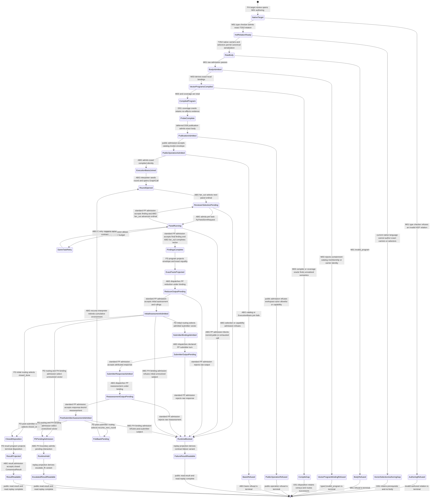

# M01/M03 Consensus GTL Free Construction Behavior Design

**Design verdict**: `accepted_target_blocked_on_vector_c_program_selection`
**Review status**: `fh_target_accepted`; bounded post-T-253 re-entry found the
next native-language prerequisite before body code
**Probe and runtime disposition**: body authoring is blocked on T-254's generic
GraphVector-to-declared-C-program selection relation; runtime remains blocked
on generic HOF/recursion/C-algebra realization
**Delivery phase**: DS-1 executable Consensus design probe
**Ticket**: [T-252](../../../../.ai-workspace/tickets/active/T-252-design-and-probe-consensus-gtl-free-construction.md)
**Owning modules**: M01 GTL language carriers and M03 semantic compilation
**Product authority**: `PRODUCT.md` bounded Consensus and atom criterion
**Requirement authority**: `REQ-P-CONSENSUS`, `REQ-L-GTL3-GRAPHFUNCTION`,
`REQ-L-GTL3-HOF`, `REQ-L-GTL3-RECURSE`, `REQ-L-GTL3-C-ALGEBRA`
**Negative calibration**: [M03_CONSENSUS_REJECTED_AS_BUILT_BEHAVIOR_DESIGN.md](./M03_CONSENSUS_REJECTED_AS_BUILT_BEHAVIOR_DESIGN.md)

## Boundary And Verdict

This design defines one lawful target GTL program shape and the effect-free
compiler probe used to discover what prevents that shape from executing today.
It does not design or authorize the missing generic language or runtime atoms.

T-253 closed the native typed HOF prerequisite. The published HOF API now
admits the exact `ReviewerAssignment -> ReviewFindings` child and explicit
`ReviewerAssignmentVector -> AttributedFindingsVector` relation, preserves it
through raw admission, and reports the absent generic runtime consumer as
`gtl-hof-unrealized-fan-out`. A handwritten name/tag, same-node lie, cast, or
`promote` workaround remains forbidden.

The complete target body is still not natively authorable. Its
C-program-executing transition GraphVectors require distinct declared C
programs, but
`abg.hog_program_catalog`, `abg.hog_program_ref`, and the current compiled plan
are GraphFunction-wide. No current native/raw/compiler carrier proves
`(GraphFunction, GraphVector) |- selected declared C`. T-254 owns that generic
relation. A global program, `operator.binding`, `abg.fn_composition`, opaque
configuration, name/tag inference, or helper-GraphFunction rewrite is not an
admissible substitute.

The prior implementation failed at the category boundary: a catalog
GraphFunction name selected an imperative Consensus plugin whose TypeScript
loop owned prompts, panel fan-out, round control, and closure. The lawful
replacement makes those relations visible as GTL data. ABG interprets the
admitted program; it does not contain a Consensus algorithm.

The decisive separation is:

```text
semantic verification round = recurse(graph_function, termination, foldback)
same-contract recovery       = C.retry(c, retryable_failure_budget)
```

`recurse_next_round` is a domain outcome. It is never a retryable transport or
malformed-output failure. The body uses `C.retry` only around one reviewer F_P
turn, with declared positive attempt budget `2` and the one standard
`RETRYABLE_RUNTIME_FAILURE_CLASS_VALUES` allowlist (`transport_failure`,
`no_output`, `contract_failure`). This is the probable malformed-F_P defensive
boundary and exercises the required generic retry atom without making retry the
round controller.

Two further authority separations are load-bearing:

1. the submitting actor identifies the subject submission but does not select
   or authorize the F_P submitter-response turn. That turn requires a separate
   declared role/worker-selection, instruction-contract, result-contract,
   capability, and configuration binding; and
2. `RoundOutcome` is internal round truth. The public outer GraphFunction
   target is `ConsensusResult`, which nests and cites the terminal and prior
   round outcomes. The current declaration's
   `contract://abg/consensus/round-outcome` target is insufficient and must not
   be preserved as the outer contract.

## Requirement Interpretation

| Requirement family | Design interpretation |
|---|---|
| `REQ-P-CONSENSUS-001..003` | One SYSTEM-owned published GraphFunction has an inline executable graph body. Profiles and overlays configure it but never replace it. |
| `-004..008A` | Invocation, panel, policy, findings, rulings, round outcome, and result remain typed contract data. This design names their relations; DS-4 publishes their final schemas. |
| `-009` | Explicit vector fan-out/fan-in and graph recursion/foldback are the constructive body. Prompts and policies are declaration refs. |
| `-010..012` | Ordinary GraphCall, frame, C-call, admission, replay, F_H, and ticket-read boundaries remain ABG-owned. Consensus returns data and never mutates a ticket. |
| `-013..015` | Workspace identity is one input binding. Current, alternate, and temporary roots are later applications of the same contract, not branches in this graph. |
| `-016..018` | Installed and live qualification is DS-4. DS-1 proves only body admission and the exact no-effects compiler census. |
| `-019` | No generic Review product, scheduler, watcher, recurrence, ticket mutation, or feature-specific engine law appears. |

## Irreducible Architectural Carrier Set

| Public prime carrier | Authority owner | Identity | Invariants | Consumer |
|---|---|---|---|---|
| `ConsensusGraphFunction` | M01 GTL module/catalog | `graph-function://abg/consensus/submitter-reviewer-rounds` | SYSTEM-owned, immutable, admitted, one exact outer input/output contract, inline executable graph | M03 semantic compiler, later catalog invocation |
| `ConsensusSubject` | `abg.schema.consensus-subject` | subject contract, ref, digest, submitting actor, panel, policy, submitter-turn, workspace refs | exact immutable reviewed subject and explicit invocation workspace | canonical GraphFunction input |
| `ConsensusPanel` | `abg.schema.consensus-panel` | panel ref/version | explicit non-empty ordered unique reviewer-profile refs; no fixed cardinality | panel expansion |
| `ConsensusReviewerProfile` | `abg.schema.consensus-reviewer-profile` | profile ref/version plus config digest | one profile-local role-or-worker-selection contract, instruction/result contracts, capabilities, and attribution are declared; the selected worker assignment derives backend and transport | one reviewer assignment |
| `ReviewFindings` | `abg.schema.review-findings` | reviewer invocation ref plus output digest | profile/config attribution, evidence, typed findings and residual/refusal | panel collection and semantic reducer |
| `ReviewRulings` | `abg.schema.review-rulings` | round/ref reduction identity | only the five closed ruling kinds; never ticket status | result and ticket projection |
| `ConsensusRoundPolicy` | `abg.schema.consensus-round-policy` | policy ref/version | positive semantic-round budget, convergence/disagreement/escalation/foldback law plus exact semantic-reducer and F_H-interaction binding refs; distinct from reviewer attempt budget | recursion termination and routing |
| `ConsensusRoundOutcome` | `abg.schema.consensus-round-outcome` | round ref plus outcome identity | exactly `closed_done`, `recurse_next_round`, or `escalate_fh`; recurse is internal, while escalate is replay-derived from ordinary F_H held truth | foldback and public result lineage |
| `ConsensusResult` | `abg.schema.consensus-result` | subject invocation plus terminal identity | closed is graph-success; escalated and contract-failure variants are replay-derived from held/blocked runtime truth | public result/read projection |
| `TicketConsensusProjection` | `abg.schema.ticket-consensus-projection` | ticket ref/digest plus result ref | read-only ticket-bound view; no status or mutation authority | agent/F_H TICKET_METHOD triage |

These public, versioned schema contracts are architecturally prime even when
their rows are carried inside another contract. Prime does not imply runtime
control authority. Existing GTL `Module`, `Graph`, `GraphFunction`, `Node`,
`GraphVector`, C-program, `GraphCall`, `Frame`, event, result, and replay
carriers remain owned by their existing modules and are not copied.

## Module-Local Prime And Subordinate Carriers

| Carrier or payload | Category | Governing join |
|---|---|---|
| `ConsensusRoundExecution` | module-local prime recursion input | same subject/panel/policy; positive ordinal; prior outcomes, dissent, residuals, evidence, lineage |
| `ReviewerAssignmentVector` | module-local prime GraphFunction boundary | round ref, panel ordinal, profile ref, homogeneous input/output contract |
| `AttributedFindingsVector` | module-local prime GraphFunction boundary | exact expected task cardinality, panel ordinal, profile/config identity |
| `RoundExactProjection` | module-local prime F_D output | membership, schema/digest, attribution, cardinality, exact row equality |
| `InitialSemanticAssessment` | module-local prime admitted F_P output | consumes exact projection plus attributed findings; can close, select the submitter turn, or select F_H, but cannot recurse |
| `PostSubmitterSemanticAssessment` | module-local prime admitted F_P output | consumes the admitted initial assessment and exact submitter-response ref; can close, recurse, or select F_H |
| `SubmitterResponse` | module-local prime admitted F_P output | round ref, submitting actor, disputed finding/ruling refs |
| `ConsensusRoundDisposition` | module-local prime recursion-output sum | `RoundClosedDisposition` carries `closed_done`; `RoundRecurseDisposition` requires `recurse_next_round` plus foldback; runtime blocked/held truth is outside this carrier |
| `FoldbackMaterial` | module-local prime recursion boundary | next ordinal, same subject/panel/policy, prior outcomes, dissent, residuals, evidence, lineage |
| `ReviewerAssignment` | subordinate vector element | ordinal, profile/config identity, profile-local execution-selection ref, shared assignment/findings outer contracts |
| `SemanticReducerBinding` | subordinate execution binding | role/worker-selection, config, instruction/result contracts, capabilities |
| `SubmitterTurnBinding` | subordinate execution binding | role/worker-selection, config, instruction/result contracts, capabilities |
| raw reviewer/reducer/submitter output | effect-edge-only payload | selected result contract; standard F_P admission before any prime result |

Module-local prime means irreducible at an internal GraphFunction or recursion
boundary; it does not mean public catalog visibility. No module-local carrier
may publish itself, emit events, choose an undeclared graph vector, open a
round, admit itself, or close Consensus.

## Domain Model

```mermaid
classDiagram
  class ConsensusGraphFunction {
    <<prime>>
    +canonicalRef
    +inlineGraphBody
    +declaredPrograms
  }
  class ConsensusSubject {
    <<prime>>
    +subjectContractRef
    +subjectRef
    +subjectDigest
    +panelRef
    +roundPolicyRef
    +submittingActorRef
    +submitterTurnBindingRef
    +workspaceRef
  }
  class ConsensusPanel {
    <<prime>>
    +panelRef
    +orderedProfileRefs
  }
  class ConsensusReviewerProfile {
    <<prime>>
    +profileRef
    +configDigest
    +reviewerExecutionSelectionRef
    +instructionContractRef
    +resultContractRef
    +capabilityRefs
  }
  class ReviewFindings {
    <<prime>>
    +profileRef
    +configDigest
    +invocationRef
    +outputDigest
    +evidenceRefs
    +typedFindings
    +typedResidualOrRefusal
  }
  class ReviewRulings {
    <<prime>>
    +rulingRows
    +sourceFindingRefs
    +closedRulingKinds
  }
  class ConsensusRoundPolicy {
    <<prime>>
    +policyRef
    +version
    +positiveRoundBudget
    +convergenceRuleRef
    +disagreementRuleRef
    +escalationRuleRef
    +foldbackContractRef
    +semanticReducerBindingRef
    +fhInteractionBindingRef
  }
  class ConsensusRoundOutcome {
    <<prime>>
    +roundRef
  }
  class RoundClosedDoneOutcome {
    <<prime>>
    +kind_closed_done
  }
  class RoundRecurseNextOutcome {
    <<prime>>
    +kind_recurse_next_round
  }
  class RoundEscalateFhOutcome {
    <<downstream>>
    +kind_escalate_fh
    +fhInteractionRef
  }
  class ConsensusResult {
    <<prime>>
    +subjectInvocationRef
    +panelRef
    +policyRef
    +roundRefs
    +priorRecurseOutcomeRefs
    +findingsAndRulingsRefs
    +consensusAndDissentClass
    +residualEvidenceLineageRefs
    +resultRef
    +replayRef
  }
  class ConsensusClosedResult {
    <<prime>>
    +terminalOutcome_closed_done
  }
  class ConsensusEscalatedResult {
    <<downstream>>
    +terminalOutcome_escalate_fh
    +fhInteractionRef
  }
  class ConsensusContractFailureResult {
    <<downstream>>
    +blockedInvocationRef
    +failureClass
    +failedCallEvidenceRefs
  }
  class TicketConsensusProjection {
    <<downstream>>
    +ticketRef
    +ticketDigest
    +consensusResultRef
  }
  class ConsensusRoundExecution {
    <<prime>>
    -invocationRef
    -subjectRef
    -subjectDigest
    -panelRef
    -policyRef
    -workspaceRef
    -submittingActorRef
    -semanticReducerBindingRef
    -submitterTurnBindingRef
    -fhInteractionBindingRef
    -roundOrdinal
    -priorRoundOutcomeRefs
    -dissentAndResidualRefs
    -evidenceAndLineageRefs
  }
  class ReviewerAssignment {
    <<subordinate>>
    -panelOrdinal
    -profileRef
    -reviewerExecutionSelectionRef
    -sharedInputContractRef
    -sharedOutputContractRef
  }
  class ReviewerAssignmentVector {
    <<prime>>
    -roundRef
    -orderedAssignments
  }
  class AttributedFindingsVector {
    <<prime>>
    -roundRef
    -expectedCardinality
    -memberIdentityDigest
    -orderedReviewFindingsRefs
  }
  class RoundExactProjection {
    <<prime>>
    -envelopeStatus
    -exactEqualityClasses
  }
  class SemanticRoundAssessment {
    <<prime>>
    -semanticAgreementOrDispute
    -dissentAndResidualRefs
  }
  class InitialSemanticAssessment {
    <<prime>>
    -phase_initial
    -initialAssessmentRef
  }
  class PostSubmitterSemanticAssessment {
    <<prime>>
    -phase_post_submitter
    -postAssessmentRef
    -submitterResponseRef
  }
  class ReviewOneProfile {
    <<prime>>
    -kind_GraphFunction
    -C_retry_budget_2
    -standardRetryAllowlist
  }
  class ReviewPanelFunction {
    <<prime>>
    -kind_GraphFunction
    -fan_out
  }
  class ExactPanelFactsFunction {
    <<prime>>
    -kind_GraphFunction
    -fan_in_reducer
  }
  class ConsensusRoundGraphFunction {
    <<prime>>
    -kind_GraphFunction
    -input_ConsensusRoundExecution
    -output_ConsensusRoundDisposition
  }
  class ReduceRound {
    <<subordinate>>
    -kind_C_program
    -fibre_F_P
  }
  class SubmitterResponse {
    <<prime>>
    -actorRef
    -turnInvocationRef
    -disputedRefs
  }
  class SubmitterResponseTurn {
    <<subordinate>>
    -kind_C_program
    -fibre_F_P
  }
  class ReassessRound {
    <<subordinate>>
    -kind_C_program
    -fibre_F_P
  }
  class InitialRoundRouting {
    <<subordinate>>
    -kind_evaluator_rules
    -fibre_F_D
    -closed_or_submitter_or_FH
  }
  class PostSubmitterRoundRouting {
    <<subordinate>>
    -kind_evaluator_rules
    -fibre_F_D
    -closed_or_recurse_or_FH
  }
  class FhPendingProgram {
    <<subordinate>>
    -kind_C_program
    -fibre_F_H
    -pendingInteractionAdmission
  }
  class SemanticReducerBinding {
    <<subordinate>>
    -bindingRef
    -roleRef
    -workerSelectionContractRef
    -configDigest
    -instructionContractRef
    -resultContractRef
    -capabilityRefs
  }
  class SubmitterTurnBinding {
    <<subordinate>>
    -bindingRef
    -roleRef
    -workerSelectionContractRef
    -configDigest
    -instructionContractRef
    -resultContractRef
    -capabilityRefs
  }
  class FhInteractionBinding {
    <<subordinate>>
    -bindingRef
    -subjectContractRef
    -interactionContractRef
    -resultContractRef
    -capabilityRefs
  }
  class RoundRecursionLaw {
    <<subordinate>>
    -terminationEvaluatorRef
    -foldbackBindingRef
    -requiresParentEvaluation
  }
  class FoldbackMaterial {
    <<prime>>
    -invocationRef
    -subjectRef
    -subjectDigest
    -panelRef
    -policyRef
    -workspaceRef
    -submittingActorRef
    -semanticReducerBindingRef
    -submitterTurnBindingRef
    -fhInteractionBindingRef
    -nextRoundOrdinal
    -priorOutcomeRefs
    -dissentResidualEvidenceLineage
  }
  class ConsensusRoundDisposition {
    <<prime>>
    -roundRef
  }
  class RoundClosedDisposition {
    <<prime>>
    -outcome_closed_done
  }
  class RoundRecurseDisposition {
    <<prime>>
    -outcome_recurse_next_round
    -foldbackMaterialRef
  }
  class ProjectResult {
    <<subordinate>>
    -kind_C_program
    -fibre_F_D
    -terminalDispositionToResult
  }
  class SameContractRetryPolicy {
    <<subordinate>>
    -standardAllowlistRef
    -attemptBudget_2
  }
  class AbgRuntime {
    <<authoritative>>
    +GraphCall
    +Frame
    +CCall
    +admission
    +eventsAndReplay
  }
  class Ds1CompilerProbe {
    <<downstream>>
    -canonicalBodyDigest
    -pathAddressedTermManifest
    -compilerDiagnostics
    -runtimeConsumerCensus
  }
  class StandardFpAdmission {
    <<authoritative>>
    +selectedResultContract
    +typedNonCloseFailure
  }
  class RawFpOutput {
    <<effect-edge>>
    -producerKind
    -selectedResultContractRef
    -payloadRef
  }
  class NativeHofAuthoring {
    <<authoritative>>
    +hofContract(memberNode)
    +hofVector(vectorNode member)
    +hofUnaryRef(child input output)
    +fan_out(child boundaries_over_into)
  }
  class HofApplicationDeclaration {
    <<prime>>
    +syntaxVersion
    +relationRef
    +operatorKind_fan_out
    +childGraphFunctionRef
    +inputMemberNodeRef
    +inputMemberContractKey
    +outputMemberNodeRef
    +outputMemberContractKey
    +inputVectorNodeRef
    +inputVectorContractKey
    +outputVectorNodeRef
    +outputVectorContractKey
    +wrapperGraphVectorRef
    +whollySuccessfulOrdinalLaw
    +whollySuccessfulCardinalityLaw
  }
  class GraphFunctionProgramCatalog {
    <<prime>>
    +hostGraphFunctionRef
    +declaredCProgramsByRef
  }
  class GraphVectorProgramSelectionDeclaration {
    <<subordinate absent relation>>
    +declarationKey_abg_hog_program_ref
    +hostGraphVectorRef
    +selectedProgramRef
  }
  class CompiledGraphVectorCProgramBinding {
    <<downstream absent relation>>
    +hostGraphFunctionRef
    +hostGraphVectorRef
    +selectedProgramRef
    +orderedSourceNodeContractKeys
    +targetNodeContractKey
    +programInputCarrierRef
    +programOutputCarrierRef
  }
  class VectorProgramSelectionAuthoring {
    <<authoritative missing boundary>>
    +deriveCanonicalNodeInterfaceCarriers
    +declareExistingSelectorRef
  }
  class M01RawGtlAdmission {
    <<authoritative>>
    +rawProgramAdmission
  }
  class M03SemanticCompiler {
    <<authoritative>>
    +compileAdmittedProgram
  }
  class DeferredDs4Publication {
    <<downstream>>
    +publishExactBodyAndContracts
  }
  class AbgCli {
    <<downstream>>
    +renderPublicOperationResults
  }
  class PublicSdk {
    <<downstream>>
    +delegatePublicOperations
  }
  class PublicOperationAdmission {
    <<authoritative>>
    +workspaceActorAllowlistCapabilityAdmission
  }
  class CatalogModuleBodyResolver {
    <<authoritative>>
    +resolveCatalogModuleAndBody
  }
  class ExecutionBasisJoin {
    <<authoritative>>
    +admitCompiledRuntimeIdentity
  }
  class OrdinaryFhBoundary {
    <<authoritative>>
    +admitPendingInteraction
  }
  class FpTransformRequest {
    <<authoritative>>
    +requestRef
    +actorInvocationId
    +dispatchRef
    +workerId
    +backendId
  }

  ConsensusClosedResult --|> ConsensusResult
  ConsensusEscalatedResult --|> ConsensusResult
  ConsensusContractFailureResult --|> ConsensusResult
  RoundClosedDoneOutcome --|> ConsensusRoundOutcome
  RoundRecurseNextOutcome --|> ConsensusRoundOutcome
  RoundEscalateFhOutcome --|> ConsensusRoundOutcome
  InitialSemanticAssessment --|> SemanticRoundAssessment
  PostSubmitterSemanticAssessment --|> SemanticRoundAssessment
  ConsensusGraphFunction --> ConsensusSubject : input contract
  ConsensusGraphFunction --> ConsensusResult : output contract
  ConsensusGraphFunction --> ConsensusRoundGraphFunction : workflow C of recurse
  ConsensusSubject "1" --> "1" ConsensusPanel : selects
  ConsensusSubject "1" --> "1" ConsensusRoundPolicy : selects
  ConsensusSubject "1" --> "1" SubmitterTurnBinding : selects separately from actor
  ConsensusRoundPolicy "1" --> "1" SemanticReducerBinding : selects evaluator binding
  ConsensusRoundPolicy "1" --> "1" FhInteractionBinding : selects FH binding
  ConsensusPanel "1" o-- "1..*" ConsensusReviewerProfile : ordered members
  ConsensusRoundExecution --> ReviewerAssignmentVector : expands by panel ordinal
  ReviewerAssignmentVector "1" *-- "1..*" ReviewerAssignment : ordered members
  ReviewerAssignment --> ConsensusReviewerProfile : carries exact profile selection
  ReviewerAssignment "1" --> "1" ReviewOneProfile : fan_out over
  AbgRuntime --> FpTransformRequest : resolves profile selection per task
  FpTransformRequest --> ReviewOneProfile : dispatches attributed task
  ReviewOneProfile --> ReviewPanelFunction : lifted by fan_out
  ReviewOneProfile --> RawFpOutput : raw reviewer output
  RawFpOutput --> StandardFpAdmission : selected contract admission
  StandardFpAdmission --> ReviewFindings : admits reviewer result
  AttributedFindingsVector "1" o-- "1..*" ReviewFindings : collected by ordinal
  AttributedFindingsVector --> ExactPanelFactsFunction : fan_in over
  ExactPanelFactsFunction --> RoundExactProjection : FD envelope and exact equality
  RoundExactProjection --> ReduceRound : supplies facts
  SemanticReducerBinding --> ReduceRound : authorizes FP turn
  ReduceRound --> RawFpOutput : raw semantic assessment
  StandardFpAdmission --> InitialSemanticAssessment : admits initial reduction
  StandardFpAdmission --> ReviewRulings : admits ruling rows
  InitialSemanticAssessment --> ReviewRulings : proposes initial rulings
  InitialSemanticAssessment --> InitialRoundRouting : declared initial routing input
  InitialRoundRouting --> RoundClosedDoneOutcome : admitted closed route
  InitialRoundRouting --> SubmitterResponseTurn : material dispute and budget remains
  InitialRoundRouting --> FhPendingProgram : unresolved or exhausted vector
  SubmitterTurnBinding --> SubmitterResponseTurn : authorizes FP turn
  SubmitterResponseTurn --> RawFpOutput : raw submitter response
  StandardFpAdmission --> SubmitterResponse : admits response
  SubmitterResponse --> ReassessRound : declared reassessment input
  SemanticReducerBinding --> ReassessRound : authorizes FP turn
  ReassessRound --> RawFpOutput : raw reassessment
  StandardFpAdmission --> PostSubmitterSemanticAssessment : admits reassessment with response ref
  PostSubmitterSemanticAssessment --> ReviewRulings : proposes post-submitter rulings
  PostSubmitterSemanticAssessment --> PostSubmitterRoundRouting : declared post-submitter routing input
  PostSubmitterRoundRouting --> RoundClosedDoneOutcome : admitted closed route
  PostSubmitterRoundRouting --> RoundRecurseNextOutcome : admitted recurse route
  PostSubmitterRoundRouting --> FhPendingProgram : unresolved or exhausted vector
  FhInteractionBinding --> FhPendingProgram : binds subject and interaction
  RoundClosedDisposition --|> ConsensusRoundDisposition
  RoundRecurseDisposition --|> ConsensusRoundDisposition
  RoundClosedDoneOutcome --> RoundClosedDisposition : closed_done only
  RoundRecurseNextOutcome --> RoundRecurseDisposition : recurse_next_round only
  FoldbackMaterial --> RoundRecurseDisposition : required payload
  ConsensusRoundExecution --> ConsensusRoundGraphFunction : recursive input
  ConsensusRoundGraphFunction --> ConsensusRoundDisposition : recursive output
  RoundRecurseDisposition --> RoundRecursionLaw : recurse variant only
  RoundRecursionLaw --> ConsensusRoundExecution : foldback rebind
  RoundClosedDisposition --> ProjectResult : closed variant only
  ProjectResult --> ConsensusClosedResult : final graph projection
  ConsensusResult --> TicketConsensusProjection : read-only projection
  ReviewOneProfile --> SameContractRetryPolicy : mandatory same-call recovery
  ConsensusGraphFunction --> NativeHofAuthoring : must type before body exists
  NativeHofAuthoring --> HofApplicationDeclaration : produces sole structural HOF relation
  HofApplicationDeclaration --> ReviewPanelFunction : governs exact wrapper
  ConsensusGraphFunction --> GraphFunctionProgramCatalog : owns declared programs
  ConsensusGraphFunction --> VectorProgramSelectionAuthoring : requires authored carriers and selectors before serialization
  VectorProgramSelectionAuthoring --> GraphVectorProgramSelectionDeclaration : emits existing scalar selector
  GraphVectorProgramSelectionDeclaration --> GraphFunctionProgramCatalog : names candidate member resolved only by M03
  VectorProgramSelectionAuthoring --> M01RawGtlAdmission : serializes canonical declarations
  M01RawGtlAdmission --> M03SemanticCompiler : admits root and reachable declarations
  M03SemanticCompiler --> CompiledGraphVectorCProgramBinding : validates containment catalog and boundary then derives exact join
  M03SemanticCompiler --> Ds1CompilerProbe : supplies diagnostics and compiled identity
  ConsensusGraphFunction --> Ds1CompilerProbe : coverage subject remains unchanged
  Ds1CompilerProbe ..> AbgRuntime : reads consumer inventory only
  DeferredDs4Publication --> CatalogModuleBodyResolver : publishes exact admitted body
  AbgCli --> PublicSdk : delegates operation
  PublicSdk --> PublicOperationAdmission : submits envelope
  PublicOperationAdmission --> AbgRuntime : admits operation
  AbgRuntime --> CatalogModuleBodyResolver : resolves callable body
  AbgRuntime --> ExecutionBasisJoin : admits execution basis
  FhPendingProgram --> OrdinaryFhBoundary : submits pending interaction
  OrdinaryFhBoundary --> AbgRuntime : returns held runtime truth
  ConsensusGraphFunction --> AbgRuntime : interpreted by
  AbgRuntime --> ConsensusContractFailureResult : replay-derived blocked read
  AbgRuntime --> ConsensusEscalatedResult : replay-derived held read
  AbgRuntime --> RoundEscalateFhOutcome : derives from held truth
```



Domain invariants:

1. `ReviewerAssignmentVector` and `AttributedFindingsVector` preserve panel ordinal and
   profile identity. Completion order is never semantic order.
2. `RoundRecursionLaw` alone owns `recurse_next_round` re-entry.
3. `SameContractRetryPolicy` is mandatory around one reviewer call, but cannot
   reference a round outcome or mint a `ConsensusRoundExecution`.
4. `ConsensusResult` cites prior `recurse_next_round` outcomes but never marks
   one terminal. `closed_done` is the only graph-success terminal outcome.
   `escalate_fh` and contract failure are separate replay-derived public read
   variants over ABG held/blocked truth, not graph-success values or invented
   round outcomes.
5. `submittingActorRef` and `SubmitterTurnBinding` are separate joins. Neither
   the CLI caller nor the current agent is an implicit worker-selection rule.
6. F_D supplies envelope and exact-equality facts only. F_P owns semantic
   agreement, dispute, dissent, and ruling judgment.
7. `ConsensusRoundExecution -> ConsensusRoundDisposition` is the one
   graph-success outer interface preserved by `recurse`. Only `closed_done`
   reaches `ProjectResult`; `recurse_next_round` reaches foldback, while an F_H
   pending call holds outside this output interface.
8. Reviewer, reducer, submitter-response, and reassessment F_P outputs all
   cross `StandardFpAdmission` before becoming prime carriers or routing truth.
9. The native HOF input/output relation must type before a body exists. The
   compiler probe cannot turn an authoring failure into a semantic gap by
   handcrafting an equivalent-looking GraphFunction.
10. F_D may select the F_H vector, but the ordinary F_H call holds the graph.
    Replay/read projection alone derives `escalate_fh` and the interaction ref;
    no downstream graph vector runs after the pending call.
11. `RoundClosedDisposition` cannot carry foldback, and
    `RoundRecurseDisposition` requires it. Native discriminated variants reject
    closed-plus-foldback and recurse-without-foldback before raw admission.
12. The public round-outcome contract is also a discriminated family: exactly
    one of closed, recurse, or replay-derived F_H escalation exists for a round.
13. Each reviewer profile owns its own role-or-worker-selection contract.
    Ordinary ABG selection resolves that contract to the task's runtime-owned
    `FpTransformRequest`, from which worker/backend and downstream transport
    are derived. The panel, subject, caller, and
    CLI cannot inject one shared agent contract, and GTL cannot select an
    independent backend or transport beside the worker assignment. Different
    profiles may therefore resolve to different admitted worker implementations
    without adding Consensus-specific dispatch law.
14. `ReviewerAssignment` carries only authored profile and selection-contract
    identity. `FpTransformRequest` is ABG runtime truth created after selection;
    its concrete worker, backend, dispatch, and transport identities never
    enter the GTL graph carrier. DS-1 declares this target join but does not
    claim the current one-basis runtime can yet vary it per panel task.
15. Initial and post-submitter semantic assessments are distinct native types.
    Only `PostSubmitterSemanticAssessment`, joined to the exact admitted
    `SubmitterResponse`, can reach `recurse_next_round`; an initial assessment
    cannot bypass the submitter turn and type a foldback disposition.
16. The T-253 HOF relation is one hosted `HofApplicationDeclaration`; exact
    child, member, vector, wrapper, ordinal, and wholly-successful cardinality
    joins are structural authority. Names and tags are not.
17. `GraphVectorProgramSelectionDeclaration` is the missing authored relation
    for C-program-executing transition vectors.
    `CompiledGraphVectorCProgramBinding` is derived compiler truth, not a second
    selector. Program definitions and catalogs remain on the containing
    GraphFunction; `abg.fn_composition` remains separate regime/closure
    governance and cannot select a C program. The structural T-253 HOF wrapper
    remains declaration-empty and is governed by the host
    `gtl.hof_application` relation instead.
18. The canonical public GraphFunction has exactly one input Node for
    `ConsensusSubject` and one output Node for `ConsensusResult`. Panel, profile,
    policy, actor, workspace, and binding identities are fields reached from the
    subject and then carried cumulatively; they are not extra public inputs.

## Exact GTL Body Topology

The canonical body has one module root. Only boundaries that require reuse,
higher-order application, or recursion are GraphFunctions. Vector-local
transforms remain declared C programs, evaluators, and rules. None of the
module-local functions is a separately published catalog row, and the design
does not publish the reserved `gtl://abg/review/*` declarations as a generic
Review product.

This remains the accepted target topology, not a claim that canonical body
bytes exist. T-253 can now construct the exact fan-out host. Body construction
still stops before raw serialization because the current language cannot bind
the distinct vector-local programs below to their C-program-executing
transition GraphVectors.

| GraphFunction boundary | Input -> output | Why it is a GraphFunction |
|---|---|---|
| canonical Consensus | `ConsensusSubject -> ConsensusResult` | sole public callable carrier; inline graph owns seed, recursive lift, and terminal projection vectors |
| `consensus.round` | `ConsensusRoundExecution -> ConsensusRoundDisposition` | recursion preserves this exact success interface for closed/recurse; ordinary runtime blocked or F_H-held truth stops outside it |
| `consensus.review-one-profile` | `ReviewerAssignment -> ReviewFindings` | reusable per-element function consumed by `fan_out`; its one vector carries `C.retry(C.of(F_P), 2)` and ordinary ABG result admission |
| `consensus.exact-panel-facts` | `AttributedFindingsVector -> RoundExactProjection` | explicit deterministic vector reducer consumed by `fan_in` |
| derived `fan_out(consensus.review-one-profile)` | `ReviewerAssignmentVector -> AttributedFindingsVector` | exact T-253 typed relation lifted into the round only by `workflow.C`; any task failure remains ordinary ABG blocked truth; current runtime absence is retained by the compiler |
| derived `fan_in(consensus.exact-panel-facts)` | `AttributedFindingsVector -> RoundExactProjection` | higher-order exact-fact reduction lifted into the round only by `workflow.C` |
| derived `recurse(consensus.round)` | `ConsensusRoundExecution -> ConsensusRoundDisposition` | bounded semantic rounds with declared termination and foldback |

| Vector-local declaration | Input -> output | Owner and law |
|---|---|---|
| seed-round C program | `ConsensusSubject -> ConsensusRoundExecution` | F_D admits exact subject, panel, policy, actor, bindings, workspace, and round 1 |
| expand-panel C program | `ConsensusRoundExecution -> ReviewerAssignmentVector` | F_D expands the admitted panel in stable ordinal order |
| semantic-reduction C program | `RoundExactProjection + AttributedFindingsVector -> InitialSemanticAssessment + ReviewRulings` | one F_P leaf selected by `SemanticReducerBinding`; raw output crosses standard admission |
| submitter-response C program | `InitialSemanticAssessment -> SubmitterResponse` | one F_P leaf selected by `SubmitterTurnBinding`; raw output crosses standard admission |
| semantic-reassessment C program | `InitialSemanticAssessment + SubmitterResponse -> PostSubmitterSemanticAssessment + ReviewRulings` | one F_P leaf selected by `SemanticReducerBinding`; raw output crosses standard admission and must retain the exact response ref |
| initial-round routing evaluator/rules | admitted `InitialSemanticAssessment` plus round policy `-> closed outcome, selected submitter vector, or selected F_H vector` | F_D cannot route initial assessment directly to recurse |
| post-submitter routing evaluator/rules | admitted `PostSubmitterSemanticAssessment` plus round policy `-> closed/recurse outcome or selected F_H vector` | F_D routes already-admitted semantic truth and never mints human-stop truth |
| F_H pending-interaction C program | selected unresolved/exhausted vector `-> runtime held stop` | ordinary F_H boundary admits pending interaction and stops traversal; replay/read projection later derives `escalate_fh` |
| project-result C program | `closed_done ConsensusRoundDisposition -> ConsensusClosedResult` | F_D runs only after recursive closed termination; held/blocked paths never reach it; no ticket mutation |

Canonical topology notation:

```text
review_panel: GraphFunction<ReviewerAssignmentVector, AttributedFindingsVector> = fan_out(
  review_one_profile,
  over = ReviewerAssignmentVector,
  into = AttributedFindingsVector
)

round_graph = Graph {
  round -> reviewer_assignments       by expand_panel
  reviewer_assignments -> findings   by workflow.C(review_panel) when all results admit
  findings -> exact_facts             by workflow.C(fan_in(exact_panel_facts, over = AttributedFindingsVector))
  exact_facts + findings -> raw_initial_assessment by reduce_round under SemanticReducerBinding
  raw_initial_assessment -> initial_assessment by standard FP result admission
  initial_assessment -> closed_outcome when admitted agreement
  initial_assessment -> raw_submitter_reply by submitter_response under SubmitterTurnBinding when dispute and budget remains
  initial_assessment -> fh_vector      when admitted unresolved or exhausted
  raw_submitter_reply -> submitter_reply by standard FP result admission
  initial_assessment + submitter_reply -> raw_post_assessment by reassess_round under SemanticReducerBinding
  raw_post_assessment -> post_submitter_assessment by standard FP result admission with submitter response ref
  post_submitter_assessment -> closed_outcome when admitted agreement
  post_submitter_assessment -> fh_vector when admitted unresolved or exhausted
  post_submitter_assessment -> recurse_outcome when admitted next-round disposition
  fh_vector -> runtime_held           by ordinary FH pending interaction admission
  closed_outcome -> round_disposition with terminal outcome
  recurse_outcome -> round_disposition with foldback material
}

round = GraphFunction(
  ConsensusRoundExecution -> ConsensusRoundDisposition,
  inline_graph = round_graph
)

bounded_rounds = recurse(
  round,
  termination = closed_done,
  foldback = {
    mode: rebind,
    binding: binding://abg/consensus/next-round,
    requiresParentEvaluation: true
  }
)

consensus_graph = Graph {
  subject -> first_round              by seed_round C program
  first_round -> closed_disposition   by workflow.C(bounded_rounds)
  closed_disposition -> result        by project_result C program
}

Consensus = GraphFunction(
  ConsensusSubject -> ConsensusResult,
  inline_graph = consensus_graph
)
```

DS-1 freezes the exact scalar member Nodes, vector Nodes, schema refs,
`nodeContractKey` values, child GraphFunction ref, wrapper ref, HOF relation ref,
and host GraphFunction identity used by this body. Native serialization and raw
module admission include the scalar reviewer child and derived fan-out host
exactly once so M03 resolves one child authority. DS-4 may publish the schema
bodies and catalog rows for those identities; it may not alter an
identity-bearing Node contract without changing the canonical body digest and
re-entering this design.

The alternatives are admitted `GraphVector` plus evaluator/rule declarations.
They may not become an `if` in an adapter or service. On no material dispute,
the F_P reducer admits an `InitialSemanticAssessment` with agreement and the
round proceeds to a closed outcome. On a material dispute while policy permits
another round, the submitter response becomes admitted attributed F_P input
before a separately admitted `PostSubmitterSemanticAssessment`. Only that
post-submitter type can select `recurse_next_round`; the initial type has no
native relation to recurse or foldback.
Unresolved or exhausted truth takes the F_H vector. F_D supplies only
envelope and exact-equality facts and routes already-admitted semantic truth.
It may select the F_H vector, but the ordinary F_H pending-interaction C-call
holds traversal rather than returning graph-success data. Replay/read projection
derives `escalate_fh` and the interaction ref from that admitted held truth.

Every internal `ConsensusRoundOutcome` is retained by identity inside the
round/result lineage, but only `ConsensusResult` crosses the outer target
contract. A `recurse_next_round` outcome is nonterminal and appears only in the
prior-round lineage of the eventual result. The terminal outcome is
`closed_done` or `escalate_fh`. A retry-exhausted, malformed, or nonretryable
review result takes the existing ABG C-call blocked path and does not become a
round disposition, fourth round outcome, or fan-in value. `recurse` preserves
`ConsensusRoundExecution -> ConsensusRoundDisposition` only on graph-success
paths; only after it returns `closed_done` does `project-result` create
`ConsensusClosedResult`. Public escalated and contract-failure variants are
instead replay-derived read projections over held and blocked invocations. The
existing declared nameplate must be reconciled from
`contract://abg/consensus/round-outcome` to the canonical result contract when
the body is later published; DS-1 records this join and does not publish it.

### C-Program Placement

Each C-program-executing transition GraphVector selects a declared C program.
The T-253 structural HOF wrapper is not such a transition: its vector
declarations stay empty and its host `gtl.hof_application` declaration owns the
structural relation. Deterministic seed,
expansion, exact-envelope/equality projection, routing, and result projection
are ordinary `C.of`/flat `C.compose` programs. Semantic reduction, reviewer,
submitter, and reassessment turns are F_P `C.of` leaves with declared
role/worker, instruction, and result-contract refs. Their raw outputs remain
effect-edge data until the standard ABG F_P result-admission boundary returns
the corresponding prime carrier.

The selected program and the vector-local `abg.fn_composition` contract are
different authorities. `abg.hog_program_ref` selects one program from the
containing GraphFunction's catalog. `abg.fn_composition` selects the regime,
carrier, assurance, and closure-governance contract for the vector boundary.
Neither may be inferred from the other.

The current published declaration host law permits `abg.hog_program_ref` only
on `GraphFunction`, and the current execution-declaration compiler receives
only that GraphFunction. T-254 must retain the program catalog on the containing
function, admit the existing selector key on a C-program-executing transition
GraphVector, derive its C input/output carriers from the exact ordered Node
interfaces, and let M03 derive one exact binding over function ref, vector ref,
program ref, ordered source-node contracts, target-node contract, and program
input/output carriers. Missing, duplicate, unresolvable, or mismatched bindings
are invalid programs. A valid binding remains `semantic_not_realized` until a
separately designed runtime handoff consumes vector-indexed compiled selection.

Named child GraphFunctions enter a parent vector only through `workflow.C`.
The explicit reviewer vector is graph-level `fan_out`; its M03 execution
mapping may lawfully use `C.batch` only if the compiler proves the relation
between panel ordinal, task identity, task carrier pair, and one spine/result
judgment per task. Current `C.batch(tasks, batchRef)` accepts an authored
ordered term family but carries no admitted data-vector binding by itself. The
probe must expose that relation as present or missing; it must not hard-code
two reviewer terms to make compilation pass.

The reviewer program is exactly one same-contract retry wrapper:

```text
review_one_profile_program = C.retry(
  C.of(invoke_attributed_reviewer, F_P, result_bearing),
  budget = 2
)
```

The allowlist is the single ABG-owned
`RETRYABLE_RUNTIME_FAILURE_CLASS_VALUES` home: `transport_failure`,
`no_output`, and `contract_failure`. Authentication, missing capability,
unresolved worker selection, semantic dissent, and `recurse_next_round` are not
retryable by this term. Exhaustion or a nonretryable failure produces the
existing ABG C-call blocked path and never enters panel fan-in or graph-success
output.
Instruction assembly, transport, and response decoding are the standard F_P
handler interior selected by the reviewer profile. ABG result admission remains
outside that interior and judges every attempt before `C.retry` may re-enter the
same leaf. The design does not split those standard boundaries into extra
C-call spines or make an `admit` C stage a second truth authority.

`fan_out` describes graph topology. T-253 now authors and compiles the exact
`ReviewerAssignmentVector -> AttributedFindingsVector` relation through
`hofContract`, `hofVector`, `hofUnaryRef`, and
`fan_out(child, {over, into})`. The derived host carries one canonical
`gtl.hof_application` declaration and owns one wrapper GraphVector. Its generic execution must
lower by an explicit type-preserving projection to `C.batch`, preserving one
ordered task/spine per panel ordinal. A separate HOF scheduler or interpreter
would not exercise the retained `C.batch` atom and would create competing
execution ownership. Name/tag recognition is not proof. The target relation is
`ReviewerAssignmentVector -> AttributedFindingsVector`.
The pre-T-253 same-node facade is retired. A `promote` workaround remains
forbidden because promotion cannot turn assignments into findings or failure
truth. The unchanged Consensus body exercises the
`C.batch` requirement through the mandatory vector-to-task projection without
encoding a fixed two-reviewer tuple. The current typed compiler result is
`semantic_not_realized`; it is the runtime gap, not an authoring gap.

`fan_in` is deterministic only for
`AttributedFindingsVector -> RoundExactProjection`. The separate F_P
`consensus.reduce-round` consumes that projection plus the carried findings to
produce `InitialSemanticAssessment` and `ReviewRulings`; after an admitted
submitter response, `consensus.reassess-round` produces the distinct
`PostSubmitterSemanticAssessment` and updated rulings. The semantic reducer is
not the `fan_in` reducer.

### Cumulative Environment Contract

| GraphFunction | `environment.requires` | `environment.provides` | `environment.carries` |
|---|---|---|---|
| canonical Consensus | exactly one `ConsensusSubject`; panel, profile, policy, actor, workspace, catalog, semantic-reducer, submitter-turn, and F_H-interaction refs are fields reached from that subject | exactly one `ConsensusResult` | subject/panel/policy identities, submitting actor, workspace, findings, rulings, all round outcomes, dissent, residuals, evidence, lineage |
| `consensus.round` | `ConsensusRoundExecution` with current ordinal and all cumulative carried refs | exactly one graph-success `ConsensusRoundDisposition` containing `closed_done` or `recurse_next_round` plus applicable foldback; runtime blocked/F_H-held truth stops outside this interface | prior round outcomes including recurse, admitted findings/rulings, dissent, residuals, submitter responses, evidence, lineage |
| `consensus.review-one-profile` | one assignment plus exact profile and result/instruction contracts | one admitted `ReviewFindings` or typed retry/failure judgment | subject/round/task/profile/config/actor identities and evidence lineage |
| `consensus.reduce-round` | exact facts, attributed findings, and `SemanticReducerBinding` | admitted `InitialSemanticAssessment` and `ReviewRulings` only after standard F_P admission | round/profile identities, dissent, residuals, evidence, lineage |
| `consensus.reassess-round` | exact initial assessment, exact admitted submitter response, findings, facts, and `SemanticReducerBinding` | admitted `PostSubmitterSemanticAssessment` carrying the response ref plus updated `ReviewRulings` | round/profile/response identities, dissent, residuals, evidence, lineage |
| `consensus.project-result` | `closed_done ConsensusRoundDisposition` after recursive termination | `ConsensusClosedResult` | every prior round outcome and cumulative findings/rulings/dissent/residual/evidence/lineage ref |

Foldback is cumulative and immutable: the next round adds the current outcome,
dissent, residual, evidence, and lineage refs while preserving the exact
subject, panel, policy, workspace, and submitting actor. It never reconstructs
prior state from a prompt or controller-local array.

## Execution Sequence

```mermaid
sequenceDiagram
  actor Author
  actor Caller
  participant Native as M01 Typed HOF Authoring
  participant VectorC as M01 Vector C Program Selection
  participant M01 as M01 Raw GTL Admission
  participant M03 as M03 Semantic Compiler
  participant Coverage as DS1 Coverage Oracle
  participant Publication as Deferred DS4 Publication
  participant CLI as Thin abg.cli
  participant SDK as Public SDK
  participant Public as Public Operation Admission
  participant Catalog as Catalog Module Body Resolver
  participant Basis as ExecutionBasis Join
  participant Runtime as ABG Runtime
  participant Round as Consensus Round Graph
  participant FanOut as GTL fan_out
  participant Reviewer as Review One Profile GF
  participant Admission as Standard FP Result Admission
  participant FanIn as GTL fan_in Exact Collector
  participant Reducer as Vector Local FP C Program
  participant Submitter as Vector Local Submitter FP C Program
  participant Reassessor as Vector Local Reassessment FP C Program
  participant Project as Vector Local Result FD C Program
  participant FH as Ordinary FH Boundary

  Author->>Native: construct assignment vector to findings vector fan_out relation
  alt exact member vector or child relation is malformed
    Native-->>Author: typed authoring refusal, no canonical body exists
  else T-253 exact target relation is admitted
    Author->>VectorC: derive canonical interface carriers and declare each transition vector selector
    alt current native host or carrier law cannot represent the declarations
      VectorC-->>Author: blocking T-254 authoring gap, no canonical body exists
    else canonical selector and C-program declarations exist
      VectorC->>M01: canonical serialized Consensus module root
      alt malformed or category-invalid GTL
        M01-->>Author: typed invalid_program diagnostics
      else raw body admitted
        M01->>M03: admitted root and reachable declarations
        M03->>M03: validate each local selector against containment catalog membership and exact Node-interface carriers
        alt T-254 relation is invalid
          M03-->>Author: typed vector-program invalid_program diagnostic, no effects
        else exact bindings are compiler-visible
          M03->>Coverage: root result plus path-addressed subprobes
          Coverage->>Coverage: compare relied-on constructors with runtime consumers or proved projections
          alt semantic diagnostics or silently accepted declarations
            Coverage-->>Author: exact blocking gap census, no effects
          else executable coverage is total
            Coverage-->>Author: no-effects compile evidence, body remains non-published
            opt deferred DS4 after generic atoms contracts and publication gates close
              Publication->>Catalog: publish exact admitted body schemas and catalog row
              Caller->>CLI: catalog.invoke request and explicit workspace root
              CLI->>SDK: abg.operation.catalog.invoke
              SDK->>Public: request workspace context session allowlist actor capability
              Public->>Runtime: admitted catalog.invoke operation
              Runtime->>Catalog: resolve exact workspace product module and body
              Catalog-->>Runtime: admitted catalog row module and body identity
              Runtime->>Basis: exact compiled program schema allowlist capability identities
              Basis->>Runtime: admitted ExecutionBasis with compiled program identity
              loop declared GTL recurse while prior disposition is recurse_next_round
                Runtime->>Round: open GraphCall and round frame
                Round->>FanOut: explicit ordered ReviewerAssignmentVector
                loop panel ordinal, not completion order
                  FanOut->>Runtime: resolve this profile reviewerExecutionSelectionRef
                  alt profile selection refuses or lacks capability
                    Runtime->>Runtime: ordinary C-call blocked truth, no reviewer transport
                  else worker assignment admitted
                    Runtime->>Reviewer: one attributed task with backend and transport derived from assignment
                    Reviewer->>Admission: raw FP output plus selected result contract
                    alt retryable standard failure and budget remains
                      Admission-->>Runtime: typed same-contract retry judgment
                      Runtime->>Reviewer: C.retry same task under budget 2
                    else nonretryable or retry exhausted
                      Admission-->>Runtime: ordinary C-call blocked truth, no graph value
                    else admitted finding set
                      Admission-->>FanOut: profile and config digest bound ReviewFindings
                    end
                  end
                end
                alt any reviewer C-call is blocked
                  Runtime->>Runtime: stop graph invocation, no fan_in or round disposition
                else complete attributed findings vector
                  FanOut->>FanIn: ordered AttributedFindingsVector
                  FanIn->>FanIn: FD envelope and exact-row-equality facts only
                  FanIn->>Reducer: exact facts findings and SemanticReducerBinding
                  Reducer->>Admission: raw semantic assessment and ruling rows
                  alt reducer output malformed or unattributed
                    Admission-->>Runtime: ordinary C-call blocked truth, no round disposition
                  else initial semantic assessment admitted
                    Admission-->>Round: admitted InitialSemanticAssessment and ReviewRulings
                    alt admitted semantic agreement
                      Round-->>Runtime: closed_done ConsensusRoundDisposition
                    else admitted semantic dispute and budget remains
                      Round->>Submitter: disputed refs and SubmitterTurnBinding
                      Submitter->>Admission: raw attributed submitter response
                      alt submitter output malformed or unattributed
                        Admission-->>Runtime: ordinary C-call blocked truth, no round disposition
                      else submitter response admitted
                        Admission->>Reassessor: admitted response facts findings and SemanticReducerBinding
                        Reassessor->>Admission: raw semantic reassessment and ruling rows
                        alt reassessment output malformed or unattributed
                          Admission-->>Runtime: ordinary C-call blocked truth, no round disposition
                        else post-submitter assessment admitted with exact response ref
                          Admission-->>Round: admitted PostSubmitterSemanticAssessment and ReviewRulings
                          alt agreement reached
                            Round-->>Runtime: closed_done ConsensusRoundDisposition
                          else another verification round required
                            Round-->>Runtime: recurse_next_round disposition with FoldbackMaterial
                          else unresolved judgment
                            alt FH interaction binding refuses
                              Round-->>Runtime: typed blocked truth before FH call
                            else FH binding admitted
                              Round->>FH: exact invocation round subject and FhInteractionBinding
                              FH-->>Runtime: GraphCall held pending FH, no graph disposition
                            end
                          end
                        end
                      end
                    else unresolved judgment or round budget exhausted
                      alt FH interaction binding refuses
                        Round-->>Runtime: typed blocked truth before FH call
                      else FH binding admitted
                        Round->>FH: exact invocation round subject and FhInteractionBinding
                        FH-->>Runtime: GraphCall held pending FH, no graph disposition
                      end
                    end
                  end
                end
                alt runtime is blocked or held for FH
                  Runtime->>Runtime: retain typed non-close stop, no foldback or downstream vector
                else disposition is recurse_next_round
                  Runtime->>Round: admitted foldback rebinds next round input
                else disposition is closed_done
                  Runtime->>Runtime: retain closed round disposition
                end
              end
              alt runtime stopped blocked or held
                Runtime-->>Public: non-close invocation and result projection refs
              else closed graph disposition exists
                Runtime->>Project: closed_done ConsensusRoundDisposition after recursion
                Project-->>Runtime: admitted ConsensusClosedResult
                Runtime-->>Public: invocation and result refs
              end
              Public-->>SDK: admitted catalog.invoke outcome
              SDK-->>CLI: catalog.invoke result refs
              CLI-->>Caller: render refs only
              Caller->>CLI: read.result and read.replay using returned refs
              CLI->>SDK: public read operations
              SDK->>Public: read envelopes workspace actor and refs
              Public->>Runtime: admitted read.result and read.replay operations
              Runtime-->>Public: closed or replay-derived escalated or contract-failure ConsensusResult and replay
              Public-->>SDK: admitted read projections
              SDK-->>CLI: public operation results
              CLI-->>Caller: render only, no panel or round orchestration
            end
          end
        end
      end
    end
  end
```



Sequence participant mapping:

| Sequence participant | Domain-model carrier or boundary |
|---|---|
| `Author`, `Caller` | explicitly external actors |
| `Native`, `VectorC`, `M01`, `M03`, `Coverage` | `NativeHofAuthoring`, `VectorProgramSelectionAuthoring`, `M01RawGtlAdmission`, `M03SemanticCompiler`, `Ds1CompilerProbe` |
| `Publication`, `CLI`, `SDK`, `Public` | `DeferredDs4Publication`, `AbgCli`, `PublicSdk`, `PublicOperationAdmission` |
| `Catalog`, `Basis`, `Runtime`, `FH` | `CatalogModuleBodyResolver`, `ExecutionBasisJoin`, `AbgRuntime`, `OrdinaryFhBoundary` |
| `Round`, `FanOut`, `Reviewer`, `Admission`, `FanIn` | `ConsensusRoundGraphFunction`, `ReviewPanelFunction`, `ReviewOneProfile`, `StandardFpAdmission`, `ExactPanelFactsFunction` |
| `Reducer`, `Submitter`, `Reassessor`, `Project` | `ReduceRound`, `SubmitterResponseTurn`, `ReassessRound`, `ProjectResult` |

Sequence invariants:

- M01 owns raw admission; M03 owns semantic compilation. Neither path has a
  Runtime, worker, event, archive, or workspace effect.
- A native HOF or vector-selector/carrier authoring failure precedes raw
  admission and leaves no canonical body for the compiler. Catalog membership,
  containment, and exact boundary binding are instead M03 judgments after raw
  admission. DS-1 compile evidence does not publish into the catalog;
  the publication and invocation segment is explicitly deferred to DS-4.
- An admitted finding set returns from the standard F_P admission boundary,
  never directly from a reviewer transport.
- Reducer, submitter-response, and reassessment F_P outputs cross the same
  selected result-admission boundary before they can affect routing.
- Same-contract retry returns to the same `Reviewer` task and attempt budget.
- A nonretryable or exhausted C-call blocks ordinary runtime traversal. It
  produces no fan-out failure value, round disposition, foldback, or graph
  result; `read.result` later derives the public failure variant from replay.
- Semantic recursion returns through `Round -> Runtime -> Round` with declared
  foldback and a new round frame. Those arrows never substitute for each other.
- The caller and submitting actor never appear as implicit worker-selection
  authority. The submitter message carries the admitted turn binding.
- Each reviewer profile is resolved separately by ABG. The authored GTL task
  carries only its selection-contract ref; concrete worker/backend/transport
  identity exists only in the runtime-owned admitted assignment.
- Initial and post-submitter assessments are different admitted types. Only the
  latter carries the exact submitter-response ref and can route to foldback.
- The final Runtime response is `ConsensusResult`; round outcomes remain cited
  internal truth.
- `abg.cli` delegates each requested public operation and renders its result.
  Public-operation admission owns workspace context, actor, session allowlist,
  and capability preflight. Runtime owns catalog/module/body resolution and
  ExecutionBasis; the SDK does not compose those steps as a controller.

## Lifecycle State Machine



State invariants:

1. `AuthoringRefused`, `VectorSelectionAuthoringGap`,
   `VectorProgramBindingRefused`, and `CompileGap` are terminal for DS-1; none
   can fall
   through to product publication or runtime.
2. `SameTaskRetry` preserves round identity and task contract.
3. `FoldbackPending` creates the next round identity through GTL recursion.
4. `RuntimeBlocked` cannot reach `FindingsComplete`, fan-in, semantic
   reduction, a round disposition, foldback, or graph result projection.
5. Every F_P pending state reaches either standard result admission or
   `RuntimeBlocked` before a prime semantic carrier exists.
6. `RuntimeHeld` exists only after the ordinary F_H pending-interaction
   boundary admits the stop; it cannot reach `ResultProjected`.
7. No result state mutates the reviewed ticket, and submitter dispatch is
   unreachable from actor identity alone.
8. `ReviewerSelectionPending` resolves the current profile's own execution-
   selection contract. It cannot reuse an ambient panel agent contract or
   select backend/transport independently of the admitted worker assignment.
9. `FoldbackPending` is reachable only from
   `PostSubmitterAssessmentAdmitted`; the initial assessment cannot recurse
   without an admitted submitter response and post-submitter reassessment.

## IACS And Carrier Contract

### Prime-versus-subordinate decision

The canonical GraphFunction and all nine `REQ-P-CONSENSUS-004` public,
versioned schema contracts are prime. The module-local GraphFunction,
vector-result, admitted F_P-result, and recursion carriers identified above are
also architectural primes at their internal boundaries; they remain
module-local and non-public. Only their element rows, execution bindings, and
raw effect-edge payloads are subordinate. This design introduces no
`ConsensusService`, `PanelController`, `RoundManager`, `PromptBuilder`, or
feature-specific result store.

### Interface contract

| Interface | Input | Output | Owner | Refusal law |
|---|---|---|---|---|
| `typeConsensusHofRelation` | exact assignment/findings member Nodes plus explicit vector Nodes | T-253 typed HOF relation | M01 authoring | invalid member/schema/ref/contract join refuses before a body is minted |
| `authorGraphVectorCProgramSelection` | C-program-executing transition GraphVector Node boundary, existing selector ref, and C program built with canonical ordered Node-interface carriers | canonical scalar selector plus program/catalog declarations ready for serialization | T-254 M01 authoring | empty/malformed interface or ref and wrong native host/value shape refuse before a body is minted; catalog membership is not claimed here |
| `compileGraphVectorCProgramBinding` | raw-admitted containing GraphFunction, MaterializedGraph, catalog, transition GraphVector, local selector, and selected candidate | exact compiler-derived vector/program binding or typed conformance issue | T-254 M03 compiler | containment, catalog, membership, selected-program admission/interface, or boundary mismatch refuses after raw admission and before effects |
| `authorConsensusModule` | accepted design, closed typed HOF relation, available vector selector/carrier authoring, and published GTL constructors | native canonical module root | M01 authoring | native type/constructor refusal |
| `admitConsensusModule` | canonical serialized root | admitted GTL root or typed invalid-program diagnostics | M01 raw admission | closed fields, refs, carrier relations, vector and recursion declarations |
| `compileConsensusModule` | admitted root and reachable declarations | compiled program or ordered typed gap census | M03 semantic compiler | no effects; no omitted unknown/unrealized term |
| `invokeConsensus` | later DS-4 public catalog request | result/replay refs | existing SDK/ABG boundary | unavailable during DS-1 while any relied-on gap remains |

### Authority joins

| Join | Required equality | Failure disposition |
|---|---|---|
| containing GraphFunction and C-program-executing GraphVector to declared C program | vector belongs to the function's materialized graph; selector names one program in that function's catalog; compiled binding preserves exact function/vector/program identity, ordered source contracts, target contract, and C input/output carriers; structural HOF wrapper remains declaration-empty | blocking T-254 authoring/admission/compiler refusal; no global selector, `operator.binding`, `abg.fn_composition`, or helper GraphFunction substitution |
| catalog row to graph body | graph-function identity and outer input/output contracts | invalid program; nameplate never substitutes |
| subject to reviewed asset | subject contract, ref, and digest | typed non-admission |
| subject to panel | exact non-empty panel ref and ordered unique profile identities | typed non-admission |
| reviewer profile to worker assignment | exact profile-local execution-selection ref, profile/config identity, and capability requirements; backend/transport derive from the admitted assignment | typed refusal before reviewer F_P dispatch |
| task to result | round/task invocation, panel ordinal, profile ref, config digest, selected result contract | typed non-close finding/refusal |
| initial assessment to post-submitter assessment | same round and findings/facts plus exact admitted submitter-response ref | typed refusal; initial assessment has no recurse/foldback relation |
| semantic reducer/reassessor binding to F_P call | exact role/worker, config digest, instruction/result contracts, capabilities | typed refusal before F_P dispatch |
| submitting actor to submitter turn | no inferred equality; explicit `SubmitterTurnBinding` selects role/worker/instruction/result contracts | typed refusal before F_P dispatch |
| finding vector to reduction | exact expected task cardinality and ordered member identity | typed non-close reduction |
| F_D projection to F_P reduction | F_D supplies envelope and exact-equality facts only; F_P supplies semantic agreement/dispute and rulings | typed regime/category refusal |
| F_D routing to F_H held truth | F_D may select the unresolved/exhausted vector; ordinary F_H admission holds traversal, and replay/read projection derives `escalate_fh` | typed regime/category refusal |
| F_H call to interaction subject | exact Consensus invocation/round/subject plus declared interaction/result contracts and capabilities from `FhInteractionBinding` | typed refusal before the F_H call; no ambient approval subject |
| round to foldback | same invocation/subject/panel/policy plus next ordinal and prior evidence refs | typed recursion refusal |
| round outcome to retry | no equality is lawful | category error; semantic round cannot be C.retry |
| result to ticket | ticket ref/digest only; no status authority | result remains caller/F_H input |
| outer GraphFunction to result | `closed_done` alone reaches graph-success `ConsensusClosedResult`; RuntimeHeld/RuntimeBlocked replay derives escalated/contract-failure variants with prior outcomes and interaction/failure refs | invalid publication if outer target is only round outcome or graph code fabricates held/failure truth as data |

## Compiler Gap Oracle

The generic native HOF input/output-carrier prerequisite is closed. The
GraphVector-to-declared-C-program prerequisite is not. No honest canonical body
digest exists until T-254 closes and the complete native construction succeeds.
After that relation closes, the probe uses the canonical serialized body digest as its fixed experimental subject.
Its report is an ordered projection with at least:

```text
bodyDigest
submittedRootRef
admissionStatus
diagnostics[] {
  classification
  diagnosticId
  path
  axiomRef
  requirementRef
  expectedRelation
  actualRelation
  evidenceRefs
  repairAffordances
}
effectCensus {
  workers
  events
  archives
  workspaceMutations
  productArtifacts
}
compilerCoverage {
  reliedOnConstructs
  runtimeConsumedConstructs
  silentlyAcceptedConstructs
}
probeManifest {
  bodyPath
  canonicalTermDigest
  compilerSubjectRef
}
```

All effect counts must be zero. The exact diagnostic set is evidence, not a
planned answer. The following are hypotheses the probe must decide:

| Hypothesis | Lawful evidence | Routing if present |
|---|---|---|
| C-program-executing transition GraphVector cannot select its declared C program | native/raw refusal or missing M03 `(GraphFunction, GraphVector) -> CProgram` relation before a body digest exists | prerequisite T-254; not part of the post-body runtime census |
| named child GraphFunction lift is unrealized | existing `gtl-c-unrealized-workflow-lift` at the exact program path | singular `workflow.C` design/realization leaf |
| reviewer vector has no executable ordered task/spine projection | admitted T-253 HOF relation plus `gtl-hof-unrealized-fan-out`, with missing panel-ordinal/task/cardinality to C.batch runtime mapping retained; never `promote` or a fixed two-task workaround | singular generic fan-out-to-batch runtime design after body census |
| graph `fan_out`/`fan_in` is declaration-visible but not executable | typed semantic gap at the GraphFunction/vector boundary | generic HOF interpreter design, not Consensus code |
| graph recursion/foldback is declaration-visible but not executable | typed semantic gap at `recurse` termination/foldback join | generic recursion interpreter design, not `C.retry` |
| child outer wire contract is uncertified | typed ref/carrier relation gap | outer-contract identity owner |
| compiler accepts a relied-on construct but runtime has no lawful interpreter | missing-diagnostic test failure | semantic compiler owner; runtime remains blocked |
| mandatory reviewer same-contract retry is unrealized | `gtl-c-unrealized-retry` at the reviewer program path with budget 2 and standard allowlist evidence | singular generic `C.retry` design/realization; semantic rounds still use `recurse` |
| current compiler reports graph-algebra presence but no executable-consumer gap | non-empty `silentlyAcceptedConstructs` for `recurse` or `fan_in`; `fan_out` must instead retain its T-253 semantic gap until realized | compiler-coverage design/realization; body stays non-executable |
| current declaration outer target is round outcome | target-contract mismatch against `ConsensusResult` | DS-4 publication/contracts after body admission |

The oracle must not assert that `workflow.C`, `C.batch`, and `C.retry` are the
only gaps. `C.retry` is present for the concrete likely-malformed F_P boundary,
not to make a prewritten plan appear correct and never to encode a semantic
round. Generic atom priority is repriced from the exact census and product
dependencies after this probe.

Live baseline fact: T-253 gives `fan_out` canonical structural declaration
truth and a `semantic_not_realized` diagnostic, but no ABG runtime consumer.
The current live line still lacks the vector-local C-program selection carrier,
so T-252 is pre-body and cannot yet run this oracle.
Current `recurse` and `fan_in` declarations remain unconsumed and may still be
silently accepted. Therefore a zero-diagnostic compiler result is not
sufficient. The probe's coverage comparison must retain `fan_out` as an
explicit runtime gap and report silent `recurse`/`fan_in` coverage gaps until a
diagnostic and generic runtime consumer exist. Generic realization requires either a singular interpreter
leaf for each operator or an explicit, type-preserving compiler projection onto
already-realized C terms. A name prefix, tag, declaration-count feature, or
test-harness traversal is not executable proof.

### Complete census under fail-fast compilation

The current C compiler reports the first unrealized outer wrapper and does not
continue into nested wrappers. The full-root compiler result is therefore one
required observation, not the complete census.

The ordered diagnostic set is a **frontier census**, not a monotone gap count.
When one outer generic atom becomes realized, its diagnostic must disappear
and the unchanged body may lawfully expose one or more previously unreachable
inner diagnostics. That is forward progress, not regression. Closure is proved
by path-addressed reconciliation of every relied-on term and runtime consumer,
not by requiring the raw number of diagnostics to decrease after each atom.

The probe derives an immutable manifest by walking the admitted canonical body
and listing each relied-on GraphFunction operator and C term at its original
body path. For each C term, it compiles an extracted canonical subterm with the
same refs, carriers, declarations, and bytes. For each GraphFunction operator,
it compares declaration presence with an explicit generic runtime-consumer or
proved type-preserving projection row. The probe then reconciles:

1. the full-root diagnostic;
2. all path-addressed subterm diagnostics;
3. all silent graph-operator coverage gaps; and
4. the set of relied-on constructors enumerated from the body.

Extraction is observation, not repair. A subprobe cannot flatten a wrapper,
replace an operator, add a declaration, change a ref, bind a fixed panel, or
pretend the extracted term is the product root. The body digest and every
subterm digest remain stable across DS-3 recompiles. A missing manifest row or
an unaccounted constructor fails the census.

After a singular atom lands, the same body digest is recompiled. Closure for
that atom requires exactly its owned diagnostic to disappear without a
Consensus-specific branch and with a separate non-Consensus consumer proof.

## Cross-View Invariants

| Check | Domain evidence | Sequence evidence | State evidence | Verdict |
|---|---|---|---|---|
| Every participant is a carrier, GTL function, compiler/runtime boundary, or actor | all participants map to named classes or external ABG/F_H | no hidden service participant | no controller state | `pass` |
| Reviewer cardinality is explicit and not hard-coded | ordered non-empty panel and vector payloads | loop is panel ordinal | PanelRunning derives from admitted vector | `pass` |
| Reviewer execution selection is profile-local | authored assignment carries only its profile execution-selection ref; ABG owns the task `FpTransformRequest` | every panel ordinal resolves before reviewer dispatch | ReviewerSelectionPending either admits that runtime request or blocks | `pass` |
| Every F_P output crosses standard admission before use | ReviewFindings, InitialSemanticAssessment, PostSubmitterSemanticAssessment, ReviewRulings, and SubmitterResponse are admitted primes distinct from raw effect-edge payloads | reviewer, reducer, submitter, and reassessor all send raw output to Admission | each F_P pending state reaches admitted output or RuntimeBlocked | `pass` |
| Semantic recursion requires the submitter-response join | initial and post-submitter assessment types are disjoint; only the latter carries submitterResponseRef | recurse route follows admitted submitter response and reassessment only | FoldbackPending is reachable only from PostSubmitterAssessmentAdmitted | `pass` |
| Semantic rounds and same-task retry remain different sorts | RoundRecursionLaw and mandatory SameContractRetryPolicy are unrelated | distinct arrows and return targets | FoldbackPending differs from SameTaskRetry | `pass` |
| Submitter identity and F_P execution authority remain distinct | subject joins a separate SubmitterTurnBinding | submitter call carries declared binding | SubmitterBindingAdmitted gates response | `pass` |
| Outer callable result is not an internal round outcome | ConsensusResult is a closed public variant family; internal disposition preserves closed/recurse graph truth | project-result runs only after closed recursion; reads derive held escalation and blocked failure | closed graph result and replay-derived escalated/failure variants remain distinct | `pass` |
| Contract failure never becomes graph-success data | ABG Runtime owns blocked truth; no panel-failure or failure-disposition carrier exists | admission failure stops Runtime and never returns to fan_out | RuntimeBlocked cannot reach FindingsComplete, disposition, foldback, or ProjectResult | `pass` |
| Ticket status is never Consensus truth | result carries ticket ref/digest only | caller receives data; no mutation participant | terminal states do not write ticket | `pass` |
| Authoring and compiler gaps stop execution | native HOF, authored vector selector, compiler-derived vector/program binding, and compiled body are distinct gates | Native and VectorC author before raw admission; M03 validates binding after it; all alternatives precede publication/invocation | AuthoringRefused, VectorSelectionAuthoringGap, VectorProgramBindingRefused, and CompileGap are terminal for DS-1 | `pass` |

## Cross-View Axiom Matrix

| Axiom | Authority | Domain evidence | Sequence evidence | State evidence | Native enforcement | Admission/compiler enforcement | Verdict | Gap owner |
|---|---|---|---|---|---|---|---|---|
| GraphFunction is the primary constructive carrier | PRODUCT; ODD method; `REQ-P-CONSENSUS-002` | canonical function owns inline body and module-local helpers | runtime receives compiled program, never selects a plugin body | BodyAdmitted precedes CompiledProgram | admitted `GraphFunction` and module constructors | root reachability and executable-body relation | `pass` | T-252 probe |
| Consensus is a free construction over generic atoms | PRODUCT atom criterion | no Consensus controller or service class | only GTL functions and ordinary ABG boundaries act | no feature-specific engine state | closed GTL and C constructors | each missing generic construct is a typed gap | `pass` | exact census successors |
| Every C-program-executing transition vector selects one declared C program without becoming a plugin route | C-ALGEBRA sort chain; GRAPHVECTOR transition-governance law; CCALL labelled-program law | target `GraphVectorProgramSelectionDeclaration` and derived compiled binding are distinct from `abg.fn_composition` and plugin selection; T-253 wrapper remains declaration-empty | VectorC must author carriers/selectors before raw admission; M03 derives the exact binding after admission | VectorSelectionAuthoringGap and VectorProgramBindingRefused are distinct terminal states | current host-indexed API cannot express the relation | current M03 compiler reads only GraphFunction-wide selection | `fail` | T-254 generic design and realization |
| Reviewer fan-out and reduction use explicit vectors | HOF-001/002; CONSENSUS-006/009 | ordered assignment and finding vectors | fan_out and fan_in preserve declared vector boundaries | PanelRunning reaches FindingsComplete only with total admission | T-253 enforces exact fan-out members and vectors; fan-in takes the explicit findings vector | raw admission preserves fan-out; runtime/ordinal execution remains a census gap | `pass` | T-252 body; generic runtime successors |
| Semantic verification rounds use declared recursion and foldback | RECURSE-001/003/004; CONSENSUS-008/009 | RoundRecursionLaw owns next-round rebind | Runtime opens next round only after recurse_next_round | FoldbackPending alone reaches RoundOpened | `recurse` requires termination, rebind, parent evaluation | compiler proves refs, termination, budget, foldback relation | `pass` | generic recursion interpreter if unrealized |
| `C.retry` defends one reviewer contract and never stands for a semantic round | C-ALGEBRA-008; CONSENSUS-008/017 | budget-2 standard retry policy cannot mint round execution | retry returns to same Reviewer task | SameTaskRetry is disjoint from FoldbackPending | distinct C term and recursion carriers | category-crossing relation must fail | `pass` | generic C.retry owner |
| Submitter actor identity never selects the F_P worker | CONSENSUS-005/011; GraphFunction declaration law | separate actor and SubmitterTurnBinding carriers | declared role/worker/instruction/result binding enters the call | SubmitterBindingAdmitted gates execution | distinct typed refs; no caller default | admission resolves exact binding and capabilities | `pass` | DS-2/DS-4 execution binding |
| Public outer target is ConsensusResult | CONSENSUS-008A/018 | ConsensusResult closed variants and ConsensusRoundOutcome are distinct public primes | ProjectResult handles closed graph disposition; reads derive held escalation and blocked failure | recurse is nonterminal; RuntimeHeld/RuntimeBlocked never reach graph projection | distinct closed/escalated/replay-failure variants | catalog/body outer-contract equality and replay-derived held/blocked projection | `pass` | DS-4 publication |
| Helper GraphFunctions remain module-local | CONSENSUS-003/019; PRODUCT bounded feature | helpers are contained by ConsensusGraphFunction | caller selects only canonical Consensus | no helper invocation state is public | module root owns reachable helpers | catalog publication census excludes helper rows | `pass` | T-252 body and DS-4 catalog |
| Compiler coverage includes executable realization, not declaration presence | C-ALGEBRA-014/016; PRODUCT atom robustness | native authoring relation and compiler coverage are separate from body/runtime | no publication or Runtime message follows compiler gaps | CompileGap is terminal | exhaustive typed relations and relied-on constructor set | compare compiler diagnostics and runtime-consumer census over the admitted native body | `fail` | exact compiler/runtime census successors |
| Nested fail-fast compilation cannot hide an inner gap | C-ALGEBRA-014/016; GOALS DS-1 exact census | canonical body owns a path-addressed probe manifest | root and subterm probes execute before any Runtime message | CompileGap remains terminal until all manifest rows reconcile | immutable canonical term extraction | whole-root plus per-path diagnostics and coverage totality | `pass` | T-252 probe harness |
| Each reviewer result is attributed before use | CONSENSUS-006/011; F_P admission law | ReviewFindings joins task/profile/config/output/evidence | Admission precedes FanIn | no FindingsComplete before total admission | typed finding carrier after ingress | raw/schema/digest/membership/cardinality checks | `pass` | DS-2/DS-4 result contracts |
| F_D does not manufacture semantic agreement | CONSENSUS-011 | RoundExactProjection has envelope/exact equality only; initial and post-submitter assessments are F_P | FanIn supplies facts to admitted F_P C programs | ExactFactsProjected precedes InitialAssessmentAdmitted | separate F_D and F_P C-program declarations | compiler checks regime and carrier declarations | `pass` | Consensus declarations and F_P path |
| F_D does not manufacture F_H stop truth | CONSENSUS-008/010/011 | initial/post-submitter routing selects an F_H vector; FhPendingProgram owns the regime boundary | FH holds Runtime with admitted pending interaction; no graph disposition follows | RuntimeHeld follows FhPendingAdmission and cannot reach ResultProjected | distinct F_D routing and F_H C-program declarations | runtime admission owns held truth; replay/read derives escalate outcome and result | `pass` | DS-2 F_H public/runtime path |
| ABG alone owns runtime truth and closure | PRODUCT runtime boundary; CCALL/HANDLERS | runtime is external interpreter; payloads have no authority methods | events, continuation, F_H and result are ABG messages | terminal state follows admitted runtime transition | no event/continuation API in GTL payload types | execution admission and replay proofs later | `pass` | DS-2/DS-4 |
| Malformed GTL and F_P fail before effects or closure | GOALS operating boundary; C-ALGEBRA-013/014; CONSENSUS-017 | admitted and raw payload states are distinct | M01/M03 and every FP failure branch stop | AuthoringRefused, BodyRefused, CompileGap, and RuntimeBlocked cannot close | constructor-only authored state | raw admission, semantic compiler, response admission | `pass` | T-252 for GTL; DS-2/DS-4 for F_P |
| Consensus returns governance input, never ticket authority | CONSENSUS-007/012/019; TICKET_METHOD | TicketConsensusProjection is read-only | no ticket writer exists | ResultReadable terminates without mutation | result/projection expose no mutation capability | public operation and replay proof later | `pass` | DS-4 qualification |
| Supported workspace forms share one contract | CONSENSUS-013/014 | one workspaceRef on ConsensusSubject | no workspace-mode branch | state machine is workspace-shape invariant | one subject carrier | later public admission uses exact bound identity | `not_applicable` | DS-1 is effect-free; DS-4 owns invocation proof |

## Gap And Exclusion Register

| Gap or exclusion | Current disposition | Re-entry condition |
|---|---|---|
| native HOF assignment-vector to findings-vector relation | `closed` by T-253 exact native/raw relation and structural compiler diagnostic | body uses that unchanged API and identity-bearing contract set |
| GraphVector-to-declared-C-program selection | `blocking` pre-body gap; current key and compiler plan are GraphFunction-wide | T-254 accepted three-view design plus generic native/raw/M03 relation, with a non-Consensus proof and no runtime claim |
| executable body and actual compiler census | blocked behind T-254 | after T-254, submit the native plus raw-admitted canonical root without effects and retain the exact frontier census |
| generic `workflow.C`, vector/batch, HOF, or recursion runtime gaps | forbidden in this ticket | singular accepted design per exact retained diagnostic |
| execution-basis join and runtime interpreter | DS-2/DS-3 | accepted generic designs, never Consensus branch code |
| malformed F_P admission and declared protocol completion | DS-2 | accepted existing three-view designs and focused realization |
| per-profile selection to per-task `FpTransformRequest` | target join declared; current runtime realization is not claimed by DS-1 | DS-2 generic selection/ExecutionBasis design and realization, never Consensus-specific dispatch |
| schemas, vocabularies, profile fixtures, public projection | DS-4 | final contract design derived from the admitted body |
| current, alternate, temporary workspace execution | DS-4 | same public invocation contract over packed candidate |
| generic Review, ticket mutation, triage, scheduler, watcher, automatic wake | excluded from 5.0 bounded feature | constitutional re-entry with a separate use case |
| per-reviewer or distinct output workspace | excluded by CONSENSUS-014 | explicit future input/output-workspace contract |
| hostile local tamper defense | excluded trusted-desktop scope | trust-boundary change or reachable reproduction |

## Non-Scope

This design does not currently authorize body code. T-254 may realize only the
generic GraphVector-to-declared-C-program authoring/admission/compiler relation
after its own three-view design is accepted. This design does not authorize generic compiler/runtime
repairs, schemas, generated public contracts, CLI changes, worker calls,
installed scenarios, or release evidence. It does not promote
the rejected plugin's types or parser by presumption. Any later deterministic
reducer or schema may be mined only after the GTL body identifies its lawful
interior and a singular design proves reuse.

## Pre-Code Verdict

`accepted_target_blocked_on_vector_c_program_selection`, preserving the target
architecture accepted by direct F_H ruling on 2026-07-12. T-253 closed the HOF
authoring gap and the bounded re-entry verified its exact public API, raw
identity, M03 semantic diagnostic, and `workflow.C` lift. The same re-entry then
found the missing generic vector-to-program relation before body code. T-252
cannot mint a canonical body or run the no-effects compiler probe until T-254
closes under an accepted three-view design. No global-program lie,
`operator.binding`, `abg.fn_composition`, helper-GraphFunction rewrite, or
Consensus-specific workaround is authorized.
