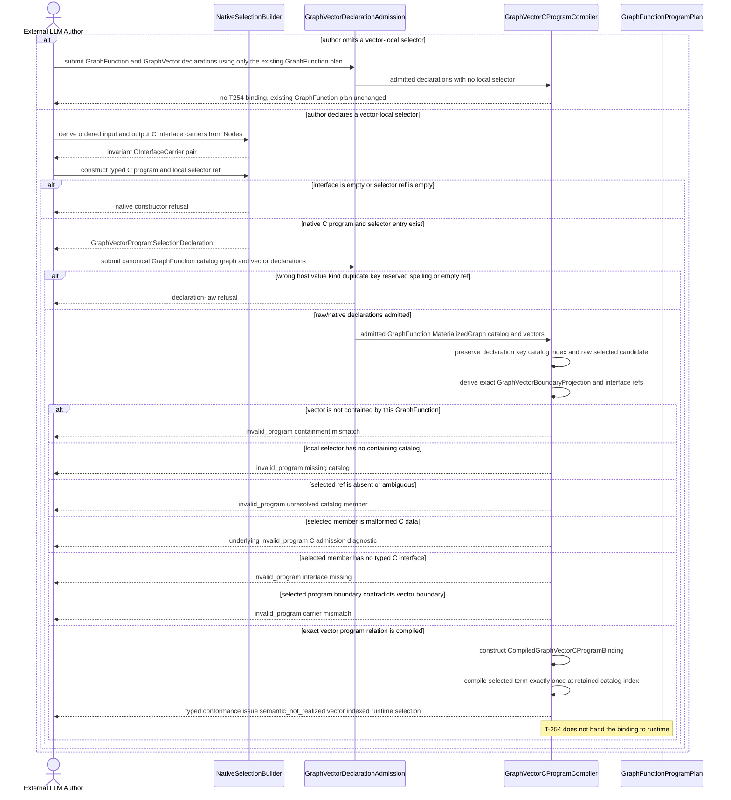
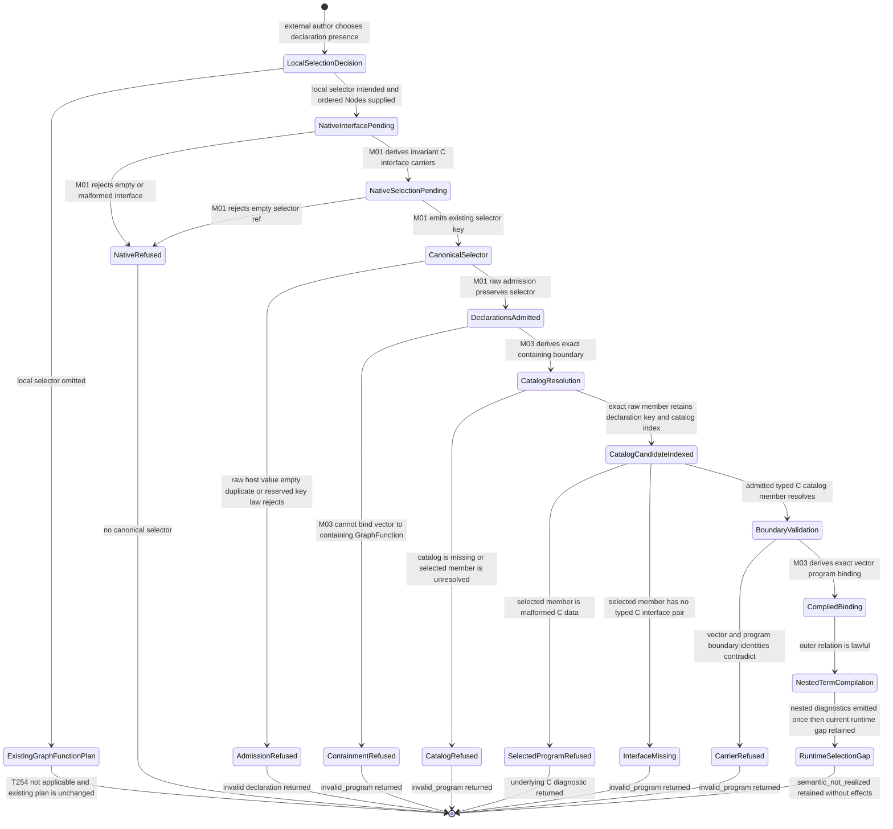

# M01/M03 GraphVector C-Program Selection Behavior Design

**Design verdict**: `fh_accepted`
**Implementation admission**: `admitted_for_t254_singular_boundary`
**Independent review**: `accepted`; no findings remain
**Ticket**: [T-254](../../../../.ai-workspace/tickets/completed/T-254-close-graph-vector-c-program-selection.md)
**Owning modules**: M01 GTL authoring/admission and M03 semantic compilation
**Change class**: `design_reframe`
**Delivery phase**: DS-1 prerequisite to T-252

## Boundary

This design closes one already-ratified language relation:

```text
catalog(gf) : ProgramRef -> CProgram
v is an admitted internal GraphVector of materialize(gf)
v.declarations["abg.hog_program_ref"] = p
p is a member of catalog(gf)
programBoundary(p) matches vectorBoundary(v)
-------------------------------------------------------
(gf, v) |- selected declared C program p
```

The selector is the existing `abg.hog_program_ref`. Program definitions,
catalogs, handler bindings, handler configs, and plugin selection remain on the
containing GraphFunction. This design adds no new execution key, topology
object, C generator, plugin seam, scheduler, or runtime controller.

The current runtime compiles and consumes one GraphFunction-wide program plan.
T-254 stops before changing that runtime handoff. A valid vector-local relation
therefore ends at `semantic_not_realized` until the later T-252 census routes a
separate runtime leaf.

## Authority

- `REQ-L-GTL3-C-ALGEBRA` defines
  `(GraphFunction, GraphVector) |- declared C<A,B>` and host-indexed execution
  declaration law.
- `REQ-L-GTL3-GRAPHVECTOR` makes `GraphVector.declarations` the canonical
  transition-governance surface.
- `REQ-R-ABG3-CCALL-016` says labelled program catalogs are selected by edges
  through `abg.hog_program_ref`.
- `REQ-L-GTL3-C-ALGEBRA-012..-016` require native-language maximum, raw
  admission parity, typed semantic gaps, and compile-before-effects.
- `PRODUCT.md` requires GTL to configure every product-visible graph-program
  element and forbids product-local parsers or plugin wrappers from replacing
  contract law.

No requirement reprice is needed. The defect is the current design and
realization, which host and compile program selection only at GraphFunction.

## Exact Interface Identity Join

`GraphVector` boundary identity and C-carrier identity currently occupy
different namespaces. T-254 closes that gap with one named M01 constructor over
the already-public ordered `interfaceContract(nodes)` value:

```text
cInterfaceContractRef(nodes) =
  "gtl.c.interface-contract:" +
  stableSha256Digest({ orderedNodeContractKeys: interfaceContract(nodes) })

vectorInputCarrierRef(v)  = cInterfaceContractRef(v.source)
vectorOutputCarrierRef(v) = cInterfaceContractRef([v.target])
```

`cInterfaceCarrier<Type>(nodes)` re-admits and normalizes the non-empty Node
sequence, derives the exact ref above, and returns an ordinary invariant
`CCarrier<Type>`. Source order is digest input, so a multi-source vector has one
explicit ordered product-interface identity without string concatenation at the
call site. The output uses the same one-element interface grammar.

Native authors construct the selected C program with these carriers before
constructing the immutable GraphVector. TypeScript then preserves the program's
`Input,Output` relation through the existing C generics. M03 recomputes both
interface refs from the admitted vector and requires exact equality with the
selected admitted C program's outer term refs. A selected legacy
`hog-syntax/1` program has no C carrier pair and is invalid for vector-local
selection; it remains lawful only through the unchanged GraphFunction plan.

## Axioms

1. **GV-C-01 - Existing selector authority.** The vector uses exactly
   `abg.hog_program_ref`; a second vector-program key is forbidden.
2. **GV-C-02 - Definition ownership.** C program and catalog definitions remain
   on the containing GraphFunction. A vector carries only a selector.
3. **GV-C-03 - Exact containment.** Selection is judged in the pair
   `(containing GraphFunction, contained GraphVector)`, never from a detached
   vector or workspace-wide catalog.
4. **GV-C-04 - Boundary preservation.** The selected program input ref equals
   `cInterfaceContractRef(vector.source)` and its output ref equals
   `cInterfaceContractRef([vector.target])`. The compiled binding preserves the
   ordered source contracts, target contract, and both exact refs. Missing or
   contradictory identity is invalid; names, tags, and observed behavior cannot
   prove equality.
5. **GV-C-05 - Bounded precedence.** T-254 applies only when a vector carries a
   local fixed selector. That selector is exact for that vector. When absent,
   T-254 produces no local binding and leaves the existing GraphFunction fixed
   or ladder plan unchanged. It does not select a runtime ladder member or make
   the current GraphFunction catalog selector optional.
6. **GV-C-06 - Separate composition authority.** `abg.fn_composition` governs
   regime, carrier, assurance, and closure context. It does not select a C
   program and is not a substitute for `abg.hog_program_ref`.
7. **GV-C-07 - Compiler ownership.** Native/raw admission decides host, value,
   non-empty, and duplicate law. M03 decides containment, catalog membership,
   boundary coherence, and realization availability.
8. **GV-C-08 - No runtime claim.** A valid vector selection is
   `semantic_not_realized` until a vector-indexed compiled plan is consumed by
   an accepted generic runtime design.
9. **GV-C-09 - Generic proof.** A non-Consensus Scenario 09 function with two
   vectors selecting different programs proves the atom.
10. **GV-C-10 - Effect freedom.** Authoring, raw admission, and semantic
    compilation invoke no worker, plugin, archive, event, traversal, or replay
    effect.

## IACS

| Carrier | Kind | Owner | Identity and role |
|---|---|---|---|
| `GraphFunctionProgramCatalog` | prime authoritative | M01 authored GTL | GraphFunction-hosted admitted C programs keyed by `programRef`; host identity derives from containment rather than a duplicated field |
| `GraphVectorProgramSelectionDeclaration` | subordinate authoritative | M01 authored GTL | existing scalar `abg.hog_program_ref` hosted by one internal GraphVector |
| `CInterfaceCarrier<Type>` | subordinate authoritative | M01 native authoring | ordinary invariant `CCarrier<Type>` whose ref is derived from one non-empty ordered Node interface contract |
| `RawCProgramCandidate` | downstream compiler projection | M03 | decoded canonical candidate retaining `{ declarationKey, catalogIndex, candidate }` so selected-member identity and diagnostics keep the exact raw origin |
| `GraphVectorBoundaryProjection` | downstream compiler projection | M03 | containing function ref, vector ref, ordered source node contract keys, target node contract key, and recomputed C interface refs |
| `CompiledGraphVectorCProgramBinding` | prime downstream compiler truth | M03 | exact catalog member joined to the exact vector boundary and selected program carrier pair |
| `GraphVectorCProgramDiagnostic` | downstream projection | M03 | stable invalid-program or semantic-not-realized result with repair affordances |
| `GraphFunctionProgramPlan` | deferred existing runtime carrier | M03 runtime | current GraphFunction-wide plan; unchanged by this slice |

The selector and compiled binding are not rival authorities. The selector is
authored intent. The compiled binding is the compiler judgment derived from the
selector, containing graph, and catalog. Runtime may later consume that
compiled judgment; it may not reparse the selector or infer one from a name.
`CInterfaceCarrier` is the named identity join between Node interfaces and C
types; it is not a topology object or runtime carrier family.

## Domain Model

```mermaid
classDiagram
  class GraphFunction {
    <<prime>>
    <<authoritative>>
    +id
    +declarations
    +template
  }
  class MaterializedGraph {
    <<subordinate>>
    -id
    -vectors
  }
  class GraphVector {
    <<prime>>
    <<authoritative>>
    +id
    +orderedSourceNodes
    +targetNode
    +declarations
  }
  class NodeContractIdentity {
    <<subordinate>>
    +nodeRef
    +nodeContractKey
  }
  class CProgramDeclaration {
    <<prime>>
    <<authoritative>>
    +programRef
    +inputCarrierRef
    +outputCarrierRef
    +term
  }
  class GraphFunctionProgramCatalog {
    <<prime>>
    <<authoritative>>
    +programsByRef
  }
  class GraphVectorProgramSelectionDeclaration {
    <<subordinate>>
    <<authoritative>>
    +key_abg_hog_program_ref
    +selectedProgramRef
  }
  class CInterfaceCarrier {
    <<subordinate>>
    <<authoritative>>
    +ref
    -invariantTypeWitness
    -orderedNodeContractKeys
  }
  class GraphVectorBoundaryProjection {
    <<downstream>>
    -hostGraphFunctionRef
    -graphVectorRef
    -orderedSourceNodeContractKeys
    -targetNodeContractKey
    -inputInterfaceCarrierRef
    -outputInterfaceCarrierRef
  }
  class RawCProgramCandidate {
    <<downstream>>
    -declarationKey
    -catalogIndex
    -candidate
  }
  class CompiledGraphVectorCProgramBinding {
    <<prime>>
    <<downstream>>
    -hostGraphFunctionRef
    -graphVectorRef
    -programRef
    -orderedSourceNodeContractKeys
    -targetNodeContractKey
    -programInputCarrierRef
    -programOutputCarrierRef
    -selectionSource_local_vector
  }
  class NativeSelectionBuilder {
    <<authoritative>>
    +cInterfaceCarrier(nodes)
    +hogProgramRefDeclarationEntry(programRef)
  }
  class GraphVectorDeclarationAdmission {
    <<authoritative>>
    -admitHostValueDuplicateLaw
    -admitNonEmptyVectorProgramRef
  }
  class GraphVectorCProgramCompiler {
    <<authoritative>>
    -resolveContainingFunction
    -resolveMaterializedVector
    -resolveCatalogMember
    -recomputeInterfaceCarrierRefs
    -validateBoundaryRelation
    -emitTypedConformanceIssue
  }
  class GraphVectorCProgramDiagnostic {
    <<downstream>>
    +classification
    +diagnosticId
    +path
    +expectedRelation
    +actualRelation
    +repairAffordances
  }
  class GraphFunctionProgramPlan {
    <<deferred>>
    -currentGraphFunctionWideSelection
  }
  class Scenario09LabFunction {
    <<downstream>>
    -LabObservation_to_NormalizedObservation
    -NormalizedObservation_to_ResearchFinding
  }
  class AbgFnCompositionSelection {
    <<authoritative>>
    +separateRegimeAndClosureGovernance
  }

  GraphFunction "1" *-- "1" MaterializedGraph : materializes
  MaterializedGraph "1" *-- "1..*" GraphVector : contains
  GraphVector "1" *-- "1..*" NodeContractIdentity : ordered source and target identities
  NativeSelectionBuilder --> CInterfaceCarrier : derives from ordered nodes
  GraphFunction "1" *-- "0..1" GraphFunctionProgramCatalog : owns catalog mode definitions
  GraphFunctionProgramCatalog "1" *-- "1..*" CProgramDeclaration : indexes by programRef
  GraphFunction --> GraphFunctionProgramPlan : existing fixed or ladder plan
  GraphVector "1" *-- "0..1" GraphVectorProgramSelectionDeclaration : local fixed selection
  NativeSelectionBuilder --> GraphVectorProgramSelectionDeclaration : constructs existing key
  GraphVectorDeclarationAdmission --> GraphVectorProgramSelectionDeclaration : admits raw or native form
  GraphVectorCProgramCompiler --> GraphFunctionProgramCatalog : resolves containing catalog
  GraphVectorCProgramCompiler --> RawCProgramCandidate : preserves raw declaration origin
  GraphVectorCProgramCompiler --> GraphVectorProgramSelectionDeclaration : reads selected ref
  GraphVectorCProgramCompiler --> GraphVectorBoundaryProjection : derives from exact containment
  GraphVectorCProgramCompiler --> CompiledGraphVectorCProgramBinding : produces compiler truth
  CompiledGraphVectorCProgramBinding --> CProgramDeclaration : names exact catalog member
  CompiledGraphVectorCProgramBinding --> GraphVectorBoundaryProjection : preserves exact boundary
  CompiledGraphVectorCProgramBinding --> CInterfaceCarrier : requires equal input and output refs
  GraphVectorCProgramCompiler --> GraphVectorCProgramDiagnostic : emits truthful stop
  CompiledGraphVectorCProgramBinding ..> GraphFunctionProgramPlan : runtime handoff deferred
  Scenario09LabFunction --> GraphFunction : generic fixture
  Scenario09LabFunction --> CompiledGraphVectorCProgramBinding : proves two distinct selections
  GraphVector --> AbgFnCompositionSelection : separate governance contract
```



Domain invariants:

1. One GraphFunction owns its program definitions. Internal vectors select by
   ref; they do not copy program bodies or handler/plugin declarations.
2. `CInterfaceCarrier` derives one stable ref from the ordered
   `interfaceContract(nodes)` value. `GraphVectorBoundaryProjection` recomputes
   the same ref and preserves source order. Multi-source input is not a caller-
   concatenated string or an unordered set.
3. A compiled binding is scoped by both GraphFunction and GraphVector identity.
   Equal program refs in another catalog do not satisfy it.
4. A present local selector is exact for that vector and never merges programs.
   Absence creates no T-254 binding and leaves the current GraphFunction plan
   unchanged, including runtime ladder selection.
5. `AbgFnCompositionSelection` is associated only to show the non-coercion. It
   does not contain or derive the selected C program.
6. `GraphFunctionProgramPlan` is deferred. T-254 cannot claim that current
   runtime execution honors `CompiledGraphVectorCProgramBinding`.
7. `RawCProgramCandidate` preserves declaration key and catalog index before any
   selected-member diagnostic. An invalid outer vector/program relation never
   enters nested C compilation; a lawful binding enters it exactly once.

## Native And Canonical Contract

The accepted implementation uses the existing selector builder plus one named
Node-interface carrier constructor:

```ts
cInterfaceContractRef(nodes: readonly Node[]): string;
cInterfaceCarrier<Type>(nodes: readonly Node[]): CCarrier<Type>;

graphVectorDeclarations([
  hogProgramRefDeclarationEntry(program.programRef)
]);
```

`hogProgramRefDeclarationEntry(...)` remains a reference builder. An arbitrary
non-empty ref is lawful native syntax because catalog membership is a global
M03 fact under C-ALGEBRA-014; it is not an admitted program witness. The
GraphVector host context is supplied by `graphVectorDeclarations(...)` after
the registry admits this key on that host. Raw callers may submit the same
canonical scalar form. M01 adds the missing key-specific non-empty-ref check and
applies the existing host, kind, reserved-key, and duplicate checks.

The program itself is constructed with
`cInterfaceCarrier<Input>(vectorSourceNodes)` and
`cInterfaceCarrier<Output>([vectorTargetNode])` before the immutable vector is
built. The C generics preserve the pair locally; M03 rechecks the canonical refs
after raw admission. This is the native maximum available without making Node
or GraphVector globally generic.

Only `abg.hog_program_ref` gains `graph_vector` as an allowed host. The catalog,
single program, ladder, handler bindings, handler configs, and plugin selection
keys remain GraphFunction-only. `abg.fn_composition` remains independently
legal on both hosts and has no program-selection meaning.

The published execution-law metadata has one precedence row per key, not one
row per host. The selector's one combined cross-host precedence rule must state
`graph_function_fixed_exclusive_with_ladder_and_graph_vector_fixed_local_exact_else_graph_function_plan`;
its composition rule remains `selects_one_catalog_member`. The combined rule
preserves the existing fixed-versus-ladder law when the key is hosted by a
GraphFunction and adds local-exact/else-GraphFunction-plan law when it is hosted
by a GraphVector. The separate ladder-key rule remains the reciprocal
GraphFunction-side exclusion. This is published compiler law, not prose-only
precedence, and it does not pretend one scalar metadata field can carry two
host-specific rows.

The M03 compiler derives, rather than asks the author to duplicate:

```text
hostGraphFunctionRef
graphVectorRef
orderedSourceNodeContractKeys
targetNodeContractKey
selectedProgramRef
selectedProgramInputCarrierRef
selectedProgramOutputCarrierRef
selectionSource = graph_vector
```

Catalog membership and the outer program carrier pair are read from the
admitted canonical C-program candidates before `compileCAlgebraToHog(...)`
walks nested terms. An outer `workflow.C`, `C.batch`, or `C.retry` realization
gap therefore cannot hide whether a vector selected a real catalog member. The
ordinary path-addressed C compiler remains responsible for the selected
program's inner constructor diagnostics.

The current eager `checkCAlgebraDeclarations(...)` order is not sufficient:
`cAlgebraCandidates(...)` discards declaration origin and catalog index, then
emits nested diagnostics before graph materialization exposes vector-local
selectors. T-254 must preserve each raw candidate as
`{ declarationKey, catalogIndex, candidate }`. For a locally selected member it
must defer the ordinary nested diagnostic pass until containment, exact member,
selected-program admission/interface, and vector boundary validation succeed.
An invalid outer relation suppresses nested semantic gaps for that same
candidate. A lawful binding releases its nested diagnostics exactly once at the
original `catalog[catalogIndex]` path, then emits the vector-selection runtime
gap. Unselected candidates retain the ordinary C-algebra diagnostic path and
are not silently dropped.

The exact relation is always decidable for a selected `gtl-c-algebra/1` program:
its outer term refs must equal the two recomputed interface refs. A selected
legacy HoG program or malformed C program has no admissible C interface and is
`invalid_program`, not an unrealized runtime selection. Names, tags, vector
ordinal, schemas that merely look alike, and observed runtime behavior cannot
repair or infer the relation.

## Precedence And Failure Law

| Condition | Class and diagnostic | Subject path | Expected / actual | Repair affordance |
|---|---|---|---|---|
| no vector-local selector | `not_applicable`; no T-254 diagnostic | vector declaration path | existing GraphFunction plan / unchanged | none |
| wrong value kind, duplicate key, illegal reserved spelling, or vector-hosted definition key | existing declaration-law `invalid_program` refusal | exact vector declaration entry | registered host/kind/unique law / admitted offending entry | fix declaration shape or move definition to GraphFunction |
| selector scalar is empty | `invalid_program`; `gtl-c-vector-program-empty-ref` | `...vectors[i].declarations["abg.hog_program_ref"]` | one non-empty program ref / empty scalar | supply non-empty ref |
| vector is not contained by the compiled GraphFunction body | `invalid_program`; `gtl-c-vector-program-containment-mismatch` | exact function/vector pair | vector identity in containing materialized graph / unresolved pair | bind selector on a contained vector |
| local selector has no containing GraphFunction catalog | `invalid_program`; `gtl-c-vector-program-missing-catalog` | exact function/vector pair | containing `abg.hog_program_catalog` / none | publish catalog on containing GraphFunction |
| selected ref has zero or multiple catalog members | `invalid_program`; `gtl-c-vector-program-unresolved-ref` | exact selector path | exactly one matching program / observed count and refs | select or uniquely declare one member |
| selected member is malformed `gtl-c-algebra/1` data | underlying stable C admission diagnostic wins before selection diagnostics | exact catalog member path | admitted C program / malformed candidate | repair selected C declaration |
| selected member is legacy `hog-syntax/1` and has no C interface pair | `invalid_program`; `gtl-c-vector-program-interface-missing` | exact catalog member path | admitted C program input/output refs / legacy stage-only program | select or declare typed C program |
| selected C program carrier refs differ from recomputed vector interface refs | `invalid_program`; `gtl-c-vector-program-carrier-mismatch` | exact function/vector/program binding | expected input/output interface refs / actual program refs | construct program with matching interface carriers |
| exact relation is lawful but current runtime plan is GraphFunction-wide | `semantic_not_realized`; `gtl-c-unrealized-vector-program-selection` | exact function/vector/program binding | vector-indexed compiled runtime selection / GraphFunction-wide plan | realize declared semantics under later accepted design |

`invalid_program` and `semantic_not_realized` are mutually exclusive. Selected
program admission runs before membership-interface realization classification,
so a malformed selected program retains its exact C diagnostic. The new vector
diagnostics enter `GtlProgramConformanceIssue` through a dedicated typed
`pushGraphVectorCProgramDiagnostic(...)` path. They are not exception strings
from `compileExecutionDeclarations(...)` and cannot be lost through its current
`gtl-c-unrealized-*` exception suppression.

## Execution Sequence



Sequence invariants:

- `Author` is external; every other participant is present in the domain model.
- Native and raw admission decide only local interface construction and
  host/value/non-empty/duplicate facts.
- M03 decides containment, membership, boundary coherence, precedence, and
  realization availability before effects.
- No-local-selector behavior is not a fallback binding. T-254 leaves the
  existing GraphFunction fixed or ladder plan untouched.
- `GraphFunctionProgramPlan` receives no message. The note documents the absent
  runtime join instead of drawing a fake execution path.
- No plugin, handler, worker, event, archive, traversal, or replay participant
  appears in this effect-free boundary.

## Lifecycle State Machine



State invariants:

1. Every refusal is terminal for T-254 and occurs before runtime effects.
2. `CompiledBinding` is compiler truth, not executable truth.
3. `RuntimeSelectionGap` is a successful T-254 closure outcome because this
   slice owns language authoring/admission/compiler relation only.
4. No invalid-program state can transition to the runtime gap.
5. No state mutates the authored graph, catalog, vector, or program to repair a
   mismatch.
6. `ExistingGraphFunctionPlan` carries no exact vector binding and does not
   select a ladder member; it preserves current behavior outside T-254.
7. `NestedTermCompilation` is reachable only from `CompiledBinding`. Every
   outer invalid-program state terminates without emitting a nested semantic
   gap for the same raw catalog candidate.

## Cross-View Evaluation

| Axiom | Authority | Domain evidence | Sequence evidence | State evidence | Native enforcement | Admission/compiler enforcement | Verdict | Gap owner |
|---|---|---|---|---|---|---|---|---|
| GraphFunction remains the callable constructive carrier; GraphVector remains internal | GRAPHFUNCTION; GRAPHVECTOR | function contains graph and vectors | author selects an internal vector under its function | no vector public-start state | separate carriers and host-indexed declarations | containment is checked in M03 | `pass` | none |
| `(GraphFunction, GraphVector) |- declared C` is explicit | C-ALGEBRA sort chain | selector plus derived exact binding | M03 resolves the pair before returning a result | CompiledBinding follows containment/catalog/boundary checks | existing selector builder enters graph-vector host; membership is global | M03 derives exact function/vector/program join | `pass` | T-254 realization |
| ordered Node interfaces and C carriers share one exact identity | C-ALGEBRA-004/-012/-014; GRAPHVECTOR-003 | CInterfaceCarrier and GraphVectorBoundaryProjection use the same ordered interface digest | Native derives carriers; M03 recomputes refs before binding | InterfaceMissing and CarrierRefused are terminal | invariant C carrier from non-empty normalized Node sequence | exact input/output ref comparison, including multi-source order | `pass` | T-254 realization |
| Existing selector key is the only program-selection authority | CCALL-016; C-ALGEBRA-011 | no second selector carrier exists | only `abg.hog_program_ref` enters M01 | no alternate selector state | registered host-indexed key | unknown reserved spellings fail | `pass` | none |
| Program definitions remain GraphFunction-owned | C-ALGEBRA-011; T-220 | catalog contains programs; vector owns only ref | raw admission rejects vector definitions | AdmissionRefused is terminal | host-indexed types | host mismatch refusal | `pass` | none |
| T-254 local selection is exact and never collapses a runtime ladder | GraphVector transition-governance law; C-ALGEBRA-011; CCALL-017 | local selector produces binding; deferred GF plan remains distinct | no-local branch preserves existing plan without selecting it | ExistingGraphFunctionPlan and CompiledBinding are disjoint | one local key per vector | local membership exact; absent local selector is not applicable | `pass` | none |
| `abg.fn_composition` is not C-program selection | FN-COMPOSITION; COMPUTE-NOTATION | separate associated carrier | no composition message enters selection | no composition coercion state | distinct key and builder | compiler reads only program selector for this judgment | `pass` | none |
| Malformed authored GTL stops before effects | C-ALGEBRA-013/-016 | refusal projection is downstream-only | all malformed branches return to Author | refusal states terminate | non-empty interface and selector builders | raw law, selected-program admission, and invalid-program diagnostics | `pass` | none |
| Vector diagnostics cannot disappear through execution-compiler exception filtering | C-ALGEBRA-015/-016 | GraphVectorCProgramDiagnostic is a typed downstream result | M03 returns typed conformance issue directly | every diagnostic has a terminal state | closed diagnostic identity union | dedicated conformance projection, not thrown string | `pass` | T-254 realization |
| Outer invalidity and inner unrealized semantics remain mutually exclusive | C-ALGEBRA-013/-014/-016 | RawCProgramCandidate retains declaration key and catalog index before binding | M03 validates the outer relation before compiling the selected term exactly once | only CompiledBinding reaches NestedTermCompilation | no native claim of catalog admission | staged selected-member pass plus combined carrier-mismatch/unrealized negative | `pass` | T-254 realization |
| Lawful but unrealized semantics remain explicit | C-ALGEBRA-014/-016 | deferred runtime plan is visible | sequence ends semantic-not-realized | RuntimeSelectionGap terminates | native relation remains intact | exact stable diagnostic | `pass` | later vector-indexed runtime design |
| Plugins and handlers do not author or repair selection | ODD method; HANDLERS | no plugin/handler carrier exists | no plugin/handler participant exists | no plugin-owned state exists | APIs expose no plugin shortcut | compiler refuses unresolved relation | `pass` | none |
| Generic atom has a non-Consensus consumer | PRODUCT atom criterion; Scenario 09 | Scenario09LabFunction selects two programs | same generic compiler path applies | same lifecycle for both vectors | no Consensus type or name required | tests prove two distinct bindings | `pass` | T-254 proof |
| Runtime consumes vector-indexed compiled selection | C-ALGEBRA-016; CCALL runtime law | GraphFunctionProgramPlan is deferred | no runtime handoff message exists | RuntimeSelectionGap is terminal | not applicable to authoring | current runtime is GraphFunction-wide | `not_applicable` | later T-252 census successor; explicitly outside T-254 |

## Generic Proof Fixture

Scenario 09 supplies one non-Consensus function:

```text
LabObservation
  -- normalize_program --> NormalizedObservation
  -- synthesize_finding_program --> ResearchFinding
```

The containing GraphFunction owns both admitted C programs in one catalog. Its
first GraphVector selects `normalize_program`; its second selects
`synthesize_finding_program`. The proof must cover:

- carriers for `[LabObservation]`, `[NormalizedObservation]`, and
  `[ResearchFinding]` derived through `cInterfaceCarrier`, plus one additional
  multi-source order differential;
- native and raw selector equivalence;
- stable GraphFunction, GraphVector, program, source, and target identities;
- two distinct compiled bindings from one containing catalog;
- wrong-host, empty-ref, duplicate, missing-catalog, unresolved-ref,
  containment, malformed-selected-program, legacy-interface-missing,
  carrier-mismatch, and reversed-multi-source-order negatives;
- one combined precedence negative: a locally selected unrealized `C.batch`
  program with mismatched outer carriers yields only the exact catalog-indexed
  `invalid_program` carrier-mismatch issue and no `semantic_not_realized` issue;
- the exact semantic-not-realized diagnostic for each lawful local selector;
- zero Consensus vocabulary in generic M01/M03 implementation and fixture; and
- zero worker, plugin, event, archive, traversal, replay, or workspace effects.

## Non-Scope

- runtime consumption of vector-indexed program plans;
- `workflow.C`, `C.batch`, `C.retry`, HOF, fan-in, or recursion execution;
- Consensus body code, schemas, profiles, prompts, reducers, routing, CLI, or
  workspace invocation;
- a second selector key or a vector-local program/catalog/handler/plugin body;
- `abg.fn_composition` redesign;
- GraphVector public invocation or helper-GraphFunction topology rewrites;
- hostile-process, filesystem, cryptographic, or multi-user defense; and
- GraphFunction fixed/ladder plan semantics beyond leaving the existing plan
  unchanged when no local selector exists.

## Acceptance And Closure

Implementation may start only after independent review and direct F_H
acceptance of this three-view design. T-254 then closes only when:

1. the existing selector key is host-indexed for GraphVector while program and
   implementation definitions remain GraphFunction-only;
2. `cInterfaceCarrier` defines one canonical ordered Node-interface identity for
   C input/output carriers, including multi-source order, and native/raw forms
   admit the same selector relation;
3. M03 recomputes those interface refs and derives exact containing-function,
   vector, catalog-member, boundary, and
   selected-program truth;
4. no-local-selector vectors retain the existing GraphFunction plan without a
   T-254 binding or runtime ladder choice;
5. malformed, legacy-interface-less, or unresolved relations return the
   specified invalid-program diagnostics with exact path, expected/actual, and
   repair affordance through the typed conformance issue path;
6. selected raw catalog candidates retain declaration key and catalog index;
   invalid outer relations suppress nested semantic gaps for the same candidate,
   while lawful bindings release nested diagnostics exactly once before the
   vector-selection semantic gap;
7. lawful relations return the exact semantic-not-realized diagnostic without
   effects;
8. the Scenario 09 two-vector/two-program proof and negative corpus pass with no
   Consensus vocabulary in generic code;
9. focused, full semantic, declaration-law, generated-publication, lint, and
   design-render gates pass; and
10. a phase self-review confirms no runtime, plugin, Consensus, or topology drift.

## Candidate Verdict

`closed_as_designed`. The realization closes existing constitutional law at the
smallest generic M01/M03 boundary and retains `semantic_not_realized` as its
truthful runtime boundary. It authorizes no runtime work; T-252 may now re-enter
its separately accepted Consensus body-authoring and compiler-census boundary.
