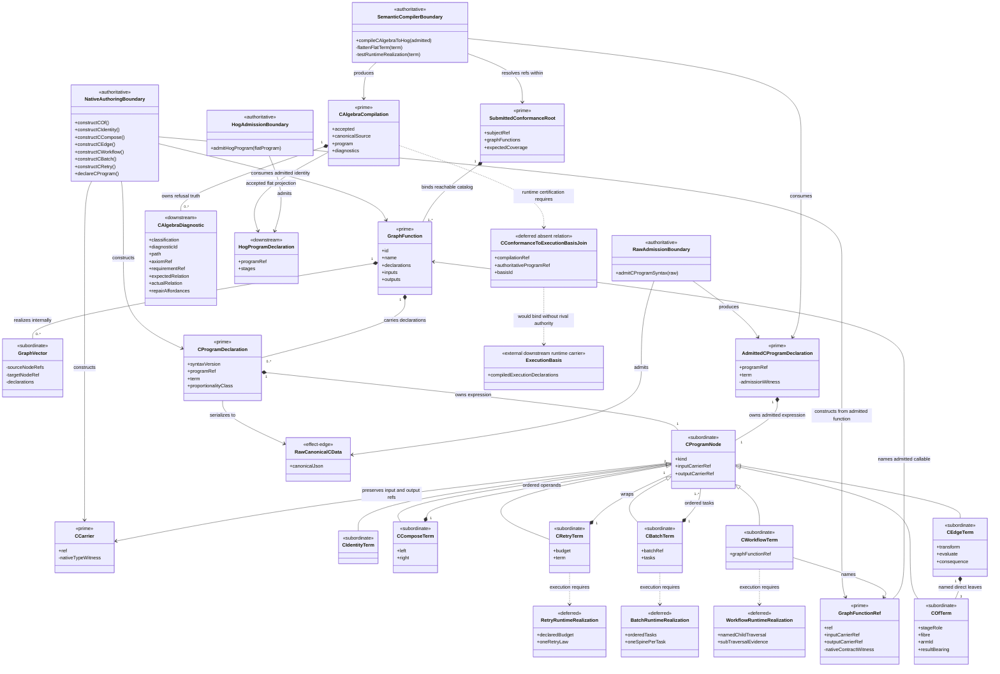
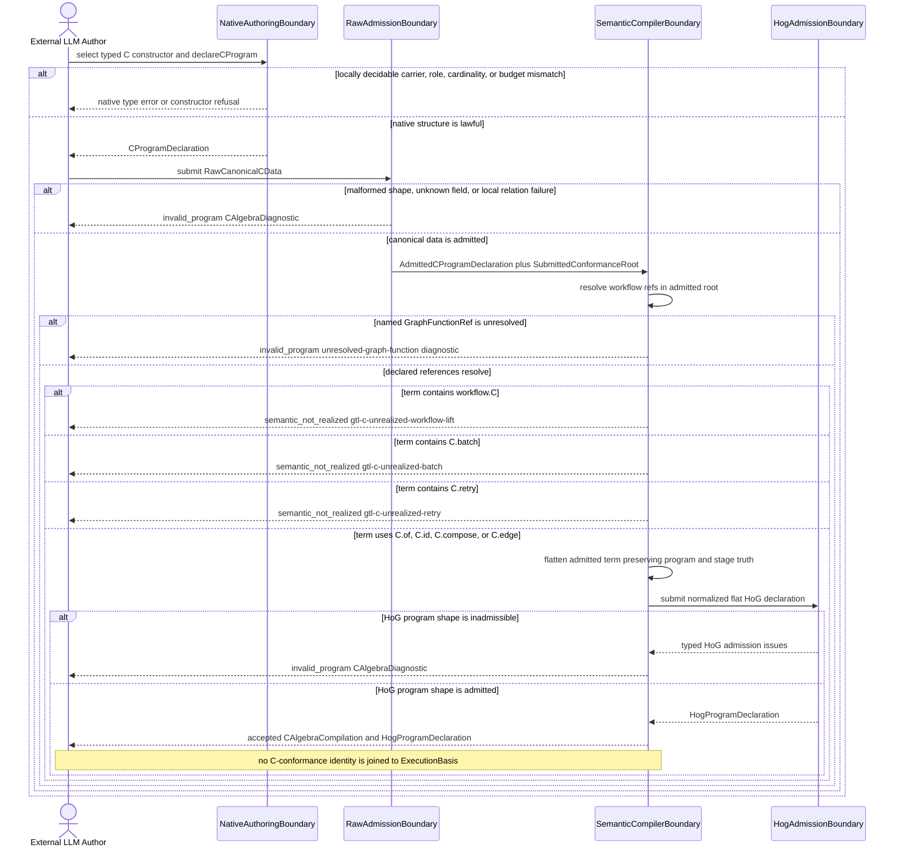
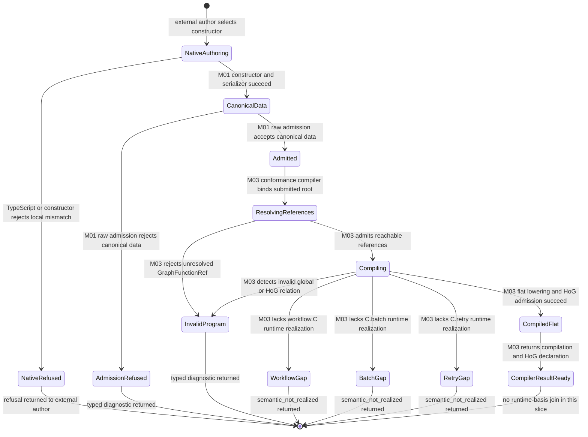

# M01/M03 Typed C Algebra Behavior Design

**Status**: Retrospective three-view design gate
**Design date**: 2026-07-12
**Method authority**: `specification_methodology/specification/standards/DESIGN_MODULE_METHOD.md` section 5E
**Tenant authority**: [TYPESCRIPT_REALIZATION_GUARDRAILS.md](./TYPESCRIPT_REALIZATION_GUARDRAILS.md)
**Retrospective subject**: completed T-220 implementation

This design reconstructs the behavioral boundary that T-220 actually proved.
It does not expand that proof to runtime behavior which the compiler currently
reports as absent.

## Boundary

- **Design verdict**: `candidate`. The candidate recommends acceptance only for
  typed authoring, canonical-data admission, flat-term semantic compilation,
  and the typed compiler result. Independent axiom review and F_H
  ratification are still required.
- **Dependent-runtime verdict**: `blocked` for any feature requiring
  `workflow.C`, `C.batch`, or `C.retry` execution.
- **Owning modules**: M01 GTL core owns language data and local relations; M03
  owns semantic compilation, realization census, and execution admission.
- **Requirements**: `REQ-L-GTL3-C-ALGEBRA-001..-017`,
  `REQ-L-GTL3-GRAPHFUNCTION-014..-019`, `REQ-R-ABG3-CCALL-001..-017`, and
  `REQ-R-ABG3-HANDLERS-001..-016`.
- **Ticket or intake**: `.ai-workspace/tickets/completed/T-220-close-typed-gtl-c-algebra-authoring-loop.md`.
- **Code scope assessed**:
  `gtl/m01/algebra/c_algebra.ts`,
  `gtl/m01/algebra/c_algebra_declarations.ts`,
  `abg/m03/contracts/c_algebra_hog_compiler.ts`, the public HoG syntax
  delegation, `gtl_program_conformance.ts` C-algebra integration,
  declaration-law admission, and the T-220 type/runtime corpus.
- **Dependencies**: the admitted `GraphFunction` carrier, host-indexed
  execution declaration law, normalized flat HoG program admission, and the
  existing M03 execution-basis boundary.
- **Explicit exclusions**: higher-order constructor interpretation; C-call
  execution and event projection; handler interiors; F_P response admission;
  product-specific graph functions; release-root selection; and outer
  GraphFunction wire-contract certification.

The candidate slice stops at a compiled flat HoG declaration or a typed
diagnostic. It does not claim that all seven admitted constructors execute.
No dependent design may treat syntax presence as runtime availability.

## Domain Model

### Carrier And Authority Reading

`CProgramDeclaration` is the authored prime. Its term variants are owned
subordinate algebra, not independent execution authorities. The admitted form
is a distinct prime because it carries the M01 admission witness. The
compilation is authoritative only for the compiler judgment it reports.
`HogProgramDeclaration` is part of the compiler result. The current code has
no accepted relation from that result into `ExecutionBasis`.
`CConformanceToExecutionBasisJoin` is shown as deferred and absent so the
diagram cannot be read as runtime certification. `ExecutionBasis` does not
retroactively author C meaning.

The three deferred runtime families are shown because their syntax exists in
the admitted variant family. They are not current runtime carriers. No plugin,
handler, service, shell, or controller appears as their realization.

## Execution Sequence

The LLM author is external. Every other participant is a boundary in the
domain model. The successful result for this slice is a typed flat compiler
result; a stable diagnostic is its truthful stop.

There is intentionally no worker, handler, retry loop, child traversal, batch
fan-out/fan-in, or F_H participant in this sequence. For this boundary those
paths stop at `semantic_not_realized`. Drawing an imperative substitute would
falsely claim the missing interpreter behavior.

## Lifecycle State Machine

`WorkflowGap`, `BatchGap`, and `RetryGap` are terminal compiler outcomes, not
runtime retry states. Runtime continuation, retry, escalation, and closure
belong to a later design only after the corresponding constructor has an
accepted interpreter realization.

## Cross-View Invariants

| Check | Evidence | Verdict |
|---|---|---|
| Every sequence participant exists in the domain model or is external | Four named boundaries are modeled; the LLM is explicitly external. | pass |
| Every lifecycle carrier exists in the domain model | Authored, canonical, admitted, compiled, diagnostic, and compiler-result carriers are modeled; the runtime-basis join is explicitly deferred. | pass |
| Every message names a typed transform, graph/C constructor, interpreter act, or effect boundary | Messages are constructor, serialization/admission, semantic compilation, flat lowering, HoG admission, or result return. | pass |
| Every transition names an admission, compiler, interpreter, event, projection, or external owner | The active lifecycle ends before interpretation; every transition names M01, M03, TypeScript, or the external author. | pass |
| Raw F_P output cannot transition directly to accepted or closed | F_P execution and response admission are outside this compiler boundary; no state or sequence path can receive F_P output. Existing F_P admission is not claimed as T-220 compiler proof. | not_applicable |
| Plugins and handlers own interiors only | No plugin or handler participates in authoring, admission, compilation, or realization-gap repair. A future interpreter may call handlers only for admitted `C.of` interiors. | pass |
| Batch, retry, recursion, and nested workflow use declared algebra | Their authored forms are declared and admitted, but their execution paths end in typed gaps. No dependent feature may proceed until a separate accepted runtime design realizes them. | pass |
| Diagnostics do not authorize a semantic rewrite | Repair affordances report possible lawful re-entry only. `use_flat_composition` is valid solely when the author explicitly changes or proves preservation of the intended semantics; the compiler never applies it. | pass |
| Runtime observation does not author declarations | The compiler consumes authored/admitted terms and a realization census; it never derives a term from observed execution. | pass |

## Axiom Evaluation

| Axiom | Authority | Domain evidence | Sequence evidence | State evidence | Native enforcement | Admission/compiler enforcement | Verdict | Gap owner |
|---|---|---|---|---|---|---|---|---|
| GTL is the LLM-first declared program algebra; ABG interprets it | `PRODUCT.md` LLM-First Product Identity | Authored C declaration and compiler boundaries are distinct | LLM submits typed/canonical declarations; compiler owns global judgment | Authored, admitted, and compiled states do not collapse | Closed constructors, generic carriers, opaque witnesses | Raw admission and semantic compilation stop before effects | pass | none |
| C has exactly seven exhaustively matchable generators | `REQ-L-GTL3-C-ALGEBRA-001` | All seven real variants inherit from `CProgramNode` | Every constructor family has an explicit branch | All lawful syntax reaches admission or a named compiler outcome | Discriminated union and public constructor set | Closed syntax rejects invented siblings | pass | none |
| Locally decidable type, role, carrier, cardinality, and budget law is native | `REQ-L-GTL3-C-ALGEBRA-002..-005`, `-007..-009`, `-012` | Carriers, direct edge leaves, batch tasks, and retry budget are explicit | Native-refusal branch precedes raw admission | `NativeRefused` cannot reach compilation | Generics, exact role/type relations, nominal construction, positive budget | Raw admission reapplies local relations | pass | none |
| Canonical raw data and admitted data are distinct | `REQ-L-GTL3-C-ALGEBRA-013` | `RawCanonicalCData` and `AdmittedCProgramDeclaration` are different carriers | Raw boundary alone produces admitted data | `CanonicalData` must pass M01 admission | Constructor-produced native values remain distinct | Closed parser yields stable typed diagnostics | pass | none |
| Global and realization facts belong to the semantic compiler | `REQ-L-GTL3-C-ALGEBRA-014..-016` | `SemanticCompilerBoundary` owns compilation and diagnostics | All refusals occur before compiler result return | Only `CompiledFlat` reaches `CompilerResultReady` | Local types do not claim runtime availability | `semantic_not_realized` differs from `invalid_program` | pass | none |
| Flat `C.id` and `C.compose` preserve identity and associativity | `REQ-L-GTL3-C-ALGEBRA-003..-004` | Identity and compose are declared variants | Flat terms lower at one compiler boundary | Lawful flat terms may enter `CompiledFlat` | Input/output types constrain composition | Canonical lowering is tested for left/right identity and associativity | pass | none |
| `C.edge` is a direct three-leaf record, not a closed stage ontology | `REQ-L-GTL3-C-ALGEBRA-005` | `CEdgeTerm` owns exactly three `COfTerm` leaves | Compiler flattens the admitted direct record | Lawful edge can enter `CompiledFlat` | Literal role constraints and direct-leaf API | Raw admission rejects wrapped/wrong-role fields | pass | none |
| `workflow.C` preserves a named child boundary and executes as transparent sub-traversal | `REQ-L-GTL3-C-ALGEBRA-006`, `REQ-R-ABG3-CCALL-013` | Syntax and `GraphFunctionRef` exist; runtime family is explicitly deferred | Sequence terminates at `gtl-c-unrealized-workflow-lift` | `WorkflowGap` is terminal for this slice | Ref and carrier pair are typed | Compiler truthfully reports absent realization; runtime use is outside this candidate boundary and blocks dependents | not_applicable | M03 workflow-lift runtime design and realization |
| `C.batch` preserves ordered task identity, cardinality, and one spine per task | `REQ-L-GTL3-C-ALGEBRA-007`, `REQ-R-ABG3-CCALL-005` | Syntax exists; one-spine-per-task runtime family is deferred | Sequence terminates at `gtl-c-unrealized-batch` before fan-out | `BatchGap` is terminal for this slice | Non-empty compatible task family is typed | Compiler truthfully reports absent realization; runtime use is outside this candidate boundary and blocks dependents | not_applicable | M03 batch runtime design and realization |
| `C.retry` preserves contract and executes under one declared retry law | `REQ-L-GTL3-C-ALGEBRA-008`, `REQ-R-ABG3-CCALL-009` | Syntax and declared budget exist; retry runtime family is deferred | Sequence terminates at `gtl-c-unrealized-retry` before any loop | `RetryGap` is terminal for this slice | Positive budget and preserved carrier types | Compiler truthfully reports absent realization; runtime use is outside this candidate boundary and blocks dependents | not_applicable | M03 retry runtime design and realization |
| GraphFunction is the public callable carrier; GraphVector remains internal | `PRODUCT.md`; `REQ-L-GTL3-GRAPHFUNCTION-014..-019` | Named `GraphFunctionRef` is distinct from C term and compiler result | Only `workflow.C` names a nested graph-function boundary | Missing lift realization stops rather than coercing a vector | Constructor requires an admitted GraphFunction | No anonymous lowering substitutes for the unresolved lift | pass | none |
| Plugins and handlers realize one selected `C.of` interior only | `REQ-L-GTL3-C-ALGEBRA-010`; `REQ-R-ABG3-HANDLERS-001..-012` | No implementation carrier is part of program authorship or gap repair | No handler is invoked by this compiler sequence | No plugin-owned lifecycle state exists | Authoring APIs expose no runtime authority | Compiler gap cannot select a plugin workaround | pass | none |
| Higher-order panels and workflows are free constructions over atoms, not new engine law | `PRODUCT.md` atom criterion; `ODD_METHOD.md` sections 1 and 5 | Missing algebra runtime families remain visible rather than hidden in a feature plugin | Higher-order paths stop at the named constructor gap | There is no controller-local continuation state | Native syntax preserves the intended category | Semantic gaps block feature execution; dependent features remain blocked | pass | every dependent feature owner plus M03 algebra owner |
| A relied-on unrealized constructor cannot be replaced by imperative glue | `DESIGN_MODULE_METHOD.md` section 5E; `ODD_METHOD.md` | Deferred runtime families have no plugin/service substitute | Sequence contains no hidden loop or orchestration participant | Gap states terminate without effects | No API provides a bypass constructor | `semantic_not_realized` is fail-closed | pass | none; prohibition is permanent |

## Gap And Exclusion Register

| Gap or exclusion | Why outside or blocking | Owner | Re-entry condition |
|---|---|---|---|
| `workflow.C` runtime realization | The current normalized HoG carrier cannot retain the named child traversal boundary. Any nested workflow, recursive GraphFunction, or Consensus-like composition that relies on this term is blocked. | M03 algebra interpreter | Accepted three-view runtime design preserving admitted child identity, graph call/frame identity, sub-traversal evidence, foldback, and C-call audit equality; implementation and proof then land. |
| `C.batch` runtime realization | The current compiler cannot retain parent grouping identity and one C-call spine per ordered task. Any feature requiring reviewer/task fan-out and fan-in is blocked. | M03 algebra interpreter | Accepted three-view batch design preserving order, per-task identity/cardinality/evidence/judgment, lawful fan-out/fan-in, and pointwise composition; implementation and proof then land. |
| `C.retry` runtime realization | The current compiler cannot retain a declared budget under the single engine-owned retry allowlist. Any feature requiring governed rounds or retries is blocked. | M03 algebra interpreter | Accepted three-view retry design binding declared budget, attempt identity, replay-derived continuation, and the one retry law; implementation and proof then land. |
| Outer GraphFunction wire-contract certification | Native `CGraphFunctionRef` binds typed carrier refs, but serialized compilation does not invent an absent child outer-contract identity. | GTL requirement/design re-entry | Ratified wire identity carrier and compiler relation, if a dependent feature requires certification stronger than named-ref resolution. |
| Product-authoritative conformance root selection | T-220 proves the submitted root, not which root a release or install declares authoritative. | Product/install binding | Release manifest binds one complete admitted root and qualification proves that exact binding. |
| C-conformance result joined to `ExecutionBasis` | The compiler returns a valid bounded result, but the runtime basis construction does not consume its identity or realization census. | M01/M03 mapping design | One accepted design binds the authoritative selected program and compilation identity into the basis without introducing a second program authority. |
| F_P response admission | Malformed worker output is probable and must remain defended, but it is an execution/result boundary rather than this C authoring/compiler lifecycle. | Existing M03 result-admission design | Review and prove under its own three-view design; no claim is inherited from this document. |
| Plugin, handler, shell, service, script, or test-harness realization of a missing constructor | Such a substitute hides the constructive carrier, creates a second interpreter/controller, and destroys the typed gap signal. It is forbidden, not technical debt that may be carried. | All implementation owners | No re-entry as a workaround. Realize the constructor in the declared algebra or keep the dependent feature blocked. |

## Design Verdict

`candidate` for acceptance of the bounded T-220 result that exists today:

1. native TypeScript authoring expresses all seven constructor shapes and
   rejects locally decidable mismatches;
2. canonical serialized input passes through a distinct closed admission
   boundary;
3. M03 compiles the currently realized flat subset and returns stable,
   repair-bearing diagnostics for invalid or unrealized terms; and
4. only an accepted flat compilation returns a typed compiler result and
   normalized HoG declaration.

This candidate does **not** admit seven-term runtime closure. The runtime
verdict for `workflow.C`, `C.batch`, and `C.retry` is `blocked`. Their exact
`semantic_not_realized` diagnostics are load-bearing architecture signals. The
candidate does not claim that its result is joined to `ExecutionBasis`. A
dependent feature cannot claim design acceptance, start implementation, or
publish a GraphFunction while relying on any of them.

The evidence basis is this 2026-07-12 retrospective three-view evaluation
against live `PRODUCT.md`, `REQ-L-GTL3-C-ALGEBRA`, C-call and handler law, the
current T-220 implementation, and the T-220 conformance corpus. Independent
axiom review and F_H ratification must decide whether to accept the narrowed
authoring/admission/compiler claim. Until then the reviewed implementation is
frozen. Runtime realization requires separate accepted design stages before
coding resumes.
