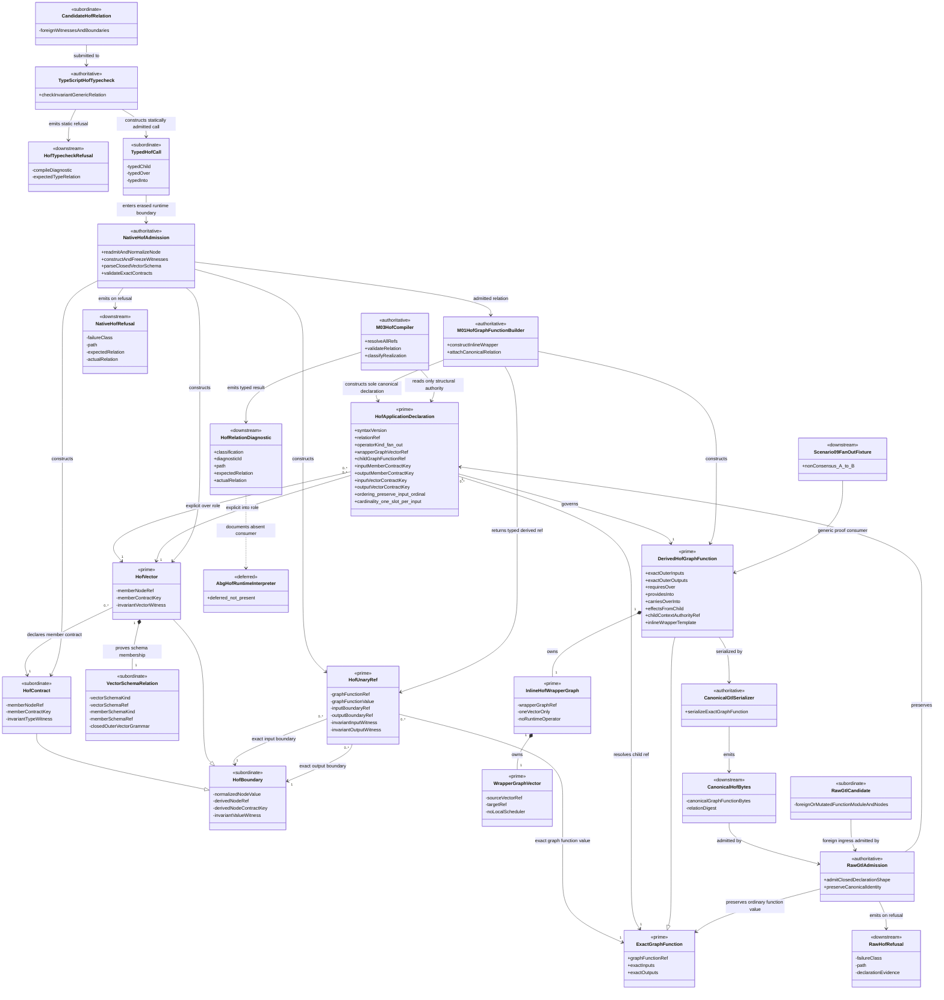
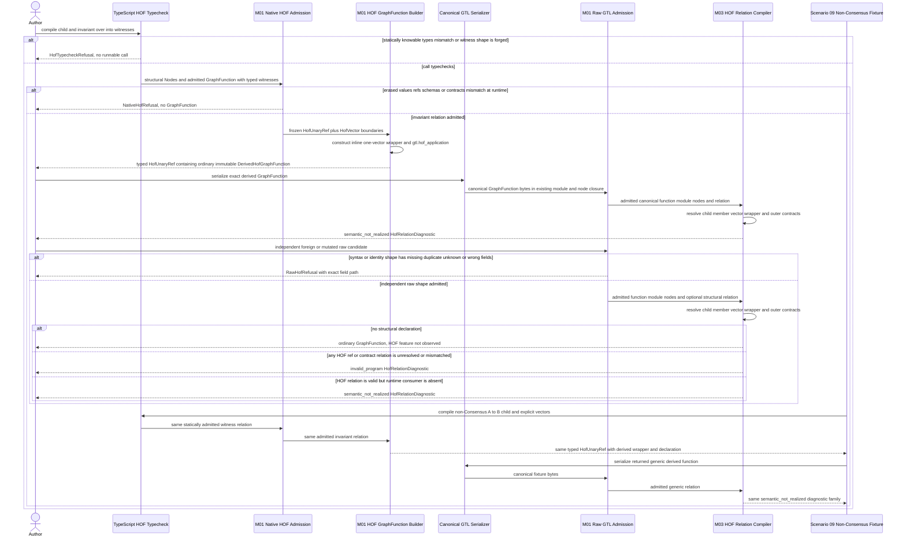
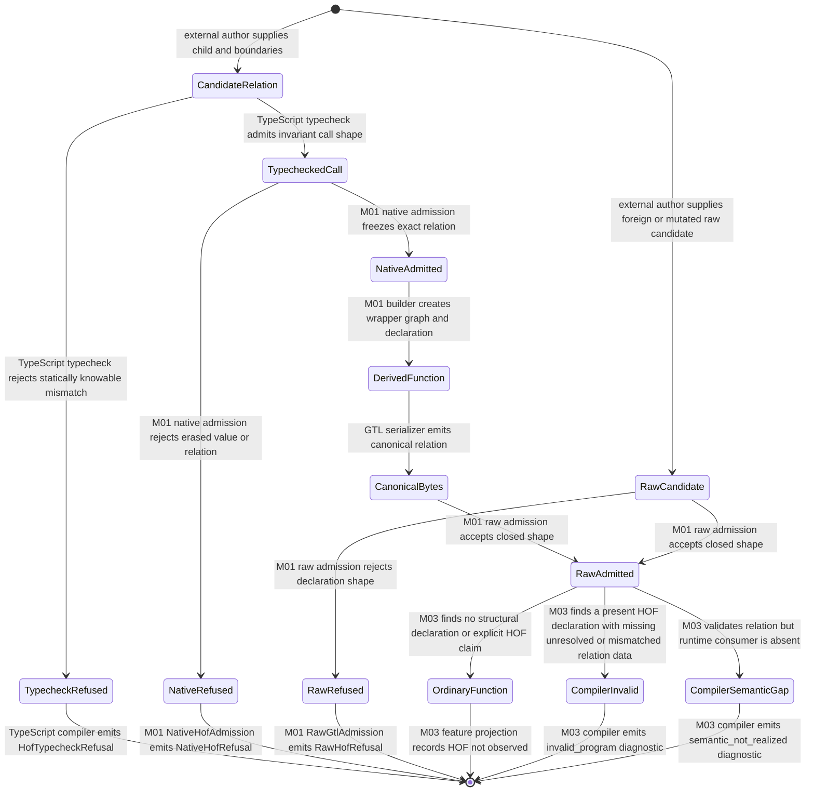

# M01/M03 Typed HOF Vector Relation Behavior Design

**Design verdict**: `candidate`
**Review status**: `pending_fh_design_review`
**Implementation admission**: `blocked`
**Ticket**: [T-253](../../../../.ai-workspace/tickets/active/T-253-close-typed-fan-out-vector-relation.md)
**Owning modules**: M01 GTL authoring/admission and M03 semantic compilation
**Requirement re-entry**: `REQ-L-GTL3-HOF`
**Product authority**: GTL graph-function algebra and atom criterion
**Method authority**: `DESIGN_MODULE_METHOD` section 5E

## Boundary

This design closes one relation:

```text
f : A -> B, over : Vector<A>, into : Vector<B>
fan_out(f, over, into) : Vector<A> -> Vector<B>
```

The output of `fan_out` is not inferred. Both vector boundaries and both member
contracts are exact admitted inputs. `fan_in` is a contrast and later census
subject, not part of this requirement reprice or realization.

The design owns native type witnesses, canonical HOF declaration data, an
inline wrapper graph, raw relation preservation, and compiler validation. It
does not own ABG interpretation of fan-out. A valid relation therefore
ends at a typed `semantic_not_realized` diagnostic in this slice.

## Current Defect

Current `fan_out(graphFunction, over)` sets `requires`, `provides`, `carries`,
`inputs`, and `outputs` to the same `over` node. A scalar child `A -> B` becomes
`Vector<A> -> Vector<A>`. The function emits no structural HOF declaration and
M03 recognizes it only from a `fan_out(` name prefix. Canonical raw roundtrip
preserves the false outer relation.

The current M01 test obscures the defect by applying `promote` after a same-node
fan-out. Promotion cannot prove that a child transformed `A` into `B`; it is not
part of this repair.

## Proposed Axioms

1. **HOF-TYPE-01**: `fan_out` relates one unary child `A -> B` to explicit
   `Vector<A> -> Vector<B>` boundaries.
2. **HOF-TYPE-02**: native witnesses are invariant and constructor-owned.
   Structurally similar objects have no HOF authority.
3. **HOF-TYPE-03**: vector membership requires both a closed structured
   `Vector[T]` parse and an explicit member contract join. A schema string
   alone, name, tag, prefix test, cast, or `promote` cannot establish it.
4. **HOF-TYPE-04**: on a wholly successful vector relation, fan-out preserves
   input ordinal and exactly one result slot per input ordinal. Completion order
   is not semantic order. Blocked-task lineage and partial failure are deferred
   to runtime design.
5. **HOF-TYPE-05**: one canonical declaration is equivalent across native,
   serialized, raw-admitted, and compiler-read forms.
6. **HOF-TYPE-06**: missing or contradictory relation truth is
   `invalid_program`; valid relation truth without a runtime consumer is
   `semantic_not_realized`.
7. **HOF-TYPE-07**: HOF declaration and validation create no runtime effect.

## Carrier Contract

| Carrier | Ownership | Identity and role |
|---|---|---|
| `HofBoundary<T>` | M01 subordinate native witness base | invariant phantom value type plus M01-normalized structural `Node` and derived `nodeContractKey` |
| `HofContract<T>` | M01 subordinate scalar witness | `HofBoundary<T>` for one exact member contract |
| `HofVector<T>` | M01 prime vector boundary | `HofBoundary<readonly T[]>` plus exact `HofContract<T>` member witness |
| `HofUnaryRef<A,B>` | M01 prime native boundary | exact admitted GraphFunction value plus invariant input/output witnesses; also carries the typed derived result |
| `HofApplicationDeclaration` | M01 prime serialized relation | one closed `fan_out` declaration carrying child, member, input/output-vector, wrapper-vector, ordinal, and preserve-cardinality refs |
| `DerivedHofGraphFunction` | ordinary GTL GraphFunction | exact vector outer interface and inline one-vector wrapper |
| `HofRelationDiagnostic` | M03 downstream projection | stable classification, path, expected/actual relation, evidence, and repair affordance |

Native witness brands use module-private, non-exported unique symbols and are
non-enumerable implementation details. An imported public symbol cannot mint a
witness. The brands do not enter canonical GTL. Canonical declaration fields do
enter GTL and are the only M03 HOF authority. Ordinary constructor rechecks
remain required because the trusted host can erase types.

## Domain Model



Domain invariants:

1. `HofBoundary<T>`, `HofContract<T>`, `HofVector<T>`, and
   `HofUnaryRef<A,B>` are invariant. A
   witness for another type cannot substitute by covariance or structural
   lookalike.
2. `HofApplicationDeclaration` requires both vector boundaries and both member
   contracts. Its operator kind is exactly `fan_out` in this slice.
3. The derived GraphFunction owns an inline wrapper graph. It never reuses an
   inline scalar child graph as its vector outer template.
4. The wrapper GraphVector carries no scheduler, loop, worker, or completion
   order. The HOF declaration is structural program truth for a later generic
   interpreter.
5. One relation declaration is authoritative. Names and tags are display and
   search data only.
6. `VectorSchemaRelation` parses exactly one canonical outer `Vector[...]`
   grammar and joins its member schema to the explicit `HofContract`. A prefix
   match, unmatched bracket, empty member, or conflicting schema kind refuses.
7. `HofTypecheckRefusal`, `NativeHofRefusal`, and `RawHofRefusal` are
   module-local diagram projections over the existing TypeScript compiler,
   `TypeError`, and ordinary GTL-admission outcomes. T-253 does not export
   three new public error carriers or vocabularies.

## Native API Shape

The accepted realization shall follow this type shape or a provably equivalent
invariant API:

```ts
interface HofBoundary<Type> {
  readonly kind: "hof_contract" | "hof_vector";
  readonly node: Node;
  readonly nodeRef: string;
  readonly nodeContractKey: string;
  readonly [HOF_BOUNDARY_TYPE]: (value: Type) => Type;
}

interface HofContract<Type> extends HofBoundary<Type> {
  readonly kind: "hof_contract";
}

interface HofVector<Item> extends HofBoundary<readonly Item[]> {
  readonly kind: "hof_vector";
  readonly member: HofContract<Item>;
}

interface HofUnaryRef<Input, Output> {
  readonly kind: "hof_unary_ref";
  readonly graphFunction: GraphFunction;
  readonly graphFunctionRef: string;
  readonly input: HofBoundary<Input>;
  readonly output: HofBoundary<Output>;
  readonly [HOF_UNARY_TYPE]: {
    readonly input: (value: Input) => Input;
    readonly output: (value: Output) => Output;
  };
}

hofContract<Type>(node: Node): HofContract<Type>;

hofVector<Item>(
  node: Node,
  member: HofContract<Item>
): HofVector<Item>;

hofUnaryRef<Input, Output>(
  graphFunction: GraphFunction,
  input: HofBoundary<Input>,
  output: HofBoundary<Output>
): HofUnaryRef<Input, Output>;

fan_out<A, B>(
  child: HofUnaryRef<A, B>,
  boundaries: { readonly over: HofVector<A>; readonly into: HofVector<B> }
): HofUnaryRef<readonly A[], readonly B[]>;

```

Constructors re-admit and normalize each supplied structural `Node` through the
existing M01 `admitNode(...)` path, then bind witness refs back to those exact
normalized Nodes and admitted GraphFunctions with `nodeContractKey(...)`.
TypeScript proves statically knowable equality; constructor admission repeats
the equality because generics erase at runtime.
No public raw carrier trusts the phantom witness. `hofVector` also uses one
closed structured vector-schema parser and checks its parsed member schema
against the explicit member witness; it does not reuse the current prefix test.
The native constructor accepts the structural `Node` value, derives its
normalized value, `nodeRef`, and `nodeContractKey`, and then mints the private
HOF witness. Callers cannot supply those strings as rival authority, and
T-253 does not introduce a global Node brand or `isAdmittedNode` predicate.

## Derived GraphFunction Contract

The ordinary GraphFunction contained by the returned typed ref has one exact
outer contract:

| Surface | Required value |
|---|---|
| `inputs` / `environment.requires` | `[over.node]` |
| `outputs` / `environment.provides` | `[into.node]` |
| `environment.carries` | stable ordered union `[over.node, into.node]` |
| `effects` | exact child `effects`; HOF adds none |
| inline graph inputs/outputs | exact outer vector nodes |
| inline graph vectors | exactly one wrapper vector from `over` to `into` |
| inline graph effects | exact child `effects` |
| inline graph contexts | `[]`; child contexts remain child-owned behind the exact child ref |
| declarations | one host-owned `gtl.hof_application`; child declarations are not copied |

The sole wrapper GraphVector is identity-complete before implementation:

| Wrapper field | Required value |
|---|---|
| `source` / `target` | `[over.node]` / `into.node` |
| `operators` / `evaluators` / `rule` | `[]` / `[]` / `null`; the HOF declaration, not a local operator, owns meaning |
| `contexts` | `[]`; wrapper adds no context and does not copy child context authority |
| `allowsSubwork` | `true`; applying the child per member is declared subordinate work |
| `declarations` | empty vector-local declaration set; the host relation is the single authority |
| `tags` | display/discovery only and excluded from HOF authority |

The child GraphFunction ref remains the authority for its internal declarations
and context requirements. The wrapper graph/vector deliberately carry no local
contexts because copying them would create a second authority. A later generic
interpreter must enter the resolved child under the child's own context truth;
T-253 returns `semantic_not_realized` and cannot invent locator/digest data.
Input/output node asset-surface required contexts remain visible through the
exact vector node contracts.

## Canonical Declaration Contract

The registered `gtl.hof_application` value is a closed JSON object with an
exact syntax version and one `fan_out` shape. Its identity-bearing fields are:

| Common field | Law |
|---|---|
| `syntax_version` | one admitted HOF syntax line |
| `relation_ref` | derived from the complete canonical relation |
| `operator_kind` | exactly `fan_out` |
| `wrapper_graph_vector_ref` | exact sole wrapper vector |
| `child_graph_function_ref` | exact admitted element child |
| `input_member_node_ref` / `input_member_contract_key` | exact member contract |
| `input_vector_node_ref` / `input_vector_contract_key` | exact `over` boundary |
| `ordering_law` | closed variant owned by operator kind |
| `cardinality_law` | closed variant owned by operator kind |

Output member and output vector refs/keys are mandatory. An unknown field, a
duplicate field, or a missing field is invalid.

The HOF-specific admitter reconstructs fields in one fixed canonical key order
before deriving `relation_ref` or the host GraphFunction identity. Independently
authored raw objects may arrive in another source order, but accepted values are
normalized to the same ordered `SerializedJsonValue`; source entry order cannot
create a second identity for the same relation.

Identity construction is acyclic: the wrapper GraphVector is derived first
from its exact outer nodes, the relation ref is derived from that wrapper ref,
child ref, contracts, ordering, and cardinality, and the host GraphFunction id
is then derived from its declaration. The relation never embeds the derived
host GraphFunction id. M03 validates that the declaration is hosted by the
GraphFunction whose wrapper and outer contracts it names.

The compiler diagnostic vocabulary is closed for this slice:

| Diagnostic id | Classification | Meaning |
|---|---|---|
| `gtl-hof-missing-field` | `invalid_program` | required variant field absent |
| `gtl-hof-unknown-field` | `invalid_program` | undeclared variant field present |
| `gtl-hof-duplicate-field` | `invalid_program` | one canonical field has two authorities |
| `gtl-hof-invalid-operator-kind` | `invalid_program` | kind is not `fan_out` |
| `gtl-hof-unresolved-ref` | `invalid_program` | child, node, vector, or wrapper ref does not resolve |
| `gtl-hof-contract-mismatch` | `invalid_program` | child/member/vector contracts do not satisfy the typed judgment |
| `gtl-hof-wrapper-mismatch` | `invalid_program` | wrapper vector or host outer interface differs from the relation |
| `gtl-hof-unrealized-fan-out` | `semantic_not_realized` | valid fan-out has no generic runtime consumer |

Raw JSON syntax failure remains owned by ordinary GTL raw admission; it does
not mint a second HOF-specific JSON parser or diagnostic family.
An explicit contradictory feature-coverage claim remains owned by the existing
GTL program feature-coverage manifest and its diagnostic vocabulary. T-253
changes fan-out observation from a name prefix to structural declaration
evidence; it does not mint a second claim carrier or HOF diagnostic for the
existing conformance-manifest boundary.

## Execution Sequence



Sequence participant mapping:

| Sequence participant | Domain boundary |
|---|---|
| `Author` | explicitly external actor |
| `Typecheck` | `TypeScriptHofTypecheck` |
| `Native` | `NativeHofAdmission` |
| `Builder` | `M01HofGraphFunctionBuilder` |
| `Serializer` | `CanonicalGtlSerializer` |
| `Raw` | `RawGtlAdmission` |
| `Compiler` | `M03HofCompiler` |
| `Fixture` | `Scenario09FanOutFixture` |

Sequence invariants:

- `Author` is explicitly external; every other participant appears in the
  domain model.
- Typecheck and native refusal precede GraphFunction construction. Raw/compiler
  refusal precedes any later publication or invocation.
- Serializer and raw admission preserve relation data; they do not infer
  missing membership or type law.
- M03 resolves identity and equality globally, then reports the absence of a
  runtime consumer. T-253 neither publishes nor invokes the derived function.
- The Scenario 09 fixture uses the same API and diagnostics as Consensus will;
  no feature-specific branch exists.

## Lifecycle State Machine



Lifecycle carrier mapping:

| State family | Domain carrier |
|---|---|
| `CandidateRelation` | `CandidateHofRelation` |
| `TypecheckRefused` | module-local `HofTypecheckRefusal` over TypeScript compiler truth |
| `TypecheckedCall` | module-local `TypedHofCall` |
| `NativeAdmitted` | constructor-owned input `HofBoundary` and child `HofUnaryRef` witnesses |
| `DerivedFunction` | returned typed `HofUnaryRef`, `HofApplicationDeclaration`, `DerivedHofGraphFunction`, and `InlineHofWrapperGraph` |
| `CanonicalBytes` | `CanonicalHofBytes` |
| `RawCandidate` | `RawGtlCandidate` |
| `RawAdmitted` | ordinary admitted `GraphFunction`, with `HofApplicationDeclaration` present only for an HOF relation |
| `OrdinaryFunction` | reused `ExactGraphFunction` with no HOF relation carrier |
| `NativeRefused` | `NativeHofRefusal` |
| `RawRefused` | `RawHofRefusal` |
| compiler invalid and semantic-gap states | `HofRelationDiagnostic` |

State invariants:

1. Only `NativeAdmitted` can reach a derived GraphFunction.
2. Only `RawAdmitted` can reach compiler classification.
3. `CompilerInvalid` and `CompilerSemanticGap` are different terminal truths.
4. `CompilerSemanticGap` is a truthful terminal for this slice; it does not
   mean HOF execution exists.
5. No state reaches worker, event, replay, archive, workspace, or product
   output.

## IACS And Authority Joins

The irreducible architectural carrier set introduced by this design is exactly
`HofVector<T>`, `HofUnaryRef<A,B>`, and `HofApplicationDeclaration`. Existing
`Node`, `GraphVector`, `Graph`, and `GraphFunction` carriers are reused without
promotion or ontology change; their diagram instances remain standard
`prime` carriers rather than defining a new stereotype. `HofBoundary`, `HofContract`,
`VectorSchemaRelation`, `TypedHofCall`, `RawGtlCandidate`, the three refusal
projections, canonical bytes, and compiler diagnostics are
subordinate or downstream implementation carriers; they are not new public
top-level APIs. Assurance records remain test and self-review evidence outside
the semantic carrier model.

| Interface | Input | Output | Owner | Refusal |
|---|---|---|---|---|
| `hofContract<T>` | structural member Node re-admitted through existing M01 admission | invariant native witness | M01 | malformed node or empty contract |
| `hofVector<T>` | structural vector Node re-admitted through existing M01 admission plus member witness | invariant vector witness | M01 | malformed/scalar boundary or member/schema mismatch |
| `hofUnaryRef<A,B>` | admitted unary child plus exact witnesses | invariant child ref | M01 | non-unary or child contract mismatch |
| `fan_out` | child ref plus explicit input/output vector witnesses | `HofUnaryRef<readonly A[],readonly B[]>` containing ordinary GraphFunction | M01 | any type or relation mismatch |
| raw HOF admission | canonical declaration | admitted declaration or refusal | M01 | closed-field/variant/identity defect |
| HOF semantic compilation | admitted module and relation | invalid or unrealized typed diagnostic | M03 | unresolved refs, mismatch, absent runtime consumer |

| Authority join | Required equality | Failure class |
|---|---|---|
| child input to fan-out member | exact node contract key | native refusal or `invalid_program` |
| child output to fan-out result member | exact node contract key | native refusal or `invalid_program` |
| input member to `Vector<A>` | exact declared member ref and contract key | native refusal or `invalid_program` |
| output member to `Vector<B>` | exact declared member ref and contract key | native refusal or `invalid_program` |
| declaration to wrapper | exact sole GraphVector ref and outer contracts | `invalid_program` |
| relation to host GraphFunction | declaration is hosted by the function whose exact wrapper and outer contracts it names; no cyclic host id in relation | `invalid_program` |
| native to raw relation | canonical digest equality | raw refusal or `invalid_program` |
| relation to runtime | generic interpreter consumer exists | `semantic_not_realized` while absent |

## Cross-View Invariants

| Check | Domain evidence | Sequence evidence | State evidence | Verdict |
|---|---|---|---|---|
| Every participant is modeled or external | all non-actor boundaries are named classes | Author alone is an actor | no hidden controller state | `pass` |
| Distinct fan-out output is explicit | HofApplicationDeclaration requires output member/vector | Author supplies `into`; no inference branch | no admission without exact relation | `pass` |
| Vector membership is structured and explicit | HofVector owns VectorSchemaRelation plus member witness | Native parses and joins before Builder | membership mismatch reaches NativeRefused | `pass` |
| Environment, effects, and context authority remain visible | derived function declares exact requires/provides/carries, inherits child effects, and retains the child ref while wrapper contexts stay empty | Builder constructs those surfaces before serialization | no admitted derived state omits or copies authority | `pass` |
| Native and raw truth agree | witnesses bind canonical declaration fields | serialize and raw admit same relation | canonical bytes precede raw admission | `pass` |
| Compiler uses structure, not names | M03 reads HofApplicationDeclaration | name/tag alone leaves an ordinary function unobserved as HOF; existing feature-coverage conformance owns contradictory manifest claims | OrdinaryFunction is terminal when no declaration exists | `pass` |
| Runtime absence is honest | runtime interpreter is deferred | T-253 reports the gap and does not publish or invoke | semantic gap terminates slice | `pass` |
| Relation is generic | Scenario 09 is a downstream consumer | same path and diagnostics | no Consensus state exists | `pass` |

## Cross-View Axiom Matrix

| Axiom | Authority | Domain evidence | Sequence evidence | State evidence | Native enforcement | Admission/compiler enforcement | Verdict | Gap owner |
|---|---|---|---|---|---|---|---|---|
| fan-out maps `A -> B` over explicit vectors | HOF-001/005/007 proposed clarification | child, member, input/output vector refs are irreducible fields | explicit `over` and `into` enter Native | mismatch reaches NativeRefused | invariant generic witnesses | exact structural relation validation | `pass` | T-253 |
| GraphFunction outer interface remains exact | GRAPHFUNCTION-002/008/017; INTERFACE-002/006 | wrapper GraphFunction owns exact interface and graph | Builder constructs ordinary GraphFunction | DerivedFunction precedes serialization | existing GraphFunction constructor plus HOF witnesses | wrapper and outer refs revalidated | `pass` | T-253 |
| cumulative environment effects and context authority are preserved | GRAPHFUNCTION-005/016/017/018; LANGUAGE-005 | requires over, provides into, carries stable union, effects copy exactly, child ref retains context authority, wrapper contexts are empty | Builder owns all surfaces before serialization | DerivedFunction cannot omit or duplicate an owned surface | existing EnvRef and Graph constructors | M03 validates child ref, outer environment, effects, and empty wrapper contexts | `pass` | T-253 |
| vector schema and member contract agree structurally | NODE-007/008; LANGUAGE-009; HOF-005 | VectorSchemaRelation joins closed parse to explicit member witness | Native parses and compares before Builder | mismatch reaches NativeRefused | invariant witness plus closed parser | M03 repeats parse/ref/contract equality | `pass` | T-253 |
| higher-order law is canonical data | LANGUAGE-002/009; HOF-006 | one serialized discriminated declaration | Serializer preserves it | RawAdmitted precedes compiler | constructor-owned declaration builder | raw closed shape and M03 resolution | `pass` | T-253 |
| native language enforces locally decidable type law | LANGUAGE-001/009 | opaque invariant brands over normalized structural Nodes | mismatch stops before builder | TypecheckRefused or NativeRefused is terminal | TypeScript generics, private symbols, existing Node admission | native admission repeats erased checks | `pass` | T-253 |
| ordinal and cardinality law is explicit | HOF-001/007 | closed fields for fan-out | Builder records, never schedules | no completion-order state exists | closed literal variants | M03 validates variant-owned values | `pass` | T-253 |
| no name tag cast or promote creates HOF truth | HOF-004/005/006; LANGUAGE-009 | no such field owns relation | names/tags alone remain ordinary; existing feature-coverage conformance owns contradictory claims | OrdinaryFunction is terminal without a declaration | API requires opaque refs | structural declaration is sole HOF evidence | `pass` | T-253 |
| missing runtime semantics is typed non-success | PRODUCT atom criterion; ODD method | deferred runtime is separate | compiler reports the gap; T-253 does not publish or invoke | CompilerSemanticGap is terminal evidence | no runtime API in witnesses | `semantic_not_realized` diagnostic | `pass` | later generic HOF runtime leaf |
| non-Consensus demand proves genericity | PRODUCT atom criterion; scenario 09 | fixture is downstream, not owner | same relation path | no feature-specific state | same public M01 API | same M03 diagnostics | `pass` | T-253 fixture |
| F_P/F_H output admission | not exercised by authoring/compiler slice | no F_P/F_H carrier exists | no worker or human participant | no probabilistic/human state | not applicable to pure declaration path | no effect handler entered | `not_applicable` | later runtime design owns effects |
| every sequence message crosses a declared semantic boundary | DESIGN_MODULE_METHOD 5E | participant classes, foreign raw candidate, and refusal/result carriers are explicit | participant mapping names every sender and receiver; canonical and foreign raw paths are distinct | corresponding typecheck, native, raw-candidate, compiler, or ordinary state exists | typed API and existing admission own native messages | raw admission or M03 owns downstream messages | `pass` | T-253 |
| every lifecycle transition has a carrier and owner | DESIGN_MODULE_METHOD 5E | candidate, typed call, witnesses, declarations, bytes, and diagnostics are modeled | the same owners perform each transition | lifecycle mapping names every state family; transition labels name the owner | TypeScript or M01 owns pre-serialization transitions | serializer, raw admission, or M03 owns later transitions | `pass` | T-253 |

## Operational Lifecycle Confirmation

| Lifecycle phase | Disposition | Owner and authority |
|---|---|---|
| upstream intent and requirement | answered by PRODUCT atom criterion and the T-253 candidate HOF reprice | F_H ratifies `REQ-L-GTL3-HOF`; design cannot self-ratify |
| build / realization | M01 typed witnesses, wrapper builder, declaration law and M03 compiler validation in the TypeScript tenant | T-253 accepted design and named code scope |
| assurance / proof | native positive/negative type lane, raw mutation pins, compiler diagnostics, Scenario 09 non-Consensus fixture, full semantic regression | TypeScript tenant test surfaces; tests prove but do not define law |
| release / packaging | included in the ordinary ABIogenesis 5.0 TypeScript package; no new package or artifact kind | T-248 later proves package census and exact candidate |
| deployment / install | no service deployment exists; the exported language/compiler API arrives through the ordinary installed package | `not_applicable` to a separate deployment mechanism; existing install law owns package installation |
| live usage / invocation | **Gap:** generic HOF runtime interpretation is absent; T-253 reports `semantic_not_realized` and does not publish or invoke | later census-driven generic runtime leaf after T-252 body probe |
| telemetry / projection / monitoring | T-253 exposes compiler diagnostics and zero-effect proof only | M03 conformance projection; **Gap:** runtime event/replay truth belongs to the later interpreter design |
| retirement / supersession | remove the implicit two-argument same-node `fan_out` route and name-prefix feature authority; migrate lawful `A -> A` calls to explicit `over` and `into` | T-253 implementation; immutable released 4.6 artifacts are not rewritten |
| lifecycle decision source | this design owns HOW; HOF requirements own WHAT; ABG runtime requirements will own execution | M01/M03 module owners under F_H and specification authority |

## Gap And Exclusion Register

| Gap or exclusion | Disposition | Owner and re-entry |
|---|---|---|
| HOF output-vector requirement is incomplete | candidate reprice in T-253 | F_H accepts exact judgment, then Phase A ratifies it |
| current `fan_out` lies `Vector<A> -> Vector<A>` | implementation blocked pending design acceptance | T-253 Phase B |
| current compiler trusts names and emits no HOF diagnostic | implementation blocked pending design acceptance | T-253 Phase C |
| HOF runtime interpretation | explicitly absent; valid declarations end semantic-not-realized | census-driven generic successor after T-252 probe |
| `workflow.C`, `C.batch`, retry, recursion execution | unrelated generic atoms | later singular accepted designs |
| Consensus body | no code in this ticket | T-252 re-entry after T-253 closure |
| `promote` semantics | no redesign here | separate requirement/design re-entry if independently demanded |
| global generic GraphFunction/Node types | rejected as disproportionate | new evidence would require separate design |

## Design Verdict

`candidate`. The relation, authority, failure classes, and non-runtime boundary
are fully specified, but F_H has not accepted the requirement reprice or this
design. No specification or code change is authorized. Acceptance permits
T-253 Phase A, then Phase B, then Phase C with a self-review after each. It does
not authorize HOF runtime execution or Consensus implementation.
