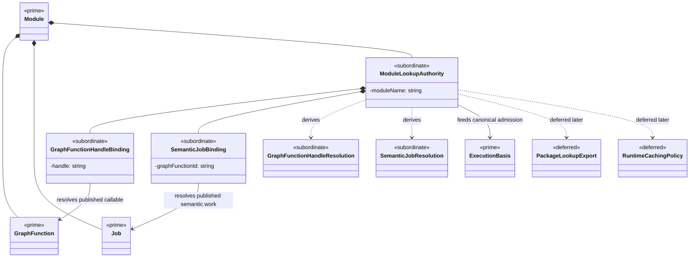

# M02 To M03 Lookup Authority Structural Carrier Diagram

**Status**: Active
**Date**: 2026-04-24
**Derived from**: [M02_M03_LOOKUP_AUTHORITY_DERIVATION.md](./M02_M03_LOOKUP_AUTHORITY_DERIVATION.md), [M02_M03_LOOKUP_AUTHORITY_IACS.md](./M02_M03_LOOKUP_AUTHORITY_IACS.md), [GTL_3_M02_WORK_PUBLICATION_IACS.md](./GTL_3_M02_WORK_PUBLICATION_IACS.md), [ABG_3_FIRST_SLICE_IACS.md](./ABG_3_FIRST_SLICE_IACS.md), [T-014](../../.ai-workspace/tickets/completed/T-014-reprice-typescript-m02-publication-lookup-and-m03-execution-resolution-under-explicit-lookup-authority.md)

## Purpose

Render the `M02-work-publication` to `M03-engine-kernel` lookup seam as one
module-bounded Mermaid UML carrier topology so Prime Rule, visibility, and
deferred-family discipline are inspectable before implementation starts.

## Diagram

## Reading Rules

- `Module`, `GraphFunction`, `Job`, and `ExecutionBasis` remain existing prime
  carriers.
- `ModuleLookupAuthority` is subordinate and module-bounded.
  It is not a new public publication or execution carrier.
- `GraphFunctionHandleBinding` and `SemanticJobBinding` are subordinate lookup
  detail only.
- callable and semantic-job resolution outcomes remain subordinate helper
  detail, not public package-facing carriers.
- package export widening and runtime caching policy remain deferred.

## Sign-Off Claim

This lookup diagram is lawful only if the future TypeScript code:

- derives lookup authority from admitted `Module` truth,
- resolves callable and job bindings through that authority,
- preserves fail-closed ambiguity and absence behavior, and
- keeps lookup detail subordinate and non-public.
